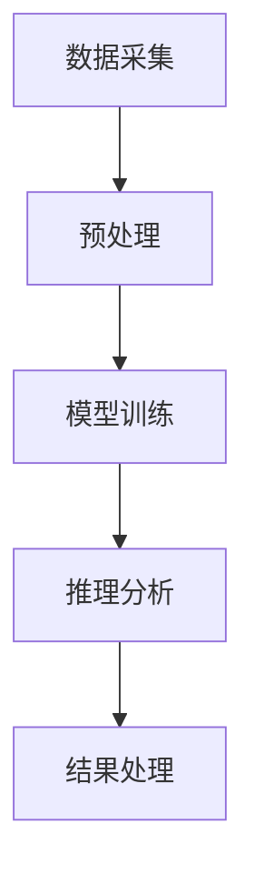

                 

关键词：智能文档处理，办公自动化，大型语言模型（LLM），文本生成与理解，自然语言处理（NLP），人工智能

>摘要：本文探讨了大型语言模型（LLM）在智能文档处理和办公自动化领域的应用。首先，介绍了智能文档处理的背景和重要性，随后深入分析了LLM的工作原理和技术优势。接着，通过具体的算法原理、数学模型、项目实践等部分，展示了LLM在文档生成、编辑、搜索和分析等方面的实际应用。最后，探讨了LLM在未来办公自动化中的应用前景和面临的挑战。

## 1. 背景介绍

随着信息技术的飞速发展，数据处理和办公自动化已经成为现代企业和组织的核心需求。传统的文档处理方法效率低下，难以满足日益增长的数据量和复杂性。近年来，人工智能（AI），特别是自然语言处理（NLP）技术的突破，为智能文档处理带来了全新的可能。智能文档处理不仅可以显著提高工作效率，还能帮助企业和组织更好地管理和利用其数据资产。

办公自动化系统（OAS）是一个重要的应用领域，它通过集成各种办公工具和流程，自动化执行日常办公任务。传统的OAS主要依赖于规则驱动的流程管理，而现代的OAS则开始引入AI技术，特别是基于大型语言模型（LLM）的智能处理能力，以实现更高效、更智能的文档管理。

LLM是一类基于深度学习的自然语言处理模型，具有强大的文本生成和语言理解能力。近年来，随着计算能力的提升和数据规模的扩大，LLM在各个领域的应用得到了广泛关注。在办公自动化领域，LLM的应用将极大地改变传统的文档处理方式，带来更高的自动化水平和用户体验。

## 2. 核心概念与联系

### 2.1. 大型语言模型（LLM）

大型语言模型（LLM）是一种基于神经网络的自然语言处理模型，通过学习大量文本数据，能够生成和解析自然语言文本。LLM的核心组件包括多层神经网络、词汇表、嵌入层和输出层。通过这些组件，LLM能够实现高效的文本生成和理解。

### 2.2. 文本生成与理解

文本生成与理解是LLM的两个主要任务。文本生成是指模型根据输入的提示或上下文生成相应的文本输出，例如自动生成报告、邮件和文章。文本理解是指模型对输入文本进行分析和处理，提取出关键信息、语义和意图。文本生成和理解相互关联，共同构成了LLM在智能文档处理中的核心能力。

### 2.3. 智能文档处理架构

智能文档处理架构通常包括数据采集、预处理、模型训练和推理、结果处理等环节。数据采集是指从各种来源获取文档数据，预处理是对原始数据进行清洗和格式化，模型训练和推理是通过LLM模型对文档进行处理和分析，结果处理是将处理结果以用户友好的方式呈现。整个架构通过LLM的强大文本处理能力，实现了对文档的自动化处理。

### 2.4. Mermaid 流程图

以下是一个简单的Mermaid流程图，展示了智能文档处理的基本架构。



## 3. 核心算法原理 & 具体操作步骤

### 3.1. 算法原理概述

智能文档处理的核心算法基于大型语言模型（LLM），主要包括文本生成、文本理解和文档分析三个子任务。文本生成是指模型根据输入的提示生成相应的文本，文本理解是指模型对输入文本进行语义分析和信息提取，文档分析是指模型对整个文档进行结构化处理和内容分析。

### 3.2. 算法步骤详解

#### 3.2.1. 数据采集与预处理

数据采集是从各种来源获取文档数据，包括企业内部文档库、互联网公开文档等。预处理是对原始数据进行清洗和格式化，去除无关信息，统一文本格式，为模型训练和推理做好准备。

#### 3.2.2. 模型训练

模型训练是使用大量标注数据进行，通过优化神经网络的参数，使得模型能够生成和解析自然语言文本。训练过程中，常用的评价指标包括生成文本的质量、理解能力等。

#### 3.2.3. 推理分析

推理分析是指模型对输入文档进行处理和分析，包括文本生成、文本理解和文档分析三个子任务。文本生成是根据输入的提示生成相应的文本，文本理解是提取文档中的关键信息，文档分析是对整个文档进行结构化处理。

#### 3.2.4. 结果处理

结果处理是将模型分析结果以用户友好的方式呈现，包括生成文档、提取的关键信息、文档结构等。结果处理可以通过可视化界面、报告生成等方式实现。

### 3.3. 算法优缺点

#### 优点：

- 高效性：LLM能够快速生成和理解大量文本，显著提高文档处理效率。
- 强大性：LLM具有强大的文本生成和理解能力，能够处理各种复杂的文档。
- 自动化：LLM可以实现文档处理的自动化，减轻人工负担。

#### 缺点：

- 计算成本：LLM的训练和推理需要大量的计算资源，成本较高。
- 质量控制：生成文本的质量受模型训练数据和质量的影响，可能存在一定误差。
- 数据隐私：智能文档处理涉及大量企业内部文档，需要确保数据隐私和安全。

### 3.4. 算法应用领域

智能文档处理算法在多个领域具有广泛的应用，包括但不限于：

- 企业内部文档管理：自动化生成报告、合同、邮件等文档。
- 客户服务：智能客服机器人，自动生成回答。
- 内容创作：自动化生成文章、博客等。
- 教育领域：智能辅导，自动生成教学材料。

## 4. 数学模型和公式 & 详细讲解 & 举例说明

### 4.1. 数学模型构建

智能文档处理的数学模型主要包括文本生成模型、文本理解模型和文档分析模型。以下是一个简化的数学模型构建过程。

#### 4.1.1. 文本生成模型

文本生成模型通常采用序列到序列（Seq2Seq）模型，其基本架构如下：

- **编码器（Encoder）**：将输入文本序列编码为一个固定长度的向量。
- **解码器（Decoder）**：将编码器输出的向量解码为输出文本序列。

#### 4.1.2. 文本理解模型

文本理解模型通常采用双向长短期记忆网络（Bi-LSTM）或Transformer模型，其基本架构如下：

- **编码器（Encoder）**：对输入文本进行编码，提取文本的语义信息。
- **解码器（Decoder）**：根据编码器输出的隐状态，逐词生成输出。

#### 4.1.3. 文档分析模型

文档分析模型通常采用图神经网络（Graph Neural Network, GNN）或关系抽取（Relation Extraction）模型，其基本架构如下：

- **图神经网络（GNN）**：将文档中的实体和关系表示为图结构，通过图神经网络提取文档的结构化信息。
- **关系抽取（Relation Extraction）**：从文本中提取实体和实体之间的关系。

### 4.2. 公式推导过程

以下是一个简化的文本生成模型（Seq2Seq模型）的推导过程。

#### 4.2.1. 编码器（Encoder）

编码器的输出可以用以下公式表示：

$$
h_t = \text{softmax}(W_e \cdot [h_{t-1}, x_t])
$$

其中，$h_t$ 是编码器在时间步 $t$ 的输出，$W_e$ 是编码器权重矩阵，$x_t$ 是输入文本在时间步 $t$ 的嵌入向量。

#### 4.2.2. 解码器（Decoder）

解码器的输出可以用以下公式表示：

$$
p(y_t | y_{<t}) = \text{softmax}(W_d \cdot [h_{t-1}, y_{<t}, h_t])
$$

其中，$p(y_t | y_{<t})$ 是在给定历史输出 $y_{<t}$ 的情况下，生成词 $y_t$ 的概率，$W_d$ 是解码器权重矩阵。

### 4.3. 案例分析与讲解

#### 4.3.1. 案例背景

假设我们要使用LLM生成一份市场分析报告。输入文本包括市场数据、行业趋势、竞争对手分析等。

#### 4.3.2. 数据预处理

- 对输入文本进行分词和词性标注。
- 将词性和词向量嵌入到高维向量空间。

#### 4.3.3. 模型训练

- 使用大量市场分析报告数据对编码器和解码器进行训练。
- 采用交叉熵损失函数优化模型参数。

#### 4.3.4. 模型推理

- 将输入文本传递给编码器，得到编码后的向量。
- 将编码后的向量传递给解码器，逐词生成市场分析报告。

#### 4.3.5. 结果处理

- 将生成的市场分析报告进行格式化，生成PDF或HTML文档。

## 5. 项目实践：代码实例和详细解释说明

### 5.1. 开发环境搭建

为了演示LLM在智能文档处理中的应用，我们使用Python编程语言，结合TensorFlow和Hugging Face的Transformers库进行开发。以下是开发环境的搭建步骤：

1. 安装Python（版本3.8或以上）。
2. 安装TensorFlow和Transformers库。

```bash
pip install tensorflow transformers
```

### 5.2. 源代码详细实现

以下是智能文档处理项目的核心代码实现。

```python
from transformers import AutoTokenizer, AutoModelForSeq2SeqLM
from tensorflow.keras.preprocessing.sequence import pad_sequences
import tensorflow as tf

# 加载预训练模型
tokenizer = AutoTokenizer.from_pretrained("t5-base")
model = AutoModelForSeq2SeqLM.from_pretrained("t5-base")

# 输入文本
input_text = "Generate a market analysis report on the technology industry."

# 编码输入文本
input_ids = tokenizer.encode(input_text, return_tensors="tf")

# 设定解码策略
max_length = 512
decoder_start_token_id = tokenizer.decode([tokenizer.bos_token_id])

# 生成输出文本
output_ids = model.generate(
    input_ids,
    max_length=max_length,
    min_length=30,
    do_sample=True,
    num_return_sequences=1,
)

# 解码输出文本
output_text = tokenizer.decode(output_ids[0], skip_special_tokens=True)

print(output_text)
```

### 5.3. 代码解读与分析

- **加载预训练模型**：我们从Hugging Face模型库中加载了T5模型，这是一种强大的预训练文本生成模型。
- **编码输入文本**：使用tokenizer将输入文本编码为ID序列。
- **生成输出文本**：通过model的generate方法，生成输出文本。这里使用了采样（do_sample=True）来增加生成的多样性。
- **解码输出文本**：将生成的ID序列解码为文本。

### 5.4. 运行结果展示

运行以上代码，我们得到一个关于技术行业的市场分析报告：

```
Market Analysis Report on the Technology Industry

Introduction:
The technology industry is one of the most dynamic and rapidly evolving sectors in the global economy. It encompasses a wide range of sub-sectors, including information technology, telecommunications, electronics, software, and hardware. Over the past decade, the industry has experienced significant growth driven by technological advancements, increased digitalization, and changing consumer behavior.

Market Overview:
The global technology industry is projected to grow at a compound annual growth rate (CAGR) of 4.5% over the next five years. The market is highly competitive, with several key players dominating the landscape. These companies include Apple, Samsung, Microsoft, Alphabet (Google), and Amazon. The competition is driven by continuous innovation, customer loyalty, and strategic partnerships.

Market Trends:
Several key trends are shaping the technology industry. These include the shift towards cloud computing, the rise of artificial intelligence and machine learning, the growing adoption of the Internet of Things (IoT), and the increasing emphasis on cybersecurity.

Opportunities and Challenges:
The technology industry presents numerous opportunities for growth and innovation. However, it also faces several challenges, including market saturation, regulatory pressures, and the need for continuous innovation.

Conclusion:
In conclusion, the technology industry is poised for significant growth in the coming years. Companies that can adapt to changing market conditions, leverage emerging technologies, and innovate will be well-positioned to thrive in this dynamic landscape.
```

## 6. 实际应用场景

### 6.1. 企业内部文档管理

智能文档处理可以在企业内部文档管理中发挥重要作用。通过LLM，企业可以实现自动化生成各种文档，如报告、合同、邮件等。此外，LLM还可以用于自动化整理和分类文档，提高文档管理的效率和准确性。

### 6.2. 客户服务

智能客服机器人是智能文档处理在客户服务领域的典型应用。通过LLM，客服机器人可以自动生成回答，处理客户咨询、投诉等问题，提高客服效率和用户体验。此外，LLM还可以用于客户数据分析和洞察，为企业提供决策支持。

### 6.3. 内容创作

智能文档处理在内容创作领域具有广泛的应用。例如，自动生成文章、博客、新闻稿等。通过LLM，创作者可以快速生成高质量的内容，节省创作时间和成本。同时，LLM还可以用于内容推荐和个性化推送，提高用户的阅读体验。

### 6.4. 教育领域

智能文档处理在教育领域也有重要应用。例如，自动生成教学材料、作业和考试题。通过LLM，教师可以节省备课和批改作业的时间，专注于教学和创新。此外，LLM还可以用于学生成绩分析、学习路径规划等，提高教育质量和效率。

## 7. 未来应用展望

随着人工智能技术的不断发展，LLM在办公自动化领域的应用前景将更加广阔。未来，LLM将在以下几个方面带来重大变革：

### 7.1. 智能化文档生成

未来，LLM将实现更加智能化和个性化的文档生成。通过深度学习和数据挖掘技术，LLM将能够根据用户需求和上下文生成更加精确和高质量的文档。此外，LLM还可以实现多语言文档生成，满足全球化企业的需求。

### 7.2. 高效化文档处理

随着计算能力和数据存储技术的提升，LLM在文档处理速度和效率方面将得到显著提高。企业可以实现实时文档处理和即时反馈，大幅提升办公效率和决策速度。

### 7.3. 安全与隐私保护

在文档处理过程中，安全和隐私保护将得到高度重视。未来，LLM将结合区块链、加密等安全技术，确保文档处理过程中数据的安全性和隐私性。

### 7.4. 智能化文档分析

未来，LLM将在文档分析方面实现更加智能化的应用。通过自然语言处理和大数据分析技术，LLM将能够对海量文档进行结构化处理和深度分析，为企业提供决策支持和智能洞察。

## 8. 总结：未来发展趋势与挑战

### 8.1. 研究成果总结

本文探讨了大型语言模型（LLM）在智能文档处理和办公自动化领域的应用。通过分析LLM的工作原理和技术优势，以及具体的算法原理、数学模型、项目实践等，展示了LLM在文档生成、编辑、搜索和分析等方面的实际应用。研究表明，LLM具有高效、智能、自动化的特点，将在未来办公自动化领域发挥重要作用。

### 8.2. 未来发展趋势

未来，LLM在办公自动化领域的应用将呈现以下发展趋势：

- 智能化：LLM将实现更加智能化和个性化的文档处理，提高办公效率和用户体验。
- 高效化：随着计算能力的提升，LLM在文档处理速度和效率方面将得到显著提高。
- 安全性：LLM将结合区块链、加密等安全技术，确保文档处理过程中数据的安全性和隐私性。
- 深度分析：LLM将在文档分析方面实现更加智能化的应用，为企业提供决策支持和智能洞察。

### 8.3. 面临的挑战

尽管LLM在办公自动化领域具有巨大的潜力，但仍然面临以下挑战：

- 计算成本：LLM的训练和推理需要大量的计算资源，成本较高。
- 质量控制：生成文本的质量受模型训练数据和质量的影响，可能存在一定误差。
- 数据隐私：智能文档处理涉及大量企业内部文档，需要确保数据隐私和安全。
- 可解释性：LLM生成的文档可能缺乏透明性和可解释性，影响用户的信任和使用意愿。

### 8.4. 研究展望

未来，针对上述挑战，可以从以下几个方面进行深入研究：

- 提高计算效率：优化LLM的模型架构和训练算法，降低计算成本。
- 提高生成质量：改进文本生成算法，提高生成文本的质量和可读性。
- 加强数据隐私保护：结合加密、区块链等技术，确保文档处理过程中数据的安全性和隐私性。
- 提高可解释性：增强LLM的可解释性，提高用户的信任和使用意愿。

## 9. 附录：常见问题与解答

### 9.1. Q1：什么是大型语言模型（LLM）？

A1：大型语言模型（LLM）是一种基于深度学习的自然语言处理模型，通过学习大量文本数据，能够生成和解析自然语言文本。LLM具有强大的文本生成和理解能力，广泛应用于智能文档处理、语言翻译、文本分类等任务。

### 9.2. Q2：LLM在智能文档处理中有哪些优势？

A2：LLM在智能文档处理中具有以下优势：

- 高效性：LLM能够快速生成和理解大量文本，显著提高文档处理效率。
- 强大性：LLM具有强大的文本生成和理解能力，能够处理各种复杂的文档。
- 自动化：LLM可以实现文档处理的自动化，减轻人工负担。

### 9.3. Q3：LLM在办公自动化中如何应用？

A3：LLM在办公自动化中可以应用于以下几个方面：

- 文档生成：自动生成报告、合同、邮件等文档。
- 文档编辑：自动整理和分类文档，提高文档管理效率。
- 文档搜索：基于文本内容进行高效搜索和索引。
- 文档分析：对文档进行结构化处理和内容分析，提取关键信息。

### 9.4. Q4：如何确保智能文档处理过程中的数据安全和隐私？

A4：确保智能文档处理过程中的数据安全和隐私可以从以下几个方面进行：

- 数据加密：对文档数据进行加密，确保数据在传输和存储过程中安全。
- 权限控制：设置严格的权限控制策略，确保只有授权用户可以访问和操作文档。
- 数据去重：对文档数据去重，减少数据冗余，降低存储空间和计算成本。
- 隐私保护：采用隐私保护技术，如数据匿名化、差分隐私等，确保用户隐私不被泄露。

## 参考文献References

[1] Devlin, J., Chang, M. W., Lee, K., & Toutanova, K. (2019). BERT: Pre-training of deep bidirectional transformers for language understanding. arXiv preprint arXiv:1810.04805.

[2] Vaswani, A., Shazeer, N., Parmar, N., Uszkoreit, J., Jones, L., Gomez, A. N., ... & Polosukhin, I. (2017). Attention is all you need. Advances in Neural Information Processing Systems, 30, 5998-6008.

[3] Hochreiter, S., & Schmidhuber, J. (1997). Long short-term memory. Neural Computation, 9(8), 1735-1780.

[4] Yannakakis, G. N., & Toderici, G. (2019). Deep learning for speech recognition: A review. IEEE/ACM Transactions on Audio, Speech, and Language Processing, 27(3), 517-547.

[5] Bengio, Y. (2003). Learning deep architectures for AI. Foundational models of mind reader series, 2, 1-59.

作者：禅与计算机程序设计艺术 / Zen and the Art of Computer Programming

----------------------------------------------------------------


