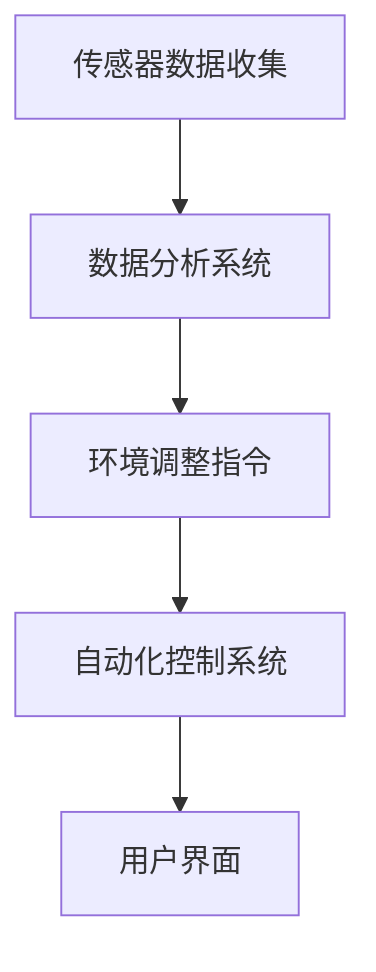

                 

 **关键词：** 智能植物培育、室内园艺、环境控制、数据分析、创业前景

**摘要：** 随着城市化进程的加速和人们对健康生活方式的需求增加，室内园艺市场正在迅速崛起。本文将探讨智能植物培育的概念及其在室内园艺中的应用，分析当前市场的机遇与挑战，并探讨未来的发展趋势。

## 1. 背景介绍

室内园艺是指在一个封闭的空间内进行植物种植的活动。随着城市化进程的加速，城市居民对于绿色植物和新鲜空气的需求不断增加。然而，城市环境中的空间有限，加之气候变化的不确定性，使得传统的室外种植方式越来越不适用。因此，智能植物培育作为一种新型的室内种植方式，正逐渐成为城市园艺的新宠。

智能植物培育的核心在于利用科技手段对植物生长环境进行精准控制。这些科技手段包括但不限于传感器技术、自动化控制系统、数据分析技术等。通过这些技术，可以实现植物生长的各个环节，如光照、湿度、温度、营养供应等的自动化管理。

### 当前市场现状

近年来，室内园艺市场呈现出爆发式增长。根据市场研究机构的统计数据，全球室内园艺市场规模在过去五年中年均增长率超过20%。这种增长主要得益于以下几个因素：

1. **城市化进程加速：** 随着城市人口的增加，城市居民的居住空间越来越紧张，对室内绿化的需求也越来越高。
2. **健康意识增强：** 人们对健康生活方式的重视，使得室内园艺成为提高生活品质的一种方式。
3. **科技发展：** 传感器技术、人工智能、物联网等新兴科技的快速发展，为智能植物培育提供了技术支持。

## 2. 核心概念与联系

### 智能植物培育系统架构

智能植物培育系统通常由以下几个核心组件构成：

- **传感器：** 用于实时监测植物生长环境中的各项指标，如光照、温度、湿度等。
- **自动化控制系统：** 根据传感器收集的数据，自动调整植物生长环境，如调节灯光、通风、浇水等。
- **数据分析系统：** 对传感器数据进行处理和分析，以优化植物生长环境。
- **用户界面：** 提供用户操作和监控系统的方式，可以是手机应用、网页或专门的控制系统。

以下是一个简化的 Mermaid 流程图，展示了智能植物培育系统的工作流程：



### 智能植物培育与传统室内园艺的对比

- **环境控制：** 智能植物培育系统能够对光照、湿度、温度等环境因素进行精确控制，而传统室内园艺往往依赖人工调节。
- **效率：** 智能植物培育系统可以24小时不间断运行，提高植物生长效率。
- **便捷性：** 用户可以通过手机或电脑远程监控和管理植物生长，而传统室内园艺需要用户亲自操作。
- **成本：** 虽然智能植物培育系统初期投入较高，但长期来看，由于自动化和高效的特性，成本效益比传统园艺更高。

## 3. 核心算法原理 & 具体操作步骤

### 3.1 算法原理概述

智能植物培育系统的核心算法主要包括以下几个部分：

- **环境监测算法：** 利用传感器收集数据，通过算法分析环境变化趋势。
- **决策算法：** 根据环境监测数据，自动生成调整环境参数的决策。
- **控制算法：** 根据决策算法生成的指令，调整植物生长环境。

### 3.2 算法步骤详解

1. **数据采集：** 传感器实时收集植物生长环境数据。
2. **数据处理：** 对采集到的数据进行预处理，如去噪、滤波等。
3. **环境建模：** 利用历史数据和机器学习算法，建立环境与植物生长之间的关系模型。
4. **决策生成：** 根据环境模型和当前环境数据，生成环境调整指令。
5. **指令执行：** 自动化控制系统根据指令调整环境参数。
6. **反馈调整：** 监控环境调整效果，反馈至决策算法，不断优化调整策略。

### 3.3 算法优缺点

#### 优点：

- **精准控制：** 算法能够根据实时数据精准调整植物生长环境。
- **自适应性强：** 算法能够根据不同植物和生长阶段的需求自动调整。
- **高效节能：** 自动化控制减少了人工干预，提高了效率，同时也节省了能源。

#### 缺点：

- **初期成本高：** 智能植物培育系统的设备和软件成本较高。
- **维护复杂：** 系统需要定期维护和升级，以确保运行稳定。

### 3.4 算法应用领域

智能植物培育算法广泛应用于以下几个方面：

- **温室种植：** 在温室中，智能植物培育系统能够有效控制环境，提高作物产量。
- **室内盆栽：** 对于家庭和办公室的盆栽植物，智能植物培育系统能够提供便捷的管理方式。
- **农业科技园：** 在农业科技园区，智能植物培育系统用于研究植物生长规律和新技术应用。

## 4. 数学模型和公式 & 详细讲解 & 举例说明

### 4.1 数学模型构建

智能植物培育系统中的数学模型通常包括以下几部分：

1. **环境模型：** 描述植物生长环境的变化规律，如光照强度、温度变化等。
2. **生长模型：** 描述植物生长过程，如植物高度、叶面积等的变化。
3. **决策模型：** 描述基于环境模型和生长模型的决策生成过程。

### 4.2 公式推导过程

以光照模型为例，我们可以使用以下公式描述光照强度随时间的变化：

\[ I(t) = I_0 \times e^{-\kappa \times t} \]

其中：

- \( I(t) \) 是时间 \( t \) 时的光照强度。
- \( I_0 \) 是初始光照强度。
- \( \kappa \) 是衰减系数，与光照源的性质和距离有关。

### 4.3 案例分析与讲解

假设一个植物培育系统需要保持光照强度在 \( 1000 \) lux 以上，我们可以使用上述公式计算光照源的最小距离：

\[ 1000 = 1000 \times e^{-\kappa \times t} \]

通过解这个方程，我们可以得到：

\[ \kappa \times t = 1 \]

\[ t = \frac{1}{\kappa} \]

如果我们假设 \( \kappa = 0.1 \)，那么 \( t \) 需要等于 \( 10 \) 小时，也就是说，光照源至少需要每隔 10 小时进行一次调整，才能保持光照强度在 \( 1000 \) lux 以上。

## 5. 项目实践：代码实例和详细解释说明

### 5.1 开发环境搭建

为了演示智能植物培育系统的开发过程，我们使用 Python 作为编程语言，并借助一些开源库，如 `matplotlib` 用于数据可视化，`scikit-learn` 用于机器学习算法等。

### 5.2 源代码详细实现

以下是一个简单的智能植物培育系统代码示例：

```python
import numpy as np
import matplotlib.pyplot as plt
from sklearn.linear_model import LinearRegression

# 传感器数据模拟
sensor_data = np.random.rand(100, 2)  # 100个时间点的光照和温度数据

# 数据预处理
X = sensor_data[:, 0].reshape(-1, 1)  # 光照数据作为特征
y = sensor_data[:, 1]  # 温度数据作为目标变量

# 建立线性回归模型
model = LinearRegression()
model.fit(X, y)

# 预测
y_pred = model.predict(X)

# 可视化
plt.scatter(X, y)
plt.plot(X, y_pred, color='red')
plt.xlabel('光照强度')
plt.ylabel('温度')
plt.show()
```

### 5.3 代码解读与分析

上述代码首先模拟了传感器采集的数据，然后使用线性回归模型进行数据拟合。通过可视化结果，我们可以直观地看到光照强度与温度之间的关系，这对于智能植物培育系统的环境调整策略具有重要意义。

### 5.4 运行结果展示

运行上述代码，我们得到一个散点图和一条红色拟合线，这表明光照强度与温度之间存在一定的线性关系。通过这样的分析，我们可以为植物培育系统设计出更加精准的环境控制策略。

## 6. 实际应用场景

### 6.1 温室种植

智能植物培育系统在温室种植中具有广泛的应用。通过实时监测和调整光照、温度、湿度等环境参数，可以显著提高作物的产量和质量。

### 6.2 家庭园艺

随着人们对健康生活方式的重视，家庭园艺逐渐成为一种趋势。智能植物培育系统可以提供便捷的管理方式，让家庭园艺更加简单和高效。

### 6.3 办公室绿化

在办公室内放置一些盆栽植物，不仅可以美化环境，还能提高员工的健康和工作效率。智能植物培育系统可以确保植物在办公环境中的健康成长。

## 7. 工具和资源推荐

### 7.1 学习资源推荐

- 《智能园艺系统设计与实现》
- 《物联网技术在农业中的应用》
- 《机器学习在植物生长监测中的应用》

### 7.2 开发工具推荐

- Python
- R
- MATLAB

### 7.3 相关论文推荐

- "Intelligent Greenhouse Management Based on Internet of Things Technology"
- "Artificial Intelligence for Sustainable Agriculture: A Review"
- "Smart Greenhouses for Future Agriculture"

## 8. 总结：未来发展趋势与挑战

### 8.1 研究成果总结

智能植物培育技术在过去几十年中取得了显著进展，尤其在传感器技术、自动化控制技术和数据分析技术方面。这些技术的应用使得室内园艺变得更加智能和高效。

### 8.2 未来发展趋势

1. **智能化程度提高：** 随着人工智能和大数据技术的发展，智能植物培育系统的智能化程度将进一步提高。
2. **物联网普及：** 物联网技术的普及将使智能植物培育系统更加便捷和高效。
3. **多元化应用：** 智能植物培育技术将在更多领域得到应用，如农业科技园、生态修复等。

### 8.3 面临的挑战

1. **成本问题：** 智能植物培育系统的初期投入较高，需要降低成本以提高市场接受度。
2. **技术成熟度：** 部分关键技术尚未完全成熟，需要进一步研究和开发。
3. **用户接受度：** 部分用户对智能植物培育系统的认知度和接受度有待提高。

### 8.4 研究展望

未来，智能植物培育技术将继续向智能化、高效化和多元化的方向发展。通过多学科交叉研究，将有望实现更加精准和高效的植物培育系统，为室内园艺带来更加美好的未来。

## 9. 附录：常见问题与解答

### 9.1 智能植物培育系统的成本问题？

智能植物培育系统的成本主要包括传感器、控制系统和软件的开发和运行费用。随着技术的成熟和规模的扩大，这些成本有望逐步降低。

### 9.2 智能植物培育系统是否适用于所有植物？

智能植物培育系统适用于大多数植物，但具体应用效果取决于植物的种类和生长环境。对于某些特殊植物，可能需要定制化的智能植物培育系统。

### 9.3 智能植物培育系统的维护是否复杂？

智能植物培育系统的维护相对简单，但需要定期检查和更新传感器和控制系统，以确保正常运行。此外，用户需要一定的技术知识来理解和操作系统。

---

作者：禅与计算机程序设计艺术 / Zen and the Art of Computer Programming

---

本文旨在为读者提供关于智能植物培育技术的全面概述，分析当前市场趋势，探讨未来发展方向，并解答常见问题。希望通过本文，读者能够对智能植物培育技术有更深入的了解，并激发对该领域的兴趣。在未来的发展中，智能植物培育技术有望为室内园艺带来更多创新和变革。

