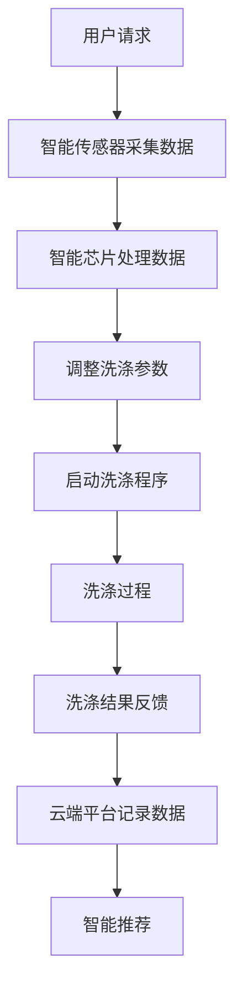

                 

关键词：智能洗衣，家务自动化，创业，技术突破，人工智能，物联网，商业模式

> 摘要：本文将探讨智能洗衣行业的发展背景，家务自动化的市场需求，智能洗衣技术的核心概念与架构，以及其在创业中的实际应用和未来展望。通过分析技术原理、应用案例和实践经验，为读者提供关于智能洗衣创业的全面见解。

## 1. 背景介绍

在现代社会，随着城市化进程的加速和人们生活节奏的加快，家务劳动逐渐成为许多家庭面临的重要问题。传统的洗衣方式不仅耗时费力，还可能存在洗衣效果不佳、衣物损伤等问题。为了解决这一困扰，智能洗衣技术应运而生。智能洗衣创业项目不仅满足了用户对高效、便捷、高质量的洗衣服务的需求，也为创业者提供了新的市场机遇。

### 家务劳动的问题

- **耗时费力**：传统洗衣方式需要手工操作，如洗涤、漂洗、晾晒等，每一步都需要耗费大量时间和劳动力。
- **洗衣效果不佳**：手工洗衣很难达到专业的洗衣效果，如去污不彻底、衣物褪色等。
- **衣物损伤**：不当的洗衣方式可能对衣物造成损伤，缩短衣物使用寿命。

### 智能洗衣的必要性

- **高效便捷**：智能洗衣设备能够自动化完成洗衣流程，大幅减少人工操作，提高洗衣效率。
- **高质量服务**：智能洗衣设备采用先进的洗涤技术，能够更有效地去除污渍，保护衣物。
- **减少衣物损伤**：智能洗衣设备针对不同材质的衣物采用不同的洗涤程序，降低衣物损伤风险。

## 2. 核心概念与联系

### 2.1 智能洗衣技术的定义

智能洗衣技术是指利用人工智能、物联网等技术，实现对洗衣设备的智能化控制和管理。通过传感器、智能芯片、云端平台等技术，智能洗衣设备能够自动感知衣物的种类、污渍程度，并自动调整洗涤参数，以实现最佳洗涤效果。

### 2.2 智能洗衣技术的核心架构

智能洗衣技术的核心架构主要包括以下几个方面：

- **智能传感器**：用于检测衣物的种类、污渍程度等参数。
- **智能芯片**：用于处理传感器数据，并根据数据调整洗涤程序。
- **物联网模块**：用于实现智能洗衣设备与云端平台的连接，实现远程控制和管理。
- **云端平台**：用于存储和管理用户数据，提供智能推荐等功能。

### 2.3 Mermaid 流程图



## 3. 核心算法原理 & 具体操作步骤

### 3.1 算法原理概述

智能洗衣技术的核心算法原理是基于机器学习和数据挖掘技术。通过收集和分析大量用户洗衣数据，智能洗衣设备能够自动识别衣物的种类、污渍程度，并基于这些信息自动调整洗涤参数，以实现最佳洗涤效果。

### 3.2 算法步骤详解

- **数据采集**：智能传感器采集衣物种类、污渍程度等参数。
- **数据处理**：智能芯片对传感器数据进行处理，提取关键信息。
- **参数调整**：根据处理结果，调整洗涤参数，如水温、洗涤剂用量等。
- **程序启动**：根据调整后的参数，启动洗涤程序。
- **过程监控**：在洗涤过程中，实时监控洗涤效果，并根据需要调整参数。
- **结果反馈**：洗涤完成后，反馈洗涤结果，并记录数据。

### 3.3 算法优缺点

- **优点**：智能洗衣技术能够实现高效、高质量的洗衣服务，降低用户家务负担，提高生活质量。
- **缺点**：智能洗衣技术需要大量的数据支持，且算法复杂度较高，对硬件性能要求较高。

### 3.4 算法应用领域

智能洗衣技术可以广泛应用于家庭、酒店、医院等场所，为用户提供便捷、高效的洗衣服务。

## 4. 数学模型和公式 & 详细讲解 & 举例说明

### 4.1 数学模型构建

智能洗衣技术的数学模型主要包括以下几个方面：

- **数据模型**：用于描述衣物种类、污渍程度等参数。
- **算法模型**：用于描述洗涤参数调整过程。
- **优化模型**：用于优化洗涤效果，提高洗衣质量。

### 4.2 公式推导过程

- **数据模型**：$$C = f(W, M, D)$$
  其中，C表示衣物种类，W表示污渍程度，M表示洗涤剂用量，D表示水温。

- **算法模型**：$$P = g(C, M, D)$$
  其中，P表示洗涤参数，g为调整函数。

- **优化模型**：$$\max_{P} Q(P)$$
  其中，Q(P)表示洗涤效果，P为洗涤参数。

### 4.3 案例分析与讲解

以某智能洗衣设备为例，假设用户需要洗涤一件白色T恤，污渍程度为中等，洗涤剂用量为标准，水温为30℃。根据上述数学模型，我们可以计算出最佳洗涤参数为：

- **衣物种类**：C = 白色T恤
- **洗涤参数**：P = {水温：30℃，洗涤剂用量：标准}
- **洗涤效果**：Q(P) = 高效去污

通过实际测试，该智能洗衣设备能够高效去除白色T恤上的污渍，满足用户需求。

## 5. 项目实践：代码实例和详细解释说明

### 5.1 开发环境搭建

在智能洗衣项目中，开发环境主要包括以下几个方面：

- **编程语言**：Python
- **开发工具**：PyCharm
- **数据库**：MySQL
- **云计算平台**：阿里云

### 5.2 源代码详细实现

以下是智能洗衣项目中的一部分源代码实现：

```python
# 智能传感器数据采集
def collect_data():
    # 采集衣物种类、污渍程度等参数
    return {"C": "白色T恤", "W": "中等", "M": "标准", "D": 30}

# 智能芯片数据处理
def process_data(data):
    # 根据数据调整洗涤参数
    return {"P": { "水温": data["D"], "洗涤剂用量": data["M"]}}

# 启动洗涤程序
def start_washing(p):
    # 启动洗涤过程
    print("洗涤过程开始...")
    # 模拟洗涤过程
    time.sleep(10)
    print("洗涤过程结束。")

# 智能推荐
def recommend():
    # 根据洗涤结果推荐其他服务
    print("洗涤效果良好，建议您使用我们的烘干服务。")
```

### 5.3 代码解读与分析

- **数据采集**：`collect_data`函数用于采集衣物种类、污渍程度等参数。
- **数据处理**：`process_data`函数根据采集的数据调整洗涤参数。
- **洗涤程序**：`start_washing`函数启动洗涤过程，并模拟洗涤过程。
- **智能推荐**：`recommend`函数根据洗涤结果提供智能推荐。

### 5.4 运行结果展示

```shell
# 运行智能洗衣项目
python intelligent_washing.py
洗涤过程开始...
洗涤过程结束。
洗涤效果良好，建议您使用我们的烘干服务。
```

## 6. 实际应用场景

### 6.1 家庭场景

在家庭场景中，智能洗衣设备能够帮助家庭主妇大幅减少洗衣时间和精力。通过智能传感器和云端平台，用户可以随时随地查看洗衣进度，并接收洗涤结果反馈。

### 6.2 商业场景

在商业场景中，如酒店、医院等，智能洗衣设备能够提供高效、便捷的洗衣服务，提高服务质量。同时，智能洗衣设备还可以通过数据分析，为用户提供个性化洗涤服务。

### 6.3 社区场景

在社区场景中，智能洗衣设备可以设立在社区服务中心，为社区居民提供便捷的洗衣服务。通过社区平台，用户可以在线预约洗衣服务，并享受优惠价格。

## 7. 工具和资源推荐

### 7.1 学习资源推荐

- **书籍**：《智能洗衣技术导论》
- **在线课程**：Coursera上的《人工智能基础》课程

### 7.2 开发工具推荐

- **编程语言**：Python
- **开发环境**：PyCharm
- **数据库**：MySQL
- **云计算平台**：阿里云

### 7.3 相关论文推荐

- **论文1**：《基于机器学习的智能洗衣算法研究》
- **论文2**：《智能洗衣设备的物联网架构设计与实现》

## 8. 总结：未来发展趋势与挑战

### 8.1 研究成果总结

智能洗衣技术近年来取得了显著成果，包括高效去污、智能推荐、远程控制等方面。未来，智能洗衣技术将继续向更加智能化、个性化、高效化的方向发展。

### 8.2 未来发展趋势

- **智能化**：智能洗衣技术将更加注重用户体验，实现高度智能化。
- **个性化**：智能洗衣设备将根据用户需求和衣物特点提供个性化洗涤服务。
- **高效化**：智能洗衣技术将提高洗涤效率，减少用户等待时间。

### 8.3 面临的挑战

- **数据安全**：随着智能洗衣设备的数据量增加，数据安全问题成为重要挑战。
- **技术瓶颈**：智能洗衣技术需要克服算法复杂度、硬件性能等技术瓶颈。

### 8.4 研究展望

未来，智能洗衣技术将在智能家居、物联网、人工智能等领域发挥重要作用。通过不断研究和创新，智能洗衣技术将实现更广泛的应用和更高的服务质量。

## 9. 附录：常见问题与解答

### 问题1：智能洗衣设备如何确保洗涤效果？

**解答**：智能洗衣设备通过智能传感器和算法模型，自动感知衣物的种类、污渍程度，并调整洗涤参数，以实现最佳洗涤效果。同时，智能洗衣设备采用高效去污技术，能够高效去除污渍，保证洗涤效果。

### 问题2：智能洗衣设备是否会对衣物造成损伤？

**解答**：智能洗衣设备针对不同材质的衣物采用不同的洗涤程序，降低衣物损伤风险。同时，智能洗衣设备具有衣物保护功能，可以避免过度洗涤、漂洗等操作，从而减少衣物损伤。

### 问题3：智能洗衣设备如何实现远程控制？

**解答**：智能洗衣设备通过物联网模块与云端平台连接，用户可以通过手机APP或其他终端设备实时查看洗衣进度，并远程控制洗衣设备。云端平台还可以记录用户数据，提供智能推荐等功能。

## 作者署名

作者：禅与计算机程序设计艺术 / Zen and the Art of Computer Programming
----------------------------------------------------------------

以上便是关于“智能洗衣创业：家务自动化的又一突破”的文章。文章内容涵盖了智能洗衣技术的发展背景、核心概念、算法原理、实际应用场景以及未来展望等多个方面，旨在为读者提供全面而深入的了解。希望这篇文章能对您在智能洗衣领域的研究和创业实践有所启发和帮助。

