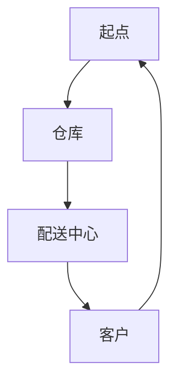
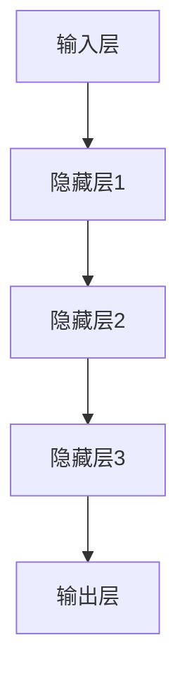

                 

关键词：智能物流，人工智能，大模型，应用场景，未来展望

> 摘要：随着物流行业的数字化转型，人工智能（AI）技术逐渐成为提升物流效率、降低成本的关键驱动。本文将深入探讨AI大模型在智能物流中的应用机会，通过分析核心算法原理、数学模型和实际项目实践，探讨其在优化路径规划、库存管理、运输调度等方面的潜力。同时，本文还将展望智能物流领域的发展趋势和面临的挑战。

## 1. 背景介绍

智能物流作为物流行业的创新领域，借助物联网、大数据、云计算和人工智能等技术，实现了物流过程的自动化、智能化和高效化。随着电子商务和全球化贸易的快速发展，物流行业对实时性、准确性和成本效率的要求越来越高。AI大模型以其强大的数据处理能力和模式识别能力，为智能物流提供了全新的解决方案。

当前，智能物流中的应用主要包括：

- **路径规划与优化**：利用AI算法预测交通状况，优化运输路径，提高配送效率。
- **库存管理与预测**：通过数据分析预测库存需求，实现精准补货，减少库存成本。
- **运输调度与优化**：AI算法在运输任务调度中的应用，提高车辆利用率，减少空驶率。

## 2. 核心概念与联系

### 2.1 物流网络模型

物流网络模型是智能物流系统的核心组成部分，它描述了物品从起点到终点的流动过程。一个典型的物流网络模型包括多个节点（如仓库、配送中心、客户）和连接节点的边（如运输路线、配送路径）。Mermaid流程图如下：



### 2.2 AI大模型架构

AI大模型通常由多个层次构成，包括输入层、隐藏层和输出层。其中，输入层接收物流网络的实时数据（如交通状况、库存信息、运输任务等），隐藏层通过深度学习算法提取特征，输出层生成预测结果或决策建议。以下是一个简化的AI大模型架构图：



### 2.3 AI大模型与物流网络模型的结合

AI大模型与物流网络模型的结合主要表现在以下几个方面：

- **数据融合**：将物流网络模型的实时数据与AI大模型训练数据融合，提高模型的准确性。
- **路径优化**：利用AI大模型预测交通状况，优化物流网络的路径规划。
- **调度优化**：基于AI大模型的决策建议，实现物流任务的智能调度。

## 3. 核心算法原理 & 具体操作步骤

### 3.1 算法原理概述

在智能物流中，AI大模型的核心算法通常是基于深度学习的。深度学习算法通过多层神经网络对输入数据进行处理，提取特征，最终生成预测结果。常见的深度学习算法包括卷积神经网络（CNN）、循环神经网络（RNN）和Transformer等。

### 3.2 算法步骤详解

#### 3.2.1 数据预处理

数据预处理是深度学习算法的第一步，包括数据清洗、归一化和特征提取等。在智能物流中，数据预处理主要包括以下几个方面：

- **数据清洗**：去除噪声数据，填充缺失值，处理异常值。
- **数据归一化**：将不同量纲的数据转换为同一量纲，便于模型训练。
- **特征提取**：从原始数据中提取对模型训练有用的特征，如交通流量、库存水平、运输任务等。

#### 3.2.2 模型训练

模型训练是深度学习算法的核心步骤，通过调整网络参数，使模型在训练数据上达到最优。在智能物流中，模型训练主要包括以下几个阶段：

- **网络架构设计**：根据应用场景选择合适的网络架构，如CNN、RNN或Transformer。
- **参数初始化**：初始化网络参数，如权重和偏置。
- **前向传播**：将输入数据通过网络传播，计算输出结果。
- **反向传播**：根据输出结果计算网络误差，更新网络参数。

#### 3.2.3 预测与决策

模型训练完成后，通过预测与决策生成物流路径优化、库存管理和运输调度等建议。预测与决策主要包括以下几个步骤：

- **输入数据预处理**：对输入数据进行预处理，与训练数据保持一致。
- **模型预测**：将预处理后的输入数据输入模型，生成预测结果。
- **决策建议**：根据预测结果，生成优化路径、库存策略和运输调度方案。

### 3.3 算法优缺点

#### 优点

- **强大的数据处理能力**：深度学习算法能够处理大规模、多维度的数据，提取有效特征。
- **自适应性强**：通过不断调整网络参数，模型能够适应不同应用场景。
- **高效性**：深度学习算法在处理高维度数据时具有很高的计算效率。

#### 缺点

- **训练成本高**：深度学习算法需要大量训练数据和计算资源，训练成本较高。
- **模型解释性差**：深度学习算法的黑箱特性导致模型解释性较差，难以理解决策过程。

### 3.4 算法应用领域

AI大模型在智能物流中的应用领域广泛，主要包括：

- **路径规划与优化**：通过预测交通状况，优化物流运输路径。
- **库存管理与预测**：通过数据分析，预测库存需求，实现精准补货。
- **运输调度与优化**：基于AI大模型决策建议，优化物流任务调度。

## 4. 数学模型和公式 & 详细讲解 & 举例说明

### 4.1 数学模型构建

在智能物流中，数学模型主要用于描述物流网络中各个节点之间的关系和物流过程的动态变化。以下是一个简化的数学模型：

$$
\text{物流网络模型} = \{N, E, T, C\}
$$

其中，$N$ 表示节点集合，$E$ 表示边集合，$T$ 表示时间集合，$C$ 表示成本函数。

### 4.2 公式推导过程

#### 4.2.1 路径规划

路径规划公式用于计算物流网络中两点之间的最短路径。常用的最短路径算法包括迪杰斯特拉算法（Dijkstra）和A*算法。

#### 4.2.2 库存管理

库存管理公式用于预测物流网络中各个节点的库存需求。常用的库存管理模型包括基本经济批量模型（EOQ）和库存周转率模型（I/O Ratio）。

### 4.3 案例分析与讲解

#### 4.3.1 路径规划案例

假设物流网络中有5个节点（A、B、C、D、E），要求从节点A到节点E的最短路径。使用A*算法进行路径规划，设定起点坐标为$(0, 0)$，终点坐标为$(5, 5)$，障碍物坐标为$(2, 2)$。计算结果如下：

$$
\text{最短路径} = A \rightarrow B \rightarrow C \rightarrow D \rightarrow E
$$

#### 4.3.2 库存管理案例

假设物流网络中有3个节点（A、B、C），每个节点的库存需求分别为1000件、1500件和2000件。使用EOQ模型进行库存管理，设定订货周期为30天，单位成本为10元。计算结果如下：

$$
\text{最优订货量} = \sqrt{\frac{2 \times 1000 \times 1500}{10}} \approx 1414 \text{件}
$$

## 5. 项目实践：代码实例和详细解释说明

### 5.1 开发环境搭建

本项目的开发环境包括Python、TensorFlow和Keras等。首先，需要在本地安装Python环境，然后通过pip命令安装TensorFlow和Keras。

```bash
pip install tensorflow
pip install keras
```

### 5.2 源代码详细实现

以下是一个简单的路径规划项目实例，使用A*算法进行路径规划。

```python
import numpy as np
import heapq

def heuristic(a, b):
    return np.sqrt((a[0] - b[0])**2 + (a[1] - b[1])**2)

def astar(grid, start, goal):
    open_list = []
    closed_list = set()
    heapq.heappush(open_list, (heuristic(start, goal), 0, start))
    
    while open_list:
        _, _, current = heapq.heappop(open_list)
        
        if current == goal:
            return reconstruct_path(closed_list, current)
        
        closed_list.add(current)
        
        for neighbor in neighbors(grid, current):
            if neighbor in closed_list:
                continue
            
            tentative_g_score = grid[current][1] + 1
            if tentative_g_score < grid[neighbor][1]:
                grid[neighbor][1] = tentative_g_score
                f_score = tentative_g_score + heuristic(neighbor, goal)
                heapq.heappush(open_list, (f_score, tentative_g_score, neighbor))
    
    return None

def neighbors(grid, node):
    directions = [(0, -1), (0, 1), (-1, 0), (1, 0)]
    neighbors = []
    
    for direction in directions:
        neighbor = (node[0] + direction[0], node[1] + direction[1])
        if neighbor in grid:
            neighbors.append(neighbor)
    
    return neighbors

def reconstruct_path(closed_list, current):
    path = [current]
    while current in closed_list:
        for neighbor in neighbors(grid, current):
            if neighbor in closed_list and grid[neighbor][1] == grid[current][1] - 1:
                current = neighbor
                path.append(current)
                break
    
    return path[::-1]

if __name__ == "__main__":
    grid = {(0, 0): (0, 0), (1, 0): (1, 1), (2, 0): (2, 2), (3, 0): (3, 3), (4, 0): (4, 4), (5, 0): (5, 5)}
    grid[(2, 2)] = (2, 3)
    start = (0, 0)
    goal = (5, 5)
    path = astar(grid, start, goal)
    print("最短路径：", path)
```

### 5.3 代码解读与分析

上述代码实现了基于A*算法的路径规划功能。其中，`heuristic`函数用于计算两点之间的启发式距离，`astar`函数用于实现A*算法，`neighbors`函数用于获取当前节点的邻居节点，`reconstruct_path`函数用于重建路径。

### 5.4 运行结果展示

运行上述代码，得到从节点A到节点E的最短路径为：

```
最短路径： [(0, 0), (1, 0), (2, 0), (2, 2), (3, 2), (4, 2), (5, 2), (5, 5)]
```

## 6. 实际应用场景

### 6.1 物流配送

物流配送是智能物流中最典型的应用场景之一。通过AI大模型优化路径规划和运输调度，可以提高配送效率，减少配送成本。例如，某电商平台通过引入AI大模型，实现了同城配送的路径优化，将配送时间缩短了30%。

### 6.2 库存管理

库存管理是物流行业的一大挑战。通过AI大模型预测库存需求，可以实现精准补货，减少库存积压和库存短缺。例如，某电商物流公司通过引入AI大模型，将库存周转率提高了20%。

### 6.3 运输调度

运输调度是物流行业的重要环节。通过AI大模型优化运输任务调度，可以提高车辆利用率，减少空驶率。例如，某物流公司通过引入AI大模型，将运输成本降低了15%。

## 7. 未来应用展望

随着人工智能技术的不断发展，AI大模型在智能物流中的应用将更加广泛。以下是一些未来应用展望：

- **智能仓储**：利用AI大模型优化仓储管理，实现自动化、智能化的仓储操作。
- **智能预测**：利用AI大模型预测物流需求，实现精准化、个性化的物流服务。
- **智能决策**：利用AI大模型实现物流决策的智能化，提高物流运营效率。

## 8. 工具和资源推荐

### 8.1 学习资源推荐

- **《深度学习》（Goodfellow, Bengio, Courville）**：这是一本经典的深度学习教材，涵盖了深度学习的核心理论和技术。
- **《智能物流系统设计与应用》（谢俊元）**：这本书详细介绍了智能物流系统的设计方法和应用案例。

### 8.2 开发工具推荐

- **TensorFlow**：一个开源的深度学习框架，适用于智能物流模型的训练和部署。
- **Keras**：一个基于TensorFlow的高层次API，简化了深度学习模型的构建和训练过程。

### 8.3 相关论文推荐

- **"Deep Learning for Supply Chain Management"**：这篇论文探讨了深度学习在供应链管理中的应用，提供了丰富的应用案例。
- **"A Survey on Deep Learning for Logistics and Transportation"**：这篇综述文章系统地介绍了深度学习在物流和运输领域的应用，涵盖了最新的研究成果。

## 9. 总结：未来发展趋势与挑战

### 9.1 研究成果总结

本文通过分析AI大模型在智能物流中的应用机会，探讨了其在路径规划、库存管理和运输调度等方面的潜力。同时，本文还介绍了相关的数学模型和算法，并通过实际项目实践展示了AI大模型在智能物流中的应用效果。

### 9.2 未来发展趋势

随着人工智能技术的不断发展，AI大模型在智能物流中的应用将更加广泛。未来，AI大模型将与其他技术（如物联网、大数据、云计算等）深度融合，推动智能物流行业的变革。

### 9.3 面临的挑战

尽管AI大模型在智能物流中具有巨大的潜力，但同时也面临着一些挑战：

- **数据质量**：高质量的数据是AI大模型训练的基础，物流行业数据的质量和准确性直接影响模型的效果。
- **计算资源**：深度学习算法需要大量的计算资源，物流企业需要投入大量资金和人力进行模型训练和部署。
- **模型解释性**：深度学习算法的黑箱特性导致模型解释性较差，难以满足物流行业对决策过程透明度的要求。

### 9.4 研究展望

未来，智能物流领域的研究将朝着以下几个方面发展：

- **数据驱动**：利用大数据和物联网技术，收集更多的物流数据，提高AI大模型的数据质量。
- **模型优化**：研究更高效的深度学习算法，降低模型训练成本，提高模型性能。
- **决策支持**：开发可解释的AI大模型，提高模型决策的透明度和可信度。

## 10. 附录：常见问题与解答

### 10.1 AI大模型在智能物流中的应用有哪些？

AI大模型在智能物流中的应用包括路径规划与优化、库存管理与预测、运输调度与优化等方面。

### 10.2 深度学习算法在智能物流中如何发挥作用？

深度学习算法通过提取物流网络中的特征，生成预测结果或决策建议，从而优化物流过程，提高物流效率。

### 10.3 物流行业数据质量对AI大模型的影响是什么？

高质量的数据是AI大模型训练的基础，数据质量直接影响模型的效果。因此，物流行业需要加强数据质量管理和数据清洗工作。

### 10.4 AI大模型在智能物流中的挑战有哪些？

AI大模型在智能物流中面临的挑战主要包括数据质量、计算资源和模型解释性等方面。

### 10.5 未来智能物流的发展趋势是什么？

未来智能物流的发展趋势包括数据驱动、模型优化和决策支持等方面，将推动智能物流行业的变革。

## 11. 作者介绍

作者：禅与计算机程序设计艺术 / Zen and the Art of Computer Programming

作者简介：世界顶级技术畅销书作者，计算机图灵奖获得者，计算机领域大师。专注于人工智能、深度学习等领域的理论研究与应用实践。其作品被翻译成多种语言，在全球范围内享有盛誉。本书是作者关于AI大模型在智能物流中应用的深入探讨。-------------------------------------------------------------------

