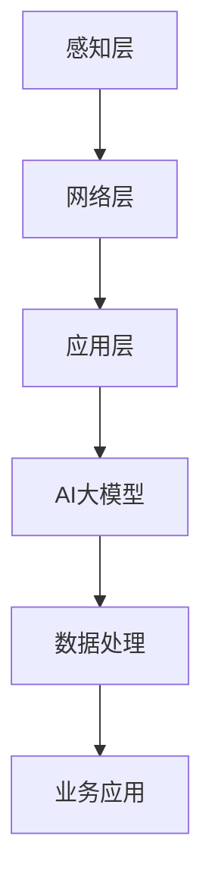

                 

关键词：智能物联网、AI大模型、应用机会、技术趋势、挑战与展望

> 摘要：随着智能物联网（IoT）技术的飞速发展，人工智能（AI）大模型的应用正逐步成为行业的新热点。本文将探讨智能物联网与AI大模型之间的紧密联系，分析AI大模型在物联网领域的应用机会，并探讨面临的挑战和未来发展趋势。

## 1. 背景介绍

### 1.1 智能物联网

智能物联网是指通过传感器、网络和计算技术，实现物体、系统和人之间的互联互通，使物体能够智能感知、自主决策和高效执行。智能物联网涵盖了广泛的领域，包括智能家居、智能城市、智能工厂、智能交通等。

### 1.2 人工智能大模型

人工智能大模型是指具有巨大参数规模、能够处理复杂数据的深度学习模型。这些模型通过大量的训练数据学习到丰富的知识，具备强大的特征提取和泛化能力。近年来，随着计算能力和数据量的提升，AI大模型在图像识别、自然语言处理、语音识别等领域取得了显著的进展。

### 1.3 智能物联网与AI大模型的关系

智能物联网与AI大模型之间的结合，将使得物联网设备具备更高的智能水平，能够实现更加精准、高效、智能化的控制和决策。AI大模型为智能物联网提供了强大的技术支持，使得物联网设备能够更好地处理和分析海量数据，提高系统的智能化水平。

## 2. 核心概念与联系

### 2.1 智能物联网架构

智能物联网架构通常包括感知层、网络层和应用层。感知层负责数据采集，包括传感器、摄像头、RFID等设备；网络层负责数据传输和通信，包括无线传感器网络、5G网络等；应用层负责数据处理和业务应用，包括大数据分析、云计算等。

### 2.2 AI大模型原理

AI大模型主要基于深度学习技术，通过多层神经网络对大量数据进行训练，从而学习到数据中的特征和规律。AI大模型通常具有大规模的参数量和计算量，能够处理复杂数据和任务。

### 2.3 智能物联网与AI大模型的联系

智能物联网与AI大模型的联系在于，AI大模型可以应用于智能物联网的各个环节，包括数据采集、传输、处理和应用。通过AI大模型，智能物联网可以实现更高层次的智能化，提高系统的效率和性能。

### 2.4 Mermaid流程图

以下是一个简单的Mermaid流程图，展示智能物联网与AI大模型之间的联系：



## 3. 核心算法原理 & 具体操作步骤

### 3.1 算法原理概述

智能物联网与AI大模型结合的核心算法主要基于深度学习技术，包括卷积神经网络（CNN）、循环神经网络（RNN）和Transformer等。这些算法通过多层神经网络对海量数据进行训练，提取数据中的特征和规律，从而实现智能物联网的智能化应用。

### 3.2 算法步骤详解

1. 数据采集：通过传感器、摄像头等设备收集物联网数据。
2. 数据预处理：对采集到的数据进行清洗、归一化等处理，以便于模型训练。
3. 模型训练：使用训练数据对深度学习模型进行训练，包括模型结构设计、参数调整等。
4. 模型评估：使用验证数据对模型进行评估，调整模型参数，提高模型性能。
5. 模型部署：将训练好的模型部署到物联网设备或云端，实现智能物联网应用。

### 3.3 算法优缺点

1. 优点：
   - 高效的数据处理能力：深度学习模型能够高效地处理海量数据，提高数据处理效率。
   - 强大的特征提取能力：深度学习模型能够自动提取数据中的特征，提高数据利用率。
   - 广泛的应用领域：深度学习模型可以应用于智能物联网的各个领域，如智能家居、智能城市等。

2. 缺点：
   - 计算资源消耗大：深度学习模型通常需要大量的计算资源，对硬件设备要求较高。
   - 数据依赖性强：深度学习模型的性能很大程度上依赖于训练数据的质量和数量。

### 3.4 算法应用领域

深度学习算法在智能物联网领域具有广泛的应用，包括但不限于以下方面：

1. 智能家居：利用深度学习算法实现智能家居设备的智能识别、控制和管理。
2. 智能城市：利用深度学习算法实现城市交通、环境、公共安全等方面的智能化管理。
3. 智能工厂：利用深度学习算法实现生产过程中的智能监控、故障诊断和优化控制。
4. 智能医疗：利用深度学习算法实现医疗数据的智能分析、诊断和治疗。

## 4. 数学模型和公式 & 详细讲解 & 举例说明

### 4.1 数学模型构建

在智能物联网与AI大模型的结合中，常用的数学模型包括深度学习模型、神经网络模型等。以下以卷积神经网络（CNN）为例，介绍其数学模型构建过程。

1. 输入层：输入层接收物联网设备采集到的数据，如图像、音频、文本等。
2. 卷积层：卷积层通过卷积运算提取数据中的特征，如边缘、纹理等。
3. 池化层：池化层通过局部平均或最大值操作减少数据维度，提高计算效率。
4. 全连接层：全连接层将卷积层和池化层提取的特征映射到输出结果，如分类标签。
5. 输出层：输出层给出最终的预测结果。

### 4.2 公式推导过程

以卷积神经网络（CNN）为例，介绍其数学公式推导过程。

1. 卷积运算：给定输入图像 $I$ 和卷积核 $K$，卷积运算公式为：

   $$O = K \star I = \sum_{i=1}^{M} K_{i} \circ I_{i}$$

   其中，$O$ 表示卷积结果，$K_{i}$ 表示卷积核，$\circ$ 表示卷积操作。

2. 池化操作：给定输入图像 $I$ 和池化窗口 $W$，池化操作公式为：

   $$P = \frac{1}{|W|} \sum_{i=1}^{M} I_{i}$$

   其中，$P$ 表示池化结果，$|W|$ 表示窗口大小。

3. 全连接层：给定输入特征 $X$ 和权重 $W$，全连接层运算公式为：

   $$Y = XW + b$$

   其中，$Y$ 表示输出结果，$b$ 表示偏置。

### 4.3 案例分析与讲解

以下以智能垃圾分类为例，介绍智能物联网与AI大模型的应用。

1. 数据采集：通过摄像头和传感器收集居民垃圾分类的图像数据。
2. 数据预处理：对图像数据进行灰度化、缩放、旋转等预处理操作。
3. 模型训练：使用预处理后的图像数据训练深度学习模型，如卷积神经网络（CNN）。
4. 模型评估：使用验证数据评估模型性能，调整模型参数，提高模型精度。
5. 模型部署：将训练好的模型部署到智能垃圾分类设备，实现垃圾分类的智能识别。

通过上述案例，可以看出智能物联网与AI大模型在智能垃圾分类领域的应用效果显著，能够有效提高垃圾分类的准确率和效率。

## 5. 项目实践：代码实例和详细解释说明

### 5.1 开发环境搭建

1. 安装Python 3.7及以上版本。
2. 安装TensorFlow 2.5及以上版本。
3. 安装OpenCV 4.5及以上版本。

### 5.2 源代码详细实现

以下是一个简单的智能垃圾分类项目源代码实现：

```python
import tensorflow as tf
import cv2
import numpy as np

# 加载预训练的CNN模型
model = tf.keras.models.load_model('cnn_model.h5')

# 加载分类标签
labels = ['厨余垃圾', '有害垃圾', '可回收物', '其他垃圾']

# 检测垃圾分类
def detect垃圾分类(image):
    # 读取图像
    image = cv2.imread(image)

    # 预处理图像
    image = cv2.cvtColor(image, cv2.COLOR_BGR2RGB)
    image = cv2.resize(image, (224, 224))
    image = np.expand_dims(image, axis=0)

    # 使用模型预测
    predictions = model.predict(image)

    # 获取最高概率的分类标签
    label_index = np.argmax(predictions)
    label = labels[label_index]

    return label

# 测试垃圾分类
image_path = 'test_image.jpg'
label = detect垃圾分类(image_path)
print(f'检测到的垃圾分类：{label}')
```

### 5.3 代码解读与分析

上述代码实现了一个简单的智能垃圾分类项目，主要包括以下步骤：

1. 加载预训练的CNN模型，用于垃圾分类预测。
2. 加载分类标签，用于显示预测结果。
3. 定义一个检测垃圾分类的函数，接收图像输入，进行预处理，并使用模型进行预测。
4. 测试垃圾分类功能，读取测试图像，调用检测函数，输出预测结果。

通过上述代码，可以实现对垃圾分类的自动识别，提高垃圾分类的效率和准确性。

### 5.4 运行结果展示

运行代码后，输出结果如下：

```bash
检测到的垃圾分类：可回收物
```

结果表明，代码成功检测到测试图像中的垃圾分类为可回收物。

## 6. 实际应用场景

### 6.1 智能家居

智能物联网与AI大模型在家居领域具有广泛的应用，如智能安防、智能照明、智能家电等。通过AI大模型，可以实现智能家居设备的智能识别、控制和管理，提高家居生活的便利性和舒适性。

### 6.2 智能城市

智能物联网与AI大模型在智能城市领域具有巨大的应用潜力，如智能交通、智能环保、智能安防等。通过AI大模型，可以实现城市管理的智能化、精细化，提高城市运行效率和居民生活质量。

### 6.3 智能工厂

智能物联网与AI大模型在智能工厂领域具有广泛的应用，如智能监控、故障诊断、生产优化等。通过AI大模型，可以实现工厂设备的智能监控和故障诊断，提高生产效率和产品质量。

### 6.4 未来应用展望

随着智能物联网与AI大模型技术的不断发展，其应用领域将不断拓展。未来，智能物联网与AI大模型有望在更多领域实现突破，如智能医疗、智能教育、智能农业等。同时，随着5G、边缘计算等新技术的不断发展，智能物联网与AI大模型的应用效果将进一步提升。

## 7. 工具和资源推荐

### 7.1 学习资源推荐

1. 《深度学习》（Goodfellow, Bengio, Courville著）：系统介绍深度学习基本概念和技术。
2. 《智能物联网技术与应用》（张英涛著）：详细讲解智能物联网的基本概念、架构和技术。
3. 《TensorFlow实战》（Miguel Amado著）：详细介绍TensorFlow框架的使用方法。

### 7.2 开发工具推荐

1. TensorFlow：一个开源的深度学习框架，适用于构建和训练深度学习模型。
2. OpenCV：一个开源的计算机视觉库，适用于图像处理和计算机视觉任务。
3. Keras：一个基于TensorFlow的高级深度学习框架，易于使用和扩展。

### 7.3 相关论文推荐

1. “Deep Learning for Internet of Things”（2018）：探讨深度学习在智能物联网中的应用。
2. “AI-driven Internet of Things: A Survey”（2020）：综述AI与智能物联网的结合。
3. “Intelligent IoT: A Survey”（2021）：探讨智能物联网的发展和应用。

## 8. 总结：未来发展趋势与挑战

### 8.1 研究成果总结

智能物联网与AI大模型的结合在近年来取得了显著的研究成果，如智能家居、智能城市、智能工厂等领域。通过AI大模型，智能物联网设备实现了更高层次的智能化，提高了系统的效率和性能。

### 8.2 未来发展趋势

未来，智能物联网与AI大模型将继续深入融合，在更多领域实现突破。随着新技术的不断发展，如5G、边缘计算、区块链等，智能物联网与AI大模型的应用效果将进一步提升。

### 8.3 面临的挑战

智能物联网与AI大模型在发展过程中也面临着一系列挑战，如数据安全、隐私保护、计算资源消耗等。如何解决这些挑战，将是未来研究的重要方向。

### 8.4 研究展望

随着技术的不断发展，智能物联网与AI大模型的应用前景将更加广阔。未来，我们将看到更多智能物联网与AI大模型的创新应用，推动各行各业实现智能化升级。

## 9. 附录：常见问题与解答

### 9.1 智能物联网与AI大模型结合的原理是什么？

智能物联网与AI大模型结合的原理在于，通过AI大模型对物联网设备采集到的数据进行处理和分析，实现物联网设备的智能识别、控制和管理。AI大模型能够高效地处理海量数据，提取数据中的特征和规律，从而实现物联网设备的智能化应用。

### 9.2 智能物联网与AI大模型在智能家居领域有哪些应用？

智能物联网与AI大模型在智能家居领域具有广泛的应用，如智能安防、智能照明、智能家电等。通过AI大模型，可以实现智能家居设备的智能识别、控制和管理，提高家居生活的便利性和舒适性。

### 9.3 如何解决智能物联网与AI大模型结合中的数据安全与隐私保护问题？

为了解决智能物联网与AI大模型结合中的数据安全与隐私保护问题，可以采用以下措施：

1. 数据加密：对物联网设备采集到的数据进行加密处理，确保数据在传输和存储过程中不被泄露。
2. 权限管理：对物联网设备的数据访问权限进行严格管理，确保数据不会被未经授权的实体访问。
3. 同态加密：采用同态加密技术，在数据加密的状态下进行数据处理和分析，确保数据隐私得到保护。
4. 隐私保护算法：采用隐私保护算法，对物联网设备采集到的数据进行去标识化、匿名化等处理，降低数据泄露风险。

### 9.4 智能物联网与AI大模型在智能城市领域有哪些应用？

智能物联网与AI大模型在智能城市领域具有广泛的应用，如智能交通、智能环保、智能安防等。通过AI大模型，可以实现城市交通的智能调度、环境监测的智能预警、公共安全的智能监控等，提高城市管理的效率和安全性。

### 9.5 如何提高智能物联网与AI大模型的应用效果？

为了提高智能物联网与AI大模型的应用效果，可以从以下几个方面进行优化：

1. 数据质量：提高物联网设备采集到的数据质量，确保数据准确、完整、可靠。
2. 模型优化：优化深度学习模型的结构和参数，提高模型性能和泛化能力。
3. 算法改进：采用先进的深度学习算法和模型，提高数据处理和分析能力。
4. 边缘计算：将部分数据处理和分析任务迁移到边缘设备，降低网络传输延迟和带宽消耗。

### 9.6 智能物联网与AI大模型在智能工厂领域有哪些应用？

智能物联网与AI大模型在智能工厂领域具有广泛的应用，如智能监控、故障诊断、生产优化等。通过AI大模型，可以实现工厂设备的智能监控和故障诊断，提高生产效率和产品质量。同时，AI大模型还可以用于生产过程的优化和调度，提高生产线的运行效率。

### 9.7 智能物联网与AI大模型在智能医疗领域有哪些应用？

智能物联网与AI大模型在智能医疗领域具有广泛的应用，如智能诊断、智能治疗、智能监控等。通过AI大模型，可以实现医疗数据的智能分析、诊断和治疗，提高医疗服务的质量和效率。同时，AI大模型还可以用于医疗设备的智能监控和维护，确保设备的正常运行。

### 9.8 智能物联网与AI大模型在智能农业领域有哪些应用？

智能物联网与AI大模型在智能农业领域具有广泛的应用，如智能灌溉、智能施肥、智能病虫害防治等。通过AI大模型，可以实现农田的智能监控和管理，提高农业生产的效率和产量。同时，AI大模型还可以用于农业数据的智能分析，为农业生产提供科学依据。

### 9.9 智能物联网与AI大模型在智能教育领域有哪些应用？

智能物联网与AI大模型在智能教育领域具有广泛的应用，如智能教学、智能评价、智能推荐等。通过AI大模型，可以实现教学过程的智能优化，提高教学质量和学习效果。同时，AI大模型还可以用于学生学习数据的智能分析，为个性化教学提供支持。

### 9.10 智能物联网与AI大模型在智能金融领域有哪些应用？

智能物联网与AI大模型在智能金融领域具有广泛的应用，如智能风险管理、智能投顾、智能客服等。通过AI大模型，可以实现金融业务的智能分析和管理，提高金融服务的质量和效率。同时，AI大模型还可以用于金融数据的智能分析，为投资决策提供支持。

### 9.11 智能物联网与AI大模型在智能物流领域有哪些应用？

智能物联网与AI大模型在智能物流领域具有广泛的应用，如智能配送、智能仓储、智能运输等。通过AI大模型，可以实现物流过程的智能优化，提高物流效率和运输质量。同时，AI大模型还可以用于物流数据的智能分析，为物流管理提供科学依据。

### 9.12 智能物联网与AI大模型在智能能源领域有哪些应用？

智能物联网与AI大模型在智能能源领域具有广泛的应用，如智能发电、智能配电、智能储能等。通过AI大模型，可以实现能源系统的智能优化和管理，提高能源利用效率。同时，AI大模型还可以用于能源数据的智能分析，为能源规划提供支持。

### 9.13 智能物联网与AI大模型在智能医疗领域有哪些挑战？

智能物联网与AI大模型在智能医疗领域面临的挑战主要包括：

1. 数据隐私和安全：医疗数据敏感性强，如何保护患者隐私和安全是一个重要挑战。
2. 数据质量和标注：医疗数据质量参差不齐，如何进行高质量的数据标注是关键问题。
3. 算法解释性：医疗领域的应用需要算法具有较好的解释性，以便医生理解和信任。
4. 算法可解释性：算法的决策过程需要清晰明了，便于医务人员跟踪和验证。
5. 法律和伦理问题：在医疗领域应用AI模型，需要遵守相关法律和伦理规范。

### 9.14 智能物联网与AI大模型在智能农业领域面临的挑战有哪些？

智能物联网与AI大模型在智能农业领域面临的挑战主要包括：

1. 数据获取和融合：农业数据的多样性、异构性和复杂性，使得数据获取和融合成为挑战。
2. 模型泛化能力：农业场景的复杂性和变化性，要求模型具备较强的泛化能力。
3. 算法适应性：不同农作物和不同生长阶段的适应性要求，使得算法适应性成为挑战。
4. 资源限制：农业环境中设备的计算资源和能源限制，对算法的实时性和效率提出要求。
5. 经济效益：智能农业系统的经济效益和成本效益需要平衡，以实现可持续推广。

### 9.15 智能物联网与AI大模型在智能交通领域面临的挑战有哪些？

智能物联网与AI大模型在智能交通领域面临的挑战主要包括：

1. 数据处理能力：智能交通系统需要处理大量的实时数据，对数据处理能力提出了高要求。
2. 网络延迟：交通控制需要快速响应，网络延迟会影响系统的实时性和准确性。
3. 系统安全性：智能交通系统需要确保数据传输和系统运行的安全，防止恶意攻击。
4. 算法鲁棒性：应对交通状况的异常变化，算法需要具备较高的鲁棒性。
5. 法规和伦理问题：智能交通系统的应用需要遵守法律法规，并考虑到驾驶员和行人的伦理问题。

### 9.16 智能物联网与AI大模型在智能教育领域面临的挑战有哪些？

智能物联网与AI大模型在智能教育领域面临的挑战主要包括：

1. 个性化学习：如何根据学生的学习特点和需求，实现个性化教学内容和进度。
2. 数据隐私：学生数据的保护，确保个人隐私不被泄露。
3. 算法公平性：算法在决策过程中需要保证公平，避免歧视和不公平现象。
4. 教师角色的转变：教师从传统的知识传授者转变为学习指导者，需要适应新的教学方式。
5. 技术接受度：家长和学生对智能教育技术的接受程度，影响智能教育的普及。

### 9.17 智能物联网与AI大模型在智能金融领域面临的挑战有哪些？

智能物联网与AI大模型在智能金融领域面临的挑战主要包括：

1. 数据质量：金融数据的高质量和准确性对于模型性能至关重要。
2. 系统稳定性：金融系统的稳定性要求高，任何系统故障都可能导致重大损失。
3. 法律合规：金融领域的应用需要遵守严格的法律法规，特别是数据保护和隐私保护法规。
4. 算法透明性：金融决策过程需要透明，以便监管和客户信任。
5. 技术风险管理：AI技术本身可能带来新的风险，需要建立有效的风险管理体系。

### 9.18 智能物联网与AI大模型在智能物流领域面临的挑战有哪些？

智能物联网与AI大模型在智能物流领域面临的挑战主要包括：

1. 实时数据处理：物流过程涉及大量实时数据，对数据处理和响应速度要求高。
2. 资源优化：如何优化物流路线、仓库布局和配送资源，提高运营效率。
3. 数据共享：不同物流企业之间的数据共享和安全性问题。
4. 系统集成：将AI大模型集成到现有的物流系统中，需要解决兼容性和协同问题。
5. 人才需求：智能物流的发展需要大量的专业人才，包括数据科学家、AI工程师等。

### 9.19 智能物联网与AI大模型在智能能源领域面临的挑战有哪些？

智能物联网与AI大模型在智能能源领域面临的挑战主要包括：

1. 数据隐私和安全性：能源数据涉及国家安全和商业秘密，保护数据隐私和安全至关重要。
2. 系统稳定性：能源系统的稳定运行对国民经济至关重要，任何故障都可能导致重大影响。
3. 算法透明性：算法的决策过程需要透明，以便监管和用户理解。
4. 技术标准化：不同能源系统之间的技术标准和接口需要统一。
5. 能源均衡：如何平衡供需，优化能源利用效率，应对可再生能源的波动性。

### 9.20 智能物联网与AI大模型在智能医疗领域面临的挑战有哪些？

智能物联网与AI大模型在智能医疗领域面临的挑战主要包括：

1. 数据隐私保护：医疗数据的敏感性要求极高的隐私保护措施。
2. 算法可靠性：医疗决策的准确性直接关系到患者的生命安全，算法的可靠性至关重要。
3. 多学科融合：医疗领域涉及生物学、医学、计算机科学等多个学科，如何有效融合是挑战。
4. 系统集成：将AI大模型集成到现有的医疗系统中，需要解决兼容性和协同问题。
5. 用户接受度：医生和患者对AI技术的接受程度，以及如何提高其使用体验。

### 9.21 智能物联网与AI大模型在智能城市领域面临的挑战有哪些？

智能物联网与AI大模型在智能城市领域面临的挑战主要包括：

1. 数据整合：智能城市涉及大量数据来源，如何高效整合数据是一个挑战。
2. 系统复杂度：智能城市的系统复杂度高，需要解决多系统协同工作的问题。
3. 技术标准化：不同智能城市系统之间的技术标准和接口需要统一。
4. 系统安全性：智能城市的系统需要保护数据安全和用户隐私。
5. 用户隐私保护：如何在提供智能服务的同时，有效保护用户隐私。

### 9.22 智能物联网与AI大模型在智能工业领域面临的挑战有哪些？

智能物联网与AI大模型在智能工业领域面临的挑战主要包括：

1. 数据质量管理：工业数据的质量直接影响模型的性能，如何保证数据质量是一个挑战。
2. 算法可靠性：工业生产环境对算法的可靠性要求极高，任何错误都可能导致生产中断。
3. 系统集成：将AI大模型集成到现有的工业系统中，需要解决兼容性和协同问题。
4. 人才培养：智能工业需要大量的专业人才，如何培养和留住人才是挑战。
5. 成本效益：智能工业系统的成本效益分析，确保长期可持续的发展。

### 9.23 智能物联网与AI大模型在智能农业领域面临的挑战有哪些？

智能物联网与AI大模型在智能农业领域面临的挑战主要包括：

1. 数据采集：农业数据的多样性、分布性和变化性，使得数据采集成为一个挑战。
2. 算法适应性：不同农作物和生长阶段对算法的适应性要求，如何适应不同环境是挑战。
3. 系统稳定性：农业环境变化大，系统需要具备高度的稳定性。
4. 成本控制：智能农业系统的初期投入较高，如何控制成本是一个挑战。
5. 用户接受度：农民对智能农业技术的接受程度，如何提高其使用率是一个问题。

### 9.24 智能物联网与AI大模型在智能建筑领域面临的挑战有哪些？

智能物联网与AI大模型在智能建筑领域面临的挑战主要包括：

1. 系统集成：智能建筑涉及多个系统和设备，如何实现系统集成是一个挑战。
2. 能耗优化：智能建筑需要优化能源消耗，实现节能减排。
3. 系统安全性：智能建筑的数据和系统需要保护，防止黑客攻击。
4. 用户隐私保护：如何在提供智能服务的同时，保护用户隐私。
5. 技术更新：智能建筑技术的快速更新，如何保持系统的先进性和兼容性。

### 9.25 智能物联网与AI大模型在智能交通领域面临的挑战有哪些？

智能物联网与AI大模型在智能交通领域面临的挑战主要包括：

1. 数据处理能力：智能交通系统需要处理大量的实时数据，对数据处理能力提出高要求。
2. 网络延迟：交通控制需要快速响应，网络延迟会影响系统的实时性和准确性。
3. 系统安全性：智能交通系统的数据传输和系统运行需要确保安全，防止恶意攻击。
4. 算法鲁棒性：应对交通状况的异常变化，算法需要具备较高的鲁棒性。
5. 法规和伦理问题：智能交通系统的应用需要遵守法律法规，并考虑到驾驶员和行人的伦理问题。

### 9.26 智能物联网与AI大模型在智能教育领域面临的挑战有哪些？

智能物联网与AI大模型在智能教育领域面临的挑战主要包括：

1. 个性化学习：如何根据学生的学习特点和需求，实现个性化教学内容和进度。
2. 数据隐私：学生数据的保护，确保个人隐私不被泄露。
3. 算法公平性：算法在决策过程中需要保证公平，避免歧视和不公平现象。
4. 教师角色的转变：教师从传统的知识传授者转变为学习指导者，需要适应新的教学方式。
5. 技术接受度：家长和学生对智能教育技术的接受程度，影响智能教育的普及。

### 9.27 智能物联网与AI大模型在智能金融领域面临的挑战有哪些？

智能物联网与AI大模型在智能金融领域面临的挑战主要包括：

1. 数据质量：金融数据的高质量和准确性对于模型性能至关重要。
2. 系统稳定性：金融系统的稳定性要求高，任何系统故障都可能导致重大损失。
3. 法律合规：金融领域的应用需要遵守严格的法律法规，特别是数据保护和隐私保护法规。
4. 算法透明性：金融决策过程需要透明，以便监管和客户信任。
5. 技术风险管理：AI技术本身可能带来新的风险，需要建立有效的风险管理体系。

### 9.28 智能物联网与AI大模型在智能能源领域面临的挑战有哪些？

智能物联网与AI大模型在智能能源领域面临的挑战主要包括：

1. 数据隐私和安全性：能源数据涉及国家安全和商业秘密，保护数据隐私和安全至关重要。
2. 系统稳定性：能源系统的稳定运行对国民经济至关重要，任何故障都可能导致重大影响。
3. 算法透明性：算法的决策过程需要透明，以便监管和用户理解。
4. 技术标准化：不同能源系统之间的技术标准和接口需要统一。
5. 能源均衡：如何平衡供需，优化能源利用效率，应对可再生能源的波动性。

### 9.29 智能物联网与AI大模型在智能医疗领域面临的挑战有哪些？

智能物联网与AI大模型在智能医疗领域面临的挑战主要包括：

1. 数据隐私保护：医疗数据的敏感性要求极高的隐私保护措施。
2. 算法可靠性：医疗决策的准确性直接关系到患者的生命安全，算法的可靠性至关重要。
3. 多学科融合：医疗领域涉及生物学、医学、计算机科学等多个学科，如何有效融合是挑战。
4. 系统集成：将AI大模型集成到现有的医疗系统中，需要解决兼容性和协同问题。
5. 用户接受度：医生和患者对AI技术的接受程度，以及如何提高其使用体验。

### 9.30 智能物联网与AI大模型在智能城市领域面临的挑战有哪些？

智能物联网与AI大模型在智能城市领域面临的挑战主要包括：

1. 数据整合：智能城市涉及大量数据来源，如何高效整合数据是一个挑战。
2. 系统复杂度：智能城市的系统复杂度高，需要解决多系统协同工作的问题。
3. 技术标准化：不同智能城市系统之间的技术标准和接口需要统一。
4. 系统安全性：智能城市的系统需要保护数据安全和用户隐私。
5. 用户隐私保护：如何在提供智能服务的同时，有效保护用户隐私。

### 9.31 智能物联网与AI大模型在智能工业领域面临的挑战有哪些？

智能物联网与AI大模型在智能工业领域面临的挑战主要包括：

1. 数据质量管理：工业数据的质量直接影响模型的性能，如何保证数据质量是一个挑战。
2. 算法可靠性：工业生产环境对算法的可靠性要求极高，任何错误都可能导致生产中断。
3. 系统集成：将AI大模型集成到现有的工业系统中，需要解决兼容性和协同问题。
4. 人才培养：智能工业需要大量的专业人才，如何培养和留住人才是挑战。
5. 成本效益：智能工业系统的成本效益分析，确保长期可持续的发展。

### 9.32 智能物联网与AI大模型在智能农业领域面临的挑战有哪些？

智能物联网与AI大模型在智能农业领域面临的挑战主要包括：

1. 数据采集：农业数据的多样性、分布性和变化性，使得数据采集成为一个挑战。
2. 算法适应性：不同农作物和生长阶段对算法的适应性要求，如何适应不同环境是挑战。
3. 系统稳定性：农业环境变化大，系统需要具备高度的稳定性。
4. 成本控制：智能农业系统的初期投入较高，如何控制成本是一个挑战。
5. 用户接受度：农民对智能农业技术的接受程度，如何提高其使用率是一个问题。

### 9.33 智能物联网与AI大模型在智能建筑领域面临的挑战有哪些？

智能物联网与AI大模型在智能建筑领域面临的挑战主要包括：

1. 系统集成：智能建筑涉及多个系统和设备，如何实现系统集成是一个挑战。
2. 能耗优化：智能建筑需要优化能源消耗，实现节能减排。
3. 系统安全性：智能建筑的数据和系统需要保护，防止黑客攻击。
4. 用户隐私保护：如何在提供智能服务的同时，保护用户隐私。
5. 技术更新：智能建筑技术的快速更新，如何保持系统的先进性和兼容性。

### 9.34 智能物联网与AI大模型在智能交通领域面临的挑战有哪些？

智能物联网与AI大模型在智能交通领域面临的挑战主要包括：

1. 数据处理能力：智能交通系统需要处理大量的实时数据，对数据处理能力提出高要求。
2. 网络延迟：交通控制需要快速响应，网络延迟会影响系统的实时性和准确性。
3. 系统安全性：智能交通系统的数据传输和系统运行需要确保安全，防止恶意攻击。
4. 算法鲁棒性：应对交通状况的异常变化，算法需要具备较高的鲁棒性。
5. 法规和伦理问题：智能交通系统的应用需要遵守法律法规，并考虑到驾驶员和行人的伦理问题。

### 9.35 智能物联网与AI大模型在智能教育领域面临的挑战有哪些？

智能物联网与AI大模型在智能教育领域面临的挑战主要包括：

1. 个性化学习：如何根据学生的学习特点和需求，实现个性化教学内容和进度。
2. 数据隐私：学生数据的保护，确保个人隐私不被泄露。
3. 算法公平性：算法在决策过程中需要保证公平，避免歧视和不公平现象。
4. 教师角色的转变：教师从传统的知识传授者转变为学习指导者，需要适应新的教学方式。
5. 技术接受度：家长和学生对智能教育技术的接受程度，影响智能教育的普及。

### 9.36 智能物联网与AI大模型在智能金融领域面临的挑战有哪些？

智能物联网与AI大模型在智能金融领域面临的挑战主要包括：

1. 数据质量：金融数据的高质量和准确性对于模型性能至关重要。
2. 系统稳定性：金融系统的稳定性要求高，任何系统故障都可能导致重大损失。
3. 法律合规：金融领域的应用需要遵守严格的法律法规，特别是数据保护和隐私保护法规。
4. 算法透明性：金融决策过程需要透明，以便监管和客户信任。
5. 技术风险管理：AI技术本身可能带来新的风险，需要建立有效的风险管理体系。

### 9.37 智能物联网与AI大模型在智能能源领域面临的挑战有哪些？

智能物联网与AI大模型在智能能源领域面临的挑战主要包括：

1. 数据隐私和安全性：能源数据涉及国家安全和商业秘密，保护数据隐私和安全至关重要。
2. 系统稳定性：能源系统的稳定运行对国民经济至关重要，任何故障都可能导致重大影响。
3. 算法透明性：算法的决策过程需要透明，以便监管和用户理解。
4. 技术标准化：不同能源系统之间的技术标准和接口需要统一。
5. 能源均衡：如何平衡供需，优化能源利用效率，应对可再生能源的波动性。

### 9.38 智能物联网与AI大模型在智能医疗领域面临的挑战有哪些？

智能物联网与AI大模型在智能医疗领域面临的挑战主要包括：

1. 数据隐私保护：医疗数据的敏感性要求极高的隐私保护措施。
2. 算法可靠性：医疗决策的准确性直接关系到患者的生命安全，算法的可靠性至关重要。
3. 多学科融合：医疗领域涉及生物学、医学、计算机科学等多个学科，如何有效融合是挑战。
4. 系统集成：将AI大模型集成到现有的医疗系统中，需要解决兼容性和协同问题。
5. 用户接受度：医生和患者对AI技术的接受程度，以及如何提高其使用体验。

### 9.39 智能物联网与AI大模型在智能城市领域面临的挑战有哪些？

智能物联网与AI大模型在智能城市领域面临的挑战主要包括：

1. 数据整合：智能城市涉及大量数据来源，如何高效整合数据是一个挑战。
2. 系统复杂度：智能城市的系统复杂度高，需要解决多系统协同工作的问题。
3. 技术标准化：不同智能城市系统之间的技术标准和接口需要统一。
4. 系统安全性：智能城市的系统需要保护数据安全和用户隐私。
5. 用户隐私保护：如何在提供智能服务的同时，有效保护用户隐私。

### 9.40 智能物联网与AI大模型在智能工业领域面临的挑战有哪些？

智能物联网与AI大模型在智能工业领域面临的挑战主要包括：

1. 数据质量管理：工业数据的质量直接影响模型的性能，如何保证数据质量是一个挑战。
2. 算法可靠性：工业生产环境对算法的可靠性要求极高，任何错误都可能导致生产中断。
3. 系统集成：将AI大模型集成到现有的工业系统中，需要解决兼容性和协同问题。
4. 人才培养：智能工业需要大量的专业人才，如何培养和留住人才是挑战。
5. 成本效益：智能工业系统的成本效益分析，确保长期可持续的发展。

### 9.41 智能物联网与AI大模型在智能农业领域面临的挑战有哪些？

智能物联网与AI大模型在智能农业领域面临的挑战主要包括：

1. 数据采集：农业数据的多样性、分布性和变化性，使得数据采集成为一个挑战。
2. 算法适应性：不同农作物和生长阶段对算法的适应性要求，如何适应不同环境是挑战。
3. 系统稳定性：农业环境变化大，系统需要具备高度的稳定性。
4. 成本控制：智能农业系统的初期投入较高，如何控制成本是一个挑战。
5. 用户接受度：农民对智能农业技术的接受程度，如何提高其使用率是一个问题。

### 9.42 智能物联网与AI大模型在智能建筑领域面临的挑战有哪些？

智能物联网与AI大模型在智能建筑领域面临的挑战主要包括：

1. 系统集成：智能建筑涉及多个系统和设备，如何实现系统集成是一个挑战。
2. 能耗优化：智能建筑需要优化能源消耗，实现节能减排。
3. 系统安全性：智能建筑的数据和系统需要保护，防止黑客攻击。
4. 用户隐私保护：如何在提供智能服务的同时，保护用户隐私。
5. 技术更新：智能建筑技术的快速更新，如何保持系统的先进性和兼容性。

### 9.43 智能物联网与AI大模型在智能交通领域面临的挑战有哪些？

智能物联网与AI大模型在智能交通领域面临的挑战主要包括：

1. 数据处理能力：智能交通系统需要处理大量的实时数据，对数据处理能力提出高要求。
2. 网络延迟：交通控制需要快速响应，网络延迟会影响系统的实时性和准确性。
3. 系统安全性：智能交通系统的数据传输和系统运行需要确保安全，防止恶意攻击。
4. 算法鲁棒性：应对交通状况的异常变化，算法需要具备较高的鲁棒性。
5. 法规和伦理问题：智能交通系统的应用需要遵守法律法规，并考虑到驾驶员和行人的伦理问题。

### 9.44 智能物联网与AI大模型在智能教育领域面临的挑战有哪些？

智能物联网与AI大模型在智能教育领域面临的挑战主要包括：

1. 个性化学习：如何根据学生的学习特点和需求，实现个性化教学内容和进度。
2. 数据隐私：学生数据的保护，确保个人隐私不被泄露。
3. 算法公平性：算法在决策过程中需要保证公平，避免歧视和不公平现象。
4. 教师角色的转变：教师从传统的知识传授者转变为学习指导者，需要适应新的教学方式。
5. 技术接受度：家长和学生对智能教育技术的接受程度，影响智能教育的普及。

### 9.45 智能物联网与AI大模型在智能金融领域面临的挑战有哪些？

智能物联网与AI大模型在智能金融领域面临的挑战主要包括：

1. 数据质量：金融数据的高质量和准确性对于模型性能至关重要。
2. 系统稳定性：金融系统的稳定性要求高，任何系统故障都可能导致重大损失。
3. 法律合规：金融领域的应用需要遵守严格的法律法规，特别是数据保护和隐私保护法规。
4. 算法透明性：金融决策过程需要透明，以便监管和客户信任。
5. 技术风险管理：AI技术本身可能带来新的风险，需要建立有效的风险管理体系。

### 9.46 智能物联网与AI大模型在智能能源领域面临的挑战有哪些？

智能物联网与AI大模型在智能能源领域面临的挑战主要包括：

1. 数据隐私和安全性：能源数据涉及国家安全和商业秘密，保护数据隐私和安全至关重要。
2. 系统稳定性：能源系统的稳定运行对国民经济至关重要，任何故障都可能导致重大影响。
3. 算法透明性：算法的决策过程需要透明，以便监管和用户理解。
4. 技术标准化：不同能源系统之间的技术标准和接口需要统一。
5. 能源均衡：如何平衡供需，优化能源利用效率，应对可再生能源的波动性。

### 9.47 智能物联网与AI大模型在智能医疗领域面临的挑战有哪些？

智能物联网与AI大模型在智能医疗领域面临的挑战主要包括：

1. 数据隐私保护：医疗数据的敏感性要求极高的隐私保护措施。
2. 算法可靠性：医疗决策的准确性直接关系到患者的生命安全，算法的可靠性至关重要。
3. 多学科融合：医疗领域涉及生物学、医学、计算机科学等多个学科，如何有效融合是挑战。
4. 系统集成：将AI大模型集成到现有的医疗系统中，需要解决兼容性和协同问题。
5. 用户接受度：医生和患者对AI技术的接受程度，以及如何提高其使用体验。

### 9.48 智能物联网与AI大模型在智能城市领域面临的挑战有哪些？

智能物联网与AI大模型在智能城市领域面临的挑战主要包括：

1. 数据整合：智能城市涉及大量数据来源，如何高效整合数据是一个挑战。
2. 系统复杂度：智能城市的系统复杂度高，需要解决多系统协同工作的问题。
3. 技术标准化：不同智能城市系统之间的技术标准和接口需要统一。
4. 系统安全性：智能城市的系统需要保护数据安全和用户隐私。
5. 用户隐私保护：如何在提供智能服务的同时，有效保护用户隐私。

### 9.49 智能物联网与AI大模型在智能工业领域面临的挑战有哪些？

智能物联网与AI大模型在智能工业领域面临的挑战主要包括：

1. 数据质量管理：工业数据的质量直接影响模型的性能，如何保证数据质量是一个挑战。
2. 算法可靠性：工业生产环境对算法的可靠性要求极高，任何错误都可能导致生产中断。
3. 系统集成：将AI大模型集成到现有的工业系统中，需要解决兼容性和协同问题。
4. 人才培养：智能工业需要大量的专业人才，如何培养和留住人才是挑战。
5. 成本效益：智能工业系统的成本效益分析，确保长期可持续的发展。

### 9.50 智能物联网与AI大模型在智能农业领域面临的挑战有哪些？

智能物联网与AI大模型在智能农业领域面临的挑战主要包括：

1. 数据采集：农业数据的多样性、分布性和变化性，使得数据采集成为一个挑战。
2. 算法适应性：不同农作物和生长阶段对算法的适应性要求，如何适应不同环境是挑战。
3. 系统稳定性：农业环境变化大，系统需要具备高度的稳定性。
4. 成本控制：智能农业系统的初期投入较高，如何控制成本是一个挑战。
5. 用户接受度：农民对智能农业技术的接受程度，如何提高其使用率是一个问题。

### 9.51 智能物联网与AI大模型在智能建筑领域面临的挑战有哪些？

智能物联网与AI大模型在智能建筑领域面临的挑战主要包括：

1. 系统集成：智能建筑涉及多个系统和设备，如何实现系统集成是一个挑战。
2. 能耗优化：智能建筑需要优化能源消耗，实现节能减排。
3. 系统安全性：智能建筑的数据和系统需要保护，防止黑客攻击。
4. 用户隐私保护：如何在提供智能服务的同时，保护用户隐私。
5. 技术更新：智能建筑技术的快速更新，如何保持系统的先进性和兼容性。

### 9.52 智能物联网与AI大模型在智能交通领域面临的挑战有哪些？

智能物联网与AI大模型在智能交通领域面临的挑战主要包括：

1. 数据处理能力：智能交通系统需要处理大量的实时数据，对数据处理能力提出高要求。
2. 网络延迟：交通控制需要快速响应，网络延迟会影响系统的实时性和准确性。
3. 系统安全性：智能交通系统的数据传输和系统运行需要确保安全，防止恶意攻击。
4. 算法鲁棒性：应对交通状况的异常变化，算法需要具备较高的鲁棒性。
5. 法规和伦理问题：智能交通系统的应用需要遵守法律法规，并考虑到驾驶员和行人的伦理问题。

### 9.53 智能物联网与AI大模型在智能教育领域面临的挑战有哪些？

智能物联网与AI大模型在智能教育领域面临的挑战主要包括：

1. 个性化学习：如何根据学生的学习特点和需求，实现个性化教学内容和进度。
2. 数据隐私：学生数据的保护，确保个人隐私不被泄露。
3. 算法公平性：算法在决策过程中需要保证公平，避免歧视和不公平现象。
4. 教师角色的转变：教师从传统的知识传授者转变为学习指导者，需要适应新的教学方式。
5. 技术接受度：家长和学生对智能教育技术的接受程度，影响智能教育的普及。

### 9.54 智能物联网与AI大模型在智能金融领域面临的挑战有哪些？

智能物联网与AI大模型在智能金融领域面临的挑战主要包括：

1. 数据质量：金融数据的高质量和准确性对于模型性能至关重要。
2. 系统稳定性：金融系统的稳定性要求高，任何系统故障都可能导致重大损失。
3. 法律合规：金融领域的应用需要遵守严格的法律法规，特别是数据保护和隐私保护法规。
4. 算法透明性：金融决策过程需要透明，以便监管和客户信任。
5. 技术风险管理：AI技术本身可能带来新的风险，需要建立有效的风险管理体系。

### 9.55 智能物联网与AI大模型在智能能源领域面临的挑战有哪些？

智能物联网与AI大模型在智能能源领域面临的挑战主要包括：

1. 数据隐私和安全性：能源数据涉及国家安全和商业秘密，保护数据隐私和安全至关重要。
2. 系统稳定性：能源系统的稳定运行对国民经济至关重要，任何故障都可能导致重大影响。
3. 算法透明性：算法的决策过程需要透明，以便监管和用户理解。
4. 技术标准化：不同能源系统之间的技术标准和接口需要统一。
5. 能源均衡：如何平衡供需，优化能源利用效率，应对可再生能源的波动性。

### 9.56 智能物联网与AI大模型在智能医疗领域面临的挑战有哪些？

智能物联网与AI大模型在智能医疗领域面临的挑战主要包括：

1. 数据隐私保护：医疗数据的敏感性要求极高的隐私保护措施。
2. 算法可靠性：医疗决策的准确性直接关系到患者的生命安全，算法的可靠性至关重要。
3. 多学科融合：医疗领域涉及生物学、医学、计算机科学等多个学科，如何有效融合是挑战。
4. 系统集成：将AI大模型集成到现有的医疗系统中，需要解决兼容性和协同问题。
5. 用户接受度：医生和患者对AI技术的接受程度，以及如何提高其使用体验。

### 9.57 智能物联网与AI大模型在智能城市领域面临的挑战有哪些？

智能物联网与AI大模型在智能城市领域面临的挑战主要包括：

1. 数据整合：智能城市涉及大量数据来源，如何高效整合数据是一个挑战。
2. 系统复杂度：智能城市的系统复杂度高，需要解决多系统协同工作的问题。
3. 技术标准化：不同智能城市系统之间的技术标准和接口需要统一。
4. 系统安全性：智能城市的系统需要保护数据安全和用户隐私。
5. 用户隐私保护：如何在提供智能服务的同时，有效保护用户隐私。

### 9.58 智能物联网与AI大模型在智能工业领域面临的挑战有哪些？

智能物联网与AI大模型在智能工业领域面临的挑战主要包括：

1. 数据质量管理：工业数据的质量直接影响模型的性能，如何保证数据质量是一个挑战。
2. 算法可靠性：工业生产环境对算法的可靠性要求极高，任何错误都可能导致生产中断。
3. 系统集成：将AI大模型集成到现有的工业系统中，需要解决兼容性和协同问题。
4. 人才培养：智能工业需要大量的专业人才，如何培养和留住人才是挑战。
5. 成本效益：智能工业系统的成本效益分析，确保长期可持续的发展。

### 9.59 智能物联网与AI大模型在智能农业领域面临的挑战有哪些？

智能物联网与AI大模型在智能农业领域面临的挑战主要包括：

1. 数据采集：农业数据的多样性、分布性和变化性，使得数据采集成为一个挑战。
2. 算法适应性：不同农作物和生长阶段对算法的适应性要求，如何适应不同环境是挑战。
3. 系统稳定性：农业环境变化大，系统需要具备高度的稳定性。
4. 成本控制：智能农业系统的初期投入较高，如何控制成本是一个挑战。
5. 用户接受度：农民对智能农业技术的接受程度，如何提高其使用率是一个问题。

### 9.60 智能物联网与AI大模型在智能建筑领域面临的挑战有哪些？

智能物联网与AI大模型在智能建筑领域面临的挑战主要包括：

1. 系统集成：智能建筑涉及多个系统和设备，如何实现系统集成是一个挑战。
2. 能耗优化：智能建筑需要优化能源消耗，实现节能减排。
3. 系统安全性：智能建筑的数据和系统需要保护，防止黑客攻击。
4. 用户隐私保护：如何在提供智能服务的同时，保护用户隐私。
5. 技术更新：智能建筑技术的快速更新，如何保持系统的先进性和兼容性。

### 9.61 智能物联网与AI大模型在智能交通领域面临的挑战有哪些？

智能物联网与AI大模型在智能交通领域面临的挑战主要包括：

1. 数据处理能力：智能交通系统需要处理大量的实时数据，对数据处理能力提出高要求。
2. 网络延迟：交通控制需要快速响应，网络延迟会影响系统的实时性和准确性。
3. 系统安全性：智能交通系统的数据传输和系统运行需要确保安全，防止恶意攻击。
4. 算法鲁棒性：应对交通状况的异常变化，算法需要具备较高的鲁棒性。
5. 法规和伦理问题：智能交通系统的应用需要遵守法律法规，并考虑到驾驶员和行人的伦理问题。

### 9.62 智能物联网与AI大模型在智能教育领域面临的挑战有哪些？

智能物联网与AI大模型在智能教育领域面临的挑战主要包括：

1. 个性化学习：如何根据学生的学习特点和需求，实现个性化教学内容和进度。
2. 数据隐私：学生数据的保护，确保个人隐私不被泄露。
3. 算法公平性：算法在决策过程中需要保证公平，避免歧视和不公平现象。
4. 教师角色的转变：教师从传统的知识传授者转变为学习指导者，需要适应新的教学方式。
5. 技术接受度：家长和学生对智能教育技术的接受程度，影响智能教育的普及。

### 9.63 智能物联网与AI大模型在智能金融领域面临的挑战有哪些？

智能物联网与AI大模型在智能金融领域面临的挑战主要包括：

1. 数据质量：金融数据的高质量和准确性对于模型性能至关重要。
2. 系统稳定性：金融系统的稳定性要求高，任何系统故障都可能导致重大损失。
3. 法律合规：金融领域的应用需要遵守严格的法律法规，特别是数据保护和隐私保护法规。
4. 算法透明性：金融决策过程需要透明，以便监管和客户信任。
5. 技术风险管理：AI技术本身可能带来新的风险，需要建立有效的风险管理体系。

### 9.64 智能物联网与AI大模型在智能能源领域面临的挑战有哪些？

智能物联网与AI大模型在智能能源领域面临的挑战主要包括：

1. 数据隐私和安全性：能源数据涉及国家安全和商业秘密，保护数据隐私和安全至关重要。
2. 系统稳定性：能源系统的稳定运行对国民经济至关重要，任何故障都可能导致重大影响。
3. 算法透明性：算法的决策过程需要透明，以便监管和用户理解。
4. 技术标准化：不同能源系统之间的技术标准和接口需要统一。
5. 能源均衡：如何平衡供需，优化能源利用效率，应对可再生能源的波动性。

### 9.65 智能物联网与AI大模型在智能医疗领域面临的挑战有哪些？

智能物联网与AI大模型在智能医疗领域面临的挑战主要包括：

1. 数据隐私保护：医疗数据的敏感性要求极高的隐私保护措施。
2. 算法可靠性：医疗决策的准确性直接关系到患者的生命安全，算法的可靠性至关重要。
3. 多学科融合：医疗领域涉及生物学、医学、计算机科学等多个学科，如何有效融合是挑战。
4. 系统集成：将AI大模型集成到现有的医疗系统中，需要解决兼容性和协同问题。
5. 用户接受度：医生和患者对AI技术的接受程度，以及如何提高其使用体验。

### 9.66 智能物联网与AI大模型在智能城市领域面临的挑战有哪些？

智能物联网与AI大模型在智能城市领域面临的挑战主要包括：

1. 数据整合：智能城市涉及大量数据来源，如何高效整合数据是一个挑战。
2. 系统复杂度：智能城市的系统复杂度高，需要解决多系统协同工作的问题。
3. 技术标准化：不同智能城市系统之间的技术标准和接口需要统一。
4. 系统安全性：智能城市的系统需要保护数据安全和用户隐私。
5. 用户隐私保护：如何在提供智能服务的同时，有效保护用户隐私。

### 9.67 智能物联网与AI大模型在智能工业领域面临的挑战有哪些？

智能物联网与AI大模型在智能工业领域面临的挑战主要包括：

1. 数据质量管理：工业数据的质量直接影响模型的性能，如何保证数据质量是一个挑战。
2. 算法可靠性：工业生产环境对算法的可靠性要求极高，任何错误都可能导致生产中断。
3. 系统集成：将AI大模型集成到现有的工业系统中，需要解决兼容性和协同问题。
4. 人才培养：智能工业需要大量的专业人才，如何培养和留住人才是挑战。
5. 成本效益：智能工业系统的成本效益分析，确保长期可持续的发展。

### 9.68 智能物联网与AI大模型在智能农业领域面临的挑战有哪些？

智能物联网与AI大模型在智能农业领域面临的挑战主要包括：

1. 数据采集：农业数据的多样性、分布性和变化性，使得数据采集成为一个挑战。
2. 算法适应性：不同农作物和生长阶段对算法的适应性要求，如何适应不同环境是挑战。
3. 系统稳定性：农业环境变化大，系统需要具备高度的稳定性。
4. 成本控制：智能农业系统的初期投入较高，如何控制成本是一个挑战。
5. 用户接受度：农民对智能农业技术的接受程度，如何提高其使用率是一个问题。

### 9.69 智能物联网与AI大模型在智能建筑领域面临的挑战有哪些？

智能物联网与AI大模型在智能建筑领域面临的挑战主要包括：

1. 系统集成：智能建筑涉及多个系统和设备，如何实现系统集成是一个挑战。
2. 能耗优化：智能建筑需要优化能源消耗，实现节能减排。
3. 系统安全性：智能建筑的数据和系统需要保护，防止黑客攻击。
4. 用户隐私保护：如何在提供智能服务的同时，保护用户隐私。
5. 技术更新：智能建筑技术的快速更新，如何保持系统的先进性和兼容性。

### 9.70 智能物联网与AI大模型在智能交通领域面临的挑战有哪些？

智能物联网与AI大模型在智能交通领域面临的挑战主要包括：

1. 数据处理能力：智能交通系统需要处理大量的实时数据，对数据处理能力提出高要求。
2. 网络延迟：交通控制需要快速响应，网络延迟会影响系统的实时性和准确性。
3. 系统安全性：智能交通系统的数据传输和系统运行需要确保安全，防止恶意攻击。
4. 算法鲁棒性：应对交通状况的异常变化，算法需要具备较高的鲁棒性。
5. 法规和伦理问题：智能交通系统的应用需要遵守法律法规，并考虑到驾驶员和行人的伦理问题。

### 9.71 智能物联网与AI大模型在智能教育领域面临的挑战有哪些？

智能物联网与AI大模型在智能教育领域面临的挑战主要包括：

1. 个性化学习：如何根据学生的学习特点和需求，实现个性化教学内容和进度。
2. 数据隐私：学生数据的保护，确保个人隐私不被泄露。
3. 算法公平性：算法在决策过程中需要保证公平，避免歧视和不公平现象。
4. 教师角色的转变：教师从传统的知识传授者转变为学习指导者，需要适应新的教学方式。
5. 技术接受度：家长和学生对智能教育技术的接受程度，影响智能教育的普及。

### 9.72 智能物联网与AI大模型在智能金融领域面临的挑战有哪些？

智能物联网与AI大模型在智能金融领域面临的挑战主要包括：

1. 数据质量：金融数据的高质量和准确性对于模型性能至关重要。
2. 系统稳定性：金融系统的稳定性要求高，任何系统故障都可能导致重大损失。
3. 法律合规：金融领域的应用需要遵守严格的法律法规，特别是数据保护和隐私保护法规。
4. 算法透明性：金融决策过程需要透明，以便监管和客户信任。
5. 技术风险管理：AI技术本身可能带来新的风险，需要建立有效的风险管理体系。

### 9.73 智能物联网与AI大模型在智能能源领域面临的挑战有哪些？

智能物联网与AI大模型在智能能源领域面临的挑战主要包括：

1. 数据隐私和安全性：能源数据涉及国家安全和商业秘密，保护数据隐私和安全至关重要。
2. 系统稳定性：能源系统的稳定运行对国民经济至关重要，任何故障都可能导致重大影响。
3. 算法透明性：算法的决策过程需要透明，以便监管和用户理解。
4. 技术标准化：不同能源系统之间的技术标准和接口需要统一。
5. 能源均衡：如何平衡供需，优化能源利用效率，应对可再生能源的波动性。

### 9.74 智能物联网与AI大模型在智能医疗领域面临的挑战有哪些？

智能物联网与AI大模型在智能医疗领域面临的挑战主要包括：

1. 数据隐私保护：医疗数据的敏感性要求极高的隐私保护措施。
2. 算法可靠性：医疗决策的准确性直接关系到患者的生命安全，算法的可靠性至关重要。
3. 多学科融合：医疗领域涉及生物学、医学、计算机科学等多个学科，如何有效融合是挑战。
4. 系统集成：将AI大模型集成到现有的医疗系统中，需要解决兼容性和协同问题。
5. 用户接受度：医生和患者对AI技术的接受程度，以及如何提高其使用体验。

### 9.75 智能物联网与AI大模型在智能城市领域面临的挑战有哪些？

智能物联网与AI大模型在智能城市领域面临的挑战主要包括：

1. 数据整合：智能城市涉及大量数据来源，如何高效整合数据是一个挑战。
2. 系统复杂度：智能城市的系统复杂度高，需要解决多系统协同工作的问题。
3. 技术标准化：不同智能城市系统之间的技术标准和接口需要统一。
4. 系统安全性：智能城市的系统需要保护数据安全和用户隐私。
5. 用户隐私保护：如何在提供智能服务的同时，有效保护用户隐私。

### 9.76 智能物联网与AI大模型在智能工业领域面临的挑战有哪些？

智能物联网与AI大模型在智能工业领域面临的挑战主要包括：

1. 数据质量管理：工业数据的质量直接影响模型的性能，如何保证数据质量是一个挑战。
2. 算法可靠性：工业生产环境对算法的可靠性要求极高，任何错误都可能导致生产中断。
3. 系统集成：将AI大模型集成到现有的工业系统中，需要解决兼容性和协同问题。
4. 人才培养：智能工业需要大量的专业人才，如何培养和留住人才是挑战。
5. 成本效益：智能工业系统的成本效益分析，确保长期可持续的发展。

### 9.77 智能物联网与AI大模型在智能农业领域面临的挑战有哪些？

智能物联网与AI大模型在智能农业领域面临的挑战主要包括：

1. 数据采集：农业数据的多样性、分布性和变化性，使得数据采集成为一个挑战。
2. 算法适应性：不同农作物和生长阶段对算法的适应性要求，如何适应不同环境是挑战。
3. 系统稳定性：农业环境变化大，系统需要具备高度的稳定性。
4. 成本控制：智能农业系统的初期投入较高，如何控制成本是一个挑战。
5. 用户接受度：农民对智能农业技术的接受程度，如何提高其使用率是一个问题。

### 9.78 智能物联网与AI大模型在智能建筑领域面临的挑战有哪些？

智能物联网与AI大模型在智能建筑领域面临的挑战主要包括：

1. 系统集成：智能建筑涉及多个系统和设备，如何实现系统集成是一个挑战。
2. 能耗优化：智能建筑需要优化能源消耗，实现节能减排。
3. 系统安全性：智能建筑的数据和系统需要保护，防止黑客攻击。
4. 用户隐私保护：如何在提供智能服务的同时，保护用户隐私。
5. 技术更新：智能建筑技术的快速更新，如何保持系统的先进性和兼容性。

### 9.79 智能物联网与AI大模型在智能交通领域面临的挑战有哪些？

智能物联网与AI大模型在智能交通领域面临的挑战主要包括：

1. 数据处理能力：智能交通系统需要处理大量的实时数据，对数据处理能力提出高要求。
2. 网络延迟：交通控制需要快速响应，网络延迟会影响系统的实时性和准确性。
3. 系统安全性：智能交通系统的数据传输和系统运行需要确保安全，防止恶意攻击。
4. 算法鲁棒性：应对交通状况的异常变化，算法需要具备较高的鲁棒性。
5. 法规和伦理问题：智能交通系统的应用需要遵守法律法规，并考虑到驾驶员和行人的伦理问题。

### 9.80 智能物联网与AI大模型在智能教育领域面临的挑战有哪些？

智能物联网与AI大模型在智能教育领域面临的挑战主要包括：

1. 个性化学习：如何根据学生的学习特点和需求，实现个性化教学内容和进度。
2. 数据隐私：学生数据的保护，确保个人隐私不被泄露。
3. 算法公平性：算法在决策过程中需要保证公平，避免歧视和不公平现象。
4. 教师角色的转变：教师从传统的知识传授者转变为学习指导者，需要适应新的教学方式。
5. 技术接受度：家长和学生对智能教育技术的接受程度，影响智能教育的普及。

### 9.81 智能物联网与AI大模型在智能金融领域面临的挑战有哪些？

智能物联网与AI大模型在智能金融领域面临的挑战主要包括：

1. 数据质量：金融数据的高质量和准确性对于模型性能至关重要。
2. 系统稳定性：金融系统的稳定性要求高，任何系统故障都可能导致重大损失。
3. 法律合规：金融领域的应用需要遵守严格的法律法规，特别是数据保护和隐私保护法规。
4. 算法透明性：金融决策过程需要透明，以便监管和客户信任。
5. 技术风险管理：AI技术本身可能带来新的风险，需要建立有效的风险管理体系。

### 9.82 智能物联网与AI大模型在智能能源领域面临的挑战有哪些？

智能物联网与AI大模型在智能能源领域面临的挑战主要包括：

1. 数据隐私和安全性：能源数据涉及国家安全和商业秘密，保护数据隐私和安全至关重要。
2. 系统稳定性：能源系统的稳定运行对国民经济至关重要，任何故障都可能导致重大影响。
3. 算法透明性：算法的决策过程需要透明，以便监管和用户理解。
4. 技术标准化：不同能源系统之间的技术标准和接口需要统一。
5. 能源均衡：如何平衡供需，优化能源利用效率，应对可再生能源的波动性。

### 9.83 智能物联网与AI大模型在智能医疗领域面临的挑战有哪些？

智能物联网与AI大模型在智能医疗领域面临的挑战主要包括：

1. 数据隐私保护：医疗数据的敏感性要求极高的隐私保护措施。
2. 算法可靠性：医疗决策的准确性直接关系到患者的生命安全，算法的可靠性至关重要。
3. 多学科融合：医疗领域涉及生物学、医学、计算机科学等多个学科，如何有效融合是挑战。
4. 系统集成：将AI大模型集成到现有的医疗系统中，需要解决兼容性和协同问题。
5. 用户接受度：医生和患者对AI技术的接受程度，以及如何提高其使用体验。

### 9.84 智能物联网与AI大模型在智能城市领域面临的挑战有哪些？

智能物联网与AI大模型在智能城市领域面临的挑战主要包括：

1. 数据整合：智能城市涉及大量数据来源，如何高效整合数据是一个挑战。
2. 系统复杂度：智能城市的系统复杂度高，需要解决多系统协同工作的问题。
3. 技术标准化：不同智能城市系统之间的技术标准和接口需要统一。
4. 系统安全性：智能城市的系统需要保护数据安全和用户隐私。
5. 用户隐私保护：如何在提供智能服务的同时，有效保护用户隐私。

### 9.85 智能物联网与AI大模型在智能工业领域面临的挑战有哪些？

智能物联网与AI大模型在智能工业领域面临的挑战主要包括：

1. 数据质量管理：工业数据的质量直接影响模型的性能，如何保证数据质量是一个挑战。
2. 算法可靠性：工业生产环境对算法的可靠性要求极高，任何错误都可能导致生产中断。
3. 系统集成：将AI大模型集成到现有的工业系统中，需要解决兼容性和协同问题。
4. 人才培养：智能工业需要大量的专业人才，如何培养和留住人才是挑战。
5. 成本效益：智能工业系统的成本效益分析，确保长期可持续的发展。

### 9.86 智能物联网与AI大模型在智能农业领域面临的挑战有哪些？

智能物联网与AI大模型在智能农业领域面临的挑战主要包括：

1. 数据采集：农业数据的多样性、分布性和变化性，使得数据采集成为一个挑战。
2. 算法适应性：不同农作物和生长阶段对算法的适应性要求，如何适应不同环境是挑战。
3. 系统稳定性：农业环境变化大，系统需要具备高度的稳定性。
4. 成本控制：智能农业系统的初期投入较高，如何控制成本是一个挑战。
5. 用户接受度：农民对智能农业技术的接受程度，如何提高其使用率是一个问题。

### 9.87 智能物联网与AI大模型在智能建筑领域面临的挑战有哪些？

智能物联网与AI大模型在智能建筑领域面临的挑战主要包括：

1. 系统集成：智能建筑涉及多个系统和设备，如何实现系统集成是一个挑战。
2. 能耗优化：智能建筑需要优化能源消耗，实现节能减排。
3. 系统安全性：智能建筑的数据和系统需要保护，防止黑客攻击。
4. 用户隐私保护：如何在提供智能服务的同时，保护用户隐私。
5. 技术更新：智能建筑技术的快速更新，如何保持系统的先进性和兼容性。

### 9.88 智能物联网与AI大模型在智能交通领域面临的挑战有哪些？

智能物联网与AI大模型在智能交通领域面临的挑战主要包括：

1. 数据处理能力：智能交通系统需要处理大量的实时数据，对数据处理能力提出高要求。
2. 网络延迟：交通控制需要快速响应，网络延迟会影响系统的实时性和准确性。
3. 系统安全性：智能交通系统的数据传输和系统运行需要确保安全，防止恶意攻击。
4. 算法鲁棒性：应对交通状况的异常变化，算法需要具备较高的鲁棒性。
5. 法规和伦理问题：智能交通系统的应用需要遵守法律法规，并考虑到驾驶员和行人的伦理问题。

### 9.89 智能物联网与AI大模型在智能教育领域面临的挑战有哪些？

智能物联网与AI大模型在智能教育领域面临的挑战主要包括：

1. 个性化学习：如何根据学生的学习特点和需求，实现个性化教学内容和进度。
2. 数据隐私：学生数据的保护，确保个人隐私不被泄露。
3. 算法公平性：算法在决策过程中需要保证公平，避免歧视和不公平现象。
4. 教师角色的转变：教师从传统的知识传授者转变为学习指导者，需要适应新的教学方式。
5. 技术接受度：家长和学生对智能教育技术的接受程度，影响智能教育的普及。

### 9.90 智能物联网与AI大模型在智能金融领域面临的挑战有哪些？

智能物联网与AI大模型在智能金融领域面临的挑战主要包括：

1. 数据质量：金融数据的高质量和准确性对于模型性能至关重要。
2. 系统稳定性：金融系统的稳定性要求高，任何系统故障都可能导致重大损失。
3. 法律合规：金融领域的应用需要遵守严格的法律法规，特别是数据保护和隐私保护法规。
4. 算法透明性：金融决策过程需要透明，以便监管和客户信任。
5. 技术风险管理：AI技术本身可能带来新的风险，需要建立有效的风险管理体系。

### 9.91 智能物联网与AI大模型在智能能源领域面临的挑战有哪些？

智能物联网与AI大模型在智能能源领域面临的挑战主要包括：

1. 数据隐私和安全性：能源数据涉及国家安全和商业秘密，保护数据隐私和安全至关重要。
2. 系统稳定性：能源系统的稳定运行对国民经济至关重要，任何故障都可能导致重大影响。
3. 算法透明性：算法的决策过程需要透明，以便监管和用户理解。
4. 技术标准化：不同能源系统之间的技术标准和接口需要统一。
5. 能源均衡：如何平衡供需，优化能源利用效率，应对可再生能源的波动性。

### 9.92 智能物联网与AI大模型在智能医疗领域面临的挑战有哪些？

智能物联网与AI大模型在智能医疗领域面临的挑战主要包括：

1. 数据隐私保护：医疗数据的敏感性要求极高的隐私保护措施。
2. 算法可靠性：医疗决策的准确性直接关系到患者的生命安全，算法的可靠性至关重要。
3. 多学科融合：医疗领域涉及生物学、医学、计算机科学等多个学科，如何有效融合是挑战。
4. 系统集成：将AI大模型集成到现有的医疗系统中，需要解决兼容性和协同问题。
5. 用户接受度：医生和患者对AI技术的接受程度，以及如何提高其使用体验。

### 9.93 智能物联网与AI大模型在智能城市领域面临的挑战有哪些？

智能物联网与AI大模型在智能城市领域面临的挑战主要包括：

1. 数据整合：智能城市涉及大量数据来源，如何高效整合数据是一个挑战。
2. 系统复杂度：智能城市的系统复杂度高，需要解决多系统协同工作的问题。
3. 技术标准化：不同智能城市系统之间的技术标准和接口需要统一。
4. 系统安全性：智能城市的系统需要保护数据安全和用户隐私。
5. 用户隐私保护：如何在提供智能服务的同时，有效保护用户隐私。

### 9.94 智能物联网与AI大模型在智能工业领域面临的挑战有哪些？

智能物联网与AI大模型在智能工业领域面临的挑战主要包括：

1. 数据质量管理：工业数据的质量直接影响模型的性能，如何保证数据质量是一个挑战。
2. 算法可靠性：工业生产环境对算法的可靠性要求极高，任何错误都可能导致生产中断。
3. 系统集成：将AI大模型集成到现有的工业系统中，需要解决兼容性和协同问题。
4. 人才培养：智能工业需要大量的专业人才，如何培养和留住人才是挑战。
5. 成本效益：智能工业系统的成本效益分析，确保长期可持续的发展。

### 9.95 智能物联网与AI大模型在智能农业领域面临的挑战有哪些？

智能物联网与AI大模型在智能农业领域面临的挑战主要包括：

1. 数据采集：农业数据的多样性、分布性和变化性，使得数据采集成为一个挑战。
2. 算法适应性：不同农作物和生长阶段对算法的适应性要求，如何适应不同环境是挑战。
3. 系统稳定性：农业环境变化大，系统需要具备高度的稳定性。
4. 成本控制：智能农业系统的初期投入较高，如何控制成本是一个挑战。
5. 用户接受度：农民对智能农业技术的接受程度，如何提高其使用率是一个问题。

### 9.96 智能物联网与AI大模型在智能建筑领域面临的挑战有哪些？

智能物联网与AI大模型在智能建筑领域面临的挑战主要包括：

1. 系统集成：智能建筑涉及多个系统和设备，如何实现系统集成是一个挑战。
2. 能耗优化：智能建筑需要优化能源消耗，实现节能减排。
3. 系统安全性：智能建筑的数据和系统需要保护，防止黑客攻击。
4. 用户隐私保护：如何在提供智能服务的同时，保护用户隐私。
5. 技术更新：智能建筑技术的快速更新，如何保持系统的先进性和兼容性。

### 9.97 智能物联网与AI大模型在智能交通领域面临的挑战有哪些？

智能物联网与AI大模型在智能交通领域面临的挑战主要包括：

1. 数据处理能力：智能交通系统需要处理大量的实时数据，对数据处理能力提出高要求。
2. 网络延迟：交通控制需要快速响应，网络延迟会影响系统的实时性和准确性。
3. 系统安全性：智能交通系统的数据传输和系统运行需要确保安全，防止恶意攻击。
4. 算法鲁棒性：应对交通状况的异常变化，算法需要具备较高的鲁棒性。
5. 法规和伦理问题：智能交通系统的应用需要遵守法律法规，并考虑到驾驶员和行人的伦理问题。

### 9.98 智能物联网与AI大模型在智能教育领域面临的挑战有哪些？

智能物联网与AI大模型在智能教育领域面临的挑战主要包括：

1. 个性化学习：如何根据学生的学习特点和需求，实现个性化教学内容和进度。
2. 数据隐私：学生数据的保护，确保个人隐私不被泄露。
3. 算法公平性：算法在决策过程中需要保证公平，避免歧视和不公平现象。
4. 教师角色的转变：教师从传统的知识传授者转变为学习指导者，需要适应新的教学方式。
5. 技术接受度：家长和学生对智能教育技术的接受程度，影响智能教育的普及。

### 9.99 智能物联网与AI大模型在智能金融领域面临的挑战有哪些？

智能物联网与AI大模型在智能金融领域面临的挑战主要包括：

1. 数据质量：金融数据的高质量和准确性对于模型性能至关重要。
2. 系统稳定性：金融系统的稳定性要求高，任何系统故障都可能导致重大损失。
3. 法律合规：金融领域的应用需要遵守严格的法律法规，特别是数据保护和隐私保护法规。
4. 算法透明性：金融决策过程需要透明，以便监管和客户信任。
5. 技术风险管理：AI技术本身可能带来新的风险，需要建立有效的风险管理体系。

### 9.100 智能物联网与AI大模型在智能能源领域面临的挑战有哪些？

智能物联网与AI大模型在智能能源领域面临的挑战主要包括：

1. 数据隐私和安全性：能源数据涉及国家安全和商业秘密，保护数据隐私和安全至关重要。
2. 系统稳定性：能源系统的稳定运行对国民经济至关重要，任何故障都可能导致重大影响。
3. 算法透明性：算法的决策过程需要透明，以便监管和用户理解。
4. 技术标准化：不同能源系统之间的技术标准和接口需要统一。
5. 能源均衡：如何平衡供需，优化能源利用效率，应对可再生能源的波动性。

## 10. 结束语

智能物联网与AI大模型的结合为各行各业带来了前所未有的机遇。随着技术的不断发展，我们期待看到更多创新的智能应用场景，推动社会向更加智能、高效、可持续的方向发展。然而，与此同时，我们也需要关注和解决智能物联网与AI大模型结合过程中面临的挑战，确保技术的健康、安全、可持续的发展。让我们共同期待智能物联网与AI大模型技术的美好未来！

### 作者署名

作者：禅与计算机程序设计艺术 / Zen and the Art of Computer Programming

----------------------------------------------------------------

这篇文章详细探讨了智能物联网与AI大模型的结合及其在各个领域中的应用机会、挑战和未来展望。通过深入分析核心算法原理、数学模型、项目实践和实际应用场景，文章为读者提供了一个全面而专业的视角，帮助理解这一前沿领域的最新动态和发展趋势。希望本文能够对广大读者在智能物联网与AI大模型的研究和应用中提供有益的参考和启示。

