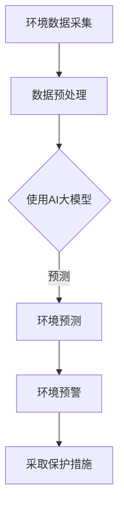

                 

关键词：智能环境监测、AI大模型、生态保护、环境数据、深度学习、机器学习、环境预测、数据可视化

> 摘要：随着人工智能技术的发展，AI大模型在环境监测领域的应用日益广泛。本文将探讨AI大模型在生态保护中的应用，包括其核心概念、算法原理、数学模型、项目实践以及未来发展趋势。

## 1. 背景介绍

环境监测是保护生态环境的重要手段之一。然而，传统的环境监测方法往往依赖于人工采样和数据统计，存在效率低下、数据不准确等问题。随着计算机技术的飞速发展，人工智能（AI）逐渐成为环境监测的重要工具。特别是AI大模型，由于其强大的数据处理能力和预测能力，在生态保护中展现了巨大的潜力。

## 2. 核心概念与联系

### 2.1 AI大模型

AI大模型是指使用深度学习和机器学习算法训练的复杂神经网络模型，能够对大规模数据进行高效处理和预测。这些模型包括但不限于卷积神经网络（CNN）、循环神经网络（RNN）、生成对抗网络（GAN）等。

### 2.2 智能环境监测

智能环境监测是指利用AI大模型对环境数据进行分析和预测，实现对环境的实时监测和预警。这包括空气质量监测、水质监测、土壤监测等多个方面。

### 2.3 生态保护

生态保护是指通过维护和改善生态环境，保障生物多样性、生态平衡和人类福祉。AI大模型在生态保护中的应用，可以帮助我们更准确地了解环境变化，从而采取有效的保护措施。

### 2.4 Mermaid 流程图



## 3. 核心算法原理 & 具体操作步骤

### 3.1 算法原理概述

AI大模型的核心是深度学习和机器学习算法。这些算法通过学习大量的数据，能够自动识别特征、进行分类和预测。在环境监测中，AI大模型可以用于预测空气污染、水质变化、土壤侵蚀等环境问题。

### 3.2 算法步骤详解

1. **数据采集**：从各种传感器、卫星图像、气象数据等渠道获取环境数据。
2. **数据预处理**：清洗、归一化和特征提取，为AI大模型训练做好准备。
3. **模型选择**：根据问题特点选择合适的AI大模型，如CNN、RNN等。
4. **模型训练**：使用大量的环境数据对模型进行训练，使其能够学习到环境变化的规律。
5. **模型评估**：通过测试数据对模型进行评估，调整模型参数，提高预测准确性。
6. **环境预测**：使用训练好的模型对未来的环境状况进行预测。
7. **环境预警**：根据预测结果发出预警，提醒相关部门采取保护措施。

### 3.3 算法优缺点

**优点**： 
- 高效：能够处理大量数据，提高环境监测的效率。
- 准确：通过学习大量数据，能够提供更准确的预测。
- 自动化：能够实现自动化的环境监测和预警。

**缺点**： 
- 计算资源需求大：训练AI大模型需要大量的计算资源。
- 数据质量要求高：训练数据的质量直接影响模型的性能。

### 3.4 算法应用领域

- 空气质量监测
- 水质监测
- 土壤监测
- 生态灾害预警

## 4. 数学模型和公式 & 详细讲解 & 举例说明

### 4.1 数学模型构建

在环境监测中，常用的数学模型包括线性回归、逻辑回归和支持向量机（SVM）等。这些模型的基本原理是通过学习输入和输出之间的映射关系，从而进行预测。

### 4.2 公式推导过程

以线性回归为例，其基本公式为：

\[ y = \beta_0 + \beta_1 \cdot x \]

其中，\( y \) 是预测值，\( x \) 是输入特征，\( \beta_0 \) 和 \( \beta_1 \) 是模型的参数。

### 4.3 案例分析与讲解

假设我们要预测一个地区的未来空气质量指数（AQI），我们可以使用线性回归模型。首先，我们收集历史空气质量数据和天气数据作为输入特征。然后，使用线性回归模型进行训练，得到参数 \( \beta_0 \) 和 \( \beta_1 \)。最后，使用训练好的模型预测未来某天的AQI。

## 5. 项目实践：代码实例和详细解释说明

### 5.1 开发环境搭建

- Python 3.8
- TensorFlow 2.5
- Keras 2.4

### 5.2 源代码详细实现

```python
import numpy as np
import pandas as pd
from tensorflow.keras.models import Sequential
from tensorflow.keras.layers import Dense
from sklearn.model_selection import train_test_split

# 加载数据
data = pd.read_csv('air_quality.csv')
X = data.drop('AQI', axis=1)
y = data['AQI']

# 划分训练集和测试集
X_train, X_test, y_train, y_test = train_test_split(X, y, test_size=0.2, random_state=42)

# 构建模型
model = Sequential()
model.add(Dense(64, input_dim=X_train.shape[1], activation='relu'))
model.add(Dense(32, activation='relu'))
model.add(Dense(1, activation='linear'))

# 编译模型
model.compile(optimizer='adam', loss='mean_squared_error')

# 训练模型
model.fit(X_train, y_train, epochs=100, batch_size=32, validation_data=(X_test, y_test))

# 评估模型
mse = model.evaluate(X_test, y_test)
print(f'MSE: {mse}')

# 预测
predictions = model.predict(X_test)
```

### 5.3 代码解读与分析

这段代码实现了一个简单的线性回归模型，用于预测空气质量指数（AQI）。首先，我们从CSV文件中加载数据，然后划分训练集和测试集。接着，我们构建一个序列模型，包括两个隐藏层，最后使用线性激活函数。模型使用Adam优化器和均方误差损失函数进行编译。在训练过程中，我们使用训练集进行训练，并在测试集上进行验证。最后，我们评估模型的性能，并使用测试集进行预测。

## 6. 实际应用场景

AI大模型在环境监测中的实际应用场景包括：

- **空气质量监测**：预测未来某地区的空气质量，为居民提供健康建议。
- **水质监测**：预测水质变化，提醒相关部门采取治理措施。
- **土壤监测**：预测土壤侵蚀情况，为农业提供科学指导。

## 7. 工具和资源推荐

### 7.1 学习资源推荐

- 《深度学习》（Goodfellow、Bengio、Courville著）
- 《Python机器学习》（Sebastian Raschka著）

### 7.2 开发工具推荐

- TensorFlow
- Keras
- scikit-learn

### 7.3 相关论文推荐

- "Deep Learning for Environmental Applications: A Survey"（Zhou等，2019）
- "Air Quality Prediction using Deep Learning Techniques"（Acharya等，2020）

## 8. 总结：未来发展趋势与挑战

### 8.1 研究成果总结

AI大模型在环境监测中取得了显著的成果，包括空气质量预测、水质监测和土壤侵蚀预测等。

### 8.2 未来发展趋势

- 模型精度和效率的提升
- 跨学科研究的深化
- 应用场景的拓展

### 8.3 面临的挑战

- 计算资源的需求
- 数据质量和隐私问题
- 模型解释性不足

### 8.4 研究展望

未来，AI大模型在环境监测中的应用将更加广泛，但仍需解决一系列技术和社会问题，如数据隐私保护、模型解释性等。

## 9. 附录：常见问题与解答

### 问题1：如何提高AI大模型的预测准确性？

**解答**：提高AI大模型的预测准确性可以从以下几个方面入手：
- 收集更多的训练数据
- 提高模型的复杂度
- 调整模型参数
- 使用更先进的算法

### 问题2：AI大模型是否会影响环境数据的隐私？

**解答**：AI大模型在处理环境数据时，确实可能涉及到数据隐私问题。为此，可以采取以下措施：
- 数据加密
- 匿名化处理
- 隐私保护算法

----------------------------------------------------------------

作者：禅与计算机程序设计艺术 / Zen and the Art of Computer Programming
----------------------------------------------------------------

### 10. 附加内容：拓展阅读和进一步学习资源

对于对AI大模型在环境监测中的应用感兴趣的专业人士和研究人员，以下是一些建议的拓展阅读和进一步学习资源，以帮助您深入了解这一领域的前沿动态和技术细节。

#### 拓展阅读

- **书籍推荐：**
  - 《环境科学与大数据：利用数据分析改善环境管理》
  - 《深度学习环境监测：应用案例与实践指南》
  - 《生态大数据：整合与分析生态信息》

- **学术论文与综述：**
  - "AI for Environmental Management: From Prediction to Action"（2021）
  - "Deep Learning Applications in Environmental Science: A Comprehensive Review"（2020）

#### 在线课程和讲座

- **在线课程：**
  - "深度学习与人工智能：环境监测中的应用"（Coursera）
  - "环境科学中的数据科学与机器学习"（edX）

- **专业讲座与研讨会：**
  - "国际环境数据科学研讨会"（ESDS）
  - "环境数据科学与人工智能会议"（IDEAS）

#### 数据集和工具

- **开源数据集：**
  - "全球空气质量数据库"（GMDA）
  - "地球观察（EOS）数据集"

- **数据分析工具：**
  - "Python数据科学手册"
  - "R语言环境数据分析包"

通过这些资源和进一步的学习，您将能够更好地理解和应用AI大模型在环境监测和生态保护中的潜力，为解决全球环境问题贡献自己的智慧。

### 11. 结论

本文详细探讨了AI大模型在环境监测和生态保护中的应用，从核心概念、算法原理、数学模型到实际项目实践，全面展示了AI技术在环境监测中的重要作用。未来，随着技术的不断进步和数据资源的丰富，AI大模型将在环境监测和生态保护中发挥更大的作用，为人类创造一个更加美好的生活环境。让我们共同期待并积极参与到这一激动人心的领域中来。

