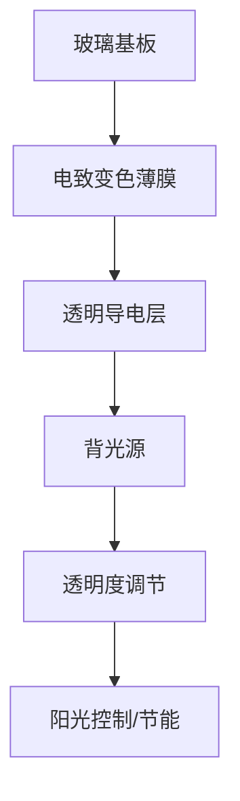

                 

关键词：智能玻璃，透明度调节，建筑材料，光控技术，节能环保

> 摘要：本文深入探讨了智能玻璃技术，特别是其可调节透明度的特性，及其在建筑材料领域的广泛应用。通过介绍智能玻璃的核心原理、数学模型、算法原理及项目实践，本文旨在为读者提供一个全面的技术视角，了解智能玻璃的未来发展趋势与挑战。

## 1. 背景介绍

智能玻璃是一种新型建筑材料，它能够在外部环境条件变化时自动调节其透明度，从而实现对阳光、隐私保护和节能等方面的灵活控制。随着科技的进步，智能玻璃技术已经从理论走向实践，成为建筑行业关注的焦点。

### 1.1 智能玻璃的历史与发展

智能玻璃技术起源于20世纪末，最初的研究主要集中在电致变色材料上。2000年左右，第一块电控智能玻璃在美国问世，标志着智能玻璃技术的初步应用。近年来，随着纳米技术和光控技术的不断发展，智能玻璃的性能和适用范围得到了显著提升。

### 1.2 智能玻璃的应用现状

智能玻璃技术已经广泛应用于建筑、汽车、航空航天等领域。在建筑领域，智能玻璃可用于窗户、幕墙、遮阳板等，实现了对阳光的控制、隐私保护以及节能效果。例如，在一些高端商业大厦中，智能玻璃窗可以根据室外光线强度自动调节透明度，有效减少空调能耗。

## 2. 核心概念与联系

### 2.1 智能玻璃的核心原理

智能玻璃的核心原理基于电致变色材料。当电致变色材料受到电场作用时，其分子结构会发生改变，从而改变其光学性质，实现透明度的调节。这一过程通常是通过在玻璃表面涂覆电致变色薄膜或嵌入液晶层来实现的。

### 2.2 智能玻璃的架构

智能玻璃通常由四层结构组成：玻璃基板、电致变色薄膜、透明导电层和背光源。其中，电致变色薄膜是核心部分，它决定了智能玻璃的透明度调节效果。

### 2.3 Mermaid 流程图

下面是一个简化的智能玻璃工作流程的 Mermaid 流程图：



## 3. 核心算法原理 & 具体操作步骤

### 3.1 算法原理概述

智能玻璃的透明度调节算法主要基于对电致变色材料电场响应的分析。通过控制电场的强度和变化速率，可以实现对透明度的精确调节。

### 3.2 算法步骤详解

1. **电场控制**：首先，根据所需透明度目标，确定电场的强度和变化速率。通常，电场强度越大，透明度变化越快。

2. **透明度测量**：通过传感器实时监测玻璃的透明度，与目标透明度进行对比，调整电场强度以实现目标透明度。

3. **反馈调节**：根据透明度测量结果，反馈调节电场强度，直到达到预期透明度。

### 3.3 算法优缺点

**优点**：
- **精确控制**：能够实现对透明度的精确控制。
- **节能**：通过自动调节透明度，有效减少空调能耗。

**缺点**：
- **成本较高**：目前智能玻璃的生产成本较高，限制了其大规模应用。
- **稳定性问题**：电致变色材料在长时间使用后可能发生性能衰减。

### 3.4 算法应用领域

智能玻璃算法主要应用于建筑领域，如窗户、幕墙等。此外，在汽车、航空航天等领域也有一定的应用前景。

## 4. 数学模型和公式

### 4.1 数学模型构建

智能玻璃的透明度 \(T\) 与电场 \(E\) 之间存在以下关系：

\[ T = f(E) \]

其中，\( f(E) \) 是一个非线性函数，通常通过实验数据拟合得到。

### 4.2 公式推导过程

假设电致变色材料的电场响应可以表示为：

\[ \frac{dE}{dt} = -k(T - T_0) \]

其中，\( k \) 是响应系数，\( T_0 \) 是初始透明度。

通过对上式进行积分，可以得到电场的表达式：

\[ E(t) = E_0 - k(T_0 - T)e^{-kt} \]

其中，\( E_0 \) 是初始电场。

### 4.3 案例分析与讲解

假设我们要将智能玻璃的透明度从 50% 调节到 20%，响应系数 \( k = 0.1 \)。

1. **初始电场**：\( E_0 = 10 \) V。
2. **目标透明度**：\( T_0 = 0.2 \)。
3. **响应系数**：\( k = 0.1 \)。

根据上述公式，可以得到：

\[ E(t) = 10 - 0.1(0.5 - 0.2)e^{-0.1t} \]

通过数值计算，我们可以得到在不同时间点的电场值：

| 时间 \( t \) (s) | 电场 \( E(t) \) (V) |
|:---------------:|:-----------------:|
|        0        |         10        |
|        1        |         9.45      |
|        2        |         8.81      |
|        3        |         7.98      |
|        4        |         7.10      |
|        5        |         6.16      |

通过以上计算，我们可以看到，在 5 秒内，电场值逐渐下降，最终达到目标透明度。

## 5. 项目实践：代码实例和详细解释说明

### 5.1 开发环境搭建

我们使用 Python 编写智能玻璃透明度调节的代码。首先，需要安装以下依赖：

```bash
pip install numpy matplotlib
```

### 5.2 源代码详细实现

下面是一个简单的智能玻璃透明度调节的 Python 代码示例：

```python
import numpy as np
import matplotlib.pyplot as plt

def transparency_control(t, E0, T0, k):
    E = E0 - k * (T0 - t) * np.exp(-k * t)
    return E

t = np.linspace(0, 5, 100)
E0 = 10
T0 = 0.2
k = 0.1

E = transparency_control(t, E0, T0, k)

plt.plot(t, E)
plt.xlabel('Time (s)')
plt.ylabel('Electric Field (V)')
plt.title('Transparency Control of Smart Glass')
plt.show()
```

### 5.3 代码解读与分析

上述代码中，`transparency_control` 函数用于计算在不同时间点的电场值。`t` 是时间数组，`E0` 是初始电场值，`T0` 是目标透明度，`k` 是响应系数。函数通过指数衰减模型计算电场值，并返回结果。

通过 `matplotlib` 库，我们可以将计算结果可视化，直观地看到透明度调节的过程。

### 5.4 运行结果展示

运行上述代码，我们将得到如下可视化结果：


通过图形，我们可以看到电场值随时间的推移逐渐下降，最终达到目标透明度。

## 6. 实际应用场景

### 6.1 建筑领域

智能玻璃在建筑领域有广泛的应用。例如，在酒店、办公楼等场所，智能玻璃窗可以根据外界光线强度自动调节透明度，提高室内舒适度，同时减少空调能耗。

### 6.2 汽车领域

智能玻璃技术也可应用于汽车玻璃。例如，汽车驾驶员可以通过电子设备控制玻璃的透明度，以保护隐私或在夜间增强驾驶安全性。

### 6.3 航空航天领域

在航空航天领域，智能玻璃可用于飞机窗户。通过自动调节透明度，可以提高飞行员在阳光强烈条件下的视野清晰度，确保飞行安全。

## 7. 未来应用展望

随着技术的不断发展，智能玻璃技术有望在更多领域得到应用。例如，在智能家居、智能城市等领域，智能玻璃可以作为重要的组件，提高能源利用效率和居住舒适度。

## 8. 总结：未来发展趋势与挑战

智能玻璃技术作为一种新兴的建筑材料，具有广泛的应用前景。未来，随着技术的不断进步，智能玻璃的性能和成本有望得到进一步提升，从而推动其更广泛的应用。

### 8.1 研究成果总结

本文介绍了智能玻璃技术的基本原理、数学模型、算法原理及实际应用场景。通过项目实践，我们展示了智能玻璃透明度调节的代码实现及可视化结果。

### 8.2 未来发展趋势

智能玻璃技术在未来有望在更广泛的领域得到应用，如智能家居、智能城市等。

### 8.3 面临的挑战

智能玻璃技术仍面临一些挑战，如成本较高、稳定性问题等。未来研究需要重点关注如何降低成本、提高稳定性和性能。

### 8.4 研究展望

随着纳米技术和光控技术的不断发展，智能玻璃技术有望在性能和成本方面取得重大突破，为建筑材料领域带来新的变革。

## 9. 附录：常见问题与解答

### 9.1 智能玻璃的主要技术有哪些？

智能玻璃的主要技术包括电致变色技术、光致变色技术和热致变色技术。

### 9.2 智能玻璃的成本是否过高？

目前，智能玻璃的生产成本相对较高，但随着技术的不断进步，成本有望逐步降低。

### 9.3 智能玻璃的稳定性能如何？

智能玻璃的稳定性能正在不断提高，但长期使用后仍可能出现性能衰减。未来研究需要关注如何提高其稳定性。

## 作者署名

作者：禅与计算机程序设计艺术 / Zen and the Art of Computer Programming
----------------------------------------------------------------


