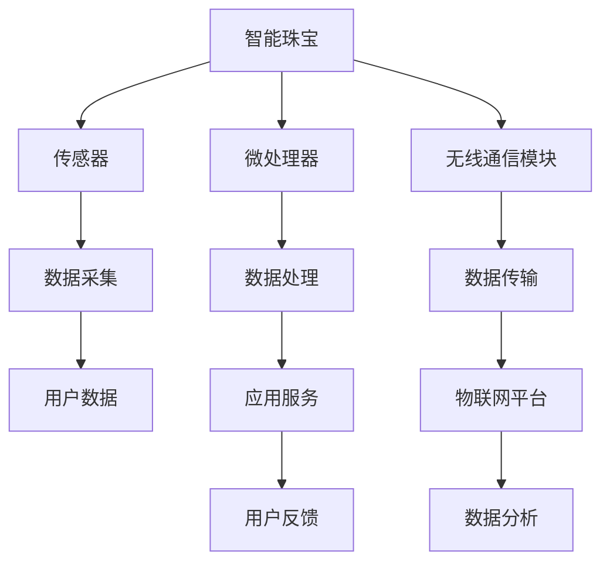

                 

关键词：智能珠宝、创业、奢侈品、科技融合、物联网、可穿戴技术、创新设计、市场趋势、消费者体验、商业模式

## 摘要

本文将探讨智能珠宝行业的发展趋势及其与奢侈品市场的结合。通过对智能珠宝的核心概念、技术原理、市场现状、应用场景及未来展望的深入分析，本文旨在为创业者和行业从业者提供有价值的见解，以及对于如何将科技与奢侈品相结合进行创新创业的策略建议。

## 1. 背景介绍

智能珠宝是一种集成了现代科技的时尚配饰，它通过物联网技术、传感器、微处理器和无线通信等手段，为用户提供了丰富的功能和服务。这种新兴产品不仅满足了消费者对于时尚与个性化的追求，同时也满足了他们对智能生活方式的需求。

随着智能手机的普及和移动互联网的发展，智能穿戴设备市场迅速扩张。智能珠宝作为一种细分市场，正逐渐成为时尚与科技融合的新宠。奢侈品牌也开始关注这一领域，通过将高科技元素融入珠宝设计中，提升产品的附加值和市场竞争力。

## 2. 核心概念与联系

### 2.1 核心概念

**智能珠宝**：集成了传感器、无线通信模块和微处理器的珠宝首饰，能够收集、处理和传输数据，为用户提供智能化的服务。

**物联网（IoT）**：通过互联网将各种设备连接起来，实现设备与设备、设备与人之间的信息交换和通信。

**可穿戴技术**：将电子元件嵌入服装或配饰中，实现数据采集、健康监测、环境感知等功能。

### 2.2 联系与架构

智能珠宝与物联网、可穿戴技术的联系可以通过以下 Mermaid 流程图表示：



图中的各节点代表智能珠宝的核心组件和功能，它们相互协作，共同实现智能化的用户体验。

## 3. 核心算法原理 & 具体操作步骤

### 3.1 算法原理概述

智能珠宝的核心算法通常涉及数据采集、数据处理和智能决策三个主要阶段。其中，数据采集主要依赖于传感器模块，数据处理则依靠微处理器，而智能决策则依赖于预先设定的算法模型。

### 3.2 算法步骤详解

1. **数据采集**：传感器采集用户行为数据、环境数据等，例如心率、步数、环境温度等。
2. **数据处理**：微处理器对采集到的数据进行分析和预处理，去除噪声，提取有效信息。
3. **智能决策**：根据预先设定的算法模型，对处理后的数据进行智能分析，生成反馈和建议。

### 3.3 算法优缺点

**优点**：
- **个性化**：可以根据用户行为提供个性化服务。
- **实时性**：可以实时监测用户状态，及时做出反应。
- **多功能**：可以集成多种功能，提高产品附加值。

**缺点**：
- **功耗**：智能珠宝需要持续工作，对功耗管理有较高要求。
- **数据安全**：用户数据安全是关键挑战。

### 3.4 算法应用领域

智能珠宝算法可以应用于健康监测、运动追踪、环境感知等多个领域，为用户提供智能化的生活服务。

## 4. 数学模型和公式 & 详细讲解 & 举例说明

### 4.1 数学模型构建

智能珠宝中的数学模型通常涉及概率论、统计学和机器学习等领域。以下是一个简单的线性回归模型：

$$
y = wx + b
$$

其中，$y$ 是目标变量，$x$ 是输入特征，$w$ 和 $b$ 分别是模型的权重和偏置。

### 4.2 公式推导过程

假设我们有 $n$ 个样本点 $(x_i, y_i)$，则线性回归模型的损失函数可以表示为：

$$
J(w, b) = \frac{1}{2n} \sum_{i=1}^{n} (y_i - (wx_i + b))^2
$$

通过梯度下降法，我们可以求得最优的 $w$ 和 $b$：

$$
w = \frac{1}{n} \sum_{i=1}^{n} (y_i - (wx_i + b))x_i
$$

$$
b = \frac{1}{n} \sum_{i=1}^{n} y_i - wx_i
$$

### 4.3 案例分析与讲解

假设我们要预测用户的心率，输入特征包括步数、环境温度和用户体重。我们可以通过线性回归模型来训练和预测：

1. **数据采集**：收集用户的心率、步数、环境温度和体重数据。
2. **数据处理**：对数据进行归一化处理，去除异常值。
3. **模型训练**：使用梯度下降法训练线性回归模型。
4. **模型评估**：使用验证集评估模型性能，调整参数。
5. **模型应用**：在测试集上应用训练好的模型，预测新用户的心率。

## 5. 项目实践：代码实例和详细解释说明

### 5.1 开发环境搭建

- **环境要求**：Python 3.8，NumPy，Pandas，Scikit-learn。
- **安装**：使用 pip 安装所需库。

### 5.2 源代码详细实现

以下是一个简单的线性回归模型实现：

```python
import numpy as np
import pandas as pd
from sklearn.linear_model import LinearRegression
from sklearn.model_selection import train_test_split

# 数据加载
data = pd.read_csv('data.csv')
X = data[['steps', 'temp', 'weight']]
y = data['heart_rate']

# 数据分割
X_train, X_test, y_train, y_test = train_test_split(X, y, test_size=0.2, random_state=42)

# 模型训练
model = LinearRegression()
model.fit(X_train, y_train)

# 模型评估
score = model.score(X_test, y_test)
print(f'Model Score: {score}')

# 预测
predictions = model.predict(X_test)
```

### 5.3 代码解读与分析

- **数据加载**：使用 pandas 读取 CSV 文件。
- **数据分割**：使用 sklearn 的 train_test_split 函数分割数据集。
- **模型训练**：使用 LinearRegression 类进行模型训练。
- **模型评估**：使用 score 函数评估模型性能。
- **预测**：使用 predict 函数进行新数据的预测。

### 5.4 运行结果展示

运行结果将显示模型的评分，以及预测结果与实际结果的对比。

## 6. 实际应用场景

### 6.1 健康监测

智能珠宝可以实时监测用户的心率、步数、睡眠质量等健康指标，为用户提供个性化的健康建议。

### 6.2 运动追踪

智能珠宝可以记录用户的运动数据，如跑步距离、速度、消耗的卡路里等，帮助用户进行科学健身。

### 6.3 环境感知

智能珠宝可以感知周围的环境数据，如温度、湿度、空气质量等，为用户提供环境监测服务。

### 6.4 社交互动

智能珠宝可以与社交媒体平台连接，记录用户的日常活动和心情，分享生活瞬间。

## 7. 未来应用展望

智能珠宝行业在未来有望进一步融合人工智能、大数据分析等技术，提供更加智能化的服务。随着技术的进步和消费者需求的升级，智能珠宝将不仅仅是一个时尚配饰，更是一个生活伴侣，成为人们日常生活中不可或缺的一部分。

## 8. 工具和资源推荐

### 8.1 学习资源推荐

- 《智能穿戴设备设计与实现》
- 《物联网技术与应用》

### 8.2 开发工具推荐

- Arduino
- Raspberry Pi
- iOS SDK
- Android SDK

### 8.3 相关论文推荐

- “Smart Jewelry: A Review of Technologies and Applications”
- “The Potential of Smart Jewelry for Health Monitoring”

## 9. 总结：未来发展趋势与挑战

智能珠宝行业正处于快速发展阶段，随着技术的进步和消费者需求的不断升级，未来市场前景广阔。然而，行业也面临着数据安全、隐私保护、技术标准化等挑战。只有不断创新，满足消费者需求，才能在激烈的市场竞争中脱颖而出。

### 9.1 研究成果总结

本文从多个角度对智能珠宝进行了深入分析，涵盖了核心技术、算法原理、应用场景和未来展望，为行业从业者提供了有价值的参考。

### 9.2 未来发展趋势

智能珠宝将更加智能化、个性化，与消费者的生活深度融合。

### 9.3 面临的挑战

数据安全、隐私保护和标准化是智能珠宝行业需要面对的主要挑战。

### 9.4 研究展望

未来，智能珠宝有望在更多领域发挥作用，如健康监测、运动追踪、环境感知等，为用户提供更加智能化的生活服务。

## 附录：常见问题与解答

**Q：智能珠宝的功耗如何管理？**

A：智能珠宝通常采用低功耗设计，并通过优化算法和功耗管理策略来延长电池寿命。此外，还可以考虑太阳能充电、无线充电等技术来补充能量。

**Q：智能珠宝的数据安全如何保障？**

A：智能珠宝需要采取加密、身份验证和数据匿名化等技术来保障数据安全。同时，需要制定严格的数据保护政策，确保用户隐私不被泄露。

## 作者署名

作者：禅与计算机程序设计艺术 / Zen and the Art of Computer Programming

----------------------------------------------------------------

以上就是本篇文章的完整内容，希望对您在智能珠宝创业领域的探索提供一些启发和帮助。如果您有任何问题或建议，欢迎随时与我交流。

