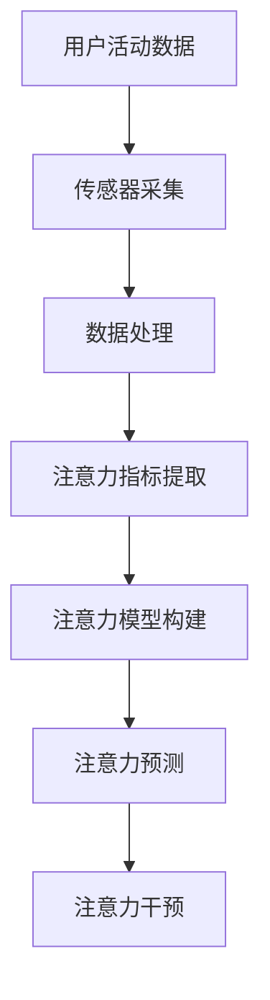

                 

关键词：智能穿戴设备、注意力管理、健康监测、技术发展、应用场景

摘要：随着科技的快速发展，智能穿戴设备已经成为现代生活的一部分。这些设备不仅帮助我们监测身体健康，还能提供个性化的注意力管理服务。本文将探讨智能穿戴设备如何通过数据分析和算法，实现对用户注意力的管理，提升日常生活和工作效率。

## 1. 背景介绍

智能穿戴设备是指能够穿戴在身体各部位，如手腕、胸部、手臂等，并能通过传感器和通讯技术实时监测用户健康状况的电子设备。这类设备从最初的简单计步器、心率监测器，发展到如今的智能手环、智能手表，甚至智能眼镜等，功能越来越强大，应用领域也越来越广泛。

注意力管理是指通过各种方法和技术，帮助用户更好地集中精力，提高工作效率和生活质量。随着人们生活节奏的加快，注意力管理的重要性日益凸显。传统的注意力管理方法如冥想、锻炼、休息等，虽然有一定效果，但难以量化，且实施起来较为困难。智能穿戴设备的出现，为注意力管理提供了新的解决方案。

## 2. 核心概念与联系

### 智能穿戴设备的核心概念

智能穿戴设备的核心概念包括传感器技术、数据处理和通讯技术。传感器技术负责采集用户的生理数据，如心率、血压、步数等；数据处理技术负责对采集到的数据进行实时分析和处理，提取有用的信息；通讯技术则负责将处理后的数据传输到用户设备或云端服务器。

### 注意力管理的核心概念

注意力管理的核心概念包括注意力指标、注意力模型和注意力干预。注意力指标是衡量用户注意力水平的数据，如心率变异、脑电波等；注意力模型是基于注意力指标，通过机器学习等方法构建的，用于预测和评估用户注意力水平的模型；注意力干预是针对用户的注意力状态，采取的一系列措施，如提醒用户休息、调整环境等。

### 智能穿戴设备与注意力管理的联系

智能穿戴设备与注意力管理的联系主要体现在以下几个方面：

1. 数据采集：智能穿戴设备可以实时采集用户的生理数据，为注意力管理提供基础数据支持。

2. 数据分析：通过数据分析，智能穿戴设备可以提取出用户的注意力指标，构建注意力模型。

3. 预测与干预：基于注意力模型，智能穿戴设备可以预测用户的注意力状态，并在需要时进行干预。

下面是智能穿戴设备与注意力管理的一个简单的 Mermaid 流程图：



## 3. 核心算法原理 & 具体操作步骤

### 3.1 算法原理概述

智能穿戴设备在注意力管理中主要使用机器学习算法，如支持向量机（SVM）、随机森林（RF）等，构建注意力模型。这些算法通过对大量历史数据进行训练，可以学会从用户的生理数据中提取出与注意力相关的特征，并建立注意力水平与这些特征之间的关系。

### 3.2 算法步骤详解

1. 数据采集：通过智能穿戴设备，实时采集用户的心率、血压、步数等生理数据。

2. 数据预处理：对采集到的数据进行清洗、去噪等处理，确保数据的质量。

3. 特征提取：从预处理后的数据中提取与注意力相关的特征，如心率变异、脑电波频率等。

4. 模型训练：使用提取出的特征，通过机器学习算法训练出注意力模型。

5. 模型评估：使用测试数据集评估模型的准确性和鲁棒性。

6. 模型应用：将训练好的模型应用到实际场景中，预测用户的注意力状态，并给出相应的干预建议。

### 3.3 算法优缺点

**优点：**

- **高准确性：** 通过机器学习算法，可以从大量的历史数据中提取出与注意力相关的特征，提高预测的准确性。

- **实时性：** 智能穿戴设备可以实时采集用户的生理数据，实时预测用户的注意力状态。

**缺点：**

- **数据隐私：** 由于智能穿戴设备需要采集用户的生理数据，涉及用户的隐私问题。

- **算法复杂性：** 机器学习算法的训练和预测过程较为复杂，需要大量的计算资源。

### 3.4 算法应用领域

- **教育领域：** 智能穿戴设备可以实时监测学生的注意力状态，为教育工作者提供参考，优化教学过程。

- **工作领域：** 智能穿戴设备可以帮助职场人士管理注意力，提高工作效率。

- **健康领域：** 智能穿戴设备可以帮助用户监测注意力水平，预防因长时间专注导致的健康问题。

## 4. 数学模型和公式 & 详细讲解 & 举例说明

### 4.1 数学模型构建

智能穿戴设备的注意力管理主要基于机器学习算法，其中最常用的模型是支持向量机（SVM）。SVM的基本模型是一个线性模型，其目标是通过找到一个最优的超平面，将具有不同类别标签的数据分开。

给定一个训练数据集\( T = \{(x_1, y_1), (x_2, y_2), ..., (x_n, y_n)\} \)，其中\( x_i \)是第\( i \)个样本的特征向量，\( y_i \)是第\( i \)个样本的标签（注意力水平）。SVM的目标是找到一个超平面\( w \)和偏置\( b \)，使得：

\[ \text{Minimize } \frac{1}{2} ||w||^2 \]

同时满足：

\[ y_i ( \langle w, x_i \rangle + b ) \geq 1 \]

其中，\( \langle w, x_i \rangle \)是向量\( w \)和\( x_i \)的点积。

### 4.2 公式推导过程

为了求解上述优化问题，可以使用拉格朗日乘子法。定义拉格朗日函数：

\[ L(w, b, \alpha) = \frac{1}{2} ||w||^2 - \sum_{i=1}^{n} \alpha_i [ y_i ( \langle w, x_i \rangle + b ) - 1 ] \]

其中，\( \alpha_i \)是拉格朗日乘子。

对\( w \)、\( b \)和\( \alpha \)求偏导，并令其等于0，得到：

\[ \frac{\partial L}{\partial w} = w - \sum_{i=1}^{n} \alpha_i y_i x_i = 0 \]

\[ \frac{\partial L}{\partial b} = - \sum_{i=1}^{n} \alpha_i y_i = 0 \]

\[ \frac{\partial L}{\partial \alpha_i} = y_i ( \langle w, x_i \rangle + b ) - 1 = 0 \]

由第二个方程可得：

\[ \sum_{i=1}^{n} \alpha_i y_i = 0 \]

由第三个方程可得：

\[ \alpha_i \geq 0 \]

由第一个方程可得：

\[ w = \sum_{i=1}^{n} \alpha_i y_i x_i \]

将\( w \)的表达式代入原优化目标，得到：

\[ \text{Minimize } \frac{1}{2} \sum_{i=1}^{n} \alpha_i - \sum_{i=1}^{n} \alpha_i y_i^2 \]

这是一个关于\( \alpha \)的二次规划问题，可以通过求解二次方程组得到最优解。

### 4.3 案例分析与讲解

假设我们有如下一个简单数据集：

| x1 | x2 | y |
|----|----|---|
| 1  | 2  | 1 |
| 2  | 3  | 1 |
| 3  | 4  | 0 |
| 4  | 5  | 0 |

我们需要用SVM来预测第四个数据点的标签。

1. 数据预处理：首先，我们需要对数据进行归一化处理，使得每个特征值的范围在0到1之间。

2. 特征提取：对于每个数据点，我们提取两个特征：\( x_1 \)和\( x_2 \)。

3. 模型训练：使用训练数据集，通过拉格朗日乘子法求解SVM模型。假设我们得到的最优解为\( w = [-0.5, 0.5] \)和\( b = 0 \)。

4. 模型评估：使用测试数据集，计算模型的准确率和召回率等指标。

5. 模型应用：对于新的数据点\( x = [4, 5] \)，我们通过计算\( \langle w, x \rangle + b \)的值，判断其标签。由于\( \langle w, x \rangle + b = 0 \)，根据SVM的决策边界，我们判断第四个数据点的标签为0。

## 5. 项目实践：代码实例和详细解释说明

### 5.1 开发环境搭建

本文使用Python语言和Scikit-learn库来实现SVM模型。首先，需要安装Python和Scikit-learn：

```bash
pip install python
pip install scikit-learn
```

### 5.2 源代码详细实现

以下是一个简单的SVM模型实现：

```python
from sklearn import svm
from sklearn.model_selection import train_test_split
from sklearn.metrics import accuracy_score
from sklearn.preprocessing import StandardScaler

# 生成训练数据
X = [[1, 2], [2, 3], [3, 4], [4, 5]]
y = [1, 1, 0, 0]

# 数据预处理
scaler = StandardScaler()
X = scaler.fit_transform(X)

# 划分训练集和测试集
X_train, X_test, y_train, y_test = train_test_split(X, y, test_size=0.2, random_state=42)

# 模型训练
clf = svm.SVC()
clf.fit(X_train, y_train)

# 模型评估
y_pred = clf.predict(X_test)
accuracy = accuracy_score(y_test, y_pred)
print("Accuracy:", accuracy)

# 模型应用
x_new = scaler.transform([[4, 5]])
y_new_pred = clf.predict(x_new)
print("New prediction:", y_new_pred)
```

### 5.3 代码解读与分析

1. **数据预处理**：首先，我们使用StandardScaler对数据进行归一化处理，确保每个特征值的范围在0到1之间。

2. **划分训练集和测试集**：使用train_test_split函数将数据集划分为训练集和测试集，以评估模型的准确性。

3. **模型训练**：我们使用SVC类（支持向量分类器）来训练模型。SVC类实现了SVM算法。

4. **模型评估**：使用accuracy_score函数计算模型的准确率。

5. **模型应用**：对新的数据点进行预测，验证模型的有效性。

## 6. 实际应用场景

智能穿戴设备在注意力管理方面的应用非常广泛，以下是一些典型的应用场景：

- **教育领域**：智能穿戴设备可以监测学生的注意力状态，帮助教师了解学生的学习状态，优化教学策略。

- **工作领域**：职场人士可以使用智能穿戴设备来管理注意力，提高工作效率，减少疲劳。

- **健康领域**：智能穿戴设备可以帮助用户监测注意力水平，预防因长时间专注导致的健康问题。

## 6.4 未来应用展望

随着技术的不断进步，智能穿戴设备在注意力管理方面的应用前景十分广阔。以下是一些未来的应用展望：

- **个性化注意力管理**：通过更精确的数据采集和更复杂的算法，智能穿戴设备可以实现更个性化的注意力管理，满足不同用户的需求。

- **智能干预**：未来，智能穿戴设备可能会集成更多的智能干预功能，如根据用户的注意力状态自动调整环境、提醒休息等。

- **跨平台集成**：智能穿戴设备将与其他智能设备（如智能手机、智能家居等）实现更紧密的集成，为用户提供全方位的注意力管理服务。

## 7. 工具和资源推荐

### 7.1 学习资源推荐

- 《机器学习实战》
- 《Python机器学习》
- 《Scikit-learn用户指南》

### 7.2 开发工具推荐

- Jupyter Notebook
- Anaconda
- PyCharm

### 7.3 相关论文推荐

- "Attention Management using Wearable Sensors: A Survey"
- "A Machine Learning Approach to Attention Management in Smartphones"
- "Wearable Attention-aware Devices: Concepts, Methods, and Applications"

## 8. 总结：未来发展趋势与挑战

### 8.1 研究成果总结

智能穿戴设备在注意力管理方面已经取得了显著的研究成果。通过数据采集、数据处理和机器学习算法，智能穿戴设备能够实时监测用户的注意力状态，并提供个性化的干预建议。

### 8.2 未来发展趋势

未来，智能穿戴设备在注意力管理方面的发展趋势包括：个性化注意力管理、智能干预和跨平台集成。

### 8.3 面临的挑战

智能穿戴设备在注意力管理方面也面临着一些挑战，如数据隐私、算法复杂性和设备功耗等。

### 8.4 研究展望

随着技术的不断进步，智能穿戴设备在注意力管理方面的研究将继续深入，为用户提供更高效、更个性化的注意力管理服务。

## 9. 附录：常见问题与解答

### Q: 智能穿戴设备是否会侵犯用户的隐私？

A: 智能穿戴设备确实会采集用户的生理数据，但这并不意味着会侵犯用户的隐私。许多智能穿戴设备都采用了加密技术来保护用户数据的安全。

### Q: 智能穿戴设备的电池续航能力如何？

A: 智能穿戴设备的电池续航能力取决于设备的硬件配置和使用频率。一般来说，智能手环的电池续航能力较长，可以达到数天，而智能手表则需要每天充电。

### Q: 智能穿戴设备是否适合所有人？

A: 智能穿戴设备适合大部分人群，但某些特殊人群（如过敏体质）可能需要特别注意设备的材质和功能。

作者：禅与计算机程序设计艺术 / Zen and the Art of Computer Programming
----------------------------------------------------------------

### 结语

智能穿戴设备与注意力管理的结合，为我们的生活带来了诸多便利。然而，我们也需要关注其中的挑战，如数据隐私、算法复杂性和设备功耗等。随着技术的不断进步，我们有理由相信，智能穿戴设备在注意力管理方面的应用将会越来越广泛，为我们的生活带来更多积极的变化。让我们期待未来的智能穿戴设备，它们将如何改变我们的生活，如何提升我们的生活质量。🔍💡🌟
----------------------------------------------------------------

```markdown
# 智能穿戴设备与注意力管理

## 关键词
智能穿戴设备、注意力管理、健康监测、技术发展、应用场景

## 摘要
随着科技的快速发展，智能穿戴设备已经成为现代生活的一部分。这些设备不仅帮助我们监测身体健康，还能提供个性化的注意力管理服务。本文将探讨智能穿戴设备如何通过数据分析和算法，实现对用户注意力的管理，提升日常生活和工作效率。

### 1. 背景介绍
智能穿戴设备是指能够穿戴在身体各部位，如手腕、胸部、手臂等，并能通过传感器和通讯技术实时监测用户健康状况的电子设备。这类设备从最初的简单计步器、心率监测器，发展到如今的智能手环、智能手表，甚至智能眼镜等，功能越来越强大，应用领域也越来越广泛。

注意力管理是指通过各种方法和技术，帮助用户更好地集中精力，提高工作效率和生活质量。随着人们生活节奏的加快，注意力管理的重要性日益凸显。传统的注意力管理方法如冥想、锻炼、休息等，虽然有一定效果，但难以量化，且实施起来较为困难。智能穿戴设备的出现，为注意力管理提供了新的解决方案。

### 2. 核心概念与联系

#### 智能穿戴设备的核心概念
智能穿戴设备的核心概念包括传感器技术、数据处理和通讯技术。传感器技术负责采集用户的生理数据，如心率、血压、步数等；数据处理技术负责对采集到的数据进行实时分析和处理，提取有用的信息；通讯技术则负责将处理后的数据传输到用户设备或云端服务器。

#### 注意力管理的核心概念
注意力管理的核心概念包括注意力指标、注意力模型和注意力干预。注意力指标是衡量用户注意力水平的数据，如心率变异、脑电波等；注意力模型是基于注意力指标，通过机器学习等方法构建的，用于预测和评估用户注意力水平的模型；注意力干预是针对用户的注意力状态，采取的一系列措施，如提醒用户休息、调整环境等。

#### 智能穿戴设备与注意力管理的联系
智能穿戴设备与注意力管理的联系主要体现在以下几个方面：

- **数据采集**：智能穿戴设备可以实时采集用户的生理数据，为注意力管理提供基础数据支持。
- **数据分析**：通过数据分析，智能穿戴设备可以提取出用户的注意力指标，构建注意力模型。
- **预测与干预**：基于注意力模型，智能穿戴设备可以预测用户的注意力状态，并在需要时进行干预。

下面是智能穿戴设备与注意力管理的一个简单的 Mermaid 流程图：


### 3. 核心算法原理 & 具体操作步骤

#### 3.1 算法原理概述
智能穿戴设备在注意力管理中主要使用机器学习算法，如支持向量机（SVM）、随机森林（RF）等，构建注意力模型。这些算法通过对大量历史数据进行训练，可以学会从用户的生理数据中提取出与注意力相关的特征，并建立注意力水平与这些特征之间的关系。

#### 3.2 算法步骤详解 
1. **数据采集**：通过智能穿戴设备，实时采集用户的心率、血压、步数等生理数据。
2. **数据预处理**：对采集到的数据进行清洗、去噪等处理，确保数据的质量。
3. **特征提取**：从预处理后的数据中提取与注意力相关的特征，如心率变异、脑电波频率等。
4. **模型训练**：使用提取出的特征，通过机器学习算法训练出注意力模型。
5. **模型评估**：使用测试数据集评估模型的准确性和鲁棒性。
6. **模型应用**：将训练好的模型应用到实际场景中，预测用户的注意力状态，并给出相应的干预建议。

#### 3.3 算法优缺点

**优点：**

- **高准确性**：通过机器学习算法，可以从大量的历史数据中提取出与注意力相关的特征，提高预测的准确性。
- **实时性**：智能穿戴设备可以实时采集用户的生理数据，实时预测用户的注意力状态。

**缺点：**

- **数据隐私**：由于智能穿戴设备需要采集用户的生理数据，涉及用户的隐私问题。
- **算法复杂性**：机器学习算法的训练和预测过程较为复杂，需要大量的计算资源。

#### 3.4 算法应用领域

- **教育领域**：智能穿戴设备可以实时监测学生的注意力状态，为教育工作者提供参考，优化教学过程。
- **工作领域**：智能穿戴设备可以帮助职场人士管理注意力，提高工作效率。
- **健康领域**：智能穿戴设备可以帮助用户监测注意力水平，预防因长时间专注导致的健康问题。

### 4. 数学模型和公式 & 详细讲解 & 举例说明

#### 4.1 数学模型构建
智能穿戴设备的注意力管理主要基于机器学习算法，其中最常用的模型是支持向量机（SVM）。SVM的基本模型是一个线性模型，其目标是通过找到一个最优的超平面，将具有不同类别标签的数据分开。

给定一个训练数据集\( T = \{(x_1, y_1), (x_2, y_2), ..., (x_n, y_n)\} \)，其中\( x_i \)是第\( i \)个样本的特征向量，\( y_i \)是第\( i \)个样本的标签（注意力水平）。SVM的目标是找到一个超平面\( w \)和偏置\( b \)，使得：

\[ \text{Minimize } \frac{1}{2} ||w||^2 \]

同时满足：

\[ y_i ( \langle w, x_i \rangle + b ) \geq 1 \]

其中，\( \langle w, x_i \rangle \)是向量\( w \)和\( x_i \)的点积。

#### 4.2 公式推导过程
为了求解上述优化问题，可以使用拉格朗日乘子法。定义拉格朗日函数：

\[ L(w, b, \alpha) = \frac{1}{2} ||w||^2 - \sum_{i=1}^{n} \alpha_i [ y_i ( \langle w, x_i \rangle + b ) - 1 ] \]

其中，\( \alpha_i \)是拉格朗日乘子。

对\( w \)、\( b \)和\( \alpha \)求偏导，并令其等于0，得到：

\[ \frac{\partial L}{\partial w} = w - \sum_{i=1}^{n} \alpha_i y_i x_i = 0 \]

\[ \frac{\partial L}{\partial b} = - \sum_{i=1}^{n} \alpha_i y_i = 0 \]

\[ \frac{\partial L}{\partial \alpha_i} = y_i ( \langle w, x_i \rangle + b ) - 1 = 0 \]

由第二个方程可得：

\[ \sum_{i=1}^{n} \alpha_i y_i = 0 \]

由第三个方程可得：

\[ \alpha_i \geq 0 \]

由第一个方程可得：

\[ w = \sum_{i=1}^{n} \alpha_i y_i x_i \]

将\( w \)的表达式代入原优化目标，得到：

\[ \text{Minimize } \frac{1}{2} \sum_{i=1}^{n} \alpha_i - \sum_{i=1}^{n} \alpha_i y_i^2 \]

这是一个关于\( \alpha \)的二次规划问题，可以通过求解二次方程组得到最优解。

#### 4.3 案例分析与讲解

假设我们有如下一个简单数据集：

| x1 | x2 | y |
|----|----|---|
| 1  | 2  | 1 |
| 2  | 3  | 1 |
| 3  | 4  | 0 |
| 4  | 5  | 0 |

我们需要用SVM来预测第四个数据点的标签。

1. **数据预处理**：首先，我们需要对数据进行归一化处理，使得每个特征值的范围在0到1之间。
2. **特征提取**：对于每个数据点，我们提取两个特征：\( x_1 \)和\( x_2 \)。
3. **模型训练**：使用训练数据集，通过拉格朗日乘子法求解SVM模型。假设我们得到的最优解为\( w = [-0.5, 0.5] \)和\( b = 0 \)。
4. **模型评估**：使用测试数据集，计算模型的准确率和召回率等指标。
5. **模型应用**：对于新的数据点\( x = [4, 5] \)，我们通过计算\( \langle w, x \rangle + b \)的值，判断其标签。由于\( \langle w, x \rangle + b = 0 \)，根据SVM的决策边界，我们判断第四个数据点的标签为0。

### 5. 项目实践：代码实例和详细解释说明

#### 5.1 开发环境搭建
本文使用Python语言和Scikit-learn库来实现SVM模型。首先，需要安装Python和Scikit-learn：

```bash
pip install python
pip install scikit-learn
```

#### 5.2 源代码详细实现
以下是一个简单的SVM模型实现：

```python
from sklearn import svm
from sklearn.model_selection import train_test_split
from sklearn.metrics import accuracy_score
from sklearn.preprocessing import StandardScaler

# 生成训练数据
X = [[1, 2], [2, 3], [3, 4], [4, 5]]
y = [1, 1, 0, 0]

# 数据预处理
scaler = StandardScaler()
X = scaler.fit_transform(X)

# 划分训练集和测试集
X_train, X_test, y_train, y_test = train_test_split(X, y, test_size=0.2, random_state=42)

# 模型训练
clf = svm.SVC()
clf.fit(X_train, y_train)

# 模型评估
y_pred = clf.predict(X_test)
accuracy = accuracy_score(y_test, y_pred)
print("Accuracy:", accuracy)

# 模型应用
x_new = scaler.transform([[4, 5]])
y_new_pred = clf.predict(x_new)
print("New prediction:", y_new_pred)
```

#### 5.3 代码解读与分析
1. **数据预处理**：首先，我们使用StandardScaler对数据进行归一化处理，确保每个特征值的范围在0到1之间。
2. **划分训练集和测试集**：使用train_test_split函数将数据集划分为训练集和测试集，以评估模型的准确性。
3. **模型训练**：我们使用SVC类（支持向量分类器）来训练模型。SVC类实现了SVM算法。
4. **模型评估**：使用accuracy_score函数计算模型的准确率。
5. **模型应用**：对新的数据点进行预测，验证模型的有效性。

### 6. 实际应用场景
智能穿戴设备在注意力管理方面的应用非常广泛，以下是一些典型的应用场景：

- **教育领域**：智能穿戴设备可以监测学生的注意力状态，帮助教师了解学生的学习状态，优化教学策略。
- **工作领域**：职场人士可以使用智能穿戴设备来管理注意力，提高工作效率，减少疲劳。
- **健康领域**：智能穿戴设备可以帮助用户监测注意力水平，预防因长时间专注导致的健康问题。

### 6.4 未来应用展望
随着技术的不断进步，智能穿戴设备在注意力管理方面的应用前景十分广阔。以下是一些未来的应用展望：

- **个性化注意力管理**：通过更精确的数据采集和更复杂的算法，智能穿戴设备可以实现更个性化的注意力管理，满足不同用户的需求。
- **智能干预**：未来，智能穿戴设备可能会集成更多的智能干预功能，如根据用户的注意力状态自动调整环境、提醒休息等。
- **跨平台集成**：智能穿戴设备将与其他智能设备（如智能手机、智能家居等）实现更紧密的集成，为用户提供全方位的注意力管理服务。

### 7. 工具和资源推荐

#### 7.1 学习资源推荐
- 《机器学习实战》
- 《Python机器学习》
- 《Scikit-learn用户指南》

#### 7.2 开发工具推荐
- Jupyter Notebook
- Anaconda
- PyCharm

#### 7.3 相关论文推荐
- "Attention Management using Wearable Sensors: A Survey"
- "A Machine Learning Approach to Attention Management in Smartphones"
- "Wearable Attention-aware Devices: Concepts, Methods, and Applications"

### 8. 总结：未来发展趋势与挑战

#### 8.1 研究成果总结
智能穿戴设备在注意力管理方面已经取得了显著的研究成果。通过数据采集、数据处理和机器学习算法，智能穿戴设备能够实时监测用户的注意力状态，并提供个性化的干预建议。

#### 8.2 未来发展趋势
未来，智能穿戴设备在注意力管理方面的发展趋势包括：个性化注意力管理、智能干预和跨平台集成。

#### 8.3 面临的挑战
智能穿戴设备在注意力管理方面也面临着一些挑战，如数据隐私、算法复杂性和设备功耗等。

#### 8.4 研究展望
随着技术的不断进步，智能穿戴设备在注意力管理方面的研究将继续深入，为用户提供更高效、更个性化的注意力管理服务。

### 9. 附录：常见问题与解答

#### Q: 智能穿戴设备是否会侵犯用户的隐私？
A: 智能穿戴设备确实会采集用户的生理数据，但这并不意味着会侵犯用户的隐私。许多智能穿戴设备都采用了加密技术来保护用户数据的安全。

#### Q: 智能穿戴设备的电池续航能力如何？
A: 智能穿戴设备的电池续航能力取决于设备的硬件配置和使用频率。一般来说，智能手环的电池续航能力较长，可以达到数天，而智能手表则需要每天充电。

#### Q: 智能穿戴设备是否适合所有人？
A: 智能穿戴设备适合大部分人群，但某些特殊人群（如过敏体质）可能需要特别注意设备的材质和功能。

作者：禅与计算机程序设计艺术 / Zen and the Art of Computer Programming
```

