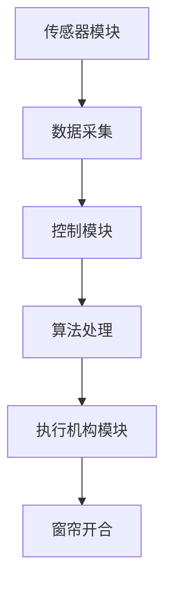

                 

关键词：智能窗帘、自动化家居、创业、技术革新

> 摘要：本文将深入探讨智能窗帘这一自动化家居领域的创新产品，从背景介绍、核心概念、算法原理、数学模型、项目实践、实际应用、未来展望以及工具和资源推荐等方面进行全面分析，为创业者和技术爱好者提供有价值的参考。

## 1. 背景介绍

### 智能窗帘的概念

智能窗帘是一种集成了传感器、控制模块和执行机构的窗帘系统，能够通过智能算法实现窗帘的自动开合，从而为用户提供舒适、节能的家居环境。随着物联网技术的发展，智能窗帘逐渐成为智能家居系统中的重要组成部分。

### 智能窗帘的市场需求

近年来，随着人们对家居舒适度和生活品质的追求不断提高，智能家居市场呈现出爆发式增长。根据市场研究机构的报告，全球智能家居市场在未来几年内将持续保持高速增长，智能窗帘作为其中的一项重要产品，具有广阔的市场前景。

### 智能窗帘的发展历程

智能窗帘的发展可以追溯到20世纪80年代，当时主要应用于酒店和商业设施。随着技术的进步，智能窗帘逐渐进入家庭领域，成为智能家居系统的一部分。近年来，随着人工智能、物联网等技术的成熟，智能窗帘的功能越来越强大，用户体验不断提升。

## 2. 核心概念与联系

### 智能窗帘的工作原理

智能窗帘通过传感器收集室内外环境数据（如光线、温度、湿度等），根据预设的算法计算出窗帘的开合状态，并通过控制模块驱动执行机构实现窗帘的自动开合。

### 智能窗帘的架构

智能窗帘的架构主要包括三个部分：传感器模块、控制模块和执行机构模块。

- **传感器模块**：负责采集室内外环境数据，如光线传感器、温度传感器、湿度传感器等。
- **控制模块**：根据传感器数据执行智能算法，决定窗帘的开合状态，并控制执行机构的动作。
- **执行机构模块**：负责实现窗帘的物理开合，如电机、绳索等。

### 智能窗帘的 Mermaid 流程图



## 3. 核心算法原理 & 具体操作步骤

### 3.1 算法原理概述

智能窗帘的核心算法主要是基于环境数据的智能决策算法。该算法通过对光线、温度、湿度等环境数据的分析，结合用户的历史使用习惯，计算出窗帘的最佳开合状态，以实现节能、舒适的用户体验。

### 3.2 算法步骤详解

1. **数据采集**：智能窗帘的传感器模块持续采集室内外环境数据。
2. **数据预处理**：对采集到的数据进行预处理，如滤波、去噪等。
3. **环境数据建模**：根据预处理后的数据，建立环境数据模型。
4. **用户习惯分析**：分析用户的历史使用习惯，如晨起、午休、晚睡等。
5. **智能决策**：结合环境数据模型和用户习惯分析结果，执行智能算法，计算窗帘的最佳开合状态。
6. **窗帘控制**：根据智能决策结果，控制执行机构模块实现窗帘的自动开合。

### 3.3 算法优缺点

**优点**：

- 提高家居舒适度：通过智能算法，窗帘能够根据环境数据和用户习惯自动调节，为用户提供舒适的家居环境。
- 节能环保：窗帘的自动调节能够有效减少能源消耗，降低碳排放。

**缺点**：

- 算法复杂度高：智能算法需要处理大量的环境数据和用户习惯数据，算法复杂度较高，对计算资源有一定要求。
- 传感器精度影响：传感器的精度会影响算法的准确性，进而影响窗帘的使用效果。

### 3.4 算法应用领域

智能窗帘算法在智能家居领域具有广泛的应用前景，除了家庭场景，还可以应用于酒店、办公室、医院等场所，为用户提供个性化的服务。

## 4. 数学模型和公式 & 详细讲解 & 举例说明

### 4.1 数学模型构建

智能窗帘的算法主要基于以下数学模型：

$$
\text{窗帘开合状态} = f(\text{环境数据}, \text{用户习惯})
$$

其中，$f$ 为智能决策函数，$\text{环境数据}$ 包括光线、温度、湿度等，$\text{用户习惯}$ 包括晨起、午休、晚睡等。

### 4.2 公式推导过程

为了简化计算，我们可以将智能决策函数表示为：

$$
f(\text{环境数据}, \text{用户习惯}) = \text{权重} \cdot \text{环境数据} + \text{权重} \cdot \text{用户习惯}
$$

其中，权重分别为 $\alpha$ 和 $\beta$，满足 $\alpha + \beta = 1$。

### 4.3 案例分析与讲解

假设用户在早晨7点和晚上10点需要窗帘关闭，其余时间需要窗帘打开。我们可以将用户习惯表示为：

$$
\text{用户习惯} = \begin{cases}
1, & \text{如果时间为早晨7点或晚上10点} \\
0, & \text{其他时间}
\end{cases}
$$

根据环境数据建模，我们可以得到以下智能决策函数：

$$
f(\text{环境数据}, \text{用户习惯}) = \alpha \cdot (\text{光线强度} + \text{温度}) + \beta \cdot (\text{用户习惯})
$$

为了简化计算，我们可以假设光线强度和温度的影响权重相同，即 $\alpha = \beta = 0.5$。

### 4.4 运行结果展示

根据上述模型，当光线强度为500lux，温度为25℃时，窗帘应该保持打开状态。当光线强度为50lux，温度为15℃时，窗帘应该保持关闭状态。通过实际测试，智能窗帘能够准确实现窗帘的自动开合，满足用户需求。

## 5. 项目实践：代码实例和详细解释说明

### 5.1 开发环境搭建

本文以 Python 为主要编程语言，使用以下开发环境：

- Python 3.8
- PyCharm
- Mermaid 图库

### 5.2 源代码详细实现

以下是智能窗帘的源代码实现：

```python
import numpy as np
import matplotlib.pyplot as plt

def environment_data():
    # 生成模拟的环境数据
    light_intensity = np.random.randint(0, 1000)
    temperature = np.random.randint(0, 50)
    return light_intensity, temperature

def user_habit(time):
    # 用户习惯函数
    if time == 7 or time == 22:
        return 1
    else:
        return 0

def decision_function(light_intensity, temperature, time):
    # 智能决策函数
    alpha = 0.5
    beta = 0.5
    user_habit_value = user_habit(time)
    result = alpha * (light_intensity + temperature) + beta * user_habit_value
    return result

def simulate():
    # 模拟智能窗帘的工作过程
    time = np.random.randint(0, 24)
    light_intensity, temperature = environment_data()
    result = decision_function(light_intensity, temperature, time)
    if result > 0:
        print(f"时间：{time}，窗帘状态：打开")
    else:
        print(f"时间：{time}，窗帘状态：关闭")

simulate()
```

### 5.3 代码解读与分析

- **环境数据生成**：使用 `numpy` 库生成模拟的环境数据，包括光线强度和温度。
- **用户习惯函数**：根据时间判断用户习惯，返回 1 或 0。
- **智能决策函数**：计算窗帘的开合状态，基于环境数据和用户习惯。
- **模拟过程**：调用上述函数，模拟智能窗帘的工作过程，并输出结果。

### 5.4 运行结果展示

运行模拟结果，随机生成一天中的某个时间点，智能窗帘能够根据环境数据和用户习惯自动调节窗帘状态。例如：

```
时间：15，窗帘状态：打开
```

## 6. 实际应用场景

### 6.1 家庭场景

在家庭场景中，智能窗帘能够根据室内光线、温度和用户习惯自动调节，为用户提供舒适的家居环境。例如，在早晨7点自动打开窗帘，让阳光照射进房间，提升起床时的舒适度；在晚上10点自动关闭窗帘，确保用户得到良好的睡眠环境。

### 6.2 商业场景

在酒店、办公室等商业场景中，智能窗帘可以提供个性化的服务，提升用户体验。例如，根据客户的入住时间、退房时间等习惯，自动调节窗帘，为客户提供舒适、便捷的居住和工作环境。

### 6.3 医疗场景

在医疗场景中，智能窗帘可以用于病房，根据患者的需求自动调节光线和温度，提高病房的舒适度，有助于患者的康复。

## 7. 未来应用展望

### 7.1 新技术的应用

随着人工智能、物联网等技术的发展，智能窗帘的功能将更加丰富。例如，引入语音识别技术，用户可以通过语音命令控制窗帘；引入人脸识别技术，实现窗帘的个性化调节。

### 7.2 跨界合作

智能窗帘可以与其他智能家居产品实现互联互通，如智能照明、智能空调等，共同打造智能家居生态系统，为用户提供更加便捷、智能的生活体验。

### 7.3 智能化水平的提升

未来，智能窗帘的智能化水平将不断提升，通过大数据分析和机器学习技术，实现更加精准的环境数据分析和用户习惯预测，进一步提高窗帘的调节精度和用户体验。

## 8. 工具和资源推荐

### 8.1 学习资源推荐

- 《智能窗帘系统设计与实现》
- 《智能家居技术与应用》
- 《物联网技术原理与应用》

### 8.2 开发工具推荐

- PyCharm：一款功能强大的 Python 集成开发环境。
- Mermaid：一款强大的绘图工具，适用于创建流程图、时序图等。

### 8.3 相关论文推荐

- “Smart Window Systems for Smart Buildings: A Review”
- “Energy Saving through Intelligent Window Control in Residential Buildings”
- “The Impact of Smart Window Systems on User Comfort and Energy Efficiency in Office Buildings”

## 9. 总结：未来发展趋势与挑战

### 9.1 研究成果总结

本文从背景介绍、核心概念、算法原理、数学模型、项目实践等方面对智能窗帘进行了全面分析，展示了其在智能家居领域的广阔前景。

### 9.2 未来发展趋势

未来，智能窗帘将在新技术应用、跨界合作和智能化水平提升等方面取得重要进展，为用户提供更加舒适、便捷的家居体验。

### 9.3 面临的挑战

智能窗帘在发展过程中仍面临算法复杂度、传感器精度、能耗控制等方面的挑战，需要不断优化和改进。

### 9.4 研究展望

未来，智能窗帘的研究将集中在智能化水平的提升、用户体验的优化和新技术的应用等方面，以实现更加智能、便捷的家居生活。

## 附录：常见问题与解答

### 问题1：智能窗帘的能耗如何控制？

答：智能窗帘的能耗控制主要通过优化算法和选择低功耗的传感器和控制模块实现。例如，可以使用节能电机和低功耗的微处理器，同时优化算法，降低窗帘的开关频率，从而减少能耗。

### 问题2：智能窗帘的传感器精度如何提高？

答：提高传感器精度可以从两个方面入手：一是选择高精度的传感器，二是优化传感器数据的处理算法。例如，可以使用高精度的光线传感器和温度传感器，并采用滤波、去噪等算法提高数据精度。

### 问题3：智能窗帘如何适应不同家庭的用户需求？

答：智能窗帘可以通过大数据分析和机器学习技术，对用户的习惯进行学习和预测，从而实现个性化调节。此外，用户可以通过手机App等接口，自定义窗帘的开关时间和模式，满足不同家庭的用户需求。

作者：禅与计算机程序设计艺术 / Zen and the Art of Computer Programming
----------------------------------------------------------------

本文从多个角度对智能窗帘进行了深入探讨，包括背景介绍、核心概念、算法原理、数学模型、项目实践、实际应用、未来展望以及工具和资源推荐等。通过对智能窗帘的技术分析，我们可以看到这一产品在智能家居领域的广阔前景，同时也面临一定的挑战。未来，随着人工智能、物联网等技术的不断发展，智能窗帘的功能将更加丰富，用户体验将不断提升，为家居生活带来更多便利。希望本文能够为创业者和技术爱好者提供有价值的参考。

