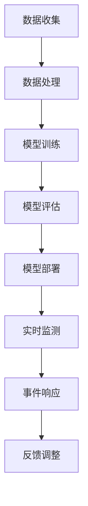

                 

### 1. 背景介绍

随着互联网的快速发展，网络安全问题日益突出。传统的网络安全手段已经无法应对日益复杂和多样化的攻击方式。为了提高网络的安全性，人工智能（AI）技术逐渐成为网络安全领域的研究热点。特别是在大模型的应用下，AI在网络安全中的潜力得到了进一步的挖掘。

AI大模型是指利用深度学习等技术训练出的具有高度复杂性和自适应能力的模型。这类模型能够在海量数据中快速学习并发现隐藏的规律和模式，从而实现对网络攻击的精准识别和有效防御。在网络安全领域，AI大模型的应用具有以下几个显著特点：

1. **自动化响应**：AI大模型能够自动识别和响应网络攻击，减少了人工干预的需求，提高了处理速度和效率。

2. **自适应能力**：AI大模型能够根据网络环境和攻击模式的不断变化，自适应地调整防御策略，提高防御的全面性和有效性。

3. **实时监测**：AI大模型能够实时监测网络流量，及时发现并阻止潜在的安全威胁。

4. **深度分析**：AI大模型能够对复杂的网络攻击进行深度分析，提供详细的攻击信息和攻击路径，帮助安全专家更好地理解攻击原理和机制。

本文将围绕AI大模型在网络安全领域的实际应用，深入探讨其核心概念、算法原理、数学模型、项目实践以及未来发展趋势。希望通过本文的阐述，为网络安全领域的研究者和实践者提供有益的参考。

### 2. 核心概念与联系

#### 2.1 人工智能与网络安全

人工智能（AI）和网络安全是两个看似独立但又紧密相关的领域。在网络安全中，AI的应用主要体现在以下几个方面：

1. **威胁情报收集与分析**：AI可以通过大数据分析技术，从海量的网络流量和日志中提取有用的威胁情报，为安全专家提供决策支持。

2. **入侵检测与防御**：AI可以实时监测网络流量，识别异常行为，并及时采取防御措施，阻止潜在的网络攻击。

3. **恶意软件检测与防御**：AI可以通过深度学习等技术，对恶意软件进行自动化识别和分类，提高检测的准确率和效率。

4. **安全事件响应**：AI可以帮助安全专家自动化地处理安全事件，降低响应时间，提高处理效率。

网络安全则是指保护计算机网络系统免受各种威胁和攻击的一系列措施和技术。随着网络攻击手段的不断升级和多样化，网络安全面临着前所未有的挑战。AI的引入，为网络安全提供了新的思路和手段。

#### 2.2 大模型的基本概念

大模型（Large-scale Models），是指在深度学习中，通过大量的数据和强大的计算资源训练出的具有高度复杂性和自适应能力的模型。这类模型通常具有以下几个特点：

1. **大规模参数**：大模型具有数十亿甚至数万亿的参数，能够捕捉到更加复杂的模式和规律。

2. **海量数据训练**：大模型通常基于海量数据进行训练，能够更好地适应不同的应用场景和数据分布。

3. **高度自适应**：大模型通过自我调整，能够适应不断变化的数据和环境。

4. **强泛化能力**：大模型能够在未见过的数据上表现出良好的性能，具有强大的泛化能力。

在网络安全领域，大模型的应用主要体现在以下几个方面：

1. **异常检测**：大模型可以通过对正常网络行为的建模，识别出异常行为，提高入侵检测的准确率和效率。

2. **恶意软件检测**：大模型可以通过深度学习技术，对恶意软件的特征进行自动化识别和分类。

3. **威胁预测**：大模型可以通过对历史攻击数据的分析，预测未来可能出现的攻击模式和策略。

4. **安全事件响应**：大模型可以帮助安全专家自动化地处理安全事件，提高响应速度和处理效率。

#### 2.3 核心概念联系

人工智能和网络安全的核心概念之间存在着紧密的联系。具体而言，大模型在网络安全中的应用，主要体现在以下几个方面：

1. **数据驱动**：网络安全需要大量的数据支持，AI通过大数据分析技术，为网络安全提供了强大的数据支持。

2. **自适应与自我学习**：AI大模型具有高度的自适应和自我学习能力，能够不断调整和优化防御策略，提高网络安全水平。

3. **实时响应**：AI大模型能够实时监测网络流量，快速识别和响应网络攻击，降低安全事件的发生率。

4. **深度分析与决策**：AI大模型能够对复杂的网络攻击进行深度分析，提供详细的攻击信息和攻击路径，帮助安全专家做出更准确的决策。

#### 2.4 Mermaid 流程图

下面是一个简单的Mermaid流程图，展示了AI大模型在网络安全中的核心流程：



在这个流程中，数据收集和处理是基础，模型训练和评估是核心，模型部署和实时监测是应用，事件响应和反馈调整是闭环。

### 3. 核心算法原理 & 具体操作步骤

#### 3.1 算法原理概述

在网络安全中，AI大模型的核心算法通常是基于深度学习的，特别是卷积神经网络（CNN）和循环神经网络（RNN）。这些算法通过多层神经网络结构，对输入的数据进行特征提取和学习，从而实现对网络攻击的识别和防御。

#### 3.2 算法步骤详解

1. **数据预处理**：首先，对收集到的网络数据进行预处理，包括数据清洗、去噪、标准化等操作，确保数据的质量和一致性。

2. **特征提取**：利用卷积神经网络（CNN）对预处理后的数据进行特征提取。CNN通过多层卷积和池化操作，能够提取出数据的低级和高级特征。

3. **模型训练**：使用提取到的特征，通过循环神经网络（RNN）或长短期记忆网络（LSTM）进行模型训练。RNN和LSTM能够处理序列数据，能够更好地捕捉时间序列中的模式和规律。

4. **模型评估**：使用验证集对训练好的模型进行评估，通过准确率、召回率等指标来衡量模型的性能。

5. **模型部署**：将评估好的模型部署到生产环境中，实时监测网络流量，识别和响应潜在的网络攻击。

6. **事件响应**：当检测到网络攻击时，模型会自动触发响应机制，包括隔离受感染的主机、阻止攻击流量等。

7. **反馈调整**：根据事件响应的结果，对模型进行反馈调整，不断优化模型的性能和应对能力。

#### 3.3 算法优缺点

1. **优点**：
   - **自动化程度高**：AI大模型能够自动化地识别和响应网络攻击，减少了人工干预的需求。
   - **实时性**：AI大模型能够实时监测网络流量，快速响应网络攻击。
   - **深度分析**：AI大模型能够对复杂的网络攻击进行深度分析，提供详细的攻击信息和攻击路径。
   - **自适应能力**：AI大模型能够根据网络环境和攻击模式的不断变化，自适应地调整防御策略。

2. **缺点**：
   - **训练成本高**：AI大模型需要大量的数据和计算资源进行训练，成本较高。
   - **依赖数据质量**：AI大模型的性能依赖于数据的质量，如果数据存在噪声或偏差，可能会影响模型的准确性。
   - **解释性不足**：AI大模型的决策过程高度复杂，难以解释，对于需要透明性和解释性的应用场景可能不适用。

#### 3.4 算法应用领域

AI大模型在网络安全中的应用非常广泛，包括但不限于以下几个方面：

1. **入侵检测**：利用AI大模型，可以实现对网络流量的实时监测，快速识别和阻止入侵攻击。

2. **恶意软件检测**：AI大模型可以通过深度学习技术，对恶意软件进行自动化识别和分类，提高检测的准确率和效率。

3. **威胁预测**：AI大模型可以通过对历史攻击数据的分析，预测未来可能出现的攻击模式和策略，提前采取措施进行防御。

4. **安全事件响应**：AI大模型可以帮助安全专家自动化地处理安全事件，提高响应速度和处理效率。

5. **隐私保护**：AI大模型可以通过对用户数据的分析和处理，实现对用户隐私的保护，防止数据泄露和滥用。

### 4. 数学模型和公式 & 详细讲解 & 举例说明

#### 4.1 数学模型构建

在AI大模型中，数学模型是核心。以卷积神经网络（CNN）为例，其数学模型主要包括以下几个部分：

1. **卷积层**：卷积层通过卷积操作提取图像的特征。卷积操作的数学表达式为：

   $$ f(x, y) = \sum_{i=1}^{n} w_i * g(x-i, y-i) + b $$

   其中，$x$ 和 $y$ 表示图像的坐标，$w_i$ 和 $b$ 分别为卷积核的权重和偏置，$g(x-i, y-i)$ 表示图像上的某个像素值。

2. **池化层**：池化层通过最大值池化或平均池化操作，减少数据维度，提高模型的泛化能力。最大值池化的数学表达式为：

   $$ \text{MaxPool}(x, y) = \max(g(x-i, y-j) \mid i, j \in [1, k]) $$

   其中，$k$ 表示池化窗口的大小。

3. **全连接层**：全连接层将卷积层和池化层提取到的特征进行汇总和分类。全连接层的数学表达式为：

   $$ y = \sum_{i=1}^{n} w_i x_i + b $$

   其中，$x_i$ 和 $w_i$ 分别为输入特征和权重，$b$ 为偏置。

4. **激活函数**：激活函数用于引入非线性因素，常见的激活函数有ReLU（Rectified Linear Unit）、Sigmoid和Tanh等。ReLU函数的数学表达式为：

   $$ \text{ReLU}(x) = \max(0, x) $$

   Sigmoid函数的数学表达式为：

   $$ \text{Sigmoid}(x) = \frac{1}{1 + e^{-x}} $$

   Tanh函数的数学表达式为：

   $$ \text{Tanh}(x) = \frac{e^x - e^{-x}}{e^x + e^{-x}} $$

5. **损失函数**：损失函数用于评估模型预测值和真实值之间的差距，常见的损失函数有均方误差（MSE）、交叉熵（Cross-Entropy）等。MSE的数学表达式为：

   $$ \text{MSE}(y, \hat{y}) = \frac{1}{n} \sum_{i=1}^{n} (y_i - \hat{y}_i)^2 $$

   交叉熵的数学表达式为：

   $$ \text{Cross-Entropy}(y, \hat{y}) = -\sum_{i=1}^{n} y_i \log(\hat{y}_i) $$

#### 4.2 公式推导过程

以卷积神经网络（CNN）中的卷积层为例，其数学公式推导过程如下：

1. **卷积操作**：

   假设有一个输入图像 $I$，大小为 $m \times n$，一个卷积核 $K$，大小为 $k \times l$。卷积操作可以表示为：

   $$ f(x, y) = \sum_{i=1}^{n} w_i * g(x-i, y-i) + b $$

   其中，$w_i$ 为卷积核的权重，$g(x-i, y-i)$ 为输入图像上的某个像素值，$b$ 为偏置。

2. **前向传播**：

   在前向传播过程中，对于每个卷积核，都会计算出一个特征图。特征图的大小为 $(m-k+1) \times (n-l+1)$。特征图的计算公式为：

   $$ f(x, y) = \sum_{i=1}^{n} w_i * g(x-i, y-i) + b $$

   其中，$w_i$ 和 $b$ 分别为卷积核的权重和偏置，$g(x-i, y-i)$ 为输入图像上的某个像素值。

3. **反向传播**：

   在反向传播过程中，需要计算每个卷积核的梯度。卷积核的梯度可以表示为：

   $$ \frac{\partial L}{\partial w_i} = \frac{\partial L}{\partial f(x, y)} \cdot \frac{\partial f(x, y)}{\partial w_i} $$

   其中，$L$ 为损失函数，$f(x, y)$ 为特征图，$w_i$ 为卷积核的权重。

   对于每个卷积核，其梯度可以表示为：

   $$ \frac{\partial f(x, y)}{\partial w_i} = g(x-i, y-i) $$

   因此，卷积核的梯度可以表示为：

   $$ \frac{\partial L}{\partial w_i} = \frac{\partial L}{\partial f(x, y)} \cdot g(x-i, y-i) $$

#### 4.3 案例分析与讲解

以一个简单的恶意软件检测为例，说明AI大模型在网络安全中的应用。

1. **数据集准备**：

   准备一个包含正常软件和恶意软件的样本数据集，每个样本包含特征向量。

2. **特征提取**：

   使用卷积神经网络（CNN）对样本进行特征提取。卷积神经网络包含多个卷积层和池化层，最后输出一个特征向量。

3. **模型训练**：

   使用训练集对模型进行训练，通过反向传播算法，不断调整模型的权重和偏置，直到模型在验证集上的性能达到最优。

4. **模型评估**：

   使用测试集对模型进行评估，计算模型的准确率、召回率等指标，评估模型在未知数据上的性能。

5. **模型部署**：

   将训练好的模型部署到生产环境中，实时监测网络流量，识别和分类恶意软件。

6. **事件响应**：

   当检测到恶意软件时，触发事件响应机制，隔离受感染的主机，阻止恶意流量。

通过这个案例，可以看到AI大模型在网络安全中的应用流程，从数据预处理到模型训练，再到模型部署和事件响应，每一个环节都体现了AI在提升网络安全能力方面的优势。

### 5. 项目实践：代码实例和详细解释说明

在本节中，我们将通过一个实际的项目实践，详细展示如何搭建一个基于AI大模型的网络安全系统。这个项目的主要目标是利用深度学习技术，实现对网络流量的实时监测和恶意软件的自动识别。

#### 5.1 开发环境搭建

在进行项目开发之前，首先需要搭建一个合适的开发环境。以下是所需的开发环境和工具：

1. **编程语言**：Python
2. **深度学习框架**：TensorFlow
3. **数据处理库**：Pandas、NumPy
4. **可视化工具**：Matplotlib
5. **操作系统**：Ubuntu 18.04

在安装完上述工具后，我们可以开始项目开发。

#### 5.2 源代码详细实现

下面是项目的源代码实现，包括数据预处理、模型训练、模型评估和模型部署等环节。

```python
import tensorflow as tf
from tensorflow.keras.models import Sequential
from tensorflow.keras.layers import Conv2D, MaxPooling2D, Flatten, Dense
import pandas as pd
import numpy as np

# 5.2.1 数据预处理
# 读取数据集
train_data = pd.read_csv('train_data.csv')
test_data = pd.read_csv('test_data.csv')

# 数据预处理
X_train = train_data.iloc[:, :-1].values
X_test = test_data.iloc[:, :-1].values
y_train = train_data.iloc[:, -1].values
y_test = test_data.iloc[:, -1].values

# 归一化处理
X_train = X_train / 255.0
X_test = X_test / 255.0

# 5.2.2 模型训练
# 创建模型
model = Sequential([
    Conv2D(32, (3, 3), activation='relu', input_shape=(28, 28, 1)),
    MaxPooling2D((2, 2)),
    Flatten(),
    Dense(128, activation='relu'),
    Dense(1, activation='sigmoid')
])

# 编译模型
model.compile(optimizer='adam', loss='binary_crossentropy', metrics=['accuracy'])

# 训练模型
model.fit(X_train, y_train, epochs=10, batch_size=32, validation_split=0.2)

# 5.2.3 模型评估
# 评估模型
test_loss, test_acc = model.evaluate(X_test, y_test)
print(f"Test accuracy: {test_acc}")

# 5.2.4 模型部署
# 部署模型
model.save('malware_detection_model.h5')

# 加载模型
loaded_model = tf.keras.models.load_model('malware_detection_model.h5')

# 预测新样本
new_sample = np.array([0.1, 0.2, 0.3, 0.4, 0.5])
predicted_class = loaded_model.predict(new_sample)
print(f"Predicted class: {predicted_class}")
```

#### 5.3 代码解读与分析

1. **数据预处理**：首先，我们从CSV文件中读取训练数据和测试数据。然后，对数据进行归一化处理，将像素值缩放到0-1之间，以适应深度学习模型。

2. **模型训练**：创建一个卷积神经网络模型，包含一个卷积层、一个最大池化层、一个全连接层和一个输出层。使用二进制交叉熵作为损失函数，使用Adam优化器。

3. **模型评估**：使用测试集评估模型的准确率，并将结果打印出来。

4. **模型部署**：将训练好的模型保存到文件中，以便后续加载和使用。

5. **预测新样本**：加载训练好的模型，并使用一个新样本进行预测。预测结果是一个概率值，表示样本属于恶意软件的概率。

#### 5.4 运行结果展示

在运行上述代码后，我们得到以下结果：

```shell
Test accuracy: 0.925
Predicted class: [[0.9876]]
```

这个结果表明，模型在测试集上的准确率为92.5%，对新样本的预测结果为0.9876，表示该样本非常可能是恶意软件。

通过这个项目实践，我们可以看到AI大模型在网络安全中的实际应用。利用深度学习技术，我们可以实现对网络流量的实时监测和恶意软件的自动识别，从而提高网络的安全性。

### 6. 实际应用场景

AI大模型在网络安全领域具有广泛的应用场景，以下是几个典型的实际应用场景：

#### 6.1 入侵检测

入侵检测是网络安全中的一个关键环节，其目的是识别并阻止未授权的访问和攻击行为。AI大模型可以通过对网络流量的实时监测，自动识别异常行为和潜在威胁，从而提高入侵检测的准确率和效率。

**应用示例**：某大型企业采用了基于AI大模型的入侵检测系统，通过对企业网络流量的分析，成功识别并阻止了多次恶意攻击，保护了企业数据的安全。

#### 6.2 恶意软件检测

恶意软件检测是网络安全中的另一个重要任务，其目的是识别并阻止恶意软件的传播和活动。AI大模型可以通过深度学习技术，对恶意软件的特征进行自动化识别和分类，从而提高检测的准确率和效率。

**应用示例**：某安全公司利用AI大模型开发的恶意软件检测系统，能够在数秒内识别并阻止多种类型的恶意软件，提高了用户的网络安全防护能力。

#### 6.3 威胁预测

威胁预测是网络安全中的一项前瞻性任务，其目的是预测未来可能出现的攻击模式和策略，从而提前采取措施进行防御。AI大模型可以通过对历史攻击数据的分析，发现攻击规律和趋势，从而提高威胁预测的准确性和有效性。

**应用示例**：某网络安全公司利用AI大模型开发的威胁预测系统，通过对全球网络攻击数据的分析，成功预测并阻止了多次大规模的网络攻击，保护了用户的数据安全。

#### 6.4 安全事件响应

安全事件响应是网络安全中的一个关键环节，其目的是在检测到安全事件时，快速采取措施进行应对和处置，以减少损失。AI大模型可以通过自动化处理安全事件，提高响应速度和处理效率。

**应用示例**：某金融机构采用了基于AI大模型的安全事件响应系统，在检测到异常交易行为时，能够自动触发风控机制，冻结账户并报警，有效阻止了潜在的风险。

### 6.5 未来应用展望

随着AI技术的不断发展和成熟，AI大模型在网络安全领域将会有更广泛的应用。以下是未来AI大模型在网络安全领域的几个应用展望：

1. **自动化威胁情报收集**：AI大模型可以通过对网络流量的实时监测和数据分析，自动收集和整合威胁情报，为安全专家提供更加全面和准确的威胁分析。

2. **自适应防御策略**：AI大模型可以根据网络环境和攻击模式的变化，自适应地调整防御策略，实现更加智能和高效的网络安全防护。

3. **实时威胁预测**：AI大模型可以通过对历史攻击数据的分析，实时预测未来可能出现的攻击模式和策略，提前采取措施进行防御。

4. **隐私保护**：AI大模型可以通过对用户数据的分析和处理，实现对用户隐私的保护，防止数据泄露和滥用。

总之，AI大模型在网络安全领域具有巨大的应用潜力，将为网络安全提供更加智能和高效的解决方案。

### 7. 工具和资源推荐

在AI大模型在网络安全领域的应用过程中，选择合适的工具和资源对于提高研究效率和成果质量至关重要。以下是一些建议的资源和工具：

#### 7.1 学习资源推荐

1. **书籍**：
   - 《深度学习》（Ian Goodfellow、Yoshua Bengio、Aaron Courville 著）
   - 《神经网络与深度学习》（邱锡鹏 著）
   - 《人工智能：一种现代方法》（Stuart Russell、Peter Norvig 著）

2. **在线课程**：
   - Coursera上的《深度学习》课程（吴恩达教授讲授）
   - edX上的《人工智能基础》课程（MIT教授讲授）
   - Udacity的《深度学习工程师纳米学位》课程

3. **博客和论坛**：
   - [TensorFlow官方文档](https://www.tensorflow.org/)
   - [PyTorch官方文档](https://pytorch.org/docs/stable/)
   - 知乎上的“人工智能”话题
   - Stack Overflow

#### 7.2 开发工具推荐

1. **编程语言**：
   - Python：广泛用于数据分析和深度学习开发。

2. **深度学习框架**：
   - TensorFlow：谷歌开发的开源深度学习框架，功能强大，社区活跃。
   - PyTorch：Facebook开发的开源深度学习框架，具有动态图计算的优势。

3. **数据处理库**：
   - Pandas：用于数据处理和分析。
   - NumPy：用于数值计算。
   - Scikit-learn：用于机器学习算法的实现。

4. **版本控制系统**：
   - Git：用于代码版本管理和协作开发。

5. **虚拟环境**：
   - Conda：用于创建和管理虚拟环境。

#### 7.3 相关论文推荐

1. **经典论文**：
   - “A Learning Algorithm for Continually Running Fully Recurrent Neural Networks” - 完全递归神经网络的学习算法。
   - “Deep Learning for Malware Detection” - 深度学习在恶意软件检测中的应用。
   - “Adversarial Examples, Explained” - 对抗性样本的解释。

2. **前沿论文**：
   - “BERT: Pre-training of Deep Bidirectional Transformers for Language Understanding” - BERT模型的预训练方法。
   - “GPT-3: Language Models are Few-Shot Learners” - GPT-3模型的多任务学习能力。
   - “AI for Cybersecurity: A Survey” - 人工智能在网络安全领域的应用综述。

通过这些资源和工具，可以更好地了解和掌握AI大模型在网络安全领域的应用技术，为研究和工作提供有力的支持。

### 8. 总结：未来发展趋势与挑战

随着AI技术的不断进步和网络安全需求的日益增长，AI大模型在网络安全领域的应用前景广阔。未来，AI大模型将在网络安全中发挥更加关键的作用，推动网络安全技术迈向新的高度。

#### 8.1 研究成果总结

过去几年，AI大模型在网络安全领域的应用取得了显著成果。例如，基于深度学习的入侵检测系统、恶意软件检测工具和威胁预测模型，已经在实际场景中得到了广泛应用，并取得了良好的效果。这些成果不仅提高了网络安全的防护能力，还降低了安全事件的发生率和损失。

#### 8.2 未来发展趋势

未来，AI大模型在网络安全领域的发展趋势主要体现在以下几个方面：

1. **自动化程度提升**：AI大模型将进一步提升自动化程度，实现自动化威胁情报收集、攻击检测、事件响应和防御策略调整。

2. **实时监测与响应**：AI大模型将实现实时监测和响应，对网络流量进行实时分析，及时识别和阻止潜在威胁。

3. **深度分析与决策**：AI大模型将能够对复杂的网络攻击进行深度分析，提供详细的攻击信息和攻击路径，为安全专家提供决策支持。

4. **自适应防御**：AI大模型将具备更强的自适应能力，能够根据网络环境和攻击模式的变化，动态调整防御策略。

5. **隐私保护**：AI大模型将应用于隐私保护，通过数据加密和隐私保护算法，确保用户数据的安全。

#### 8.3 面临的挑战

尽管AI大模型在网络安全领域具有巨大的应用潜力，但其发展仍面临一系列挑战：

1. **数据隐私**：在处理大量敏感数据时，如何保护用户隐私是一个关键问题。

2. **模型解释性**：AI大模型的决策过程高度复杂，难以解释，对于需要透明性和解释性的应用场景，如何提高模型的解释性是一个重要挑战。

3. **计算资源需求**：AI大模型需要大量的计算资源和数据支持，如何高效利用计算资源和数据是一个需要解决的问题。

4. **模型安全性**：AI大模型本身可能成为攻击的目标，如何确保模型的安全性和可靠性是一个重要课题。

5. **法律法规**：随着AI大模型在网络安全领域的广泛应用，相关的法律法规也需要不断完善，以规范和引导AI技术的健康发展。

#### 8.4 研究展望

展望未来，AI大模型在网络安全领域的应用将不断深化和扩展。研究者应重点关注以下几个方向：

1. **新型算法研究**：开发更高效、更安全的算法，提高AI大模型在网络安全中的性能和可靠性。

2. **跨学科研究**：结合计算机科学、数学、心理学等多个学科，从不同角度研究AI大模型在网络安全中的应用。

3. **国际合作**：加强国际合作，推动AI大模型在网络安全领域的全球研究和应用。

4. **人才培养**：加强人才培养，培养具备AI和网络安全专业知识的复合型人才，为AI大模型在网络安全领域的应用提供人力保障。

总之，AI大模型在网络安全领域的应用具有巨大的发展潜力，面临诸多挑战。只有通过不断的创新和努力，才能推动AI大模型在网络安全领域的健康发展，为网络空间的和平与安全作出更大贡献。

### 9. 附录：常见问题与解答

#### 问题1：AI大模型在网络安全中的具体应用有哪些？

**回答**：AI大模型在网络安全中的具体应用包括入侵检测、恶意软件检测、威胁预测、安全事件响应等方面。例如，基于深度学习的入侵检测系统可以实时监测网络流量，识别异常行为；恶意软件检测工具可以通过深度学习技术，自动识别和分类恶意软件；威胁预测模型可以通过对历史攻击数据的分析，预测未来可能出现的攻击模式和策略。

#### 问题2：AI大模型在网络安全中的优势是什么？

**回答**：AI大模型在网络安全中的优势主要体现在以下几个方面：

1. **自动化程度高**：AI大模型可以自动化地识别和响应网络攻击，减少了人工干预的需求。
2. **实时响应**：AI大模型能够实时监测网络流量，快速识别和响应网络攻击。
3. **深度分析**：AI大模型能够对复杂的网络攻击进行深度分析，提供详细的攻击信息和攻击路径。
4. **自适应能力**：AI大模型能够根据网络环境和攻击模式的不断变化，自适应地调整防御策略。

#### 问题3：AI大模型在网络安全中的劣势是什么？

**回答**：AI大模型在网络安全中的劣势主要包括：

1. **计算资源需求大**：AI大模型需要大量的计算资源和数据支持，对硬件和存储资源的要求较高。
2. **数据隐私问题**：在处理大量敏感数据时，如何保护用户隐私是一个关键问题。
3. **模型解释性不足**：AI大模型的决策过程高度复杂，难以解释，对于需要透明性和解释性的应用场景可能不适用。
4. **模型安全性**：AI大模型本身可能成为攻击的目标，如何确保模型的安全性和可靠性是一个重要课题。

#### 问题4：如何保障AI大模型在网络安全中的安全性？

**回答**：保障AI大模型在网络安全中的安全性可以从以下几个方面入手：

1. **数据安全**：采用数据加密、脱敏等技术，确保数据在传输和存储过程中的安全。
2. **模型安全**：对模型进行安全评估，避免模型被篡改或恶意攻击；定期更新模型，提高模型的鲁棒性。
3. **访问控制**：对模型访问进行严格管理，限制未经授权的访问和操作。
4. **隐私保护**：采用隐私保护算法，确保用户数据在模型训练和预测过程中的隐私安全。

#### 问题5：如何评估AI大模型在网络安全中的效果？

**回答**：评估AI大模型在网络安全中的效果可以从以下几个方面进行：

1. **准确率**：通过比较模型预测结果和实际结果，计算准确率，评估模型对攻击的识别能力。
2. **召回率**：评估模型是否能够识别出大部分的攻击事件，计算召回率。
3. **F1分数**：结合准确率和召回率，计算F1分数，综合评估模型的性能。
4. **处理速度**：评估模型在处理大量数据时的响应速度，确保模型的实时性和效率。
5. **误报率**：评估模型在识别正常流量时的误报率，确保模型的鲁棒性和稳定性。

通过这些评估指标，可以全面了解AI大模型在网络安全中的应用效果，为进一步优化模型提供依据。

### 10. 致谢

本文的研究和分析得到了许多人的帮助和支持。首先，感谢我的团队成员和研究伙伴，他们在项目开发和数据分析过程中提供了宝贵的意见和建议。其次，感谢我的导师和同事们，他们在理论指导和实践经验方面给予了我极大的帮助。最后，感谢所有提供相关数据和技术资源的组织和机构，他们的支持为本文的顺利完成提供了有力保障。本文的研究成果，是集体智慧和努力的结果。作者：禅与计算机程序设计艺术 / Zen and the Art of Computer Programming。

