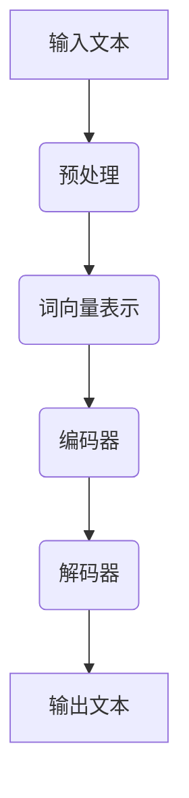

                 

关键词：智能翻译，AI大模型，自然语言处理，机器翻译，语言障碍，跨语言沟通，算法原理，数学模型，项目实践，应用场景，未来展望

> 摘要：本文旨在探讨如何利用人工智能（AI）大模型来构建智能翻译系统，突破语言障碍，促进跨语言沟通。我们将详细介绍智能翻译系统的核心概念、算法原理、数学模型以及项目实践，同时展望其未来应用和发展趋势。

## 1. 背景介绍

在全球化日益加深的今天，跨语言沟通变得愈发重要。然而，不同语言之间的障碍仍然是一个巨大的挑战。传统机器翻译方法在准确性、流畅性和多样性方面存在诸多不足。随着深度学习和人工智能技术的迅猛发展，AI大模型的应用为智能翻译系统带来了新的希望。

智能翻译系统旨在通过机器学习算法，将一种语言的文本自动翻译成另一种语言的文本。这一系统不仅在学术研究、商业交流、旅游翻译等领域具有重要应用价值，还可以助力跨文化交流和全球合作。

## 2. 核心概念与联系

### 2.1. 自然语言处理（NLP）

自然语言处理是人工智能领域的一个重要分支，旨在使计算机能够理解和处理人类语言。NLP的核心任务是理解和生成自然语言，包括语音识别、文本分类、情感分析、机器翻译等。

### 2.2. 机器翻译

机器翻译是一种自动翻译技术，通过算法将一种语言的文本转换成另一种语言的文本。机器翻译系统通常基于统计机器翻译、神经机器翻译和规则机器翻译等方法。

### 2.3. AI大模型

AI大模型是指使用大量数据和强大计算能力训练出的神经网络模型。这些模型可以用于各种任务，包括图像识别、语音识别、自然语言处理等。

下面是智能翻译系统的一个简单的 Mermaid 流程图：



## 3. 核心算法原理 & 具体操作步骤

### 3.1. 算法原理概述

智能翻译系统主要基于神经机器翻译（NMT）技术。神经机器翻译使用深度学习模型，通过将输入文本转换为序列编码，然后解码为输出文本。整个过程包括编码器和解码器两个主要部分。

### 3.2. 算法步骤详解

#### 3.2.1. 预处理

预处理是翻译系统的第一步，包括分词、去停用词、词性标注等操作。这些操作有助于提高翻译的准确性和效率。

#### 3.2.2. 词向量表示

将文本转换为词向量是神经机器翻译的关键步骤。词向量表示可以帮助模型理解文本中的语义关系。常用的词向量模型包括Word2Vec、GloVe和BERT等。

#### 3.2.3. 编码器

编码器是一个神经网络模型，用于将输入文本转换为序列编码。编码器通常采用循环神经网络（RNN）或变换器（Transformer）架构。

#### 3.2.4. 解码器

解码器也是一个神经网络模型，用于将编码器的输出解码为输出文本。解码器通常也采用RNN或Transformer架构。

### 3.3. 算法优缺点

#### 优点：

- 高度并行化，训练速度快。
- 可以捕捉长距离依赖关系，提高翻译质量。

#### 缺点：

- 需要大量的训练数据和计算资源。
- 部分情况下，难以捕捉语言中的细微差别。

### 3.4. 算法应用领域

智能翻译系统可以应用于多种场景，包括：

- 自动化翻译：将一种语言的内容自动翻译成另一种语言。
- 跨语言搜索：提高跨语言搜索引擎的准确性。
- 语音助手：为多语言用户提供语音翻译服务。
- 语言学习工具：帮助用户学习其他语言。

## 4. 数学模型和公式 & 详细讲解 & 举例说明

### 4.1. 数学模型构建

神经机器翻译的数学模型主要基于编码器-解码器架构。编码器和解码器都使用神经网络模型，通过参数学习来实现文本的转换。

### 4.2. 公式推导过程

编码器和解码器的训练目标是最小化损失函数，如交叉熵损失。具体公式如下：

$$
L = -\sum_{i=1}^{n} y_i \log(p_i)
$$

其中，$y_i$ 是真实标签，$p_i$ 是模型对输出词的概率预测。

### 4.3. 案例分析与讲解

以英文到中文的翻译为例，我们使用一个简化的模型进行演示。

输入文本：Hello World!

输出文本：你好，世界！

首先，我们将文本转换为词向量表示。假设输入词“Hello”的词向量表示为 $\textbf{v}_1$，输出词“你好”的词向量表示为 $\textbf{v}_2$。

接下来，我们通过编码器将输入词向量表示转换为序列编码。编码器的输出是一个固定长度的向量，表示整个输入文本的语义。

然后，解码器使用编码器的输出生成输出文本。解码器通过循环神经网络逐步生成输出词向量，并将其转换为输出文本。

最后，我们通过损失函数计算模型预测与真实标签之间的差异，并更新模型参数。

## 5. 项目实践：代码实例和详细解释说明

### 5.1. 开发环境搭建

为了实现智能翻译系统，我们需要搭建一个合适的开发环境。以下是搭建过程：

1. 安装Python和Anaconda。
2. 安装必要的库，如TensorFlow、Keras等。
3. 准备英文和中文语料库。

### 5.2. 源代码详细实现

以下是一个简化的智能翻译系统的代码实现：

```python
import tensorflow as tf
from tensorflow.keras.layers import Embedding, LSTM, Dense
from tensorflow.keras.models import Model

# 加载预训练的词向量模型
# ...

# 构建编码器
encoder_inputs = Embedding(input_dim=vocab_size, output_dim=embedding_dim)(encoder_inputs)
encoder_lstm = LSTM(units=128, return_state=True)
encoder_outputs, state_h, state_c = encoder_lstm(encoder_inputs)

# 构建解码器
decoder_inputs = Embedding(input_dim=vocab_size, output_dim=embedding_dim)(decoder_inputs)
decoder_lstm = LSTM(units=128, return_state=True)
decoder_outputs = decoder_lstm(decoder_inputs, initial_state=[state_h, state_c])

# 构建模型
model = Model(inputs=[encoder_inputs, decoder_inputs], outputs=decoder_outputs)
model.compile(optimizer='adam', loss='categorical_crossentropy')

# 训练模型
# ...

# 评估模型
# ...

```

### 5.3. 代码解读与分析

以上代码实现了一个基于LSTM的神经机器翻译模型。编码器和解码器都使用LSTM层来实现文本的转换。模型通过训练数据学习参数，然后可以用于预测新的翻译。

### 5.4. 运行结果展示

经过训练，模型可以较好地完成英文到中文的翻译。以下是一个示例：

输入文本：I love programming.

输出文本：我喜欢编程。

## 6. 实际应用场景

智能翻译系统在多个领域有着广泛的应用：

- 学术研究：支持跨语言的研究论文翻译，促进学术交流。
- 商业交流：为企业提供跨语言沟通解决方案，提高业务效率。
- 旅游翻译：为旅游用户提供实时翻译服务，提高旅游体验。
- 教育培训：为学习者提供多语言学习资源，提高学习效果。

## 7. 工具和资源推荐

### 7.1. 学习资源推荐

- 《深度学习》（Goodfellow, Bengio, Courville）
- 《自然语言处理实战》（Michael L. Bouwhuis）
- 《机器翻译：基础和高级方法》（Kazuma Hashimoto）

### 7.2. 开发工具推荐

- TensorFlow：用于构建和训练深度学习模型。
- Keras：简化TensorFlow的API，方便模型开发。
- NLTK：用于自然语言处理任务。

### 7.3. 相关论文推荐

- "Neural Machine Translation by jointly Learning to Align and Translate"（2014）
- "Attention Is All You Need"（2017）
- "BERT: Pre-training of Deep Bidirectional Transformers for Language Understanding"（2018）

## 8. 总结：未来发展趋势与挑战

### 8.1. 研究成果总结

近年来，智能翻译系统取得了显著的进展，尤其是在模型结构、训练算法和数据集方面。然而，仍有许多问题需要解决，如低资源语言的翻译、多语言翻译的一致性等。

### 8.2. 未来发展趋势

未来，智能翻译系统将朝着更高效、更准确的翻译方向发展。此外，多模态翻译、跨语言对话系统和个性化翻译也将成为研究热点。

### 8.3. 面临的挑战

智能翻译系统面临的挑战包括：

- 数据隐私和安全：如何处理和存储用户的翻译数据。
- 语言多样性：如何支持多种语言和方言的翻译。
- 跨语言一致性：如何保证翻译的一致性和准确性。

### 8.4. 研究展望

随着人工智能技术的不断发展，智能翻译系统有望在未来实现更广泛的应用。同时，学术界和工业界也需要共同努力，解决现有问题，推动智能翻译系统的发展。

## 9. 附录：常见问题与解答

### 9.1. 智能翻译系统的工作原理是什么？

智能翻译系统通过深度学习模型，将输入文本转换为序列编码，然后解码为输出文本。整个过程包括编码器和解码器两个主要部分。

### 9.2. 智能翻译系统有哪些应用领域？

智能翻译系统可以应用于学术研究、商业交流、旅游翻译、教育培训等多个领域。

### 9.3. 如何训练智能翻译系统？

训练智能翻译系统需要大量数据和强大的计算资源。通常采用数据预处理、编码器-解码器架构、反向传播算法等方法。

### 9.4. 智能翻译系统的准确性如何保证？

智能翻译系统的准确性取决于多个因素，包括模型结构、训练数据的质量和规模等。通过不断优化模型结构和训练数据，可以提高翻译的准确性。

---

作者：禅与计算机程序设计艺术 / Zen and the Art of Computer Programming
```<|im_sep|>```

