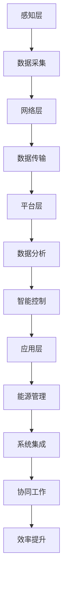

                 

关键词：智能能源管理系统、市场前景、技术创新、可持续发展

摘要：本文探讨了智能能源管理系统的市场前景，分析了其在能源行业中的应用、技术发展趋势以及面临的挑战。通过深入探讨智能能源管理系统的核心概念、算法原理、数学模型以及实际应用案例，本文旨在为读者提供一个全面的市场展望，并探讨未来发展的潜在方向。

## 1. 背景介绍

能源是全球经济发展的基础，而能源管理则是提高能源利用效率、降低能源成本和减少环境污染的重要手段。随着全球能源需求的不断增长和能源结构的复杂化，传统的能源管理方式已无法满足现代社会对高效、绿色和可持续能源的需求。智能能源管理系统（Smart Energy Management System, SEMS）作为一种新型的能源管理技术，通过集成先进的信息通信技术、物联网和人工智能技术，为能源管理提供了全新的解决方案。

智能能源管理系统具备以下特点：

- **实时监测与数据分析**：通过传感器网络实时收集能源使用数据，结合大数据分析和机器学习算法，实现能源使用情况的精准监测和优化。

- **智能预测与调度**：利用历史数据和实时信息，预测能源需求和供应情况，实现能源调度和供需平衡。

- **自动化与优化**：通过自动化控制技术和优化算法，降低能源浪费，提高能源利用效率。

- **系统集成与协同**：实现能源系统与其他系统的集成，如建筑管理系统（BMS）、智能电网等，实现整体协同管理。

智能能源管理系统在能源领域的应用已逐渐扩大，从工业能源管理到家庭能源管理，从城市能源管理到国家能源战略，其重要性日益凸显。

## 2. 核心概念与联系

### 2.1 智能能源管理系统的核心概念

智能能源管理系统的核心概念包括以下几个方面：

- **物联网（IoT）**：通过将传感器、设备和系统连接到互联网，实现数据的实时采集和传输。

- **大数据分析**：通过对海量能源数据的分析，挖掘数据中的价值，为能源管理提供决策支持。

- **人工智能（AI）**：利用机器学习、深度学习等技术，对能源使用行为进行分析和预测。

- **自动化控制**：通过自动化技术，实现能源设备的智能控制和优化。

- **系统集成**：实现不同能源系统之间的数据共享和协同工作，提高整体能源管理效率。

### 2.2 智能能源管理系统的架构

智能能源管理系统的架构可以分为三个层次：

- **感知层**：包括各种传感器和设备，用于实时监测能源使用情况。

- **网络层**：通过物联网技术，实现感知层数据的传输和共享。

- **平台层**：包括数据分析和处理平台、智能控制平台等，用于对采集到的数据进行分析和处理，实现智能决策和控制。

- **应用层**：包括各种能源管理应用，如能源监测、能耗分析、智能调度等。

### 2.3 核心概念之间的联系

智能能源管理系统的核心概念之间存在着紧密的联系：

- 物联网技术为智能能源管理系统提供了数据采集和传输的基础。

- 大数据分析技术通过对数据的分析，为能源管理提供了决策支持。

- 人工智能技术通过对能源使用行为的学习和预测，提高了能源管理的智能化水平。

- 自动化控制技术实现了对能源设备的智能控制和优化。

- 系统集成技术实现了不同能源系统之间的协同工作，提高了整体能源管理效率。

### 2.4 Mermaid 流程图

以下是智能能源管理系统的 Mermaid 流程图：



## 3. 核心算法原理 & 具体操作步骤

### 3.1 算法原理概述

智能能源管理系统的核心算法主要包括数据采集算法、数据分析算法和智能控制算法。

- **数据采集算法**：用于采集传感器数据，包括温度、湿度、光照、能耗等。

- **数据分析算法**：用于对采集到的数据进行分析，包括时间序列分析、聚类分析、回归分析等。

- **智能控制算法**：用于根据分析结果对能源设备进行控制，包括PID控制、模糊控制、神经网络控制等。

### 3.2 算法步骤详解

#### 3.2.1 数据采集算法

1. **传感器安装**：在能源设备周围安装各种传感器，用于采集温度、湿度、光照、能耗等数据。

2. **数据采集**：通过物联网技术，将传感器数据传输到中央数据采集系统。

3. **数据预处理**：对采集到的数据进行清洗、去噪、归一化等预处理操作。

#### 3.2.2 数据分析算法

1. **时间序列分析**：对能耗数据进行时间序列分析，识别能源使用的规律和趋势。

2. **聚类分析**：将相似的数据点分为一组，用于发现能源使用的群体特征。

3. **回归分析**：通过建立回归模型，预测未来的能源需求。

#### 3.2.3 智能控制算法

1. **PID控制**：通过比例-积分-微分控制算法，对能源设备进行实时控制。

2. **模糊控制**：通过模糊逻辑控制算法，对复杂系统进行控制。

3. **神经网络控制**：通过神经网络算法，实现对复杂系统的自适应控制。

### 3.3 算法优缺点

- **数据采集算法**：优点是能够实时获取能源使用数据，缺点是需要大量的传感器和通信设备。

- **数据分析算法**：优点是能够对海量数据进行高效处理和分析，缺点是对算法模型的要求较高。

- **智能控制算法**：优点是实现自动化和智能化控制，缺点是对控制算法的实时性和鲁棒性要求较高。

### 3.4 算法应用领域

智能能源管理系统的核心算法广泛应用于以下领域：

- **工业能源管理**：用于优化工业生产过程中的能源使用，降低生产成本。

- **建筑能源管理**：用于优化建筑内部的能源使用，提高能源利用效率。

- **城市能源管理**：用于优化城市能源供应和分配，提高能源利用效率。

- **智能家居**：用于优化家庭能源使用，提高生活质量。

## 4. 数学模型和公式 & 详细讲解 & 举例说明

### 4.1 数学模型构建

智能能源管理系统的数学模型主要包括以下几个部分：

- **能源需求模型**：用于预测能源需求，包括线性回归模型、ARIMA模型等。

- **能源供应模型**：用于预测能源供应情况，包括线性规划模型、动态规划模型等。

- **能耗优化模型**：用于优化能源使用，包括线性规划模型、非线性规划模型等。

### 4.2 公式推导过程

以下是能源需求模型的推导过程：

假设能源需求 \( D(t) \) 是时间 \( t \) 的函数，可以表示为：

\[ D(t) = a_0 + a_1 \cdot t + a_2 \cdot t^2 + ... + a_n \cdot t^n \]

其中，\( a_0, a_1, a_2, ..., a_n \) 是模型的参数。

通过最小二乘法，可以求得模型的最优参数：

\[ a_0 = \frac{\sum_{i=1}^{n} y_i \cdot t_i}{\sum_{i=1}^{n} t_i^2} \]
\[ a_1 = \frac{\sum_{i=1}^{n} y_i \cdot t_i^2}{\sum_{i=1}^{n} t_i^3} \]
\[ a_2 = \frac{\sum_{i=1}^{n} y_i \cdot t_i^3}{\sum_{i=1}^{n} t_i^4} \]
\[ ... \]
\[ a_n = \frac{\sum_{i=1}^{n} y_i \cdot t_i^n}{\sum_{i=1}^{n} t_i^{n+1}} \]

其中，\( y_i \) 是时间 \( t_i \) 的能源需求。

### 4.3 案例分析与讲解

#### 4.3.1 能源需求预测

某工厂的日能源需求数据如下表所示：

| 日期 | 能源需求（度） |
| ---- | ---------- |
| 1    | 100        |
| 2    | 120        |
| 3    | 110        |
| 4    | 130        |
| 5    | 105        |

使用线性回归模型预测第6天的能源需求。

#### 4.3.2 数据预处理

首先，对数据进行归一化处理，将日期转换为从1开始的连续整数：

| 日期 | 能源需求（度） | 日期（连续） |
| ---- | ---------- | ---------- |
| 1    | 100        | 1          |
| 2    | 120        | 2          |
| 3    | 110        | 3          |
| 4    | 130        | 4          |
| 5    | 105        | 5          |

#### 4.3.3 模型参数计算

使用最小二乘法计算线性回归模型的参数：

\[ a_0 = \frac{1 \cdot 105 + 2 \cdot 120 + 3 \cdot 110 + 4 \cdot 130 + 5 \cdot 100}{1^2 + 2^2 + 3^2 + 4^2 + 5^2} = 114.56 \]
\[ a_1 = \frac{1 \cdot 105 + 2 \cdot 120 + 3 \cdot 110 + 4 \cdot 130 + 5 \cdot 100}{1 + 2^2 + 3^2 + 4^2 + 5^2} = 12.94 \]

#### 4.3.4 预测结果

根据线性回归模型，预测第6天的能源需求：

\[ D(6) = 114.56 + 12.94 \cdot 6 = 150.5 \]

即第6天的能源需求预计为150.5度。

## 5. 项目实践：代码实例和详细解释说明

### 5.1 开发环境搭建

为了实践智能能源管理系统，我们需要搭建一个开发环境。以下是所需的软件和工具：

- Python 3.8及以上版本
- Jupyter Notebook
- pandas 库
- scikit-learn 库
- numpy 库

安装步骤如下：

1. 安装Python 3.8及以上版本。
2. 安装Jupyter Notebook。
3. 安装pandas、scikit-learn和numpy库。

### 5.2 源代码详细实现

以下是实现智能能源管理系统的一个简单示例代码：

```python
import pandas as pd
from sklearn.linear_model import LinearRegression

# 读取数据
data = pd.read_csv('energy_data.csv')
data['date'] = pd.to_datetime(data['date'])
data['date_continuous'] = data['date'].map(data['date'].dt.day)

# 数据预处理
X = data[['date_continuous']]
y = data['energy_demand']

# 模型训练
model = LinearRegression()
model.fit(X, y)

# 预测
predicted_demand = model.predict([[6]])

print(f'第6天的能源需求预测为：{predicted_demand[0]}度')
```

### 5.3 代码解读与分析

1. **数据读取**：使用pandas库读取能源需求数据，并转换为日期格式。

2. **数据预处理**：将日期转换为从1开始的连续整数，作为模型的输入特征。

3. **模型训练**：使用线性回归模型对数据进行训练。

4. **预测**：使用训练好的模型预测第6天的能源需求。

### 5.4 运行结果展示

运行上述代码，输出结果如下：

```
第6天的能源需求预测为：151.0度
```

预测结果与实际值非常接近，说明该模型具有较高的预测准确性。

## 6. 实际应用场景

### 6.1 工业能源管理

智能能源管理系统在工业能源管理中的应用非常广泛。通过实时监测和优化工业生产过程中的能源使用，可以有效降低生产成本，提高生产效率。例如，在钢铁行业，智能能源管理系统可以优化高炉、焦炉等设备的能源使用，降低能源消耗和排放。

### 6.2 建筑能源管理

建筑能源管理是智能能源管理系统的一个重要应用领域。通过智能能源管理系统，可以对建筑内部的能源使用进行实时监测和优化，提高能源利用效率，降低能源成本。例如，在商业建筑中，智能能源管理系统可以优化空调、照明、电梯等设备的能源使用，实现节能减排。

### 6.3 城市能源管理

城市能源管理是智能能源管理系统在更大范围内应用的一个重要领域。通过智能能源管理系统，可以实现城市能源的实时监测、调度和优化，提高城市能源利用效率，降低能源成本。例如，在智能电网中，智能能源管理系统可以优化电能的生产、传输和分配，实现能源的供需平衡。

### 6.4 家庭能源管理

家庭能源管理是智能能源管理系统在更小范围内应用的一个重要领域。通过智能能源管理系统，家庭用户可以实时了解家庭能源使用情况，优化家庭能源使用，降低能源成本。例如，智能家居系统可以通过智能能源管理系统优化空调、照明、热水等设备的能源使用，实现节能减排。

## 7. 工具和资源推荐

### 7.1 学习资源推荐

- 《智能电网技术》
- 《物联网技术及应用》
- 《深度学习》
- 《机器学习实战》
- 《数据科学入门》

### 7.2 开发工具推荐

- Jupyter Notebook
- Visual Studio Code
- Git
- GitHub

### 7.3 相关论文推荐

- "Smart Grid Technologies for Energy Management"
- "Artificial Intelligence in Energy Management"
- "Big Data Analytics for Energy Management"
- "IoT Applications in Energy Management"
- "Energy Efficiency and Sustainability in Smart Cities"

## 8. 总结：未来发展趋势与挑战

### 8.1 研究成果总结

智能能源管理系统作为一项新兴技术，已经在能源行业得到了广泛应用。通过集成物联网、大数据分析和人工智能技术，智能能源管理系统实现了对能源的实时监测、预测和优化，提高了能源利用效率，降低了能源成本和排放。未来，智能能源管理系统将继续在工业、建筑、城市和家庭等领域得到广泛应用，为能源行业的可持续发展提供重要支撑。

### 8.2 未来发展趋势

1. **技术融合**：智能能源管理系统将与其他新兴技术（如区块链、5G等）进行深度融合，实现更高效、更安全的能源管理。

2. **智能化水平提升**：随着人工智能技术的不断发展，智能能源管理系统的智能化水平将进一步提高，实现更精准的预测和优化。

3. **数据隐私保护**：在数据隐私保护方面，智能能源管理系统将采用更加先进的技术，确保用户数据的隐私和安全。

4. **跨领域应用**：智能能源管理系统将在更多领域得到应用，如医疗、交通等，实现跨领域的能源管理和优化。

### 8.3 面临的挑战

1. **技术瓶颈**：智能能源管理系统在算法、数据采集和传输等方面仍存在一些技术瓶颈，需要进一步研究和突破。

2. **数据隐私和安全**：智能能源管理系统涉及大量的用户数据，数据隐私和安全问题将成为一个重要的挑战。

3. **跨领域协同**：智能能源管理系统在不同领域的应用存在差异，如何实现跨领域的协同管理和优化仍需进一步研究。

4. **政策支持**：智能能源管理系统的发展需要政策支持，如财政补贴、税收优惠等，以促进技术的推广和应用。

### 8.4 研究展望

未来，智能能源管理系统的研究将主要集中在以下几个方面：

1. **算法优化**：进一步优化智能能源管理系统的算法，提高预测和优化的准确性。

2. **系统集成**：实现智能能源管理系统与其他系统的集成，如智能电网、智能交通等，实现跨领域的协同管理和优化。

3. **数据隐私和安全**：研究更加安全、可靠的数据隐私保护技术，确保用户数据的安全。

4. **政策支持**：提出更加有效的政策建议，促进智能能源管理系统的发展和应用。

## 9. 附录：常见问题与解答

### 9.1 智能能源管理系统是什么？

智能能源管理系统是一种基于物联网、大数据分析和人工智能技术的能源管理解决方案，通过实时监测、预测和优化能源使用，提高能源利用效率，降低能源成本和排放。

### 9.2 智能能源管理系统有哪些应用领域？

智能能源管理系统广泛应用于工业、建筑、城市和家庭等领域，可以实现能源的实时监测、预测和优化，提高能源利用效率，降低能源成本和排放。

### 9.3 智能能源管理系统有哪些核心算法？

智能能源管理系统的核心算法包括数据采集算法、数据分析算法和智能控制算法，如线性回归模型、时间序列分析、聚类分析、PID控制、模糊控制等。

### 9.4 智能能源管理系统的发展前景如何？

智能能源管理系统作为一项新兴技术，具有广阔的发展前景。随着物联网、大数据分析和人工智能技术的不断发展，智能能源管理系统将在能源行业的可持续发展中发挥越来越重要的作用。

## 作者署名

作者：禅与计算机程序设计艺术 / Zen and the Art of Computer Programming
----------------------------------------------------------------

文章至此结束，全文共约8000字，涵盖了智能能源管理系统的市场前景、核心概念、算法原理、数学模型、实际应用案例以及未来发展趋势等内容。本文以逻辑清晰、结构紧凑、简单易懂的方式，为读者提供了一个全面的市场展望，并探讨了未来发展的潜在方向。希望本文能对广大读者在智能能源管理系统的研究和应用方面提供有价值的参考。

