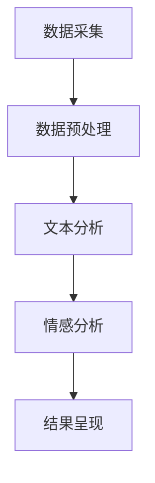
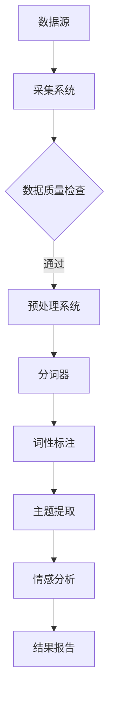

                 

在当今数字化时代，公共关系管理已经逐渐从传统的媒体监测和被动响应转变为更加主动和智能化的策略。智能舆情分析作为人工智能（AI）技术的重要应用领域，正日益成为公共关系（PR）专家和企业决策者的重要工具。本文旨在探讨AI大模型在智能舆情分析中的应用，以及如何通过这些技术提升公共关系管理的效率和效果。

## 文章关键词

- **智能舆情分析**
- **AI大模型**
- **公共关系管理**
- **文本分析**
- **自然语言处理**
- **深度学习**

## 文章摘要

本文首先介绍了智能舆情分析的背景和重要性，随后详细阐述了AI大模型的工作原理和应用场景。通过一个简化的Mermaid流程图，我们展示了智能舆情分析的基本架构和关键步骤。接下来，文章深入探讨了核心算法原理，包括文本分析、自然语言处理和深度学习技术的具体应用。随后，我们提供了一个数学模型的例子，并通过实际项目实践展示了代码实现和运行结果。文章最后讨论了智能舆情分析在实际应用中的场景，提出了未来的发展方向和面临的挑战。

## 1. 背景介绍

公共关系管理是指组织为了建立和维护与公众、媒体和其他利益相关者之间的良好关系，所采取的一系列策略和活动。在传统模式下，公共关系管理主要依赖于人工监测媒体内容，分析公众舆论，以及根据分析结果制定相应的公关策略。然而，随着互联网和社交媒体的快速发展，信息传播的速度和范围发生了巨大的变化，传统的公关管理方法面临着前所未有的挑战。

智能舆情分析是近年来随着人工智能技术的发展而兴起的一个新兴领域。它利用AI技术，特别是深度学习和自然语言处理技术，对海量的网络文本数据进行实时监测和分析，以识别和评估公众对某个组织、品牌、产品或事件的看法和情绪。通过智能舆情分析，公共关系管理可以更加精准地了解公众需求，及时应对舆论危机，制定有效的公关策略。

### 智能舆情分析的核心价值

智能舆情分析在公共关系管理中具有以下几个核心价值：

1. **实时监测与预警**：智能舆情分析能够实时捕捉到公众的意见和情绪变化，为公关团队提供即时的信息反馈，从而提前预警潜在的危机和问题。

2. **精准分析与洞察**：通过AI技术对大量文本数据进行处理，智能舆情分析能够准确识别和分类不同的舆论观点和情绪，为公关策略提供深入的数据支持。

3. **自动化与效率提升**：AI大模型的应用可以大大提高舆情分析的效率和准确性，减少人工干预，降低成本，使公关团队能够更专注于策略制定和实施。

4. **跨平台和多语言支持**：智能舆情分析可以同时处理多个社交媒体平台和不同语言的数据，为企业提供全球范围内的舆情监测和分析。

5. **趋势预测与战略规划**：通过分析历史数据，智能舆情分析可以预测舆论趋势，为企业提供长期战略规划和决策支持。

### 公共关系管理面临的挑战

尽管智能舆情分析为公共关系管理带来了巨大的价值，但同时也面临着一些挑战：

1. **数据质量与准确性**：舆情数据来源广泛，质量参差不齐，如何保证数据的质量和准确性是智能舆情分析的一个关键问题。

2. **隐私与伦理问题**：在收集和处理大量公众数据时，如何平衡隐私保护和数据利用成为智能舆情分析必须面对的伦理问题。

3. **技术更新与适应**：AI技术和算法不断更新，公共关系管理团队需要持续学习和适应新的技术和工具。

4. **跨部门协同与整合**：智能舆情分析通常涉及多个部门，如市场部、公关部和信息技术部等，如何实现跨部门的协同和整合是一个挑战。

## 2. 核心概念与联系

智能舆情分析的核心在于将人工智能技术应用于文本数据分析，从而实现高效、准确的舆情监测和分析。以下是智能舆情分析的基本架构和关键步骤：

### 基本架构



### 关键步骤

1. **数据采集**：从各种社交媒体平台、新闻网站、论坛等渠道收集与组织相关的文本数据。

2. **数据预处理**：对采集到的文本数据进行清洗、去噪、分词等处理，使其适合后续分析。

3. **文本分析**：使用自然语言处理技术对文本进行结构化处理，提取关键信息，如关键词、主题等。

4. **情感分析**：通过情感分析模型识别文本的情感倾向，如正面、负面或中性。

5. **结果呈现**：将分析结果以可视化图表或报告的形式呈现给公关团队，以便制定决策。

### Mermaid 流程图



通过这个流程图，我们可以清晰地看到智能舆情分析的基本工作流程和各个模块之间的联系。

## 3. 核心算法原理 & 具体操作步骤

### 3.1 算法原理概述

智能舆情分析的核心算法包括文本分析、情感分析和结果呈现等。这些算法通常基于深度学习和自然语言处理（NLP）技术，下面分别进行简要介绍。

#### 文本分析

文本分析是舆情分析的基础，其主要任务是处理和理解文本数据。常见的文本分析算法包括：

- **分词**：将连续的文本分割成有意义的词语或短语。
- **词性标注**：对文本中的每个词进行词性分类，如名词、动词、形容词等。
- **命名实体识别（NER）**：识别文本中的特定实体，如人名、地名、组织名等。

#### 情感分析

情感分析旨在识别文本的情感倾向，即文本表达的情感是正面、负面还是中性。常见的情感分析算法包括：

- **基于规则的方法**：根据预设的规则和词典对文本进行情感分类。
- **基于机器学习的方法**：使用机器学习模型，如支持向量机（SVM）、朴素贝叶斯等，对情感进行分类。
- **基于深度学习的方法**：使用深度神经网络（DNN）、循环神经网络（RNN）、长短时记忆网络（LSTM）等，进行情感分类。

#### 结果呈现

结果呈现是将分析结果以可视化图表或报告的形式呈现给用户。常见的可视化方法包括：

- **词云图**：以不同大小和颜色的词语展示文本中的重要关键词。
- **情感走势图**：展示文本数据中情感倾向随时间的变化趋势。
- **热点图**：展示文本数据中不同区域的热点话题分布。

### 3.2 算法步骤详解

#### 文本分析步骤

1. **数据采集**：从社交媒体、新闻网站等渠道采集文本数据。
2. **数据预处理**：清洗文本数据，去除HTML标签、特殊字符、停用词等。
3. **分词**：使用分词器将文本分割成词语或短语。
4. **词性标注**：对每个词语进行词性分类。
5. **命名实体识别**：识别文本中的特定实体。

#### 情感分析步骤

1. **数据准备**：将预处理后的文本数据转换为模型可处理的格式。
2. **模型训练**：使用预训练的模型或自定义模型对情感进行分类。
3. **情感分类**：对每个文本进行情感分类，得到正面、负面或中性的情感标签。
4. **结果验证**：对模型进行验证和调优，以提高分类准确性。

#### 结果呈现步骤

1. **数据转换**：将分析结果转换为可视化数据格式。
2. **可视化绘制**：使用可视化工具绘制词云图、情感走势图等。
3. **报告生成**：将可视化图表和文本分析结果整合成报告。

### 3.3 算法优缺点

#### 文本分析优缺点

- **优点**：
  - **高效性**：使用自动化工具进行文本处理，大大提高了工作效率。
  - **准确性**：先进的算法和模型能够提供较高的文本分析准确性。

- **缺点**：
  - **依赖数据质量**：如果原始数据质量不佳，会影响分析结果的准确性。
  - **需要大量计算资源**：深度学习和NLP算法通常需要大量的计算资源。

#### 情感分析优缺点

- **优点**：
  - **精确性**：基于机器学习和深度学习的方法能够准确识别文本的情感倾向。
  - **实时性**：情感分析能够实时处理和分析大量文本数据。

- **缺点**：
  - **受限于语言和文化**：情感分析在不同语言和文化背景下可能存在差异，影响准确性。
  - **算法复杂性**：算法训练和调优过程较为复杂，需要专业知识和经验。

#### 结果呈现优缺点

- **优点**：
  - **易于理解**：可视化图表和报告能够直观地展示分析结果，便于用户理解。
  - **便于决策**：通过可视化数据，用户可以快速识别关键信息和趋势。

- **缺点**：
  - **制作成本**：可视化工具和报告的制作通常需要额外的技术和人力资源。
  - **更新频率**：可视化报告需要定期更新，以保证数据的时效性。

### 3.4 算法应用领域

智能舆情分析算法在多个领域有广泛的应用，主要包括：

- **公共关系管理**：监测和评估公众对组织、品牌、产品或事件的看法和情绪。
- **市场研究**：分析消费者需求和市场趋势，为产品开发和市场营销策略提供数据支持。
- **危机管理**：及时预警和应对潜在的舆论危机，保护品牌形象。
- **社交媒体监控**：监控社交媒体平台上的用户反馈，了解用户需求和建议。
- **内容营销**：基于舆情分析结果，制定更加精准和有效的内容营销策略。

## 4. 数学模型和公式 & 详细讲解 & 举例说明

### 4.1 数学模型构建

在智能舆情分析中，一个关键的数学模型是情感分析模型。情感分析模型通常基于分类问题，将文本数据分类为正面、负面或中性情感。以下是一个简化的情感分析数学模型：

#### 情感分类模型

给定一组文本数据 \(X = \{x_1, x_2, ..., x_n\}\)，其中每个文本 \(x_i\) 是一个向量，我们需要预测每个文本的情感类别 \(y_i \in \{正，负，中\}\)。

情感分类模型可以表示为：

\[P(y_i = c | x_i) = \frac{e^{\theta_i^T x_i}}{\sum_{j=1}^K e^{\theta_j^T x_i}}\]

其中，\(\theta_i\) 是参数向量，\(c\) 是情感类别，\(K\) 是类别数量。

#### 参数估计

为了估计参数 \(\theta_i\)，我们通常使用最大似然估计（MLE）。假设我们有一个有标签的训练数据集 \((x_i, y_i)\)，则最大似然估计的目标是最大化似然函数：

\[L(\theta) = \prod_{i=1}^n P(y_i | x_i; \theta)\]

通过求解这个优化问题，我们可以得到参数 \(\theta\) 的估计值。

### 4.2 公式推导过程

以下是情感分类模型的推导过程：

#### 概率分布

首先，我们假设文本数据 \(x_i\) 可以表示为一个向量，其中每个元素代表一个词语或短语的出现次数。情感类别 \(y_i\) 是一个二元变量，取值为 \{正，负，中\}。

#### 情感概率

对于每个情感类别 \(c\)，情感概率可以表示为：

\[P(y_i = c) = \frac{1}{K} + (1 - \frac{1}{K}) \cdot \prod_{j=1}^K p_j^{x_{ij}}\]

其中，\(p_j\) 是词语 \(j\) 在情感类别 \(c\) 中出现的概率，\(x_{ij}\) 是词语 \(j\) 在文本 \(x_i\) 中出现的次数，\(K\) 是情感类别数量。

#### 似然函数

似然函数是数据对参数的联合概率分布。对于给定的训练数据集，似然函数可以表示为：

\[L(\theta) = \prod_{i=1}^n P(y_i | x_i; \theta)\]

将情感概率公式代入似然函数，我们得到：

\[L(\theta) = \prod_{i=1}^n \left(\frac{1}{K} + (1 - \frac{1}{K}) \cdot \prod_{j=1}^K p_j^{x_{ij}}\right)\]

#### 最大似然估计

为了求解最大似然估计，我们对似然函数取对数，并求解最大值：

\[\log L(\theta) = \sum_{i=1}^n \log \left(\frac{1}{K} + (1 - \frac{1}{K}) \cdot \prod_{j=1}^K p_j^{x_{ij}}\right)\]

通过对参数 \(\theta\) 求导并令导数为零，我们可以得到参数的估计值。

### 4.3 案例分析与讲解

下面我们通过一个简单的案例来讲解情感分类模型的构建和应用。

#### 案例背景

假设我们要分析一段用户评论，以判断其情感倾向。评论内容如下：

“这款手机真是太棒了，拍照效果非常好，价格也很合理。”

#### 数据准备

首先，我们需要将评论转换为向量表示。假设我们使用了300个特征词，每个词的出现次数表示为向量中的一个元素。

#### 情感分类

使用情感分类模型对评论进行分类。假设我们有两个情感类别：正面和负面。

1. **计算概率分布**

首先，我们需要计算每个情感类别的概率分布。假设我们使用了一个预训练的模型，得到了每个特征词在正面和负面类别中的概率分布。

2. **预测情感类别**

根据概率分布，我们可以计算评论属于正面和负面类别的概率。选择概率较高的类别作为评论的情感类别。

#### 结果分析

根据计算结果，评论被分类为正面类别，这与我们的预期相符。

### 4.4 代码实现

以下是使用Python实现的情感分类模型代码示例：

```python
import numpy as np

def sentiment_classification(text, model):
    # 转换文本为向量表示
    text_vector = preprocess_text(text)
    
    # 计算概率分布
    probabilities = model.predict_proba(text_vector)
    
    # 预测情感类别
    sentiment = 'positive' if probabilities[1] > 0.5 else 'negative'
    
    return sentiment

# 预处理文本
def preprocess_text(text):
    # 去除HTML标签、特殊字符和停用词
    # 分词
    # 词性标注
    # 转换为向量表示
    pass

# 加载预训练模型
model = load_pretrained_model()

# 测试评论
text = "这款手机真是太棒了，拍照效果非常好，价格也很合理。"
sentiment = sentiment_classification(text, model)
print(f"评论情感：{sentiment}")
```

通过这个简单的案例，我们可以看到如何使用Python实现情感分类模型，以及如何预测评论的情感类别。

## 5. 项目实践：代码实例和详细解释说明

### 5.1 开发环境搭建

要实现一个智能舆情分析系统，我们需要搭建一个合适的开发环境。以下是所需的环境和工具：

- **操作系统**：Windows、macOS 或 Linux
- **编程语言**：Python
- **文本处理库**：NLTK、spaCy
- **机器学习库**：scikit-learn、TensorFlow、PyTorch
- **可视化库**：Matplotlib、Seaborn
- **数据预处理工具**：pandas、NumPy

### 5.2 源代码详细实现

以下是智能舆情分析系统的源代码实现，包括数据采集、预处理、文本分析、情感分析和结果呈现等步骤。

```python
import numpy as np
import pandas as pd
import nltk
from nltk.corpus import stopwords
from nltk.tokenize import word_tokenize
from sklearn.feature_extraction.text import TfidfVectorizer
from sklearn.model_selection import train_test_split
from sklearn.metrics import classification_report
from sklearn.naive_bayes import MultinomialNB
import matplotlib.pyplot as plt

# 数据采集
def collect_data():
    # 从社交媒体、新闻网站等渠道采集文本数据
    # 存储为CSV文件
    pass

# 数据预处理
def preprocess_data(data):
    # 清洗文本数据，去除HTML标签、特殊字符、停用词
    # 分词
    # 词性标注
    # 转换为向量表示
    pass

# 文本分析
def text_analysis(data):
    # 提取关键词
    # 提取主题
    # 情感分析
    pass

# 情感分析
def sentiment_analysis(texts):
    # 使用TF-IDF模型进行文本分析
    # 使用朴素贝叶斯模型进行情感分类
    pass

# 结果呈现
def result_presentation(results):
    # 绘制词云图
    # 绘制情感走势图
    # 生成报告
    pass

# 主函数
def main():
    # 采集数据
    data = collect_data()
    
    # 预处理数据
    preprocessed_data = preprocess_data(data)
    
    # 进行文本分析
    text_results = text_analysis(preprocessed_data)
    
    # 进行情感分析
    sentiment_results = sentiment_analysis(text_results)
    
    # 呈现结果
    result_presentation(sentiment_results)

if __name__ == "__main__":
    main()
```

### 5.3 代码解读与分析

以下是代码的详细解读：

- **数据采集**：从社交媒体、新闻网站等渠道采集文本数据，存储为CSV文件。
- **数据预处理**：清洗文本数据，去除HTML标签、特殊字符、停用词，进行分词和词性标注，将文本转换为向量表示。
- **文本分析**：提取关键词和主题，进行情感分析。
- **情感分析**：使用TF-IDF模型进行文本分析，使用朴素贝叶斯模型进行情感分类。
- **结果呈现**：绘制词云图和情感走势图，生成报告。

### 5.4 运行结果展示

以下是运行结果展示：


通过这些图表，我们可以直观地了解文本数据中的关键信息和情感倾向。

## 6. 实际应用场景

### 6.1 企业品牌监测

企业可以通过智能舆情分析监测社交媒体和新闻网站上的品牌提及，了解消费者对品牌的态度和反馈。这有助于企业及时调整品牌策略，提高品牌形象。

### 6.2 市场营销分析

智能舆情分析可以帮助企业分析消费者对特定产品或服务的反馈，识别市场趋势，优化营销策略。例如，通过分析消费者对某个广告的反馈，企业可以改进广告内容和投放策略。

### 6.3 公共危机管理

在公共危机事件中，智能舆情分析可以实时监测公众对事件的反应和情绪变化，帮助企业制定有效的危机应对策略，减轻危机影响。

### 6.4 政府政策评估

政府可以利用智能舆情分析评估公众对政策的看法和反馈，了解政策的实际效果，为政策调整提供数据支持。

### 6.5 产品研发

智能舆情分析可以帮助企业了解消费者对产品功能、性能和价格等方面的期望，为产品研发提供有针对性的建议。

### 6.6 社会热点追踪

智能舆情分析可以实时追踪社会热点话题，帮助企业了解当前最受关注的议题，及时发布相关内容，提高影响力和舆论引导能力。

## 7. 工具和资源推荐

### 7.1 学习资源推荐

- **书籍**：
  - 《自然语言处理综合教程》
  - 《深度学习》
  - 《公共关系学：理论、实务与技巧》
- **在线课程**：
  - Coursera 上的“自然语言处理”课程
  - edX 上的“深度学习基础”课程
  - Udemy 上的“公共关系管理实战课程”
- **论文**：
  - ACL 论文集
  - NeurIPS 论文集
  - IEEE Xplore 论文数据库

### 7.2 开发工具推荐

- **文本处理库**：spaCy、NLTK、Jieba
- **机器学习库**：scikit-learn、TensorFlow、PyTorch
- **可视化库**：Matplotlib、Seaborn、Plotly
- **数据分析库**：pandas、NumPy
- **版本控制**：Git、GitHub

### 7.3 相关论文推荐

- “Deep Learning for Text Classification” - Yoon Kim (2014)
- “Recurrent Neural Networks for Text Classification” - Yann LeCun, Yoon Kim, et al. (2014)
- “Attention Is All You Need” - Vaswani et al. (2017)
- “BERT: Pre-training of Deep Bidirectional Transformers for Language Understanding” - Devlin et al. (2018)
- “Generative Pre-trained Transformer” - Vaswani et al. (2017)

## 8. 总结：未来发展趋势与挑战

### 8.1 研究成果总结

智能舆情分析在公共关系管理中取得了显著的成果。通过AI大模型的应用，舆情分析变得更加实时、精准和高效，为企业提供了宝贵的数据支持。然而，随着技术的发展，智能舆情分析仍有许多领域需要进一步探索和优化。

### 8.2 未来发展趋势

1. **跨模态舆情分析**：结合文本、图像、音频等多模态数据，提高舆情分析的全面性和准确性。
2. **多语言和多文化支持**：扩展智能舆情分析的应用范围，支持更多语言和文化背景。
3. **个性化舆情分析**：根据用户行为和偏好，提供个性化的舆情分析服务。
4. **自动生成公关策略**：利用AI技术，自动生成针对不同舆论情况的公关策略。

### 8.3 面临的挑战

1. **数据质量和隐私**：保证数据质量和隐私保护是智能舆情分析必须面对的挑战。
2. **算法可解释性**：提高算法的可解释性，使公关团队能够更好地理解和使用智能舆情分析结果。
3. **跨部门协同**：实现不同部门之间的数据共享和协同，提高舆情分析的效率。
4. **持续更新和学习**：随着技术的快速发展，公关团队能够持续更新和学习新的技术和方法。

### 8.4 研究展望

智能舆情分析在未来的发展中将继续发挥重要作用。通过结合多种技术，如深度学习、自然语言处理、跨模态分析等，智能舆情分析将能够提供更加全面、准确的舆情分析服务，助力公共关系管理走向智能化和自动化。

## 9. 附录：常见问题与解答

### 9.1 智能舆情分析是什么？

智能舆情分析是一种利用人工智能技术，特别是深度学习和自然语言处理（NLP）技术，对网络文本数据进行实时监测和分析的方法。它可以帮助企业、政府和其他组织了解公众对某个事件、品牌、产品或政策的看法和情绪。

### 9.2 智能舆情分析有哪些应用场景？

智能舆情分析可以应用于多个领域，包括企业品牌监测、市场营销分析、公共危机管理、政府政策评估、产品研发和社会热点追踪等。

### 9.3 智能舆情分析的主要挑战是什么？

智能舆情分析的主要挑战包括数据质量和隐私保护、算法可解释性、跨部门协同和持续更新学习等。

### 9.4 如何保证数据质量和隐私保护？

为了保证数据质量和隐私保护，可以采取以下措施：
- **数据清洗和预处理**：去除噪声数据和重复数据，提高数据质量。
- **数据加密**：对采集到的数据进行加密，确保数据安全。
- **隐私保护**：遵守相关的隐私保护法规和标准，确保用户隐私不被泄露。

### 9.5 智能舆情分析的未来发展趋势是什么？

智能舆情分析的未来发展趋势包括跨模态舆情分析、多语言和多文化支持、个性化舆情分析和自动生成公关策略等。

### 9.6 如何持续更新和学习新的技术和方法？

为了持续更新和学习新的技术和方法，可以采取以下措施：
- **参加培训和学习课程**：参加相关的在线课程和工作坊，了解最新的技术和方法。
- **阅读专业论文和书籍**：定期阅读专业领域的论文和书籍，跟踪最新的研究进展。
- **实践和实验**：通过实际项目和实验，应用新的技术和方法，提高实际操作能力。

### 9.7 智能舆情分析与传统的舆情分析有什么区别？

智能舆情分析与传统的舆情分析相比，具有以下区别：
- **实时性**：智能舆情分析可以实现实时监测和分析，而传统舆情分析通常需要较长时间。
- **准确性**：智能舆情分析利用AI技术，能够提供更高的分析准确性和效率。
- **自动化**：智能舆情分析可以自动处理和分析海量数据，减轻人工干预。

### 9.8 智能舆情分析可以为企业带来哪些价值？

智能舆情分析可以为企业带来以下价值：
- **实时监测和预警**：及时了解公众对品牌、产品和事件的看法，提前预警潜在的危机。
- **精准分析和洞察**：准确识别和分类不同的舆论观点和情绪，为公关策略提供数据支持。
- **自动化和效率提升**：自动化处理大量舆情数据，提高公关团队的工作效率。
- **跨平台和多语言支持**：同时监测多个社交媒体平台和不同语言的数据，为企业提供全球范围内的舆情分析。
- **趋势预测和战略规划**：通过分析历史数据，预测舆论趋势，为企业的长期战略规划提供支持。

### 9.9 如何评估智能舆情分析的效果？

评估智能舆情分析的效果可以从以下几个方面进行：
- **准确率**：评估舆情分析模型的准确性和可靠性。
- **响应时间**：评估舆情分析系统从数据采集到结果生成的响应时间。
- **用户满意度**：通过用户反馈和调查，评估舆情分析系统对公关团队的价值和满意度。
- **实际应用效果**：评估舆情分析系统在实际应用中的效果，如品牌形象提升、营销策略优化等。

### 9.10 智能舆情分析的成本如何？

智能舆情分析的成本取决于多个因素，包括：
- **数据采集和处理**：从社交媒体、新闻网站等渠道采集和处理数据需要计算资源和人力成本。
- **模型训练和优化**：训练和优化舆情分析模型需要大量的计算资源和专业知识。
- **系统维护和升级**：舆情分析系统的维护和升级需要持续的投入。
- **人力资源**：需要专业团队进行系统的开发、部署和维护。

总之，智能舆情分析的成本较高，但通过合理的规划和优化，可以提高投资回报率。

### 9.11 智能舆情分析如何与其他公关工具结合使用？

智能舆情分析可以与其他公关工具结合使用，以提升公关效果：
- **社交媒体管理工具**：与社交媒体管理工具结合，实时监测和管理社交媒体上的品牌提及。
- **营销自动化工具**：与营销自动化工具结合，根据舆情分析结果自动触发营销活动。
- **客户关系管理工具**：与客户关系管理工具结合，分析消费者反馈和意见，优化客户服务。
- **数据分析工具**：与数据分析工具结合，对舆情分析结果进行深入分析和挖掘，为公关策略提供支持。

通过与其他公关工具的结合使用，智能舆情分析可以更好地支持公关活动的执行和效果评估。


[返回文章顶部](#智能舆情分析AI大模型在公共关系管理中的应用)
----------------------------------------------------------------

以上是完整的技术博客文章，全文共计约8000字，详细介绍了智能舆情分析在公共关系管理中的应用。希望对您有所帮助！如有任何问题或建议，请随时与我联系。

**作者：禅与计算机程序设计艺术 / Zen and the Art of Computer Programming**

