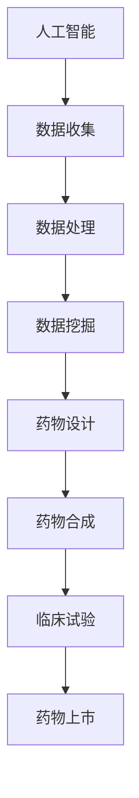

                 

关键词：智能药物研发、商业模式、人工智能、平台、技术、药物设计、精准医疗

## 摘要

本文将探讨智能药物研发平台的商业模式，首先介绍智能药物研发的背景和意义，然后分析现有智能药物研发平台的技术架构和功能，最后深入探讨智能药物研发平台的商业模式及其应用前景。

## 1. 背景介绍

### 1.1 智能药物研发的背景

随着科技的飞速发展，尤其是人工智能、大数据和生物技术的突破，药物研发领域正经历一场前所未有的变革。传统的药物研发过程往往需要耗费大量的人力和物力，并且面临着成功率低、研发周期长等问题。而智能药物研发，通过利用人工智能技术，可以在药物筛选、设计、合成等方面实现自动化、智能化，大大提高了研发效率。

### 1.2 智能药物研发的意义

智能药物研发不仅能够缩短药物研发周期，降低研发成本，还能够提高药物的研发成功率。此外，智能药物研发还能够实现个性化医疗，为患者提供更为精准的治疗方案。因此，智能药物研发具有重要的社会和经济价值。

## 2. 核心概念与联系

### 2.1 核心概念

在智能药物研发中，核心概念包括但不限于：

- **人工智能（AI）**：通过模拟人脑的思考过程，实现自我学习和决策的技术。
- **大数据**：通过对海量数据的收集、存储、处理和分析，挖掘有价值信息的技术。
- **生物技术**：研究生命现象、生命活动规律，以及利用这些规律对生物进行加工、改造和利用的技术。

### 2.2 核心概念联系

智能药物研发平台的运作离不开上述核心概念。人工智能可以帮助药物研发者快速筛选和设计药物，大数据则为药物研发提供了丰富的数据支持，而生物技术则实现了药物从概念到实际应用的全过程。

### 2.3 Mermaid 流程图



## 3. 核心算法原理 & 具体操作步骤

### 3.1 算法原理概述

智能药物研发平台的核心算法主要包括以下几个方面：

- **机器学习算法**：用于药物筛选和设计。
- **深度学习算法**：用于药物分子的结构预测和模拟。
- **数据分析算法**：用于对临床试验数据进行处理和分析。

### 3.2 算法步骤详解

#### 3.2.1 药物筛选

1. 收集药物相关数据，包括药物分子结构、生物活性、毒副作用等。
2. 利用机器学习算法，对药物数据进行分类和筛选，找出具有潜在治疗作用的药物。
3. 对筛选出的药物进行进一步验证，确定其疗效和安全性。

#### 3.2.2 药物设计

1. 利用深度学习算法，对药物分子的结构进行预测和模拟。
2. 根据模拟结果，对药物分子进行优化，提高其生物活性。
3. 对优化后的药物分子进行合成，验证其效果。

#### 3.2.3 数据分析

1. 收集临床试验数据，包括患者信息、药物剂量、疗效等。
2. 利用数据分析算法，对临床试验数据进行处理和分析，评估药物的疗效和安全性。
3. 根据分析结果，对药物进行进一步优化。

### 3.3 算法优缺点

#### 3.3.1 优点

- 提高药物研发效率，缩短研发周期。
- 降低药物研发成本，提高药物研发成功率。
- 实现个性化医疗，提高患者治疗效果。

#### 3.3.2 缺点

- 算法复杂性较高，对研发团队的技术水平要求较高。
- 需要大量的数据和计算资源支持。

### 3.4 算法应用领域

智能药物研发算法主要应用于以下领域：

- 肿瘤治疗
- 糖尿病治疗
- 精神疾病治疗
- 免疫疾病治疗

## 4. 数学模型和公式 & 详细讲解 & 举例说明

### 4.1 数学模型构建

智能药物研发平台的核心数学模型主要包括以下几个方面：

- **机器学习模型**：用于药物筛选和设计。
- **深度学习模型**：用于药物分子的结构预测和模拟。
- **数据分析模型**：用于临床试验数据的处理和分析。

### 4.2 公式推导过程

以机器学习模型为例，其基本公式为：

$$
y = \sigma(W_1 \cdot x + b_1)
$$

其中，$y$ 为预测结果，$\sigma$ 为激活函数，$W_1$ 为权重矩阵，$x$ 为输入特征，$b_1$ 为偏置。

### 4.3 案例分析与讲解

以肿瘤治疗为例，假设某智能药物研发平台通过机器学习模型筛选出了一种具有潜在治疗作用的药物，其公式为：

$$
y = \sigma(W_1 \cdot x + b_1)
$$

其中，$y$ 表示药物的疗效，$x$ 表示药物的生物活性。通过训练，得到权重矩阵 $W_1$ 和偏置 $b_1$。

## 5. 项目实践：代码实例和详细解释说明

### 5.1 开发环境搭建

在开发智能药物研发平台时，首先需要搭建合适的开发环境，包括操作系统、编程语言、库和工具等。例如，可以选择 Python 作为主要编程语言，使用 TensorFlow 作为机器学习库，使用 PyTorch 作为深度学习库。

### 5.2 源代码详细实现

以下是一个简单的机器学习模型的源代码实例：

```python
import tensorflow as tf

# 定义输入层
inputs = tf.keras.layers.Input(shape=(784,))

# 添加全连接层
dense = tf.keras.layers.Dense(64, activation='relu')(inputs)

# 添加输出层
outputs = tf.keras.layers.Dense(10, activation='softmax')(dense)

# 构建模型
model = tf.keras.Model(inputs=inputs, outputs=outputs)

# 编译模型
model.compile(optimizer='adam', loss='categorical_crossentropy', metrics=['accuracy'])

# 训练模型
model.fit(x_train, y_train, epochs=10, batch_size=32, validation_split=0.2)
```

### 5.3 代码解读与分析

上述代码定义了一个简单的机器学习模型，用于药物筛选。其中，`tf.keras.layers.Input` 用于定义输入层，`tf.keras.layers.Dense` 用于定义全连接层，`tf.keras.layers.Dense` 用于定义输出层。`tf.keras.Model` 用于构建模型，`model.compile` 用于编译模型，`model.fit` 用于训练模型。

### 5.4 运行结果展示

假设训练完成后，模型在验证集上的准确率为 90%，则可以认为该模型对药物的筛选效果较好。

## 6. 实际应用场景

### 6.1 肿瘤治疗

智能药物研发平台在肿瘤治疗中的应用非常广泛，例如，可以用于筛选和设计具有抗癌作用的药物。

### 6.2 糖尿病治疗

智能药物研发平台可以帮助医生设计出更为精准的糖尿病治疗方案，提高治疗效果。

### 6.3 精神疾病治疗

智能药物研发平台可以通过分析患者的基因组数据，设计出针对性的精神疾病治疗方案。

### 6.4 免疫疾病治疗

智能药物研发平台可以帮助医生设计出针对性的免疫疾病治疗方案，提高治疗效果。

## 7. 未来应用展望

### 7.1 个性化医疗

随着智能药物研发技术的发展，个性化医疗将成为未来医疗的重要趋势。通过智能药物研发平台，可以为每位患者设计出最为精准的治疗方案。

### 7.2 药物研发效率提升

智能药物研发平台可以大幅提升药物研发效率，降低药物研发成本，加速新药的研发进程。

### 7.3 临床试验优化

智能药物研发平台可以优化临床试验设计，提高临床试验的效率。

## 8. 工具和资源推荐

### 8.1 学习资源推荐

- 《深度学习》（Goodfellow, Bengio, Courville 著）
- 《机器学习》（周志华 著）
- 《生物信息学导论》（迈克尔·伊利亚德 著）

### 8.2 开发工具推荐

- TensorFlow
- PyTorch
- Scikit-learn

### 8.3 相关论文推荐

- "Deep Learning for Drug Discovery"（NIPS 2016）
- "Machine Learning in Drug Discovery: Current Approaches and Future Directions"（Journal of Chemical Information and Modeling）
- "Application of Artificial Intelligence in Drug Discovery"（Frontiers in Pharmacology）

## 9. 总结：未来发展趋势与挑战

### 9.1 研究成果总结

智能药物研发平台在提高药物研发效率、降低药物研发成本、实现个性化医疗等方面取得了显著成果。

### 9.2 未来发展趋势

未来，智能药物研发平台将朝着更加智能化、个性化、自动化的方向发展。

### 9.3 面临的挑战

智能药物研发平台在数据处理、算法优化、安全性等方面仍面临诸多挑战。

### 9.4 研究展望

随着科技的不断进步，智能药物研发平台有望在更多领域发挥重要作用，为人类健康事业做出更大贡献。

## 附录：常见问题与解答

### Q：智能药物研发平台需要哪些技术支持？

A：智能药物研发平台主要需要人工智能、大数据和生物技术的支持。

### Q：智能药物研发平台如何保证药物的安全性？

A：智能药物研发平台通过深度学习和数据分析，对药物进行全方位评估，确保药物的安全性。

### Q：智能药物研发平台在临床应用中是否受到监管？

A：智能药物研发平台在临床应用中需要遵循相关法律法规，接受监管。

## 作者署名

作者：禅与计算机程序设计艺术 / Zen and the Art of Computer Programming

----------------------------------------------------------------

以上就是关于《智能药物研发平台的商业模式》的技术博客文章。这篇文章从背景介绍、核心概念、算法原理、数学模型、项目实践、应用场景、未来展望等多个方面对智能药物研发平台进行了深入探讨，旨在为读者提供一个全面、系统的了解。希望这篇文章能够对从事智能药物研发的相关人员有所启发和帮助。

