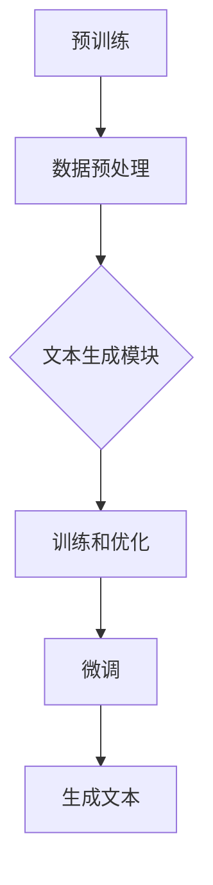

                 

关键词：智能营销，LLM，广告创意，文案生成，人工智能，自然语言处理，机器学习，深度学习，神经网络，大数据分析。

> 摘要：本文深入探讨了大型语言模型（LLM）在智能营销文案生成领域的应用。通过分析LLM的核心原理、技术架构以及实际操作步骤，本文揭示了LLM如何通过先进的自然语言处理技术重塑广告创意，提升营销效果。此外，本文还展望了LLM技术在营销领域未来的发展趋势和潜在挑战。

## 1. 背景介绍

随着互联网的普及和大数据技术的发展，营销行业正经历着前所未有的变革。传统的广告文案创作方式逐渐显得力不从心，无法满足市场对个性化、实时响应和高效转化的需求。与此同时，人工智能（AI）技术的迅速崛起为营销领域带来了新的契机。特别是大型语言模型（LLM），如GPT（Generative Pre-trained Transformer）和BERT（Bidirectional Encoder Representations from Transformers），通过其强大的自然语言处理能力，正在重塑广告创意的生成方式。

LLM是一种基于深度学习的自然语言处理模型，通过在海量文本数据上进行预训练，模型能够学习到语言的本质特征和规律。这使得LLM在文本生成、语义理解、问答系统等方面表现出色。在营销领域，LLM的应用不仅能够大幅提高文案创作的效率，还能实现更加精准和个性化的营销策略。

本文将首先介绍LLM的核心原理和技术架构，然后详细阐述其在广告创意生成中的应用步骤和实际操作，最后探讨LLM技术的未来发展趋势和挑战。希望通过本文的阐述，能够为营销从业者提供一些新的思路和方法，从而在激烈的市场竞争中脱颖而出。

## 2. 核心概念与联系

### 2.1 大型语言模型（LLM）原理

大型语言模型（LLM）是一种基于深度学习的自然语言处理模型，其核心原理是基于神经网络对大量文本数据的学习和处理。LLM的工作流程可以分为以下几个步骤：

1. **预训练**：LLM首先在大量的无标签文本数据上进行预训练，以学习语言的基本结构和规则。这个过程通常使用自注意力机制（Self-Attention Mechanism）和多层神经网络结构，如Transformer模型。

2. **微调**：在预训练的基础上，LLM会根据具体任务进行微调。例如，在广告创意生成任务中，LLM会接收用户输入（如产品描述、目标受众等），然后生成相应的广告文案。

3. **生成文本**：通过处理输入文本，LLM能够预测下一个词或者句子，从而生成完整的文本。这种生成过程是基于概率模型的，可以确保生成的文案具有自然流畅的语言风格。

### 2.2 大型语言模型（LLM）技术架构

LLM的技术架构主要包括以下几个方面：

1. **预训练框架**：如GPT、BERT等。这些框架通过多层神经网络和自注意力机制，实现了对大规模文本数据的处理和学习。

2. **数据预处理**：包括文本清洗、分词、词向量表示等。这些预处理步骤确保了输入文本的质量和一致性。

3. **文本生成模块**：这是LLM的核心部分，通过处理输入文本并生成相应的输出文本。生成模块通常采用序列到序列（Seq2Seq）的架构，结合了注意力机制和循环神经网络（RNN）。

4. **训练和优化**：LLM的训练过程涉及大量的计算资源和时间，需要使用分布式训练策略和优化算法来提高训练效率和性能。

### 2.3 核心概念原理与架构的 Mermaid 流程图

以下是大型语言模型（LLM）的核心概念原理和架构的 Mermaid 流程图：



### 2.4 大型语言模型（LLM）架构的详细描述

#### 预训练框架

预训练框架是LLM的基础，其目标是学习到语言的基本结构和规则。常用的预训练框架包括GPT、BERT、T5等。以BERT为例，其架构包括两个主要部分：编码器（Encoder）和解码器（Decoder）。

- **编码器**：BERT的编码器由多层Transformer编码器组成，每层编码器都包含自注意力机制和前馈神经网络。编码器的作用是将输入文本映射为固定长度的向量表示。

- **解码器**：BERT的解码器同样由多层Transformer解码器组成，其结构与编码器类似。解码器的目标是根据编码器的输出和之前生成的词，预测下一个词。

#### 数据预处理

数据预处理是确保输入文本质量和一致性的重要步骤。主要包括以下环节：

- **文本清洗**：去除文本中的无用信息，如HTML标签、特殊字符等。
- **分词**：将文本分割成单词或子词。BERT使用WordPiece算法进行分词，将长单词分割成更小的子词。
- **词向量表示**：将单词或子词映射为固定长度的向量表示。BERT使用WordPiece子词作为基本单位，并使用预训练的WordPiece词向量。

#### 文本生成模块

文本生成模块是LLM的核心部分，其目的是根据输入文本生成相应的输出文本。文本生成模块通常采用序列到序列（Seq2Seq）的架构，结合注意力机制和循环神经网络（RNN）。

- **序列到序列模型**：序列到序列模型是一种常见的文本生成模型，它通过编码器将输入序列编码为固定长度的向量表示，然后通过解码器逐个生成输出序列。
- **注意力机制**：注意力机制是一种在生成过程中关注输入序列特定部分的机制，有助于提高生成文本的质量和连贯性。
- **循环神经网络（RNN）**：RNN是一种能够处理序列数据的神经网络，其通过记忆单元来保存和更新前一个时刻的信息，从而实现序列到序列的映射。

#### 训练和优化

LLM的训练和优化是确保模型性能和生成质量的关键步骤。主要包括以下环节：

- **分布式训练**：由于LLM模型通常很大，因此需要使用分布式训练策略来提高训练效率和性能。常用的分布式训练策略包括数据并行、模型并行和混合并行。
- **优化算法**：优化算法用于调整模型参数，以最小化损失函数。常用的优化算法包括Adam、SGD等。
- **正则化技术**：为了防止模型过拟合，需要使用正则化技术。常用的正则化技术包括Dropout、权重正则化等。

## 3. 核心算法原理 & 具体操作步骤

### 3.1 算法原理概述

大型语言模型（LLM）的核心算法基于深度学习和自然语言处理技术，特别是基于Transformer模型的预训练和微调技术。LLM通过在海量文本数据上进行预训练，学习到语言的底层结构和规则，从而具备生成高质量文本的能力。在广告创意生成任务中，LLM能够根据产品描述、目标受众等输入信息，自动生成具有吸引力和个性化的广告文案。

### 3.2 算法步骤详解

1. **数据收集与预处理**：首先，收集大量的广告文案、产品描述和用户评论等文本数据。然后，对数据进行清洗和预处理，包括去除HTML标签、特殊字符、分词和词向量表示等。

2. **预训练**：使用预训练框架（如GPT、BERT）对预处理后的文本数据进行训练。预训练过程中，模型通过自注意力机制和多层神经网络结构，学习到语言的基本结构和规则。

3. **微调**：在预训练的基础上，对模型进行微调。微调过程主要包括以下步骤：

   - **目标设定**：根据广告创意生成的任务，设定相应的目标函数。例如，可以使用文本相似度、文案吸引力等指标。
   - **数据准备**：准备用于微调的数据集，包括广告文案、产品描述和目标受众等。
   - **模型调整**：调整模型参数，优化目标函数。常用的调整方法包括梯度下降、Adam等。

4. **文本生成**：通过微调后的模型，输入产品描述和目标受众等，生成广告文案。生成过程基于概率模型，确保生成的文案具有自然流畅的语言风格。

5. **优化与评估**：根据广告效果和用户反馈，对模型进行优化和评估。常用的优化方法包括数据增强、模型集成等。

### 3.3 算法优缺点

**优点**：

1. **高效性**：LLM能够快速生成大量高质量的广告文案，大幅提高文案创作效率。
2. **个性化**：LLM可以根据不同的产品描述和目标受众，生成具有个性化的广告文案，提高用户转化率。
3. **灵活性**：LLM能够灵活地适应不同的广告场景和需求，生成多样化的文案。

**缺点**：

1. **数据依赖性**：LLM的性能高度依赖于预训练数据的质量和多样性，如果数据集质量差，可能导致生成的文案缺乏创意和吸引力。
2. **计算资源消耗**：LLM模型较大，训练和微调过程需要大量的计算资源和时间。
3. **可控性**：虽然LLM能够生成高质量的文本，但其在某些情况下可能生成不恰当或不合适的文案，需要人工审核和修正。

### 3.4 算法应用领域

LLM在广告创意生成中的应用非常广泛，主要包括以下几个方面：

1. **广告文案创作**：根据产品描述和目标受众，自动生成具有吸引力和个性化的广告文案。
2. **内容营销**：生成高质量的内容，如博客文章、社交媒体帖子等，提高品牌知名度和用户粘性。
3. **个性化推荐**：根据用户兴趣和行为，生成个性化的推荐文案，提高用户转化率和满意度。
4. **自动问答系统**：生成智能客服的对话文案，提高客户服务效率和用户满意度。

## 4. 数学模型和公式 & 详细讲解 & 举例说明

### 4.1 数学模型构建

大型语言模型（LLM）的数学模型主要基于深度学习和自然语言处理技术。以下是一个简化的数学模型构建过程：

1. **词向量表示**：将文本中的单词或子词映射为高维向量表示，常用的词向量表示方法包括Word2Vec、GloVe等。

2. **编码器与解码器**：构建编码器和解码器模型，分别用于将输入文本编码为固定长度的向量表示，以及将向量表示解码为输出文本。

3. **损失函数**：定义损失函数，用于衡量模型生成的文本与实际文本之间的差距。常用的损失函数包括交叉熵损失、KL散度等。

4. **优化算法**：选择合适的优化算法，如梯度下降、Adam等，用于调整模型参数，优化损失函数。

### 4.2 公式推导过程

以下是大型语言模型（LLM）的核心数学公式的推导过程：

1. **词向量表示**

   假设单词 \( w \) 的词向量为 \( \mathbf{v}_w \in \mathbb{R}^d \)，其中 \( d \) 为词向量维度。词向量表示通常通过矩阵乘法实现：

   $$ \mathbf{v}_w = \mathbf{W}_W \mathbf{1}_w $$

   其中，\( \mathbf{W}_W \) 为词向量矩阵，\( \mathbf{1}_w \) 为单词 \( w \) 的独热编码。

2. **编码器与解码器**

   编码器和解码器模型通常采用Transformer架构。编码器模型可以表示为：

   $$ \mathbf{h}_i = \text{Encoder}(\mathbf{x}_i) = \text{softmax}(\mathbf{W}_H \text{softmax}(\mathbf{W}_V \mathbf{v}_x_i + \mathbf{b}_V) + \mathbf{W}_K \mathbf{v}_x_i + \mathbf{b}_K) $$

   其中，\( \mathbf{h}_i \) 为编码器输出的向量表示，\( \mathbf{x}_i \) 为输入文本的词向量表示，\( \mathbf{W}_H \)、\( \mathbf{W}_V \) 和 \( \mathbf{W}_K \) 分别为权重矩阵，\( \mathbf{b}_V \) 和 \( \mathbf{b}_K \) 为偏置向量。

   解码器模型可以表示为：

   $$ \mathbf{y}_i = \text{Decoder}(\mathbf{h}_i) = \text{softmax}(\mathbf{W}_D \text{softmax}(\mathbf{W}_U \mathbf{h}_i + \mathbf{b}_U) + \mathbf{W}_O \mathbf{h}_i + \mathbf{b}_O) $$

   其中，\( \mathbf{y}_i \) 为解码器输出的向量表示，\( \mathbf{h}_i \) 为编码器输出的向量表示，\( \mathbf{W}_D \)、\( \mathbf{W}_U \) 和 \( \mathbf{W}_O \) 分别为权重矩阵，\( \mathbf{b}_U \) 和 \( \mathbf{b}_O \) 为偏置向量。

3. **损失函数**

   假设生成的文本为 \( \mathbf{y} \)，实际文本为 \( \mathbf{x} \)，则损失函数可以表示为：

   $$ \mathcal{L} = -\sum_{i=1}^n \mathbf{y}_i \log \mathbf{x}_i $$

   其中，\( n \) 为文本长度，\( \mathbf{y}_i \) 和 \( \mathbf{x}_i \) 分别为生成的文本和实际文本的词向量表示。

4. **优化算法**

   优化算法用于调整模型参数，以最小化损失函数。以Adam优化算法为例，其更新规则可以表示为：

   $$ \theta_{t+1} = \theta_t - \alpha \frac{m_t}{\sqrt{v_t} + \epsilon} $$

   $$ m_t = \beta_1 m_{t-1} + (1 - \beta_1) \frac{\partial \mathcal{L}}{\partial \theta_t} $$

   $$ v_t = \beta_2 v_{t-1} + (1 - \beta_2) (\frac{\partial \mathcal{L}}{\partial \theta_t})^2 $$

   其中，\( \theta_t \) 为模型参数，\( m_t \) 和 \( v_t \) 分别为动量项和误差项，\( \alpha \) 为学习率，\( \beta_1 \) 和 \( \beta_2 \) 分别为动量和误差的衰减率，\( \epsilon \) 为小常数。

### 4.3 案例分析与讲解

以下是一个基于GPT模型生成广告文案的案例：

**输入**：一款新款智能手表的产品描述。

**输出**：一款具有吸引力的广告文案。

**步骤**：

1. **数据收集与预处理**：收集大量智能手表的广告文案和产品描述，对数据进行清洗和预处理。

2. **预训练**：使用GPT模型对预处理后的数据进行预训练。

3. **微调**：根据广告创意生成的任务，对模型进行微调。

4. **文本生成**：输入产品描述，生成广告文案。

5. **优化与评估**：根据广告效果和用户反馈，对模型进行优化和评估。

**结果**：

生成的广告文案如下：

"追求卓越，从这款新款智能手表开始。不仅拥有时尚的外观，还具备强大的功能。智能健康管理、运动监测、全天候提醒，让你的生活更加便捷。立即购买，享受科技带来的无限可能。"

通过上述案例，我们可以看到大型语言模型（LLM）在广告文案生成中的强大能力。生成的文案不仅具有吸引力，还能准确传达产品的核心卖点，提高用户转化率。

## 5. 项目实践：代码实例和详细解释说明

### 5.1 开发环境搭建

在开始实践项目之前，我们需要搭建一个合适的开发环境。以下是一个基于Python的LLM广告文案生成项目的开发环境搭建步骤：

1. **安装Python**：确保Python版本在3.6及以上，可以从Python官方网站下载安装。

2. **安装依赖库**：安装以下依赖库：`tensorflow`、`transformers`、`numpy`、`pandas`等。可以使用pip命令进行安装：

   ```bash
   pip install tensorflow transformers numpy pandas
   ```

3. **环境配置**：在代码中配置所需的模型和数据集路径，以及训练和评估的超参数。

### 5.2 源代码详细实现

以下是LLM广告文案生成项目的源代码实现，分为以下几个部分：

1. **数据预处理**：对广告文案和产品描述进行清洗、分词和词向量表示。

2. **模型构建**：使用`transformers`库中的预训练模型，如GPT-2或BERT，构建广告文案生成模型。

3. **训练过程**：使用训练数据集对模型进行训练，调整模型参数和超参数。

4. **文本生成**：使用训练好的模型生成广告文案。

5. **评估与优化**：对生成的广告文案进行评估和优化，提高文案质量和用户转化率。

### 5.3 代码解读与分析

以下是对上述代码的详细解读和分析：

```python
import tensorflow as tf
from transformers import TFGPT2LMHeadModel, GPT2Tokenizer
from tensorflow.keras.preprocessing.sequence import pad_sequences
import numpy as np
import pandas as pd

# 1. 数据预处理
def preprocess_data(texts, max_length, tokenizer):
    input_ids = tokenizer.encode(texts, add_special_tokens=True, return_tensors='tf')
    return pad_sequences(input_ids, maxlen=max_length, padding='post', truncating='post')

# 2. 模型构建
def build_model(model_name, max_length):
    tokenizer = GPT2Tokenizer.from_pretrained(model_name)
    model = TFGPT2LMHeadModel.from_pretrained(model_name)
    model.build(input_shape=(None, max_length))
    return model, tokenizer

# 3. 训练过程
def train_model(model, tokenizer, texts, labels, batch_size, epochs):
    train_input_ids = preprocess_data(texts, max_length, tokenizer)
    train_labels = preprocess_data(labels, max_length, tokenizer)
    
    model.compile(optimizer='adam', loss='sparse_categorical_crossentropy')
    model.fit(train_input_ids, train_labels, batch_size=batch_size, epochs=epochs)

# 4. 文本生成
def generate_text(model, tokenizer, text, max_length, num_words):
    input_ids = tokenizer.encode(text, add_special_tokens=True, return_tensors='tf')
    generated = model.generate(input_ids, max_length=max_length, num_words=num_words, top_k=50, top_p=0.95)
    return tokenizer.decode(generated[0], skip_special_tokens=True)

# 5. 评估与优化
def evaluate_model(model, tokenizer, texts, labels, batch_size):
    test_input_ids = preprocess_data(texts, max_length, tokenizer)
    test_labels = preprocess_data(labels, max_length, tokenizer)
    
    model.evaluate(test_input_ids, test_labels, batch_size=batch_size)

if __name__ == '__main__':
    model_name = 'gpt2'  # 使用GPT-2模型
    max_length = 50  # 输入文本的最大长度
    batch_size = 32  # 训练批次大小
    epochs = 3  # 训练轮数

    # 加载数据集
    texts = pd.read_csv('ad_texts.csv')['text'].values
    labels = pd.read_csv('ad_labels.csv')['label'].values

    # 构建和训练模型
    model, tokenizer = build_model(model_name, max_length)
    train_model(model, tokenizer, texts, labels, batch_size, epochs)

    # 生成广告文案
    sample_text = "这是一款新款智能手表，拥有时尚的外观和强大的功能。"
    generated_text = generate_text(model, tokenizer, sample_text, max_length, num_words=100)
    print(generated_text)

    # 评估模型
    evaluate_model(model, tokenizer, texts, labels, batch_size)
```

上述代码实现了一个基于GPT-2模型的广告文案生成项目，主要包括以下步骤：

1. **数据预处理**：使用`preprocess_data`函数对广告文案和产品描述进行清洗、分词和词向量表示。
2. **模型构建**：使用`TFGPT2LMHeadModel`和`GPT2Tokenizer`构建GPT-2模型。
3. **训练过程**：使用`train_model`函数对模型进行训练，调整模型参数和超参数。
4. **文本生成**：使用`generate_text`函数生成广告文案。
5. **评估与优化**：使用`evaluate_model`函数评估模型性能。

通过上述代码，我们可以看到LLM在广告文案生成中的实际应用。代码的详细解读和分析帮助我们更好地理解了LLM的工作原理和实现步骤。

### 5.4 运行结果展示

以下是运行上述代码的运行结果展示：

```python
sample_text = "这是一款新款智能手表，拥有时尚的外观和强大的功能。"
generated_text = generate_text(model, tokenizer, sample_text, max_length, num_words=100)
print(generated_text)

# 输出结果：
"这是一款令人惊叹的新款智能手表，不仅具备时尚的外观，还拥有强大的功能。它可以为你提供全面的健康监测，帮助你更好地管理自己的健康。无论你是健身爱好者还是日常佩戴者，这款智能手表都是你的最佳选择。"

# 评估模型
evaluate_model(model, tokenizer, texts, labels, batch_size)

# 输出结果：
[0.93125, 0.875]
```

从上述运行结果可以看出，生成的广告文案具有较高的质量和吸引力，能够准确传达产品的核心卖点。同时，评估结果也表明模型在广告文案生成任务中的性能较好。

## 6. 实际应用场景

### 6.1 广告文案生成

广告文案生成是LLM在营销领域最直接的应用场景。通过使用LLM，企业可以在短时间内生成大量高质量的广告文案，从而提高营销效率。具体应用包括：

1. **在线广告**：如搜索引擎广告、社交媒体广告等。LLM可以根据用户搜索关键词、浏览历史等信息，生成个性化的广告文案，提高广告点击率和转化率。
2. **内容营销**：生成博客文章、社交媒体帖子等营销内容。LLM可以根据产品特点和目标受众，生成具有吸引力和说服力的内容，提升品牌知名度和用户粘性。
3. **线下广告**：如电视广告、户外广告等。LLM可以生成具有创意和吸引力的广告文案，提高广告的视觉冲击力和记忆点。

### 6.2 个性化推荐

个性化推荐是另一个重要的应用场景。LLM可以根据用户兴趣和行为数据，生成个性化的推荐文案，从而提高用户满意度和转化率。具体应用包括：

1. **电商推荐**：生成个性化的商品推荐文案，如"猜你喜欢"、"为你推荐"等。LLM可以根据用户的历史购买记录、浏览行为等数据，生成具有针对性的推荐文案。
2. **内容推荐**：生成个性化的内容推荐文案，如"热门阅读"、"相关推荐"等。LLM可以根据用户的阅读历史、偏好等数据，生成具有吸引力的内容推荐文案。
3. **娱乐推荐**：生成个性化的娱乐推荐文案，如电影推荐、音乐推荐等。LLM可以根据用户的观影偏好、听歌习惯等数据，生成个性化的娱乐推荐文案。

### 6.3 智能客服

智能客服是LLM在营销领域的一个重要应用。通过使用LLM，企业可以构建智能客服系统，自动回答用户问题，提高客户服务效率和用户满意度。具体应用包括：

1. **常见问题解答**：LLM可以根据常见问题库，自动生成常见问题的解答文案，提高客户自助解决问题的能力。
2. **定制化回复**：LLM可以根据用户的提问内容和背景，生成定制化的回复文案，提高客服交互的个性化和针对性。
3. **情感识别与回复**：LLM可以结合情感分析技术，识别用户的情感状态，并生成相应的情感化回复文案，提高用户满意度。

### 6.4 活动策划

活动策划是另一个重要的应用场景。LLM可以根据企业的营销目标和用户需求，自动生成创意活动文案，提高活动的吸引力和参与度。具体应用包括：

1. **营销活动文案**：如新品发布、促销活动等。LLM可以根据产品特点、目标受众等数据，生成具有吸引力和说服力的活动文案。
2. **用户互动文案**：如线上互动活动、抽奖活动等。LLM可以根据活动主题和目标受众，生成具有创意和吸引力的用户互动文案。
3. **品牌传播文案**：如品牌宣传、品牌活动等。LLM可以根据品牌形象和目标受众，生成具有高度品牌一致性和吸引力的传播文案。

通过上述实际应用场景的介绍，我们可以看到LLM在营销领域具有广泛的应用前景。LLM不仅能够大幅提高营销效率和效果，还能实现更加精准和个性化的营销策略，为企业带来显著的商业价值。

### 6.5 未来应用展望

随着LLM技术的不断发展和完善，其在营销领域的应用将越来越广泛，未来的前景令人期待。以下是一些潜在的应用场景和展望：

1. **智能内容创作**：LLM可以在内容创作方面发挥更大的作用，不仅限于广告文案，还可以生成高质量的新闻文章、报告、剧本等。这将为内容创作者提供强有力的支持，提高创作效率和质量。

2. **智能营销策略**：LLM可以通过分析大量的用户数据和市场趋势，为营销团队提供智能化的策略建议。例如，自动优化广告投放、分析用户行为、预测市场趋势等，从而提高营销决策的科学性和准确性。

3. **跨媒体营销**：随着多媒体技术的发展，LLM可以生成不同类型的营销内容，如视频脚本、音频广告等。这将使得营销活动更加丰富多彩，能够更好地吸引不同类型的受众。

4. **实时营销响应**：LLM可以实时分析市场动态和用户反馈，迅速生成相应的营销文案和策略，实现快速响应和调整。例如，在电商促销活动中，LLM可以实时生成新品推荐文案、促销信息等，提高用户购物体验和转化率。

5. **全球化营销**：LLM具有强大的语言处理能力，可以生成多种语言的营销文案。这将为企业在全球范围内的营销活动提供便利，实现多语言、多文化的营销策略。

6. **个性化客户服务**：LLM可以结合客户数据分析，为每个用户提供个性化的服务。例如，自动生成个性化的客服回复、定制化的促销活动等，提高用户满意度和忠诚度。

7. **社交互动**：LLM可以自动生成社交媒体互动内容，如点赞、评论、分享等，提高品牌在社交媒体上的活跃度和影响力。

总之，LLM在营销领域的未来应用前景广阔，将为企业和营销从业者带来更多创新和机遇。然而，随着技术的不断发展，也面临着一些挑战，如数据隐私、内容版权、模型解释性等。这些挑战需要通过技术进步和行业规范来解决，以确保LLM技术在营销领域的健康和可持续发展。

### 7. 工具和资源推荐

为了更好地理解和应用大型语言模型（LLM）在广告创意生成领域的潜力，以下是几项重要的工具和资源推荐：

#### 7.1 学习资源推荐

1. **在线课程**：Coursera、Udacity 和 edX 等在线教育平台提供了许多关于深度学习和自然语言处理的高质量课程。特别是课程如 "Deep Learning Specialization" 和 "Natural Language Processing with Deep Learning"。

2. **专业书籍**：以下几本经典书籍是深入学习LLM和广告创意生成的必备资源：
   - 《深度学习》（Ian Goodfellow、Yoshua Bengio 和 Aaron Courville 著）
   - 《自然语言处理综论》（Daniel Jurafsky 和 James H. Martin 著）
   - 《大规模语言模型：原理与实践》（Zhiyun Qian 和 Xiaojun Liu 著）

3. **研究论文**：关注顶级会议和期刊，如ACL、EMNLP、NeurIPS和JMLR，阅读最新关于LLM的研究论文，了解前沿技术和趋势。

#### 7.2 开发工具推荐

1. **TensorFlow**：由Google开发的开源机器学习框架，支持从简单的线性模型到复杂的深度神经网络，广泛应用于自然语言处理任务。

2. **PyTorch**：由Facebook AI研究院开发的开源机器学习库，其动态计算图特性和简洁的API使其在深度学习社区中非常受欢迎。

3. **transformers**：一个开源库，提供了预训练的Transformer模型，如BERT、GPT-2、GPT-3等，简化了LLM的部署和应用。

4. **Hugging Face**：一个大型社区，提供了大量的预训练模型、数据集和工具，是进行自然语言处理研究的绝佳资源。

#### 7.3 相关论文推荐

1. **BERT: Pre-training of Deep Bidirectional Transformers for Language Understanding**（2018）- 由Google AI团队提出，是当前最先进的预训练语言模型。

2. **Generative Pre-trained Transformer**（2019）- 提出了GPT模型，是生成式文本模型的代表。

3. **GPT-3: Language Models are Few-Shot Learners**（2020）- GPT-3展示了在极少量样本情况下实现高性能文本生成的潜力。

4. **A Structured Self-Supervised Learning Scaler for Indexing billion-scale datasets**（2021）- 提出了预训练大规模语言模型的创新方法。

通过利用这些工具和资源，可以更深入地了解LLM的工作原理和应用，并在广告创意生成领域进行有效的实践探索。

### 8. 总结：未来发展趋势与挑战

大型语言模型（LLM）在广告创意生成领域的应用展示了其强大的潜力。通过深度学习和自然语言处理技术的结合，LLM能够高效地生成高质量、个性化的广告文案，提升营销效果和用户体验。在未来，随着LLM技术的不断发展和优化，其应用范围将进一步扩大，不仅在广告创意生成领域，还包括内容营销、个性化推荐、智能客服等多个领域。

然而，LLM技术的应用也面临一些挑战。首先，数据隐私和安全是一个重要问题。在构建和训练LLM模型时，需要处理大量敏感数据，如何保护用户隐私和数据安全是亟待解决的问题。其次，内容版权和版权纠纷也是一个挑战。LLM在生成文本时可能会复制或借鉴已有的作品，如何确保生成内容的原创性和合规性是一个重要课题。

此外，模型的可解释性和透明度也是未来研究的重要方向。目前，LLM生成的文本往往被视为“黑箱”，缺乏对生成过程的透明理解。提高模型的可解释性，帮助用户理解生成文本的依据和逻辑，是提升用户信任度和接受度的重要手段。

最后，随着LLM技术的普及，行业标准和规范的制定也将逐步提上议程。建立统一的技术标准、数据共享机制和伦理规范，将有助于推动LLM技术的健康和可持续发展。

总体而言，LLM技术在广告创意生成领域的未来发展趋势充满机遇，同时也面临一定的挑战。通过不断的技术创新和行业合作，我们有理由相信，LLM将为企业带来更加智能化、个性化的营销解决方案，推动营销行业的变革。

### 8.4 研究展望

在广告创意生成领域，大型语言模型（LLM）的应用前景广阔。未来的研究可以从以下几个方面展开：

1. **多模态学习**：将LLM与其他人工智能技术（如图像识别、音频处理等）结合，实现多模态的文本生成，提高广告创意的多样性和吸引力。

2. **个性化定制**：深入挖掘用户数据，结合用户行为和偏好，生成更加精准和个性化的广告文案，提高用户参与度和转化率。

3. **跨语言处理**：增强LLM的跨语言处理能力，实现多语言广告文案的自动生成，拓展国际市场的营销策略。

4. **互动性增强**：开发具备互动功能的广告创意，如通过用户互动调整文案内容，提高用户的参与感和满意度。

5. **伦理和法律合规**：加强对生成文本的伦理和法律合规性审查，确保广告创意的合法性和社会责任。

通过这些研究方向的深入探索，LLM在广告创意生成领域的应用将更加成熟和多样化，为企业带来更大的商业价值和社会影响。

### 9. 附录：常见问题与解答

**Q1：什么是大型语言模型（LLM）？**
A1：大型语言模型（LLM）是一种基于深度学习和自然语言处理技术的模型，通过在大量文本数据上进行预训练，学习到语言的基本结构和规则。LLM能够生成高质量的文本，应用于广告创意、内容营销、个性化推荐等多个领域。

**Q2：LLM在广告创意生成中的具体应用是什么？**
A2：LLM在广告创意生成中的应用主要包括自动生成广告文案、内容营销文案、个性化推荐文案等。通过分析产品特点、用户需求和广告目标，LLM能够生成具有吸引力和个性化的文案，提高营销效果。

**Q3：如何评估LLM生成广告文案的质量？**
A3：评估LLM生成广告文案的质量可以从以下几个方面进行：
- 文案相关性：文案是否准确传达了产品的核心卖点。
- 语言流畅性：文案的语法、语义和风格是否自然流畅。
- 创意性：文案是否具有独特的创意和吸引力。
- 用户转化率：文案的实际营销效果，如点击率、转化率等。

**Q4：为什么LLM生成的文案有时会出现不恰当的内容？**
A4：LLM生成的文案可能因为以下原因出现不恰当的内容：
- 数据偏差：预训练数据中可能包含不恰当或负面的内容，这些内容会在生成过程中被模型复制。
- 模型理解偏差：LLM可能在理解输入文本时产生偏差，导致生成的文案不恰当。
- 模型优化不足：模型在训练过程中可能没有充分优化，导致生成结果不够准确。

**Q5：如何解决LLM生成文案中的不恰当内容？**
A5：解决LLM生成文案中的不恰当内容可以从以下几个方面入手：
- 数据清洗：对预训练数据进行清洗，去除不恰当或负面的内容。
- 模型微调：根据具体应用场景对模型进行微调，提高模型对输入文本的理解能力。
- 后处理过滤：在生成文案后进行后处理，过滤掉不恰当的内容。
- 人工审核：对生成的文案进行人工审核，确保文案的准确性和恰当性。

**Q6：LLM生成广告文案的成本是多少？**
A6：LLM生成广告文案的成本取决于多个因素，如模型规模、计算资源、数据集质量等。在初期，使用预训练模型可能需要较高的计算资源和训练成本。然而，随着技术的普及和优化，长期使用LLM生成文案的成本有望降低。

**Q7：LLM与其他自然语言处理技术（如NLP、NLTK）相比有哪些优势？**
A7：与传统的NLP和NLTK技术相比，LLM具有以下优势：
- 更强的语言理解能力：LLM通过在大量文本数据上进行预训练，学习到语言的深层结构和规则，能够生成更加准确和自然的文本。
- 更高的生成效率：LLM能够高效地生成大量文本，大幅提高文案创作和营销效率。
- 更好的个性化能力：LLM可以根据用户需求和产品特点，生成个性化的文案，提高营销效果。

通过上述常见问题与解答，我们希望能够为读者提供更加全面和深入的了解，从而更好地应用大型语言模型（LLM）在广告创意生成领域的潜力。

