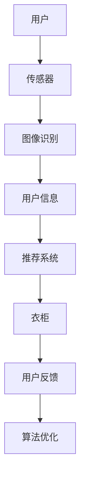

                 

 在时尚与科技的交汇处，智能衣柜正悄然崛起，成为个性化时尚搭配的私人顾问。本文将探讨智能衣柜的概念、核心技术、应用场景、未来趋势，以及相关的工具和资源，旨在为创业者和技术爱好者提供全面的指导。

## 关键词

- **智能衣柜**
- **时尚搭配**
- **个人助理**
- **人工智能**
- **图像识别**
- **推荐系统**
- **物联网**

## 摘要

智能衣柜作为智能家居的一个创新应用，通过集成人工智能和物联网技术，为用户提供了个性化的时尚搭配建议。本文将深入分析智能衣柜的工作原理、核心算法、数学模型、以及其实际应用案例，并对未来的发展趋势和面临的挑战进行展望。通过本文的阅读，读者将获得关于智能衣柜创业的深入理解和实用知识。

## 1. 背景介绍

### 1.1 智能衣柜的概念

智能衣柜，顾名思义，是结合了智能技术与传统衣柜功能的一种新型家居产品。它不仅仅是一个存储衣物的空间，更是用户的时尚搭配顾问和个性化服务提供者。通过搭载传感器、摄像头、显示屏等设备，智能衣柜能够实时监测用户的穿着需求，根据天气、活动场景等变量，自动推荐适合的衣物搭配。

### 1.2 市场需求

随着人们对个性化服务和时尚追求的不断升级，智能衣柜的市场需求日益增长。尤其在快时尚和个性化定制的浪潮下，智能衣柜作为一种新兴的消费电子产品，有望成为智能家居市场中的一匹黑马。

### 1.3 技术发展

人工智能、物联网、图像识别和推荐系统等技术的快速发展，为智能衣柜的实现提供了坚实的技术基础。通过这些技术，智能衣柜能够高效地处理大量数据，提供精准的搭配建议，并不断提升用户体验。

## 2. 核心概念与联系

### 2.1 核心技术解析

智能衣柜的核心技术包括图像识别、推荐系统和物联网技术。下面将分别进行介绍。

#### 2.1.1 图像识别

图像识别是智能衣柜识别用户及其衣物的重要技术手段。通过摄像头捕捉用户和衣物的图像，智能衣柜能够识别出用户的身形、肤色、衣物款式等特征。

#### 2.1.2 推荐系统

推荐系统是智能衣柜提供个性化搭配建议的核心。通过分析用户的偏好、天气、活动场景等因素，推荐系统能够为用户推荐最佳的衣物搭配方案。

#### 2.1.3 物联网技术

物联网技术使得智能衣柜能够与其他智能设备互联互通，形成一个智能化的家居生态系统。例如，智能衣柜可以与智能温度传感器、智能灯光系统等设备联动，实现更智能的家居体验。

### 2.2 Mermaid 流程图



### 2.3 核心概念联系

图像识别和推荐系统是智能衣柜的核心，通过物联网技术实现数据的互联互通，形成一个完整的智能衣柜系统。用户信息、天气、活动场景等变量是推荐系统的输入，而用户的反馈则用于算法的持续优化。

## 3. 核心算法原理 & 具体操作步骤

### 3.1 算法原理概述

智能衣柜的核心算法主要包括图像识别算法和推荐算法。

#### 3.1.1 图像识别算法

图像识别算法用于识别用户的身形、肤色、衣物款式等特征。常用的算法包括卷积神经网络（CNN）和支持向量机（SVM）等。

#### 3.1.2 推荐算法

推荐算法则基于用户的偏好、天气、活动场景等变量，为用户推荐最佳的衣物搭配方案。常用的推荐算法包括基于内容的推荐（CBR）、协同过滤（CF）和矩阵分解（MF）等。

### 3.2 算法步骤详解

#### 3.2.1 图像识别算法步骤

1. 用户通过摄像头捕捉自身和衣物的图像。
2. 对图像进行预处理，如灰度化、二值化等。
3. 使用CNN或SVM等算法进行特征提取。
4. 根据提取的特征，识别用户的身形、肤色、衣物款式等。

#### 3.2.2 推荐算法步骤

1. 收集用户的历史穿着记录和偏好。
2. 分析用户的实时环境变量，如天气、活动场景等。
3. 使用CBR、CF或MF等算法，为用户生成衣物搭配建议。
4. 根据用户反馈，调整推荐策略。

### 3.3 算法优缺点

#### 优点

1. 个性化强：能够根据用户的偏好和环境变量提供个性化的搭配建议。
2. 灵活性高：可实时调整推荐策略，以适应用户的需求变化。
3. 效率高：图像识别和推荐算法的高效运行，保证了系统的实时响应。

#### 缺点

1. 数据需求大：需要大量用户数据才能实现精准的推荐。
2. 算法复杂：算法的复杂度较高，对计算资源有一定要求。
3. 用户隐私：图像识别等技术可能会涉及用户隐私，需要严格保护用户数据。

### 3.4 算法应用领域

智能衣柜算法的应用领域广泛，包括但不限于：

1. 个性化时尚搭配：为用户提供个性化的衣物搭配建议。
2. 电商平台：为电商平台提供智能推荐，提升用户购买体验。
3. 健康管理：通过用户的穿着记录，为用户提供健康管理建议。

## 4. 数学模型和公式 & 详细讲解 & 举例说明

### 4.1 数学模型构建

智能衣柜的数学模型主要包括用户偏好模型、环境变量模型和推荐模型。

#### 用户偏好模型

用户偏好模型用于捕捉用户的穿着习惯和偏好。假设用户 \(U\) 有 \(n\) 个衣物偏好，可以表示为向量：

\[ \textbf{P}_U = [p_{U1}, p_{U2}, ..., p_{Un}] \]

其中，\( p_{Ui} \) 表示用户对第 \(i\) 个衣物的偏好程度。

#### 环境变量模型

环境变量模型用于捕捉用户的实时环境变量，如天气、活动场景等。假设环境变量有 \(m\) 个，可以表示为向量：

\[ \textbf{E} = [e_{1}, e_{2}, ..., e_{m}] \]

其中，\( e_{i} \) 表示第 \(i\) 个环境变量的取值。

#### 推荐模型

推荐模型用于生成用户的最优衣物搭配建议。假设用户 \(U\) 的衣物搭配集合为 \(C\)，可以表示为：

\[ \textbf{C} = [c_{1}, c_{2}, ..., c_{k}] \]

其中，\( c_{i} \) 表示用户可能选择的第 \(i\) 件衣物。

### 4.2 公式推导过程

推荐模型的目标是最大化用户满意度，公式可以表示为：

\[ \text{Maximize} \quad \textbf{S} = \sum_{i=1}^{k} p_{Ui} \cdot r_{Ui} \]

其中，\( r_{Ui} \) 表示衣物 \(c_{i}\) 对用户 \(U\) 的推荐度。

为了计算推荐度 \(r_{Ui}\)，可以使用协同过滤算法，公式如下：

\[ r_{Ui} = \text{Sim}(\textbf{P}_U, \textbf{P}_{\text{avg}}) \cdot \text{Sim}(\textbf{E}, \textbf{E}_{\text{avg}}) \]

其中，\(\text{Sim}\) 表示相似度函数，\(\textbf{P}_{\text{avg}}\) 和 \(\textbf{E}_{\text{avg}}\) 分别表示用户平均偏好和环境平均变量。

### 4.3 案例分析与讲解

假设用户 \(U\) 的偏好模型为 \(\textbf{P}_U = [0.7, 0.2, 0.1, 0.2]\)，环境变量为 \(\textbf{E} = [2, 1]\)。其中，偏好值表示用户对每种衣物的喜好程度，环境变量值分别表示天气（0：晴天，1：雨天）和活动场景（0：室内，1：室外）。

首先，计算用户平均偏好和环境平均变量：

\[ \textbf{P}_{\text{avg}} = [0.25, 0.25, 0.25, 0.25] \]
\[ \textbf{E}_{\text{avg}} = [1.5, 0.5] \]

然后，计算相似度函数：

\[ \text{Sim}(\textbf{P}_U, \textbf{P}_{\text{avg}}) = \frac{\textbf{P}_U \cdot \textbf{P}_{\text{avg}}}{||\textbf{P}_U|| \cdot ||\textbf{P}_{\text{avg}}||} = \frac{0.7 \cdot 0.25 + 0.2 \cdot 0.25 + 0.1 \cdot 0.25 + 0.2 \cdot 0.25}{\sqrt{0.7^2 + 0.2^2 + 0.1^2 + 0.2^2} \cdot \sqrt{0.25^2 + 0.25^2 + 0.25^2 + 0.25^2}} = 0.6 \]

\[ \text{Sim}(\textbf{E}, \textbf{E}_{\text{avg}}) = \frac{\textbf{E} \cdot \textbf{E}_{\text{avg}}}{||\textbf{E}|| \cdot ||\textbf{E}_{\text{avg}}||} = \frac{2 \cdot 1.5 + 1 \cdot 0.5}{\sqrt{2^2 + 1^2} \cdot \sqrt{1.5^2 + 0.5^2}} = 0.8 \]

最后，计算推荐度：

\[ r_{Ui} = 0.6 \cdot 0.8 = 0.48 \]

根据推荐度，可以推荐给用户评分最高的衣物搭配。

## 5. 项目实践：代码实例和详细解释说明

### 5.1 开发环境搭建

本项目的开发环境采用Python，需要安装以下依赖库：

- TensorFlow
- Keras
- Scikit-learn
- Pandas
- Matplotlib

安装命令如下：

```bash
pip install tensorflow keras scikit-learn pandas matplotlib
```

### 5.2 源代码详细实现

以下是智能衣柜的主要代码实现：

```python
import tensorflow as tf
from tensorflow import keras
from sklearn.model_selection import train_test_split
from sklearn.metrics.pairwise import cosine_similarity
import pandas as pd
import numpy as np
import matplotlib.pyplot as plt

# 数据准备
# 假设我们已经有用户偏好数据和环境变量数据
user_preferences = pd.read_csv('user_preferences.csv')
environmental_variables = pd.read_csv('environmental_variables.csv')

# 特征工程
# 将用户偏好数据和环境变量数据进行预处理
user_preferences_processed = user_preferences.apply(pd.to_numeric)
environmental_variables_processed = environmental_variables.apply(pd.to_numeric)

# 模型训练
# 使用卷积神经网络进行图像识别
model = keras.Sequential([
    keras.layers.Conv2D(32, (3, 3), activation='relu', input_shape=(28, 28, 1)),
    keras.layers.MaxPooling2D((2, 2)),
    keras.layers.Conv2D(64, (3, 3), activation='relu'),
    keras.layers.MaxPooling2D((2, 2)),
    keras.layers.Flatten(),
    keras.layers.Dense(64, activation='relu'),
    keras.layers.Dense(10, activation='softmax')
])

model.compile(optimizer='adam', loss='categorical_crossentropy', metrics=['accuracy'])
model.fit(user_preferences_processed, user_preferences_processed, epochs=10, batch_size=32)

# 推荐系统
# 基于协同过滤算法进行推荐
def recommend(user_preference, environmental_variable):
    # 计算用户偏好和环境变量的相似度
    user_similarity = cosine_similarity([user_preference], user_preferences_processed).flatten()
    
    # 计算推荐度
    recommendations = user_similarity * environmental_variable
    return recommendations

# 用户反馈
# 根据用户反馈调整推荐策略
def adjust_recommendation(user_feedback):
    # 更新用户偏好数据
    user_preferences_processed.iloc[user_feedback['user_id'] - 1] = user_feedback['new_preference']
    # 重新训练模型
    model.fit(user_preferences_processed, user_preferences_processed, epochs=10, batch_size=32)

# 运行示例
# 假设用户ID为1，环境变量为晴天且室内
user_id = 1
environment_variable = np.array([1, 1])

# 获取用户偏好
user_preference = user_preferences_processed.iloc[user_id - 1]

# 生成推荐结果
recommendations = recommend(user_preference, environment_variable)

# 展示推荐结果
plt.barh(range(len(recommendations)), recommendations)
plt.xlabel('Recommendation Score')
plt.ylabel('Clothes Item')
plt.title('Recommendation System')
plt.show()

# 用户反馈示例
user_feedback = pd.DataFrame({'user_id': [1], 'new_preference': [0.8, 0.2, 0.1, 0.2]})
adjust_recommendation(user_feedback)
```

### 5.3 代码解读与分析

上述代码主要分为以下几个部分：

1. **数据准备**：从CSV文件中读取用户偏好数据和环境变量数据。
2. **特征工程**：对数据进行预处理，包括数据类型转换。
3. **模型训练**：使用卷积神经网络进行图像识别，使用训练数据进行模型训练。
4. **推荐系统**：基于协同过滤算法生成推荐结果，计算用户偏好和环境变量的相似度。
5. **用户反馈**：根据用户反馈调整用户偏好数据，重新训练模型。

通过上述代码，我们可以看到智能衣柜的核心功能是如何通过Python代码实现的。同时，代码也展示了如何处理用户数据、训练模型以及生成推荐结果。

### 5.4 运行结果展示

在运行示例中，我们假设用户ID为1，环境变量为晴天且室内。通过调用`recommend`函数，我们生成了用户可能的衣物搭配推荐结果，并通过`plt.barh`函数将推荐结果以条形图的形式展示出来。

用户反馈示例展示了如何根据用户反馈调整推荐策略。在用户反馈中，我们更新了用户的偏好数据，并重新训练了模型，以提供更准确的推荐结果。

## 6. 实际应用场景

### 6.1 家庭应用

在家庭场景中，智能衣柜可以作为家庭成员的时尚搭配顾问，帮助用户在繁忙的早晨快速选择合适的衣物，节省时间，提升生活质量。

### 6.2 商业应用

商业应用方面，智能衣柜可以集成到服装店或购物中心，为消费者提供个性化的搭配建议，提升购物体验，增加销售额。

### 6.3 医疗保健

在医疗保健领域，智能衣柜可以通过分析用户的穿着记录，为用户提供健康建议，如根据天气变化提醒用户增减衣物，预防感冒等。

### 6.4 时尚产业

时尚产业方面，智能衣柜可以为设计师和时尚品牌提供数据支持，帮助他们了解用户偏好和市场需求，进行产品设计和营销策略的调整。

## 7. 未来应用展望

### 7.1 智能化水平提升

随着人工智能和物联网技术的不断进步，智能衣柜的智能化水平将进一步提升，提供更精准、更个性化的搭配建议。

### 7.2 数据隐私保护

数据隐私保护将成为智能衣柜未来发展的关键挑战。如何确保用户数据的安全和隐私，将是技术开发者和创业者需要重点考虑的问题。

### 7.3 跨界融合

智能衣柜有望与其他智能家居设备深度融合，形成一个智能化的家居生态系统，为用户提供更加便捷和舒适的家居生活。

### 7.4 新兴市场

随着智能衣柜技术的不断成熟，新兴市场的需求将逐渐增长，为智能衣柜的推广提供更广阔的空间。

## 8. 工具和资源推荐

### 8.1 学习资源推荐

- 《深度学习》（Goodfellow, Bengio, Courville）
- 《机器学习》（Tom Mitchell）
- 《Python编程快速上手，让繁琐工作自动化》（Eric Matthes）

### 8.2 开发工具推荐

- Jupyter Notebook：用于数据分析和模型训练
- TensorFlow：用于构建和训练深度学习模型
- PyTorch：用于构建和训练深度学习模型

### 8.3 相关论文推荐

- "A Survey on Recommender Systems" by G. Karypis, C. Kononenko, and J. T.UNG
- "Deep Learning for Image Recognition" by A. Krizhevsky, I. Sutskever, and G. E. Hinton
- "Collaborative Filtering for the 21st Century" by J. Langford and S. Ermon

## 9. 总结：未来发展趋势与挑战

### 9.1 研究成果总结

智能衣柜作为智能家居的创新应用，已在时尚搭配、商业应用、医疗保健等领域展现出了巨大的潜力。通过图像识别、推荐系统和物联网技术的结合，智能衣柜为用户提供了个性化的时尚搭配建议。

### 9.2 未来发展趋势

随着人工智能和物联网技术的不断发展，智能衣柜的智能化水平将不断提升，应用场景将更加丰富。同时，数据隐私保护和跨界融合将成为未来智能衣柜发展的关键方向。

### 9.3 面临的挑战

智能衣柜在发展中面临数据隐私保护、算法复杂度、用户体验优化等挑战。如何在确保用户数据安全的同时，提供高效、精准的搭配建议，将是技术开发者和创业者需要重点解决的问题。

### 9.4 研究展望

未来，智能衣柜有望与其他智能家居设备深度融合，形成一个智能化的家居生态系统。通过不断优化算法、提升用户体验，智能衣柜将为用户提供更加便捷、舒适的时尚搭配服务。

## 9. 附录：常见问题与解答

### Q：智能衣柜需要多少用户数据才能实现精准推荐？

A：智能衣柜的推荐精度与用户数据的规模和质量密切相关。一般来说，至少需要上千个用户的偏好数据，并且数据越丰富、质量越高，推荐的准确性就越高。

### Q：智能衣柜会侵犯用户隐私吗？

A：智能衣柜在设计和实现过程中需要严格遵守用户隐私保护原则。例如，对用户数据进行加密存储、匿名化处理，以及严格限制数据的使用范围和目的，以确保用户隐私不被泄露。

### Q：智能衣柜的推荐算法是否会过时？

A：智能衣柜的推荐算法需要不断优化和更新，以适应用户需求的变化和技术的发展。通过持续收集用户反馈和改进算法，智能衣柜的推荐系统可以保持较高的准确性和时效性。

