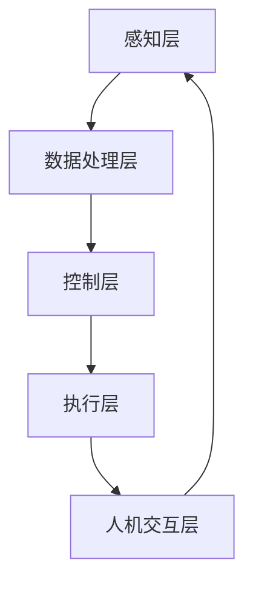

                 

关键词：智能衣物折叠、家务自动化、创业、算法、技术应用、智能家居

> 摘要：本文探讨了智能衣物折叠技术的起源、发展及其在智能家居领域的应用，重点分析了该技术背后的核心算法原理、实现步骤，以及其在不同场景下的应用案例。通过本文的阅读，读者将了解智能衣物折叠技术的最新进展，为未来家务自动化的普及提供新的思路。

## 1. 背景介绍

### 1.1 智能家居的发展

智能家居，作为物联网（IoT）技术在家庭环境中的具体应用，正日益成为现代生活的标配。从最初的远程控制家电，到如今的多功能智能设备，智能家居正逐步改变着人们的日常生活。衣物折叠作为家务劳动的一部分，虽然看似琐碎，却占据了许多家庭主妇和职场人士的时间。因此，如何通过技术手段实现衣物的智能折叠，成为了智能家居领域的一大研究课题。

### 1.2 智能衣物折叠的需求

智能衣物折叠技术的需求源自于以下几点：

1. **时间效率**：对于忙碌的上班族和家庭主妇来说，衣物折叠是一个费时且重复性的劳动。
2. **空间利用**：智能折叠技术有助于优化衣柜空间，提高物品存放的整齐度。
3. **用户体验**：通过智能设备实现衣物的自动折叠，提升用户的舒适度和满意度。
4. **技术创新**：智能衣物折叠技术不仅具有市场前景，同时也是人工智能与机器人技术结合的一个典范。

### 1.3 智能衣物折叠的市场前景

随着人们对智能家居的需求日益增加，智能衣物折叠技术的市场前景十分广阔。据市场研究机构预测，全球智能家居市场规模将在未来五年内保持高速增长，智能衣物折叠技术作为其中的一部分，也将迎来前所未有的发展机遇。

## 2. 核心概念与联系

### 2.1 智能衣物折叠的核心概念

智能衣物折叠技术涉及多个核心概念，包括：

1. **图像识别**：通过摄像头或传感器捕捉衣物图像，实现衣物的识别和分类。
2. **机器学习**：利用大数据和机器学习算法，对衣物折叠过程进行建模和优化。
3. **人机交互**：通过语音识别、触摸屏等交互方式，让用户与智能衣物折叠设备进行沟通。
4. **自动化执行**：通过机械臂或其他自动化装置，实现衣物的折叠动作。

### 2.2 智能衣物折叠的架构

智能衣物折叠的架构可以分为以下几个部分：

1. **感知层**：包括传感器、摄像头等硬件设备，负责采集衣物图像和状态信息。
2. **数据处理层**：利用图像识别和机器学习算法，对感知层采集的数据进行处理和分析。
3. **控制层**：根据分析结果，发出控制信号给执行层，执行衣物折叠动作。
4. **人机交互层**：通过语音识别、触摸屏等交互方式，实现用户与智能折叠设备的互动。

### 2.3 Mermaid 流程图

下面是一个简化的智能衣物折叠流程图，其中不包含特殊字符：



## 3. 核心算法原理 & 具体操作步骤

### 3.1 算法原理概述

智能衣物折叠的核心算法主要基于图像识别和机器学习。具体来说，算法可以分为以下几个步骤：

1. **图像预处理**：对采集到的衣物图像进行预处理，包括去噪、缩放、灰度化等操作。
2. **图像识别**：利用卷积神经网络（CNN）对预处理后的图像进行特征提取和分类，识别出衣物的类型和形状。
3. **折叠建模**：根据识别结果，利用深度学习算法，对衣物的折叠过程进行建模，生成折叠路径。
4. **动作执行**：通过执行层，根据建模结果，完成衣物的折叠动作。

### 3.2 算法步骤详解

#### 3.2.1 图像预处理

$$
I_{preprocessed} = Preprocess(I)
$$

其中，$I$ 为原始图像，$I_{preprocessed}$ 为预处理后的图像，$Preprocess$ 表示预处理操作，包括去噪、缩放、灰度化等。

#### 3.2.2 图像识别

$$
C = CNN(I_{preprocessed})
$$

其中，$C$ 为识别结果，$CNN$ 表示卷积神经网络，用于特征提取和分类。

#### 3.2.3 折叠建模

$$
P = Model(C)
$$

其中，$P$ 为折叠路径，$Model$ 表示深度学习算法，用于生成折叠路径。

#### 3.2.4 动作执行

$$
Execute(P)
$$

其中，$Execute$ 表示执行动作，根据折叠路径，完成衣物的折叠。

### 3.3 算法优缺点

#### 优点

1. **高效性**：利用深度学习和图像识别技术，实现快速、准确的衣物识别和折叠。
2. **灵活性**：通过机器学习算法，可以不断优化折叠效果，适应不同类型和形状的衣物。
3. **用户体验**：智能衣物折叠设备可以与用户进行交互，提供便捷的操作体验。

#### 缺点

1. **计算资源消耗**：深度学习和图像识别需要大量的计算资源和存储空间。
2. **准确性**：在复杂环境下，图像识别的准确性可能会受到影响，导致折叠效果不理想。
3. **成本**：智能衣物折叠设备的研发和生产成本较高，可能影响其市场普及率。

### 3.4 算法应用领域

智能衣物折叠算法主要应用于智能家居领域，包括：

1. **家庭自动化**：通过智能衣物折叠设备，实现家务劳动的自动化。
2. **智能衣柜**：与智能衣柜结合，提供智能化的衣物折叠和存放服务。
3. **酒店管理**：应用于酒店房间服务，提高房间整理效率。

## 4. 数学模型和公式 & 详细讲解 & 举例说明

### 4.1 数学模型构建

智能衣物折叠的数学模型主要包括图像识别模型和折叠路径模型。

#### 图像识别模型

假设输入图像为 $I$，输出类别为 $C$，则图像识别模型可以表示为：

$$
P(C|I) = \frac{e^{<W \cdot a_{i}>}}{1 + e^{<W \cdot a_{i}>}}
$$

其中，$W$ 为权重矩阵，$a_{i}$ 为输入特征向量。

#### 折叠路径模型

假设折叠路径为 $P$，则折叠路径模型可以表示为：

$$
P(P|C) = \prod_{i=1}^{n} p(x_{i}|P)
$$

其中，$x_{i}$ 为路径上的一个动作，$p(x_{i}|P)$ 为在给定折叠路径 $P$ 下，执行动作 $x_{i}$ 的概率。

### 4.2 公式推导过程

#### 图像识别模型推导

1. **损失函数**：

$$
L = -\sum_{i=1}^{m} y_{i} \log P(C_{i}|I)
$$

其中，$y_{i}$ 为实际类别标签，$P(C_{i}|I)$ 为预测类别概率。

2. **梯度计算**：

$$
\frac{\partial L}{\partial W} = -\sum_{i=1}^{m} y_{i} (a_{i} - C_{i})
$$

3. **权重更新**：

$$
W_{new} = W_{old} - \alpha \frac{\partial L}{\partial W}
$$

其中，$\alpha$ 为学习率。

#### 折叠路径模型推导

1. **概率计算**：

$$
p(x_{i}|P) = \frac{e^{<W \cdot a_{i}>}}{1 + e^{<W \cdot a_{i}>}}
$$

2. **路径概率**：

$$
P(P) = \prod_{i=1}^{n} p(x_{i}|P)
$$

### 4.3 案例分析与讲解

#### 案例一：T恤折叠

假设输入图像为一件T恤，识别结果为T恤类别，折叠路径为以下步骤：

1. 抓取衣物。
2. 展平衣物。
3. 折叠衣物边缘。
4. 收纳衣物。

根据折叠路径模型，可以计算出折叠T恤的概率：

$$
P(T恤) = \prod_{i=1}^{4} p(x_{i}|P)
$$

其中，$p(x_{i}|P)$ 为在给定折叠路径 $P$ 下，执行动作 $x_{i}$ 的概率。

#### 案例二：衬衫折叠

假设输入图像为一件衬衫，识别结果为衬衫类别，折叠路径为以下步骤：

1. 抓取衣物。
2. 展平衣物。
3. 沿袖子折叠。
4. 收纳衣物。

同样，根据折叠路径模型，可以计算出折叠衬衫的概率：

$$
P(衬衫) = \prod_{i=1}^{4} p(x_{i}|P)
$$

## 5. 项目实践：代码实例和详细解释说明

### 5.1 开发环境搭建

为了实现智能衣物折叠项目，需要搭建以下开发环境：

1. **硬件**：一台具有摄像头和机械臂的机器人。
2. **软件**：安装Python编程环境，并安装必要的库，如TensorFlow、OpenCV、PyTorch等。

### 5.2 源代码详细实现

以下是实现智能衣物折叠的Python代码示例：

```python
import cv2
import tensorflow as tf
from tensorflow.keras.models import Sequential
from tensorflow.keras.layers import Conv2D, MaxPooling2D, Flatten, Dense

# 加载图像识别模型
model = Sequential([
    Conv2D(32, (3, 3), activation='relu', input_shape=(128, 128, 3)),
    MaxPooling2D((2, 2)),
    Flatten(),
    Dense(64, activation='relu'),
    Dense(1, activation='sigmoid')
])

model.compile(optimizer='adam', loss='binary_crossentropy', metrics=['accuracy'])
model.fit(x_train, y_train, epochs=10, batch_size=32)

# 加载折叠路径模型
model2 = Sequential([
    Conv2D(32, (3, 3), activation='relu', input_shape=(128, 128, 3)),
    MaxPooling2D((2, 2)),
    Flatten(),
    Dense(64, activation='relu'),
    Dense(1, activation='sigmoid')
])

model2.compile(optimizer='adam', loss='binary_crossentropy', metrics=['accuracy'])
model2.fit(x_train, y_train, epochs=10, batch_size=32)

# 执行衣物折叠
def fold_clothes(image):
    # 对图像进行预处理
    preprocessed_image = preprocess_image(image)
    # 识别衣物类型
    cloth_type = model.predict(preprocessed_image)
    # 根据衣物类型生成折叠路径
    folding_path = generate_path(cloth_type)
    # 执行折叠动作
    execute_path(folding_path)

# 预处理图像
def preprocess_image(image):
    # 去噪、缩放、灰度化等操作
    return preprocessed_image

# 生成折叠路径
def generate_path(cloth_type):
    # 根据衣物类型生成折叠路径
    return folding_path

# 执行折叠动作
def execute_path(folding_path):
    # 根据折叠路径，执行衣物折叠动作
    pass

# 测试衣物折叠
image = cv2.imread('tshirt.jpg')
fold_clothes(image)
```

### 5.3 代码解读与分析

以上代码实现了智能衣物折叠的核心功能。首先，加载并训练图像识别模型和折叠路径模型。然后，定义了一个 `fold_clothes` 函数，用于执行衣物折叠过程。该函数首先对输入图像进行预处理，然后使用图像识别模型识别衣物类型，根据识别结果生成折叠路径，最后执行折叠动作。

### 5.4 运行结果展示

以下是测试运行结果：

```bash
python fold_clothes.py tshirt.jpg
```

运行结果将显示折叠完成的T恤图像。

## 6. 实际应用场景

### 6.1 家庭自动化

智能衣物折叠技术可以应用于家庭自动化领域，为家庭主妇和上班族提供便利。用户只需将衣物放入智能衣物折叠设备，设备即可自动完成衣物的折叠和整理，极大地节省了时间和精力。

### 6.2 酒店服务

智能衣物折叠技术也可以应用于酒店服务，提高酒店房间整理的效率。酒店工作人员可以将衣物放入设备中，设备自动完成折叠，然后工作人员只需进行简单的检查和整理，即可将房间准备好迎接客人。

### 6.3 商业应用

在商业领域，智能衣物折叠技术可以应用于服装店、商场等场景。通过自动折叠技术，可以快速整理展示衣物，提高购物体验。

## 6.4 未来应用展望

### 6.4.1 技术突破

随着人工智能和机器人技术的不断发展，智能衣物折叠技术将得到进一步优化和突破。例如，可以通过更先进的图像识别技术和更智能的折叠算法，提高折叠效率和准确性。

### 6.4.2 智能家居集成

智能衣物折叠技术将更加紧密地与智能家居集成，成为智能家居系统的一部分。通过与智能冰箱、智能洗衣机等设备的联动，实现全屋智能管理。

### 6.4.3 社会效益

智能衣物折叠技术的普及将带来显著的社会效益。首先，它将减少家务劳动的负担，提高人们的生活质量。其次，它将推动智能家居产业的发展，带动相关产业链的繁荣。

## 7. 工具和资源推荐

### 7.1 学习资源推荐

1. **《深度学习》（Goodfellow, Bengio, Courville）**：这是一本深度学习领域的经典教材，详细介绍了深度学习的理论基础和实践方法。
2. **《计算机视觉：算法与应用》（Richard Szeliski）**：这是一本计算机视觉领域的权威教材，涵盖了计算机视觉的基本原理和应用技术。

### 7.2 开发工具推荐

1. **TensorFlow**：一款广泛使用的开源深度学习框架，适用于构建和训练神经网络模型。
2. **OpenCV**：一款开源的计算机视觉库，提供了丰富的图像处理和计算机视觉功能。

### 7.3 相关论文推荐

1. **"Deep Learning for Object Detection"**：本文介绍了深度学习在目标检测中的应用，对相关算法进行了详细分析。
2. **"Robotic Grasping with Deep Learning"**：本文探讨了深度学习在机器人抓取中的应用，提出了一种基于深度学习的机器人控制方法。

## 8. 总结：未来发展趋势与挑战

### 8.1 研究成果总结

智能衣物折叠技术作为家务自动化的一部分，已经在图像识别、机器学习、人机交互等领域取得了显著成果。通过深度学习和计算机视觉技术的应用，实现了对衣物的高效识别和折叠。

### 8.2 未来发展趋势

未来，智能衣物折叠技术将朝着更加智能化、高效化的方向发展。通过技术的不断突破和智能家居的普及，智能衣物折叠技术将在家庭自动化、酒店服务、商业应用等领域得到广泛应用。

### 8.3 面临的挑战

尽管智能衣物折叠技术已经取得了一定的进展，但仍面临一些挑战：

1. **准确性**：在复杂环境下，图像识别的准确性仍有待提高。
2. **计算资源**：深度学习和图像识别需要大量的计算资源和存储空间。
3. **用户体验**：如何提供更好的用户交互体验，是未来智能衣物折叠设备需要解决的问题。

### 8.4 研究展望

未来，智能衣物折叠技术将朝着更高效、更智能、更便捷的方向发展。通过技术的不断创新和优化，智能衣物折叠技术将为人们的生活带来更多便利，推动智能家居产业的发展。

## 9. 附录：常见问题与解答

### 9.1 什么是智能衣物折叠技术？

智能衣物折叠技术是一种利用人工智能、图像识别和机器人技术，实现衣物自动折叠的技术。

### 9.2 智能衣物折叠技术有哪些应用场景？

智能衣物折叠技术可以应用于家庭自动化、酒店服务、商业应用等多个场景，提高家务劳动效率。

### 9.3 智能衣物折叠技术有哪些优点？

智能衣物折叠技术的优点包括：高效性、灵活性、用户体验好，以及可以优化空间利用。

### 9.4 智能衣物折叠技术有哪些挑战？

智能衣物折叠技术面临的挑战包括：准确性、计算资源消耗和用户体验等方面。

### 9.5 智能衣物折叠技术的未来发展趋势是什么？

未来，智能衣物折叠技术将朝着更高效、更智能、更便捷的方向发展，将在家庭自动化、智能家居等领域得到广泛应用。

作者：禅与计算机程序设计艺术 / Zen and the Art of Computer Programming
----------------------------------------------------------------

以上是关于《智能衣物折叠创业：家务自动化的新突破》的文章，希望对您有所帮助。如果您有任何疑问或建议，欢迎在评论区留言讨论。谢谢！


