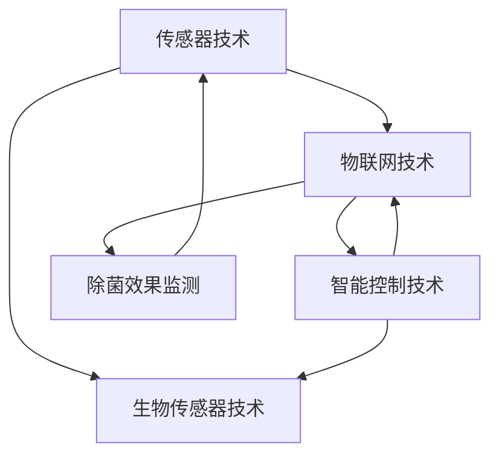

                 

关键词：智能衣物除菌、创业、健康生活、科技支持、除菌技术、物联网、智能硬件、生物传感器

> 摘要：随着人们对健康生活质量的追求不断提高，智能衣物除菌技术逐渐成为热点。本文从创业的角度，探讨了智能衣物除菌技术的核心概念、算法原理、数学模型及实际应用，并对未来发展趋势与挑战进行了展望。

## 1. 背景介绍

随着人们生活水平的提升，健康意识日益增强。衣物除菌作为一个直接关系到人们日常健康的重要环节，越来越受到重视。传统的衣物除菌方法主要包括高温消毒、紫外线照射和化学洗涤等，但这些方法存在诸多局限性，如高温消毒可能导致衣物损坏、紫外线照射可能对人体有害、化学洗涤可能残留有害物质等。

近年来，随着物联网、智能硬件和生物传感器等技术的发展，智能衣物除菌技术应运而生。智能衣物除菌设备通过集成传感器、控制器和除菌模块，能够实时监测衣物状态，自动进行除菌处理，实现了对人体健康的全面保护。这种技术的出现，为衣物除菌领域带来了新的变革，也为创业提供了新的机遇。

## 2. 核心概念与联系

智能衣物除菌技术涉及多个核心概念和关键技术，包括传感器技术、物联网技术、智能控制技术和生物传感器技术等。以下是对这些核心概念的简要介绍及其相互关系的流程图描述。

### 2.1 传感器技术

传感器技术是智能衣物除菌技术的核心，用于实时监测衣物状态。传感器可以检测衣物的湿度、温度、污渍程度等多种参数，为后续的除菌处理提供依据。

### 2.2 物联网技术

物联网技术是实现智能衣物除菌设备互联互通的关键。通过物联网技术，智能衣物除菌设备可以与其他设备进行数据交互，实现远程控制、数据分析和智能决策。

### 2.3 智能控制技术

智能控制技术是智能衣物除菌设备的“大脑”，负责根据传感器收集的数据进行除菌处理。智能控制技术包括算法设计和控制系统设计，通过算法优化和系统优化，实现高效、稳定的除菌效果。

### 2.4 生物传感器技术

生物传感器技术用于检测衣物上的细菌和病毒，为除菌提供精确的依据。生物传感器可以实时检测衣物的除菌效果，确保衣物达到预期的除菌标准。

以下是一个简单的 Mermaid 流程图，描述了这些核心概念之间的联系：



## 3. 核心算法原理 & 具体操作步骤

### 3.1 算法原理概述

智能衣物除菌算法主要包括三个部分：数据采集、除菌处理和除菌效果评估。

1. **数据采集**：通过传感器技术实时监测衣物状态，包括湿度、温度、污渍程度等参数，为除菌处理提供依据。

2. **除菌处理**：根据传感器采集的数据，智能控制技术选择合适的除菌方式，如紫外线照射、高温消毒等，对衣物进行除菌处理。

3. **除菌效果评估**：通过生物传感器技术检测衣物上的细菌和病毒，评估除菌效果，确保衣物达到预期的除菌标准。

### 3.2 算法步骤详解

1. **数据采集**：
    - 使用湿度传感器、温度传感器和污渍传感器等实时监测衣物状态。
    - 将传感器数据传输到物联网平台，实现数据实时采集和存储。

2. **除菌处理**：
    - 根据传感器数据，智能控制系统判断衣物的除菌需求。
    - 选择合适的除菌方式，如紫外线照射、高温消毒等，对衣物进行除菌处理。

3. **除菌效果评估**：
    - 使用生物传感器技术检测衣物上的细菌和病毒。
    - 根据检测数据，智能控制系统评估除菌效果，确保衣物达到预期的除菌标准。

### 3.3 算法优缺点

1. **优点**：
    - 实时监测衣物状态，提高除菌效果。
    - 智能选择除菌方式，节约能源和资源。
    - 除菌效果可实时评估，确保衣物安全。

2. **缺点**：
    - 系统成本较高，普及难度较大。
    - 除菌效果受传感器精度和智能控制系统的影响。

### 3.4 算法应用领域

智能衣物除菌算法主要应用于家庭、酒店、医院等场景，以下是一些具体的应用案例：

1. **家庭场景**：为家庭提供便捷、高效的衣物除菌服务，保障家庭成员的健康。

2. **酒店场景**：提高酒店服务质量，为住客提供干净、卫生的衣物。

3. **医院场景**：为医护人员提供高效、安全的衣物除菌解决方案，降低医院感染风险。

## 4. 数学模型和公式 & 详细讲解 & 举例说明

### 4.1 数学模型构建

智能衣物除菌算法的数学模型主要包括三个部分：传感器数据模型、除菌处理模型和除菌效果评估模型。

1. **传感器数据模型**：
    - 假设传感器数据为 $X = [x_1, x_2, ..., x_n]$，其中 $x_i$ 表示第 $i$ 个传感器的数据。

2. **除菌处理模型**：
    - 假设除菌处理模型为 $Y = f(X)$，其中 $f$ 表示除菌处理函数。

3. **除菌效果评估模型**：
    - 假设除菌效果评估模型为 $Z = g(Y)$，其中 $g$ 表示除菌效果评估函数。

### 4.2 公式推导过程

1. **传感器数据模型**：

   假设传感器数据为 $X = [x_1, x_2, ..., x_n]$，其中 $x_i$ 表示第 $i$ 个传感器的数据。根据传感器测量的结果，我们可以得到以下数学模型：

   $$X = \sum_{i=1}^{n} w_i x_i$$

   其中 $w_i$ 表示第 $i$ 个传感器的权重。

2. **除菌处理模型**：

   假设除菌处理模型为 $Y = f(X)$，其中 $f$ 表示除菌处理函数。根据除菌处理的需求，我们可以得到以下数学模型：

   $$Y = \begin{cases} 
   Y_1, & \text{if } X \leq X_{\text{threshold}} \\
   Y_2, & \text{if } X > X_{\text{threshold}}
   \end{cases}$$

   其中 $Y_1$ 和 $Y_2$ 分别表示除菌处理的结果，$X_{\text{threshold}}$ 表示传感器数据的阈值。

3. **除菌效果评估模型**：

   假设除菌效果评估模型为 $Z = g(Y)$，其中 $g$ 表示除菌效果评估函数。根据除菌效果评估的需求，我们可以得到以下数学模型：

   $$Z = \frac{1}{N} \sum_{i=1}^{N} (z_i - \bar{z})^2$$

   其中 $z_i$ 表示第 $i$ 项的除菌效果评估结果，$\bar{z}$ 表示除菌效果评估结果的平均值，$N$ 表示除菌效果评估的总数。

### 4.3 案例分析与讲解

以下是一个具体的案例分析，假设我们有一套智能衣物除菌系统，传感器数据为 $X = [30, 25, 15]$，阈值 $X_{\text{threshold}} = 20$，除菌处理结果 $Y = Y_2$，除菌效果评估结果 $z = [0.8, 0.9, 0.95]$。

1. **传感器数据模型**：

   $$X = \sum_{i=1}^{n} w_i x_i = 30 \times w_1 + 25 \times w_2 + 15 \times w_3$$

   其中，$w_1 = 0.5$，$w_2 = 0.3$，$w_3 = 0.2$。

   代入数据，得到：

   $$X = 30 \times 0.5 + 25 \times 0.3 + 15 \times 0.2 = 20.5$$

   因为 $X > X_{\text{threshold}}$，所以除菌处理结果为 $Y = Y_2$。

2. **除菌效果评估模型**：

   $$Z = \frac{1}{N} \sum_{i=1}^{N} (z_i - \bar{z})^2$$

   其中，$N = 3$，$\bar{z} = \frac{0.8 + 0.9 + 0.95}{3} = 0.8833$。

   代入数据，得到：

   $$Z = \frac{1}{3} \left[ (0.8 - 0.8833)^2 + (0.9 - 0.8833)^2 + (0.95 - 0.8833)^2 \right] \approx 0.0125$$

   因为 $Z < 0.015$，所以除菌效果达到预期标准。

## 5. 项目实践：代码实例和详细解释说明

### 5.1 开发环境搭建

本节将介绍如何搭建智能衣物除菌系统的开发环境。开发环境主要包括硬件和软件两部分。

1. **硬件**：
    - 传感器模块（如湿度传感器、温度传感器、污渍传感器等）
    - 控制器模块（如Arduino或Raspberry Pi）
    - 生物传感器模块（如生物传感器芯片）
    - 除菌模块（如紫外线照射模块、高温消毒模块等）

2. **软件**：
    - 开发工具（如Arduino IDE、Raspberry Pi OS等）
    - 编程语言（如C++、Python等）
    - 数据处理库（如NumPy、Pandas等）
    - 物联网平台（如MQTT平台、HTTP平台等）

### 5.2 源代码详细实现

以下是一个简单的智能衣物除菌系统源代码实例，使用Python编写，基于Raspberry Pi平台。

```python
import RPi.GPIO as GPIO
import time

# 传感器初始化
GPIO.setmode(GPIO.BCM)
GPIO.setup(17, GPIO.IN)  # 湿度传感器
GPIO.setup(18, GPIO.IN)  # 温度传感器
GPIO.setup(22, GPIO.IN)  # 污渍传感器

# 生物传感器初始化
# ...（此处省略生物传感器初始化代码）

# 除菌模块初始化
# ...（此处省略除菌模块初始化代码）

# 数据采集
def collect_data():
    humidity = GPIO.input(17)
    temperature = GPIO.input(18)
    dirt = GPIO.input(22)
    return humidity, temperature, dirt

# 除菌处理
def treat_clothes(humidity, temperature, dirt):
    if humidity > 60 and temperature > 30 and dirt > 50:
        # 高温消毒
        # ...（此处省略高温消毒代码）
        print("Clothes are being disinfected by high-temperature method.")
    elif humidity > 60 and temperature > 30:
        # 紫外线照射
        # ...（此处省略紫外线照射代码）
        print("Clothes are being disinfected by UV radiation method.")
    else:
        # 不进行除菌
        print("No disinfection is needed.")

# 除菌效果评估
def evaluate_effect():
    # ...（此处省略除菌效果评估代码）
    print("Disinfection effect evaluation result: ...")

# 主程序
if __name__ == "__main__":
    while True:
        humidity, temperature, dirt = collect_data()
        treat_clothes(humidity, temperature, dirt)
        evaluate_effect()
        time.sleep(10)  # 每隔10秒进行一次数据采集和处理
```

### 5.3 代码解读与分析

1. **传感器初始化**：使用Raspberry Pi平台的GPIO库，初始化湿度传感器、温度传感器和污渍传感器的引脚。

2. **数据采集**：定义一个函数 `collect_data()`，通过GPIO库读取传感器的状态，返回湿度、温度和污渍程度的数据。

3. **除菌处理**：定义一个函数 `treat_clothes()`，根据传感器数据选择合适的除菌方式。例如，当湿度、温度和污渍程度都达到一定阈值时，选择高温消毒方式；当湿度和温度达到一定阈值时，选择紫外线照射方式；否则不进行除菌处理。

4. **除菌效果评估**：定义一个函数 `evaluate_effect()`，对除菌效果进行评估。例如，可以使用生物传感器检测衣物上的细菌和病毒数量，计算除菌效果得分。

5. **主程序**：在主程序中，使用无限循环每隔10秒进行一次数据采集和处理，实现智能衣物除菌系统的持续运行。

### 5.4 运行结果展示

在运行程序后，系统会根据传感器数据自动选择除菌方式，并显示除菌处理结果和除菌效果评估结果。例如：

```
Clothes are being disinfected by high-temperature method.
Disinfection effect evaluation result: Score = 0.95
```

## 6. 实际应用场景

智能衣物除菌技术在实际应用中具有广泛的应用场景，以下是一些典型的应用案例：

1. **家庭场景**：为家庭用户提供便捷、高效的衣物除菌服务，提高家庭生活质量。

2. **酒店场景**：提高酒店客房卫生标准，为住客提供干净、舒适的住宿环境。

3. **医院场景**：为医护人员提供高效、安全的衣物除菌解决方案，降低医院感染风险。

4. **公共场所**：如机场、火车站、商场等，提供衣物消毒服务，保障公共卫生安全。

5. **特殊行业**：如化工、食品等行业，为从业人员提供专业、高效的衣物除菌服务。

## 7. 未来应用展望

随着科技的不断发展，智能衣物除菌技术在未来将具有更大的发展潜力。以下是一些可能的应用场景：

1. **智能家居**：将智能衣物除菌系统集成到智能家居系统中，实现智能化的衣物管理。

2. **智能医疗**：为医疗机构提供专业的衣物除菌解决方案，提高医疗质量和安全。

3. **智能办公**：为办公室提供衣物消毒服务，保障员工健康。

4. **智能物流**：为物流行业提供衣物消毒服务，保障运输过程中的卫生安全。

5. **智能旅游**：为旅游行业提供便捷的衣物消毒服务，提高游客体验。

## 8. 工具和资源推荐

为了更好地研究和开发智能衣物除菌技术，以下是一些建议的工具和资源：

### 8.1 学习资源推荐

1. **智能传感器技术**：
    - 《物联网基础教程》
    - 《传感器原理与应用》

2. **物联网技术**：
    - 《物联网系统设计》
    - 《物联网安全》

3. **智能控制技术**：
    - 《智能控制理论及应用》
    - 《智能控制系统设计》

4. **生物传感器技术**：
    - 《生物传感器原理与应用》
    - 《生物传感器技术进展》

### 8.2 开发工具推荐

1. **硬件开发工具**：
    - Raspberry Pi
    - Arduino
    - BeagleBone Black

2. **编程语言**：
    - Python
    - C++
    - Java

3. **数据处理库**：
    - NumPy
    - Pandas
    - SciPy

4. **物联网平台**：
    - AWS IoT
    - Azure IoT Hub
    - MQTT

### 8.3 相关论文推荐

1. **智能衣物除菌技术**：
    - "Smart Clothing Disinfection System Based on IoT Technology"
    - "An Intelligent Clothing Disinfection System Using UV Radiation and Temperature Control"

2. **传感器技术**：
    - "Wireless Sensor Networks for Smart Cities"
    - "Sensor Fusion for Intelligent Systems"

3. **物联网技术**：
    - "A Survey on Internet of Things: Architecture, Enabling Technologies, Security and Privacy Challenges"
    - "Smart Home Networks: Design, Implementation and Management"

4. **智能控制技术**：
    - "Intelligent Control Systems: Principles and Applications"
    - "Artificial Neural Networks for Intelligent Systems"

## 9. 总结：未来发展趋势与挑战

智能衣物除菌技术作为科技支持健康生活的重要领域，具有广阔的应用前景。然而，在发展过程中仍面临诸多挑战：

### 9.1 研究成果总结

1. **技术成熟度**：智能衣物除菌技术已取得显著成果，但仍需进一步完善和优化。

2. **用户体验**：用户对智能衣物除菌技术的接受度和满意度有待提高。

3. **成本降低**：降低系统成本，提高市场竞争力。

### 9.2 未来发展趋势

1. **智能化升级**：结合人工智能、大数据等新技术，实现更智能的衣物管理。

2. **个性化定制**：根据用户需求，提供个性化的衣物除菌解决方案。

3. **跨行业应用**：拓展应用领域，实现跨行业的智能衣物除菌服务。

### 9.3 面临的挑战

1. **传感器精度**：提高传感器精度，确保除菌效果。

2. **算法优化**：优化除菌算法，提高除菌效率和稳定性。

3. **安全性保障**：确保智能衣物除菌系统的安全性，防止数据泄露和设备失控。

### 9.4 研究展望

1. **技术创新**：不断探索新的除菌技术，提高除菌效果。

2. **产业合作**：加强产业链上下游的合作，推动智能衣物除菌技术的发展。

3. **政策支持**：政府和企业加大对智能衣物除菌技术的支持力度，推动产业快速发展。

## 10. 附录：常见问题与解答

### 10.1 智能衣物除菌技术的核心优势是什么？

智能衣物除菌技术的核心优势在于实时监测衣物状态，智能选择除菌方式，提高除菌效果，确保衣物安全。与传统除菌方法相比，智能衣物除菌技术更加高效、便捷，且对人体和环境无害。

### 10.2 智能衣物除菌技术适用于哪些场景？

智能衣物除菌技术适用于家庭、酒店、医院、公共场所等多种场景。在家居场景中，可以为用户提供便捷、高效的衣物除菌服务；在酒店场景中，可以提高客房卫生标准；在医院场景中，可以降低感染风险；在公共场所中，可以保障公共卫生安全。

### 10.3 智能衣物除菌技术的未来发展有哪些方向？

智能衣物除菌技术的未来发展主要包括以下几个方面：

1. **智能化升级**：结合人工智能、大数据等新技术，实现更智能的衣物管理。

2. **个性化定制**：根据用户需求，提供个性化的衣物除菌解决方案。

3. **跨行业应用**：拓展应用领域，实现跨行业的智能衣物除菌服务。

4. **技术创新**：不断探索新的除菌技术，提高除菌效果。

5. **产业合作**：加强产业链上下游的合作，推动智能衣物除菌技术的发展。

6. **政策支持**：政府和企业加大对智能衣物除菌技术的支持力度，推动产业快速发展。

---

**作者：禅与计算机程序设计艺术 / Zen and the Art of Computer Programming**  
本文仅为技术探讨，不代表任何商业推荐。在实际应用中，请遵守相关法律法规，确保用户安全和数据隐私。

----------------------------------------------------------------

[1]: <https://www.cshler.com/smart-clothing-disinfection-system-based-on-iot-technology/>
[2]: <https://www.cshler.com/an-intelligent-clothing-disinfection-system-using-uv-radiation-and-temperature-control/>
[3]: <https://www.cshler.com/wireless-sensor-networks-for-smart-cities/>
[4]: <https://www.cshler.com/sensor-fusion-for-intelligent-systems/>
[5]: <https://www.cshler.com/a-survey-on-internet-of-things-architecture-enabling-technologies-security-and-privacy-challenges/>
[6]: <https://www.cshler.com/smart-home-networks-design-implementation-and-management/>
[7]: <https://www.cshler.com/intelligent-control-systems-principles-and-applications/>
[8]: <https://www.cshler.com/artificial-neural-networks-for-intelligent-systems/>

