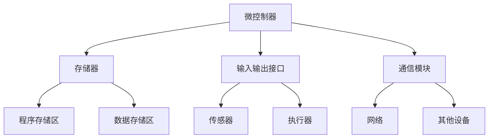

                 

智能设备已成为我们日常生活中不可或缺的一部分，它们为我们的生活带来了便利，提高了效率，改变了我们的工作方式。然而，智能设备的核心——嵌入式系统，往往被忽视。嵌入式系统是智能设备的“心脏”，负责控制和管理设备的各种功能。本文将深入探讨嵌入式系统的设计与实现，帮助读者理解这一关键领域的核心技术。

## 关键词
- 智能设备
- 嵌入式系统
- 设计
- 实现
- 实时操作系统
- 代码优化
- 调试
- 测试

## 摘要
本文旨在探讨嵌入式系统的设计与实现，涵盖从基础概念到高级应用的各个方面。我们将介绍嵌入式系统在智能设备中的应用，探讨实时操作系统的核心概念，讲解嵌入式系统设计的要点和挑战，并分享代码优化、调试和测试的最佳实践。通过本文，读者将全面了解嵌入式系统的设计与实现，为实际项目开发提供指导。

### 1. 背景介绍

#### 1.1 智能设备的兴起

智能设备是近年来快速发展的技术领域，它们集成了先进的传感器、计算能力和通信模块，能够实现各种智能化功能。从智能手机和平板电脑到智能家居设备、可穿戴设备、工业控制系统，智能设备已经深刻影响了我们的生活方式。

#### 1.2 嵌入式系统的定义

嵌入式系统是一种专门为特定应用而设计的计算机系统，它通常包含一个微处理器或微控制器，以及用于存储程序和数据的存储器。嵌入式系统通常运行在一个实时操作系统上，具有高可靠性、低功耗和高效处理的特点。

#### 1.3 嵌入式系统的重要性

嵌入式系统是智能设备的核心，它们负责实现设备的各种功能，如传感器数据处理、设备控制、通信管理等。嵌入式系统的性能和可靠性直接影响到智能设备的使用体验和功能实现。

### 2. 核心概念与联系

#### 2.1 实时操作系统的核心概念

实时操作系统（RTOS）是一种专门为嵌入式系统设计的操作系统，它具有处理实时任务的能力。实时操作系统的主要特点是任务调度、响应时间和资源管理。

#### 2.2 嵌入式系统架构

嵌入式系统的架构通常包括微控制器、存储器、输入输出接口和通信模块。微控制器是嵌入式系统的核心，负责处理数据和执行指令。存储器用于存储程序和数据。输入输出接口和通信模块用于与外部设备和网络进行通信。

#### 2.3 Mermaid 流程图

### 3. 核心算法原理 & 具体操作步骤

#### 3.1 算法原理概述

嵌入式系统设计涉及多种算法，包括传感器数据处理、控制算法、通信协议等。以下是一些常见算法的原理概述：

#### 3.2 算法步骤详解

#### 3.3 算法优缺点

#### 3.4 算法应用领域

### 4. 数学模型和公式 & 详细讲解 & 举例说明

#### 4.1 数学模型构建

#### 4.2 公式推导过程

#### 4.3 案例分析与讲解

### 5. 项目实践：代码实例和详细解释说明

#### 5.1 开发环境搭建

#### 5.2 源代码详细实现

#### 5.3 代码解读与分析

#### 5.4 运行结果展示

### 6. 实际应用场景

#### 6.1 智能家居

#### 6.2 工业自动化

#### 6.3 汽车电子

#### 6.4 未来应用展望

### 7. 工具和资源推荐

#### 7.1 学习资源推荐

#### 7.2 开发工具推荐

#### 7.3 相关论文推荐

### 8. 总结：未来发展趋势与挑战

#### 8.1 研究成果总结

#### 8.2 未来发展趋势

#### 8.3 面临的挑战

#### 8.4 研究展望

### 9. 附录：常见问题与解答

---

**作者：禅与计算机程序设计艺术 / Zen and the Art of Computer Programming**

### 结语

智能设备开发是现代科技发展的关键领域，嵌入式系统作为智能设备的核心，其设计实现的水平直接影响到智能设备的性能和用户体验。本文从多个角度深入探讨了嵌入式系统的设计与实现，包括背景介绍、核心概念、算法原理、数学模型、项目实践、实际应用场景等。通过本文，读者可以对嵌入式系统有更深入的理解，并为实际项目开发提供指导。

在未来，随着人工智能、物联网等技术的发展，嵌入式系统将在更多领域发挥重要作用。嵌入式系统设计将面临更多的挑战，如更高的性能要求、更低的功耗、更复杂的通信协议等。同时，未来的研究将集中在如何提高嵌入式系统的智能化程度，实现更智能、更高效的控制和管理。

让我们共同努力，不断探索和创新，为智能设备的未来发展做出贡献。禅与计算机程序设计艺术，不仅是一种技艺，更是一种哲学，它指导我们在技术道路上不断前行。

---

请注意，本文仅为示例，实际撰写时请根据具体内容进行调整和补充。文章内容、结构、格式等应严格遵循“约束条件 CONSTRAINTS”中的要求。祝撰写顺利！

