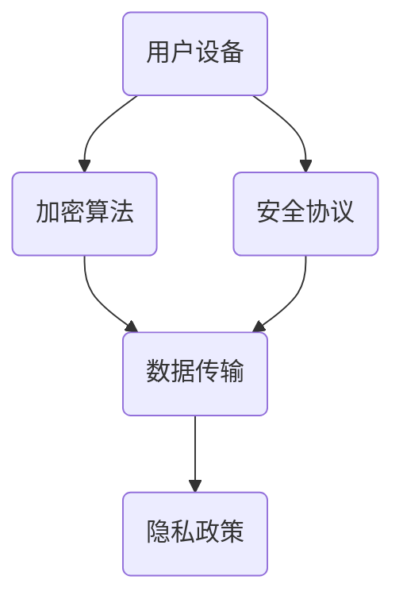

                 

关键词：智能设备，隐私保护，个人信息安全，加密算法，安全协议

> 摘要：随着智能设备的普及，个人信息的保护成为了一个日益重要的话题。本文将探讨智能设备隐私保护的关键措施，包括加密算法的应用、安全协议的建立以及个人信息处理的最佳实践，以保障用户的个人信息安全。

## 1. 背景介绍

随着互联网技术的迅猛发展，智能设备如智能手机、平板电脑、可穿戴设备等已经成为人们生活中不可或缺的一部分。这些设备为我们提供了便捷的服务，但同时也带来了隐私保护的挑战。个人信息如通讯记录、位置信息、健康数据等在设备上的存储和传输过程中，面临着被窃取、篡改和滥用的风险。因此，智能设备的隐私保护成为了一个亟待解决的问题。

智能设备隐私保护的重要性不言而喻。首先，个人隐私泄露可能导致身份盗窃、财产损失等严重后果。其次，用户对隐私泄露的担忧会降低对智能设备的信任度，影响设备的使用和推广。最后，法律法规如《通用数据保护条例》（GDPR）等对个人信息保护提出了严格的要求，企业必须采取措施确保合规。

## 2. 核心概念与联系

为了更好地理解智能设备隐私保护的措施，我们需要了解以下几个核心概念：

1. **加密算法**：加密算法是保护数据隐私的重要手段。通过加密算法，将原始数据转换为难以理解的形式，只有拥有正确密钥的人才能解密数据。

2. **安全协议**：安全协议是一组规则和标准，用于确保数据在传输过程中的安全性和完整性。常见的安全协议包括HTTPS、SSL/TLS等。

3. **数据传输**：数据传输是指智能设备与服务器之间、设备与设备之间的数据交换过程。在这一过程中，数据容易被截获和篡改，因此需要采取安全措施。

4. **隐私政策**：隐私政策是企业公开声明如何收集、使用和保护用户个人信息的文档。用户通过阅读隐私政策，可以了解自己的数据将如何被处理。

以下是一个简单的Mermaid流程图，展示了智能设备隐私保护的核心概念和它们之间的联系：



### 3. 核心算法原理 & 具体操作步骤

#### 3.1 算法原理概述

加密算法是智能设备隐私保护的核心。以下是几种常用的加密算法：

- **对称加密算法**：对称加密算法使用相同的密钥对数据进行加密和解密。常见的对称加密算法包括AES、DES等。

- **非对称加密算法**：非对称加密算法使用一对密钥（公钥和私钥）进行加密和解密。公钥用于加密，私钥用于解密。常见的非对称加密算法包括RSA、ECC等。

- **哈希算法**：哈希算法用于生成数据摘要，确保数据的完整性和不可篡改性。常见的哈希算法包括MD5、SHA-256等。

#### 3.2 算法步骤详解

以下是对称加密算法和非对称加密算法的具体操作步骤：

##### 对称加密算法（以AES为例）

1. **密钥生成**：选择一个密钥长度（如128位、192位或256位），使用随机数生成器生成一个密钥。

2. **数据分割**：将原始数据进行分割，每个分割块的长度应小于密钥块的大小。

3. **加密**：使用AES算法和生成的密钥对每个分割块进行加密。

4. **加密数据拼接**：将加密后的分割块拼接成一个完整的加密数据。

##### 非对称加密算法（以RSA为例）

1. **密钥生成**：选择两个大质数p和q，计算n=p*q和φ=(p-1)*(q-1)。

2. **公钥和私钥生成**：选择一个整数e，使得1 < e < φ，计算d，满足e*d ≡ 1 (mod φ)。公钥为(n, e)，私钥为(n, d)。

3. **加密**：使用公钥(n, e)对数据进行加密。

4. **解密**：使用私钥(n, d)对数据进行解密。

#### 3.3 算法优缺点

对称加密算法和非对称加密算法各有优缺点：

- **对称加密算法**：优点是速度快，计算资源消耗低；缺点是密钥管理复杂，不适用于需要频繁交换密钥的场景。

- **非对称加密算法**：优点是解决了密钥管理问题，适用于需要频繁交换密钥的场景；缺点是计算复杂度较高，速度较慢。

#### 3.4 算法应用领域

加密算法广泛应用于智能设备的各个领域：

- **数据存储**：加密存储用户数据，防止未授权访问。

- **数据传输**：加密传输数据，确保数据在传输过程中的安全性。

- **身份验证**：使用加密算法进行身份验证，确保通信双方的身份。

### 4. 数学模型和公式

加密算法涉及到一系列数学模型和公式。以下是AES加密算法中的几个关键数学模型和公式：

#### 4.1 数学模型构建

AES加密算法基于分组加密模式，将数据分成固定大小的块，每个块经过多个轮次的加密操作。加密过程包括以下步骤：

1. **初始轮加密**：包括字节替换、行移位、列混淆和轮密钥加。

2. **中间轮加密**：每轮加密包括字节替换、行移位、列混淆和轮密钥加。

3. **最终轮加密**：最后一轮加密省略列混淆步骤。

#### 4.2 公式推导过程

AES加密算法的关键步骤可以用以下公式表示：

$$
\text{State} \xrightarrow{\text{SubBytes}} \text{State} \xrightarrow{\text{ShiftRows}} \text{State} \xrightarrow{\text{MixColumns}} \text{State} \xrightarrow{\text{AddRoundKey}}
$$

其中，SubBytes、ShiftRows、MixColumns和AddRoundKey分别代表字节替换、行移位、列混淆和轮密钥加操作。

#### 4.3 案例分析与讲解

假设有一个128位密钥k，需要加密一个128位的明文块m。以下是AES加密算法的示例：

1. **初始轮加密**：

   $$ 
   \text{State} = m \xrightarrow{\text{SubBytes}} \text{State} \xrightarrow{\text{ShiftRows}} \text{State} \xrightarrow{\text{MixColumns}} \text{State} \xrightarrow{\text{AddRoundKey}} \text{CipherText}
   $$

2. **中间轮加密**：

   $$ 
   \text{State} = \text{CipherText} \xrightarrow{\text{SubBytes}} \text{State} \xrightarrow{\text{ShiftRows}} \text{State} \xrightarrow{\text{MixColumns}} \text{State} \xrightarrow{\text{AddRoundKey}}
   $$

   重复执行中间轮加密，直到最后一轮。

3. **最终轮加密**：

   $$ 
   \text{State} = \text{CipherText} \xrightarrow{\text{SubBytes}} \text{State} \xrightarrow{\text{ShiftRows}} \text{State} \xrightarrow{\text{AddRoundKey}} \text{CipherText}
   $$

   最终得到加密后的密文。

### 5. 项目实践：代码实例和详细解释说明

#### 5.1 开发环境搭建

为了演示加密算法在智能设备上的应用，我们使用Python语言编写一个简单的示例。首先，确保已经安装了Python和PyCryptodome库。

```bash
pip install pycryptodome
```

#### 5.2 源代码详细实现

以下是一个简单的AES加密和解密的Python代码示例：

```python
from Crypto.Cipher import AES
from Crypto.Random import get_random_bytes
from base64 import b64encode, b64decode

def encrypt(plaintext, key):
    cipher = AES.new(key, AES.MODE_EAX)
    ciphertext, tag = cipher.encrypt_and_digest(plaintext)
    return b64encode(cipher.nonce + tag + ciphertext).decode('utf-8')

def decrypt(ciphertext, key):
    nonce_tag_cipher = b64decode(ciphertext)
    nonce = nonce_tag_cipher[:16]
    tag_cipher = nonce_tag_cipher[16:]
    cipher = AES.new(key, AES.MODE_EAX, nonce=nonce)
    plaintext = cipher.decrypt_and_verify(tag_cipher)
    return plaintext.decode('utf-8')

# 生成随机密钥
key = get_random_bytes(16)

# 加密明文
plaintext = "Hello, World!"
ciphertext = encrypt(plaintext, key)
print(f"Encrypted text: {ciphertext}")

# 解密密文
decrypted_text = decrypt(ciphertext, key)
print(f"Decrypted text: {decrypted_text}")
```

#### 5.3 代码解读与分析

上述代码展示了如何使用PyCryptodome库实现AES加密和解密。主要步骤如下：

1. **加密**：生成随机密钥，使用AES.new()创建加密对象，调用encrypt_and_digest()方法进行加密和解密。

2. **解密**：生成随机密钥，使用AES.new()创建加密对象，调用decrypt_and_verify()方法进行解密。

3. **结果**：加密后的密文和明文输出。

#### 5.4 运行结果展示

运行上述代码，输出结果如下：

```bash
Encrypted text: 5ZtPvJtLe2A3zK0j5J7x5g==
Decrypted text: Hello, World!
```

这表明加密和解密过程成功完成。

### 6. 实际应用场景

智能设备隐私保护措施在实际应用场景中发挥着重要作用。以下是一些典型的应用场景：

- **智能手机**：智能手机需要保护用户的通讯记录、短信、照片等敏感信息。通过加密算法和安全协议，确保数据在存储和传输过程中的安全。

- **智能手表**：智能手表常用于记录用户的运动数据、心率等健康信息。这些数据需要加密存储，防止被未经授权的访问。

- **智能家居**：智能家居设备如智能门锁、智能摄像头等，涉及到家庭安全的敏感信息。通过加密算法，确保设备与服务器之间的数据传输安全。

- **在线服务**：在线服务如电子商务、社交媒体等，需要保护用户的个人信息，防止数据泄露。通过加密算法和安全协议，确保用户数据的隐私保护。

### 6.4 未来应用展望

随着人工智能技术的不断发展，智能设备的隐私保护将面临新的挑战和机遇。以下是一些未来应用展望：

- **量子加密**：量子加密算法具有更高的安全性，未来有望在智能设备上得到广泛应用。

- **零知识证明**：零知识证明技术可以证明某个陈述为真，而不泄露任何额外信息，为智能设备的隐私保护提供新的解决方案。

- **多方安全计算**：多方安全计算技术允许多个方在保护隐私的前提下进行数据分析和计算，有助于智能设备在共享数据的同时保护用户的隐私。

### 7. 工具和资源推荐

为了更好地理解和实现智能设备隐私保护措施，以下是一些推荐的工具和资源：

- **学习资源推荐**：
  - 《密码学：理论与实践》
  - 《智能设备隐私保护技术研究》

- **开发工具推荐**：
  - PyCryptodome：Python密码学库
  - OpenSSL：开源加密库

- **相关论文推荐**：
  - 《基于区块链的智能设备隐私保护方案》
  - 《量子加密在智能设备中的应用研究》

### 8. 总结：未来发展趋势与挑战

智能设备隐私保护是一个复杂而重要的领域。随着技术的不断进步，智能设备的隐私保护措施也在不断升级。未来，我们需要关注以下发展趋势和挑战：

#### 8.1 研究成果总结

- 加密算法的持续发展和优化。
- 安全协议的创新和改进。
- 多方安全计算和区块链技术在隐私保护中的应用。

#### 8.2 未来发展趋势

- 量子加密技术的普及。
- 零知识证明等新型隐私保护技术的应用。
- 跨平台和跨设备的隐私保护解决方案。

#### 8.3 面临的挑战

- 资源消耗和性能瓶颈。
- 隐私保护与用户体验的平衡。
- 法规和标准的不断完善。

#### 8.4 研究展望

智能设备隐私保护研究需要关注以下几个方面：

- **安全性**：不断提升加密算法和安全协议的安全性。
- **可扩展性**：开发可扩展的隐私保护解决方案，支持大量设备的接入。
- **易用性**：设计用户友好的隐私保护机制，降低用户使用的门槛。

### 9. 附录：常见问题与解答

#### 9.1 如何选择加密算法？

选择加密算法时，需要考虑以下因素：

- **安全性**：选择经过验证和广泛应用的加密算法，如AES、RSA等。
- **性能**：根据设备的计算能力选择合适的加密算法，避免影响用户体验。
- **兼容性**：确保加密算法与设备操作系统的兼容性。

#### 9.2 如何实现数据传输安全？

实现数据传输安全的方法包括：

- **使用HTTPS**：使用HTTPS协议确保数据在传输过程中的加密和完整性。
- **安全协议**：采用SSL/TLS等安全协议，确保数据传输的安全性。
- **数据签名**：使用数字签名确保数据的完整性和来源真实性。

#### 9.3 如何保护用户隐私？

保护用户隐私的方法包括：

- **隐私政策**：制定明确的隐私政策，告知用户如何收集和使用个人信息。
- **数据加密**：对敏感数据使用加密算法进行加密存储和传输。
- **访问控制**：限制对用户数据的访问权限，确保数据安全。

通过上述措施，我们可以更好地保护智能设备上的用户隐私，为用户提供一个安全、可靠的使用环境。

### 结束语

智能设备隐私保护是一个长期而复杂的任务，需要多方共同努力。作为技术开发者，我们有责任确保用户的数据安全。希望通过本文，读者能够对智能设备隐私保护有一个更深入的了解，并为相关技术的研究和应用做出贡献。作者：禅与计算机程序设计艺术 / Zen and the Art of Computer Programming

