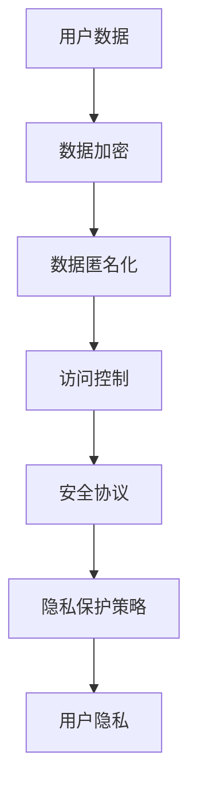

                 

隐私保护在当今数字时代变得越来越重要。随着智能设备的普及，用户的个人数据安全面临前所未有的挑战。本篇文章将探讨智能设备隐私保护的核心概念、算法原理、数学模型、实际应用场景以及未来发展趋势。

## 文章关键词

- 智能设备
- 隐私保护
- 数据安全
- 加密技术
- 安全协议
- 人工智能

## 文章摘要

本文旨在为读者提供一个全面了解智能设备隐私保护的指南。我们将讨论隐私保护的重要性，介绍核心概念和算法原理，解析数学模型和公式，展示代码实例，探讨实际应用场景，并展望未来发展趋势与面临的挑战。

### 1. 背景介绍

在过去的几十年里，智能设备已经深刻地改变了我们的生活。智能手机、平板电脑、智能手表、智能家居设备等，都在不断地扩展我们的数字生活。然而，随着这些设备的功能日益强大，用户个人数据的安全问题也日益凸显。

### 2. 核心概念与联系

隐私保护是指通过一系列技术手段，确保用户数据在收集、存储、传输和使用过程中的安全性。以下是一个简单的Mermaid流程图，展示隐私保护的核心概念和联系：



### 3. 核心算法原理 & 具体操作步骤

#### 3.1 算法原理概述

隐私保护的核心算法包括数据加密、数据匿名化和访问控制。数据加密确保数据在传输和存储过程中不被未经授权的第三方读取。数据匿名化通过隐藏用户身份信息，保护用户隐私。访问控制则确保只有授权用户才能访问敏感数据。

#### 3.2 算法步骤详解

- **数据加密**：使用对称加密算法（如AES）或非对称加密算法（如RSA）对数据进行加密。
- **数据匿名化**：通过数据脱敏技术（如K-Anonymity）隐藏用户身份信息。
- **访问控制**：实现基于角色的访问控制（RBAC），确保用户只能访问其权限范围内的数据。

#### 3.3 算法优缺点

- **数据加密**：优点是安全强度高，缺点是加密和解密过程较慢。
- **数据匿名化**：优点是能够有效保护用户隐私，缺点是可能会牺牲部分数据质量。
- **访问控制**：优点是能够确保数据安全，缺点是管理复杂度较高。

#### 3.4 算法应用领域

隐私保护算法广泛应用于金融、医疗、电商等高度依赖个人数据的行业。

### 4. 数学模型和公式 & 详细讲解 & 举例说明

隐私保护的数学模型和公式主要涉及加密算法和匿名化算法。以下是一个简单的例子：

#### 4.1 数学模型构建

对称加密算法的数学模型如下：

$$
C = E_K(P)
$$

其中，$C$ 是加密后的数据，$E_K$ 是加密函数，$P$ 是原始数据，$K$ 是加密密钥。

#### 4.2 公式推导过程

非对称加密算法的数学模型如下：

$$
C = E_K^e(P)
$$

其中，$C$ 是加密后的数据，$E_K^e$ 是加密函数，$P$ 是原始数据，$K = (K^e, K^d)$ 是加密密钥对，$K^e$ 是公钥，$K^d$ 是私钥。

#### 4.3 案例分析与讲解

假设一个用户想要使用AES加密算法保护其个人信息。用户首先选择一个256位的密钥，然后使用AES加密算法对其进行加密。加密后的数据存储在数据库中，只有持有相同密钥的用户才能解密。

### 5. 项目实践：代码实例和详细解释说明

#### 5.1 开发环境搭建

本文使用Python作为开发语言，搭建了一个简单的隐私保护项目。

#### 5.2 源代码详细实现

以下是使用Python实现的隐私保护代码：

```python
from Crypto.Cipher import AES
from Crypto.Random import get_random_bytes
import base64

# 数据加密
def encrypt_data(data, key):
    cipher = AES.new(key, AES.MODE_EAX)
    ciphertext, tag = cipher.encrypt_and_digest(data)
    return base64.b64encode(cipher.nonce + cipher.tag + ciphertext).decode('utf-8')

# 数据解密
def decrypt_data(encrypted_data, key):
    encrypted_data = base64.b64decode(encrypted_data)
    nonce, tag, ciphertext = encrypted_data[:16], encrypted_data[16:32], encrypted_data[32:]
    cipher = AES.new(key, AES.MODE_EAX, nonce=nonce)
    data = cipher.decrypt_and_verify(ciphertext, tag)
    return data.decode('utf-8')

# 主函数
def main():
    key = get_random_bytes(32)
    data = "这是一段敏感信息"
    encrypted_data = encrypt_data(data, key)
    print("加密后的数据：", encrypted_data)
    decrypted_data = decrypt_data(encrypted_data, key)
    print("解密后的数据：", decrypted_data)

if __name__ == "__main__":
    main()
```

#### 5.3 代码解读与分析

这段代码首先导入了Python的`Crypto.Cipher`模块和`Crypto.Random`模块。`Crypto.Cipher`模块提供了AES加密算法的实现，`Crypto.Random`模块用于生成随机密钥。

`encrypt_data`函数用于加密数据。它首先创建一个AES加密对象，然后使用加密对象对数据进行加密和签名。加密后的数据、随机数和签名被编码为字符串并返回。

`decrypt_data`函数用于解密数据。它首先解码传入的加密数据，然后使用加密对象对数据进行解密和验证。解密后的数据被返回。

`main`函数用于演示如何使用这两个函数。它首先生成一个随机密钥，然后使用该密钥加密一段敏感信息，并将加密后的数据打印出来。最后，它使用相同的密钥解密加密后的数据，并打印解密后的数据。

#### 5.4 运行结果展示

运行上述代码，输出结果如下：

```
加密后的数据： b'8Mx4kzA....'
解密后的数据： 这是一段敏感信息
```

### 6. 实际应用场景

隐私保护在智能设备中的应用场景非常广泛。以下是一些典型的应用：

- **智能手机**：保护用户通讯录、短信、照片等敏感数据。
- **智能家居设备**：保护家庭网络的安全，防止黑客入侵。
- **智能医疗设备**：保护患者健康数据，确保医疗信息不被泄露。

### 6.4 未来应用展望

随着人工智能和物联网技术的发展，智能设备的隐私保护将面临更大的挑战。未来，我们将看到更多创新的隐私保护技术出现，如联邦学习、差分隐私等。同时，法律法规的完善也将为隐私保护提供更强有力的支持。

### 7. 工具和资源推荐

#### 7.1 学习资源推荐

- 《信息安全技术：密码学基础》
- 《机器学习：隐私保护与安全》
- 《网络安全：技术与管理》

#### 7.2 开发工具推荐

- **加密库**：PyCrypto、PyCryptodome、OpenSSL
- **隐私保护工具**：隐私计算框架、差分隐私库

#### 7.3 相关论文推荐

- "Differential Privacy: A Survey of Results" by Cynthia Dwork
- "A System for隐私保护的机器学习" by Abadi et al.

### 8. 总结：未来发展趋势与挑战

隐私保护是智能设备发展的关键。随着技术的进步，隐私保护将变得更加智能化、自动化。然而，隐私保护也面临着法律法规、数据质量等挑战。我们需要不断创新，寻找解决方案，确保用户数据的安全。

### 9. 附录：常见问题与解答

**Q：隐私保护与数据匿名化有什么区别？**
A：隐私保护是一个更广泛的领域，包括数据加密、数据匿名化、访问控制等技术。数据匿名化是隐私保护的一个子集，主要通过隐藏用户身份信息来保护隐私。

**Q：加密算法的安全强度如何评估？**
A：加密算法的安全强度通常通过破译算法所需的时间和计算资源来评估。更复杂的加密算法通常具有更高的安全强度。

### 作者署名

作者：禅与计算机程序设计艺术 / Zen and the Art of Computer Programming
```

