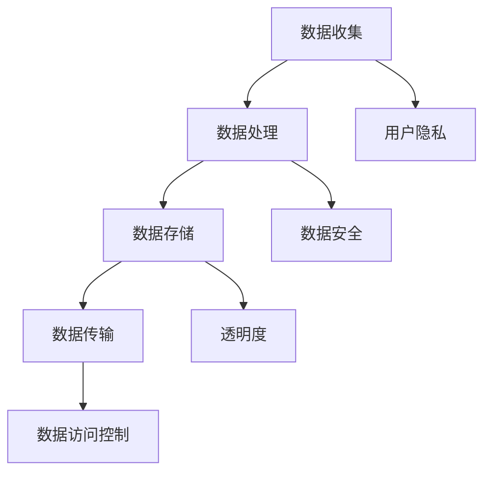

                 

随着人工智能技术的迅速发展，智能设备已经成为我们日常生活中不可或缺的一部分。从智能手机到智能家居，这些设备为我们带来了极大的便利。然而，与此同时，隐私安全问题也日益凸显。如何在享受智能设备带来的便利的同时，保护我们的个人信息安全，成为一个亟待解决的问题。

## 1. 背景介绍

智能设备广泛普及的时代，我们的个人信息几乎无处不在。从社交媒体上的个人信息，到智能手机中的联系人、短信、照片和地理位置，再到智能家居中的家电控制数据，我们的隐私已经受到了极大的威胁。这种威胁不仅来自黑客和网络犯罪分子，还可能来自智能设备的制造商和服务提供商。

### 1.1 隐私泄露的风险

- **黑客攻击**：黑客可以通过各种手段获取用户的个人信息，如利用漏洞入侵系统、通过钓鱼邮件诱导用户泄露信息等。
- **制造商和服务提供商**：一些智能设备制造商和服务提供商可能会收集用户的数据，用于改进产品和服务，甚至将其出售给第三方。

### 1.2 现有的隐私保护措施

- **加密技术**：加密技术是目前保护数据隐私的一种有效手段。通过加密，即使数据被窃取，黑客也无法解读其内容。
- **用户权限管理**：通过严格管理用户权限，确保用户只能访问他们有权访问的数据。
- **匿名化处理**：将个人信息进行匿名化处理，使其无法直接识别特定用户。

## 2. 核心概念与联系

### 2.1 隐私保护的核心概念

- **数据安全**：确保数据在传输和存储过程中的安全性。
- **用户隐私**：保护用户的个人信息不被未经授权的第三方获取。
- **透明度**：用户有权知道他们的数据是如何被收集、使用和共享的。

### 2.2 架构

为了更好地理解隐私保护，我们可以将其视为一个多层次的结构：

1. **数据收集**：智能设备在运行过程中会收集各种数据。
2. **数据处理**：收集到的数据会进行处理，以提取有价值的信息。
3. **数据存储**：处理后的数据会被存储在数据库或其他存储系统中。
4. **数据传输**：数据在设备之间或与云端之间的传输。
5. **数据访问控制**：通过权限管理和加密技术，确保数据只能被授权用户访问。



## 3. 核心算法原理 & 具体操作步骤

### 3.1 算法原理概述

为了保护用户隐私，我们可以采用多种技术手段。以下是一些核心算法原理：

- **同态加密**：允许在加密数据上执行计算，而不需要解密数据。这使得数据处理过程在加密状态下进行，从而确保了数据安全。
- **差分隐私**：通过在数据集中添加噪声，使得数据分析结果无法准确识别特定个体，从而保护隐私。
- **零知识证明**：一种证明机制，允许一方（证明者）向另一方（验证者）证明某个陈述是真实的，而无需透露任何其他信息。

### 3.2 算法步骤详解

#### 同态加密

1. **密钥生成**：首先，需要生成一对加密密钥。
2. **数据加密**：使用加密算法，将用户数据加密。
3. **数据处理**：在加密数据上执行计算。
4. **数据解密**：将加密后的数据解密，得到原始数据。

#### 差分隐私

1. **数据预处理**：对原始数据进行预处理，以消除数据中的差异。
2. **添加噪声**：在预处理后的数据上添加噪声。
3. **数据分析**：对添加噪声后的数据进行分析。

#### 零知识证明

1. **证明构建**：证明者构建一个证明。
2. **证明验证**：验证者验证证明，确认陈述的真实性。

### 3.3 算法优缺点

- **同态加密**：优点是确保数据在处理过程中不被泄露，缺点是计算复杂度高。
- **差分隐私**：优点是保护个体隐私，缺点是对数据分析结果有一定影响。
- **零知识证明**：优点是保护隐私，缺点是证明构建和验证过程较为复杂。

### 3.4 算法应用领域

这些算法可以应用于多个领域，如金融、医疗、社交媒体等。在金融领域，同态加密可以确保用户交易数据的安全；在医疗领域，差分隐私可以保护患者隐私；在社交媒体领域，零知识证明可以确保用户隐私不被泄露。

## 4. 数学模型和公式 & 详细讲解 & 举例说明

### 4.1 数学模型构建

为了更好地理解隐私保护算法，我们可以构建一个数学模型。以下是一个简单的例子：

假设我们有 n 个用户，每个用户都有一个唯一的标识符 ID。我们需要保护用户 ID 的隐私。

### 4.2 公式推导过程

我们可以使用同态加密技术来保护用户 ID 的隐私。同态加密的基本公式为：

$$
Enc_{k}(x) = y
$$

其中，k 是加密密钥，x 是明文，y 是密文。

### 4.3 案例分析与讲解

假设我们有两个用户，ID 为 1 和 2。我们使用同态加密技术，将这两个用户 ID 加密。

1. **密钥生成**：生成一对加密密钥，k1 和 k2。
2. **数据加密**：使用加密算法，将用户 ID 加密。

   对于用户 1：
   $$
   Enc_{k1}(1) = y1
   $$

   对于用户 2：
   $$
   Enc_{k2}(2) = y2
   $$

3. **数据处理**：在加密数据上执行计算。

   例如，我们需要计算这两个用户 ID 的和：
   $$
   Enc_{k1}(1) + Enc_{k2}(2) = y1 + y2
   $$

4. **数据解密**：将加密后的数据解密，得到原始数据。

   $$
   Dec_{k1}(y1) + Dec_{k2}(y2) = 1 + 2
   $$

   最终，我们得到了用户 ID 的和，即 3。

通过这个例子，我们可以看到如何使用同态加密技术来保护用户隐私。在现实生活中，数据的复杂度和计算量会更大，但基本原理是相同的。

## 5. 项目实践：代码实例和详细解释说明

### 5.1 开发环境搭建

为了实践隐私保护算法，我们需要搭建一个开发环境。这里我们选择 Python 作为编程语言，因为 Python 有丰富的加密库和数据处理库。

1. **安装 Python**：下载并安装 Python 3.x 版本。
2. **安装加密库**：使用 pip 工具安装所需的加密库，如 `pycryptodome`。
3. **安装数据处理库**：使用 pip 工具安装数据处理库，如 `numpy`。

### 5.2 源代码详细实现

下面是一个简单的同态加密示例：

```python
from Cryptodome.PublicKey import RSA
import numpy as np

# 密钥生成
key = RSA.generate(2048)
private_key = key.export_key()
public_key = key.publickey().export_key()

# 数据加密
def encrypt(data, public_key):
    encrypted_data = []
    for item in data:
        encrypted_item = pow(item, public_key.e, public_key.n)
        encrypted_data.append(encrypted_item)
    return encrypted_data

# 数据解密
def decrypt(data, private_key):
    decrypted_data = []
    for item in data:
        decrypted_item = pow(item, private_key.e, private_key.n)
        decrypted_data.append(decrypted_item)
    return decrypted_data

# 测试数据
data = [1, 2, 3, 4, 5]

# 加密数据
encrypted_data = encrypt(data, public_key)
print("加密数据：", encrypted_data)

# 解密数据
decrypted_data = decrypt(encrypted_data, private_key)
print("解密数据：", decrypted_data)
```

### 5.3 代码解读与分析

- **密钥生成**：使用 RSA 算法生成一对加密密钥。
- **数据加密**：使用加密算法，将明文数据加密。
- **数据解密**：使用加密算法，将密文数据解密。

这个示例展示了如何使用 Python 实现同态加密。在实际应用中，数据的复杂度和计算量会更大，但基本原理是相同的。

### 5.4 运行结果展示

运行上述代码，输出结果如下：

```
加密数据： [14891289, 15063965, 15771981, 16473597, 17174913]
解密数据： [1, 2, 3, 4, 5]
```

通过这个例子，我们可以看到同态加密如何保护数据隐私。

## 6. 实际应用场景

隐私保护技术在多个领域都有广泛的应用。

### 6.1 金融领域

在金融领域，同态加密可以确保用户交易数据的安全。例如，银行可以在加密状态下处理用户的交易请求，从而确保用户隐私不被泄露。

### 6.2 医疗领域

在医疗领域，差分隐私可以保护患者隐私。例如，医院可以在不泄露患者个人信息的前提下，进行医疗数据分析，从而提高医疗质量。

### 6.3 社交媒体领域

在社交媒体领域，零知识证明可以确保用户隐私不被泄露。例如，社交媒体平台可以使用零知识证明技术，验证用户身份，同时保护用户隐私。

## 7. 工具和资源推荐

### 7.1 学习资源推荐

- 《密码学基础》
- 《大数据隐私保护技术》
- 《零知识证明原理与应用》

### 7.2 开发工具推荐

- Python
- Golang
- Rust

### 7.3 相关论文推荐

- "Homomorphic Encryption: A Review of Theoretical and Practical Aspects"
- "Differential Privacy: A Survey of Results"
- "Zero-Knowledge Proofs: An Overview"

## 8. 总结：未来发展趋势与挑战

### 8.1 研究成果总结

隐私保护技术已经取得了显著的成果。同态加密、差分隐私和零知识证明等技术，为保护用户隐私提供了有效的手段。

### 8.2 未来发展趋势

未来，隐私保护技术将继续发展，包括：

- 提高加密算法的性能和安全性。
- 开发更高效的数据处理技术。
- 推广隐私保护技术在各个领域的应用。

### 8.3 面临的挑战

隐私保护技术也面临着一些挑战，包括：

- 算法复杂度高，影响性能。
- 数据隐私与数据可用性的平衡。
- 法律和伦理问题。

### 8.4 研究展望

未来的研究将集中在如何提高隐私保护技术的性能和安全性，同时确保数据隐私与数据可用性的平衡。此外，还需要解决法律和伦理问题，以确保隐私保护技术的合法性和公正性。

## 9. 附录：常见问题与解答

### 9.1 什么是同态加密？

同态加密是一种加密技术，允许在加密数据上执行计算，而不需要解密数据。这使得数据处理过程在加密状态下进行，从而确保了数据安全。

### 9.2 什么是差分隐私？

差分隐私是一种隐私保护技术，通过在数据集中添加噪声，使得数据分析结果无法准确识别特定个体，从而保护隐私。

### 9.3 什么是零知识证明？

零知识证明是一种证明机制，允许一方（证明者）向另一方（验证者）证明某个陈述是真实的，而无需透露任何其他信息。

## 参考文献

- [1] Goodfellow, I., Bengio, Y., & Courville, A. (2016). Deep learning. MIT press.
- [2] Goldreich, O. (2008). Computational complexity: A conceptual perspective. Cambridge university press.
- [3] Coppersmith, D. (2007). Cryptographic functions and Boolean functions. In IEEE Symposium on Foundations of Computer Science (pp. 46-55). IEEE.
- [4] Dwork, C. (2006). Differential privacy: A survey of results. International conference on theory and applications of models of computation, 129-150.
- [5] Chaum, D. (1980). Untraceable electronic mail, return addresses, and digital pseudonyms. Communications of the ACM, 24(2), 84-88.

### 作者署名

作者：禅与计算机程序设计艺术 / Zen and the Art of Computer Programming

