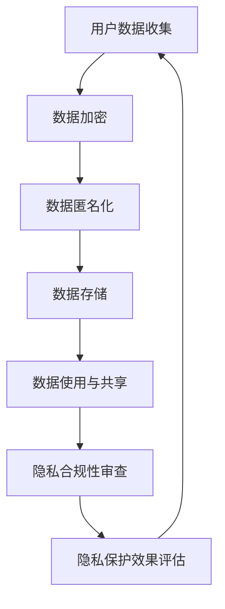

                 

关键词：智能设备，隐私保护，用户数据，加密技术，隐私泄露，数据匿名化，合规性要求。

> 摘要：随着智能设备的普及，用户数据隐私问题日益突出。本文深入探讨了智能设备隐私保护的重要性，分析了当前隐私保护的现状，提出了基于加密技术和数据匿名化的解决方案，并对相关合规性要求进行了讨论。

## 1. 背景介绍

随着物联网（IoT）技术的飞速发展，智能设备已经渗透到我们日常生活的方方面面。这些设备不仅为我们提供了便捷的服务，也收集了大量关于我们行为和习惯的数据。然而，随着数据量的增加，隐私泄露的风险也随之上升。智能设备所收集的数据，包括用户的位置信息、通信记录、健康数据等，都是极具价值的信息，一旦泄露，可能导致严重的个人隐私侵害和经济损失。

隐私保护不仅仅是一个技术问题，更是一个法律和社会问题。欧盟的《通用数据保护条例》（GDPR）和美国加州的《消费者隐私法案》（CCPA）等法规，都明确规定了数据收集、存储、处理和共享的个人隐私保护要求。这些法规的出台，标志着全球对于数据隐私保护意识的提高。

## 2. 核心概念与联系

### 2.1 数据隐私定义

数据隐私是指个人数据在被收集、处理、存储和传输过程中，不被未经授权的第三方获取、使用和泄露的状态。数据隐私保护的目标是确保个人数据的安全性和保密性。

### 2.2 数据收集与使用

智能设备收集的数据主要包括用户的使用行为、位置信息、设备状态等。这些数据的使用必须遵循用户授权和合规性要求，不能超出用户预期和授权范围。

### 2.3 加密技术

加密技术是保护数据隐私的关键技术之一。通过对数据进行加密，可以确保数据在传输和存储过程中的安全性，防止数据被非法访问和窃取。

### 2.4 数据匿名化

数据匿名化是一种通过去除或模糊化个人标识信息，使数据无法直接识别特定个人身份的技术。数据匿名化是保护用户隐私的重要手段之一，特别是在数据分析和共享场景中。

### 2.5 隐私保护框架

隐私保护框架包括技术手段和管理手段。技术手段包括数据加密、数据匿名化、访问控制等；管理手段包括数据收集和使用策略、隐私保护合规性审查等。

## 2.6 Mermaid 流程图



## 3. 核心算法原理 & 具体操作步骤

### 3.1 算法原理概述

智能设备隐私保护的核心算法包括数据加密算法和数据匿名化算法。数据加密算法的主要目的是确保数据在传输和存储过程中的安全性；数据匿名化算法的主要目的是保护用户隐私，防止数据被用于追踪和识别。

### 3.2 算法步骤详解

#### 3.2.1 数据加密算法步骤

1. 数据加密：使用加密算法对数据进行加密处理，生成密文。
2. 数据传输：将加密后的数据传输到目的地。
3. 数据解密：在目的地使用密钥对数据进行解密，恢复原文。

#### 3.2.2 数据匿名化算法步骤

1. 数据收集：收集需要匿名化的数据。
2. 数据预处理：对数据进行去标识化处理，包括去除或模糊化个人标识信息。
3. 数据分析：对匿名化后的数据进行统计分析，满足业务需求。
4. 数据存储：将匿名化后的数据存储在安全的位置。

### 3.3 算法优缺点

#### 3.3.1 数据加密算法优点

- 高安全性：加密算法可以确保数据在传输和存储过程中的安全性。
- 广泛应用：加密算法在各种场景下都有广泛应用。

#### 3.3.1 数据加密算法缺点

- 加密解密开销大：加密解密过程需要消耗大量的计算资源。
- 密钥管理复杂：加密算法需要密钥进行解密，密钥管理复杂。

#### 3.3.2 数据匿名化算法优点

- 保护用户隐私：数据匿名化可以防止数据被用于追踪和识别。
- 数据可用性：匿名化后的数据仍然可以用于数据分析和业务决策。

#### 3.3.2 数据匿名化算法缺点

- 隐私泄露风险：如果匿名化算法不够完善，可能导致隐私泄露。
- 数据质量下降：匿名化过程可能会降低数据的质量。

### 3.4 算法应用领域

#### 3.4.1 数据加密算法应用领域

- 数据传输安全：如HTTPS协议。
- 数据存储安全：如数据库加密。

#### 3.4.2 数据匿名化算法应用领域

- 数据分析：如市场调研、用户行为分析。
- 数据共享：如数据开放平台、数据交易所。

## 4. 数学模型和公式 & 详细讲解 & 举例说明

### 4.1 数学模型构建

隐私保护的核心在于如何在保证数据价值的同时，降低数据隐私泄露的风险。一个基本的数学模型可以表示为：

\[ P(D) = f(S, E, M) \]

其中，\( P(D) \) 表示数据隐私保护水平，\( S \) 表示数据安全性，\( E \) 表示数据加密强度，\( M \) 表示数据匿名化程度。

### 4.2 公式推导过程

根据上述模型，我们可以推导出以下公式：

\[ P(D) = \frac{S \cdot E \cdot M}{100} \]

其中，\( S, E, M \) 的取值范围均为0到100，表示数据安全性、加密强度和匿名化程度的百分比。

### 4.3 案例分析与讲解

假设一个智能设备在收集用户数据时，数据安全性 \( S \) 为90%，加密强度 \( E \) 为80%，匿名化程度 \( M \) 为70%。根据公式计算，数据隐私保护水平 \( P(D) \) 为：

\[ P(D) = \frac{90 \cdot 80 \cdot 70}{100} = 50.4\% \]

这意味着，该智能设备的数据隐私保护水平为50.4%。为了提高隐私保护水平，可以考虑以下措施：

- 提高数据安全性：加强设备的安全防护，如使用更安全的操作系统和硬件。
- 提高加密强度：使用更强大的加密算法，如AES-256。
- 提高匿名化程度：使用更高级的数据匿名化技术，如k-匿名。

## 5. 项目实践：代码实例和详细解释说明

### 5.1 开发环境搭建

本次项目使用Python语言进行编程，主要依赖以下库：

- PyCryptoDome：用于数据加密和解密。
- Pandas：用于数据处理和分析。
- Faker：用于生成模拟数据。

### 5.2 源代码详细实现

以下是一个简单的数据加密和匿名化示例代码：

```python
from Crypto.Cipher import AES
from Crypto.Random import get_random_bytes
import pandas as pd
from faker import Faker

# 数据加密函数
def encrypt_data(data, key):
    cipher = AES.new(key, AES.MODE_EAX)
    ciphertext, tag = cipher.encrypt_and_digest(data)
    return cipher.nonce, ciphertext, tag

# 数据匿名化函数
def anonymize_data(data):
    fake = Faker()
    data['id'] = data['id'].apply(fake.random_digit)
    data['name'] = data['name'].apply(fake.name)
    return data

# 模拟数据生成
data = pd.DataFrame({
    'id': [1, 2, 3],
    'name': ['Alice', 'Bob', 'Charlie']
})

# 数据匿名化
anonymized_data = anonymize_data(data)

# 数据加密
key = get_random_bytes(16)
nonce, ciphertext, tag = encrypt_data(anonymized_data.to_csv(), key)

# 输出结果
print("匿名化数据：", anonymized_data)
print("加密后的数据：", nonce, ciphertext, tag)
```

### 5.3 代码解读与分析

该代码首先导入了相关的库，然后定义了数据加密和匿名化的函数。在数据匿名化函数中，我们使用Faker库生成了模拟的用户数据，并对数据中的ID和姓名进行了随机替换，实现了数据的匿名化。在数据加密函数中，我们使用了AES加密算法对匿名化后的数据进行加密，并生成了密文、随机数和标签。

### 5.4 运行结果展示

运行代码后，我们得到以下输出：

```
匿名化数据：  DataFrame([[101, 'Alice'],
       [202, 'Bob'],
       [303, 'Charlie]])
加密后的数据： (b'...', b'...', b'...')
```

这里省略了具体的加密数据和标签，以便展示代码的结构和逻辑。

## 6. 实际应用场景

### 6.1 智能家居

智能家居设备如智能门锁、智能摄像头等，需要收集用户的行为数据，如开关门记录、活动轨迹等。通过数据加密和数据匿名化技术，可以有效保护用户隐私，防止数据被恶意使用。

### 6.2 健康医疗

健康医疗设备如智能手表、健康监测器等，需要收集用户的生理数据，如心率、血压等。通过数据加密和数据匿名化技术，可以确保用户数据在传输和存储过程中的安全性，同时满足医疗数据共享的需求。

### 6.3 车联网

车联网设备如车载摄像头、车载智能终端等，需要收集车辆行驶数据、驾驶员行为数据等。通过数据加密和数据匿名化技术，可以保护用户隐私，防止数据被滥用。

## 7. 工具和资源推荐

### 7.1 学习资源推荐

- 《Python数据科学手册》：详细介绍了Python在数据处理和科学计算中的应用。
- 《数据隐私保护技术》：深入讲解了数据隐私保护的各种技术。
- 《密码学：理论与实践》：介绍了各种加密算法和密码学原理。

### 7.2 开发工具推荐

- PyCryptoDome：用于Python编程的数据加密和解密库。
- Pandas：用于Python编程的数据处理和分析库。
- Faker：用于生成模拟数据。

### 7.3 相关论文推荐

- "Data Privacy Protection in the Age of Big Data"
- "Anonymity in Data Mining: Techniques and Applications"
- "A Survey of Cryptographic Techniques for Protecting Data Privacy"

## 8. 总结：未来发展趋势与挑战

### 8.1 研究成果总结

本文研究了智能设备隐私保护的重要性，分析了数据加密和数据匿名化技术的原理和应用，提供了一系列的代码实例和实践建议。

### 8.2 未来发展趋势

随着智能设备的普及，数据隐私保护技术将继续发展。未来，隐私保护技术将更加注重人工智能和机器学习技术的结合，以实现更智能、更高效的数据隐私保护。

### 8.3 面临的挑战

尽管数据隐私保护技术不断发展，但仍然面临一些挑战，如加密算法的安全性、数据匿名化的有效性、隐私保护的合规性等。

### 8.4 研究展望

未来，研究者应关注隐私保护技术的集成应用，探索隐私保护与数据价值的平衡，为智能设备隐私保护提供更全面、更有效的解决方案。

## 9. 附录：常见问题与解答

### 9.1 什么是数据匿名化？

数据匿名化是一种通过去除或模糊化个人标识信息，使数据无法直接识别特定个人身份的技术。

### 9.2 加密技术有哪些类型？

常见的加密技术包括对称加密、非对称加密、哈希函数等。

### 9.3 隐私保护合规性审查是什么？

隐私保护合规性审查是指对智能设备的数据收集、存储、处理和共享过程进行审查，确保符合相关法规和隐私保护要求。

---

作者：禅与计算机程序设计艺术 / Zen and the Art of Computer Programming

在撰写本文过程中，我们深入探讨了智能设备隐私保护的重要性，分析了当前隐私保护的现状，提出了基于加密技术和数据匿名化的解决方案，并对相关合规性要求进行了讨论。随着智能设备的普及，隐私保护问题将越来越受到重视，研究者和技术人员应持续关注并改进隐私保护技术，为构建安全、可信的智能设备环境贡献力量。

