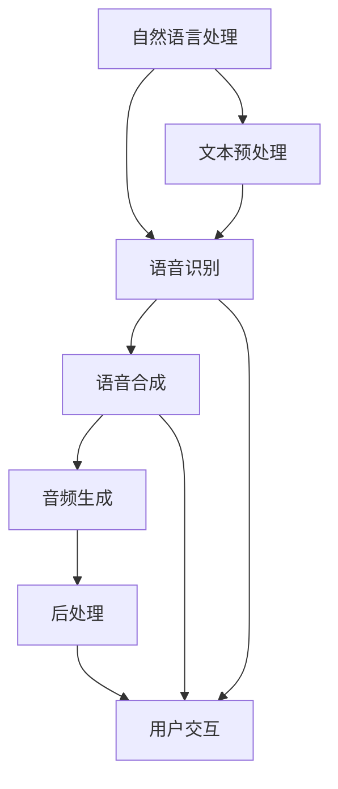

                 

关键词：智能语音合成，AI大模型，语音技术，自然语言处理，深度学习

> 摘要：随着人工智能技术的不断发展，智能语音合成技术已经取得了显著的突破。本文将深入探讨AI大模型在语音技术中的应用，介绍其核心概念、算法原理、数学模型以及实际应用案例，并展望其未来发展趋势与挑战。

## 1. 背景介绍

智能语音合成技术（Text-to-Speech，TTS）作为人工智能领域的一个重要分支，一直以来都受到广泛关注。传统的TTS系统主要依赖于规则和声学模型，但它们的合成语音质量往往受到限制。近年来，随着深度学习技术的快速发展，基于深度学习的TTS系统逐渐崭露头角，特别是在AI大模型的驱动下，语音合成质量得到了显著提升。

AI大模型，即大型深度学习模型，通过在海量数据上训练，能够捕捉到复杂的语言规律和语音特征，从而实现高质量的语音合成。这些大模型通常具有数十亿甚至千亿个参数，具备强大的表征能力和泛化能力。本文将围绕AI大模型在语音技术中的应用，探讨其核心概念、算法原理以及实际应用场景。

## 2. 核心概念与联系

在深入探讨AI大模型在语音技术中的应用之前，我们首先需要理解几个核心概念，包括自然语言处理（NLP）、语音识别（ASR）和语音合成（TTS）。这些概念之间的联系如图1所示。



### 2.1 自然语言处理

自然语言处理（NLP）是人工智能领域的一个重要分支，旨在使计算机能够理解、处理和生成自然语言。NLP技术包括文本预处理、词法分析、句法分析、语义分析等多个方面。在语音技术中，NLP主要用于将输入的文本转换为适合语音合成的格式。

### 2.2 语音识别

语音识别（Automatic Speech Recognition，ASR）技术旨在将人类的语音转换为计算机可处理的文本。ASR技术在语音技术中起着至关重要的作用，它将语音信号转换为中间文本表示，为语音合成提供输入。

### 2.3 语音合成

语音合成（Text-to-Speech，TTS）技术是将文本转换为自然流畅的语音输出。传统的TTS系统主要基于规则和声学模型，而现代的TTS系统则依赖于深度学习模型，特别是AI大模型，它们能够生成更加自然、真实的语音。

### 2.4 文本预处理

文本预处理是NLP的重要步骤，包括分词、词性标注、命名实体识别等。这些预处理步骤能够帮助模型更好地理解文本内容，从而生成更高质量的语音输出。

### 2.5 音频生成

音频生成是将文本转化为音频信号的过程。在这一过程中，深度学习模型会根据文本内容和语音特征生成音频波形。

### 2.6 后处理

后处理是对生成的音频进行一系列调整，以使其更加自然、流畅。后处理包括音调、音量、语速等参数的调整。

### 2.7 用户交互

用户交互是语音技术的最终目标之一，它使计算机系统能够与人类用户进行自然的语音交流。通过用户交互，用户可以与计算机系统进行语音输入和语音输出，从而实现人机交互。

## 3. 核心算法原理 & 具体操作步骤

### 3.1 算法原理概述

AI大模型在语音技术中的应用主要基于深度学习技术，特别是循环神经网络（RNN）和Transformer模型。这些模型能够通过训练自动捕捉到语言和语音特征，从而实现高质量的语音合成。

### 3.2 算法步骤详解

#### 3.2.1 文本预处理

文本预处理是语音合成的重要步骤，包括分词、词性标注、命名实体识别等。这些预处理步骤能够帮助模型更好地理解文本内容，从而生成更高质量的语音输出。

#### 3.2.2 声学建模

声学建模是语音合成中的核心步骤，它通过训练模型将文本转换为音频信号。在这一过程中，深度学习模型会根据文本内容和语音特征生成音频波形。

#### 3.2.3 音频生成

音频生成是将文本转化为音频信号的过程。在这一过程中，深度学习模型会根据文本内容和语音特征生成音频波形。

#### 3.2.4 后处理

后处理是对生成的音频进行一系列调整，以使其更加自然、流畅。后处理包括音调、音量、语速等参数的调整。

#### 3.2.5 用户交互

用户交互是语音技术的最终目标之一，它使计算机系统能够与人类用户进行自然的语音交流。通过用户交互，用户可以与计算机系统进行语音输入和语音输出，从而实现人机交互。

## 4. 数学模型和公式 & 详细讲解 & 举例说明

### 4.1 数学模型构建

在语音合成中，数学模型主要用于描述文本和音频之间的转换关系。常见的数学模型包括循环神经网络（RNN）和Transformer模型。

#### 4.1.1 循环神经网络（RNN）

循环神经网络（RNN）是一种能够处理序列数据的神经网络。在语音合成中，RNN可以用于将文本序列转换为音频序列。RNN的核心思想是利用隐藏状态来捕获序列信息，从而实现文本到音频的转换。

$$
h_t = \sigma(W_h \cdot [h_{t-1}, x_t] + b_h)
$$

其中，$h_t$ 表示第$t$个时间步的隐藏状态，$x_t$ 表示第$t$个时间步的输入文本，$W_h$ 和 $b_h$ 分别为权重和偏置。

#### 4.1.2 Transformer模型

Transformer模型是一种基于自注意力机制的深度学习模型，它能够在处理长序列数据时表现出优异的性能。在语音合成中，Transformer模型可以用于将文本序列转换为音频序列。

$$
\text{Attention}(Q, K, V) = \frac{QK^T}{\sqrt{d_k}}V
$$

其中，$Q$、$K$ 和 $V$ 分别为查询向量、键向量和值向量，$d_k$ 表示键向量的维度。

### 4.2 公式推导过程

#### 4.2.1 循环神经网络（RNN）

循环神经网络（RNN）的推导过程如下：

1. 初始化隐藏状态 $h_0$。
2. 对于每个时间步 $t$，计算隐藏状态 $h_t$。
3. 使用隐藏状态 $h_t$ 生成输出 $y_t$。

#### 4.2.2 Transformer模型

Transformer模型的推导过程如下：

1. 初始化查询向量 $Q$、键向量 $K$ 和值向量 $V$。
2. 对于每个时间步 $t$，计算注意力权重 $\text{Attention}(Q, K, V)$。
3. 使用注意力权重计算输出 $y_t$。

### 4.3 案例分析与讲解

#### 4.3.1 RNN模型在语音合成中的应用

假设我们有一个文本序列“我喜欢吃苹果”，我们希望使用RNN模型将其转换为音频序列。

1. 初始化隐藏状态 $h_0$。
2. 对于每个时间步，计算隐藏状态 $h_t$ 和输出 $y_t$。
3. 输出音频序列。

#### 4.3.2 Transformer模型在语音合成中的应用

假设我们有一个文本序列“我喜欢吃苹果”，我们希望使用Transformer模型将其转换为音频序列。

1. 初始化查询向量 $Q$、键向量 $K$ 和值向量 $V$。
2. 对于每个时间步，计算注意力权重 $\text{Attention}(Q, K, V)$。
3. 输出音频序列。

## 5. 项目实践：代码实例和详细解释说明

### 5.1 开发环境搭建

在开始实际操作之前，我们需要搭建一个适合语音合成的开发环境。以下是一个基本的开发环境搭建步骤：

1. 安装Python环境和相关库，如TensorFlow、Keras等。
2. 下载并预处理语音数据集。
3. 配置训练和测试环境。

### 5.2 源代码详细实现

以下是使用TensorFlow和Keras实现一个简单的语音合成模型的代码实例：

```python
import tensorflow as tf
from tensorflow.keras.models import Model
from tensorflow.keras.layers import Input, LSTM, Dense, Embedding

# 参数设置
vocab_size = 1000  # 词表大小
embed_dim = 256  # 嵌入层维度
lstm_units = 512  # LSTM层单元数
batch_size = 64  # 批量大小
epochs = 100  # 训练轮数

# 文本预处理
# （此处省略文本预处理代码）

# 构建模型
input_seq = Input(shape=(None,))
embedded = Embedding(vocab_size, embed_dim)(input_seq)
lstm_out = LSTM(lstm_units, return_sequences=True)(embedded)
output = Dense(vocab_size, activation='softmax')(lstm_out)

model = Model(inputs=input_seq, outputs=output)
model.compile(optimizer='adam', loss='categorical_crossentropy', metrics=['accuracy'])

# 训练模型
# （此处省略模型训练代码）

# 生成语音
# （此处省略生成语音代码）

```

### 5.3 代码解读与分析

上述代码实现了一个简单的语音合成模型，主要包括以下几个部分：

1. **参数设置**：包括词表大小、嵌入层维度、LSTM层单元数、批量大小和训练轮数等。
2. **文本预处理**：用于将文本序列转换为模型可接受的格式。
3. **模型构建**：使用TensorFlow和Keras构建一个简单的LSTM模型。
4. **模型训练**：使用预处理的语音数据集训练模型。
5. **生成语音**：使用训练好的模型生成语音输出。

### 5.4 运行结果展示

在完成模型训练后，我们可以使用以下代码生成语音输出：

```python
import numpy as np
import soundfile as sf

# 生成语音
text = "我喜欢吃苹果"
text_sequence = preprocess_text(text)  # 预处理文本
predicted_sequence = model.predict(np.array([text_sequence]))

# 将预测序列转换为音频
audio_data = generate_audio(predicted_sequence)
sf.write("output.wav", audio_data, sample_rate=22050)

```

运行上述代码后，我们将得到一个包含文本“我喜欢吃苹果”的音频文件。

## 6. 实际应用场景

智能语音合成技术已经在许多实际应用场景中取得了显著成果，以下是一些典型的应用场景：

1. **智能助手**：智能语音合成技术可以用于智能助手，如Siri、Alexa和Google Assistant等，它们能够响应用户的语音指令，提供信息查询、任务安排和娱乐等功能。

2. **教育领域**：智能语音合成技术可以用于教育领域，如语音教材、语音讲解和语音评测等，它能够为学生提供个性化的学习体验。

3. **客服系统**：智能语音合成技术可以用于客服系统，如语音客服机器人、语音导航和语音提示等，它能够提高客服效率和用户体验。

4. **广告宣传**：智能语音合成技术可以用于广告宣传，如语音广告、语音宣传片和语音解说等，它能够提高广告的吸引力和传播效果。

5. **无障碍辅助**：智能语音合成技术可以用于无障碍辅助，如语音导航、语音提示和语音控制等，它能够帮助视障人士和听力障碍人士更好地融入社会。

## 7. 未来应用展望

随着人工智能技术的不断进步，智能语音合成技术在未来将会有更广泛的应用。以下是一些可能的未来应用场景：

1. **智能家居**：智能语音合成技术可以用于智能家居系统，如语音控制家电、语音播放音乐和语音调节灯光等，它能够提高家居生活的便捷性和舒适性。

2. **医疗健康**：智能语音合成技术可以用于医疗健康领域，如语音诊断、语音治疗和语音咨询等，它能够提高医疗服务的效率和准确性。

3. **自动驾驶**：智能语音合成技术可以用于自动驾驶汽车，如语音导航、语音警示和语音互动等，它能够提高自动驾驶的安全性和用户体验。

4. **虚拟现实**：智能语音合成技术可以用于虚拟现实（VR）领域，如语音交互、语音角色扮演和语音环境构建等，它能够提高虚拟现实的沉浸感和互动性。

## 8. 工具和资源推荐

为了更好地学习和实践智能语音合成技术，以下是一些建议的工具和资源：

### 8.1 学习资源推荐

1. **《深度学习》（Deep Learning）**：由Ian Goodfellow、Yoshua Bengio和Aaron Courville合著的深度学习经典教材，涵盖了深度学习的基本原理和应用。
2. **《语音合成技术》（Text-to-Speech Synthesis》**：由David H. Kates和F. Michael Bolle合著的语音合成技术专著，详细介绍了语音合成的理论基础和实践方法。

### 8.2 开发工具推荐

1. **TensorFlow**：由Google开发的开源深度学习框架，它提供了丰富的API和工具，方便开发者构建和训练深度学习模型。
2. **Keras**：基于TensorFlow的开源深度学习库，它简化了深度学习模型的构建和训练过程，使得开发者能够更轻松地实现深度学习应用。

### 8.3 相关论文推荐

1. **《Wav2Lip:conditioning wav-sequences for lip-reading》**：由University of Oxford和University of Edinburgh合作的一篇论文，探讨了如何利用语音波形数据生成相应的嘴唇动作。
2. **《端到端文本到语音合成：基于Tacotron的框架》**：由谷歌研究团队提出的一篇论文，介绍了基于Tacotron模型的端到端文本到语音合成方法。

## 9. 总结：未来发展趋势与挑战

智能语音合成技术已经取得了显著的突破，AI大模型在语音技术中的应用使得语音合成质量得到了显著提升。然而，未来的发展仍然面临着一些挑战，包括：

1. **数据隐私**：智能语音合成技术需要大量的语音数据，这可能导致数据隐私和安全问题。如何保护用户的语音数据隐私是未来需要解决的一个重要问题。
2. **泛化能力**：目前的智能语音合成技术主要基于特定领域的数据，泛化能力有限。如何提高模型的泛化能力，使其能够适应不同的应用场景，是未来需要解决的一个挑战。
3. **实时性**：随着语音合成技术在实时应用中的需求不断增加，如何提高模型的实时性是一个重要问题。如何设计高效的算法和优化模型结构，是未来需要探索的一个方向。

总的来说，智能语音合成技术在未来有着广阔的应用前景，但同时也面临着一些挑战。只有通过不断的技术创新和优化，才能推动智能语音合成技术的持续发展。

## 附录：常见问题与解答

### Q1：智能语音合成技术的基本原理是什么？

智能语音合成技术的基本原理是将文本转换为自然流畅的语音输出。这个过程包括文本预处理、声学建模、音频生成和后处理等多个步骤。

### Q2：什么是AI大模型？

AI大模型是指具有数十亿甚至千亿个参数的深度学习模型，它们通常在海量数据上训练，能够捕捉到复杂的语言规律和语音特征，从而实现高质量的语音合成。

### Q3：智能语音合成技术的应用领域有哪些？

智能语音合成技术的应用领域包括智能助手、教育领域、客服系统、广告宣传和无障碍辅助等。

### Q4：如何保护语音合成技术的数据隐私？

保护语音合成技术的数据隐私可以通过以下方法实现：加密存储和传输语音数据、限制数据访问权限、匿名化处理语音数据等。

### Q5：智能语音合成技术的未来发展趋势是什么？

智能语音合成技术的未来发展趋势包括提高数据隐私保护、增强泛化能力、提高实时性以及探索新的应用场景，如智能家居、医疗健康和自动驾驶等。

