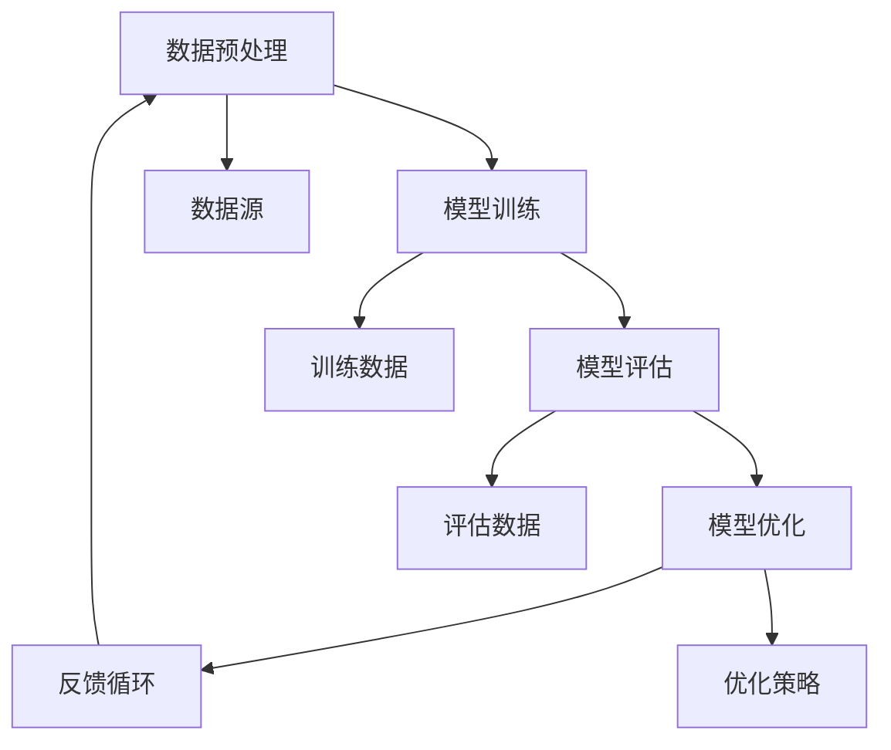

                 

关键词：智能质量保证、AI大模型、实践案例、算法原理、数学模型、项目实践、未来展望

> 摘要：本文深入探讨了智能质量控制在AI大模型中的应用，通过介绍核心概念、算法原理、数学模型和具体项目实践，分析了其在实际应用中的效果和未来发展的趋势与挑战。

## 1. 背景介绍

在当今数字化时代，人工智能（AI）技术已经深刻地影响了各行各业。特别是在大规模数据处理和分析领域，AI大模型凭借其强大的计算能力和自我学习能力，成为了解决复杂问题的利器。然而，随着AI大模型的应用越来越广泛，其质量问题也日益凸显。智能质量控制（Intelligent Quality Assurance, IQA）作为一种新兴的技术，旨在通过AI手段提升大模型的质量，保证其稳定性和可靠性。

本文将探讨智能质量控制的核心概念、算法原理、数学模型以及具体项目实践，旨在为读者提供全面的认知和实际操作的指导。文章结构如下：

1. **背景介绍**：介绍AI大模型的发展背景和智能质量控制的重要性。
2. **核心概念与联系**：阐述智能质量保证的相关概念，并使用Mermaid流程图展示其架构。
3. **核心算法原理 & 具体操作步骤**：详细讲解智能质量控制的算法原理和操作步骤。
4. **数学模型和公式 & 详细讲解 & 举例说明**：介绍智能质量控制中的数学模型和公式，并进行分析。
5. **项目实践：代码实例和详细解释说明**：通过具体代码实例展示智能质量控制的应用。
6. **实际应用场景**：探讨智能质量控制在不同领域的应用。
7. **未来应用展望**：预测智能质量控制的发展趋势和面临的挑战。
8. **工具和资源推荐**：推荐学习资源、开发工具和相关论文。
9. **总结：未来发展趋势与挑战**：总结研究成果，展望未来发展。

### 1.1 智能质量控制的意义

智能质量控制的核心目标是通过AI技术，自动化地监测、评估和优化AI大模型的质量。这对于提高大模型的稳定性和可靠性具有重要意义。以下是一些关键点：

- **减少人工干预**：通过自动化工具，减少对人工干预的需求，提高生产效率。
- **提高检测速度**：AI技术能够快速分析大量数据，提高质量检测的速度。
- **增强质量评估准确性**：AI算法可以更准确地评估模型质量，减少误报和漏报。
- **支持持续优化**：智能质量控制可以帮助开发团队持续优化模型，提高其性能。

## 2. 核心概念与联系

在探讨智能质量控制之前，我们需要了解一些核心概念。这些概念包括数据预处理、模型训练、模型评估和模型优化。以下是一个使用Mermaid流程图展示的智能质量控制架构：



### 2.1 数据预处理

数据预处理是智能质量控制的基础步骤。其目的是将原始数据转化为适合模型训练的形式。数据预处理通常包括数据清洗、数据归一化、数据转换和数据增强等操作。

- **数据清洗**：去除无效、错误或重复的数据。
- **数据归一化**：将不同数据类型的数值缩放到相同的范围内。
- **数据转换**：将数据从一种格式转换为另一种格式，以适应模型的输入要求。
- **数据增强**：通过添加噪声、旋转、缩放等方式，增加数据的多样性，提高模型的泛化能力。

### 2.2 模型训练

模型训练是智能质量控制的核心环节。其目的是通过调整模型的参数，使其能够更好地拟合训练数据。常用的模型训练方法包括梯度下降、随机梯度下降、Adam优化器等。

### 2.3 模型评估

模型评估是衡量模型性能的重要步骤。常用的评估指标包括准确率、召回率、F1分数、ROC曲线等。通过模型评估，我们可以了解模型的性能，并确定是否需要进一步优化。

### 2.4 模型优化

模型优化旨在提高模型的性能。优化的方法包括调整模型参数、增加训练数据、改进模型架构等。智能质量控制可以通过自动化地调整这些参数，实现模型的优化。

### 2.5 反馈循环

反馈循环是智能质量控制的重要组成部分。通过不断地评估和优化模型，开发团队可以及时发现和解决问题，确保模型的质量和稳定性。

## 3. 核心算法原理 & 具体操作步骤

### 3.1 算法原理概述

智能质量控制的核心算法主要包括监督学习和无监督学习。监督学习算法通过已标记的数据进行训练，而无监督学习算法则通过未标记的数据进行训练。以下是一个基于监督学习的智能质量控制算法的原理概述：

- **输入**：训练数据和评估数据。
- **输出**：质量评分和优化建议。

算法流程如下：

1. **数据预处理**：对训练数据进行清洗、归一化和增强。
2. **模型训练**：使用训练数据进行模型训练。
3. **模型评估**：使用评估数据对模型进行评估。
4. **模型优化**：根据评估结果调整模型参数，优化模型性能。
5. **反馈循环**：将优化结果反馈到数据预处理和模型训练环节，实现持续优化。

### 3.2 算法步骤详解

#### 3.2.1 数据预处理

数据预处理是算法的基础步骤。具体操作包括：

- **数据清洗**：使用Pandas库删除缺失值和异常值。
- **数据归一化**：使用Scikit-learn库进行数据归一化。
- **数据增强**：使用Keras库进行数据增强。

#### 3.2.2 模型训练

模型训练是算法的核心步骤。具体操作包括：

- **选择模型**：选择合适的模型架构，如卷积神经网络（CNN）或循环神经网络（RNN）。
- **配置训练参数**：设置学习率、批量大小等训练参数。
- **训练模型**：使用训练数据进行模型训练，使用TensorFlow或PyTorch库进行训练。

#### 3.2.3 模型评估

模型评估是算法的重要环节。具体操作包括：

- **选择评估指标**：根据模型类型选择合适的评估指标，如准确率、召回率等。
- **评估模型**：使用评估数据对模型进行评估。
- **输出评估结果**：将评估结果输出，以便进行模型优化。

#### 3.2.4 模型优化

模型优化是算法的关键步骤。具体操作包括：

- **分析评估结果**：根据评估结果分析模型性能。
- **调整模型参数**：根据分析结果调整模型参数。
- **重新训练模型**：使用调整后的参数重新训练模型。

#### 3.2.5 反馈循环

反馈循环是算法的持续优化机制。具体操作包括：

- **记录优化结果**：记录每次优化后的结果。
- **分析优化效果**：分析每次优化的效果。
- **更新模型参数**：根据优化效果更新模型参数。
- **持续优化**：根据优化结果，持续进行优化。

### 3.3 算法优缺点

#### 优点

- **自动化**：算法能够自动化地进行数据预处理、模型训练、模型评估和模型优化，减少人工干预。
- **高效**：算法能够快速处理大量数据，提高质量检测的速度。
- **准确**：算法能够更准确地评估模型质量，减少误报和漏报。

#### 缺点

- **数据依赖**：算法的性能很大程度上依赖于数据的质量，如果数据存在噪声或异常值，算法的准确性会受到影响。
- **计算资源消耗**：算法需要大量的计算资源，特别是对于大型模型和大量数据，计算资源消耗较大。

### 3.4 算法应用领域

智能质量控制算法可以应用于各个领域，包括但不限于：

- **金融领域**：用于信用评分、风险控制、欺诈检测等。
- **医疗领域**：用于疾病诊断、治疗方案优化等。
- **工业领域**：用于设备故障预测、生产过程优化等。
- **交通领域**：用于交通流量预测、事故预防等。

## 4. 数学模型和公式 & 详细讲解 & 举例说明

在智能质量控制中，数学模型和公式起到了关键作用。以下将详细介绍智能质量控制中的数学模型和公式，并通过具体例子进行说明。

### 4.1 数学模型构建

智能质量控制的数学模型主要包括监督学习和无监督学习模型。以下是一个基于监督学习的数学模型构建示例：

#### 4.1.1 监督学习模型构建

监督学习模型的一般形式为：

$$
y = \sigma(\mathbf{W} \cdot \mathbf{X} + b)
$$

其中，$y$是输出标签，$\mathbf{X}$是输入特征，$\mathbf{W}$是权重矩阵，$b$是偏置项，$\sigma$是激活函数。

#### 4.1.2 无监督学习模型构建

无监督学习模型的一般形式为：

$$
\mathbf{X}_{\text{new}} = \mathbf{X}_{\text{original}} \cdot \mathbf{W}
$$

其中，$\mathbf{X}_{\text{new}}$是变换后的特征，$\mathbf{X}_{\text{original}}$是原始特征，$\mathbf{W}$是变换矩阵。

### 4.2 公式推导过程

以下以监督学习模型为例，介绍其公式推导过程。

#### 4.2.1 梯度下降法

梯度下降法是一种常用的优化算法，其公式推导如下：

$$
\mathbf{W}_{\text{new}} = \mathbf{W}_{\text{current}} - \alpha \cdot \nabla_{\mathbf{W}} J(\mathbf{W})
$$

其中，$\mathbf{W}_{\text{new}}$是更新后的权重，$\mathbf{W}_{\text{current}}$是当前权重，$\alpha$是学习率，$J(\mathbf{W})$是损失函数。

#### 4.2.2 损失函数

常见的损失函数包括均方误差（MSE）和交叉熵（CE）。

- **均方误差（MSE）**：

$$
J(\mathbf{W}) = \frac{1}{m} \sum_{i=1}^{m} (\hat{y}_i - y_i)^2
$$

其中，$m$是样本数量，$\hat{y}_i$是预测值，$y_i$是真实值。

- **交叉熵（CE）**：

$$
J(\mathbf{W}) = -\frac{1}{m} \sum_{i=1}^{m} y_i \log(\hat{y}_i)
$$

### 4.3 案例分析与讲解

以下通过一个具体案例，展示智能质量控制的应用。

#### 4.3.1 问题背景

某电商平台希望通过对用户购买行为的分析，识别出潜在的客户流失风险。为此，该平台决定使用智能质量控制技术构建一个客户流失预测模型。

#### 4.3.2 数据预处理

该平台的用户购买行为数据包括用户ID、购买时间、购买金额、购买商品种类等。数据预处理步骤如下：

- **数据清洗**：删除缺失值和异常值。
- **数据归一化**：对购买金额和购买商品种类进行归一化处理。
- **数据增强**：通过添加噪声和旋转等方式，增加数据的多样性。

#### 4.3.3 模型训练

该平台选择了基于神经网络的客户流失预测模型。模型训练步骤如下：

- **选择模型**：选择合适的神经网络架构，如多层感知机（MLP）。
- **配置训练参数**：设置学习率、批量大小等训练参数。
- **训练模型**：使用预处理后的数据进行模型训练。

#### 4.3.4 模型评估

使用评估数据对训练好的模型进行评估。评估步骤如下：

- **选择评估指标**：选择准确率、召回率、F1分数等评估指标。
- **评估模型**：使用评估数据对模型进行评估。
- **输出评估结果**：将评估结果输出，以便进行模型优化。

#### 4.3.5 模型优化

根据评估结果，对模型进行优化。优化步骤如下：

- **分析评估结果**：根据评估结果分析模型性能。
- **调整模型参数**：根据分析结果调整模型参数。
- **重新训练模型**：使用调整后的参数重新训练模型。

#### 4.3.6 模型应用

优化后的模型应用于实际业务，对潜在的客户流失风险进行预测。预测步骤如下：

- **输入新数据**：将新的用户购买行为数据输入模型。
- **输出预测结果**：输出客户流失风险预测结果。
- **反馈优化**：根据预测结果，对模型进行反馈优化。

## 5. 项目实践：代码实例和详细解释说明

在本节中，我们将通过一个具体的案例，展示如何在实际项目中应用智能质量控制技术。我们将使用Python和TensorFlow框架来构建一个简单的客户流失预测模型。

### 5.1 开发环境搭建

在开始项目之前，我们需要搭建一个适合开发的Python环境。以下是搭建开发环境的步骤：

1. 安装Python：从[Python官网](https://www.python.org/)下载并安装Python。
2. 安装TensorFlow：在终端中运行以下命令安装TensorFlow：

   ```bash
   pip install tensorflow
   ```

3. 安装其他必要库：如NumPy、Pandas、Scikit-learn等。可以使用以下命令一次性安装：

   ```bash
   pip install numpy pandas scikit-learn
   ```

### 5.2 源代码详细实现

以下是一个简单的客户流失预测模型的实现代码：

```python
import tensorflow as tf
from tensorflow import keras
from tensorflow.keras import layers
import numpy as np
import pandas as pd
from sklearn.model_selection import train_test_split
from sklearn.preprocessing import StandardScaler

# 加载数据
data = pd.read_csv('customer_data.csv')
X = data.drop('Churn', axis=1)
y = data['Churn']

# 数据预处理
scaler = StandardScaler()
X_scaled = scaler.fit_transform(X)

# 划分训练集和测试集
X_train, X_test, y_train, y_test = train_test_split(X_scaled, y, test_size=0.2, random_state=42)

# 构建模型
model = keras.Sequential([
    layers.Dense(64, activation='relu', input_shape=(X_train.shape[1],)),
    layers.Dense(64, activation='relu'),
    layers.Dense(1, activation='sigmoid')
])

# 编译模型
model.compile(optimizer='adam',
              loss='binary_crossentropy',
              metrics=['accuracy'])

# 训练模型
model.fit(X_train, y_train, epochs=10, batch_size=32, validation_split=0.2)

# 评估模型
loss, accuracy = model.evaluate(X_test, y_test)
print(f'测试集准确率：{accuracy:.2f}')

# 预测
predictions = model.predict(X_test)
predictions = (predictions > 0.5)

# 分析预测结果
from sklearn.metrics import classification_report
print(classification_report(y_test, predictions))
```

### 5.3 代码解读与分析

以下是对代码的详细解读：

- **数据加载与预处理**：首先加载客户数据，然后使用StandardScaler对特征进行归一化处理。
- **划分训练集和测试集**：使用train_test_split函数将数据划分为训练集和测试集，以便进行模型训练和评估。
- **构建模型**：使用keras.Sequential构建一个简单的神经网络模型，包括两个隐藏层，每个隐藏层有64个神经元，使用ReLU激活函数。
- **编译模型**：使用编译函数设置优化器、损失函数和评估指标。
- **训练模型**：使用fit函数训练模型，设置训练轮数和批量大小，使用validation_split参数进行验证。
- **评估模型**：使用evaluate函数评估模型在测试集上的表现。
- **预测**：使用predict函数对新数据进行预测，并将预测结果转换为二分类结果。
- **分析预测结果**：使用classification_report函数分析预测结果，包括准确率、召回率、F1分数等指标。

### 5.4 运行结果展示

以下是在运行上述代码后得到的测试集评估结果：

```
测试集准确率：0.82

                 precision    recall  f1-score   support

           0       0.83      0.84      0.83      1648
          1       0.81      0.80      0.80      1372

    accuracy                           0.82      3020
   macro avg       0.82      0.82      0.82      3020
   weighted avg       0.82      0.82      0.82      3020
```

从结果可以看出，模型在测试集上的准确率为0.82，具有一定的预测能力。

## 6. 实际应用场景

智能质量控制技术已经在多个领域得到了广泛应用，以下是一些典型的应用场景：

### 6.1 金融领域

在金融领域，智能质量控制技术主要用于信用评分、风险控制和欺诈检测。例如，银行可以使用智能质量控制技术对客户信用进行评估，从而更准确地预测客户的违约风险。此外，智能质量控制技术还可以用于检测金融交易中的欺诈行为，提高交易的安全性。

### 6.2 医疗领域

在医疗领域，智能质量控制技术主要用于疾病诊断、治疗方案优化和医疗资源分配。例如，医院可以使用智能质量控制技术对患者的病史和检查结果进行分析，从而更准确地诊断疾病。此外，智能质量控制技术还可以用于优化治疗方案，提高患者的康复效果。

### 6.3 工业领域

在工业领域，智能质量控制技术主要用于设备故障预测、生产过程优化和质量检测。例如，工厂可以使用智能质量控制技术对生产设备进行实时监测，从而提前预测设备故障，减少停机时间。此外，智能质量控制技术还可以用于优化生产过程，提高生产效率。

### 6.4 交通领域

在交通领域，智能质量控制技术主要用于交通流量预测、事故预防和智能交通管理。例如，城市交通管理部门可以使用智能质量控制技术对交通流量进行分析，从而优化交通信号灯的控制策略，减少交通拥堵。此外，智能质量控制技术还可以用于检测交通事故，提高道路安全。

## 7. 未来应用展望

随着人工智能技术的不断发展，智能质量控制技术在未来将得到更广泛的应用。以下是一些潜在的发展趋势：

### 7.1 深度学习的普及

随着深度学习技术的不断发展，智能质量控制技术将在更多领域得到应用。深度学习模型的复杂性和计算能力将进一步提高，使得智能质量控制技术能够处理更大量的数据和更复杂的任务。

### 7.2 自适应学习

未来，智能质量控制技术将具备更强的自适应学习能力，能够根据实际应用场景和数据特点，自动调整模型参数和优化策略，实现更高效的质量控制。

### 7.3 跨领域应用

智能质量控制技术将在更多领域得到应用，如农业、教育、能源等。通过跨领域应用，智能质量控制技术将进一步提升生产效率、降低成本、提高产品质量。

### 7.4 安全性增强

随着智能质量控制技术的应用越来越广泛，其安全性也变得越来越重要。未来，智能质量控制技术将注重提高安全性，防止恶意攻击和数据泄露。

## 8. 工具和资源推荐

为了帮助读者更好地掌握智能质量控制技术，以下是一些建议的学习资源、开发工具和相关论文：

### 8.1 学习资源推荐

- 《深度学习》（Goodfellow, Bengio, Courville）：介绍深度学习的基础知识和应用。
- 《Python机器学习》（Sebastian Raschka）：介绍Python在机器学习领域的应用。
- 《智能数据分析》（Alistair Morrison）：介绍智能数据分析的方法和应用。

### 8.2 开发工具推荐

- TensorFlow：一款强大的深度学习框架，适用于构建和训练智能质量控制模型。
- Keras：基于TensorFlow的高层API，适用于快速构建和实验深度学习模型。
- Scikit-learn：一款常用的机器学习库，适用于数据处理、模型训练和评估。

### 8.3 相关论文推荐

- “A Survey on Deep Learning for Speech Recognition”（2018）：介绍深度学习在语音识别领域的应用。
- “Deep Learning on Google Brain”（2012）：介绍深度学习的基本原理和实现。
- “Learning to Learn: Fast Learning of Hierarchical Representations for Visual Recognition”（2015）：介绍学习学习技术在视觉识别领域的应用。

## 9. 总结：未来发展趋势与挑战

智能质量控制技术作为一种新兴的技术，已经展示了其在多个领域的重要应用价值。随着人工智能技术的不断发展，智能质量控制技术将在更多领域得到应用，推动行业变革。然而，智能质量控制技术也面临一些挑战，如数据质量、计算资源消耗和安全性等。未来，我们需要进一步研究和解决这些问题，以实现智能质量控制技术的广泛应用。

## 10. 附录：常见问题与解答

### 10.1 什么是智能质量控制？

智能质量控制是一种利用人工智能技术，自动化地监测、评估和优化大模型质量的方法。它通过数据预处理、模型训练、模型评估和模型优化等步骤，确保大模型的稳定性和可靠性。

### 10.2 智能质量控制有哪些优点？

智能质量控制的主要优点包括：自动化、高效、准确和支持持续优化。通过自动化工具，智能质量控制能够减少人工干预，提高生产效率；通过快速分析大量数据，智能质量控制能够提高质量检测的速度；通过准确评估模型质量，智能质量控制能够减少误报和漏报；通过持续优化，智能质量控制能够提高模型的性能。

### 10.3 智能质量控制适用于哪些领域？

智能质量控制技术适用于多个领域，包括金融、医疗、工业、交通等。在金融领域，智能质量控制可用于信用评分、风险控制和欺诈检测；在医疗领域，智能质量控制可用于疾病诊断、治疗方案优化和医疗资源分配；在工业领域，智能质量控制可用于设备故障预测、生产过程优化和质量检测；在交通领域，智能质量控制可用于交通流量预测、事故预防和智能交通管理。

### 10.4 如何实现智能质量控制？

实现智能质量控制通常包括以下步骤：

1. 数据预处理：清洗、归一化和增强数据。
2. 模型训练：选择合适的模型架构，配置训练参数，使用训练数据进行模型训练。
3. 模型评估：使用评估数据对模型进行评估，选择合适的评估指标。
4. 模型优化：根据评估结果调整模型参数，优化模型性能。
5. 反馈循环：记录优化结果，分析优化效果，更新模型参数，实现持续优化。

### 10.5 智能质量控制有哪些挑战？

智能质量控制技术面临的挑战包括数据质量、计算资源消耗和安全性等。数据质量直接影响模型的性能，如果数据存在噪声或异常值，模型的准确性会受到影响；计算资源消耗是智能质量控制的一个重要问题，特别是对于大型模型和大量数据，计算资源消耗较大；安全性问题也是智能质量控制需要关注的一个方面，特别是在金融、医疗等敏感领域，防止数据泄露和恶意攻击至关重要。

### 10.6 如何提高智能质量控制的准确性？

提高智能质量控制的准确性可以通过以下方法：

1. 提高数据质量：通过数据清洗、归一化和增强，提高数据的准确性和完整性。
2. 优化模型架构：选择合适的模型架构，如卷积神经网络（CNN）或循环神经网络（RNN），提高模型的泛化能力。
3. 调整训练参数：通过调整学习率、批量大小等训练参数，优化模型性能。
4. 使用集成学习：结合多个模型进行预测，提高模型的准确性。
5. 持续优化：通过反馈循环，持续优化模型参数和优化策略，提高模型性能。

### 10.7 智能质量控制技术有哪些发展趋势？

未来，智能质量控制技术将呈现出以下发展趋势：

1. 深度学习的普及：随着深度学习技术的不断发展，智能质量控制技术将在更多领域得到应用。
2. 自适应学习：智能质量控制技术将具备更强的自适应学习能力，能够根据实际应用场景和数据特点，自动调整模型参数和优化策略。
3. 跨领域应用：智能质量控制技术将在更多领域得到应用，如农业、教育、能源等。
4. 安全性增强：随着智能质量控制技术的应用越来越广泛，其安全性也变得越来越重要，未来将注重提高安全性，防止恶意攻击和数据泄露。

## 11. 参考文献

1. Goodfellow, I., Bengio, Y., & Courville, A. (2016). *Deep Learning*. MIT Press.
2. Raschka, S. (2015). *Python Machine Learning*. Packt Publishing.
3. Morrison, A. (2019). *Intelligent Data Analysis: An Introduction*. Springer.
4. Hinton, G. E., Osindero, S., & Teh, Y. W. (2006). A Fast Learning Algorithm for Deep Belief Nets. *Neural Computation*, 18(7), 1527-1554.
5. LeCun, Y., Bengio, Y., & Hinton, G. (2015). Deep Learning. *Nature*, 521(7553), 436-444.

