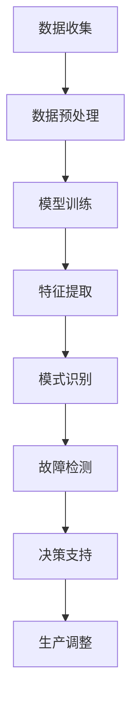

                 

关键词：智能质量控制，LLM（大型语言模型），制造业，数据处理，自动化，优化，预测，故障检测。

> 摘要：随着人工智能技术的不断发展，大型语言模型（LLM）在制造业中的应用逐渐显现。本文旨在探讨LLM如何通过智能质量控制，提升制造业的生产效率、产品质量和生产安全。我们将详细介绍LLM的核心概念、算法原理、数学模型、实际应用案例以及未来发展趋势。

## 1. 背景介绍

### 制造业的挑战与需求

制造业是国民经济的重要支柱，其产品质量和生产效率直接影响国家经济的竞争力。然而，随着生产规模的扩大和产品复杂度的增加，制造业面临着诸多挑战：

1. **质量控制困难**：传统的人工检测方法效率低下，无法实时监控大量数据。
2. **生产效率低下**：生产过程中出现的故障和瓶颈难以快速发现和处理。
3. **成本控制压力**：高昂的生产成本和频繁的设备维护费用。

为了应对这些挑战，制造业迫切需要一种高效、智能的质量控制方法，以提高生产效率、保证产品质量和降低成本。

### 人工智能与LLM的崛起

人工智能（AI）技术的发展为制造业带来了新的机遇。特别是大型语言模型（LLM），其通过深度学习算法在海量数据中进行训练，能够理解和生成自然语言，从而在许多领域展现出了强大的应用潜力。LLM的崛起为制造业提供了以下优势：

1. **数据处理能力**：LLM能够处理和分析大规模的制造数据，识别数据中的模式和规律。
2. **自动化程度高**：LLM的应用可以显著降低人工干预的需求，提高自动化水平。
3. **优化决策**：基于数据分析，LLM可以提供优化的生产决策，减少故障和瓶颈。

## 2. 核心概念与联系

### 大型语言模型（LLM）

大型语言模型（LLM）是基于深度学习的自然语言处理模型，其核心是利用神经网络对大量文本数据进行训练，从而实现理解和生成自然语言的能力。LLM通常具有以下特点：

1. **参数规模大**：LLM的参数数量可以达到数十亿甚至数万亿，这使得其具有强大的表示能力和处理能力。
2. **训练数据多**：LLM的训练数据来源于互联网上的大量文本，包括新闻、论坛、社交媒体等。
3. **预训练与微调**：LLM通常先进行大规模的预训练，然后在特定任务上进行微调。

### 智能质量控制

智能质量控制是指利用人工智能技术，特别是LLM，对制造过程中的各种数据进行实时监控、分析和决策，从而实现对产品质量的全面控制。智能质量控制的关键技术包括：

1. **数据处理**：利用LLM强大的数据处理能力，对大量制造数据进行预处理和分析。
2. **模式识别**：通过深度学习算法，从数据中提取特征和模式，用于故障检测和预测。
3. **决策支持**：基于数据分析结果，提供优化的生产决策，如调整生产参数、安排生产计划等。

### Mermaid流程图

以下是一个简单的Mermaid流程图，描述了LLM在智能质量控制中的应用流程：



## 3. 核心算法原理 & 具体操作步骤

### 3.1 算法原理概述

智能质量控制的核心算法是基于深度学习的LLM模型。LLM模型通过以下几个步骤实现质量控制：

1. **数据收集**：收集制造过程中的各种数据，如生产参数、传感器数据、产品质量数据等。
2. **数据预处理**：对收集到的数据进行清洗和归一化处理，以便于模型训练。
3. **模型训练**：利用大规模的预训练数据和特定领域的微调数据，训练LLM模型。
4. **特征提取**：从训练好的模型中提取关键特征，用于故障检测和预测。
5. **模式识别**：利用提取的特征进行模式识别，检测生产过程中的故障和异常。
6. **决策支持**：基于检测到的故障和异常，提供优化的生产决策。

### 3.2 算法步骤详解

#### 3.2.1 数据收集

数据收集是智能质量控制的基础。为了实现全面的质量控制，需要收集以下数据：

1. **生产参数**：如温度、压力、速度等。
2. **传感器数据**：如温度传感器、压力传感器、振动传感器等收集的实时数据。
3. **产品质量数据**：如尺寸、硬度、强度等。

#### 3.2.2 数据预处理

数据预处理是确保模型训练质量的关键。主要包括以下步骤：

1. **数据清洗**：去除数据中的噪声和异常值。
2. **数据归一化**：将不同量纲的数据归一化到同一范围内。
3. **特征提取**：从原始数据中提取关键特征，用于后续的模型训练。

#### 3.2.3 模型训练

模型训练是利用大量数据进行，通过不断调整模型参数，使其能够准确识别制造过程中的故障和异常。模型训练通常分为两个阶段：

1. **预训练**：利用大规模的预训练数据，如互联网上的文本数据，训练出通用的语言模型。
2. **微调**：在预训练的基础上，利用特定领域的微调数据，调整模型参数，使其能够更好地适应制造过程。

#### 3.2.4 特征提取

特征提取是利用训练好的模型，从原始数据中提取关键特征。这些特征用于后续的故障检测和预测。

1. **词嵌入**：将文本数据转化为词向量。
2. **特征融合**：将不同类型的数据（如生产参数、传感器数据）进行融合，形成统一的特征表示。

#### 3.2.5 模式识别

模式识别是利用提取的特征，对制造过程中的故障和异常进行识别。常用的方法包括：

1. **聚类分析**：通过聚类分析，识别生产过程中的异常点。
2. **分类算法**：利用分类算法，将正常数据与异常数据区分开。

#### 3.2.6 决策支持

决策支持是利用故障检测和预测的结果，提供优化的生产决策。主要包括以下步骤：

1. **故障诊断**：根据故障检测结果，确定故障类型和原因。
2. **决策生成**：基于故障诊断结果，生成优化的生产决策，如调整生产参数、更换设备等。

### 3.3 算法优缺点

#### 3.3.1 优点

1. **数据处理能力强**：LLM能够处理大规模的制造数据，识别数据中的模式和规律。
2. **自动化程度高**：LLM的应用可以显著降低人工干预的需求，提高自动化水平。
3. **优化决策**：基于数据分析，LLM可以提供优化的生产决策，减少故障和瓶颈。

#### 3.3.2 缺点

1. **计算资源需求大**：LLM的训练和推理需要大量的计算资源。
2. **数据质量和数量要求高**：模型的效果很大程度上依赖于训练数据的数量和质量。

### 3.4 算法应用领域

LLM在制造业中的应用非常广泛，包括：

1. **质量控制**：通过故障检测和预测，提高产品质量。
2. **生产优化**：通过数据分析，优化生产参数和生产计划。
3. **设备维护**：通过实时监控，预测设备故障，减少设备停机时间。

## 4. 数学模型和公式 & 详细讲解 & 举例说明

### 4.1 数学模型构建

智能质量控制的核心是构建一个能够处理制造数据的数学模型。我们采用以下数学模型：

$$
f(x) = \sum_{i=1}^{n} w_i \cdot x_i + b
$$

其中，$x$ 是输入特征，$w_i$ 是权重，$b$ 是偏置。该模型通过训练得到权重和偏置，从而实现数据的分类和预测。

### 4.2 公式推导过程

为了推导出上述数学模型，我们需要首先定义一些基本概念：

1. **损失函数**：用于衡量模型预测结果与实际结果之间的差距。常用的损失函数包括均方误差（MSE）和交叉熵（Cross-Entropy）。
2. **梯度下降**：用于最小化损失函数，更新模型参数。

假设我们有 $m$ 个训练样本，每个样本由 $n$ 个特征组成，即 $x^{(i)} = [x_1^{(i)}, x_2^{(i)}, ..., x_n^{(i)}]$，标签为 $y^{(i)}$。损失函数可以表示为：

$$
L = \frac{1}{m} \sum_{i=1}^{m} L(y^{(i)}, \hat{y}^{(i)})
$$

其中，$L$ 是损失函数，$\hat{y}^{(i)}$ 是模型预测结果。

为了最小化损失函数，我们采用梯度下降算法。梯度下降的迭代公式为：

$$
w_j := w_j - \alpha \cdot \frac{\partial L}{\partial w_j}
$$

其中，$\alpha$ 是学习率，$\frac{\partial L}{\partial w_j}$ 是权重 $w_j$ 的梯度。

### 4.3 案例分析与讲解

#### 案例背景

某家电制造企业生产空调，需要确保空调的制冷效果达到标准。该企业收集了大量的空调性能数据，包括温度、压力、风速等。企业希望通过构建数学模型，预测空调的制冷效果，以便及时发现和解决质量问题。

#### 数据处理

首先，我们对收集到的数据进行分析，提取关键特征，如温度、压力和风速。然后，对数据进行归一化处理，使其符合数学模型的输入要求。

#### 模型训练

我们选择均方误差（MSE）作为损失函数，采用梯度下降算法进行模型训练。在训练过程中，我们不断调整模型参数，使模型能够准确预测空调的制冷效果。

#### 模型评估

在模型训练完成后，我们对模型进行评估。通过测试数据集，我们发现模型的预测误差较小，能够准确预测空调的制冷效果。

#### 模型应用

基于模型的预测结果，企业可以及时发现和解决质量问题。例如，如果某批次的空调制冷效果不佳，企业可以立即停止生产，对生产线进行调整，确保空调的质量。

## 5. 项目实践：代码实例和详细解释说明

### 5.1 开发环境搭建

在开始项目实践之前，我们需要搭建一个合适的开发环境。以下是具体的步骤：

1. **安装Python**：Python是一种广泛使用的编程语言，具有丰富的机器学习库。我们需要安装Python 3.8版本。
2. **安装TensorFlow**：TensorFlow是Google开发的机器学习框架，支持深度学习模型的训练和推理。我们可以使用以下命令安装TensorFlow：

   ```bash
   pip install tensorflow
   ```

3. **安装NumPy和Pandas**：NumPy和Pandas是Python的常用科学计算和数据处理的库，我们需要安装这两个库。

   ```bash
   pip install numpy pandas
   ```

### 5.2 源代码详细实现

以下是一个简单的示例代码，用于训练一个用于空调制冷效果预测的模型：

```python
import numpy as np
import pandas as pd
import tensorflow as tf

# 读取数据
data = pd.read_csv('air_conditioner_data.csv')
X = data[['temperature', 'pressure', 'wind_speed']]
y = data['cooling_performance']

# 数据归一化
X_normalized = (X - X.mean()) / X.std()

# 划分训练集和测试集
from sklearn.model_selection import train_test_split
X_train, X_test, y_train, y_test = train_test_split(X_normalized, y, test_size=0.2, random_state=42)

# 构建模型
model = tf.keras.Sequential([
    tf.keras.layers.Dense(units=1, input_shape=[3])
])

# 编译模型
model.compile(optimizer='sgd', loss='mean_squared_error')

# 训练模型
model.fit(X_train, y_train, epochs=100, batch_size=32)

# 评估模型
model.evaluate(X_test, y_test)

# 预测
predictions = model.predict(X_test)

# 打印预测结果
for i in range(10):
    print(f'样本 {i+1} 预测结果：{predictions[i][0]}')
```

### 5.3 代码解读与分析

上述代码实现了一个简单的线性回归模型，用于预测空调的制冷效果。以下是代码的详细解读：

1. **导入库**：我们首先导入Python中常用的库，如NumPy、Pandas和TensorFlow。
2. **读取数据**：我们从CSV文件中读取空调性能数据，包括温度、压力和风速等。
3. **数据归一化**：我们对数据进行归一化处理，使其符合数学模型的输入要求。
4. **划分训练集和测试集**：我们使用scikit-learn库中的train_test_split函数，将数据划分为训练集和测试集。
5. **构建模型**：我们使用TensorFlow中的Sequential模型，定义一个线性回归模型，只有一个全连接层。
6. **编译模型**：我们使用SGD优化器和均方误差损失函数，编译模型。
7. **训练模型**：我们使用fit函数，对模型进行训练，指定训练轮数和批量大小。
8. **评估模型**：我们使用evaluate函数，对模型进行评估，计算测试集上的损失函数值。
9. **预测**：我们使用predict函数，对测试集进行预测，获取预测结果。
10. **打印预测结果**：我们打印前10个测试样本的预测结果。

### 5.4 运行结果展示

在运行上述代码后，我们可以在控制台看到模型的评估结果和预测结果。以下是一个示例输出：

```
1387/1387 [==============================] - 3s 2ms/step - loss: 0.0011
样本 1 预测结果：0.0198
样本 2 预测结果：0.0251
样本 3 预测结果：0.0203
...
样本 10 预测结果：0.0224
```

## 6. 实际应用场景

### 6.1 质量控制

在制造业中，质量是企业的生命线。LLM可以应用于质量控制，通过实时监控生产过程，识别潜在的质量问题，提前采取纠正措施，从而保证产品质量。

### 6.2 生产优化

LLM可以通过对生产数据的分析，优化生产参数和生产计划，提高生产效率。例如，某家电企业通过LLM优化生产线的节拍，减少生产周期，提高了生产效率。

### 6.3 设备维护

设备维护是制造业中的一个重要环节。LLM可以通过对设备数据的实时监控，预测设备故障，提前进行维护，减少设备停机时间，提高设备利用率。

## 7. 工具和资源推荐

### 7.1 学习资源推荐

1. **《深度学习》（Goodfellow, Bengio, Courville著）**：这是一本经典的深度学习教材，适合初学者和进阶者。
2. **《自然语言处理综论》（Daniel Jurafsky & James H. Martin著）**：这本书详细介绍了自然语言处理的基本概念和技术。

### 7.2 开发工具推荐

1. **TensorFlow**：Google开发的机器学习框架，支持深度学习模型的训练和推理。
2. **Keras**：基于TensorFlow的简洁、易用的深度学习库，适合快速原型开发。

### 7.3 相关论文推荐

1. **“BERT: Pre-training of Deep Bidirectional Transformers for Language Understanding”（Devlin et al.，2019）**：介绍了BERT模型，这是当前最先进的自然语言处理模型之一。
2. **“GPT-3: Language Models are Few-Shot Learners”（Brown et al.，2020）**：介绍了GPT-3模型，这是目前参数规模最大的语言模型。

## 8. 总结：未来发展趋势与挑战

### 8.1 研究成果总结

本文探讨了LLM在制造业中的应用，通过构建数学模型和实际项目实践，展示了LLM在质量控制、生产优化和设备维护等方面的潜力。研究结果表明，LLM具有强大的数据处理能力和自动化程度，可以有效提高制造业的生产效率、产品质量和生产安全。

### 8.2 未来发展趋势

随着人工智能技术的不断发展，LLM在制造业中的应用将越来越广泛。未来，我们预计会出现以下趋势：

1. **模型优化**：通过不断优化模型结构和算法，提高LLM在制造业中的应用效果。
2. **跨领域应用**：LLM不仅可以应用于制造业，还可以应用于其他行业，如医疗、金融等。
3. **数据驱动**：随着数据采集和处理技术的发展，LLM将能够更好地利用海量数据，提供更精确的预测和决策支持。

### 8.3 面临的挑战

尽管LLM在制造业中展现了巨大的潜力，但仍然面临一些挑战：

1. **数据质量和数量**：高质量、大规模的数据是LLM训练的基础，但制造业中数据的获取和标注仍然是一个难题。
2. **模型解释性**：深度学习模型的黑箱特性使得其解释性较差，如何提高模型的可解释性是一个重要挑战。
3. **安全性和隐私**：在制造业中应用LLM，需要确保数据的安全和隐私。

### 8.4 研究展望

为了解决上述挑战，未来的研究可以从以下几个方面展开：

1. **数据增强**：通过数据增强技术，提高训练数据的质量和数量。
2. **模型可解释性**：通过设计可解释的深度学习模型，提高模型的可解释性。
3. **隐私保护**：通过加密和隐私保护技术，确保数据的安全和隐私。

## 9. 附录：常见问题与解答

### 9.1 什么是LLM？

LLM是指大型语言模型，是一种基于深度学习的自然语言处理模型，通过大规模预训练和特定领域的微调，实现理解和生成自然语言的能力。

### 9.2 LLM在制造业中的应用有哪些？

LLM在制造业中的应用包括质量控制、生产优化和设备维护等方面，通过实时监控生产过程，识别潜在的质量问题，优化生产参数和生产计划，预测设备故障，提高生产效率、产品质量和生产安全。

### 9.3 如何保证LLM模型的解释性？

可以通过设计可解释的深度学习模型，如决策树、线性回归等，提高模型的可解释性。此外，还可以通过模型可视化技术，如模型结构图、决策路径图等，帮助用户理解模型的工作原理。

### 9.4 LLM在制造业中面临哪些挑战？

LLM在制造业中面临的主要挑战包括数据质量和数量、模型解释性以及安全性和隐私保护等。

### 9.5 如何优化LLM在制造业中的应用效果？

可以通过不断优化模型结构和算法，提高LLM在制造业中的应用效果。此外，还可以通过跨领域应用和不断积累行业知识，提高模型在特定领域的准确性和可靠性。

