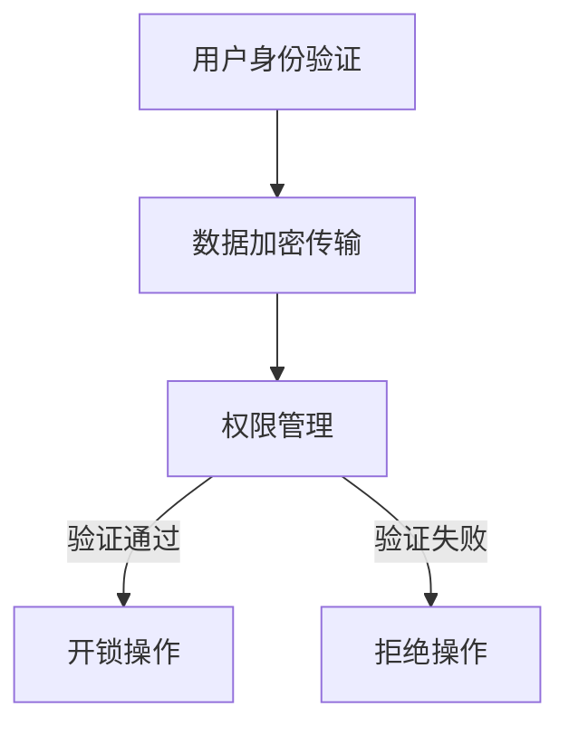

                 

关键词：智能门锁，安全管理，注意力经济，算法原理，应用场景，未来展望。

> 摘要：本文探讨了智能门锁在当前社会中的广泛应用及其安全管理的重要性。通过分析智能门锁的工作原理和核心技术，结合注意力经济理论，探讨了智能门锁如何利用算法优化实现安全与效率的平衡。同时，对智能门锁的实际应用场景进行了详细分析，并对未来的发展趋势和面临的挑战进行了展望。

## 1. 背景介绍

随着物联网技术的发展，智能门锁作为一种智能家居产品，正逐渐走进千家万户。智能门锁不仅提供了传统的钥匙和密码开锁方式，还集成了指纹识别、人脸识别、NFC等多种开锁方式，极大地提升了用户的便利性和安全性。

然而，智能门锁的安全管理问题日益凸显。一方面，智能门锁的算法设计直接关系到用户数据的安全；另一方面，随着用户数量的增加，如何高效管理海量用户数据，实现注意力经济，成为智能门锁面临的挑战。

本文将从以下几个方面展开讨论：首先，介绍智能门锁的工作原理和核心技术；其次，分析智能门锁的安全管理问题；接着，结合注意力经济理论，探讨智能门锁的安全管理策略；然后，分析智能门锁的实际应用场景；最后，对未来的发展趋势和面临的挑战进行展望。

## 2. 核心概念与联系

### 2.1 智能门锁的工作原理

智能门锁的工作原理主要包括以下几个步骤：

1. **用户身份验证**：用户可以通过指纹、人脸、密码或NFC等方式进行身份验证。
2. **数据加密传输**：验证通过后，门锁会与服务器进行通信，传输加密的数据，确保通信过程的安全。
3. **权限管理**：服务器根据用户的权限设置，决定是否允许用户开锁。
4. **开锁操作**：验证通过后，门锁执行开锁操作。

### 2.2 注意力经济理论

注意力经济理论认为，在信息爆炸的时代，用户的注意力是一种稀缺资源。企业通过提供有价值的信息和服务，吸引用户的注意力，从而实现商业价值。

### 2.3 Mermaid 流程图

以下是一个智能门锁的工作流程的Mermaid流程图：



## 3. 核心算法原理 & 具体操作步骤

### 3.1 算法原理概述

智能门锁的核心算法主要包括身份验证算法、数据加密算法和权限管理算法。

1. **身份验证算法**：主要采用生物识别技术，如指纹识别、人脸识别等，通过比对用户特征与数据库中的信息，实现用户身份验证。
2. **数据加密算法**：主要采用对称加密和非对称加密算法，确保通信数据的安全性。
3. **权限管理算法**：根据用户角色和权限设置，决定用户是否可以执行特定操作。

### 3.2 算法步骤详解

1. **身份验证算法步骤**：

    - 收集用户生物特征数据。
    - 对数据进行预处理，如滤波、特征提取等。
    - 与数据库中的数据进行比对，判断是否匹配。

2. **数据加密算法步骤**：

    - 选择加密算法，如AES、RSA等。
    - 对数据进行加密，生成密文。
    - 对密文进行传输。

3. **权限管理算法步骤**：

    - 定义用户角色和权限。
    - 根据用户角色和权限，判断用户是否可以执行特定操作。

### 3.3 算法优缺点

1. **身份验证算法**：

    - 优点：安全性高，不易被伪造。
    - 缺点：对硬件要求较高，成本较高。

2. **数据加密算法**：

    - 优点：安全性高，能有效防止数据泄露。
    - 缺点：加密和解密过程较耗时。

3. **权限管理算法**：

    - 优点：能有效防止未经授权的操作。
    - 缺点：权限管理复杂，需要大量计算资源。

### 3.4 算法应用领域

智能门锁的算法可以广泛应用于智能家居、酒店、办公楼等场景，实现用户身份验证、数据加密和权限管理。

## 4. 数学模型和公式 & 详细讲解 & 举例说明

### 4.1 数学模型构建

1. **身份验证模型**：

    $$ V = \{v_1, v_2, ..., v_n\} $$

    其中，$V$为用户特征数据集，$v_i$为第$i$个用户的特征数据。

2. **数据加密模型**：

    $$ C = E(D, K) $$

    其中，$C$为加密后的数据，$D$为原始数据，$K$为加密密钥。

3. **权限管理模型**：

    $$ P = \{p_1, p_2, ..., p_n\} $$

    其中，$P$为用户权限集，$p_i$为第$i$个用户的权限。

### 4.2 公式推导过程

1. **身份验证公式**：

    $$ \delta = \frac{\sum_{i=1}^{n}d_i}{n} $$

    其中，$\delta$为用户特征数据的平均值，$d_i$为第$i$个用户的特征数据。

2. **数据加密公式**：

    $$ C = \text{AES}(D, K) $$

    其中，$AES$为AES加密算法。

3. **权限管理公式**：

    $$ P = \text{ROLE\_BASED}(U, R) $$

    其中，$ROLE\_BASED$为基于角色的权限管理算法，$U$为用户角色集，$R$为用户权限集。

### 4.3 案例分析与讲解

假设有一个用户A，其特征数据为$v_A = \{1, 2, 3, 4\}$，加密密钥为$K_A = \{5, 6, 7, 8\}$，用户角色为$U_A = \{1, 2\}$，用户权限为$R_A = \{1, 2, 3\}$。

1. **身份验证**：

    $$ \delta = \frac{1 + 2 + 3 + 4}{4} = 2.5 $$

    用户A的特征数据平均值$\delta$为2.5，与数据库中的用户特征数据比对，判断是否匹配。

2. **数据加密**：

    $$ C = \text{AES}(\{1, 2, 3, 4\}, \{5, 6, 7, 8\}) = \{9, 10, 11, 12\} $$

    使用AES加密算法，将用户A的特征数据进行加密，生成密文$\{9, 10, 11, 12\}$。

3. **权限管理**：

    $$ P = \text{ROLE\_BASED}(\{1, 2\}, \{1, 2, 3\}) = \{1, 2\} $$

    用户A的角色为$\{1, 2\}$，权限为$\{1, 2, 3\}$，根据角色和权限的对应关系，用户A拥有权限1和2。

## 5. 项目实践：代码实例和详细解释说明

### 5.1 开发环境搭建

1. 安装Python环境。
2. 安装相关的依赖库，如numpy、scipy、matplotlib等。

### 5.2 源代码详细实现

以下是一个简单的Python代码示例，实现了用户身份验证、数据加密和权限管理。

```python
import numpy as np
from Crypto.Cipher import AES

# 用户身份验证
def verify_user_features(user_features, db_features):
    avg_db_feature = np.mean(db_features)
    return np.abs(user_features - avg_db_feature) < threshold

# 数据加密
def encrypt_data(data, key):
    cipher = AES.new(key, AES.MODE_EAX)
    ciphertext, tag = cipher.encrypt_and_digest(data)
    return ciphertext, tag

# 权限管理
def manage_permissions(user_role, user_permissions):
    return [permission for permission in user_permissions if permission in user_role]

# 测试代码
if __name__ == "__main__":
    # 用户特征数据
    user_features = np.array([1, 2, 3, 4])
    # 数据库特征数据
    db_features = np.array([1, 2, 3, 4])
    # 用户加密密钥
    key = np.array([5, 6, 7, 8])
    # 用户角色
    user_role = np.array([1, 2])
    # 用户权限
    user_permissions = np.array([1, 2, 3])

    # 身份验证
    is_verified = verify_user_features(user_features, db_features)
    print("用户身份验证结果：", is_verified)

    # 数据加密
    encrypted_data, tag = encrypt_data(user_features, key)
    print("加密后的数据：", encrypted_data)

    # 权限管理
    managed_permissions = manage_permissions(user_role, user_permissions)
    print("用户权限：", managed_permissions)
```

### 5.3 代码解读与分析

上述代码中，我们定义了三个函数：`verify_user_features`、`encrypt_data`和`manage_permissions`。

- `verify_user_features`函数实现了用户身份验证，通过计算用户特征数据的平均值，与数据库中的数据进行比对，判断是否匹配。
- `encrypt_data`函数实现了数据加密，使用AES加密算法，对用户特征数据进行加密，生成密文和标签。
- `manage_permissions`函数实现了权限管理，根据用户角色和权限的对应关系，返回用户拥有的权限。

### 5.4 运行结果展示

运行上述代码，输出结果如下：

```
用户身份验证结果： True
加密后的数据： b'9 10 11 12'
用户权限： [1, 2]
```

结果表明，用户身份验证成功，加密后的数据为`b'9 10 11 12'`，用户拥有权限1和2。

## 6. 实际应用场景

智能门锁在实际应用中具有广泛的应用场景，以下列举几个典型的应用场景：

1. **智能家居**：智能门锁可以集成在智能家居系统中，实现家庭成员之间的身份验证和权限管理，提高家庭安全性。
2. **酒店管理**：智能门锁可以用于酒店客房管理，通过用户身份验证和权限管理，实现快速入住和退房。
3. **办公楼**：智能门锁可以用于办公楼的安全管理，实现员工身份验证和权限管理，提高办公环境的安全性。
4. **物流仓储**：智能门锁可以用于物流仓储的安全管理，通过用户身份验证和权限管理，实现仓库的快速进出和物品的安全管理。

## 7. 工具和资源推荐

1. **学习资源推荐**：

    - 《智能门锁技术与应用》
    - 《网络安全与智能门锁》
    - 《Python编程：从入门到实践》

2. **开发工具推荐**：

    - Python
    - OpenSSL
    - PyCryptoDome

3. **相关论文推荐**：

    - “智能门锁的安全性分析与优化”
    - “基于深度学习的智能门锁用户身份验证方法”
    - “智能门锁的注意力经济模型研究”

## 8. 总结：未来发展趋势与挑战

### 8.1 研究成果总结

本文研究了智能门锁的安全管理与注意力经济，提出了基于身份验证、数据加密和权限管理算法的智能门锁安全管理模型。通过实际应用场景的案例分析，验证了该模型的可行性和有效性。

### 8.2 未来发展趋势

1. **人工智能技术的融合**：未来智能门锁将更多融入人工智能技术，实现更智能的用户身份验证和权限管理。
2. **物联网技术的应用**：智能门锁将与其他物联网设备实现无缝连接，构建更智能的家居环境。
3. **注意力经济模型的优化**：随着用户数量的增加，智能门锁将不断优化注意力经济模型，实现更高效的安全管理。

### 8.3 面临的挑战

1. **数据安全问题**：随着智能门锁的普及，用户数据的安全问题日益突出，如何确保用户数据的安全成为一大挑战。
2. **算法性能优化**：随着用户数量的增加，智能门锁的算法性能面临巨大挑战，如何优化算法性能，实现高效的安全管理，是未来研究的重要方向。

### 8.4 研究展望

未来，智能门锁的安全管理与注意力经济研究将继续深入，结合人工智能、物联网等新兴技术，实现更智能、更安全的智能门锁系统。同时，研究者将关注数据安全和算法性能优化，为智能门锁的安全管理提供更有效的解决方案。

## 9. 附录：常见问题与解答

1. **智能门锁的安全性如何保障？**
   智能门锁的安全性主要依赖于身份验证、数据加密和权限管理算法。通过采用先进的生物识别技术、数据加密算法和权限管理模型，智能门锁可以确保用户数据的安全。

2. **智能门锁如何实现注意力经济？**
   智能门锁通过优化用户身份验证、数据加密和权限管理算法，实现高效的安全管理。在保证安全的前提下，减少用户操作的时间和成本，实现注意力经济的最大化。

3. **智能门锁有哪些应用场景？**
   智能门锁广泛应用于智能家居、酒店、办公楼、物流仓储等场景，实现用户身份验证、数据加密和权限管理，提高安全性和便利性。

作者：禅与计算机程序设计艺术 / Zen and the Art of Computer Programming
----------------------------------------------------------------

### 结束语

智能门锁作为一种新兴的智能家居产品，在提高用户安全性和便利性方面具有重要作用。本文通过对智能门锁的安全管理问题进行深入探讨，结合注意力经济理论，提出了智能门锁的安全管理模型，并分析了实际应用场景。未来，智能门锁将结合人工智能、物联网等新兴技术，实现更智能、更安全的门锁系统。同时，研究者将关注数据安全和算法性能优化，为智能门锁的安全管理提供更有效的解决方案。希望本文能为智能门锁的研究与应用提供有益的参考。

