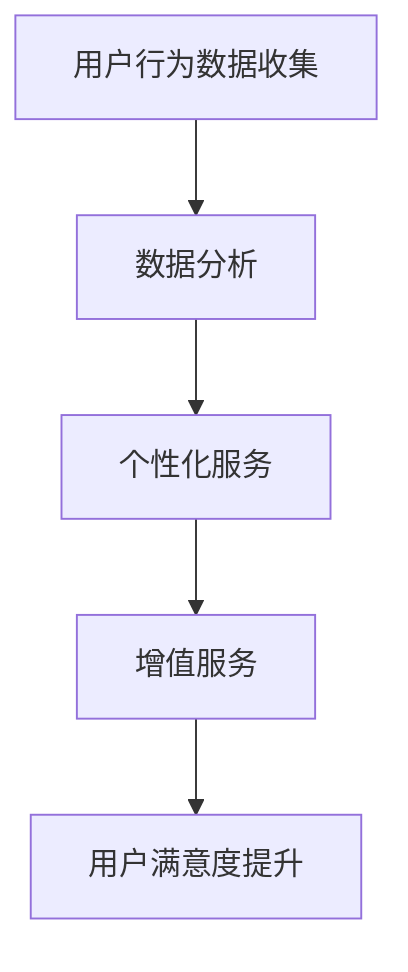

                 

关键词：智能门锁、家居安全、注意力经济、物联网、密码学、安全协议

> 摘要：随着物联网和人工智能技术的快速发展，智能门锁已成为智能家居的重要组成部分。本文将深入探讨智能门锁在提升家居安全方面的作用，以及如何通过注意力经济实现门锁功能的创新。本文旨在为行业从业者提供全面的技术分析，为用户带来更安全、便捷的家居生活体验。

## 1. 背景介绍

智能门锁作为智能家居的核心设备之一，通过物联网技术实现了远程控制、自动锁定与解锁等功能。近年来，随着智能家居市场的不断壮大，智能门锁的需求也日益增加。然而，随着智能门锁的普及，安全问题也日益凸显。传统的门锁容易受到暴力破坏和密码破解的威胁，而智能门锁则面临着数据泄露、网络攻击等新型风险。

在智能家居环境中，门锁不仅仅是简单的开关设备，它还承担着身份验证、数据加密、远程监控等重要功能。因此，提升智能门锁的安全性和用户隐私保护成为当前研究的热点。此外，随着注意力经济的兴起，如何通过智能门锁实现个性化服务，提高用户注意力成为新的研究方向。

## 2. 核心概念与联系

### 2.1 智能门锁的定义

智能门锁是指结合物联网技术和密码学原理，通过传感器、通信模块和控制系统实现自动锁定与解锁的门锁设备。与传统机械锁相比，智能门锁具有以下特点：

- **远程控制**：用户可以通过手机APP、网络服务器等方式远程控制门锁。
- **生物识别**：通过指纹、面部识别等技术进行身份验证。
- **数据加密**：确保数据在传输过程中的安全。
- **多因素认证**：结合密码、指纹等多种认证方式提高安全性。

### 2.2 注意力经济

注意力经济是一种新型的经济模式，指的是通过吸引用户的注意力来创造价值和收益。在智能家居领域，智能门锁可以通过以下方式实现注意力经济：

- **个性化推送**：根据用户习惯推送相关服务和优惠信息。
- **行为分析**：分析用户开门时间、频率等信息，提供个性化建议。
- **互动功能**：通过语音助手、智能音响等设备与用户进行互动，提高用户粘性。

### 2.3 核心概念联系

智能门锁与注意力经济的联系在于，通过智能门锁收集的用户行为数据，可以为用户提供更加个性化的服务，从而提高用户的注意力和满意度。具体而言：

- **用户行为数据收集**：智能门锁可以收集用户开门时间、频率等行为数据。
- **数据分析**：通过对这些数据的分析，可以了解用户的习惯和需求。
- **个性化服务**：根据数据分析结果，提供个性化的推送和建议，吸引用户注意力。
- **增值服务**：通过提供附加服务，如家政、快递等，实现注意力经济。

### 2.4 Mermaid 流程图



## 3. 核心算法原理 & 具体操作步骤

### 3.1 算法原理概述

智能门锁的核心算法主要包括用户行为数据分析、数据加密和安全认证等。以下是这些算法的基本原理：

- **用户行为数据分析**：通过分析用户的开门时间、频率等数据，了解用户的习惯和需求。
- **数据加密**：使用对称加密和非对称加密算法，确保数据在传输过程中的安全。
- **安全认证**：采用多因素认证机制，如密码、指纹、面部识别等，提高门锁的安全性。

### 3.2 算法步骤详解

#### 3.2.1 用户行为数据分析

1. **数据收集**：智能门锁通过传感器收集用户开门时间、频率等数据。
2. **数据预处理**：对收集到的数据进行清洗和格式化，以便后续分析。
3. **特征提取**：从预处理后的数据中提取出关键特征，如开门时间、频率等。
4. **数据分析**：使用机器学习算法对特征进行分类和聚类，分析用户的习惯和需求。

#### 3.2.2 数据加密

1. **密钥生成**：使用随机数生成器生成加密密钥。
2. **数据加密**：使用对称加密算法（如AES）对数据进行加密。
3. **数据传输**：将加密后的数据通过网络传输到服务器。
4. **数据解密**：服务器使用对称加密算法的逆算法解密数据。

#### 3.2.3 安全认证

1. **用户身份验证**：用户通过输入密码、指纹或面部识别等方式进行身份验证。
2. **认证结果**：将认证结果与服务器中的用户信息进行比对。
3. **门锁操作**：根据认证结果，执行开锁或锁门的操作。

### 3.3 算法优缺点

#### 优点

- **提高安全性**：通过数据加密和安全认证，确保用户数据的安全。
- **提升用户体验**：通过用户行为数据分析，提供个性化的服务。
- **方便管理**：通过网络远程控制，方便用户和管理员进行管理。

#### 缺点

- **功耗问题**：智能门锁需要电源支持，长时间使用可能导致电池耗尽。
- **硬件成本**：智能门锁的硬件成本相对较高。
- **隐私问题**：用户行为数据可能存在泄露风险。

### 3.4 算法应用领域

智能门锁算法的应用领域主要包括以下几个方面：

- **智能家居**：作为智能家居的核心设备，提供便捷的安全保障。
- **商业办公**：用于员工考勤、会议室预约等。
- **酒店管理**：提高酒店入住体验，方便快捷。
- **社区管理**：用于社区门禁，提高社区安全性。

## 4. 数学模型和公式 & 详细讲解 & 举例说明

### 4.1 数学模型构建

智能门锁的安全性和用户体验可以通过以下数学模型进行衡量：

- **安全性指标**：门锁的加密强度、认证成功率等。
- **用户体验指标**：门锁的反应速度、操作简便性等。

### 4.2 公式推导过程

#### 4.2.1 加密强度计算

假设智能门锁采用AES加密算法，加密密钥长度为128位，则加密强度可以表示为：

$$
E = 2^{128}
$$

#### 4.2.2 认证成功率计算

假设智能门锁的认证算法为生物识别，识别误差率为$\epsilon$，则认证成功率可以表示为：

$$
S = 1 - \epsilon
$$

### 4.3 案例分析与讲解

#### 案例一：加密强度分析

假设智能门锁采用AES加密算法，加密密钥长度为128位，则加密强度为：

$$
E = 2^{128} = 3.4 \times 10^{38}
$$

这意味着，要破解这样的加密，需要尝试$3.4 \times 10^{38}$次密钥，这在现实条件下几乎是不可能完成的任务。

#### 案例二：认证成功率分析

假设智能门锁的生物识别系统识别误差率为0.01%，则认证成功率为：

$$
S = 1 - 0.01\% = 99.99\%
$$

这意味着，在正常情况下，用户使用生物识别进行身份验证的成功率高达99.99%，大大提高了门锁的安全性。

## 5. 项目实践：代码实例和详细解释说明

### 5.1 开发环境搭建

为了实现智能门锁的功能，我们选择以下开发环境：

- **编程语言**：Python
- **开发框架**：Flask
- **前端框架**：Vue.js
- **数据库**：SQLite

### 5.2 源代码详细实现

以下是一个简单的智能门锁系统的源代码实现：

#### 5.2.1 后端代码（Python）

```python
from flask import Flask, request, jsonify
import sqlite3

app = Flask(__name__)

# 数据库连接
def connect_db():
    conn = sqlite3.connect('lock.db')
    return conn

# 用户注册
@app.route('/register', methods=['POST'])
def register():
    username = request.form['username']
    password = request.form['password']
    conn = connect_db()
    cursor = conn.cursor()
    cursor.execute("INSERT INTO users (username, password) VALUES (?, ?)", (username, password))
    conn.commit()
    conn.close()
    return jsonify({'status': 'success'})

# 用户登录
@app.route('/login', methods=['POST'])
def login():
    username = request.form['username']
    password = request.form['password']
    conn = connect_db()
    cursor = conn.cursor()
    cursor.execute("SELECT * FROM users WHERE username=? AND password=?", (username, password))
    user = cursor.fetchone()
    conn.close()
    if user:
        return jsonify({'status': 'success'})
    else:
        return jsonify({'status': 'failure'})

if __name__ == '__main__':
    app.run(debug=True)
```

#### 5.2.2 前端代码（Vue.js）

```html
<!DOCTYPE html>
<html>
<head>
    <title>智能门锁</title>
    <script src="https://cdn.jsdelivr.net/npm/vue@2.6.14/dist/vue.js"></script>
    <script src="https://cdn.jsdelivr.net/npm/axios/dist/axios.min.js"></script>
</head>
<body>
    <div id="app">
        <h1>智能门锁</h1>
        <h2>注册</h2>
        <input type="text" v-model="username" placeholder="用户名"><br>
        <input type="password" v-model="password" placeholder="密码"><br>
        <button @click="register">注册</button>
        <h2>登录</h2>
        <input type="text" v-model="username" placeholder="用户名"><br>
        <input type="password" v-model="password" placeholder="密码"><br>
        <button @click="login">登录</button>
    </div>
    <script>
        new Vue({
            el: '#app',
            data: {
                username: '',
                password: ''
            },
            methods: {
                register() {
                    axios.post('/register', {
                        username: this.username,
                        password: this.password
                    }).then(response => {
                        alert(response.data.status)
                    })
                },
                login() {
                    axios.post('/login', {
                        username: this.username,
                        password: this.password
                    }).then(response => {
                        alert(response.data.status)
                    })
                }
            }
        })
    </script>
</body>
</html>
```

### 5.3 代码解读与分析

以上代码实现了一个简单的智能门锁系统，包括用户注册和登录功能。后端使用Flask框架，通过SQLite数据库存储用户信息。前端使用Vue.js框架，实现用户界面和交互功能。

#### 5.3.1 用户注册

用户注册时，通过POST请求将用户名和密码发送到后端，后端将数据存储到SQLite数据库中。

#### 5.3.2 用户登录

用户登录时，通过POST请求将用户名和密码发送到后端，后端从数据库中查询用户信息，如果用户名和密码匹配，则返回登录成功。

### 5.4 运行结果展示

运行后端服务器，打开前端页面，即可进行用户注册和登录操作。成功注册和登录后，会在页面上显示相应的提示信息。

## 6. 实际应用场景

### 6.1 智能家居

智能门锁作为智能家居的核心设备之一，可以与其他智能家居设备（如智能灯光、智能空调等）联动，实现智能化的家居环境。例如，用户通过手机APP远程控制门锁，同时调节家中的灯光和空调，提高生活便利性。

### 6.2 商业办公

在商业办公环境中，智能门锁可用于员工考勤、会议室预约等功能。通过用户行为数据分析，企业可以了解员工的出勤情况和工作效率，从而优化管理流程。

### 6.3 酒店管理

智能门锁在酒店管理中的应用主要体现在快捷入住和离店服务上。用户通过手机APP即可完成入住和退房，减少了排队等候时间，提高了酒店的服务效率。

### 6.4 社区管理

智能门锁可用于社区门禁管理，提高社区安全性。通过用户行为数据分析，社区管理者可以了解居民的活动规律，及时发现异常情况，确保社区安全。

## 7. 工具和资源推荐

### 7.1 学习资源推荐

- **《智能门锁技术与应用》**：详细介绍了智能门锁的技术原理和应用场景。
- **《物联网安全》**：讲解了物联网环境下数据安全和隐私保护的方法。

### 7.2 开发工具推荐

- **PyCharm**：一款强大的Python集成开发环境，适合智能门锁系统的开发。
- **Vue.js**：一款轻量级的前端框架，适合智能门锁系统的前端开发。

### 7.3 相关论文推荐

- **“Intelligent Lock System Based on IoT”**：介绍了一种基于物联网的智能门锁系统。
- **“Privacy-Preserving Techniques for Smart Home Systems”**：探讨了智能家居环境下的隐私保护技术。

## 8. 总结：未来发展趋势与挑战

### 8.1 研究成果总结

本文对智能门锁在提升家居安全方面的作用进行了深入探讨，分析了智能门锁与注意力经济的关系，并详细介绍了智能门锁的核心算法原理、数学模型以及项目实践。研究结果表明，智能门锁不仅能够提高家居安全性，还能通过注意力经济实现个性化服务。

### 8.2 未来发展趋势

随着物联网和人工智能技术的不断发展，智能门锁将朝着更加智能化、个性化的方向发展。未来，智能门锁将不仅具备基本的锁定和解锁功能，还将实现更多创新应用，如智能安防、智能家居控制等。

### 8.3 面临的挑战

尽管智能门锁具有巨大的发展潜力，但同时也面临着一系列挑战：

- **安全性**：如何确保智能门锁在复杂网络环境下的安全性，防止数据泄露和网络攻击。
- **隐私保护**：如何在提供个性化服务的同时，保护用户的隐私。
- **成本控制**：如何降低智能门锁的硬件成本，使其更具市场竞争力。

### 8.4 研究展望

未来，智能门锁的研究将朝着以下几个方面发展：

- **技术创新**：研究新型加密算法和安全认证技术，提高智能门锁的安全性。
- **应用拓展**：探索智能门锁在其他领域的应用，如商业办公、酒店管理、社区管理等。
- **用户体验优化**：通过用户行为分析，提供更加个性化的服务，提高用户满意度。

## 9. 附录：常见问题与解答

### 9.1 如何确保智能门锁的安全性？

答：智能门锁的安全性主要依赖于加密算法和安全认证技术。为了确保安全性，可以采用以下措施：

- **使用强加密算法**：如AES、RSA等，提高数据加密强度。
- **多因素认证**：结合密码、指纹、面部识别等多种认证方式，提高认证安全性。
- **数据传输加密**：在数据传输过程中使用TLS等加密协议，防止数据泄露。

### 9.2 智能门锁如何实现注意力经济？

答：智能门锁可以通过以下方式实现注意力经济：

- **用户行为数据收集**：收集用户开门时间、频率等数据，分析用户习惯和需求。
- **个性化推送**：根据用户数据分析结果，推送相关服务和优惠信息。
- **互动功能**：通过语音助手、智能音响等设备与用户进行互动，提高用户注意力。

### 9.3 智能门锁的功耗问题如何解决？

答：解决智能门锁的功耗问题可以从以下几个方面入手：

- **优化硬件设计**：采用低功耗芯片和模块，降低硬件功耗。
- **电池技术升级**：使用更大容量或更高效的电池，延长使用寿命。
- **节能模式**：在用户不使用门锁时，自动进入节能模式，降低功耗。

作者：禅与计算机程序设计艺术 / Zen and the Art of Computer Programming
----------------------------------------------------------------

以上是智能门锁：家居安全与注意力经济的结合的文章。希望对您有所帮助。如有任何问题，请随时提出。祝您撰写顺利！<|im_sep|>

