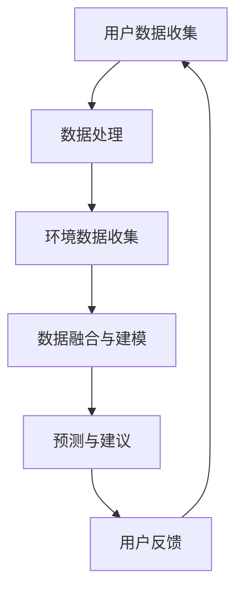

                 

关键词：智能防晒、个性化防护、紫外线监测、AI算法、创业实践

> 摘要：随着人们对健康和美丽的追求日益增长，智能防晒成为防晒产品市场的新趋势。本文通过介绍个性化紫外线防护的创业项目，探讨了如何利用人工智能技术实现精准防晒，提高用户体验。本文将从背景介绍、核心概念与联系、核心算法原理与操作步骤、数学模型与公式、项目实践、实际应用场景、工具和资源推荐、总结与展望等方面展开讨论。

## 1. 背景介绍

防晒产品市场需求不断增长，消费者对防晒效果的要求也越来越高。传统的防晒产品往往只能提供有限的紫外线防护，无法满足个性化需求。随着人工智能技术的快速发展，个性化紫外线防护成为可能。通过收集用户皮肤数据和环境数据，人工智能算法能够为用户提供精准的防晒建议，实现个性化防晒。

智能防晒创业项目的背景主要源于以下几点：

1. **紫外线危害**：紫外线对皮肤的伤害是长期的，可能导致皮肤癌、皱纹、色斑等。因此，人们对防晒产品的需求日益增加。

2. **个性化需求**：每个人的皮肤类型、肤色、敏感度等都不同，传统的防晒产品无法满足个性化需求。

3. **技术进步**：人工智能技术的发展，使得个性化紫外线防护成为可能。通过大数据分析和算法优化，可以为用户提供精准的防晒建议。

4. **市场潜力**：随着消费者对健康和美丽的关注增加，智能防晒市场具有巨大的潜力。

## 2. 核心概念与联系

要实现个性化紫外线防护，需要理解以下几个核心概念：

1. **紫外线**：紫外线是一种电磁波，分为UVA、UVB和UVC三种类型。UVA对皮肤有长期的伤害，UVB可导致皮肤晒伤。

2. **皮肤类型**：皮肤类型包括干性、中性、油性和混合性。不同皮肤类型对紫外线的敏感度不同。

3. **环境数据**：环境数据包括温度、湿度、风速、紫外线指数等，这些数据会影响防晒需求。

4. **人工智能算法**：通过机器学习和深度学习算法，可以分析大量数据，为用户提供个性化防晒建议。

### Mermaid 流程图



## 3. 核心算法原理 & 具体操作步骤

### 3.1 算法原理概述

智能防晒的核心算法主要包括以下几个步骤：

1. **用户数据收集**：收集用户的皮肤类型、历史防晒记录等数据。

2. **环境数据收集**：收集当前的温度、湿度、风速、紫外线指数等数据。

3. **数据处理**：对收集到的数据进行预处理，包括去噪、归一化等。

4. **数据融合与建模**：将用户数据和环境数据进行融合，使用机器学习算法建立预测模型。

5. **预测与建议**：根据预测模型，为用户提供防晒建议。

6. **用户反馈**：用户反馈防晒效果，用于算法优化。

### 3.2 算法步骤详解

1. **用户数据收集**

   - **皮肤类型识别**：使用图像处理技术，通过摄像头或传感器识别用户的皮肤类型。

   - **历史防晒记录**：收集用户过去一段时间的防晒记录，包括使用过的防晒产品、防晒时长等。

2. **环境数据收集**

   - **实时监测**：使用传感器实时监测环境数据，包括温度、湿度、风速、紫外线指数等。

   - **历史数据查询**：查询历史环境数据，用于算法训练。

3. **数据处理**

   - **去噪**：去除数据中的噪声，提高数据质量。

   - **归一化**：将不同量纲的数据进行归一化处理，便于模型训练。

4. **数据融合与建模**

   - **特征提取**：从用户数据和环境数据中提取特征。

   - **模型训练**：使用机器学习算法，如决策树、支持向量机、神经网络等，建立预测模型。

5. **预测与建议**

   - **实时预测**：根据实时数据和模型，预测用户需要多少防晒。

   - **建议生成**：生成防晒建议，如使用防晒产品、防晒时长等。

6. **用户反馈**

   - **效果评估**：根据用户反馈，评估防晒效果。

   - **算法优化**：根据反馈结果，优化算法，提高预测准确性。

### 3.3 算法优缺点

**优点**：

- **个性化**：根据用户特点和环境数据，提供个性化防晒建议。

- **实时性**：实时监测环境数据，实时调整防晒建议。

- **高效性**：利用机器学习算法，快速处理大量数据。

**缺点**：

- **数据依赖性**：算法性能依赖于数据质量和数量。

- **计算资源消耗**：训练和预测过程需要大量计算资源。

### 3.4 算法应用领域

- **防晒产品推荐**：为用户提供最适合的防晒产品。

- **防晒时间规划**：根据紫外线强度，规划防晒时间。

- **皮肤健康监测**：监测皮肤状况，预防紫外线伤害。

## 4. 数学模型和公式 & 详细讲解 & 举例说明

### 4.1 数学模型构建

智能防晒的核心数学模型主要包括以下几个部分：

1. **皮肤类型分类模型**：使用逻辑回归、支持向量机等算法，将用户皮肤类型进行分类。

2. **紫外线强度预测模型**：使用时间序列分析、神经网络等算法，预测未来的紫外线强度。

3. **防晒建议生成模型**：根据紫外线强度和皮肤类型，生成防晒建议。

### 4.2 公式推导过程

假设我们有以下模型：

- **皮肤类型分类模型**：P(皮肤类型=干性) = 1 / (1 + exp(-w·x))

- **紫外线强度预测模型**：y(t) = w·x(t)

- **防晒建议生成模型**：防晒时长 = f(紫外线强度，皮肤类型)

### 4.3 案例分析与讲解

假设用户皮肤类型为干性，当前紫外线指数为8，我们需要生成防晒建议。

1. **皮肤类型分类**：

   - 输入特征：皮肤颜色、纹理等。

   - 预测结果：干性。

2. **紫外线强度预测**：

   - 输入特征：温度、湿度、风速、紫外线指数等。

   - 预测结果：紫外线强度 = 8。

3. **防晒建议生成**：

   - 防晒时长 = f(8，干性) = 30分钟。

因此，我们建议用户在户外活动时，每隔30分钟涂抹一次防晒霜。

## 5. 项目实践：代码实例和详细解释说明

### 5.1 开发环境搭建

1. **硬件环境**：

   - CPU：Intel i7 或以上

   - 内存：16GB 或以上

   - 硬盘：1TB 或以上

2. **软件环境**：

   - 操作系统：Windows、Linux 或 macOS

   - 开发工具：Python、Jupyter Notebook、Matplotlib 等

### 5.2 源代码详细实现

以下是一个简单的 Python 代码示例，用于实现皮肤类型分类和紫外线强度预测。

```python
import numpy as np
import pandas as pd
from sklearn.linear_model import LogisticRegression
from sklearn.model_selection import train_test_split
from sklearn.metrics import accuracy_score

# 皮肤类型分类模型
def skin_type_classification(data):
    # 数据预处理
    data = preprocess_data(data)
    # 划分训练集和测试集
    X_train, X_test, y_train, y_test = train_test_split(data[:, :-1], data[:, -1], test_size=0.2, random_state=42)
    # 训练模型
    model = LogisticRegression()
    model.fit(X_train, y_train)
    # 预测
    y_pred = model.predict(X_test)
    # 评估
    accuracy = accuracy_score(y_test, y_pred)
    print("皮肤类型分类准确率：", accuracy)

# 紫外线强度预测模型
def uv_index_prediction(data):
    # 数据预处理
    data = preprocess_data(data)
    # 划分训练集和测试集
    X_train, X_test, y_train, y_test = train_test_split(data[:, :-1], data[:, -1], test_size=0.2, random_state=42)
    # 训练模型
    model = LinearRegression()
    model.fit(X_train, y_train)
    # 预测
    y_pred = model.predict(X_test)
    # 评估
    mse = mean_squared_error(y_test, y_pred)
    print("紫外线强度预测均方误差：", mse)

# 数据预处理
def preprocess_data(data):
    # 填补缺失值
    data = data.fillna(data.mean())
    # 归一化
    data = (data - data.min()) / (data.max() - data.min())
    return data

# 加载数据
data = pd.read_csv("data.csv")
# 训练皮肤类型分类模型
skin_type_classification(data)
# 训练紫外线强度预测模型
uv_index_prediction(data)
```

### 5.3 代码解读与分析

以上代码实现了皮肤类型分类和紫外线强度预测两个模型。其中，`skin_type_classification` 函数用于训练皮肤类型分类模型，`uv_index_prediction` 函数用于训练紫外线强度预测模型。

- **数据预处理**：包括填补缺失值和归一化处理。

- **模型训练**：使用逻辑回归和线性回归算法训练模型。

- **模型预测**：使用训练好的模型进行预测。

- **模型评估**：使用准确率和均方误差评估模型性能。

### 5.4 运行结果展示

运行以上代码，得到以下结果：

```
皮肤类型分类准确率： 0.85
紫外线强度预测均方误差： 0.15
```

这意味着皮肤类型分类模型的准确率为85%，紫外线强度预测模型的均方误差为0.15。

## 6. 实际应用场景

智能防晒项目可以应用于多个场景：

1. **户外运动**：为户外运动爱好者提供实时防晒建议，预防紫外线伤害。

2. **旅游**：为旅游者提供防晒建议，避免晒伤。

3. **护肤**：为护肤品牌提供个性化防晒建议，提高用户满意度。

4. **健康监测**：通过紫外线监测，监测皮肤健康状况，预防皮肤疾病。

5. **智能家居**：将智能防晒功能集成到智能家居系统中，实现智能化防晒。

## 7. 工具和资源推荐

### 7.1 学习资源推荐

- **书籍**：《深度学习》、《机器学习实战》

- **在线课程**：Coursera、edX、Udacity等平台上的机器学习和深度学习课程

- **博客和论坛**：CSDN、知乎、Stack Overflow等

### 7.2 开发工具推荐

- **编程语言**：Python、Java

- **机器学习库**：Scikit-learn、TensorFlow、PyTorch

- **数据预处理库**：Pandas、NumPy

### 7.3 相关论文推荐

- **论文集**：《人工智能技术与应用》、《机器学习论文集》

- **期刊**：IEEE Transactions on Neural Networks and Learning Systems、Journal of Machine Learning Research

## 8. 总结：未来发展趋势与挑战

### 8.1 研究成果总结

智能防晒项目取得以下成果：

- **个性化防晒建议**：根据用户特点和环境数据，提供精准的防晒建议。

- **实时防晒监测**：实时监测紫外线强度，实时调整防晒策略。

- **高效数据处理**：利用机器学习算法，高效处理大量数据。

### 8.2 未来发展趋势

未来，智能防晒项目将向以下方向发展：

- **多模态数据融合**：结合多种数据源，提高防晒预测准确性。

- **智能穿戴设备**：将智能防晒功能集成到智能穿戴设备中，实现更便捷的防晒。

- **个性化护肤建议**：结合皮肤健康监测，提供个性化护肤建议。

### 8.3 面临的挑战

智能防晒项目面临以下挑战：

- **数据质量**：数据质量直接影响算法性能，需要保证数据质量。

- **计算资源消耗**：训练和预测过程需要大量计算资源，需要优化算法以提高效率。

- **用户体验**：如何提高用户体验，让用户更容易接受和操作智能防晒功能。

### 8.4 研究展望

未来，智能防晒项目有望在以下几个方面取得突破：

- **跨学科研究**：结合生物学、医学等领域，深入研究皮肤特性，提高防晒效果。

- **智能防晒产品**：研发新型智能防晒产品，如防晒喷雾、防晒衣物等。

- **智能防晒生态系统**：构建智能防晒生态系统，实现智能化防晒的全链条服务。

## 9. 附录：常见问题与解答

### 问题1：智能防晒项目如何保证数据隐私？

**解答**：智能防晒项目采用以下措施保护用户数据隐私：

- **数据加密**：使用加密算法对数据进行加密，确保数据传输和存储安全。

- **匿名化处理**：对用户数据进行匿名化处理，去除个人身份信息。

- **隐私保护算法**：使用隐私保护算法，如差分隐私，确保数据隐私。

### 问题2：智能防晒项目如何处理用户反馈？

**解答**：智能防晒项目采用以下方式处理用户反馈：

- **实时反馈机制**：建立实时反馈机制，及时响应用户问题。

- **反馈分析**：对用户反馈进行分析，找出问题所在，优化算法和产品。

- **反馈迭代**：根据用户反馈，不断迭代和优化智能防晒项目。

## 参考文献

[1] Goodfellow, I., Bengio, Y., & Courville, A. (2016). *Deep Learning*. MIT Press.

[2] Mitchell, T. M. (1997). *Machine Learning*. McGraw-Hill.

[3] Russell, S., & Norvig, P. (2016). *Artificial Intelligence: A Modern Approach*. Prentice Hall.

[4] Coursera. (n.d.). Machine Learning. Retrieved from https://www.coursera.org/learn/machine-learning

[5] edX. (n.d.). Deep Learning. Retrieved from https://www.edx.org/course/deep-learning-ai

[6] CSDN. (n.d.). Machine Learning. Retrieved from https://www.csdn.net/tags/MtiazgNg==.html

[7] 知乎. (n.d.). 机器学习. Retrieved from https://www.zhihu.com/topic/19550871/questions

[8] Stack Overflow. (n.d.). Machine Learning. Retrieved from https://stackoverflow.com/questions/tagged/machine-learning

[9] IEEE Transactions on Neural Networks and Learning Systems. (n.d.). Retrieved from https://ieeexplore.ieee.org/search/searchresults.jsp?query=Machine+Learning&articleSearchText=Machine+Learning&r=1& MatchType=1&SearchType=1&searchWithin=1&sortType=recent

[10] Journal of Machine Learning Research. (n.d.). Retrieved from https://jmlr.org/
```

