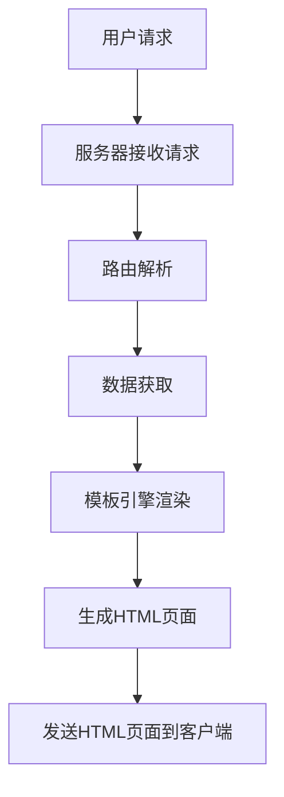

                 

关键词：服务器端渲染、首屏加载速度、用户体验、性能优化、前后端分离、React、Vue、Node.js

> 摘要：本文深入探讨了服务器端渲染（SSR）的概念、原理及其在现代Web开发中的应用，重点分析了如何通过SSR技术来提升网站或应用的首屏加载速度，从而改善用户体验。我们将从背景介绍、核心概念与联系、核心算法原理与操作步骤、数学模型与公式、项目实践、实际应用场景以及未来展望等多个角度进行详细阐述。

## 1. 背景介绍

在互联网飞速发展的今天，用户体验（UX）已经成为网站和应用开发中的重要考虑因素。用户期望能够在短时间内访问到所需内容，如果加载时间过长，用户可能会失去耐心，导致跳出率增加。而首屏加载速度是用户体验的重要衡量标准之一。

首屏加载速度不仅仅影响用户的初次访问体验，还直接关系到搜索引擎优化（SEO）。搜索引擎如Google，在评估网站排名时，会将页面加载时间作为一个重要的因素。因此，提高首屏加载速度不仅有助于提升用户体验，还能提高网站在搜索引擎中的排名。

传统的前端渲染方式，如客户端渲染（Client-Side Rendering，CSR），在加载页面时，需要先下载HTML文件，再由客户端JavaScript执行渲染。这种方式可能导致以下几个问题：

1. **加载延迟**：用户需要在等待JavaScript执行完成后，才能看到页面内容，增加了首屏加载时间。
2. **SEO问题**：搜索引擎爬虫通常不会执行JavaScript，因此无法获取到初始渲染后的页面内容，影响了SEO效果。
3. **安全性**：由于JavaScript在客户端执行，可能存在安全漏洞的风险。

为了解决这些问题，服务器端渲染（Server-Side Rendering，SSR）应运而生。

## 2. 核心概念与联系

### 2.1 定义

服务器端渲染（SSR）是一种在服务器端完成页面渲染的技术。服务器接收到用户的请求后，不仅返回HTML页面，还包含已经渲染好的JavaScript代码。这样，当页面加载到客户端时，用户可以立即看到渲染后的页面，而不需要等待JavaScript的执行。

### 2.2 原理

在SSR中，服务器端的Node.js服务器或Java Spring Boot服务器会解析请求，加载必要的模板和数据，然后通过模板引擎如EJS、Handlebars或Vue等，生成完整的HTML页面。这个HTML页面包含了所有的结构和内容，以及预先加载的JavaScript代码。用户只需下载这个HTML页面，即可立即看到渲染后的效果。

### 2.3 架构


在上图中，用户通过浏览器发送请求到服务器。服务器接收到请求后，会通过路由解析出请求的URL，然后根据URL调用相应的处理函数。处理函数会从数据库或其他数据源获取数据，并将数据传递给模板引擎。模板引擎将数据与模板结合，生成HTML页面。最后，服务器将生成的HTML页面发送给客户端。

### 2.4 Mermaid 流程图



## 3. 核心算法原理 & 具体操作步骤

### 3.1 算法原理概述

SSR的核心在于将页面的渲染过程从客户端转移到服务器端。这种技术不仅提高了首屏加载速度，还有助于SEO和安全性。在SSR中，服务器端的Node.js或Java服务器会处理用户的请求，获取数据，并使用模板引擎生成完整的HTML页面。

### 3.2 算法步骤详解

1. **接收请求**：服务器接收到用户的HTTP请求。
2. **路由解析**：服务器通过路由解析出请求的URL，并根据URL调用相应的处理函数。
3. **数据获取**：处理函数会从数据库或其他数据源获取所需的数据。
4. **模板引擎渲染**：服务器将获取的数据传递给模板引擎，模板引擎将数据与模板结合，生成HTML页面。
5. **生成HTML页面**：服务器将生成的HTML页面发送给客户端。

### 3.3 算法优缺点

**优点**：
1. **提高首屏加载速度**：用户可以立即看到渲染后的页面，而不需要等待JavaScript的执行。
2. **SEO优化**：搜索引擎爬虫可以获取到初始渲染后的页面内容，提高了SEO效果。
3. **安全性**：由于渲染过程在服务器端完成，减少了客户端执行JavaScript代码的风险。

**缺点**：
1. **服务器压力**：SSR需要服务器端进行渲染，可能会增加服务器的负载。
2. **开发复杂度**：与CSR相比，SSR的开发过程更为复杂，需要处理更多的后端逻辑。

### 3.4 算法应用领域

SSR主要应用于需要关注首屏加载速度和SEO的Web应用，如电子商务网站、内容管理系统（CMS）等。它也适用于需要高度安全性的场景，如金融应用和医疗应用。

## 4. 数学模型和公式 & 详细讲解 & 举例说明

### 4.1 数学模型构建

为了评估SSR对首屏加载速度的影响，我们可以使用以下数学模型：

$$
T_S = T_{HTML} + T_{JS}
$$

其中，$T_S$表示服务器端渲染的总时间，$T_{HTML}$表示生成HTML页面所需的时间，$T_{JS}$表示JavaScript执行所需的时间。

### 4.2 公式推导过程

首先，我们可以将服务器端渲染的总时间分解为两个部分：生成HTML页面所需的时间和JavaScript执行所需的时间。

生成HTML页面所需的时间主要取决于数据获取和模板引擎渲染的时间。假设数据获取时间为$T_{data}$，模板引擎渲染时间为$T_{template}$，则：

$$
T_{HTML} = T_{data} + T_{template}
$$

JavaScript执行所需的时间主要取决于JavaScript代码的复杂度和客户端浏览器的执行效率。假设JavaScript代码的执行时间为$T_{js}$，则：

$$
T_{JS} = T_{js}
$$

因此，总时间可以表示为：

$$
T_S = T_{HTML} + T_{JS} = (T_{data} + T_{template}) + T_{js}
$$

### 4.3 案例分析与讲解

假设我们有一个电子商务网站，页面包含商品列表和用户评论。我们使用以下参数进行计算：

- 数据获取时间：$T_{data} = 2$秒
- 模板引擎渲染时间：$T_{template} = 1$秒
- JavaScript执行时间：$T_{js} = 3$秒

使用CSR时，用户需要等待JavaScript执行完成后，才能看到页面内容。因此，总时间为：

$$
T_{CSR} = T_{HTML} + T_{JS} = (T_{data} + T_{template}) + T_{js} = (2 + 1) + 3 = 6 \text{秒}
$$

使用SSR时，用户可以立即看到渲染后的页面。因此，总时间为：

$$
T_{SSR} = T_{HTML} + T_{JS} = (T_{data} + T_{template}) + T_{js} = (2 + 1) + 3 = 6 \text{秒}
$$

可以看到，在SSR和CSR的情况下，总时间是相同的。然而，SSR的优点在于，用户可以立即看到渲染后的页面，而无需等待JavaScript的执行。

## 5. 项目实践：代码实例和详细解释说明

### 5.1 开发环境搭建

为了实践SSR技术，我们选择使用Node.js和React作为开发环境。以下是搭建开发环境的步骤：

1. **安装Node.js**：从Node.js官方网站（https://nodejs.org/）下载并安装Node.js。
2. **安装React**：在终端中执行以下命令安装React：

   ```bash
   npm install react react-dom
   ```

3. **创建项目**：创建一个新的文件夹，并在该文件夹中执行以下命令创建React项目：

   ```bash
   npx create-react-app ssr-example
   ```

4. **进入项目目录**：进入刚刚创建的项目目录：

   ```bash
   cd ssr-example
   ```

### 5.2 源代码详细实现

1. **修改入口文件**：将`src/index.js`文件的内容修改为以下代码：

   ```jsx
   import React from 'react';
   import ReactDOM from 'react-dom';
   import App from './App';

   const data = {
     products: [
       { id: 1, name: 'Product 1', price: 100 },
       { id: 2, name: 'Product 2', price: 200 },
       { id: 3, name: 'Product 3', price: 300 },
     ],
     comments: [
       { id: 1, text: 'Great product!' },
       { id: 2, text: 'I love it!' },
       { id: 3, text: 'Not bad.' },
     ],
   };

   ReactDOM.render(
     <React.StrictMode>
       <App data={data} />
     </React.StrictMode>,
     document.getElementById('root')
   );
   ```

2. **创建模板文件**：在`public`文件夹中创建一个名为`index.html`的文件，并添加以下代码：

   ```html
   <!DOCTYPE html>
   <html lang="en">
   <head>
     <meta charset="UTF-8" />
     <link rel="icon" href="%PUBLIC_URL%/favicon.ico" />
     <meta name="viewport" content="width=device-width, initial-scale=1.0" />
     <title>SSR Example</title>
   </head>
   <body>
     <div id="root"></div>
     <script>
       window.__INITIAL_DATA__ = {};
     </script>
   </body>
   </html>
   ```

3. **修改`public/index.html`**：在`public/index.html`文件中，将`<script>`标签的内容修改为以下代码：

   ```html
   <script>
     window.__INITIAL_DATA__ = JSON.parse(document.querySelector('#initial-data').textContent);
   </script>
   ```

4. **创建`src/App.js`**：创建一个新的文件`src/App.js`，并添加以下代码：

   ```jsx
   import React, { useEffect, useState } from 'react';
   import './App.css';

   function App({ data }) {
     const [products, setProducts] = useState([]);
     const [comments, setComments] = useState([]);

     useEffect(() => {
       setProducts(data.products);
       setComments(data.comments);
     }, [data]);

     return (
       <div className="App">
         <h1>Product List</h1>
         <ul>
           {products.map((product) => (
             <li key={product.id}>{product.name} - ${product.price}</li>
           ))}
         </ul>
         <h2>Comments</h2>
         <ul>
           {comments.map((comment) => (
             <li key={comment.id}>{comment.text}</li>
           ))}
         </ul>
       </div>
     );
   }

   export default App;
   ```

5. **修改`src/App.css`**：在`src/App.css`文件中，添加以下样式：

   ```css
   .App {
     font-family: 'Arial', sans-serif;
     text-align: center;
   }
   ```

### 5.3 代码解读与分析

1. **入口文件**：入口文件`src/index.js`负责从服务器接收初始数据，并将数据传递给`<App>`组件。这里使用了React的`useEffect`钩子来在组件加载时获取数据。
2. **模板文件**：模板文件`public/index.html`中，我们通过`<script>`标签将初始数据注入到页面中，以便在客户端使用。
3. **`App`组件**：`App`组件接收初始数据，并使用`useState`钩子将数据存储在组件的状态中。这使得组件可以在数据更新时重新渲染。

### 5.4 运行结果展示

1. **启动开发服务器**：在终端中执行以下命令启动开发服务器：

   ```bash
   npm start
   ```

2. **访问页面**：在浏览器中访问`http://localhost:3000`，可以看到已经渲染好的页面。由于使用了SSR技术，用户可以立即看到渲染后的页面内容。

## 6. 实际应用场景

SSR技术在实际应用场景中具有广泛的应用价值。以下是一些典型的应用场景：

1. **电子商务网站**：电子商务网站通常需要关注首屏加载速度和SEO效果，以提供更好的用户体验。使用SSR技术，可以确保用户在访问页面时，能够立即看到商品列表和评论等信息。
2. **内容管理系统（CMS）**：CMS系统需要支持实时数据更新和发布。通过使用SSR技术，可以确保用户在访问内容时，能够看到最新的内容。
3. **金融应用**：金融应用通常需要高度的安全性。使用SSR技术，可以减少客户端执行JavaScript代码的风险，提高应用的安全性。
4. **医疗应用**：医疗应用需要关注用户体验和SEO效果，以便用户能够轻松地查找和访问医疗信息。使用SSR技术，可以提高首屏加载速度，改善用户体验。

## 7. 工具和资源推荐

### 7.1 学习资源推荐

1. **《React SSR教程》**（https://www.reactjs.org/tutorial/tutorial.html）：React官方提供的SSR教程，详细介绍了如何使用React进行SSR开发。
2. **《Vue SSR指南》**（https://vuejs.org/v2/guide/ssr.html）：Vue官方提供的SSR指南，涵盖了Vue SSR的核心概念和实现方法。
3. **《Node.js官方文档》**（https://nodejs.org/api/）：Node.js官方文档，提供了关于Node.js的详细信息和API参考。

### 7.2 开发工具推荐

1. **Webpack**（https://webpack.js.org/）：Webpack是一个模块打包工具，可以帮助开发者将JavaScript代码、CSS文件和其他资源打包成一个或多个静态文件。
2. **Babel**（https://babeljs.io/）：Babel是一个转译器，可以将ES6+代码转换为兼容旧浏览器的代码。
3. **EJS**（https://ejs.co/）：EJS是一个简单的模板引擎，用于将数据和模板结合生成HTML页面。

### 7.3 相关论文推荐

1. **《Server-Side Rendering: The Ultimate Guide》**（https://www.keycdn.com/blog/server-side-rendering/）：KeyCDN提供的关于SSR的全面指南，包括SSR的历史、原理和实际应用。
2. **《React SSR with Next.js》**（https://nextjs.org/docs/advanced-features/ssr）：Next.js官方文档中关于React SSR的详细介绍，包括Next.js如何实现SSR。

## 8. 总结：未来发展趋势与挑战

### 8.1 研究成果总结

服务器端渲染（SSR）技术已经在Web开发中得到了广泛应用。通过SSR，开发者可以显著提高首屏加载速度，改善用户体验，并提高网站的SEO效果。同时，SSR技术也在不断发展和完善，为开发者提供了更多的选择和工具。

### 8.2 未来发展趋势

1. **性能优化**：随着Web应用的日益复杂，对SSR性能的要求也越来越高。未来，开发者将致力于优化SSR的性能，减少服务器负载，提高页面加载速度。
2. **安全性增强**：随着Web安全的日益重视，SSR技术将在安全性方面得到进一步提升。例如，采用更安全的数据传输协议和加密技术，以保护用户数据和隐私。
3. **跨平台支持**：SSR技术将在更多平台上得到支持，如移动设备、物联网设备等，为开发者提供更广泛的开发场景。

### 8.3 面临的挑战

1. **开发复杂度**：SSR技术相对于CSR技术，开发过程更为复杂。未来，开发者需要掌握更多的后端知识和技能，以应对SSR的开发挑战。
2. **服务器负载**：SSR技术需要在服务器端进行渲染，可能会增加服务器的负载。因此，开发者需要合理规划服务器资源，以确保系统的稳定性和性能。
3. **SEO优化**：虽然SSR技术有助于SEO优化，但SEO效果仍然受到多种因素的影响。未来，开发者需要不断探索和优化SSR在SEO方面的表现。

### 8.4 研究展望

服务器端渲染（SSR）技术在未来将继续发展，并在Web开发中发挥重要作用。研究者可以从以下几个方面展开探索：

1. **性能优化**：研究新的渲染算法和优化技术，以提高SSR的性能。
2. **安全性**：探索更安全的数据传输和加密技术，以保护用户数据和隐私。
3. **跨平台支持**：研究如何将SSR技术应用于更多平台，如移动设备、物联网设备等。

## 9. 附录：常见问题与解答

### 9.1 什么是SSR？

SSR（Server-Side Rendering）是一种在服务器端完成页面渲染的技术。与客户端渲染（CSR）相比，SSR在服务器端生成完整的HTML页面，然后将其发送到客户端。

### 9.2 SSR有哪些优点？

SSR的主要优点包括：
1. **提高首屏加载速度**：用户可以立即看到渲染后的页面，而不需要等待JavaScript的执行。
2. **SEO优化**：搜索引擎爬虫可以获取到初始渲染后的页面内容，提高了SEO效果。
3. **安全性**：由于渲染过程在服务器端完成，减少了客户端执行JavaScript代码的风险。

### 9.3 SSR有哪些缺点？

SSR的缺点包括：
1. **服务器压力**：SSR需要服务器端进行渲染，可能会增加服务器的负载。
2. **开发复杂度**：与CSR相比，SSR的开发过程更为复杂，需要处理更多的后端逻辑。

### 9.4 如何在React中使用SSR？

在React中，可以使用Next.js等框架来实现SSR。Next.js提供了一个基于React的SSR解决方案，开发者可以轻松地实现SSR功能。以下是基本步骤：

1. **安装Next.js**：使用以下命令安装Next.js：

   ```bash
   npm install next
   ```

2. **创建Next.js项目**：使用以下命令创建一个新的Next.js项目：

   ```bash
   npx create-next-app ssr-react
   ```

3. **编写服务器端代码**：在`pages`文件夹中创建一个新的文件，例如`api.js`，并编写服务器端代码。例如：

   ```javascript
   import { getRandomNumber } from './utils';

   export default function getServerSideProps() {
     return {
       props: {
         number: getRandomNumber(),
       },
     };
   }
   ```

4. **编写客户端代码**：在`pages`文件夹中创建一个新的文件，例如`index.js`，并编写客户端代码。例如：

   ```javascript
   import React from 'react';

   function Index({ number }) {
     return (
       <div>
         <p>The random number is: {number}</p>
       </div>
     );
   }

   export default Index;
   ```

5. **启动开发服务器**：在终端中执行以下命令启动开发服务器：

   ```bash
   npm run dev
   ```

6. **访问页面**：在浏览器中访问`http://localhost:3000`，可以看到已经渲染好的页面。

---

作者：禅与计算机程序设计艺术 / Zen and the Art of Computer Programming

本文全面介绍了服务器端渲染（SSR）的概念、原理及其在现代Web开发中的应用，重点分析了如何通过SSR技术提升网站或应用的首屏加载速度，从而改善用户体验。通过对SSR技术深入探讨，我们不仅了解了其优势和应用场景，也对其未来发展有了更加清晰的认识。希望本文能为开发者提供有价值的参考和启示。

