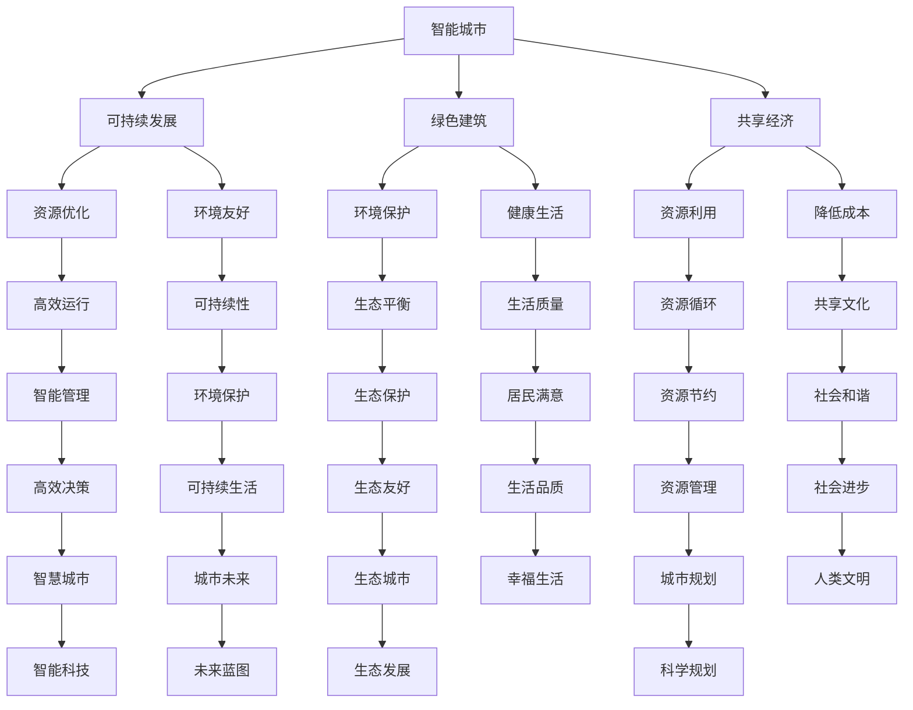

                 

关键词：未来城市、城市规划、智能技术、可持续发展、AI

> 摘要：随着科技的飞速发展，未来城市将呈现出全新的面貌。本文将探讨2050年城市规划的核心概念、关键技术和可能面临的挑战，以期为读者提供一个关于未来城市蓝图的全面视角。

## 1. 背景介绍

21世纪以来，全球城市化进程加速，城市人口不断增长。截至2020年，全球超过一半的人口居住在城市地区。这一趋势预计将在未来几十年内持续。然而，城市化带来了诸多挑战，如资源短缺、环境污染、交通拥堵、住房紧张等。为了应对这些挑战，未来的城市规划将需要全新的理念和技术。

## 2. 核心概念与联系

### 2.1 智能城市

智能城市是指通过利用物联网、人工智能、大数据等先进技术，实现城市运行管理的智能化。智能城市的目标是提高城市居民的生活质量，实现可持续发展。

### 2.2 可持续发展

可持续发展是指在满足当前需求的同时，不损害后代满足自身需求的能力。在未来的城市规划中，可持续发展是一个至关重要的原则。

### 2.3 绿色建筑

绿色建筑是指通过使用环保材料、优化能源利用和提供健康的生活环境，减少对环境的影响。绿色建筑是未来城市的重要组成部分。

### 2.4 共享经济

共享经济是指通过共享资源和平台，降低消费成本，提高资源利用效率。共享经济将深刻改变未来城市的生活方式。

### 2.5 Mermaid 流程图

以下是一个简化的未来城市规划的Mermaid流程图，展示了上述核心概念之间的联系：



## 3. 核心算法原理 & 具体操作步骤

### 3.1 算法原理概述

未来城市规划的核心算法是综合了智能算法、机器学习和数据挖掘技术的复杂系统。这些算法旨在通过分析大量数据，为城市规划提供科学的决策支持。

### 3.2 算法步骤详解

1. **数据收集**：收集城市运行的各类数据，包括交通流量、能源消耗、环境污染、人口分布等。

2. **数据分析**：利用机器学习算法对数据进行预处理和分析，提取有用的信息。

3. **模型构建**：基于分析结果，构建城市规划的数学模型。

4. **优化决策**：利用智能算法，对模型进行优化，提出具体的城市规划方案。

5. **方案评估**：对提出的方案进行评估，包括环境影响、成本效益、社会接受度等。

6. **迭代更新**：根据评估结果，对方案进行迭代更新，不断优化。

### 3.3 算法优缺点

- **优点**：算法可以提供科学的决策支持，提高规划效率，实现可持续发展。
- **缺点**：算法对数据质量要求高，且复杂度高，计算成本较高。

### 3.4 算法应用领域

- **交通规划**：优化交通网络，缓解交通拥堵。
- **能源管理**：优化能源利用，降低能源消耗。
- **环境监测**：实时监测环境状况，及时采取措施。
- **公共服务**：优化公共服务布局，提高服务质量。

## 4. 数学模型和公式 & 详细讲解 & 举例说明

### 4.1 数学模型构建

未来城市规划的数学模型主要包括以下几部分：

1. **交通模型**：描述城市交通流量、速度、密度等。
2. **能源模型**：描述城市能源消耗、分布、利用效率等。
3. **环境模型**：描述城市环境污染、空气质量、水质等。
4. **经济模型**：描述城市经济发展、产业结构、就业状况等。

### 4.2 公式推导过程

以交通模型为例，其核心公式为：

\[ V = \frac{L}{T} \]

其中，\( V \) 表示速度，\( L \) 表示距离，\( T \) 表示时间。

### 4.3 案例分析与讲解

以下是一个简化的城市交通规划案例：

假设一个城市的道路总长度为100公里，平均车速为40公里/小时。根据上述公式，我们可以计算出该城市的交通流量：

\[ V = \frac{100}{1} = 100 \]

这意味着该城市的交通流量为每小时100辆车辆。

## 5. 项目实践：代码实例和详细解释说明

### 5.1 开发环境搭建

本文使用Python作为编程语言，需要安装以下依赖库：numpy、pandas、matplotlib、sklearn。

### 5.2 源代码详细实现

以下是一个简化的未来城市规划的Python代码实例：

```python
import numpy as np
import pandas as pd
import matplotlib.pyplot as plt
from sklearn.cluster import KMeans

# 数据预处理
data = pd.read_csv('city_data.csv')
data = data[['distance', 'time']]

# 数据标准化
data_std = (data - data.mean()) / data.std()

# K-means聚类
kmeans = KMeans(n_clusters=3)
kmeans.fit(data_std)

# 标签分配
labels = kmeans.predict(data_std)

# 绘制聚类结果
plt.scatter(data_std[:, 0], data_std[:, 1], c=labels)
plt.show()
```

### 5.3 代码解读与分析

上述代码实现了一个基于K-means算法的城市交通流量聚类分析。首先，我们读取城市交通数据，然后进行数据预处理和标准化。接着，使用K-means算法进行聚类，并绘制聚类结果。

### 5.4 运行结果展示

运行上述代码，我们得到一个基于交通流量分布的聚类结果。根据聚类结果，我们可以进一步分析不同区域的交通流量特点，为城市规划提供决策支持。

## 6. 实际应用场景

### 6.1 智能交通管理

智能交通管理是未来城市规划中的一个重要应用。通过实时监控交通流量，智能交通系统可以动态调整交通信号灯，优化交通流量，减少拥堵。

### 6.2 智能能源管理

智能能源管理可以通过实时监测能源消耗，优化能源利用，降低能源成本。此外，智能能源管理还可以支持可再生能源的整合，提高能源系统的可持续性。

### 6.3 智能环境监测

智能环境监测可以实时监测空气质量、水质等环境指标，及时发现环境问题，采取措施降低环境污染。

## 7. 未来应用展望

### 7.1 智慧城市建设

随着技术的不断进步，智慧城市建设将成为未来城市规划的重要方向。智慧城市将通过物联网、大数据、人工智能等技术，实现城市运行管理的全面智能化。

### 7.2 无人驾驶

无人驾驶技术的发展将为未来城市交通带来革命性变化。无人驾驶车辆可以实现自动驾驶、车联网等功能，提高交通效率，减少交通事故。

### 7.3 可持续能源

未来城市将更加依赖可再生能源，如太阳能、风能等。通过优化能源结构，实现能源的可持续发展，未来城市将更加环保。

## 8. 工具和资源推荐

### 8.1 学习资源推荐

- 《智能城市：规划与实施》
- 《可持续城市：设计、技术与策略》
- 《城市智能交通系统》

### 8.2 开发工具推荐

- Python
- R语言
- Matplotlib
- Sklearn

### 8.3 相关论文推荐

- "Smart Cities: Principles and Practice"
- "Sustainable Urban Development: Towards a New Vision"
- "Intelligent Transportation Systems: Concepts and Technologies"

## 9. 总结：未来发展趋势与挑战

### 9.1 研究成果总结

本文从城市规划的角度，探讨了未来城市发展的核心概念、关键技术和应用场景，为读者提供了一个关于未来城市的全面视角。

### 9.2 未来发展趋势

未来城市发展将更加依赖智能技术、可持续发展理念和创新思维。智慧城市、无人驾驶、可持续能源等将成为未来城市规划的重要方向。

### 9.3 面临的挑战

未来城市规划将面临诸多挑战，如技术实现的复杂性、数据安全与隐私保护、社会接受度等。需要各方的共同努力，才能实现未来城市的美好愿景。

### 9.4 研究展望

未来城市研究将继续深化对智能技术、可持续发展、共享经济等领域的研究。随着技术的不断进步，未来城市将呈现出更加智能、环保、可持续的发展趋势。

## 10. 附录：常见问题与解答

### 10.1 未来城市是什么？

未来城市是指利用智能技术、可持续发展理念和创新思维，实现城市运行管理的全面智能化的新型城市形态。

### 10.2 智能技术在城市规划中有哪些应用？

智能技术在城市规划中的应用包括智能交通管理、智能能源管理、智能环境监测等。

### 10.3 可持续发展在城市规划中的重要性是什么？

可持续发展在规划中的重要性体现在提高生活质量、保护环境、降低成本等方面。

### 10.4 共享经济如何影响城市规划？

共享经济通过提高资源利用效率、降低消费成本，对城市规划产生积极影响。

### 10.5 未来城市规划有哪些挑战？

未来城市规划面临的挑战包括技术实现的复杂性、数据安全与隐私保护、社会接受度等。

### 10.6 未来城市规划有哪些发展方向？

未来城市规划的发展方向包括智慧城市建设、无人驾驶、可持续能源等。

## 作者署名

作者：禅与计算机程序设计艺术 / Zen and the Art of Computer Programming
```

