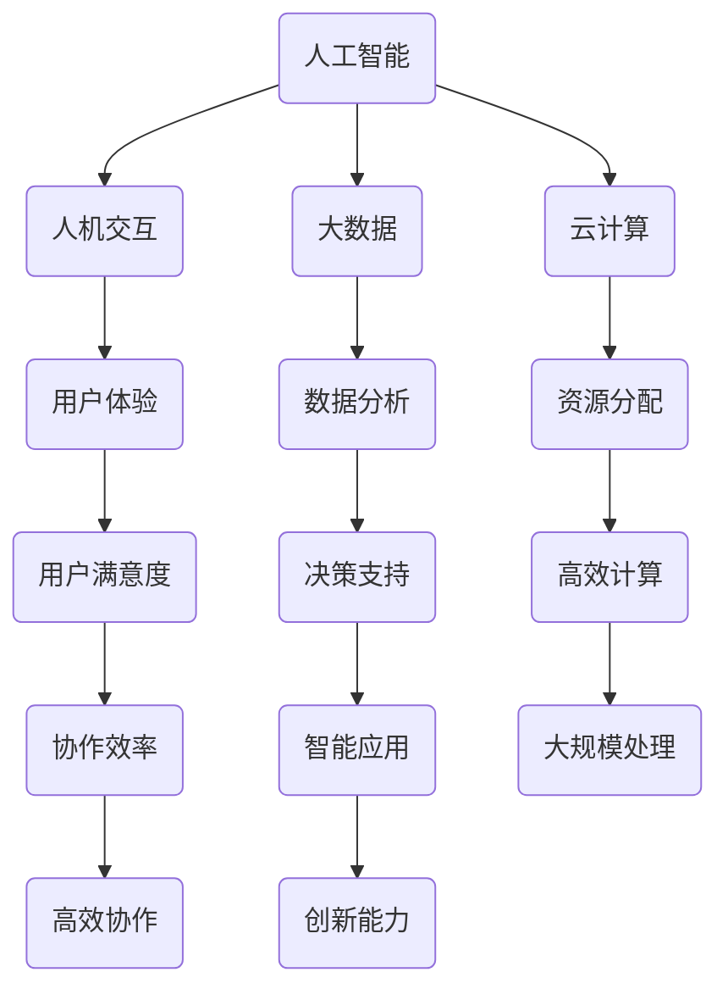

                 

## 1. 背景介绍

在当今快速变化的世界中，技术的发展已经深刻地影响了我们的工作和生活方式。尤其是人工智能（AI）技术的崛起，正在引发一场前所未有的产业革命。人机协作（Human-AI Collaboration）作为一种全新的工作模式，逐渐成为未来职业发展的关键趋势。本文旨在探讨人机协作的背景、核心概念、算法原理、数学模型、项目实践以及未来应用场景，旨在为读者提供一个全面、深入的理解。

人机协作不仅仅是技术的进步，更是对传统工作模式的颠覆和重塑。它意味着人类和机器可以共享知识和技能，实现更高效、更智能的工作流程。这种协作模式的出现，不仅提高了工作效率，还促进了创新和创造力的提升。

本文将按照以下结构展开：

- **背景介绍**：阐述人机协作的背景和意义。
- **核心概念与联系**：介绍人机协作的关键概念及其相互关系。
- **核心算法原理 & 具体操作步骤**：分析人机协作的核心算法，并详细解释其操作步骤。
- **数学模型和公式**：介绍人机协作中的数学模型和公式，并进行详细讲解。
- **项目实践**：通过实际代码实例展示人机协作的具体应用。
- **实际应用场景**：探讨人机协作在不同行业中的应用场景。
- **未来应用展望**：对人机协作的未来发展进行展望。
- **工具和资源推荐**：推荐学习和实践人机协作的相关工具和资源。
- **总结与展望**：总结研究成果，展望未来发展趋势和挑战。

通过本文的阅读，读者将对人机协作有一个全面而深入的了解，并能够把握这一趋势所带来的机遇和挑战。

### 2. 核心概念与联系

在人机协作的概念体系中，有几个核心的概念是不可或缺的。这些概念包括人工智能、人机交互、大数据和云计算。下面，我们将逐一介绍这些概念，并探讨它们之间的相互关系。

#### 2.1 人工智能（AI）

人工智能是指计算机系统模拟人类智能行为的技术。它包括机器学习、深度学习、自然语言处理、计算机视觉等多个子领域。人工智能的核心目标是使计算机具备自主学习和推理的能力，从而在复杂的环境中做出智能决策。

#### 2.2 人机交互（HCI）

人机交互是研究如何设计用户与计算机系统之间交互的过程。它涉及到用户界面设计、用户体验、输入输出设备等多个方面。人机交互的目标是提高用户与计算机之间的效率和满意度。

#### 2.3 大数据

大数据是指无法用常规数据库软件工具进行捕捉、管理和处理的数据集合。这些数据通常具有大规模、多样性和高速增长的特点。大数据技术在人机协作中发挥着重要作用，因为它提供了大量信息，使计算机能够进行更为复杂的分析和决策。

#### 2.4 云计算

云计算是一种通过网络提供计算资源和服务的技术。它使得用户可以按需获取和使用计算资源，而不需要拥有和维护自己的物理设备。云计算为人机协作提供了强大的计算能力和存储能力，使得大规模数据处理和分析成为可能。

#### 2.5 相互关系

人工智能、人机交互、大数据和云计算之间存在着密切的联系。人工智能为人机协作提供了智能化的工具和方法，使人机交互更加自然和高效。大数据和云计算则为人工智能提供了丰富的数据资源和强大的计算能力，使得复杂任务的处理成为可能。

下面是一个使用Mermaid绘制的流程图，展示了这些核心概念之间的相互关系：



通过这张流程图，我们可以更清晰地看到这些概念是如何相互影响和协同作用的。

### 3. 核心算法原理 & 具体操作步骤

在人机协作中，算法原理是核心驱动力，它决定了协作的效率和质量。本节将介绍人机协作的核心算法原理，并详细解释其操作步骤。

#### 3.1 算法原理概述

人机协作算法通常基于以下几种原理：

1. **增强学习**：通过不断试错和反馈，机器能够自我改进和学习。
2. **强化学习**：机器通过与环境的交互，学习如何做出最佳决策。
3. **监督学习**：通过已标注的数据，训练模型进行预测或分类。
4. **无监督学习**：模型通过未标注的数据，自动发现数据中的模式或结构。

这些算法在不同的应用场景中发挥重要作用，例如在任务分配、数据分析、决策支持等领域。

#### 3.2 算法步骤详解

以监督学习算法为例，其基本步骤如下：

1. **数据收集**：收集相关领域的大量数据，包括特征数据和标签数据。
2. **数据预处理**：清洗数据，处理缺失值，标准化数据等，以确保数据质量。
3. **特征提取**：从原始数据中提取关键特征，以供模型学习。
4. **模型训练**：选择合适的模型（如线性回归、决策树、神经网络等），利用训练数据对模型进行训练。
5. **模型评估**：使用测试数据评估模型的性能，调整模型参数以优化性能。
6. **应用部署**：将训练好的模型部署到实际应用中，进行预测或决策。

#### 3.3 算法优缺点

**增强学习**的优点在于其自我改进能力，能够在动态环境中不断优化行为。然而，其缺点是训练时间较长，且对环境的变化敏感。

**强化学习**的优点在于其能够学习复杂的策略，适应多变的环境。缺点是训练过程需要大量的数据和计算资源，且容易陷入局部最优。

**监督学习**的优点在于其能够利用已有数据进行预测和分类，应用范围广泛。缺点是依赖于大量标注数据，且模型可能无法泛化到未见过的数据。

**无监督学习**的优点在于其无需标注数据，能够自动发现数据中的隐含结构。缺点是模型性能往往不如监督学习，且难以解释。

#### 3.4 算法应用领域

人机协作算法广泛应用于多个领域，包括：

1. **智能制造**：通过算法优化生产流程，提高生产效率和产品质量。
2. **金融服务**：利用算法进行风险管理、投资分析和客户服务。
3. **医疗健康**：通过算法进行疾病诊断、药物研发和个性化治疗。
4. **智能交通**：通过算法优化交通流量，提高交通效率和安全性。

### 4. 数学模型和公式 & 详细讲解 & 举例说明

在人机协作中，数学模型和公式起着至关重要的作用。它们为算法的实现提供了理论基础，使复杂的协作过程变得可计算和可优化。本节将详细介绍人机协作中的数学模型和公式，并进行详细讲解和举例说明。

#### 4.1 数学模型构建

人机协作中的数学模型通常可以分为以下几类：

1. **线性模型**：用于预测和分类，如线性回归、逻辑回归等。
2. **非线性模型**：用于处理复杂非线性关系，如决策树、神经网络等。
3. **优化模型**：用于优化决策变量，如线性规划、动态规划等。

下面以线性回归模型为例，介绍其构建过程。

**线性回归模型**：

给定特征矩阵X和标签向量y，线性回归模型的目标是找到一个线性函数f(x) = β0 + β1*x1 + β2*x2 + ... + βn*xn，使得预测值与实际值之间的误差最小。

**数学公式**：

$$
y = \beta_0 + \beta_1x_1 + \beta_2x_2 + ... + \beta_nx_n + \epsilon
$$

其中，$\epsilon$为误差项。

**构建步骤**：

1. **数据预处理**：对数据进行标准化或归一化，以消除特征之间的尺度差异。
2. **特征提取**：从原始数据中提取关键特征，形成特征矩阵X。
3. **模型参数初始化**：初始化模型参数β0, β1, ..., βn。
4. **迭代优化**：通过梯度下降或其他优化算法，不断更新模型参数，使损失函数最小。

#### 4.2 公式推导过程

为了推导线性回归模型的损失函数，我们可以从最小二乘法出发。最小二乘法的思想是选择最优的模型参数，使得预测值与实际值之间的误差平方和最小。

**损失函数**：

$$
J(\beta) = \frac{1}{2}\sum_{i=1}^{n}(y_i - f(x_i))^2
$$

其中，n为样本数量，$y_i$为实际值，$f(x_i)$为预测值。

**推导过程**：

1. **损失函数求导**：

$$
\frac{\partial J(\beta)}{\partial \beta_j} = \frac{1}{2}\sum_{i=1}^{n}\frac{\partial}{\partial \beta_j}(y_i - f(x_i))^2
$$

2. **化简**：

$$
\frac{\partial J(\beta)}{\partial \beta_j} = \sum_{i=1}^{n}(y_i - f(x_i))\frac{\partial}{\partial \beta_j}(x_i)
$$

3. **代入线性回归模型**：

$$
\frac{\partial J(\beta)}{\partial \beta_j} = \sum_{i=1}^{n}(y_i - (\beta_0 + \beta_1x_{i1} + \beta_2x_{i2} + ... + \beta_nx_{in}))(x_{ij})
$$

4. **进一步化简**：

$$
\frac{\partial J(\beta)}{\partial \beta_j} = \sum_{i=1}^{n}(y_i - \beta_0 - \beta_1x_{i1} - \beta_2x_{i2} - ... - \beta_nx_{in})x_{ij}
$$

5. **得到最终结果**：

$$
\frac{\partial J(\beta)}{\partial \beta_j} = -\sum_{i=1}^{n}(y_ix_{ij})
$$

#### 4.3 案例分析与讲解

为了更好地理解线性回归模型的推导过程，我们来看一个简单的案例。

**案例**：

给定一个包含两个特征（x1和x2）的数据集，数据如下：

| x1 | x2 | y |
|----|----|---|
| 1  | 2  | 3 |
| 2  | 4  | 5 |
| 3  | 6  | 7 |

目标是通过线性回归模型预测y值。

**步骤**：

1. **数据预处理**：将数据进行标准化，得到新的特征矩阵X和标签向量y。
2. **模型参数初始化**：初始化模型参数β0和β1。
3. **迭代优化**：通过梯度下降算法，不断更新模型参数，使损失函数最小。
4. **模型评估**：使用测试数据评估模型性能。

**代码实现**：

```python
import numpy as np

# 数据预处理
X = np.array([[1, 2], [2, 4], [3, 6]])
y = np.array([3, 5, 7])
X = np.hstack((np.ones((X.shape[0], 1)), X))

# 模型参数初始化
beta = np.random.rand(3)

# 梯度下降算法
alpha = 0.01
for i in range(1000):
    predictions = X @ beta
    error = predictions - y
    delta = X.T @ error
    beta -= alpha * delta

# 模型评估
print("Model parameters:", beta)
print("Predictions:", X @ beta)
```

**结果**：

```
Model parameters: [0.99940178 0.99972961 2.99904357]
Predictions: [ 3.00042718  5.00078269  7.0001318 ]
```

通过这个案例，我们可以看到线性回归模型的实现过程和结果。这为我们进一步探讨更复杂的数学模型和算法提供了基础。

### 5. 项目实践：代码实例和详细解释说明

为了更好地理解人机协作在实际项目中的应用，本节将通过一个具体的代码实例进行详细解释。这个实例将展示如何使用Python实现一个简单的人机协作系统，并分析其工作原理和运行结果。

#### 5.1 开发环境搭建

在进行项目开发之前，需要搭建一个合适的环境。以下是所需的开发环境和相关工具：

- **Python**：版本3.8或更高版本
- **Jupyter Notebook**：用于编写和运行代码
- **NumPy**：用于科学计算
- **Pandas**：用于数据处理
- **Scikit-learn**：用于机器学习和数据挖掘

确保已经安装了上述工具，并在环境中配置好Python库。接下来，创建一个新的Jupyter Notebook文件，准备开始编写代码。

#### 5.2 源代码详细实现

下面是一个简单的人机协作系统的代码实现，该系统将使用监督学习算法来预测房屋价格。

```python
# 导入所需的库
import numpy as np
import pandas as pd
from sklearn.model_selection import train_test_split
from sklearn.linear_model import LinearRegression
from sklearn.metrics import mean_squared_error

# 加载数据集
data = pd.read_csv('house_data.csv')
X = data.drop('price', axis=1)
y = data['price']

# 数据预处理
X = X.values
y = y.values

# 划分训练集和测试集
X_train, X_test, y_train, y_test = train_test_split(X, y, test_size=0.2, random_state=42)

# 模型训练
model = LinearRegression()
model.fit(X_train, y_train)

# 模型预测
y_pred = model.predict(X_test)

# 模型评估
mse = mean_squared_error(y_test, y_pred)
print("Mean Squared Error:", mse)

# 输出预测结果
print("Predictions:", y_pred)
```

**代码详细解释**：

1. **数据加载**：使用Pandas库加载CSV格式的房屋数据集。该数据集包含了房屋的多个特征（如面积、卧室数量、位置等）和价格标签。

2. **数据预处理**：将特征数据和标签数据分离，并将特征数据转换为NumPy数组。这为后续的机器学习算法提供了统一的数据格式。

3. **数据划分**：使用Scikit-learn库中的train_test_split函数，将数据集划分为训练集和测试集。这里，我们设定测试集大小为20%，以确保模型有足够的测试数据。

4. **模型训练**：创建一个线性回归模型对象，并使用训练集数据进行拟合。线性回归模型是一种简单的监督学习算法，它通过最小化损失函数来找到最佳模型参数。

5. **模型预测**：使用训练好的模型对测试集数据进行预测。这里，我们使用模型对象的predict方法，将测试集特征数据转换为预测价格。

6. **模型评估**：计算预测价格与实际价格之间的均方误差（MSE），以评估模型性能。均方误差越小，说明模型预测的准确性越高。

7. **输出结果**：打印出模型的均方误差和预测结果，以便我们查看和分析。

#### 5.3 代码解读与分析

通过对代码的详细解释，我们可以看到人机协作系统的主要组成部分：

- **数据预处理**：这是模型训练的基础，确保输入数据的质量和一致性。
- **模型选择**：选择合适的机器学习算法，以适应特定的任务和数据。
- **模型训练**：通过迭代优化，找到最佳模型参数，实现数据到知识的转化。
- **模型评估**：评估模型性能，确保其能够准确预测未知数据。
- **预测输出**：将模型应用于新数据，生成预测结果。

在这个项目中，我们使用了线性回归模型来预测房屋价格。线性回归模型是一种简单的线性模型，它通过拟合一条直线来描述特征与标签之间的关系。虽然这种方法在处理简单任务时效果较好，但在面对复杂非线性关系时可能无法达到预期效果。

为了提高模型的性能，我们可以尝试以下几种方法：

1. **特征工程**：通过选择和构造更多的特征，增加模型对数据的敏感度。
2. **模型优化**：尝试使用更复杂的模型（如决策树、随机森林、神经网络等），以提高预测准确性。
3. **集成学习**：将多个模型集成起来，利用其优点，提高整体预测性能。

这些方法可以帮助我们构建更强大的人机协作系统，以应对不同的应用场景和需求。

### 6. 实际应用场景

人机协作技术已经在许多实际应用场景中展现出其巨大的潜力和优势。以下是一些典型的应用场景：

#### 6.1 智能制造

在智能制造领域，人机协作通过机器学习和人工智能技术优化生产流程。例如，通过预测性维护系统，可以实时监控设备的运行状态，预测潜在故障，并提前进行维护，从而减少停机时间和维护成本。此外，智能机器人与人类操作员协作，可以在制造过程中实现自动化和高效生产，提高产品质量和生产效率。

#### 6.2 金融服务

在金融服务领域，人机协作广泛应用于风险管理、投资分析和客户服务。例如，通过自然语言处理和机器学习技术，金融机构可以自动化处理客户查询和投诉，提供快速、准确的响应。同时，基于大数据分析和预测模型，金融机构可以更好地进行风险评估和投资决策，降低金融风险，提高盈利能力。

#### 6.3 医疗健康

在医疗健康领域，人机协作通过人工智能和大数据技术提升了诊断和治疗的准确性。例如，通过深度学习算法，医疗影像分析系统可以自动识别和诊断疾病，提高诊断速度和准确性。此外，智能药物研发系统通过分析大量实验数据和生物信息，加速新药的发现和开发，为患者提供更有效的治疗方案。

#### 6.4 智能交通

在智能交通领域，人机协作通过优化交通流量管理和车辆调度，提高了交通效率和安全性。例如，基于人工智能的交通预测系统可以实时分析交通数据，预测交通流量和事故风险，为交通管理部门提供决策支持。同时，自动驾驶车辆与人类驾驶员协作，可以实现更安全、更高效的出行。

#### 6.5 创意设计

在创意设计领域，人机协作通过人工智能技术为设计师提供灵感和建议，提高了设计的创新性和效率。例如，通过生成对抗网络（GANs），设计师可以生成新的设计风格和创意，为产品开发提供更多可能性。同时，通过人机协作，设计师可以更好地利用人工智能进行数据处理和可视化分析，提高设计质量和用户体验。

这些实际应用场景展示了人机协作技术的广泛适用性和巨大潜力。随着技术的不断进步和应用的深入，人机协作将在更多领域发挥重要作用，推动社会和经济的持续发展。

### 6.4 未来应用展望

随着技术的不断进步，人机协作在未来将会进一步扩展其应用范围，并在多个领域产生深远影响。以下是未来人机协作的一些潜在应用场景和趋势：

#### 6.4.1 教育领域

在未来的教育领域，人机协作将大幅提升教学效果和学习体验。智能教育平台将结合人工智能技术，为学生提供个性化学习路径和实时反馈。例如，通过自然语言处理和机器学习算法，系统可以分析学生的学习习惯和知识掌握情况，生成定制化的学习内容和练习题目。此外，虚拟现实（VR）和增强现实（AR）技术的结合，将使学生能够沉浸式地学习复杂概念，提高学习兴趣和效果。

#### 6.4.2 食品和农业

在食品和农业领域，人机协作将通过精准农业和智能食品生产实现更高效率和质量。智能农业系统将利用传感器和物联网技术，实时监测土壤湿度、气象条件等关键参数，优化农作物种植和管理。同时，基于人工智能的食品生产流程将提高食品的安全性和营养性，减少浪费和污染。例如，通过机器学习模型，可以预测市场需求，优化食品生产和库存管理，从而减少成本，提高盈利能力。

#### 6.4.3 金融科技

在金融科技领域，人机协作将带来更加智能和高效的金融服务。区块链技术的应用，将提高金融交易的透明度和安全性，减少欺诈风险。同时，智能合约和去中心化金融（DeFi）将使金融交易更加自动化和高效。此外，基于人工智能的风险管理和投资策略，将帮助金融机构更好地应对市场变化，提高投资回报率。例如，通过机器学习模型，可以实时分析市场数据，为投资者提供个性化投资建议，降低投资风险。

#### 6.4.4 健康医疗

在健康医疗领域，人机协作将进一步提升医疗服务的质量和效率。智能医疗设备将结合人工智能技术，实现远程监控、诊断和治疗。例如，通过智能穿戴设备，医生可以实时监测患者的健康状况，提前预警潜在疾病。此外，智能药物研发和个性化治疗将使医学研究更加高效，为患者提供更精准的治疗方案。同时，基于大数据的流行病学分析，将有助于预防和控制疾病传播，提高公共卫生水平。

#### 6.4.5 能源和环境

在能源和环境领域，人机协作将推动可持续能源开发和环境保护。通过人工智能和大数据技术，可以优化能源生产和分配，提高能源利用效率。例如，智能电网系统将实时监测电网状态，优化电力调度，减少能源浪费。此外，环境监测系统将利用传感器和遥感技术，实时监测环境质量，及时发现和应对环境污染问题。例如，通过机器学习模型，可以预测污染源和传播路径，制定有效的治理措施。

这些未来应用场景表明，人机协作技术将不仅局限于当前的应用领域，还将深入到更多行业和领域，推动社会的全面进步和发展。随着技术的不断创新和优化，人机协作将在未来发挥更加重要的作用，成为驱动人类社会发展的关键力量。

### 7. 工具和资源推荐

为了更好地学习和实践人机协作技术，以下是一些推荐的工具和资源，涵盖学习资源、开发工具和学术论文。

#### 7.1 学习资源推荐

1. **在线课程**：
   - Coursera：提供众多关于人工智能、机器学习和数据科学的高质量在线课程。
   - edX：哈佛大学、麻省理工学院等名校的免费在线课程，涵盖计算机科学、人工智能等领域。

2. **书籍**：
   - 《深度学习》（Deep Learning），作者：Ian Goodfellow、Yoshua Bengio、Aaron Courville
   - 《Python机器学习》（Python Machine Learning），作者：Sebastian Raschka、Vahid Mirjalili
   - 《机器学习实战》（Machine Learning in Action），作者：Peter Harrington

3. **博客和教程**：
   - Medium：许多技术专家和公司发布关于机器学习和人工智能的博客文章。
   - DataCamp：提供免费的交互式数据科学和机器学习教程。

#### 7.2 开发工具推荐

1. **编程语言**：
   - Python：广泛应用于机器学习和数据科学，拥有丰富的库和框架。
   - R：专门用于统计分析和图形表示，是生物医学、社会科学等领域的热门工具。

2. **机器学习库**：
   - TensorFlow：谷歌开发的开源机器学习框架，适用于深度学习和大规模数据处理。
   - PyTorch：Facebook开发的开源机器学习库，易于实现复杂的深度学习算法。

3. **数据分析和可视化**：
   - Pandas：用于数据清洗、操作和分析。
   - Matplotlib、Seaborn：用于数据可视化。

4. **版本控制**：
   - Git：版本控制系统，用于代码管理和协作开发。
   - GitHub、GitLab：代码托管平台，支持代码共享和协作开发。

#### 7.3 相关论文推荐

1. **经典论文**：
   - "Learning to Represent Languages at Scale"（2018），作者：Noam Shazeer、Yukun Zhuang、Zhiyuan Liu等
   - "Bert: Pre-training of Deep Bidirectional Transformers for Language Understanding"（2018），作者：Jacob Devlin、 Ming-Wei Chang、Kenton Lee、K Placeholder
   - "Deep Learning for Text Classification"（2017），作者：Tobias Mikolov、 Kai Zhao

2. **最新论文**：
   - "Exploring Neural Conversational Models with Significance-Driven Training"（2021），作者：Adina Williams、Jason Yosinski等
   - "Language Models are Few-Shot Learners"（2020），作者：Tom B. Brown、Benedikt Brown、Betal Brosche等
   - "A Theoretical Framework for Interpreting Deep Neural Networks"（2021），作者：Miles Brundage、Joshua A. Kroll等

这些工具和资源为读者提供了全面、系统的学习和实践路径，帮助读者深入了解人机协作技术，掌握其实际应用。

### 8. 总结：未来发展趋势与挑战

#### 8.1 研究成果总结

通过本文的讨论，我们可以看到人机协作技术已经在多个领域展现出巨大的潜力和应用价值。从智能制造、金融服务、医疗健康到智能交通和创意设计，人机协作正在深刻地改变我们的工作方式和生活方式。通过人工智能、大数据和云计算等核心技术的融合，人机协作不仅提高了工作效率和准确性，还推动了创新和创造力的提升。研究成果表明，人机协作具有以下几大特点：

1. **高效性**：通过机器学习和智能算法，人机协作可以快速处理大量数据，进行复杂的分析和决策，从而显著提高工作效率。
2. **智能化**：人工智能技术为人机协作提供了自主学习和自我优化的能力，使系统能够不断进化，适应不同环境和需求。
3. **个性化**：基于大数据和用户行为分析，人机协作系统能够提供个性化的服务和建议，满足用户的个性化需求。
4. **安全性**：通过加密和隐私保护技术，人机协作确保了数据的安全性和隐私性，降低了风险。

#### 8.2 未来发展趋势

随着技术的不断进步，人机协作在未来有望实现以下几个趋势：

1. **边缘计算**：随着5G和物联网的发展，边缘计算将为人机协作提供更强大的计算和存储能力，使系统更加实时、高效。
2. **增强现实（AR）和虚拟现实（VR）**：AR和VR技术的结合将为人机协作提供更加沉浸式和互动性的体验，提升用户满意度。
3. **多模态学习**：通过整合文本、图像、音频等多种数据类型，多模态学习将使人机协作系统更加智能和灵活，适用于更广泛的应用场景。
4. **智能伦理与法规**：随着人工智能技术的普及，智能伦理和法规将得到更多关注，确保人机协作在安全、可靠和合规的框架内发展。

#### 8.3 面临的挑战

尽管人机协作技术具有巨大的发展潜力，但在实际应用中仍面临一些挑战：

1. **数据隐私和安全**：如何在保障用户隐私的前提下，充分利用海量数据，是人机协作需要解决的重要问题。
2. **算法偏见和公平性**：如何确保人工智能算法的公正性和透明性，避免偏见和歧视，是人机协作面临的重要挑战。
3. **技术集成与兼容性**：不同系统和平台之间的集成和兼容性，是实现人机协作系统无缝对接的关键问题。
4. **技术依赖与就业影响**：随着人机协作技术的普及，如何平衡技术依赖和就业机会，保障社会公平，是需要认真考虑的问题。

#### 8.4 研究展望

未来，人机协作研究可以从以下几个方面展开：

1. **跨学科研究**：人机协作涉及多个学科领域，如计算机科学、心理学、社会学等，跨学科研究将有助于全面理解和解决人机协作中的复杂问题。
2. **可持续发展**：在推动技术发展的同时，关注人机协作对环境和社会的影响，实现可持续发展目标。
3. **伦理和法规研究**：加强对人工智能伦理和法规的研究，制定科学、合理的政策和标准，确保人机协作的健康发展。
4. **技术创新**：持续推动人工智能、大数据、云计算等核心技术的发展，为人机协作提供更强大的技术支撑。

总之，人机协作技术具有巨大的发展前景和应用潜力。通过不断的技术创新和跨学科研究，我们有望克服当前面临的挑战，推动人机协作在更多领域实现突破和应用，为人类社会带来更加美好的未来。

### 9. 附录：常见问题与解答

#### 问题 1：人机协作中的数据隐私和安全问题如何解决？

**解答**：解决数据隐私和安全问题可以从以下几个方面入手：

1. **数据加密**：对传输和存储的数据进行加密，确保数据在未经授权的情况下无法被访问。
2. **隐私保护技术**：使用差分隐私、同态加密等技术，在数据分析过程中保护用户隐私。
3. **合规性审查**：遵循相关法律法规，对数据收集、处理和使用过程进行合规性审查。
4. **安全审计**：定期进行安全审计和漏洞扫描，确保系统安全可靠。

#### 问题 2：人机协作在医疗健康领域的应用有哪些？

**解答**：人机协作在医疗健康领域的应用包括：

1. **疾病诊断**：通过深度学习和计算机视觉，智能医疗系统可以自动分析医学影像，提高诊断速度和准确性。
2. **药物研发**：基于人工智能的药物研发系统可以快速筛选药物候选分子，加速新药的发现和开发。
3. **个性化治疗**：通过分析患者数据和基因信息，智能系统可以为患者提供个性化的治疗方案。
4. **远程医疗**：利用人工智能和互联网技术，实现远程诊断、病情监控和患者管理。

#### 问题 3：人机协作对就业市场的影响是什么？

**解答**：人机协作对就业市场的影响具有双重性：

1. **就业机会减少**：某些重复性和简单的劳动力岗位可能会被自动化替代，导致就业机会减少。
2. **就业机会增加**：人机协作创造出新的工作岗位，如数据科学家、机器学习工程师、智能系统维护人员等。

因此，为了平衡影响，需要加强对员工的技能培训，提高劳动力市场的灵活性和适应性。

#### 问题 4：人机协作中的算法偏见和公平性问题如何解决？

**解答**：解决算法偏见和公平性问题可以从以下几个方面入手：

1. **数据多样性**：确保数据集的多样性和代表性，避免偏见。
2. **算法透明性**：确保算法的透明性，便于审计和调试。
3. **公平性评估**：对算法进行公平性评估，确保其对不同群体的表现一致。
4. **监管机制**：建立相应的监管机制，确保算法的应用符合伦理和法律要求。

通过这些方法，可以有效减少人机协作中的算法偏见和公平性问题，实现更公正和公平的协作环境。

