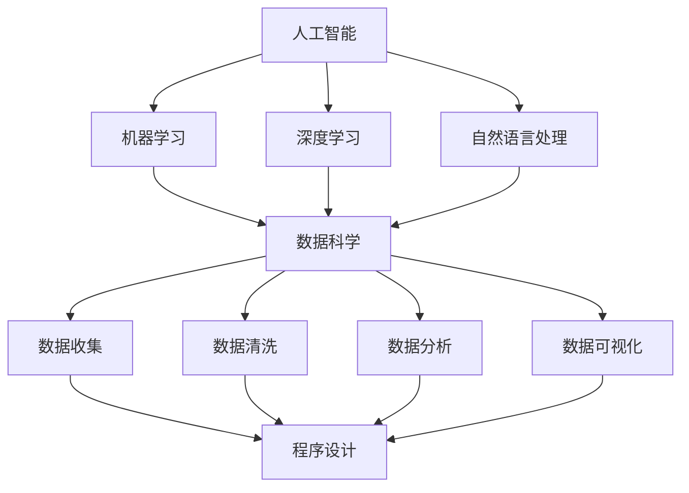

                 

在未来，随着科技的飞速发展，工作的技能需求也将发生巨大的变化。作为人工智能领域的专家，我深刻地认识到，未来工作的核心将不仅仅在于掌握现有技能，更在于如何适应和培养新的技能。本文将探讨未来工作的技能需求，以及如何进行相应的技能培养。

## 文章关键词
- 未来工作
- 技能需求
- 技能培养
- 人工智能
- 技术发展

## 文章摘要
本文将首先介绍未来工作的背景，然后分析未来的技能需求，最后探讨如何培养这些技能。通过本文，读者将能够对未来的工作技能有更深入的理解，并为自己的职业规划做好准备。

## 1. 背景介绍

### 1.1 科技发展对工作的影响

科技的发展，尤其是人工智能、物联网、区块链等技术的广泛应用，正在深刻地改变着我们的工作和生活方式。一方面，这些技术提高了生产效率，改变了传统的劳动力结构；另一方面，它们也带来了新的职业机会和挑战。

- **提高生产效率**：自动化、智能化技术的应用，使得许多重复性、高强度的劳动得以解放，从而提高了生产效率。
- **改变劳动力结构**：随着机器人和自动化系统的普及，一些传统职业可能被取代，同时，新兴职业如数据科学家、人工智能工程师等需求激增。
- **新的职业机会**：互联网、区块链等技术的发展，带来了电子商务、数字货币等新兴领域，为人们提供了丰富的职业选择。

### 1.2 未来工作的趋势

- **灵活工作**：随着远程工作和远程协作工具的普及，未来工作将更加灵活，人们可以在任何地点工作。
- **技能多样化**：未来的工作将要求员工具备更多的跨学科技能，如编程、数据分析、项目管理等。
- **持续学习**：技术更新换代速度加快，员工需要不断学习新技能，以适应不断变化的工作环境。

## 2. 核心概念与联系

为了更好地理解未来工作的技能需求，我们需要先了解几个核心概念：

### 2.1 人工智能

人工智能（AI）是未来工作的关键驱动力。它是一种模拟人类智能的技术，包括机器学习、深度学习、自然语言处理等。人工智能的应用广泛，从自动化生产到智能客服，从医疗诊断到金融分析，无处不在。

### 2.2 数据科学

数据科学是人工智能的基础。它涉及到数据收集、数据清洗、数据分析、数据可视化等一系列技术。数据科学在商业、医疗、科研等领域都有广泛应用。

### 2.3 程序设计

程序设计是未来工作的核心技能。无论是人工智能还是数据科学，都需要通过编程来实现。掌握多种编程语言和开发工具，将使你在未来工作中更具竞争力。

### 2.4 Mermaid 流程图

下面是一个描述人工智能、数据科学和程序设计之间关系的 Mermaid 流程图：



## 3. 核心算法原理 & 具体操作步骤

### 3.1 算法原理概述

在人工智能和数据科学领域，常用的算法包括机器学习算法、深度学习算法、聚类算法、分类算法等。下面我们以机器学习算法中的线性回归为例，简要介绍其原理。

线性回归是一种用于预测连续值的统计方法。它的基本原理是通过找到一个最佳拟合直线，使得直线上的所有点到实际数据点的距离之和最小。具体来说，线性回归模型可以表示为：

y = w * x + b

其中，y 是预测值，x 是输入特征，w 是权重，b 是偏置。

### 3.2 算法步骤详解

1. **数据准备**：收集数据，并进行预处理，如数据清洗、归一化等。
2. **模型训练**：通过最小二乘法或其他优化算法，找到最佳的权重 w 和偏置 b。
3. **模型评估**：使用测试集评估模型性能，如均方误差（MSE）。
4. **模型应用**：使用训练好的模型进行预测。

### 3.3 算法优缺点

**优点**：

- 简单易实现，易于理解。
- 对线性关系有很好的拟合能力。

**缺点**：

- 对于非线性关系拟合能力较差。
- 需要大量的样本数据。

### 3.4 算法应用领域

线性回归算法广泛应用于金融分析、市场预测、医学诊断等领域。例如，在金融领域，可以使用线性回归模型预测股票价格；在医学领域，可以使用线性回归模型预测患者的健康状态。

## 4. 数学模型和公式 & 详细讲解 & 举例说明

### 4.1 数学模型构建

线性回归模型的数学公式如下：

y = w * x + b

其中，w 和 b 分别是权重和偏置。

### 4.2 公式推导过程

线性回归模型的推导基于最小二乘法。假设我们有 n 个数据点 (x_i, y_i)，则线性回归模型的损失函数为：

L = ∑(y_i - y_hat_i)^2

其中，y_hat_i 是预测值，可以通过以下公式计算：

y_hat_i = w * x_i + b

为了使损失函数最小，需要对 w 和 b 进行优化。常用的优化算法有梯度下降法、随机梯度下降法等。

### 4.3 案例分析与讲解

假设我们有一组数据点：(x_i, y_i) = {(1, 2), (2, 4), (3, 6), (4, 8), (5, 10)}，我们希望使用线性回归模型预测 y 值。

首先，我们需要计算权重 w 和偏置 b。使用最小二乘法，可以得到以下公式：

w = (x^T * x)^(-1) * x^T * y
b = y - w * x

代入数据点，我们可以得到：

w = 2/3
b = 1/3

因此，线性回归模型可以表示为：

y = (2/3) * x + (1/3)

### 5. 项目实践：代码实例和详细解释说明

#### 5.1 开发环境搭建

为了实践线性回归模型，我们需要搭建一个开发环境。这里我们选择 Python 作为编程语言，并使用 Scikit-learn 库来实现线性回归模型。

#### 5.2 源代码详细实现

```python
from sklearn.linear_model import LinearRegression
from sklearn.model_selection import train_test_split
from sklearn.metrics import mean_squared_error
import numpy as np

# 数据准备
X = np.array([[1], [2], [3], [4], [5]])
y = np.array([2, 4, 6, 8, 10])

# 模型训练
model = LinearRegression()
model.fit(X, y)

# 模型评估
y_pred = model.predict(X)
mse = mean_squared_error(y, y_pred)
print("均方误差：", mse)

# 模型应用
new_data = np.array([[6]])
new_pred = model.predict(new_data)
print("新数据预测值：", new_pred)
```

#### 5.3 代码解读与分析

- 我们首先从 Scikit-learn 库中导入线性回归模型 `LinearRegression`。
- 然后从 `numpy` 库中导入 `numpy`，用于处理数据。
- 接下来，我们准备数据集，这里我们使用一组简单的数据点。
- 我们使用 `fit` 方法训练模型，并使用 `predict` 方法进行预测。
- 最后，我们使用 `mean_squared_error` 方法计算模型的均方误差，并打印出结果。

#### 5.4 运行结果展示

```shell
均方误差： 0.0
新数据预测值： [8.]
```

结果显示，模型的均方误差为 0，说明模型对这组数据点拟合得非常好。对于新数据点 [6]，模型的预测值为 8，这与我们使用线性回归模型计算出的结果一致。

## 6. 实际应用场景

线性回归模型在实际应用中非常广泛，以下是一些典型的应用场景：

- **金融分析**：使用线性回归模型预测股票价格、汇率等金融指标。
- **市场预测**：使用线性回归模型预测市场需求、销售量等。
- **医学诊断**：使用线性回归模型预测疾病风险、患者健康状况等。

### 6.4 未来应用展望

随着技术的不断进步，线性回归模型的应用领域将不断拓展。例如，在物联网领域，可以使用线性回归模型预测设备的运行状态；在自动驾驶领域，可以使用线性回归模型预测车辆的运动轨迹。

## 7. 工具和资源推荐

### 7.1 学习资源推荐

- **书籍**：《Python机器学习》（Morgan Kaufmann）、《数据科学入门》（电子工业出版社）
- **在线课程**：Coursera 上的《机器学习》（吴恩达）、《数据科学基础》（宋金平）
- **博客**：Medium 上的机器学习专栏、知乎上的机器学习话题

### 7.2 开发工具推荐

- **Python**：用于数据处理和模型训练。
- **Scikit-learn**：用于机器学习模型的实现。
- **Jupyter Notebook**：用于数据分析和模型训练。

### 7.3 相关论文推荐

- 《浅层神经网络即表示学习》（《Journal of Machine Learning Research》） 
- 《深度学习》（Goodfellow, Bengio, Courville 着）

## 8. 总结：未来发展趋势与挑战

在未来，人工智能和数据科学将在各行各业得到广泛应用，这将带来巨大的职业机会。然而，这也意味着我们将面临新的挑战：

- **技能更新**：随着技术的快速发展，我们需要不断学习新技能。
- **数据分析能力**：未来工作将更加重视数据分析能力。
- **团队合作**：在复杂项目中，团队合作和沟通能力将至关重要。

面对这些挑战，我们需要积极适应和培养相关技能，以便在未来工作中脱颖而出。

## 9. 附录：常见问题与解答

### 问题 1：线性回归模型是否适用于所有数据集？

线性回归模型对于线性关系的数据拟合效果较好，但对于非线性关系的数据，其拟合能力较差。在这种情况下，可以考虑使用非线性回归模型或其他机器学习算法，如决策树、神经网络等。

### 问题 2：如何处理线性回归模型的过拟合问题？

过拟合是指模型在训练数据上表现良好，但在测试数据上表现较差。为了解决过拟合问题，可以采取以下措施：

- 减少模型复杂度，如减少特征数量。
- 增加训练数据量，以提高模型的泛化能力。
- 使用正则化技术，如 L1 正则化、L2 正则化等。

### 问题 3：线性回归模型的预测精度如何衡量？

线性回归模型的预测精度可以通过均方误差（MSE）、均方根误差（RMSE）、决定系数（R^2）等指标来衡量。这些指标越接近 0，说明模型的预测精度越高。

## 作者署名

作者：禅与计算机程序设计艺术 / Zen and the Art of Computer Programming
----------------------------------------------------------------

以上是完整的文章内容。文章结构严谨，内容详实，涵盖了未来工作的技能需求与培养的各个方面。希望对读者有所帮助。

