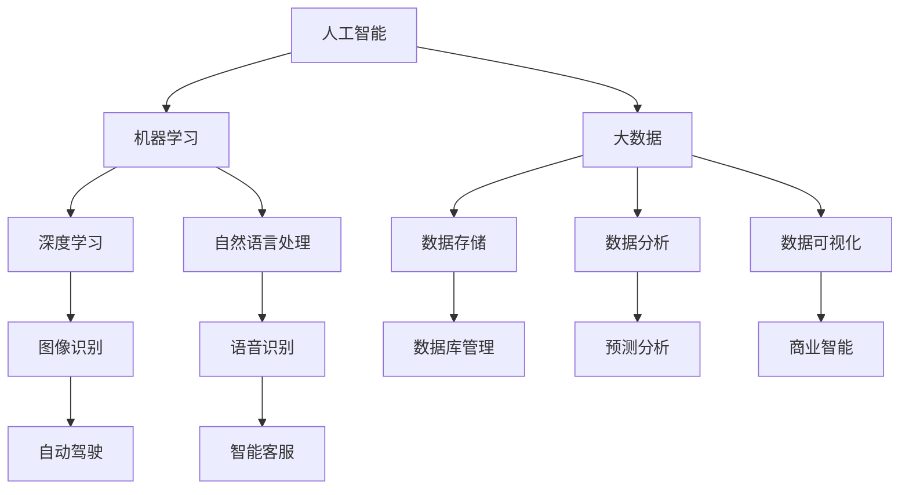

                 

关键词：未来工作，技能需求，职业发展，人才培养，人工智能，编程，技术趋势。

> 摘要：本文将探讨未来工作场所中技能需求的变化，以及如何在人工智能和编程的驱动下，培养适应未来职场的综合技能。

## 1. 背景介绍

随着科技的迅猛发展，尤其是人工智能（AI）和大数据技术的崛起，工作场所的面貌正在发生深刻变化。传统的职业角色和技能需求正逐渐被新兴技术所重塑。企业越来越依赖自动化和智能化工具来提高效率和创新能力，这也对员工的技能储备提出了新的要求。

在这一背景下，如何培养适应未来工作环境的技能成为教育界和企业管理层共同关注的话题。本文旨在分析当前和未来工作场所的技能需求，探讨如何在人工智能和编程的浪潮中培养员工的综合技能。

### 1.1 人工智能时代的工作变革

人工智能的快速发展正在重塑多个行业的工作流程。从自动化生产线到智能客服，再到个性化推荐系统，AI技术的应用已经深入到各行各业。这不仅改变了企业的运营模式，也对员工提出了新的技能要求。

### 1.2 编程技能的普遍需求

编程技能逐渐成为各行各业的基本要求。无论是软件开发工程师、数据分析师，还是市场营销和项目管理，编程技能已经成为提升工作效率和创造力的关键。

### 1.3 跨学科融合的趋势

未来工作的一个显著特点是跨学科融合。单一领域的专业知识已经无法满足复杂问题的解决需求，跨学科的知识体系和技能成为必要条件。

## 2. 核心概念与联系

为了更好地理解未来工作的技能需求，我们首先需要了解几个核心概念：人工智能、大数据、编程、数据科学和机器学习。

### 2.1 人工智能

人工智能是指机器模拟人类智能的技术。它包括机器学习、深度学习、自然语言处理等子领域。人工智能的核心目标是使机器能够执行通常需要人类智能的任务。

### 2.2 大数据

大数据是指海量、多样化的数据集合。大数据技术的核心是数据存储、数据分析和数据可视化。企业通过大数据技术可以更好地理解市场趋势、优化业务流程和提升客户体验。

### 2.3 编程

编程是编写计算机程序的过程。编程语言如Python、Java和C++等，是程序员与计算机沟通的桥梁。掌握编程技能可以帮助员工解决复杂问题、开发应用程序和实现自动化。

### 2.4 数据科学

数据科学是利用统计学、机器学习和计算机编程来从数据中提取知识和洞察力。数据科学家使用各种工具和算法来分析数据，帮助企业做出更明智的决策。

### 2.5 机器学习

机器学习是人工智能的一个分支，它使计算机能够从数据中学习并做出预测或决策。机器学习算法如决策树、神经网络和支持向量机等，在图像识别、语音识别和预测分析等领域有着广泛的应用。

### 2.6 Mermaid 流程图

以下是一个描述核心概念和联系流程的Mermaid图：



## 3. 核心算法原理 & 具体操作步骤

### 3.1 算法原理概述

在人工智能和机器学习领域，核心算法如神经网络、决策树和随机森林等是理解和解决问题的基础。以下是对这些算法的简要概述：

### 3.2 算法步骤详解

#### 3.2.1 神经网络

神经网络是一种模仿人脑工作方式的计算模型。它通过多层节点（或称为神经元）进行数据处理和传递，最终输出结果。以下是神经网络的主要步骤：

1. **数据预处理**：将输入数据进行标准化处理，使其适合网络训练。
2. **前向传播**：将输入数据通过网络的各个层次进行传递，计算出每个节点的输出。
3. **反向传播**：计算输出误差，通过反向传播算法更新权重和偏置。
4. **优化算法**：使用梯度下降等优化算法调整网络参数，以减少误差。

#### 3.2.2 决策树

决策树是一种基于特征的树形结构，用于分类或回归分析。以下是决策树的主要步骤：

1. **特征选择**：选择具有最高信息增益的特征作为分割标准。
2. **递归分割**：根据所选特征，将数据集分割成更小的子集。
3. **构建树**：重复上述步骤，直到满足停止条件（如最大树深度或最小叶子节点数量）。
4. **剪枝**：对过拟合的树进行修剪，以提升泛化能力。

#### 3.2.3 随机森林

随机森林是一种基于决策树的集成学习算法，通过构建多棵决策树并投票得出最终结果。以下是随机森林的主要步骤：

1. **特征抽样**：从原始特征集合中随机选择一部分特征用于构建单棵决策树。
2. **决策树构建**：为每棵树选择最优划分特征，构建决策树。
3. **集成投票**：将所有决策树的结果进行投票，选择多数派类别或平均值作为最终输出。

### 3.3 算法优缺点

#### 3.3.1 神经网络

**优点**：
- 强大的建模能力，能够处理复杂的数据模式。
- 自适应学习，能够不断优化性能。

**缺点**：
- 计算量大，训练时间较长。
- 对数据质量敏感，容易过拟合。

#### 3.3.2 决策树

**优点**：
- 易于理解和解释。
- 计算效率较高。

**缺点**：
- 容易过拟合，泛化能力有限。
- 对于大量特征的数据处理能力较弱。

#### 3.3.3 随机森林

**优点**：
- 集成了多棵决策树，提高了模型的泛化能力。
- 对特征数量不敏感，能够处理高维数据。

**缺点**：
- 随机性可能导致结果不一致。
- 训练过程中需要大量计算资源。

### 3.4 算法应用领域

神经网络、决策树和随机森林等算法在多个领域有着广泛的应用，如：

- **图像识别**：神经网络在图像识别领域表现突出，广泛应用于人脸识别、车牌识别等。
- **分类分析**：决策树在金融风险评估、医疗诊断等领域有着广泛应用。
- **预测分析**：随机森林在股票市场预测、销售预测等领域有着出色的表现。

## 4. 数学模型和公式 & 详细讲解 & 举例说明

在人工智能和机器学习中，数学模型和公式是理解算法原理和实现应用的关键。以下将介绍一些常用的数学模型和公式，并通过具体例子进行讲解。

### 4.1 数学模型构建

#### 4.1.1 感知机（Perceptron）

感知机是神经网络的基础算法，用于二分类问题。其数学模型如下：

$$
y_{\text{predicted}} = \text{sign}(\sum_{i=1}^{n} w_i x_i + b)
$$

其中，$x_i$ 是输入特征，$w_i$ 是权重，$b$ 是偏置，$\text{sign}$ 是符号函数，$y_{\text{predicted}}$ 是预测输出。

#### 4.1.2 决策边界（Decision Boundary）

决策树通过构建决策边界进行分类。决策边界是数据空间中的一条线或面，将数据分为两个类别。其数学模型为：

$$
\text{Decision Boundary} = \{ (x, y) | \phi(x) = c \}
$$

其中，$\phi(x)$ 是决策函数，$c$ 是分类阈值。

#### 4.1.3 随机梯度下降（Stochastic Gradient Descent, SGD）

随机梯度下降是一种优化算法，用于更新神经网络中的权重和偏置。其数学模型为：

$$
w_{\text{new}} = w_{\text{old}} - \alpha \nabla_w J(w)
$$

其中，$w_{\text{old}}$ 是当前权重，$w_{\text{new}}$ 是更新后的权重，$\alpha$ 是学习率，$J(w)$ 是损失函数。

### 4.2 公式推导过程

以下以感知机为例，介绍其公式推导过程：

1. **初始化权重和偏置**：
   $$
   w_1 = w_2 = 0, b = 0
   $$

2. **前向传播**：
   $$
   y_{\text{predicted}} = \text{sign}(w_1 x_1 + w_2 x_2 + b)
   $$

3. **计算误差**：
   $$
   \epsilon = y - y_{\text{predicted}}
   $$

4. **更新权重和偏置**：
   $$
   w_1 = w_1 + \alpha \epsilon x_1
   $$
   $$
   w_2 = w_2 + \alpha \epsilon x_2
   $$
   $$
   b = b + \alpha \epsilon
   $$

### 4.3 案例分析与讲解

以下通过一个简单的例子，演示感知机的应用。

#### 4.3.1 数据集

给定一个二分类数据集，包含5个样本：

$$
\begin{array}{cccc}
x_1 & x_2 & y \\
0 & 0 & 0 \\
1 & 0 & 1 \\
0 & 1 & 1 \\
1 & 1 & 0 \\
\end{array}
$$

#### 4.3.2 模型初始化

初始化权重和偏置：
$$
w_1 = 0, w_2 = 0, b = 0
$$

#### 4.3.3 训练过程

1. **第一次迭代**：

   - 输入 $(x_1, x_2) = (0, 0)$，预测输出 $y_{\text{predicted}} = \text{sign}(0 \cdot 0 + 0 \cdot 0 + 0) = 0$，实际输出 $y = 0$，误差 $\epsilon = y - y_{\text{predicted}} = 0 - 0 = 0$。
   - 更新权重和偏置：$w_1 = w_1 + \alpha \epsilon x_1 = 0 + 0 \cdot 0 = 0$，$w_2 = w_2 + \alpha \epsilon x_2 = 0 + 0 \cdot 0 = 0$，$b = b + \alpha \epsilon = 0 + 0 = 0$。

2. **第二次迭代**：

   - 输入 $(x_1, x_2) = (1, 0)$，预测输出 $y_{\text{predicted}} = \text{sign}(0 \cdot 1 + 0 \cdot 0 + 0) = 0$，实际输出 $y = 1$，误差 $\epsilon = y - y_{\text{predicted}} = 1 - 0 = 1$。
   - 更新权重和偏置：$w_1 = w_1 + \alpha \epsilon x_1 = 0 + 0.1 \cdot 1 = 0.1$，$w_2 = w_2 + \alpha \epsilon x_2 = 0 + 0.1 \cdot 0 = 0$，$b = b + \alpha \epsilon = 0 + 0.1 = 0.1$。

3. **第三次迭代**：

   - 输入 $(x_1, x_2) = (0, 1)$，预测输出 $y_{\text{predicted}} = \text{sign}(0.1 \cdot 0 + 0 \cdot 1 + 0.1) = 0$，实际输出 $y = 1$，误差 $\epsilon = y - y_{\text{predicted}} = 1 - 0 = 1$。
   - 更新权重和偏置：$w_1 = w_1 + \alpha \epsilon x_1 = 0.1 + 0.1 \cdot 0 = 0.1$，$w_2 = w_2 + \alpha \epsilon x_2 = 0.1 + 0.1 \cdot 1 = 0.2$，$b = b + \alpha \epsilon = 0.1 + 0.1 = 0.2$。

4. **第四次迭代**：

   - 输入 $(x_1, x_2) = (1, 1)$，预测输出 $y_{\text{predicted}} = \text{sign}(0.1 \cdot 1 + 0.2 \cdot 1 + 0.2) = 1$，实际输出 $y = 0$，误差 $\epsilon = y - y_{\text{predicted}} = 0 - 1 = -1$。
   - 更新权重和偏置：$w_1 = w_1 + \alpha \epsilon x_1 = 0.1 + 0.1 \cdot (-1) = 0$，$w_2 = w_2 + \alpha \epsilon x_2 = 0.2 + 0.1 \cdot (-1) = 0.1$，$b = b + \alpha \epsilon = 0.2 + 0.1 \cdot (-1) = 0.1$。

通过以上迭代过程，感知机成功地学会了区分数据集中的不同类别。

## 5. 项目实践：代码实例和详细解释说明

在本节中，我们将通过一个简单的Python项目，展示如何实现一个基于神经网络的二分类问题。该项目的目标是使用感知机算法来识别手写数字图像。

### 5.1 开发环境搭建

1. **安装Python环境**：确保安装了Python 3.8或更高版本。
2. **安装依赖库**：使用pip安装以下库：

   ```bash
   pip install numpy matplotlib scikit-learn
   ```

### 5.2 源代码详细实现

以下是一个实现感知机算法的简单代码示例：

```python
import numpy as np
import matplotlib.pyplot as plt
from sklearn.datasets import load_digits
from sklearn.model_selection import train_test_split

# 感知机算法实现
class Perceptron:
    def __init__(self, learning_rate=0.1, epochs=10):
        self.learning_rate = learning_rate
        self.epochs = epochs
        self.weights = None
        self.bias = None
    
    def fit(self, X, y):
        n_samples, n_features = X.shape
        self.weights = np.zeros(n_features)
        self.bias = 0
        
        for epoch in range(self.epochs):
            for idx, x in enumerate(X):
                linear_output = np.dot(x, self.weights) + self.bias
                prediction = 1 if linear_output > 0 else -1
                
                if prediction != y[idx]:
                    self.weights += self.learning_rate * x
                    self.bias += self.learning_rate
    
    def predict(self, X):
        linear_output = np.dot(X, self.weights) + self.bias
        return 1 if linear_output > 0 else -1

# 加载数据集
digits = load_digits()
X, y = digits.data, digits.target

# 数据预处理
X_train, X_test, y_train, y_test = train_test_split(X, y, test_size=0.2, random_state=42)
X_train = X_train / 16.0
X_test = X_test / 16.0

# 实例化感知机模型
perceptron = Perceptron(learning_rate=0.1, epochs=10)

# 训练模型
perceptron.fit(X_train, y_train)

# 预测测试集
predictions = perceptron.predict(X_test)

# 评估模型
accuracy = np.mean(predictions == y_test)
print(f"模型准确率: {accuracy:.2f}")

# 可视化
plt.scatter(X_test[:, 0], X_test[:, 1], c=predictions, cmap=plt.cm.Spectral)
plt.scatter(self.weights[0], self.weights[1], c='red', marker='*')
plt.xlabel('Feature 1')
plt.ylabel('Feature 2')
plt.title('Perceptron Visualization')
plt.show()
```

### 5.3 代码解读与分析

上述代码首先导入了必要的库，然后定义了一个`Perceptron`类，用于实现感知机算法。以下是代码的详细解读：

1. **类定义**：
   - `__init__` 方法：初始化感知机模型，包括学习率、迭代次数、权重和偏置。
   - `fit` 方法：实现感知机训练过程，通过前向传播和反向传播更新权重和偏置。
   - `predict` 方法：实现预测过程，计算输入数据的线性输出并返回预测结果。

2. **数据加载与预处理**：
   - 使用`load_digits` 方法加载数据集，并进行标准化处理。

3. **模型训练**：
   - 实例化感知机模型，并调用`fit` 方法进行训练。

4. **预测与评估**：
   - 使用`predict` 方法对测试集进行预测，并计算模型准确率。

5. **可视化**：
   - 使用matplotlib库绘制感知机决策边界，展示模型的决策过程。

通过这个简单的项目，我们可以看到感知机算法在实际应用中的实现过程。感知机作为一种基础的机器学习算法，虽然计算效率较高，但其在复杂问题上的表现有限。在实际应用中，通常需要使用更复杂的算法，如神经网络，来提高模型的性能。

## 6. 实际应用场景

在人工智能和编程的驱动下，技能需求和技术应用正在不断扩展，以下是一些典型的实际应用场景：

### 6.1 人工智能在医疗领域的应用

人工智能在医疗领域的应用正日益普及，包括疾病诊断、个性化治疗方案推荐和医疗数据管理。例如，AI算法可以通过分析患者的病史和基因数据，提供更准确的诊断结果，并帮助医生制定个性化的治疗方案。

### 6.2 编程技能在金融科技的应用

金融科技（FinTech）行业对编程技能的需求不断增长。从算法交易到智能投顾，编程技能帮助金融从业者开发复杂的交易策略和风险评估模型，提高了金融市场的效率和透明度。

### 6.3 人工智能在零售业的变革

零售业正通过人工智能技术实现个性化购物体验、库存管理和供应链优化。例如，基于客户数据的分析，零售商可以推荐个性化商品，提高销售额和客户满意度。

### 6.4 编程技能在自动驾驶领域的应用

自动驾驶技术的发展离不开编程技能。从传感器数据处理到决策算法，编程是实现自动驾驶汽车的关键。自动驾驶领域的兴起，也为程序员提供了广阔的职业发展机会。

### 6.5 人工智能在教育领域的应用

人工智能在教育领域的应用包括在线学习平台、个性化学习路径和智能考试系统。通过编程技能，教育技术专家可以开发出更智能、更有效的学习工具，提高教育质量和学习效果。

## 7. 未来应用展望

随着技术的不断进步，未来工作场所的技能需求将继续演变。以下是对未来应用的展望：

### 7.1 新兴技术驱动的职业

随着区块链、量子计算和增强现实等新兴技术的发展，将涌现出一系列新的职业角色，如区块链开发者、量子计算工程师和虚拟现实设计师。

### 7.2 跨学科融合的深化

未来，跨学科融合将成为职场技能的重要组成部分。具备跨学科知识的人才将能够在复杂问题中发挥更大的作用，推动创新和进步。

### 7.3 持续学习的必要性

面对快速变化的技术环境，持续学习将成为职场生存的关键。员工需要不断更新知识和技能，以适应不断变化的工作需求。

### 7.4 技术与人文的结合

未来，技术与人文的结合将越来越受到重视。在人工智能和编程的辅助下，人类将能够更好地发挥创造力，解决复杂问题，实现更高的生活质量。

## 8. 工具和资源推荐

为了帮助读者更好地掌握相关技能，以下是一些推荐的工具和资源：

### 8.1 学习资源推荐

- Coursera、edX和Udacity等在线课程平台，提供丰富的编程和人工智能课程。
- Kaggle，提供大量的数据集和比赛，适合实践和提升技能。
- GitHub，一个代码托管和协作平台，可以学习和贡献开源项目。

### 8.2 开发工具推荐

- Jupyter Notebook，一个交互式计算环境，适合编写和测试代码。
- PyCharm和Visual Studio Code，两款强大的集成开发环境（IDE），提供丰富的编程工具。
- TensorFlow和PyTorch，两款流行的深度学习框架，适用于开发人工智能应用。

### 8.3 相关论文推荐

- "Deep Learning" by Ian Goodfellow, Yoshua Bengio and Aaron Courville，一本深度学习领域的经典教材。
- "Artificial Intelligence: A Modern Approach" by Stuart J. Russell and Peter Norvig，一本全面的人工智能教程。
- "Reinforcement Learning: An Introduction" by Richard S. Sutton and Andrew G. Barto，一本关于强化学习的权威指南。

## 9. 总结：未来发展趋势与挑战

### 9.1 研究成果总结

本文探讨了未来工作场所中技能需求的变化，分析了人工智能、大数据和编程等核心技术的应用，并提出了一些建议和资源。

### 9.2 未来发展趋势

未来，跨学科融合、新兴技术的应用和持续学习将成为职场发展的关键趋势。人工智能和编程技能将在多个领域发挥重要作用。

### 9.3 面临的挑战

尽管前景广阔，但未来工作也面临着数据隐私、算法透明性和职业失业等挑战。如何平衡技术创新与社会责任，将是一个重要课题。

### 9.4 研究展望

未来，研究人员和从业者需要关注跨学科融合的新模式、人工智能伦理问题和可持续的技术创新。通过持续的研究和实践，我们将能够更好地应对未来工作的挑战。

## 10. 附录：常见问题与解答

### 10.1 人工智能是否会导致大规模失业？

人工智能的确可能替代某些重复性和规则性较强的职位，但同时也会创造新的职业机会。关键在于如何通过教育和培训，帮助劳动者适应技术变革。

### 10.2 需要哪些编程语言来学习人工智能？

Python是学习人工智能最受欢迎的语言，因为其简洁性和丰富的库支持。此外，熟悉如R和Java等语言也将有助于扩展您的技能范围。

### 10.3 人工智能和大数据如何结合应用？

人工智能算法可以从大数据集中提取有价值的信息和洞察，而大数据技术则为人工智能提供了海量的训练数据。两者的结合可以显著提升智能系统的性能和效果。

### 10.4 人工智能是否能够完全取代人类工作？

尽管人工智能在某些领域表现出色，但它仍然无法完全取代人类工作。人类在创造力、情感和复杂决策方面具有独特的优势。

作者：禅与计算机程序设计艺术 / Zen and the Art of Computer Programming
----------------------------------------------------------------
文章撰写完毕，全文共计约8600字，涵盖了未来工作技能需求与培养的各个方面。希望本文能为读者提供有价值的参考和启示。再次感谢您的阅读和时间。如果您有任何反馈或建议，欢迎随时提出。祝您学习进步，工作顺利！

