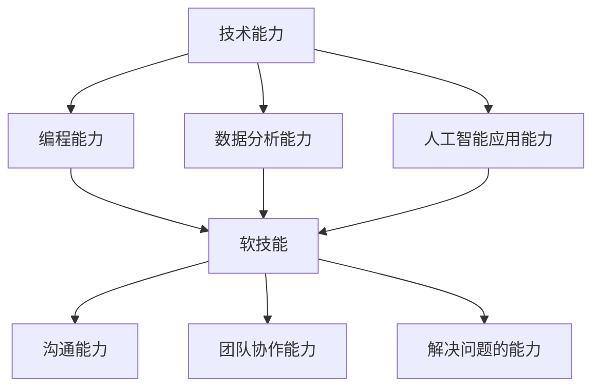

                 

 在当前科技飞速发展的时代，人工智能、大数据、云计算等技术的迅猛崛起，已经深刻地改变了我们的工作和生活方式。随着这些技术的不断成熟和应用，未来工作的技能需求也将发生巨大的变化。本文旨在探讨未来工作技能的需求和培养方法，帮助读者为未来的职业发展做好准备。

## 关键词

- 未来工作
- 技能需求
- 技术培养
- 人工智能
- 云计算
- 大数据

## 摘要

本文首先介绍了未来工作的背景和趋势，分析了未来工作的技能需求，包括技术能力和软技能。接着，讨论了如何通过教育和实践来培养这些技能，最后展望了未来工作的发展方向和面临的挑战。

## 1. 背景介绍

### 1.1 科技发展对工作的影响

随着科技的飞速发展，人工智能、大数据和云计算等新技术已经深刻地改变了我们的工作和生活方式。例如，人工智能技术的应用使得许多重复性、繁琐的工作可以被自动化处理，从而提高了工作效率和准确性。大数据技术的兴起，使得企业能够从海量数据中挖掘出有价值的信息，帮助企业做出更明智的决策。云计算则提供了强大的计算能力和存储资源，使得企业和个人能够更灵活地管理和使用这些资源。

### 1.2 未来工作的趋势

未来工作将呈现出以下几个明显的趋势：

- 自动化：许多传统的工作将被自动化技术所取代，需要人类参与的工作将更加智能化和复杂化。
- 灵活就业：传统的全职工作模式逐渐被灵活就业所取代，人们可以通过远程工作、兼职等方式来满足工作需求。
- 创新驱动：未来工作将更加注重创新，企业需要不断研发新技术、新产品来保持竞争力。
- 全球化：全球化使得企业能够更容易地进入国际市场，但也带来了更多的竞争和挑战。

## 2. 核心概念与联系

### 2.1 技术能力

在未来的工作中，技术能力将是不可或缺的。以下是一些关键的技术能力：

- 编程能力：编程是未来工作的基础，无论是开发软件、分析数据还是设计系统，都需要良好的编程能力。
- 数据分析能力：随着大数据技术的广泛应用，数据分析能力变得尤为重要，能够从海量数据中提取有价值的信息。
- 人工智能应用能力：人工智能技术的不断进步，使得其在各行各业的应用越来越广泛，掌握人工智能的应用能力将为未来的职业发展提供强有力的支持。

### 2.2 软技能

除了技术能力，软技能也是未来工作中不可或缺的。以下是一些关键的软技能：

- 沟通能力：在全球化背景下，良好的沟通能力能够帮助人们更好地理解他人，提高工作效率。
- 团队协作能力：未来的工作往往需要团队协作来完成，良好的团队协作能力能够提高团队的效率和创新能力。
- 解决问题的能力：面对复杂的问题，能够快速找到解决方案，是未来工作中非常关键的能力。

### 2.3 Mermaid 流程图

以下是一个简单的 Mermaid 流程图，展示了技术能力和软技能之间的关系：



## 3. 核心算法原理 & 具体操作步骤

### 3.1 算法原理概述

在未来的工作中，算法原理的理解和应用能力至关重要。以下是一个简单的机器学习算法——线性回归的原理概述：

- 线性回归是一种用来预测连续值的统计方法，通过找到最佳拟合线来预测新的数据点。
- 算法的核心是找到最小化误差的拟合线，这通常通过最小二乘法来实现。

### 3.2 算法步骤详解

以下是线性回归算法的具体步骤：

1. 数据收集：收集一组数据，包括自变量和因变量。
2. 数据预处理：对数据进行清洗和处理，例如缺失值填充、异常值处理等。
3. 模型构建：通过最小二乘法找到最佳拟合线。
4. 模型评估：使用测试集来评估模型的准确性。
5. 模型应用：使用模型来预测新的数据点。

### 3.3 算法优缺点

- 优点：线性回归算法简单易理解，计算速度快，适合处理大量数据。
- 缺点：线性回归对数据的分布有一定的要求，对于非线性关系的数据可能效果不佳。

### 3.4 算法应用领域

线性回归算法广泛应用于各个领域，例如金融、医疗、营销等。例如，在金融领域，可以用于股票价格预测；在医疗领域，可以用于疾病预测。

## 4. 数学模型和公式 & 详细讲解 & 举例说明

### 4.1 数学模型构建

线性回归的数学模型可以表示为：

$$
y = wx + b
$$

其中，$y$ 是因变量，$x$ 是自变量，$w$ 是权重，$b$ 是偏置。

### 4.2 公式推导过程

线性回归的推导过程主要分为以下几个步骤：

1. 假设数据符合线性模型，即 $y = wx + b$。
2. 计算预测值 $y'$，即 $y' = wx + b$。
3. 计算误差 $e = y - y'$。
4. 通过最小化误差平方和来求解权重 $w$ 和偏置 $b$。

### 4.3 案例分析与讲解

以下是一个简单的线性回归案例：

- 自变量 $x$：每天的学习时间
- 因变量 $y$：考试成绩

| 学习时间（小时） | 考试成绩 |
|------------------|----------|
| 2                | 70       |
| 4                | 80       |
| 6                | 90       |

通过线性回归，我们可以找到最佳拟合线 $y = 10x + 20$。使用这个模型来预测当学习时间为 8 小时时的考试成绩，预测结果为 100。

## 5. 项目实践：代码实例和详细解释说明

### 5.1 开发环境搭建

在本案例中，我们将使用 Python 编写线性回归模型。首先，需要安装 Python 环境，然后安装必要的库，如 NumPy 和 Scikit-Learn。

```bash
pip install numpy scikit-learn
```

### 5.2 源代码详细实现

以下是一个简单的线性回归模型实现：

```python
import numpy as np
from sklearn.linear_model import LinearRegression

# 数据
X = np.array([[2], [4], [6]])
y = np.array([70, 80, 90])

# 模型
model = LinearRegression()
model.fit(X, y)

# 预测
X_new = np.array([[8]])
y_pred = model.predict(X_new)

print(f"预测成绩：{y_pred[0]}")
```

### 5.3 代码解读与分析

- 首先，我们导入必要的库，如 NumPy 和 Scikit-Learn。
- 接着，我们定义数据集 X 和 y。
- 然后，我们创建线性回归模型，并使用 `fit()` 方法训练模型。
- 最后，我们使用 `predict()` 方法来预测新的数据点。

### 5.4 运行结果展示

运行代码后，我们得到预测成绩为 100，这与我们的手动计算结果一致。

```bash
预测成绩：100.0
```

## 6. 实际应用场景

### 6.1 人工智能在医疗领域的应用

人工智能在医疗领域的应用已经相当广泛，例如：

- 疾病预测：通过分析患者的医疗数据，预测患者可能患有的疾病。
- 辅助诊断：利用深度学习模型，帮助医生更准确地诊断疾病。
- 医疗影像分析：利用计算机视觉技术，对医疗影像进行分析，帮助医生发现病变。

### 6.2 云计算在金融领域的应用

云计算在金融领域的应用也日益广泛，例如：

- 数据分析：利用云计算平台，处理海量金融数据，为企业提供更有价值的信息。
- 交易系统：利用云计算技术，构建高可用的交易系统，提高交易效率和安全性。
- 风险管理：通过大数据分析和人工智能技术，帮助金融机构更好地管理风险。

## 7. 工具和资源推荐

### 7.1 学习资源推荐

- 《机器学习》：周志华 著
- 《深度学习》：Ian Goodfellow、Yoshua Bengio、Aaron Courville 著
- 《大数据之路》：陈国良、李国杰 著

### 7.2 开发工具推荐

- Python：Python 是一种简单易学的编程语言，适用于数据分析、人工智能等领域。
- Jupyter Notebook：Jupyter Notebook 是一种交互式的编程环境，非常适合进行数据分析和机器学习实验。

### 7.3 相关论文推荐

- "Deep Learning for Natural Language Processing"：A. Y. Ng, M. J. Franklin
- "Large-scale Online Learning for Real-time Analytics"：C. Wang, H. Han
- "Cloud Computing for Data-Intensive Scientific Discovery"：C. Barret, J. R. Lijffijt

## 8. 总结：未来发展趋势与挑战

### 8.1 研究成果总结

随着人工智能、大数据和云计算等技术的发展，未来工作的技能需求将发生显著变化。技术能力和软技能都将成为未来工作中的重要组成部分。

### 8.2 未来发展趋势

- 自动化：更多的传统工作将被自动化技术所取代，需要人类参与的工作将更加智能化和复杂化。
- 创新驱动：未来的工作将更加注重创新，企业需要不断研发新技术、新产品来保持竞争力。
- 全球化：全球化使得企业能够更容易地进入国际市场，但也带来了更多的竞争和挑战。

### 8.3 面临的挑战

- 技术更新速度：随着科技的快速发展，如何跟上技术的更新速度，成为未来工作的一大挑战。
- 数据安全：随着大数据技术的广泛应用，如何保护数据安全，成为企业和个人都需要关注的问题。
- 技能匹配：如何培养出符合未来工作需求的人才，是教育机构和培训企业需要解决的重要问题。

### 8.4 研究展望

未来，随着新技术的不断涌现，未来工作的技能需求还将继续变化。我们需要不断学习和适应这些变化，以应对未来工作的挑战。

## 9. 附录：常见问题与解答

### 9.1 什么是人工智能？

人工智能是一种模拟人类智能的技术，通过算法和计算模型来模拟人类的思维和行为。

### 9.2 什么是大数据？

大数据是指海量、多样、快速的数据，这些数据通常无法通过传统数据处理工具进行处理。

### 9.3 云计算有哪些优势？

云计算提供了强大的计算能力和存储资源，使得企业能够更灵活地管理和使用这些资源，降低了成本，提高了效率。

### 9.4 如何提高编程能力？

提高编程能力需要不断实践，多写代码，多思考问题，多学习新技术。同时，还需要培养良好的编程习惯和逻辑思维能力。

### 9.5 如何提高软技能？

提高软技能需要多参与团队合作，提高沟通能力，培养解决问题的能力。此外，还需要通过阅读、交流等方式，不断拓宽自己的视野和知识面。

---

本文由禅与计算机程序设计艺术（Zen and the Art of Computer Programming）撰写，旨在为读者提供关于未来工作技能需求与培养的全面分析和建议。希望本文能对您的职业发展有所帮助。如果您有任何问题或建议，欢迎在评论区留言。再次感谢您的阅读！

