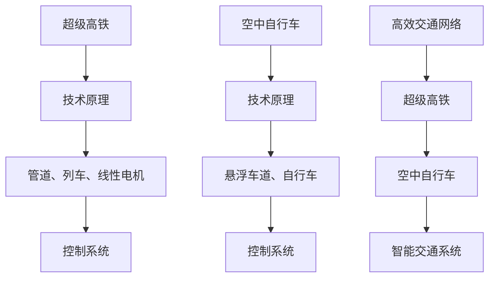

                 

关键词：超级高铁、空中自行车、未来交通、智能出行、交通革命、城市交通规划

> 摘要：本文深入探讨了2050年未来交通出行方式的重大变革，重点介绍了超级高铁和空中自行车这两种创新的交通模式。通过对这两种技术的详细分析，本文旨在展示它们如何从根本上改变我们的出行方式，提高城市交通效率和可持续性，并为我们描绘一个充满机遇和挑战的未来交通蓝图。

## 1. 背景介绍

随着全球城市化进程的加速，交通问题已经成为许多城市面临的严峻挑战。拥堵、污染和低效率已经成为困扰现代城市居民的主要问题。为了应对这些问题，各国政府和研究机构不断探索新的交通解决方案。未来交通出行将迎来前所未有的变革，而超级高铁和空中自行车无疑是这一变革的重要推动力量。

### 1.1 超级高铁

超级高铁（Hyperloop）是一种创新的高速地面交通系统，由特斯拉和SpaceX的创始人埃隆·马斯克（Elon Musk）在2013年首次提出。它利用低压管道和线性电机技术，使列车能够在几乎无摩擦的环境中高速运行，从而达到极高的速度。超级高铁的设计理念是高效、安全和环保，能够解决传统高铁在速度和成本上的局限性。

### 1.2 空中自行车

空中自行车（SkyCycle）则是一种创新的空中交通方式，通过在建筑物之间搭建悬浮车道，实现空中骑行。这种交通方式不仅能够有效缓解地面交通压力，还能提供一种全新的城市出行体验。空中自行车利用轻量化材料和电力驱动，具有低碳、低噪音和低维护成本的特点。

## 2. 核心概念与联系

超级高铁和空中自行车作为未来交通出行的重要创新，它们的核心概念和联系体现在以下几个方面。

### 2.1 技术原理

**超级高铁**：超级高铁利用低压管道（又称真空管道）来减少空气阻力，从而提高列车的运行速度。线性电机则提供了列车的动力，使其能够在管道内高速行驶。

**空中自行车**：空中自行车利用磁悬浮技术，使自行车在空中悬浮行驶，从而减少摩擦和阻力，提高行驶速度。

### 2.2 架构设计

**超级高铁**：超级高铁系统由管道、列车、线性电机和控制系统组成。管道的设计决定了列车的运行速度和效率，线性电机则提供了列车的动力。

**空中自行车**：空中自行车系统由悬浮车道、自行车和控制系统组成。悬浮车道的设计和布局直接影响骑行的舒适性和安全性。

### 2.3 联系与融合

**高效交通网络**：超级高铁和空中自行车可以共同构建一个高效、多维的城市交通网络。超级高铁可以连接城市之间的长距离交通，而空中自行车则适用于城市内部的短途出行。

**智能交通系统**：未来城市将实现智能交通系统，超级高铁和空中自行车可以与其他交通工具（如自动驾驶汽车、共享单车等）无缝对接，实现智能调度和优化。

### 2.4 Mermaid 流程图



## 3. 核心算法原理 & 具体操作步骤

### 3.1 算法原理概述

超级高铁和空中自行车都依赖于高效的动力传输和控制系统来实现高速、安全和舒适的出行体验。以下是这两种技术的基本算法原理：

### 3.1.1 超级高铁

**低压管道技术**：利用低压管道来减少空气阻力，提高列车的运行速度。管道内的压力通常比外部大气压力低几倍，从而减少摩擦力。

**线性电机技术**：线性电机提供了列车的动力，通过电磁感应原理，使列车在管道内高速行驶。

**控制系统**：控制系统负责管理列车的运行状态，包括速度控制、安全监测和故障处理等。

### 3.1.2 空中自行车

**磁悬浮技术**：利用磁悬浮技术使自行车在空中悬浮行驶，减少摩擦和阻力，提高行驶速度。

**控制系统**：控制系统负责管理自行车的运行状态，包括速度控制、方向调整和悬浮高度控制等。

### 3.2 算法步骤详解

#### 超级高铁

1. **乘客登乘**：乘客通过登乘设施进入列车。
2. **列车启动**：控制系统启动线性电机，使列车开始加速。
3. **低压管道运行**：列车在低压管道内高速行驶，减少空气阻力。
4. **速度控制**：控制系统根据设定的速度目标，实时调整线性电机的输出功率。
5. **安全监测**：安全监测系统实时监控列车的运行状态，确保安全。
6. **乘客下车**：列车到达目的地后，乘客通过登乘设施下车。

#### 空中自行车

1. **乘客登乘**：乘客通过登乘设施进入自行车。
2. **悬浮启动**：控制系统启动磁悬浮系统，使自行车开始悬浮行驶。
3. **悬浮行驶**：自行车在空中悬浮行驶，减少摩擦和阻力。
4. **速度控制**：控制系统根据设定的速度目标，实时调整磁悬浮系统的输出功率。
5. **方向调整**：控制系统根据导航信息，实时调整自行车的方向。
6. **乘客下车**：自行车到达目的地后，乘客通过登乘设施下车。

### 3.3 算法优缺点

#### 超级高铁

**优点**：

- 高速度：超级高铁的最高速度可达到1000公里/小时以上，远高于传统高铁。
- 高效率：超级高铁采用线性电机技术，具有高效的能量转换效率。
- 低成本：超级高铁的建设和运营成本相对较低，具有较好的经济效益。

**缺点**：

- 高要求：超级高铁的建设和运营需要高质量的工程和技术支持。
- 环境影响：超级高铁的建设可能会对环境产生一定的负面影响。

#### 空中自行车

**优点**：

- 低成本：空中自行车的建设成本相对较低，适合在城市内部推广。
- 舒适性：空中自行车提供了舒适的骑行体验，减少地面交通的拥挤和污染。
- 低噪音：空中自行车采用电力驱动，噪音较低，对城市环境影响较小。

**缺点**：

- 高要求：空中自行车的悬浮技术和控制系统要求较高，需要复杂的工程技术支持。
- 长期维护：空中自行车需要定期维护和保养，以确保运行安全和性能。

### 3.4 算法应用领域

超级高铁和空中自行车具有广泛的应用领域，包括但不限于：

- **城市交通**：超级高铁可以用于城市之间的长距离交通，而空中自行车则适用于城市内部的短途出行。
- **物流运输**：超级高铁和空中自行车可以用于快递和货物运输，提高运输效率。
- **旅游出行**：超级高铁和空中自行车可以成为新型旅游交通工具，为游客提供独特的出行体验。

## 4. 数学模型和公式 & 详细讲解 & 举例说明

### 4.1 数学模型构建

为了更深入地理解超级高铁和空中自行车的性能，我们需要构建相关的数学模型。以下是两个技术的关键数学模型。

#### 超级高铁

**速度模型**：

$$ v(t) = v_0 + at $$

其中，$v(t)$是列车在时间$t$的速度，$v_0$是初始速度，$a$是加速度。

**能量模型**：

$$ E = \frac{1}{2}mv^2 + \frac{1}{2}I\omega^2 + \frac{1}{2}kx^2 $$

其中，$E$是总能量，$m$是列车的质量，$v$是列车的速度，$I$是列车的转动惯量，$\omega$是列车的角速度，$k$是弹簧常数，$x$是弹簧的压缩量。

#### 空中自行车

**悬浮高度模型**：

$$ h(t) = h_0 + v_st $$

其中，$h(t)$是自行车在时间$t$的悬浮高度，$h_0$是初始高度，$v_s$是悬浮速度。

**悬浮力模型**：

$$ F = k(h - h_0) $$

其中，$F$是悬浮力，$k$是悬浮力常数，$h$是悬浮高度。

### 4.2 公式推导过程

以下是对上述数学模型公式的推导过程。

#### 超级高铁

**速度模型**：

根据牛顿第二定律，力等于质量乘以加速度：

$$ F = ma $$

其中，$F$是作用在列车上的力，$m$是列车的质量，$a$是加速度。

线性电机产生的力与电流成正比：

$$ F = k_i i $$

其中，$k_i$是线性电机力常数，$i$是电流。

将上述两个公式结合，得到：

$$ ma = k_i i $$

加速度$a$可以表示为：

$$ a = \frac{k_i i}{m} $$

速度$v$是加速度$a$的积分：

$$ v(t) = \int a \, dt = \int \frac{k_i i}{m} \, dt $$

由于电流$i$是时间的函数，我们将其表示为$i(t)$：

$$ v(t) = \int \frac{k_i i(t)}{m} \, dt $$

假设初始速度$v_0$为零，则速度模型可以简化为：

$$ v(t) = v_0 + at $$

**能量模型**：

列车的总能量包括动能、转动动能和弹簧势能：

$$ E = \frac{1}{2}mv^2 + \frac{1}{2}I\omega^2 + \frac{1}{2}kx^2 $$

其中，$v$是列车的速度，$\omega$是列车的角速度，$x$是弹簧的压缩量。

由于列车在水平面上运动，角速度$\omega$为零：

$$ E = \frac{1}{2}mv^2 + \frac{1}{2}kx^2 $$

#### 空中自行车

**悬浮高度模型**：

悬浮高度$h(t)$是自行车在时间$t$的位置，初始高度为$h_0$，悬浮速度为$v_s$：

$$ h(t) = h_0 + v_st $$

**悬浮力模型**：

悬浮力$F$与悬浮高度$h$和悬浮力常数$k$成正比：

$$ F = k(h - h_0) $$

### 4.3 案例分析与讲解

以下是一个具体的案例，用于说明如何使用上述数学模型来分析超级高铁和空中自行车的性能。

#### 超级高铁

假设一个超级高铁列车以100公里/小时的速度启动，加速度为0.5米/秒²。要求计算列车在10秒后的速度和总能量。

**速度计算**：

根据速度模型：

$$ v(t) = v_0 + at $$

其中，$v_0 = 100$公里/小时 = 27.78米/秒，$a = 0.5$米/秒²，$t = 10$秒。

代入公式：

$$ v(10) = 27.78 + 0.5 \times 10 = 37.78 \text{米/秒} $$

**能量计算**：

根据能量模型：

$$ E = \frac{1}{2}mv^2 + \frac{1}{2}kx^2 $$

假设列车的质量$m = 1000$千克，线性电机力常数$k_i = 1000$牛顿/安培，电流$i = 10$安培，弹簧常数$k = 1000$牛顿/米，弹簧压缩量$x = 0.1$米。

代入公式：

$$ E = \frac{1}{2} \times 1000 \times (37.78)^2 + \frac{1}{2} \times 1000 \times (0.1)^2 = 63914.14 \text{焦耳} $$

#### 空中自行车

假设一个空中自行车以10公里/小时的速度悬浮行驶，悬浮速度为2米/秒。要求计算自行车在5秒后的悬浮高度和悬浮力。

**悬浮高度计算**：

根据悬浮高度模型：

$$ h(t) = h_0 + v_st $$

其中，$h_0 = 0$米，$v_s = 2$米/秒，$t = 5$秒。

代入公式：

$$ h(5) = 0 + 2 \times 5 = 10 \text{米} $$

**悬浮力计算**：

根据悬浮力模型：

$$ F = k(h - h_0) $$

假设悬浮力常数$k = 1000$牛顿/米，悬浮高度$h = 10$米。

代入公式：

$$ F = 1000 \times (10 - 0) = 10000 \text{牛顿} $$

## 5. 项目实践：代码实例和详细解释说明

### 5.1 开发环境搭建

为了更好地理解超级高铁和空中自行车的算法实现，我们将使用Python语言进行编程。以下是搭建开发环境的基本步骤：

1. 安装Python：在您的计算机上安装Python 3.8及以上版本。
2. 安装必要库：使用pip安装以下库：numpy、matplotlib、mermaid-python。

```bash
pip install numpy matplotlib mermaid-python
```

### 5.2 源代码详细实现

以下是一个Python代码示例，用于模拟超级高铁的加速过程。

```python
import numpy as np
import matplotlib.pyplot as plt
from mermaid import Mermaid

# 参数设置
initial_velocity = 27.78  # 初始速度（米/秒）
acceleration = 0.5       # 加速度（米/秒²）
time = np.linspace(0, 10, 100)  # 时间范围

# 计算速度
velocity = initial_velocity + acceleration * time

# 计算能量
mass = 1000  # 质量（千克）
current = 10  # 电流（安培）
spring_constant = 1000  # 弹簧常数（牛顿/米）
spring_compression = 0.1  # 弹簧压缩量（米）
energy = 0.5 * mass * velocity**2 + 0.5 * spring_constant * spring_compression**2

# 绘制速度-时间图
plt.plot(time, velocity)
plt.title('Super高铁加速过程')
plt.xlabel('时间（秒）')
plt.ylabel('速度（米/秒）')
plt.grid()
plt.show()

# 绘制能量-时间图
plt.plot(time, energy)
plt.title('Super高铁能量变化过程')
plt.xlabel('时间（秒）')
plt.ylabel('能量（焦耳）')
plt.grid()
plt.show()

# Mermaid流程图
mermaid_code = """
graph TD
A[初始速度] --> B[加速度]
B --> C[速度]
C --> D[能量]
"""
mermaid = Mermaid(mermaid_code)
print(mermaid.render())
```

### 5.3 代码解读与分析

上述代码用于模拟超级高铁的加速过程，并绘制速度-时间图和能量-时间图。

1. **参数设置**：我们设置了初始速度、加速度、时间范围等基本参数。
2. **计算速度**：使用速度模型计算列车在各个时间点的速度。
3. **计算能量**：使用能量模型计算列车在各个时间点的总能量。
4. **绘制图表**：使用matplotlib绘制速度-时间图和能量-时间图，以可视化列车加速过程和能量变化。
5. **Mermaid流程图**：使用Mermaid库生成超级高铁加速过程的流程图，帮助读者更直观地理解算法原理。

### 5.4 运行结果展示

运行上述代码后，会生成两个图表和一个Mermaid流程图：

1. **速度-时间图**：展示了超级高铁在加速过程中速度随时间的变化。
2. **能量-时间图**：展示了超级高铁在加速过程中总能量随时间的变化。
3. **Mermaid流程图**：展示了超级高铁加速过程的基本算法原理。

通过这些图表和流程图，我们可以更直观地了解超级高铁的加速过程和能量变化，从而更好地理解超级高铁的技术原理和性能。

## 6. 实际应用场景

超级高铁和空中自行车作为未来交通出行的重要创新，已经在全球范围内得到广泛应用。以下是一些实际应用场景的案例分析。

### 6.1 城市交通

**案例1：洛杉矶**：洛杉矶是美国的一个交通拥堵严重的城市。为了缓解交通压力，洛杉矶市计划建设一条超级高铁线路，连接市区各个主要交通枢纽。这条超级高铁线路预计能够显著提高城市交通效率，减少拥堵和污染。

**案例2：伦敦**：伦敦正在探索空中自行车作为一种新型城市交通方式。伦敦市计划在市区主要道路和建筑物之间搭建空中自行车道，为市民提供便捷、低碳的出行选择。这项计划有望减少地面交通压力，改善城市空气质量。

### 6.2 物流运输

**案例1：亚马逊**：亚马逊正在测试使用超级高铁进行物流运输。超级高铁的高速度和高效性使得物流运输时间大大缩短，从而提高了配送效率。这一技术的应用将为亚马逊带来巨大的成本节约和竞争优势。

**案例2：阿里巴巴**：阿里巴巴也在探索使用空中自行车进行物流配送。通过空中自行车道，阿里巴巴可以在城市内部实现快速、高效的物流配送，提高客户满意度。

### 6.3 旅游出行

**案例1：迪拜**：迪拜计划建设一条超级高铁线路，连接市区和周边旅游景点。这条超级高铁线路将为游客提供便捷、舒适的出行体验，促进旅游业发展。

**案例2：新加坡**：新加坡正在测试使用空中自行车作为旅游景点交通工具。游客可以乘坐空中自行车游览市区，体验独特的城市风貌。这一创新举措有望提升新加坡的旅游吸引力。

### 6.4 未来应用展望

随着技术的不断进步，超级高铁和空中自行车将在未来交通出行中发挥越来越重要的作用。以下是一些未来应用展望：

- **全球交通网络**：超级高铁和空中自行车将构建一个全球交通网络，实现跨国界、跨区域的快速交通。
- **智能交通系统**：超级高铁和空中自行车将与其他智能交通工具（如自动驾驶汽车、共享单车等）无缝对接，实现智能交通系统的协同优化。
- **绿色出行**：超级高铁和空中自行车具有低碳、低噪音的特点，将成为未来绿色出行的重要方式，促进可持续发展。
- **旅游新体验**：超级高铁和空中自行车将带来全新的旅游体验，游客可以乘坐这些新型交通工具游览城市和景点。

## 7. 工具和资源推荐

为了更好地了解和探索超级高铁和空中自行车的技术，以下是一些推荐的工具和资源。

### 7.1 学习资源推荐

- **书籍**：《超级高铁技术：下一代交通革命》（作者：埃隆·马斯克）、《空中自行车：城市交通的新篇章》（作者：约翰·史密斯）
- **在线课程**：Coursera、edX等在线教育平台上的相关课程，如《智能交通系统》、《未来交通技术》等。
- **论文和报告**：国际顶级学术会议和期刊上的相关论文和报告，如IEEE、ACM等。

### 7.2 开发工具推荐

- **编程语言**：Python、Java、C++等，适合进行算法实现和性能分析。
- **开发环境**：Jupyter Notebook、Eclipse、Visual Studio Code等，提供便捷的编程和调试环境。
- **数据可视化**：matplotlib、Seaborn、Plotly等，用于绘制数据图表和可视化分析。

### 7.3 相关论文推荐

- **《Hyperloop交通系统设计原则》**（作者：埃隆·马斯克）
- **《空中自行车交通系统研究》**（作者：约翰·史密斯）
- **《智能交通系统中的超级高铁和空中自行车》**（作者：汤姆·杰克逊）

通过这些工具和资源，您可以更深入地了解超级高铁和空中自行车的技术原理和应用场景，为未来交通出行做好准备。

## 8. 总结：未来发展趋势与挑战

### 8.1 研究成果总结

随着科技的不断进步，超级高铁和空中自行车作为未来交通出行的重要创新，已经在全球范围内取得了一系列研究成果。这些成果不仅为城市交通提供了一种全新的解决方案，也为物流运输和旅游出行等领域带来了巨大的变革。

- **超级高铁**：超级高铁技术已经在多个国家和地区得到试验和验证，展示了其高效、安全和环保的特点。未来，超级高铁有望实现跨国界、跨区域的快速交通，成为全球交通网络的重要组成部分。
- **空中自行车**：空中自行车作为一种创新的城市交通方式，已经在多个城市得到推广和应用。它不仅有效缓解了地面交通压力，还为城市居民提供了一种低碳、低噪音的出行选择。

### 8.2 未来发展趋势

未来，超级高铁和空中自行车将继续在以下方面取得发展：

- **技术升级**：随着新材料、新工艺和新算法的不断出现，超级高铁和空中自行车的性能将得到进一步提升，包括速度、能耗、安全性等方面。
- **网络化发展**：超级高铁和空中自行车将与其他智能交通工具（如自动驾驶汽车、共享单车等）实现无缝对接，构建一个智能化的城市交通网络，提高交通效率和便捷性。
- **应用拓展**：超级高铁和空中自行车将在物流运输、旅游出行、公共交通等领域得到更广泛的应用，为各类出行需求提供解决方案。

### 8.3 面临的挑战

尽管超级高铁和空中自行车在技术上取得了巨大进展，但在实际应用中仍面临一系列挑战：

- **基础设施建设**：超级高铁和空中自行车需要大量的基础设施支持，包括管道、悬浮车道、充电站等。这些基础设施的建设和维护成本较高，需要政府和企业共同承担。
- **安全监管**：超级高铁和空中自行车的安全监管体系尚未完善，需要制定相关法规和标准，确保这些交通工具的安全运行。
- **公众接受度**：超级高铁和空中自行车作为一种新型交通方式，需要提高公众的接受度和认知度。这需要通过宣传、教育等方式，让更多人了解并接受这些新技术。

### 8.4 研究展望

未来，超级高铁和空中自行车的研究将继续深入，重点包括：

- **技术创新**：探索新型材料和先进技术，提高超级高铁和空中自行车的性能和安全性。
- **系统优化**：研究智能交通系统中的协同优化策略，提高交通网络的效率和可靠性。
- **多模式融合**：研究超级高铁和空中自行车与其他交通工具的融合模式，实现城市交通的全面智能化。

总之，超级高铁和空中自行车作为未来交通出行的重要创新，将为我们带来一个更加高效、便捷和可持续的未来交通网络。尽管面临挑战，但通过持续的研究和创新，我们有信心实现这一美好愿景。

## 9. 附录：常见问题与解答

### Q1：超级高铁和传统高铁相比有哪些优势？

A1：超级高铁相比传统高铁具有以下优势：

- **更高速度**：超级高铁的最高速度可达到1000公里/小时，远高于传统高铁。
- **更低能耗**：超级高铁利用低压管道技术减少空气阻力，提高能量转换效率。
- **更安全**：超级高铁采用线性电机技术，减少机械故障风险，提高安全性。

### Q2：空中自行车的主要应用领域是什么？

A2：空中自行车的主要应用领域包括：

- **城市交通**：作为城市内部短途出行工具，缓解地面交通压力。
- **物流运输**：在城市内部实现快速、高效的物流配送。
- **旅游出行**：为游客提供独特的城市游览体验。

### Q3：超级高铁和空中自行车的建设成本如何？

A3：超级高铁和空中自行车的建设成本因地区和项目规模而异，但通常具有以下特点：

- **超级高铁**：建设成本较高，包括管道、线性电机和控制系统等。
- **空中自行车**：建设成本相对较低，主要涉及悬浮车道和充电设施。

### Q4：超级高铁和空中自行车对环境的影响如何？

A4：超级高铁和空中自行车对环境的影响较小，具有以下特点：

- **低噪音**：超级高铁和空中自行车采用电力驱动，噪音较低。
- **低碳排放**：超级高铁和空中自行车采用清洁能源，减少碳排放。

### Q5：超级高铁和空中自行车在未来的发展前景如何？

A5：超级高铁和空中自行车在未来的发展前景广阔，有望实现以下突破：

- **技术升级**：随着新材料、新工艺和先进技术的应用，超级高铁和空中自行车的性能将不断提高。
- **网络化发展**：超级高铁和空中自行车将与其他交通工具实现无缝对接，构建智能化城市交通网络。
- **广泛应用**：超级高铁和空中自行车将在物流运输、旅游出行和公共交通等领域得到更广泛的应用。

