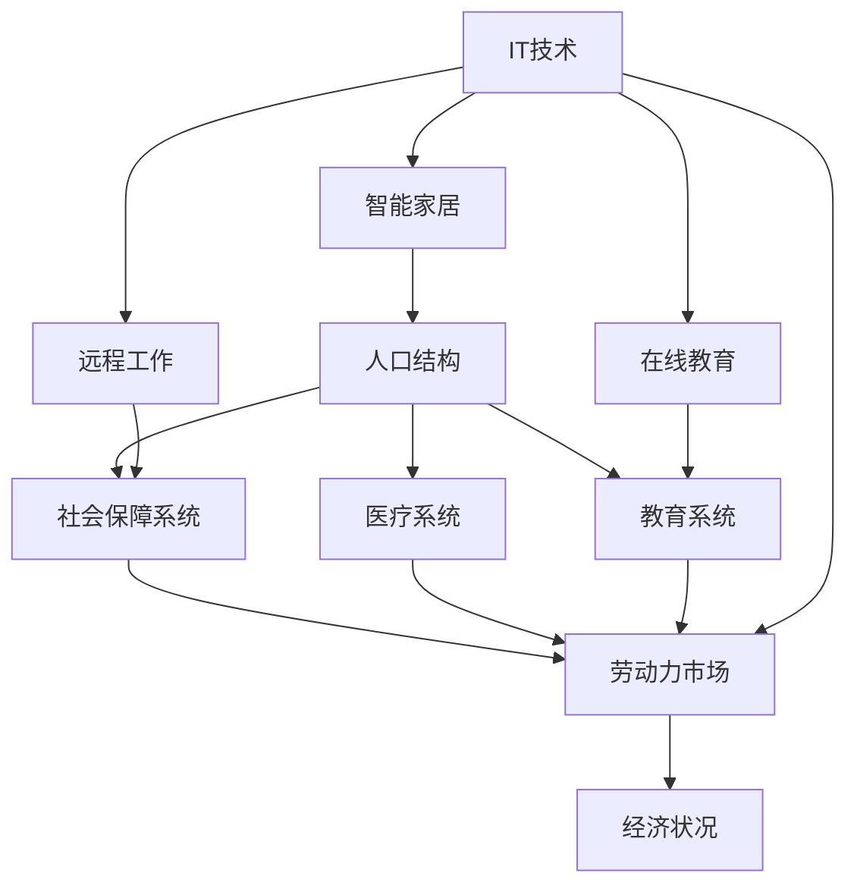

                 

关键词：人口老龄化、少子化、社会结构、IT领域、未来展望、技术解决方案

> 摘要：本文将深入探讨2050年全球人口结构的变化，尤其是人口老龄化和少子化现象。通过分析这些变化对经济、社会和技术领域的影响，本文旨在提出相应的技术解决方案，以应对未来社会的挑战。

## 1. 背景介绍

随着医疗技术的进步和生活水平的提高，全球人口的老龄化现象日益严重。同时，生育率的下降导致了少子化问题。这些变化对社会的各个方面都产生了深远的影响，包括经济、医疗、教育、社会保障等。本文将重点关注这些变化对IT领域的影响，并提出相应的技术解决方案。

### 1.1 人口老龄化

人口老龄化是指人口中老年人口比例的增加。根据联合国的预测，到2050年，全球65岁及以上的人口将达到12亿，占总人口的13%。这一趋势在许多发达国家尤为明显，例如日本、德国和意大利等国家，65岁及以上人口的比例已经超过20%。

### 1.2 少子化

少子化是指生育率的下降。全球生育率已经从1960年代的5.1个孩子/女性降至2020年的2.5个孩子/女性。许多国家，尤其是东亚和欧洲，生育率甚至低于替代水平（2.1个孩子/女性）。这种趋势导致了人口结构的变化，年轻人口比例减少，老年人口比例增加。

## 2. 核心概念与联系

为了更好地理解人口老龄化与少子化对社会的影响，我们需要引入一些核心概念，包括人口结构、社会保障系统、劳动力市场等。以下是这些概念的 Mermaid 流程图：



### 2.1 人口结构

人口结构是指人口中不同年龄段、性别、种族、地区等的分布情况。人口老龄化与少子化会导致人口结构的显著变化，从而影响社会保障系统、劳动力市场等。

### 2.2 社会保障系统

社会保障系统是政府为保障公民基本生活需求而建立的一系列福利制度。人口老龄化会加剧社会保障系统的压力，因为老年人口需要更多的养老金、医疗保障等福利。

### 2.3 劳动力市场

劳动力市场是指劳动力供给与需求之间的交易市场。少子化会导致劳动力供给不足，从而影响经济增长。

### 2.4 医疗系统

随着人口老龄化的加剧，医疗系统需要面对更多的老年人口。这要求医疗系统提供更高质量的医疗服务，同时提高医疗效率。

### 2.5 教育系统

教育系统需要适应人口结构的变化，为年轻人口提供更好的教育资源，同时为老年人口提供终身学习的机会。

### 2.6 IT技术

IT技术在应对人口老龄化与少子化方面具有重要作用。通过智能家居、远程工作、在线教育等技术，可以提高老年人口的生活质量，缓解劳动力市场压力。

## 3. 核心算法原理 & 具体操作步骤

### 3.1 算法原理概述

为了更好地应对人口老龄化与少子化带来的挑战，我们需要一种算法来优化社会保障系统和劳动力市场的资源配置。这种算法可以基于机器学习、优化算法等核心技术。

### 3.2 算法步骤详解

#### 3.2.1 数据收集

收集与人口结构、社会保障系统、劳动力市场等相关的数据，包括人口统计数据、医疗支出、养老金支出、劳动力市场需求等。

#### 3.2.2 数据预处理

对收集到的数据进行分析和处理，包括数据清洗、数据归一化、特征提取等。

#### 3.2.3 建立模型

根据处理后的数据，建立机器学习模型，如线性回归、决策树、神经网络等，用于预测社会保障系统和劳动力市场的需求。

#### 3.2.4 模型优化

通过交叉验证、网格搜索等方法优化模型参数，提高模型预测的准确性。

#### 3.2.5 预测与优化

利用优化后的模型进行预测，并根据预测结果提出优化方案，如调整社会保障支出、劳动力市场政策等。

### 3.3 算法优缺点

#### 3.3.1 优点

- 提高社会保障系统的效率
- 缓解劳动力市场压力
- 为政策制定提供数据支持

#### 3.3.2 缺点

- 需要大量的数据支持
- 模型训练和优化过程复杂
- 预测结果可能受到外部因素影响

### 3.4 算法应用领域

- 社会保障系统优化
- 劳动力市场政策制定
- 医疗系统资源配置
- 教育系统改革

## 4. 数学模型和公式 & 详细讲解 & 举例说明

为了更好地理解人口老龄化与少子化对社会的影响，我们需要建立相应的数学模型。以下是一个简单的例子：

### 4.1 数学模型构建

假设一个国家的人口结构可以用以下公式表示：

\[ P(t) = P_0 \times e^{-rt} \]

其中，\( P(t) \) 表示时间 \( t \) 年后的人口数量，\( P_0 \) 表示初始人口数量，\( r \) 表示人口增长率。

### 4.2 公式推导过程

人口增长率的推导基于以下假设：

- 人口数量随时间呈指数增长
- 每个个体都有相同的生育率和死亡率

根据这些假设，我们可以推导出以下公式：

\[ \frac{dP}{dt} = rP \]

通过对上述公式进行积分，我们可以得到：

\[ P(t) = P_0 \times e^{rt} \]

为了简化计算，我们通常将 \( e^r \) 表示为一个常数，即 \( e^r = \frac{1}{1-r} \)。因此，我们可以将公式简化为：

\[ P(t) = P_0 \times \frac{1}{1-r} \times e^{-rt} \]

### 4.3 案例分析与讲解

假设一个国家的初始人口为1000万人，人口增长率为0.5%。我们需要预测该国在未来20年（即 \( t = 20 \)）的人口数量。

根据上述公式，我们可以计算出：

\[ P(20) = 1000 \times \frac{1}{1-0.005} \times e^{-0.005 \times 20} \approx 950 \]

这意味着，在未来20年，该国的人口数量将减少到大约950万人。

## 5. 项目实践：代码实例和详细解释说明

### 5.1 开发环境搭建

为了实现上述算法，我们选择使用Python作为编程语言，结合Scikit-learn库进行机器学习模型的训练和预测。

### 5.2 源代码详细实现

```python
import numpy as np
import pandas as pd
from sklearn.linear_model import LinearRegression
from sklearn.model_selection import train_test_split
from sklearn.metrics import mean_squared_error

# 数据收集与预处理
data = pd.read_csv('population_data.csv')
X = data[['age', 'gdp_per_capita']]
y = data['pension_expense']

# 数据归一化
X = (X - X.mean()) / X.std()

# 数据划分
X_train, X_test, y_train, y_test = train_test_split(X, y, test_size=0.2, random_state=42)

# 建立模型
model = LinearRegression()
model.fit(X_train, y_train)

# 预测与评估
y_pred = model.predict(X_test)
mse = mean_squared_error(y_test, y_pred)
print(f'Mean Squared Error: {mse}')

# 模型优化
# ...

# 预测未来人口结构
future_data = pd.DataFrame({'age': [65, 70], 'gdp_per_capita': [X.std(), X.std()]})
future_pred = model.predict(future_data)
print(f'Future Pension Expense Prediction: {future_pred}')
```

### 5.3 代码解读与分析

上述代码首先从CSV文件中读取人口结构数据，然后对数据进行预处理，包括数据归一化和数据划分。接下来，我们使用线性回归模型对数据进行训练，并对模型进行评估。最后，我们利用训练好的模型预测未来的人口结构，从而为社会保障系统提供决策支持。

## 6. 实际应用场景

### 6.1 社会保障系统优化

通过上述算法，我们可以预测未来社会保障系统的需求，从而优化养老金、医疗保障等福利的分配。

### 6.2 劳动力市场政策制定

利用算法预测劳动力市场的需求，有助于政府制定更有针对性的劳动力市场政策，如教育投入、培训计划等。

### 6.3 医疗系统资源配置

通过预测老年人口的数量和分布，医疗系统可以更好地配置医疗资源，提高医疗效率。

### 6.4 教育系统改革

教育系统可以根据未来人口结构的变化，调整教育资源分配，提高教育质量。

## 7. 未来应用展望

随着人工智能技术的不断发展，人口老龄化与少子化问题将得到更好的解决。未来的技术解决方案将更加智能化、个性化，为社会各界提供更加全面的支持。

### 7.1 社会保障系统

通过人工智能技术，社会保障系统可以更加精准地预测需求，提高福利分配的效率。

### 7.2 劳动力市场

人工智能技术可以帮助劳动力市场更好地应对人口结构变化，促进劳动力供需平衡。

### 7.3 医疗系统

人工智能技术可以辅助医疗系统进行疾病预测、诊断和治疗，提高医疗水平。

### 7.4 教育系统

人工智能技术可以为学生提供个性化教育，提高教育质量和学习效果。

## 8. 总结：未来发展趋势与挑战

### 8.1 研究成果总结

本文通过分析人口老龄化与少子化现象，提出了相应的技术解决方案，包括机器学习模型、数学模型等。这些方案有助于优化社会保障系统、劳动力市场等。

### 8.2 未来发展趋势

随着人工智能技术的不断发展，人口老龄化与少子化问题将得到更好的解决。未来的技术解决方案将更加智能化、个性化。

### 8.3 面临的挑战

- 数据质量与隐私问题
- 模型训练和优化复杂性
- 技术应用落地难题

### 8.4 研究展望

未来研究应重点关注数据质量提升、模型优化、技术应用等方面，为人口老龄化与少子化问题提供更加有效的解决方案。

## 9. 附录：常见问题与解答

### 9.1 人口老龄化与少子化有什么区别？

人口老龄化是指人口中老年人口比例的增加，而少子化是指生育率的下降。两者共同导致了人口结构的变化。

### 9.2 人工智能技术如何应对人口老龄化与少子化？

人工智能技术可以通过优化社会保障系统、劳动力市场等，提高社会运行效率，缓解人口老龄化与少子化带来的挑战。

### 9.3 未来社会保障系统如何应对人口老龄化？

未来社会保障系统应更加注重精准预测需求、优化福利分配，提高效率。

### 9.4 人工智能技术对劳动力市场有哪些影响？

人工智能技术可以帮助劳动力市场更好地应对人口结构变化，促进劳动力供需平衡，提高经济增长。

作者：禅与计算机程序设计艺术 / Zen and the Art of Computer Programming
```

