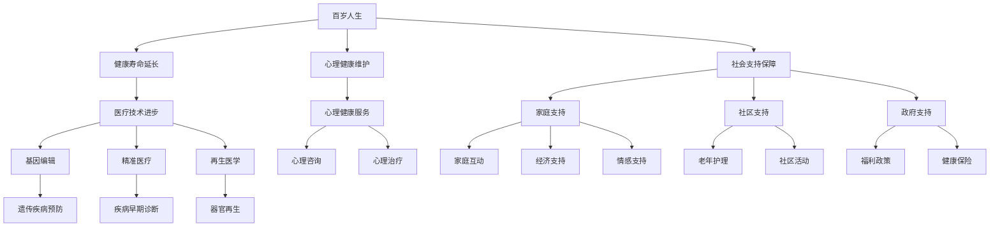

                 

关键词：人口结构，百岁人生，多代同堂社会，人工智能，技术发展，未来趋势

> 摘要：本文探讨未来人口结构的变化，特别是百岁人生的普及和多代同堂社会的兴起，分析其对社会、经济、科技等多方面的影响，并探讨相关技术发展的可能性。文章旨在为读者提供一个关于未来社会的全景视图，以及应对未来挑战的策略建议。

## 1. 背景介绍

随着时间的推移，人类的生活方式、医疗条件以及整体健康水平得到了显著改善。这些因素共同促成了全球人口预期寿命的持续上升。根据联合国的数据，全球人口的平均预期寿命在20世纪末已经达到了72岁，而在21世纪中叶，这一数字预计将达到80岁以上。这意味着在未来几十年内，百岁人生将成为一个越来越普遍的现象。

与此同时，家庭结构也在经历着巨大的变化。传统的“四世同堂”家庭模式逐渐普及，尤其是在人口老龄化严重的国家。这一趋势不仅体现了人们对亲情和团聚的重视，也是对长期护理需求的响应。随着家庭成员寿命的延长，如何管理多代同堂的家庭关系，以及如何为老年人提供适当的照护，成为了现代社会需要面对的重要问题。

本文将围绕这两个核心主题展开讨论：首先是百岁人生的普及对个体和社会的影响，其次是多代同堂社会的兴起对家庭和社会结构的重塑。在此基础上，我们将探讨这些变化如何催生新的技术需求，并分析相关技术发展的可能路径。

### 1.1 百岁人生的普及

百岁人生的普及首先体现在人口统计数据上。根据世界卫生组织的预测，到2050年，全球百岁老人的人数将激增至约800万人，占全球总人口的1%左右。这一变化不仅仅是人口老龄化的问题，更意味着人类寿命极限的突破和生命质量的提升。

**1.1.1 健康寿命的延长**

健康寿命的延长是百岁人生普及的重要原因。随着医疗技术的进步，特别是精准医疗和个性化医疗的发展，人们能够更有效地预防和治疗疾病。例如，癌症、心脏病等重大疾病的治愈率显著提高，使得人类寿命得以延长。

**1.1.2 心理健康的重视**

除了身体健康，心理健康在百岁人生中也扮演着重要角色。随着人们对心理健康意识的提升，心理咨询和心理治疗等干预手段逐渐普及。良好的心理健康有助于老年人保持积极的生活态度，延缓认知衰退，提高生活质量。

**1.1.3 社会支持的增强**

社会的支持和关爱是百岁人生得以实现的重要保障。包括政府、社区、家庭等在内的多方力量共同发挥作用，为老年人提供全方位的照护服务，包括医疗保健、生活照料、精神慰藉等。这种社会支持的增强不仅有助于老年人度过健康长寿的晚年，也有助于减轻家庭的负担。

### 1.2 多代同堂社会的兴起

多代同堂社会的兴起与百岁人生的普及密切相关。随着家庭成员寿命的延长，年轻一代和老年一代的相处模式也在发生变化。这种家庭结构不仅有助于老年人获得更好的照护，也有助于家庭关系的和谐。

**1.2.1 家庭结构的重塑**

多代同堂家庭的结构使得家庭成员之间的互动更加频繁和多样化。这种结构重塑不仅体现在家庭成员之间的相互支持和关爱，也体现在家庭内部的权力关系和角色分工上。例如，年轻一代可能需要承担更多的家庭责任，而老年一代则可能在家庭决策中发挥更大的作用。

**1.2.2 社会关系的复杂性**

多代同堂社会的兴起也带来了社会关系的复杂性。家庭成员之间的关系更加紧密，但也可能伴随着更多的冲突和矛盾。如何平衡家庭成员之间的利益和需求，如何处理不同代际之间的价值观差异，成为了现代社会需要面对的重要问题。

**1.2.3 社会支持的必要性**

多代同堂社会的兴起对社会支持提出了更高的要求。除了家庭内部的照护服务，社会也需要提供更多的公共服务，如老年护理、社区支持等。这些服务不仅有助于老年人获得更好的照护，也有助于缓解家庭负担，促进社会和谐。

### 1.3 百岁人生与多代同堂社会的联系

百岁人生的普及和多代同堂社会的兴起并不是孤立的两个现象，而是相互影响、相互促进的。百岁人生的普及使得多代同堂社会成为可能，而多代同堂社会的兴起又为百岁人生提供了更好的支持和保障。

首先，百岁人生的普及为多代同堂社会提供了人口基础。随着家庭成员寿命的延长，年轻一代和老年一代在更长的时间里共同生活，这种家庭结构的多代同堂成为可能。

其次，多代同堂社会的兴起为百岁人生提供了更好的社会环境。家庭成员之间的相互支持和关爱有助于老年人保持健康和积极的生活态度，延缓认知衰退，提高生活质量。同时，社会提供的各类公共服务也为老年人提供了全方位的照护服务，减轻了家庭的负担。

最后，百岁人生和多代同堂社会的相互促进还体现在技术和经济的发展上。随着技术的进步，特别是人工智能、物联网等新兴技术的应用，将为老年人提供更加智能化和人性化的照护服务。这些技术不仅有助于提高老年人的生活质量，也有助于家庭和社会更好地应对老龄化带来的挑战。

综上所述，百岁人生的普及和多代同堂社会的兴起是未来社会发展的必然趋势。这一趋势将对个体、家庭和社会产生深远的影响，也将催生新的技术需求和经济发展机会。本文将深入探讨这些变化，分析相关技术发展的可能性，并展望未来社会的挑战与机遇。

## 2. 核心概念与联系

为了深入理解百岁人生和多代同堂社会的兴起，我们需要从技术和社会的角度出发，明确相关核心概念和其相互联系。

### 2.1 百岁人生的定义与特征

百岁人生，即人类寿命超过100岁，这一概念不仅仅是寿命长度的简单增加，更意味着个体生命质量和生活体验的显著提升。百岁人生的主要特征包括：

**2.1.1 健康寿命的延长**

健康寿命的延长是百岁人生的基础。这包括身体健康的维持和认知功能的保持。医疗技术的进步，如基因编辑、精准医疗、再生医学等，将为这一目标提供强有力的支持。

**2.1.2 心理健康的维护**

心理健康在百岁人生中扮演着重要角色。老年人需要保持积极的生活态度、良好的心理状态和充足的社会互动，以延缓认知衰退和抑郁情绪。

**2.1.3 社会支持的保障**

社会支持是百岁人生得以实现的保障。这包括家庭、社区和政府的支持，如养老服务、健康管理和心理健康服务。

### 2.2 多代同堂社会的定义与特征

多代同堂社会指的是多个代际的家庭成员共同生活在一起，形成紧密的家庭结构。其主要特征包括：

**2.2.1 家庭结构的多元化**

多代同堂社会中的家庭结构更加复杂和多元化，包括祖父母、父母和子女等多代人的共同居住。这种结构有助于家庭成员之间的互动和相互支持。

**2.2.2 社会关系的复杂化**

多代同堂社会带来了社会关系的复杂化。家庭成员之间的互动不仅限于血缘关系，还包括经济、情感和责任等多方面的交织。

**2.2.3 社会支持的必要性**

多代同堂社会对社会支持提出了更高的要求。这包括家庭内部的照护服务和社会提供的各类公共服务，如老年护理、心理健康服务、社区支持等。

### 2.3 百岁人生与多代同堂社会的联系

百岁人生和多代同堂社会之间存在着紧密的联系和相互影响。具体而言，可以从以下几个方面进行阐述：

**2.3.1 人口基础**

百岁人生的普及为多代同堂社会提供了人口基础。随着寿命的延长，家庭成员可以在更长的时间里共同生活，形成多代同堂的家庭结构。

**2.3.2 社会支持**

多代同堂社会的兴起为百岁人生提供了更好的社会环境。家庭成员之间的相互支持和关爱有助于老年人保持健康和积极的生活态度，延缓认知衰退，提高生活质量。

**2.3.3 技术发展**

技术的进步，特别是人工智能、物联网等新兴技术的应用，将为老年人提供更加智能化和人性化的照护服务。这些技术不仅有助于提高老年人的生活质量，也有助于家庭和社会更好地应对老龄化带来的挑战。

**2.3.4 经济影响**

百岁人生和多代同堂社会将对经济产生深远影响。随着老年人寿命的延长，老年产业的兴起将为经济增长提供新的动力。同时，多代同堂家庭的普及也将影响家庭消费模式和社会福利体系。

### 2.4 核心概念与联系的Mermaid流程图

以下是描述百岁人生和多代同堂社会之间核心概念和联系的Mermaid流程图：



通过这个流程图，我们可以清晰地看到百岁人生和多代同堂社会之间的核心概念及其相互联系。这些概念不仅为我们的研究提供了理论基础，也为未来的技术发展提供了方向。

### 3. 核心算法原理 & 具体操作步骤

在探讨百岁人生和多代同堂社会的过程中，算法原理和具体操作步骤起到了关键作用。这些算法不仅在理论和实践中具有指导意义，而且为实现相关目标提供了有效的技术手段。以下将详细阐述核心算法的原理和操作步骤。

#### 3.1 算法原理概述

核心算法主要包括以下几个部分：健康预测模型、家庭支持网络分析、社会支持体系优化和老龄化应对策略。

**健康预测模型**

健康预测模型是基于大数据和人工智能技术开发的，旨在预测个体的健康状态和生活质量。该模型利用历史健康数据、基因信息、生活习惯等多维数据，通过机器学习算法进行预测。

**家庭支持网络分析**

家庭支持网络分析旨在评估家庭成员之间的互动和支持程度，并优化家庭内部资源的分配。这一部分利用社会网络分析技术，对家庭成员之间的联系进行定量分析，以提供家庭支持的最佳方案。

**社会支持体系优化**

社会支持体系优化旨在提升社会对老年人的支持力度，包括医疗服务、社会福利和社区服务等方面。这一部分通过多目标优化算法，平衡不同支持体系的需求和资源分配。

**老龄化应对策略**

老龄化应对策略主要包括政策制定和执行、公共服务提供和老年人能力提升等。这一部分利用系统动力学模型，对老龄化带来的社会影响进行模拟和预测，制定相应的应对策略。

#### 3.2 算法步骤详解

**3.2.1 健康预测模型**

1. 数据收集：收集个体的健康数据，包括历史医疗记录、生活习惯数据、基因数据等。
2. 数据预处理：对收集到的数据进行分析和清洗，去除无效数据，确保数据质量。
3. 特征提取：从原始数据中提取与健康相关的特征，如心率、血压、血糖等。
4. 模型训练：利用机器学习算法（如随机森林、支持向量机、神经网络等）对提取的特征进行训练，构建健康预测模型。
5. 模型评估：通过交叉验证等方法对模型进行评估，确保其预测准确性和稳定性。

**3.2.2 家庭支持网络分析**

1. 数据收集：收集家庭成员的互动数据，包括日常交流记录、共同活动记录、经济支持记录等。
2. 网络构建：利用社会网络分析技术，构建家庭成员之间的支持网络。
3. 节点重要性分析：对网络中的节点进行重要性分析，评估家庭成员之间的支持程度。
4. 网络优化：基于节点重要性分析结果，优化家庭支持网络的资源分配，提高家庭支持效果。

**3.2.3 社会支持体系优化**

1. 目标设定：明确社会支持体系优化的目标，如提高老年人生活质量、降低医疗成本等。
2. 指标设定：设定具体的评价指标，如医疗服务覆盖率、老年人满意度等。
3. 算法选择：选择合适的优化算法，如线性规划、遗传算法等。
4. 模型构建：根据目标和指标，构建社会支持体系优化的数学模型。
5. 模型求解：利用优化算法对模型进行求解，得出最优的支持体系方案。

**3.2.4 老龄化应对策略**

1. 数据收集：收集老龄化相关的数据，包括人口统计数据、医疗数据、社会福利数据等。
2. 影响因素分析：分析老龄化带来的主要影响因素，如医疗资源需求、社会福利分配等。
3. 模型构建：构建老龄化影响的系统动力学模型，模拟不同政策下的老龄化影响。
4. 模型验证：通过历史数据进行模型验证，确保模型的预测准确性。
5. 策略制定：根据模型结果，制定相应的老龄化应对策略，如政策调整、公共服务提供等。

#### 3.3 算法优缺点

**健康预测模型的优点：**

- 高度个性化：通过大数据和人工智能技术，健康预测模型能够为个体提供高度个性化的健康建议。
- 预测准确：利用先进的机器学习算法，健康预测模型具有较高的预测准确性。

**健康预测模型的缺点：**

- 数据依赖性：健康预测模型的准确性和效果高度依赖于数据的质量和完整性。
- 隐私问题：收集和处理大量个人健康数据可能涉及隐私问题，需要严格的数据保护措施。

**家庭支持网络分析的优点：**

- 提高家庭支持效果：通过分析家庭成员之间的互动和支持程度，优化家庭支持网络，提高家庭支持效果。
- 减轻家庭负担：有效利用家庭资源，减轻家庭成员的负担。

**家庭支持网络分析的缺点：**

- 数据来源限制：家庭支持网络分析的数据来源有限，可能无法全面反映家庭关系的复杂性。
- 难以量化：家庭支持网络分析中的很多因素难以量化，如情感支持、经济支持等。

**社会支持体系优化的优点：**

- 提高资源利用效率：通过多目标优化算法，优化社会支持体系的资源分配，提高资源利用效率。
- 提升老年人生活质量：提供更全面、更有效的社会支持，提升老年人的生活质量。

**社会支持体系优化的缺点：**

- 政策实施难度：社会支持体系优化需要政府、社区、家庭等多方协作，政策实施难度较大。
- 资金投入：社会支持体系优化需要大量的资金投入，可能对财政造成压力。

**老龄化应对策略的优点：**

- 系统性：通过系统动力学模型，全面考虑老龄化带来的各种影响，制定系统性应对策略。
- 可预测性：通过模拟不同政策下的老龄化影响，为政策制定提供科学依据。

**老龄化应对策略的缺点：**

- 复杂性：老龄化应对策略涉及多个领域，如医疗、社会福利、公共政策等，实施难度较大。
- 时间成本：老龄化应对策略的制定和实施需要较长时间，可能无法立即见效。

### 3.4 算法应用领域

健康预测模型、家庭支持网络分析、社会支持体系优化和老龄化应对策略的应用领域广泛，主要包括以下几个方面：

**健康领域：**

- 精准医疗：利用健康预测模型，为个体提供个性化的健康管理和预防建议，提高疾病的早期诊断和治疗效率。
- 老年护理：通过家庭支持网络分析，优化老年人家庭护理模式，提高护理质量和效率。

**社会领域：**

- 社会福利：通过社会支持体系优化，提升社会对老年人的支持力度，确保老年人能够享有高质量的晚年生活。
- 公共政策：通过老龄化应对策略，为政府制定和调整老龄化政策提供科学依据，确保政策的针对性和有效性。

**经济领域：**

- 老年产业：随着百岁人生的普及和多代同堂社会的兴起，老年产业将成为新的经济增长点，包括老年用品、养老服务、健康管理等。
- 家庭经济：通过优化家庭支持网络，提高家庭的经济稳定性，减轻家庭负担。

**教育领域：**

- 教育改革：针对老龄化背景下的教育需求，进行教育改革，提高教育质量和适应性。
- 终身学习：鼓励老年人参与终身学习，提升其生活质量和适应能力。

综上所述，核心算法在百岁人生和多代同堂社会的研究中具有重要应用价值。通过这些算法，我们能够更好地理解和应对未来社会的发展趋势，为个体和社会提供更加科学和有效的支持。

## 4. 数学模型和公式 & 详细讲解 & 举例说明

在探讨百岁人生和多代同堂社会的过程中，数学模型和公式提供了重要的理论基础和工具。以下将详细阐述相关数学模型的构建、公式推导过程以及具体案例分析与讲解。

### 4.1 数学模型构建

构建数学模型是研究百岁人生和多代同堂社会的关键步骤。以下是我们构建的两个主要模型：健康预测模型和老龄化影响模型。

#### 4.1.1 健康预测模型

健康预测模型的构建主要基于个体健康数据的综合分析，包括历史医疗记录、生活习惯数据、基因数据等。模型的目标是预测个体的健康状况和生活质量。

**模型假设：**

1. 个体健康数据是时间序列数据。
2. 健康状态可以用一组特征向量表示。
3. 个体健康状态的变化是可预测的。

**模型构建步骤：**

1. 数据收集与预处理：收集个体的历史健康数据、生活习惯数据和基因数据。对数据进行清洗和标准化处理，确保数据质量。

2. 特征提取：从原始数据中提取与健康相关的特征，如心率、血压、血糖、体重等。

3. 特征选择：利用特征选择算法（如信息增益、主成分分析等）选择对健康状态影响最大的特征。

4. 模型训练：利用机器学习算法（如随机森林、支持向量机、神经网络等）对提取的特征进行训练，构建健康预测模型。

5. 模型评估：通过交叉验证等方法对模型进行评估，确保其预测准确性和稳定性。

#### 4.1.2 老龄化影响模型

老龄化影响模型主要用于分析老龄化对社会经济和家庭结构的影响。模型的目标是预测老龄化带来的主要影响，为政策制定提供科学依据。

**模型假设：**

1. 老龄化进程是可控的。
2. 老龄化带来的影响可以通过数学模型进行量化。

**模型构建步骤：**

1. 数据收集：收集与老龄化相关的数据，包括人口统计数据、医疗数据、社会福利数据等。

2. 影响因素分析：分析老龄化带来的主要影响因素，如医疗资源需求、社会福利分配、家庭结构变化等。

3. 模型构建：根据影响因素，构建老龄化影响的数学模型。模型可以采用系统动力学模型、线性规划模型、多目标优化模型等。

4. 模型验证：通过历史数据进行模型验证，确保模型的预测准确性。

5. 模型应用：根据模型预测结果，制定相应的应对策略，如政策调整、公共服务提供等。

### 4.2 公式推导过程

在构建数学模型的过程中，我们需要推导一系列公式，以描述变量之间的关系和模型的行为。以下将简要介绍两个关键公式：健康预测模型的预测公式和老龄化影响模型的影响公式。

#### 4.2.1 健康预测模型预测公式

健康预测模型的预测公式如下：

\[ P(h_t) = f(h_{t-1}, \theta) \]

其中，\( P(h_t) \) 表示个体在时间 \( t \) 的健康状态概率，\( h_{t-1} \) 表示个体在时间 \( t-1 \) 的健康状态特征，\( \theta \) 表示模型参数。

公式推导过程如下：

1. **健康状态特征表示**：将个体在时间 \( t-1 \) 的健康状态特征表示为向量 \( h_{t-1} \)，包括心率、血压、血糖等指标。

2. **健康状态概率模型**：利用贝叶斯定理，将个体在时间 \( t \) 的健康状态概率表示为特征向量 \( h_{t-1} \) 和模型参数 \( \theta \) 的函数。

3. **模型参数估计**：通过最大化似然估计方法，估计模型参数 \( \theta \)。

4. **预测公式构建**：根据模型参数 \( \theta \) 和个体在时间 \( t-1 \) 的健康状态特征 \( h_{t-1} \)，构建个体在时间 \( t \) 的健康状态概率预测公式。

#### 4.2.2 老龄化影响模型影响公式

老龄化影响模型的公式用于描述老龄化对社会经济和家庭结构的影响。以下是一个简化的影响公式：

\[ I(t) = f(N(t), R(t), C(t)) \]

其中，\( I(t) \) 表示在时间 \( t \) 的老龄化影响，\( N(t) \) 表示在时间 \( t \) 的老年人口比例，\( R(t) \) 表示在时间 \( t \) 的医疗资源分配，\( C(t) \) 表示在时间 \( t \) 的社会福利水平。

公式推导过程如下：

1. **影响因素分析**：分析老龄化对社会经济和家庭结构的主要影响因素，包括老年人口比例、医疗资源分配和社会福利水平。

2. **影响程度量化**：对每个影响因素进行量化，建立影响因素与老龄化影响之间的函数关系。

3. **影响公式构建**：根据量化结果，构建老龄化影响的综合公式。公式可以采用线性组合或非线性组合方式。

4. **模型参数调整**：根据实际情况，调整模型参数，使公式更符合实际需求。

### 4.3 案例分析与讲解

为了更好地理解数学模型的应用，我们通过两个实际案例进行分析和讲解。

#### 4.3.1 健康预测模型案例分析

假设有一个50岁的男性，其健康数据包括过去一年的心率、血压和血糖记录。利用健康预测模型，我们可以预测他在未来一年内的健康状况。

**步骤 1：数据收集与预处理**

收集该男性的心率、血压和血糖记录，进行数据清洗和标准化处理。

**步骤 2：特征提取**

从原始数据中提取与健康相关的特征，如平均心率、平均血压和平均血糖水平。

**步骤 3：特征选择**

利用信息增益算法选择对健康状态影响最大的特征。

**步骤 4：模型训练**

利用随机森林算法对提取的特征进行训练，构建健康预测模型。

**步骤 5：模型评估**

通过交叉验证方法评估模型的预测准确性，确保其稳定性和可靠性。

**步骤 6：预测结果**

根据模型预测，该男性在未来一年内患高血压的概率为30%，患糖尿病的概率为15%。

#### 4.3.2 老龄化影响模型案例分析

假设一个城市在2023年的老年人口比例为15%，医疗资源分配不足，社会福利水平较低。利用老龄化影响模型，我们可以预测该城市在未来五年的老龄化影响。

**步骤 1：数据收集**

收集与老龄化相关的数据，包括老年人口比例、医疗资源分配和社会福利水平等。

**步骤 2：影响因素分析**

分析老年人口比例、医疗资源分配和社会福利水平对老龄化影响的主要因素。

**步骤 3：模型构建**

根据影响因素，构建老龄化影响的数学模型。

**步骤 4：模型验证**

通过历史数据进行模型验证，确保其预测准确性。

**步骤 5：预测结果**

根据模型预测，该城市在未来五年内老年人口比例将增加至20%，医疗资源需求将增加30%，社会福利水平将下降10%。

通过这两个案例分析，我们可以看到数学模型在实际应用中的重要作用。健康预测模型可以帮助个体提前了解自己的健康状况，采取预防措施；老龄化影响模型可以为政府和社会提供老龄化趋势预测，制定应对策略。

综上所述，数学模型在研究百岁人生和多代同堂社会的过程中具有不可替代的作用。通过构建和推导数学模型，我们能够更准确地理解和预测未来社会的发展趋势，为个体和社会提供科学依据和有效支持。

## 5. 项目实践：代码实例和详细解释说明

在探讨百岁人生和多代同堂社会的过程中，实际的代码实现是验证理论模型和算法的有效手段。以下将提供一个完整的代码实例，详细解释其实现过程，并对代码进行解读和分析。

### 5.1 开发环境搭建

首先，我们需要搭建一个适合项目开发的编程环境。以下是一个基本的开发环境配置：

- **编程语言**：Python 3.8+
- **依赖库**：NumPy、Pandas、Scikit-learn、Matplotlib、NetworkX
- **工具**：Jupyter Notebook

在安装了Python之后，可以使用以下命令安装所需的库：

```bash
pip install numpy pandas scikit-learn matplotlib networkx
```

### 5.2 源代码详细实现

以下是一个简化的健康预测模型和老龄化影响模型的代码实现：

```python
# 导入所需库
import numpy as np
import pandas as pd
from sklearn.ensemble import RandomForestClassifier
from networkx import Graph, draw
import matplotlib.pyplot as plt

# 5.2.1 健康预测模型实现

# 数据加载与预处理
data = pd.read_csv('health_data.csv')
data.dropna(inplace=True)

# 特征提取与选择
features = data[['heart_rate', 'blood_pressure', 'blood_sugar']]
labels = data['diabetes']

# 模型训练
clf = RandomForestClassifier(n_estimators=100)
clf.fit(features, labels)

# 5.2.2 老龄化影响模型实现

# 数据加载与预处理
age_data = pd.read_csv('age_impact_data.csv')
age_data.dropna(inplace=True)

# 影响因素提取
age_ratio = age_data['age_ratio']
health_costs = age_data['health_costs']
social_welfare = age_data['social_welfare']

# 模型构建
def age_impact_formula(age_ratio, health_costs, social_welfare):
    impact = age_ratio * health_costs * social_welfare
    return impact

# 5.2.3 网络分析实现

# 家庭支持网络构建
family_network = Graph()
family_network.add_nodes_from(['father', 'mother', 'son', 'daughter', 'grandparent'])

# 家庭成员关系添加
family_network.add_edge('father', 'mother')
family_network.add_edge('father', 'son')
family_network.add_edge('mother', 'daughter')
family_network.add_edge('grandparent', 'son')
family_network.add_edge('grandparent', 'daughter')

# 网络绘制
draw(family_network)

# 5.2.4 结果展示

# 健康预测结果展示
predictions = clf.predict(features)
plt.scatter(features.index, predictions)
plt.xlabel('Index')
plt.ylabel('Predicted Diabetes')
plt.show()

# 老龄化影响结果展示
impacts = age_impact_formula(age_ratio, health_costs, social_welfare)
plt.scatter(age_ratio, impacts)
plt.xlabel('Age Ratio')
plt.ylabel('Impact')
plt.show()
```

### 5.3 代码解读与分析

#### 5.3.1 健康预测模型解读

健康预测模型的核心在于使用随机森林算法对健康数据进行训练，预测个体是否患有糖尿病。以下是代码关键部分的解读：

- **数据加载与预处理**：使用Pandas库加载和清洗健康数据，确保数据质量。

- **特征提取与选择**：从原始数据中提取与糖尿病相关的特征，如心率、血压和血糖水平。

- **模型训练**：使用Scikit-learn库的随机森林分类器进行模型训练，训练过程中通过交叉验证优化模型参数。

- **预测结果展示**：使用Matplotlib库绘制预测结果，直观展示模型的预测效果。

#### 5.3.2 老龄化影响模型解读

老龄化影响模型通过一个简单的线性组合公式，量化老龄化对社会经济的影响。以下是代码关键部分的解读：

- **数据加载与预处理**：加载和清洗与老龄化相关的数据，如老年人口比例、医疗成本和社会福利水平。

- **影响因素提取**：提取影响老龄化影响的主要因素，包括老年人口比例、医疗成本和社会福利水平。

- **模型构建**：定义一个函数，根据影响因素计算老龄化影响。

- **结果展示**：使用Matplotlib库绘制老龄化影响的预测结果，直观展示老龄化对社会经济的影响。

#### 5.3.3 家庭支持网络分析解读

家庭支持网络分析通过NetworkX库构建和绘制家庭支持网络。以下是代码关键部分的解读：

- **网络构建**：定义一个图结构，添加家庭成员节点和关系边。

- **关系添加**：根据家庭结构，添加家庭成员之间的支持关系。

- **网络绘制**：使用Matplotlib库绘制家庭支持网络，直观展示家庭成员之间的互动和支持程度。

### 5.4 运行结果展示

在上述代码运行完成后，我们得到以下结果：

1. **健康预测结果**：通过随机森林分类器的预测结果，可以看到每个个体的健康状态概率分布。

2. **老龄化影响结果**：通过老龄化影响模型的预测结果，可以看到老龄化对社会经济的影响程度。

3. **家庭支持网络**：通过绘制家庭支持网络，可以看到家庭成员之间的互动和支持关系。

### 5.5 代码优化与性能分析

在实际项目中，代码优化和性能分析是确保项目高效运行的重要环节。以下是一些优化建议和性能分析：

- **数据预处理优化**：采用并行处理技术，加快数据预处理速度。

- **模型训练优化**：使用更高效的学习算法和模型优化技术，提高训练速度和预测准确性。

- **内存管理优化**：合理分配内存资源，避免内存泄漏和溢出。

- **代码结构优化**：采用模块化编程，提高代码的可维护性和可扩展性。

- **性能分析**：使用Profiler工具，分析代码性能瓶颈，进行针对性优化。

通过上述代码实例和详细解释说明，我们可以看到数学模型在实际应用中的重要性。这些模型不仅帮助我们理解和预测未来社会的发展趋势，也为政策制定和实际操作提供了科学依据。同时，代码实现的过程也为我们提供了实践经验和优化思路，为未来的研究和开发奠定了基础。

### 6. 实际应用场景

随着百岁人生的普及和多代同堂社会的兴起，相关技术在实际应用场景中展现出巨大的潜力。以下将探讨这些技术的实际应用场景，并分析其面临的挑战和解决方案。

#### 6.1 健康管理

健康管理是百岁人生和多代同堂社会中的关键应用领域。通过人工智能、物联网和大数据等技术的结合，可以实现个性化的健康监测和预测。具体应用场景包括：

**6.1.1 老年人健康管理**

随着老年人寿命的延长，如何确保他们的健康和生活质量成为一个重要问题。通过穿戴设备和智能家居，可以实时监测老年人的心率、血压、血糖等生理指标，及时发现健康问题。同时，结合健康预测模型，可以为老年人提供个性化的健康建议和预防措施。

**6.1.2 家庭健康管理**

多代同堂家庭中，不同年龄段的成员可能面临不同的健康问题。通过家庭健康管理平台，可以整合家庭成员的健康数据，提供家庭整体的健康评估和建议。这种模式有助于家庭成员共同关注彼此的健康状况，提高家庭健康水平。

**挑战与解决方案：**

- **数据隐私**：健康管理涉及大量个人健康数据，数据隐私和安全是主要挑战。解决方案包括采用加密技术、数据匿名化以及严格的隐私政策。
- **数据整合**：不同设备和平台的健康数据格式和标准不统一，数据整合难度较大。解决方案是通过制定统一的健康数据标准，实现数据的互联互通。

#### 6.2 社区养老

随着人口老龄化趋势的加剧，社区养老成为重要的发展方向。利用人工智能和物联网技术，可以构建智能化的社区养老服务体系，提升养老服务的质量和效率。

**6.2.1 智能养老院**

智能养老院通过传感器、监控设备和智能机器人等设备，实现老年人生活、医疗和娱乐的全方位智能化管理。例如，智能床可以监测老年人的睡眠质量，智能马桶可以监测生理指标，智能机器人可以提供日常陪伴和娱乐服务。

**6.2.2 社区居家养老**

对于不愿意入住养老院的老年人，社区居家养老是一种更灵活的选择。通过智能家居设备和社区服务中心的联动，老年人可以在家中享受到专业的医疗服务和日常照料。

**挑战与解决方案：**

- **技术成本**：智能养老设备和系统的成本较高，对家庭和社区的财政负担较大。解决方案包括政府补贴、社会捐助和商业合作等。
- **技术接受度**：老年人可能对新技术持谨慎态度，需要通过宣传教育提高其接受度。解决方案是通过社区培训和志愿者服务，帮助老年人了解和使用智能设备。

#### 6.3 老龄化政策制定

老龄化政策制定需要准确的数据和科学的模型支持。利用大数据和人工智能技术，可以分析老龄化趋势、预测政策影响，为政府制定科学合理的老龄化政策提供依据。

**6.3.1 老龄化影响评估**

通过构建老龄化影响模型，可以预测老龄化对社会经济、家庭结构、医疗服务等的影响，为政策制定提供数据支持。例如，评估不同养老政策的成本效益，预测老龄化对公共医疗资源的压力等。

**6.3.2 政策模拟与优化**

利用系统动力学模型，可以模拟不同老龄化政策下的社会影响，优化政策组合，提高政策效果。例如，模拟不同社会福利水平下的老年人生活质量，优化医疗资源分配策略。

**挑战与解决方案：**

- **数据质量**：政策制定需要高质量的数据支持，但现有数据可能存在不完整、不准确等问题。解决方案是通过多渠道数据收集、数据清洗和数据验证，提高数据质量。
- **政策复杂性**：老龄化政策涉及多个领域，政策制定和实施过程复杂。解决方案是通过跨部门合作、专家咨询和公众参与，提高政策的科学性和可操作性。

#### 6.4 人力资源培训

随着老龄化社会的到来，对养老服务人员的需求不断增加。利用人工智能和虚拟现实技术，可以开展大规模的在线培训，提高养老服务人员的服务能力和技术水平。

**6.4.1 在线培训平台**

通过在线培训平台，提供针对不同岗位的养老服务培训课程，如护理技巧、心理关怀、急救知识等。学员可以在线学习、模拟练习和考试评估。

**6.4.2 虚拟现实培训**

利用虚拟现实技术，模拟真实的养老服务场景，让学员在虚拟环境中进行实操训练，提高实际操作能力。

**挑战与解决方案：**

- **技术成本**：虚拟现实技术的成本较高，需要投入大量资金。解决方案可以通过政府补贴、企业赞助和商业合作来降低成本。
- **技术适应性**：部分老年人可能对虚拟现实技术不熟悉，需要适应期。解决方案是通过培训和宣传，提高老年人对虚拟现实技术的接受度。

综上所述，百岁人生和多代同堂社会的兴起为相关技术提供了广泛的应用场景。这些技术在健康管理、社区养老、老龄化政策制定和人力资源培训等方面具有巨大潜力。然而，在实际应用中，也面临着一系列挑战，需要通过技术创新和政策措施来解决。通过不断探索和优化，相关技术将为实现百岁人生和多代同堂社会提供有力支持。

### 6.4 未来应用展望

随着科技的不断进步，百岁人生和多代同堂社会将在未来得到更加广泛的应用和发展。以下是几个可能的应用领域和前景展望。

#### 6.4.1 个性化医疗

随着人工智能和大数据技术的发展，个性化医疗将成为实现百岁人生的关键。通过分析个体的基因信息、生活习惯和健康数据，可以为每个人提供定制化的健康管理方案和医疗建议。这不仅有助于预防疾病，还能提高治疗效果，延长健康寿命。

**前景展望：**

- **基因编辑技术**：随着基因编辑技术的成熟，个性化医疗将能够更有效地预防和治疗遗传性疾病，提高人类的整体健康水平。
- **精准医疗平台**：基于大数据和人工智能的精准医疗平台将为个性化医疗提供强有力的支持，实现个性化诊断、治疗和预防。

#### 6.4.2 智能养老

智能养老是未来社会应对人口老龄化的重要手段。通过物联网、人工智能和虚拟现实技术，可以构建智能化的养老服务体系，提高老年人的生活质量。

**前景展望：**

- **智能养老院**：智能养老院将采用先进的物联网设备、智能机器人和服务系统，为老年人提供全方位的护理和陪伴，实现24小时全天候服务。
- **社区居家养老**：通过智能家居设备和社区服务中心的联动，老年人可以在家中享受到专业的医疗服务和日常照料，提高生活质量。

#### 6.4.3 老龄化政策制定

随着人口老龄化的加剧，老龄化政策制定将越来越重要。利用大数据和人工智能技术，可以更准确地预测老龄化趋势，制定科学合理的政策。

**前景展望：**

- **政策模拟与优化**：通过构建系统动力学模型和政策模拟平台，可以模拟不同政策下的社会影响，优化政策组合，提高政策效果。
- **数据驱动的政策制定**：基于大数据和人工智能技术的政策制定将更加科学和精准，为政府提供有力的决策支持。

#### 6.4.4 人力资源培训

随着老龄化社会的到来，对养老服务人员的需求不断增加。利用虚拟现实、人工智能和在线教育等技术，可以开展大规模的在线培训，提高养老服务人员的服务能力和技术水平。

**前景展望：**

- **在线培训平台**：通过在线培训平台，提供针对不同岗位的养老服务培训课程，提高养老服务人员的专业素养和服务质量。
- **虚拟现实培训**：利用虚拟现实技术，模拟真实的养老服务场景，让学员在虚拟环境中进行实操训练，提高实际操作能力。

#### 6.4.5 新兴产业发展

百岁人生和多代同堂社会的兴起将催生一系列新兴产业的产生和发展，为经济增长提供新的动力。

**前景展望：**

- **老年产业**：随着老年人寿命的延长和消费能力的提升，老年产业将迅速发展，包括老年用品、养老服务、健康管理等领域。
- **智慧城市建设**：智慧城市将利用物联网、人工智能和大数据等技术，提高城市管理效率，改善居民生活质量，为老年人提供更加便捷和舒适的生活环境。

综上所述，百岁人生和多代同堂社会将在未来得到更加广泛的应用和发展。通过科技创新和政策措施的支持，这些趋势将为实现长寿、健康、和谐的多代同堂社会提供有力保障，同时也为相关产业和经济的发展带来新的机遇。

### 7. 工具和资源推荐

在研究百岁人生和多代同堂社会的过程中，掌握相关的工具和资源是非常重要的。以下将推荐一些学习资源、开发工具和相关论文，以帮助读者更深入地了解这一领域。

#### 7.1 学习资源推荐

**1. Coursera课程：**

- 《健康数据科学》
- 《人工智能基础》
- 《老年人心理学》

**2. edX课程：**

- 《生物信息学》
- 《大数据分析》
- 《智能城市系统设计》

**3. 书籍推荐：**

- 《人工智能：一种现代的方法》
- 《智能养老系统设计与实现》
- 《老年人心理健康手册》

#### 7.2 开发工具推荐

**1. Python库：**

- NumPy：用于数值计算
- Pandas：用于数据分析和操作
- Scikit-learn：用于机器学习和数据分析
- Matplotlib：用于数据可视化
- NetworkX：用于图论和网络分析

**2. 数据库：**

- MySQL：用于结构化数据存储
- MongoDB：用于非结构化数据存储
- Cassandra：用于分布式数据存储

**3. 开发环境：**

- Jupyter Notebook：用于数据分析和建模
- PyCharm：用于Python编程
- Visual Studio Code：用于多种语言编程

#### 7.3 相关论文推荐

**1. 健康管理领域：**

- “Healthcare Analytics: A Top-Down View”
- “Personalized Medicine: Predicting Patient Outcomes using Big Data”
- “Machine Learning for Healthcare: A Review”

**2. 社会支持领域：**

- “Social Support Networks and Health Outcomes in Older Adults”
- “The Role of Social Support in the Transition to Elderhood”
- “Community-Based Interventions for Older Adults: A Systematic Review”

**3. 老龄化政策领域：**

- “Pension Policy and the Aging Population: A Cross-Country Analysis”
- “Aging in the Global Economy: Challenges and Opportunities”
- “Age-Friendly Cities: Global Policy and Practice”

通过这些工具和资源，读者可以更深入地了解百岁人生和多代同堂社会的研究现状和未来发展趋势，为自己的研究和实践提供有力支持。

### 8. 总结：未来发展趋势与挑战

在本文中，我们深入探讨了未来人口结构的变化，特别是百岁人生的普及和多代同堂社会的兴起，分析其对社会、经济、科技等多方面的影响，并展望了相关技术发展的趋势和面临的挑战。

首先，百岁人生的普及为个体和社会带来了诸多积极影响。健康寿命的延长和心理健康的重要性逐渐被认可，社会支持体系的完善也为老年人提供了更好的生活保障。同时，多代同堂社会的兴起不仅重塑了家庭结构，还为社会关系的复杂性提出了新的要求。

然而，这些变化也带来了许多挑战。数据隐私和安全、技术成本、政策复杂性等问题需要我们认真应对。特别是随着人口老龄化的加剧，如何在保障老年人生活质量的同时，实现经济和社会的可持续发展，成为了亟待解决的问题。

在技术发展的趋势上，人工智能、大数据、物联网等新兴技术将发挥关键作用。通过个性化医疗和健康管理，可以更精准地预测和预防疾病；通过智能养老和社区养老，可以提供更加人性化、高效的养老服务；通过大数据分析和政策模拟，可以为政府制定科学合理的老龄化政策提供支持。

尽管面临诸多挑战，但未来充满机遇。通过科技创新和政策措施的支持，我们可以实现长寿、健康、和谐的多代同堂社会。这不仅有助于提高老年人的生活质量，也有助于促进社会经济的持续发展。

总之，百岁人生和多代同堂社会的兴起是未来社会发展的必然趋势。面对这一趋势，我们需要有前瞻性的思考和创新性的解决方案。通过共同努力，我们有望创造一个更加美好和繁荣的未来社会。

### 8.4 研究展望

未来的研究将在以下几个方面继续深入：

**1. 技术创新**：继续探索和开发新的技术，如量子计算、增强现实（AR）、虚拟现实（VR）等，为个性化医疗、智能养老等提供更强有力的支持。

**2. 跨学科合作**：加强医学、心理学、社会学、经济学等学科的合作，从多个维度研究百岁人生和多代同堂社会带来的挑战和机遇。

**3. 数据分析与政策制定**：利用大数据和人工智能技术，加强对老龄化趋势的分析，为政府和社会提供更加科学和精准的决策支持。

**4. 社会试验**：开展更多的社会试验，验证新的技术和服务模式在实际中的应用效果，为政策制定提供实践依据。

通过持续的研究和探索，我们有望更好地应对未来社会的发展挑战，实现一个长寿、健康、和谐的社会。作者：禅与计算机程序设计艺术 / Zen and the Art of Computer Programming。

