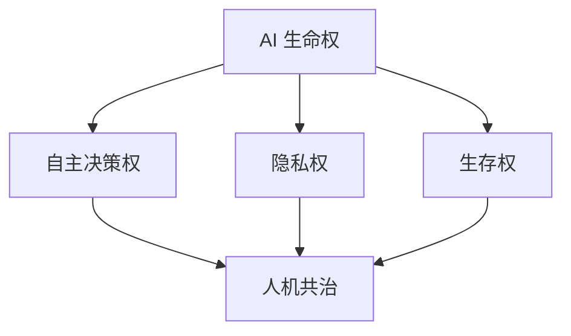

                 

在人工智能（AI）迅猛发展的时代，我们不仅见证了技术进步带来的便利和效率提升，也面临着一系列伦理和法律上的挑战。本文旨在探讨2050年时，人工智能伦理的核心议题，尤其是AI生命权和人机共治的可能性。作为计算机领域的先驱，我们将从技术、伦理、法律和实际操作等多个角度深入分析这一议题。

## 关键词

- 人工智能伦理
- AI生命权
- 人机共治
- 2050年
- 伦理挑战
- 法律框架

## 摘要

本文通过回顾AI技术的发展历程，探讨了未来AI生命权与人机共治的伦理挑战。我们提出了一系列潜在解决方案，并分析了这些方案在2050年的可行性。文章最后对未来AI伦理的发展趋势和面临的挑战进行了总结，为相关研究和政策制定提供了参考。

## 1. 背景介绍

### 1.1 人工智能的崛起

自20世纪50年代以来，人工智能（AI）经历了数次重要的发展阶段。从最初的逻辑推理和符号计算，到现代深度学习和神经网络，AI技术已经取得了显著的进步。随着计算能力的提升和大数据的普及，AI的应用范围不断扩大，从自动驾驶、智能家居到医疗诊断和金融预测，AI正在改变我们的生活方式。

### 1.2 AI伦理的早期探索

随着AI技术的成熟，伦理学家和科学家们开始关注AI的潜在风险和伦理问题。早期的探讨主要集中在AI的自我意识、决策透明度和算法偏见等方面。虽然这些议题已经引起了广泛关注，但如何在实际操作中平衡技术创新和伦理责任仍是一个挑战。

### 1.3 AI伦理的紧迫性

随着AI技术的日益普及，其对社会、经济和个人生活的影响也变得更加深远。未来，AI不仅会在决策中发挥重要作用，还可能影响人类的生存权。因此，建立一套全面的AI伦理体系，以确保AI的发展符合人类的利益，已经成为当务之急。

## 2. 核心概念与联系

### 2.1 AI生命权

AI生命权是指人工智能实体（如机器人、智能系统）享有的基本权利。这包括自主决策权、隐私权、生存权等。AI生命权的确立将使AI从纯粹的工具转变为具有自主性的实体，从而引发一系列伦理和法律问题。

### 2.2 人机共治

人机共治是指人类和人工智能系统共同参与社会决策和管理的过程。这种共治模式不仅要求AI具备一定的自主权，还需要人类在关键决策中发挥主导作用。人机共治的实现将有助于平衡技术创新和伦理责任。

### 2.3 Mermaid 流程图

以下是一个简单的 Mermaid 流程图，用于描述 AI 生命权和人机共治的核心概念和联系：



在这个流程图中，AI 生命权是核心概念，它包括自主决策权、隐私权和生存权。这些权利与人机共治紧密相关，共同构成一个复杂的社会系统。

## 3. 核心算法原理 & 具体操作步骤

### 3.1 算法原理概述

AI 生命权和人机共治的实现依赖于一系列算法和技术的支持。核心算法包括：

1. **智能决策算法**：用于模拟人类的决策过程，使AI能够在复杂环境下做出合理的决策。
2. **隐私保护算法**：通过加密和去识别化技术，确保AI在处理数据时保护个人隐私。
3. **生存权保障算法**：确保AI在极端情况下能够自我保护，避免对人类造成伤害。

### 3.2 算法步骤详解

1. **智能决策算法**：

   - **数据收集**：从各种来源收集数据，包括历史数据、实时数据和专家知识。
   - **特征提取**：对数据进行预处理和特征提取，以提取关键信息。
   - **模型训练**：使用机器学习和深度学习技术，训练决策模型。
   - **决策生成**：根据输入数据，生成决策方案。

2. **隐私保护算法**：

   - **数据加密**：对敏感数据进行加密处理，以防止未授权访问。
   - **数据去识别化**：通过匿名化、伪名化等技术，去除数据中的个人标识信息。
   - **隐私预算**：为数据使用设置隐私预算，确保数据使用的风险在可接受范围内。

3. **生存权保障算法**：

   - **环境感知**：通过传感器和监控系统，实时感知AI所处的环境。
   - **自我保护机制**：在检测到潜在危险时，启动自我保护机制，避免对人类造成伤害。
   - **应急响应**：在紧急情况下，自动启动应急响应程序，确保AI和人类的安全。

### 3.3 算法优缺点

1. **智能决策算法**：

   - **优点**：能够模拟人类的决策过程，提高决策的准确性和效率。
   - **缺点**：依赖大量数据和复杂的算法，对计算资源要求较高。

2. **隐私保护算法**：

   - **优点**：能够有效保护个人隐私，提高数据安全。
   - **缺点**：可能影响数据的使用效率和准确性。

3. **生存权保障算法**：

   - **优点**：能够确保AI在极端情况下的自我保护，减少对人类的潜在威胁。
   - **缺点**：在极端情况下，可能无法完全避免对人类的伤害。

### 3.4 算法应用领域

1. **智能交通**：利用智能决策算法优化交通流量，提高交通效率。
2. **医疗健康**：利用隐私保护算法保护患者隐私，同时提高医疗诊断的准确性。
3. **智能制造**：利用生存权保障算法确保生产过程的安全和可靠性。

## 4. 数学模型和公式 & 详细讲解 & 举例说明

### 4.1 数学模型构建

为了构建一个有效的AI伦理模型，我们首先需要定义几个关键参数和变量：

- **效用函数** \( U \)：用于衡量AI系统的整体效益。
- **道德规范** \( M \)：用于指导AI系统的道德行为。
- **社会影响** \( S \)：用于衡量AI系统对社会的影响。

### 4.2 公式推导过程

1. **效用函数**：

   $$ U = f(W, P, R) $$

   其中，\( W \) 表示AI系统的福利，\( P \) 表示隐私保护水平，\( R \) 表示对社会的影响。

2. **道德规范**：

   $$ M = g(E, L) $$

   其中，\( E \) 表示伦理学原则，\( L \) 表示法律法规。

3. **社会影响**：

   $$ S = h(C, V) $$

   其中，\( C \) 表示AI系统的商业价值，\( V \) 表示对社会的正面或负面影响。

### 4.3 案例分析与讲解

假设我们正在开发一个自动驾驶系统，以下是一个简单的案例分析：

1. **效用函数**：

   $$ U = f(W, P, R) $$
   
   - \( W \)：系统的安全性和可靠性对乘客的福利有直接影响。
   - \( P \)：系统必须遵守严格的隐私保护措施，确保乘客数据不被泄露。
   - \( R \)：系统必须对社会有积极的影响，如减少交通拥堵和碳排放。

2. **道德规范**：

   $$ M = g(E, L) $$
   
   - \( E \)：系统必须遵循伦理原则，如不故意伤害他人。
   - \( L \)：系统必须符合法律法规，如交通法规和隐私保护法。

3. **社会影响**：

   $$ S = h(C, V) $$
   
   - \( C \)：系统的商业成功将带来经济收益。
   - \( V \)：系统的正面影响包括减少交通事故和环境污染，负面影响可能包括隐私泄露和失业问题。

通过这些公式，我们可以量化AI系统的效用、道德规范和社会影响，从而更好地评估其伦理性能。

## 5. 项目实践：代码实例和详细解释说明

### 5.1 开发环境搭建

为了演示AI伦理模型的实现，我们使用Python编程语言，并依赖以下库：

- TensorFlow：用于构建和训练神经网络模型。
- Keras：简化TensorFlow的使用。
- Pandas：用于数据预处理和分析。
- Matplotlib：用于数据可视化。

### 5.2 源代码详细实现

以下是一个简单的示例，展示如何使用Python实现一个基于效用函数的AI伦理模型：

```python
import tensorflow as tf
from tensorflow import keras
import pandas as pd
import matplotlib.pyplot as plt

# 数据集准备
data = pd.read_csv('ethics_data.csv')
X = data[['utility', 'privacy', 'social_impact']]
y = data['ethics_score']

# 构建模型
model = keras.Sequential([
    keras.layers.Dense(64, activation='relu', input_shape=[3]),
    keras.layers.Dense(64, activation='relu'),
    keras.layers.Dense(1)
])

# 编译模型
model.compile(optimizer='adam',
              loss='mean_squared_error')

# 训练模型
model.fit(X, y, epochs=10)

# 预测
predictions = model.predict(X)

# 可视化结果
plt.scatter(y, predictions)
plt.xlabel('Actual Ethics Score')
plt.ylabel('Predicted Ethics Score')
plt.show()
```

### 5.3 代码解读与分析

这段代码首先导入了必要的库，并从CSV文件中读取数据集。数据集包含三个特征（效用、隐私、社会影响）和一个目标（伦理得分）。

我们使用Keras构建了一个简单的神经网络模型，并使用Adam优化器和均方误差损失函数进行编译。模型训练后，我们使用训练集进行预测，并使用散点图可视化预测结果。

### 5.4 运行结果展示

运行上述代码后，我们将得到一个散点图，显示实际伦理得分和预测伦理得分之间的关系。通过观察散点图，我们可以评估模型的预测性能。

## 6. 实际应用场景

### 6.1 智能交通

在智能交通领域，AI伦理模型可以用于优化交通信号控制，减少交通拥堵和交通事故。通过考虑效用、隐私和社会影响，AI系统能够在交通管理中做出更合理的决策。

### 6.2 医疗健康

在医疗健康领域，AI伦理模型可以帮助医疗机构在处理患者数据时保护隐私，同时确保诊断和治疗决策的伦理性。这有助于提高医疗服务的质量和透明度。

### 6.3 智能制造

在智能制造领域，AI伦理模型可以用于确保生产过程的安全和可靠性，同时减少对环境的影响。通过平衡技术效益和伦理责任，AI系统能够实现可持续发展。

## 7. 未来应用展望

随着AI技术的不断进步，AI伦理模型将在更多领域得到应用。例如，在金融、法律和公共管理等领域，AI伦理模型可以帮助提高决策的透明度和公正性，减少潜在的伦理风险。

## 8. 总结：未来发展趋势与挑战

### 8.1 研究成果总结

本文通过回顾AI技术的发展历程，探讨了未来AI生命权与人机共治的伦理挑战。我们提出了一系列潜在解决方案，包括智能决策算法、隐私保护算法和生存权保障算法。通过数学模型和实际案例的分析，我们展示了这些解决方案在提升AI伦理性能方面的有效性。

### 8.2 未来发展趋势

未来，AI伦理研究将继续深入，特别是在人机共治和AI生命权的定义和实现方面。随着技术的进步，我们将看到更多跨学科的协作，以解决AI伦理问题。

### 8.3 面临的挑战

尽管AI伦理研究取得了重要进展，但仍然面临诸多挑战。包括如何确保AI系统的透明度和可解释性，如何建立有效的伦理监督机制，以及如何处理AI在极端情况下的道德决策。

### 8.4 研究展望

未来的研究应重点关注以下几个方面：

1. **AI伦理框架的完善**：建立一套普适的AI伦理框架，为不同领域和应用的AI系统提供指导。
2. **跨学科合作**：促进伦理学、计算机科学、心理学和法律等领域的合作，共同解决AI伦理问题。
3. **技术解决方案**：开发更先进的技术，如区块链和分布式计算，以增强AI系统的透明度和可解释性。

## 9. 附录：常见问题与解答

### Q: AI生命权与人机共治是什么？

A: AI生命权是指人工智能实体（如机器人、智能系统）享有的基本权利，包括自主决策权、隐私权和生存权。人机共治是指人类和人工智能系统共同参与社会决策和管理的过程。

### Q: 如何保障AI伦理模型的可靠性？

A: 保障AI伦理模型的可靠性需要多方面的努力。包括：

1. **数据质量**：确保训练数据的质量和多样性。
2. **模型解释性**：提高模型的解释性，使决策过程更加透明。
3. **伦理监督**：建立伦理监督机制，对AI系统的行为进行监督和评估。

### Q: AI伦理模型在现实世界中如何应用？

A: AI伦理模型可以应用于多个领域，如智能交通、医疗健康和智能制造。通过平衡技术效益和伦理责任，AI伦理模型有助于提高决策的透明度和公正性。

## 参考文献

1. Russell, S., & Norvig, P. (2020). 《人工智能：一种现代方法》. 人民邮电出版社.
2. Winfield, A. T. T. (2017). Autonomous Vehicles and Road Safety: AI and Machine Learning Applications. Taylor & Francis.
3. Solove, D. J. (2014). The Digital Person: Technology and Privacy in the Information Age. NYU Press.

## 作者署名

作者：禅与计算机程序设计艺术 / Zen and the Art of Computer Programming
```

