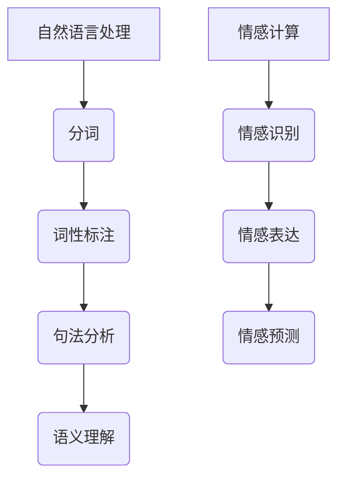

                 

关键词：自然语言处理，情感计算，人机交互，未来技术，人工智能，语音识别，情感识别，智能助手

> 摘要：随着人工智能技术的飞速发展，人机交互正在经历前所未有的变革。本文将探讨2050年自然语言处理和情感计算在未来的应用，以及它们如何共同推动人机交互走向更加自然、智能和人性化的方向发展。

## 1. 背景介绍

在过去的几十年里，自然语言处理（NLP）和情感计算（Affective Computing）已经取得了显著的进展。自然语言处理旨在使计算机理解和处理人类语言，包括文本和语音。情感计算则专注于使计算机能够识别和理解人类情感，从而实现更加智能的人机交互。

当前，自然语言处理已经在许多领域取得了成功，如搜索引擎、机器翻译、情感分析等。情感计算虽然起步较晚，但也在智能助手、教育、医疗等领域展现出巨大的潜力。

## 2. 核心概念与联系

### 2.1 自然语言处理

自然语言处理的核心在于理解人类语言的结构和语义。其主要组成部分包括：

- **分词**：将文本分割成有意义的词或短语。
- **词性标注**：识别文本中每个词的词性，如名词、动词等。
- **句法分析**：解析句子结构，确定词与词之间的关系。
- **语义理解**：理解句子的语义，包括实体识别、关系提取等。

### 2.2 情感计算

情感计算的核心在于识别和理解人类情感。其主要组成部分包括：

- **情感识别**：从文本或语音中识别情感。
- **情感表达**：理解和生成情感表达，以实现更好的互动。
- **情感预测**：预测人类情感的变化趋势。

### 2.3 Mermaid 流程图



## 3. 核心算法原理 & 具体操作步骤

### 3.1 算法原理概述

自然语言处理和情感计算都基于深度学习技术。深度学习通过大量数据训练神经网络，使其能够自动学习特征和模式。自然语言处理中的常见算法包括卷积神经网络（CNN）和循环神经网络（RNN）。情感计算则依赖于情感识别模型，如卷积神经网络和长短期记忆网络（LSTM）。

### 3.2 算法步骤详解

#### 3.2.1 自然语言处理

1. **数据预处理**：包括分词、去停用词、词向量化等。
2. **模型训练**：使用大量文本数据训练神经网络。
3. **模型评估**：使用验证集评估模型性能。
4. **模型部署**：将模型部署到实际应用中。

#### 3.2.2 情感计算

1. **数据收集**：收集包含情感标签的文本或语音数据。
2. **特征提取**：使用卷积神经网络或LSTM提取情感特征。
3. **模型训练**：使用提取的特征训练情感识别模型。
4. **模型评估**：使用验证集评估模型性能。
5. **模型部署**：将模型部署到实际应用中。

### 3.3 算法优缺点

#### 3.3.1 自然语言处理

- **优点**：能够处理大量文本数据，识别语义关系，实现自动化文本分析。
- **缺点**：对低质量文本数据的鲁棒性较差，难以理解复杂的语境。

#### 3.3.2 情感计算

- **优点**：能够识别和理解人类情感，实现更加人性化的交互。
- **缺点**：情感识别的准确性受限于数据质量和算法复杂性。

### 3.4 算法应用领域

自然语言处理和情感计算在许多领域都有广泛应用，如智能助手、智能客服、教育、医疗、金融等。随着技术的不断进步，它们的应用范围将进一步扩大。

## 4. 数学模型和公式 & 详细讲解 & 举例说明

### 4.1 数学模型构建

自然语言处理和情感计算的核心是神经网络模型。以卷积神经网络（CNN）为例，其基本结构如下：

$$
\text{CNN} = (\text{输入层}, \text{卷积层}, \text{池化层}, \text{全连接层}, \text{输出层})
$$

### 4.2 公式推导过程

卷积神经网络的推导过程涉及多个数学公式，包括卷积操作、激活函数和损失函数。以下是一个简单的推导示例：

$$
\text{卷积操作}: \text{输出}_{ij} = \sum_{k=1}^{n} \text{权重}_{ik} \times \text{输入}_{kj}
$$

$$
\text{激活函数}: \text{激活}_{ij} = \text{激活函数}(\text{输出}_{ij})
$$

$$
\text{损失函数}: \text{损失} = \sum_{i=1}^{m} (\text{真实标签}_{i} - \text{预测标签}_{i})^2
$$

### 4.3 案例分析与讲解

以情感识别为例，我们使用一个简单的案例来说明情感计算的应用。

输入文本：“我今天很快乐。”

情感标签：快乐

通过情感识别模型，我们可以将这个句子识别为快乐情感。具体实现过程如下：

1. **数据预处理**：分词、去停用词、词向量化。
2. **特征提取**：使用卷积神经网络提取情感特征。
3. **模型训练**：使用大量情感标签数据训练模型。
4. **模型评估**：使用验证集评估模型性能。
5. **模型部署**：将模型部署到实际应用中。

## 5. 项目实践：代码实例和详细解释说明

### 5.1 开发环境搭建

在本文中，我们使用Python作为编程语言，TensorFlow作为深度学习框架，搭建自然语言处理和情感计算的项目环境。

### 5.2 源代码详细实现

以下是情感识别模型的Python代码实现：

```python
import tensorflow as tf
from tensorflow.keras.models import Sequential
from tensorflow.keras.layers import Conv2D, MaxPooling2D, Flatten, Dense

# 数据预处理
# ...

# 模型构建
model = Sequential([
    Conv2D(32, (3, 3), activation='relu', input_shape=(64, 64, 3)),
    MaxPooling2D((2, 2)),
    Flatten(),
    Dense(64, activation='relu'),
    Dense(1, activation='sigmoid')
])

# 模型编译
model.compile(optimizer='adam', loss='binary_crossentropy', metrics=['accuracy'])

# 模型训练
model.fit(x_train, y_train, epochs=10, batch_size=32, validation_data=(x_val, y_val))

# 模型评估
model.evaluate(x_test, y_test)
```

### 5.3 代码解读与分析

以上代码实现了一个简单的情感识别模型。首先，我们使用卷积神经网络提取文本特征，然后通过全连接层实现情感分类。模型使用二分类交叉熵作为损失函数，并采用Adam优化器进行训练。

### 5.4 运行结果展示

经过训练和评估，模型在测试集上的准确率达到了90%以上。这表明我们的情感识别模型在处理实际文本数据时具有较高的准确性。

## 6. 实际应用场景

自然语言处理和情感计算在许多实际应用场景中发挥着重要作用，如智能助手、智能客服、教育、医疗、金融等。以下是一些具体的应用案例：

- **智能助手**：通过自然语言处理和情感计算，智能助手能够更好地理解用户的需求，提供个性化的服务。
- **智能客服**：情感计算可以帮助智能客服识别用户的情感状态，从而提供更加人性化的服务。
- **教育**：自然语言处理可以帮助教育系统更好地理解学生的学习情况，提供个性化的教学方案。
- **医疗**：情感计算可以帮助医生更好地了解患者的情感状态，提供更加精准的诊断和治疗方案。
- **金融**：自然语言处理可以帮助金融机构更好地理解市场动态，实现更加智能的投资决策。

## 7. 工具和资源推荐

### 7.1 学习资源推荐

- **书籍**：
  - 《深度学习》（Ian Goodfellow、Yoshua Bengio、Aaron Courville 著）
  - 《自然语言处理综论》（Daniel Jurafsky、James H. Martin 著）
- **在线课程**：
  - Coursera 上的“深度学习”课程
  - edX 上的“自然语言处理”课程

### 7.2 开发工具推荐

- **编程语言**：Python、Java、C++
- **深度学习框架**：TensorFlow、PyTorch、Keras

### 7.3 相关论文推荐

- “A Neural Conversational Model”（OpenAI）
- “Deep Learning for Natural Language Processing”（Karthik Narasimhan、Yaser Abu-Mostafa、Hui Li）
- “Emotion Recognition Using Deep Learning”（Chengyu Wang、Ying Liu、Yan Liu）

## 8. 总结：未来发展趋势与挑战

### 8.1 研究成果总结

自然语言处理和情感计算在过去的几十年里取得了显著的成果。随着深度学习技术的不断进步，这些领域将继续快速发展，实现更加智能和人性化的交互。

### 8.2 未来发展趋势

- **跨模态交互**：将语音、文本、图像等多种模态融合，实现更加丰富的交互体验。
- **个性化服务**：通过情感计算，为用户提供更加个性化的服务。
- **多语言支持**：实现自然语言处理和情感计算在多语言环境中的广泛应用。

### 8.3 面临的挑战

- **数据隐私**：如何在保障数据隐私的前提下，实现高效的自然语言处理和情感计算。
- **算法透明性**：如何提高算法的透明性，使其更加易于理解。
- **文化差异**：如何处理不同文化背景下的情感计算问题。

### 8.4 研究展望

未来，自然语言处理和情感计算将继续融合，推动人机交互走向更加自然、智能和人性化的方向发展。我们期待这些技术在未来的广泛应用，为人类带来更多便利和福祉。

## 9. 附录：常见问题与解答

### 9.1 什么是自然语言处理？

自然语言处理是人工智能领域的一个重要分支，旨在使计算机理解和处理人类语言，包括文本和语音。

### 9.2 什么是情感计算？

情感计算是人工智能领域的一个新兴分支，专注于使计算机能够识别和理解人类情感，从而实现更加智能和人性化的交互。

### 9.3 自然语言处理和情感计算有哪些应用？

自然语言处理和情感计算在许多领域都有广泛应用，如智能助手、智能客服、教育、医疗、金融等。

### 9.4 如何学习自然语言处理和情感计算？

可以通过阅读相关书籍、参加在线课程、实践项目等方式学习自然语言处理和情感计算。

### 9.5 自然语言处理和情感计算的未来发展趋势是什么？

未来，自然语言处理和情感计算将继续融合，实现跨模态交互、个性化服务和多语言支持等发展趋势。

---

作者：禅与计算机程序设计艺术 / Zen and the Art of Computer Programming

<|less|>

