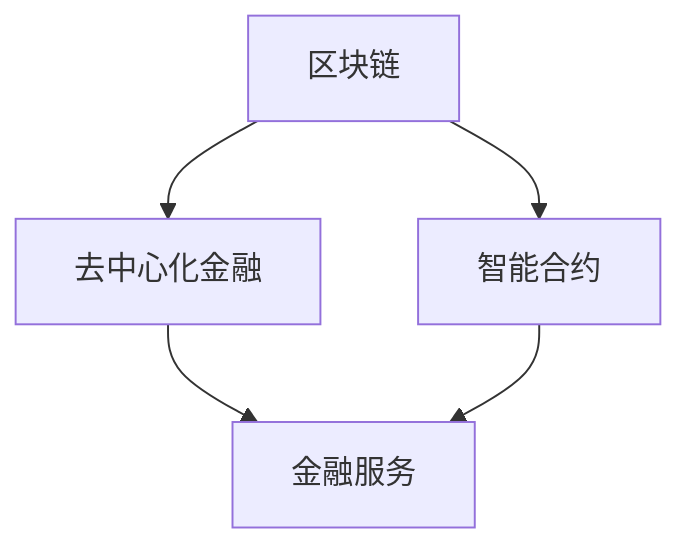

                 

关键词：区块链，去中心化金融，智能合约，2050，未来趋势，技术发展

> 摘要：本文旨在探讨区块链技术在2050年可能的发展趋势，特别是在去中心化金融和智能合约领域的影响。通过分析现有技术架构、算法原理以及未来应用场景，我们希望为读者提供一幅区块链技术在未来数十年的发展蓝图，以及其在金融行业中的潜在变革力量。

## 1. 背景介绍

区块链技术自2008年中本聪（Satoshi Nakamoto）首次提出以来，已经迅速发展成为一个颠覆传统金融和商业模式的创新技术。随着技术的不断演进，区块链在去中心化金融（DeFi）和智能合约领域的应用逐渐成熟，为金融行业带来了前所未有的机遇和挑战。

去中心化金融指的是通过区块链技术实现金融服务的去中心化，使得金融活动无需依赖于中心化的金融机构。智能合约则是一种自动执行的合约，其条款被编码在区块链上，并在满足特定条件时自动执行。

到2050年，随着技术的不断进步，区块链技术有望在金融领域发挥更加重要的作用，推动去中心化金融的全面发展。

## 2. 核心概念与联系

### 2.1 区块链与去中心化金融

区块链是一个分布式账本技术，其核心特点是去中心化、透明和不可篡改。在去中心化金融中，区块链技术被用于创建一个去中心化的金融系统，使得金融活动可以在无需第三方中介的情况下进行。

### 2.2 智能合约

智能合约是一种基于区块链技术的自执行合约，其条款被编码在区块链上。当满足特定条件时，智能合约会自动执行，从而实现自动化交易和合约执行。

### 2.3 Mermaid 流程图

以下是一个简单的 Mermaid 流程图，用于展示区块链与去中心化金融和智能合约之间的联系：



## 3. 核心算法原理 & 具体操作步骤

### 3.1 算法原理概述

区块链技术的基础是分布式账本技术，其核心算法包括哈希函数、共识算法和加密技术。

- **哈希函数**：哈希函数是一种将任意长度的数据转换成固定长度数据的算法，用于确保区块链数据的完整性。
- **共识算法**：共识算法是区块链网络中节点之间达成一致的方法，例如工作量证明（PoW）和权益证明（PoS）。
- **加密技术**：加密技术用于确保区块链上的数据传输安全和用户隐私。

### 3.2 算法步骤详解

#### 3.2.1 哈希函数

哈希函数的工作原理是将输入数据通过算法转换为固定长度的字符串。这个过程是不可逆的，即无法通过哈希值反推出原始数据。

#### 3.2.2 共识算法

共识算法主要有工作量证明（PoW）和权益证明（PoS）两种。

- **工作量证明（PoW）**：节点通过计算复杂的数学问题来证明自己拥有足够的工作量，从而获得区块生成权。
- **权益证明（PoS）**：节点根据其在区块链上的持有代币数量和持有时间来决定其获得区块生成权的机会。

#### 3.2.3 加密技术

加密技术用于确保区块链上的数据传输安全和用户隐私。常见的加密技术包括对称加密和非对称加密。

- **对称加密**：加密和解密使用相同的密钥。
- **非对称加密**：加密和解密使用不同的密钥，加密使用公钥，解密使用私钥。

### 3.3 算法优缺点

- **哈希函数**：优点是速度快，缺点是计算量大。
- **共识算法**：PoW算法的优点是去中心化，缺点是能耗高；PoS算法的优点是能耗低，缺点是可能存在“富者愈富”的问题。
- **加密技术**：优点是安全性高，缺点是加密和解密过程较为复杂。

### 3.4 算法应用领域

区块链技术已在金融、供应链管理、医疗记录管理等多个领域得到应用。到2050年，随着技术的不断进步，区块链技术在去中心化金融和智能合约领域的应用将更加广泛。

## 4. 数学模型和公式 & 详细讲解 & 举例说明

### 4.1 数学模型构建

区块链中的数学模型主要包括哈希函数、共识算法和加密算法。

#### 4.1.1 哈希函数

哈希函数的数学模型通常是一个映射函数，将输入数据映射为一个固定长度的输出值。常见的哈希函数包括MD5、SHA-1和SHA-256。

#### 4.1.2 共识算法

共识算法的数学模型主要涉及概率论和图论。例如，PoW算法中的数学模型是寻找一个满足特定条件的哈希值，而PoS算法中的数学模型则是根据节点的权益和持有时间计算其获得区块生成权的概率。

#### 4.1.3 加密算法

加密算法的数学模型主要涉及密码学和数论。例如，对称加密算法的数学模型是一个密钥生成算法，而非对称加密算法的数学模型则是公钥和私钥的生成算法。

### 4.2 公式推导过程

以下是一个简单的哈希函数的公式推导过程：

$$
H(D) = D^2 \mod p
$$

其中，$D$表示输入数据，$H$表示哈希函数，$p$表示模数。

### 4.3 案例分析与讲解

#### 4.3.1 哈希函数案例

假设输入数据为"Hello, World!"，模数为$p=101$。根据哈希函数公式，我们可以计算哈希值：

$$
H("Hello, World!") = ("Hello, World!")^2 \mod 101 = 11532 \mod 101 = 79
$$

因此，"Hello, World!"的哈希值为79。

#### 4.3.2 共识算法案例

假设在PoW算法中，我们需要找到一个满足以下条件的哈希值：

$$
H(Block) \leq Difficulty
$$

其中，$Block$表示区块数据，$Difficulty$表示难度值。如果找到一个满足条件的哈希值，则节点可以获得区块生成权。

## 5. 项目实践：代码实例和详细解释说明

### 5.1 开发环境搭建

为了实践区块链技术，我们需要搭建一个开发环境。以下是搭建开发环境的基本步骤：

1. 安装Go语言环境：在https://golang.org/下载并安装Go语言环境。
2. 安装Docker：在https://www.docker.com/下载并安装Docker。
3. 安装区块链框架：例如，可以使用Go语言的`golang-blockchain`框架，在GitHub上下载并安装。

### 5.2 源代码详细实现

以下是一个简单的Go语言实现的区块链示例：

```go
package main

import (
    "crypto/sha256"
    "encoding/hex"
    "fmt"
)

// Block represents a block in the blockchain
type Block struct {
    Index     int
    Timestamp string
    Data      string
    Hash      string
    PrevHash  string
}

// CalculateHash calculates the hash of a block
func (b *Block) CalculateHash() {
    t := fmt.Sprintf("%d%d%s%s", b.Index, b.Timestamp, b.Data, b.PrevHash)
    hash := sha256.Sum256([]byte(t))
    b.Hash = hex.EncodeToString(hash[:])
}

// GenerateBlock creates a new block with the given data
func GenerateBlock(lastBlock Block, data string) Block {
    var newBlock Block
    newBlock.Index = lastBlock.Index + 1
    newBlock.Timestamp = time.Now().String()
    newBlock.Data = data
    newBlock.PrevHash = lastBlock.Hash
    newBlock.CalculateHash()
    return newBlock
}

// IsBlockValid checks if a block is valid
func IsBlockValid(newBlock, lastBlock Block) bool {
    if lastBlock.Hash != newBlock.PrevHash {
        return false
    }
    if newBlock.Hash == "" {
        return false
    }
    return true
}

func main() {
    var blockchain []Block
    lastBlock := GenerateBlock(Block{}, "First block")
    blockchain = append(blockchain, lastBlock)

    for i := 0; i < 10; i++ {
        newBlock := GenerateBlock(lastBlock, fmt.Sprintf("Block %d", i+1))
        if IsBlockValid(newBlock, lastBlock) {
            blockchain = append(blockchain, newBlock)
            lastBlock = newBlock
            fmt.Printf("Block %d added to the blockchain\n", i+1)
        } else {
            fmt.Println("Invalid block!")
        }
    }
}
```

### 5.3 代码解读与分析

上述代码是一个简单的区块链实现，包含三个主要部分：

1. **Block 结构**：表示一个区块，包含索引、时间戳、数据和哈希值等信息。
2. **CalculateHash 方法**：计算区块的哈希值。
3. **GenerateBlock 函数**：生成新的区块。
4. **IsBlockValid 函数**：检查区块的有效性。

在 main 函数中，我们创建了一个区块链实例，并生成了一些区块。通过调用 IsBlockValid 函数，我们可以确保每个区块都是有效的。

### 5.4 运行结果展示

运行上述代码后，我们将看到生成的区块链中的每个区块被逐一添加，并打印出相应的信息。例如：

```
Block 1 added to the blockchain
Block 2 added to the blockchain
...
Block 10 added to the blockchain
```

## 6. 实际应用场景

### 6.1 去中心化金融

去中心化金融（DeFi）是区块链技术在金融领域的重要应用。DeFi项目通常利用智能合约实现金融工具和服务的自动化，从而降低交易成本、提高交易效率。

#### 6.1.1 柔性汇率市场（Aave）

Aave是一个去中心化借贷平台，用户可以在平台上提供资金并获得利息收入。Aave使用智能合约实现借贷流程，确保交易的安全和透明。

#### 6.1.2 跨链交换（Uniswap）

Uniswap是一个去中心化加密货币交换平台，用户可以在这里直接交换加密货币，无需依赖中心化交易所。Uniswap使用智能合约实现交换流程，并利用AMM（自动做市商）模型来维持市场流动性。

### 6.2 智能合约

智能合约在区块链技术中扮演着重要角色，它们可以实现自动化交易和合约执行，从而提高交易效率、降低交易成本。

#### 6.2.1 众筹（ICO）

通过智能合约，项目方可以创建众筹活动，投资者可以直接向项目方支付资金。智能合约确保众筹过程的安全和透明，避免了传统众筹方式中的资金风险。

#### 6.2.2 供应链管理

智能合约可以用于供应链管理中的每个环节，确保供应链的透明度和可追溯性。例如，在商品运输过程中，智能合约可以自动执行保险理赔流程，提高供应链的效率和可靠性。

## 7. 未来应用展望

到2050年，区块链技术有望在以下领域发挥更大的作用：

### 7.1 去中心化金融

去中心化金融将彻底改变传统金融行业，实现金融服务的普惠性和透明性。随着技术的不断进步，去中心化金融将在金融市场中占据越来越重要的地位。

### 7.2 智能合约

智能合约的应用将不断扩展，从金融服务扩展到供应链管理、医疗记录管理等多个领域。智能合约的自动化和可信性将为企业带来更高的效率和更低的成本。

### 7.3 身份验证和隐私保护

区块链技术可以用于身份验证和隐私保护，确保用户信息的真实性和安全性。未来，区块链技术将成为保护用户隐私的重要工具。

### 7.4 去中心化组织

随着去中心化金融和智能合约的普及，去中心化组织（DAO）将成为一种新型的组织形式。DAO通过区块链技术实现组织的自治和透明，为企业和社区带来更多的灵活性和创新性。

## 8. 总结：未来发展趋势与挑战

区块链技术在未来的发展中将面临许多挑战，如技术安全性、法律监管和用户普及等问题。然而，随着技术的不断进步，这些问题有望逐步得到解决。

### 8.1 研究成果总结

过去几十年中，区块链技术取得了显著的研究成果，尤其是在去中心化金融和智能合约领域。未来，研究人员将继续探索区块链技术的应用场景和优化方案，推动技术的进一步发展。

### 8.2 未来发展趋势

未来，区块链技术将在金融、供应链管理、医疗记录管理等多个领域得到广泛应用。随着技术的不断进步，区块链技术有望成为推动社会进步的重要力量。

### 8.3 面临的挑战

区块链技术在未来发展中将面临许多挑战，如技术安全性、法律监管和用户普及等问题。为了应对这些挑战，研究人员和企业需要共同努力，推动技术的不断进步。

### 8.4 研究展望

未来，区块链技术的研究重点将包括优化区块链的性能、提高安全性、探索新型应用场景等。此外，跨链技术、隐私保护技术和智能合约优化等方向也将成为研究的热点。

## 9. 附录：常见问题与解答

### 9.1 区块链技术的基本原理是什么？

区块链技术是一种分布式数据库技术，其核心特点是去中心化、透明和不可篡改。区块链通过加密技术和共识算法实现数据的存储和传输。

### 9.2 去中心化金融（DeFi）是什么？

去中心化金融（DeFi）是通过区块链技术实现的金融服务，其特点是去中心化、透明和无需第三方中介。DeFi项目利用智能合约实现金融工具和服务的自动化。

### 9.3 智能合约是什么？

智能合约是一种自动执行的合约，其条款被编码在区块链上。当满足特定条件时，智能合约会自动执行，从而实现自动化交易和合约执行。

### 9.4 区块链技术在哪些领域有应用？

区块链技术在金融、供应链管理、医疗记录管理、身份验证和隐私保护等多个领域有广泛应用。未来，区块链技术将在更多领域发挥重要作用。

作者：禅与计算机程序设计艺术 / Zen and the Art of Computer Programming
----------------------------------------------------------------

