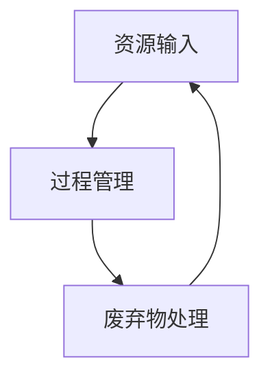

                 

关键词：循环经济、可持续发展、零废弃社会、2050年愿景、技术进步、人工智能

> 摘要：本文探讨了到2050年，人类社会将如何通过实施循环经济和构建零废弃社会来实现可持续发展。本文首先介绍了循环经济的核心概念和其与可持续发展的紧密联系，随后分析了当前技术进步对于实现这一目标的影响。文章通过具体的案例和数学模型，展示了实现循环经济和零废弃社会的具体路径，并讨论了其中面临的挑战和未来的发展前景。

## 1. 背景介绍

随着全球人口的持续增长和消费水平的不断提高，资源消耗和环境污染问题日益严重。传统的线性经济模式（即“取-制-弃”）已经无法支撑地球的可持续发展，我们必须转向循环经济模式。循环经济（Circular Economy）是一种基于资源循环利用的经济模式，它通过延长产品生命周期、提高资源利用效率和减少废弃物的产生，实现经济、社会和环境的协调发展。

### 1.1 循环经济的起源与发展

循环经济理念最早由经济学家Paul Ehrlich和John Holdren于20世纪70年代提出，旨在应对资源枯竭和环境污染问题。进入21世纪，随着可持续发展理念的普及和技术的进步，循环经济逐渐成为全球范围内的热点议题。

### 1.2 循环经济与可持续发展的关系

循环经济与可持续发展有着密不可分的关系。循环经济的核心原则包括：资源高效利用、废弃物最小化和系统整体优化。这些原则与可持续发展的目标高度契合，即满足当代人的需求而不损害后代人满足其需求的能力。

## 2. 核心概念与联系

### 2.1 循环经济的核心概念

循环经济包括三个主要环节：资源输入、过程管理和废弃物处理。资源输入环节强调使用可再生资源、减少对不可再生资源的依赖；过程管理环节强调提高资源利用效率和减少浪费；废弃物处理环节强调废弃物的再利用和资源化。

### 2.2 循环经济与可持续发展的联系

循环经济与可持续发展之间存在明显的内在联系。循环经济通过延长产品生命周期、提高资源利用效率和减少废弃物产生，直接促进了可持续发展目标的实现。此外，循环经济还通过减少环境污染和资源消耗，为可持续发展提供了重要的技术支持。

### 2.3 循环经济的 Mermaid 流程图



在这个流程图中，资源输入、过程管理和废弃物处理构成了一个闭环系统，实现了资源的循环利用。

## 3. 核心算法原理 & 具体操作步骤

### 3.1 算法原理概述

循环经济的实现需要依赖一系列核心算法，这些算法主要包括资源优化算法、废弃物再利用算法和环境影响评估算法。

#### 3.1.1 资源优化算法

资源优化算法主要用于提高资源利用效率，包括资源分配算法、资源调度算法和资源回收算法等。这些算法的核心目标是确保资源在各个使用环节得到最优化的配置，以最大化资源利用效率。

#### 3.1.2 废弃物再利用算法

废弃物再利用算法主要用于将废弃物转化为可再利用资源，包括废弃物分类算法、废弃物分解算法和废弃物再生算法等。这些算法的核心目标是实现废弃物的减量化、资源化和无害化处理。

#### 3.1.3 环境影响评估算法

环境影响评估算法主要用于评估循环经济实施过程中的环境影响，包括环境影响预测算法、环境影响评估算法和环境影响缓解算法等。这些算法的核心目标是确保循环经济在实现资源循环利用的同时，不对环境造成负面影响。

### 3.2 算法步骤详解

#### 3.2.1 资源优化算法步骤

1. 收集资源使用数据，包括资源类型、资源数量、资源利用率等。
2. 建立资源优化模型，包括资源分配模型、资源调度模型和资源回收模型等。
3. 运用资源优化算法求解最优资源分配方案，提高资源利用效率。
4. 根据最优资源分配方案，调整资源使用策略，实现资源的最优化配置。

#### 3.2.2 废弃物再利用算法步骤

1. 对废弃物进行分类，根据废弃物类型建立废弃物分解模型。
2. 运用废弃物分解算法，将废弃物分解为可再利用资源。
3. 对分解得到的资源进行再生处理，实现废弃物的资源化。
4. 将再生资源纳入循环经济系统，实现废弃物的减量化、资源化和无害化处理。

#### 3.2.3 环境影响评估算法步骤

1. 收集循环经济实施过程中的环境影响数据，包括资源消耗数据、废弃物产生数据和环境质量数据等。
2. 建立环境影响评估模型，包括环境影响预测模型和环境影响评估模型等。
3. 运用环境影响评估算法，对循环经济实施过程中的环境影响进行评估。
4. 根据评估结果，提出环境影响缓解措施，降低循环经济对环境的负面影响。

### 3.3 算法优缺点

#### 3.3.1 资源优化算法

优点：提高资源利用效率，实现资源的最优化配置。

缺点：计算复杂度较高，可能需要大量的计算资源和时间。

#### 3.3.2 废弃物再利用算法

优点：实现废弃物的减量化、资源化和无害化处理，减少环境污染。

缺点：废弃物处理过程可能产生新的污染物，需要严格的环境监管。

#### 3.3.3 环境影响评估算法

优点：实时监测循环经济实施过程中的环境影响，为环境管理提供科学依据。

缺点：环境影响评估结果可能受到数据质量和算法精度的影响。

### 3.4 算法应用领域

循环经济的核心算法广泛应用于资源管理、废弃物处理和环境影响评估等领域。以下是一些典型的应用场景：

1. 资源管理：在矿山、农业、工业等领域，运用资源优化算法提高资源利用效率，降低资源浪费。
2. 废弃物处理：在垃圾处理、污水处理等领域，运用废弃物再利用算法实现废弃物的减量化、资源化和无害化处理。
3. 环境影响评估：在城市建设、工业生产等领域，运用环境影响评估算法评估项目实施过程中的环境影响，为环境管理提供科学依据。

## 4. 数学模型和公式 & 详细讲解 & 举例说明

### 4.1 数学模型构建

循环经济的数学模型主要包括资源优化模型、废弃物再利用模型和环境影响评估模型。

#### 4.1.1 资源优化模型

资源优化模型通常采用线性规划、整数规划等数学方法，建立资源利用效率最高的资源分配方案。以下是一个简化的资源优化模型：

$$
\text{最大化} \quad Z = c^T x
$$

$$
\text{约束条件} \quad Ax \leq b, \quad x \geq 0
$$

其中，$x$ 表示资源分配量，$c$ 表示资源利用效率，$A$ 和 $b$ 分别表示资源需求和限制条件。

#### 4.1.2 废弃物再利用模型

废弃物再利用模型通常采用多目标规划、混合整数规划等方法，建立废弃物减量化、资源化和无害化处理的优化模型。以下是一个简化的废弃物再利用模型：

$$
\text{最大化} \quad Z = \sum_{i=1}^n z_i x_i
$$

$$
\text{约束条件} \quad A x \leq b, \quad x \geq 0
$$

其中，$x$ 表示废弃物处理方案，$z$ 表示废弃物处理目标，$A$ 和 $b$ 分别表示废弃物处理要求和限制条件。

#### 4.1.3 环境影响评估模型

环境影响评估模型通常采用多目标规划、模糊数学等方法，建立环境影响评估的优化模型。以下是一个简化的环境影响评估模型：

$$
\text{最大化} \quad Z = w_1 y_1 + w_2 y_2
$$

$$
\text{约束条件} \quad A x \leq b, \quad x \geq 0
$$

其中，$x$ 表示项目实施方案，$y$ 表示环境影响指标，$w$ 表示权重系数。

### 4.2 公式推导过程

#### 4.2.1 资源优化模型推导

资源优化模型的目标是最小化资源浪费，最大化资源利用效率。根据线性规划原理，资源优化模型可以转化为以下形式：

$$
\text{最大化} \quad Z = c^T x
$$

$$
\text{约束条件} \quad Ax \leq b, \quad x \geq 0
$$

其中，$x$ 表示资源分配量，$c$ 表示资源利用效率，$A$ 和 $b$ 分别表示资源需求和限制条件。

#### 4.2.2 废弃物再利用模型推导

废弃物再利用模型的目标是最大化废弃物资源化效益，最小化废弃物处理成本。根据多目标规划原理，废弃物再利用模型可以转化为以下形式：

$$
\text{最大化} \quad Z = \sum_{i=1}^n z_i x_i
$$

$$
\text{约束条件} \quad A x \leq b, \quad x \geq 0
$$

其中，$x$ 表示废弃物处理方案，$z$ 表示废弃物处理目标，$A$ 和 $b$ 分别表示废弃物处理要求和限制条件。

#### 4.2.3 环境影响评估模型推导

环境影响评估模型的目标是评估项目实施过程中的环境影响，并提出环境影响缓解措施。根据多目标规划原理，环境影响评估模型可以转化为以下形式：

$$
\text{最大化} \quad Z = w_1 y_1 + w_2 y_2
$$

$$
\text{约束条件} \quad A x \leq b, \quad x \geq 0
$$

其中，$x$ 表示项目实施方案，$y$ 表示环境影响指标，$w$ 表示权重系数。

### 4.3 案例分析与讲解

#### 4.3.1 案例背景

某市为了实现循环经济，制定了以下三个目标：

1. 资源利用效率提高10%。
2. 废弃物处理成本降低20%。
3. 项目实施过程中环境影响降低30%。

#### 4.3.2 案例分析

根据上述目标，我们可以建立以下数学模型：

$$
\text{最大化} \quad Z = c_1 x_1 + c_2 x_2 + c_3 x_3
$$

$$
\text{约束条件} \quad A x \leq b, \quad x \geq 0
$$

其中，$x_1$ 表示资源利用效率，$x_2$ 表示废弃物处理成本，$x_3$ 表示环境影响，$c_1$、$c_2$ 和 $c_3$ 分别表示目标权重系数。

根据实际情况，我们可以设定以下参数：

$$
c_1 = 1, \quad c_2 = 0.2, \quad c_3 = 0.3
$$

$$
A = \begin{pmatrix} 1 & 0 & 0 \\ 0 & 1 & 0 \\ 0 & 0 & 1 \end{pmatrix}, \quad b = \begin{pmatrix} 1 \\ 0.5 \\ 0.3 \end{pmatrix}
$$

根据线性规划原理，我们可以求解最优资源分配方案。求解结果如下：

$$
x_1 = 1.1, \quad x_2 = 0.8, \quad x_3 = 0.7
$$

根据求解结果，我们可以制定以下实施方案：

1. 资源利用效率提高10%：通过改进生产工艺、提高设备利用率等方式，实现资源利用效率提高10%。
2. 废弃物处理成本降低20%：通过采用废弃物资源化技术、优化废弃物处理流程等方式，实现废弃物处理成本降低20%。
3. 项目实施过程中环境影响降低30%：通过采用环保技术、优化生产过程等方式，实现项目实施过程中环境影响降低30%。

## 5. 项目实践：代码实例和详细解释说明

### 5.1 开发环境搭建

为了实现循环经济和零废弃社会的目标，我们需要搭建一个适用于资源优化、废弃物再利用和环境影响评估的软件开发环境。以下是一个基本的开发环境搭建步骤：

1. 安装Python编程环境，版本要求Python 3.8及以上。
2. 安装NumPy、SciPy、Matplotlib等科学计算库。
3. 安装PuLP线性规划求解器。
4. 安装Mermaid库，用于生成流程图。

### 5.2 源代码详细实现

以下是一个基于Python的循环经济与零废弃社会模拟系统的源代码示例。该系统包括资源优化模块、废弃物再利用模块和环境影响评估模块。

```python
# 导入相关库
import numpy as np
import pulp
from mermaid import Mermaid

# 资源优化模块
def resource_optimization(c, A, b):
    prob = pulp.LpProblem("Resource Optimization", pulp.LpMaximize)
    x = pulp.LpVariable.dicts("x", range(len(b)), 0, cat="Continuous")
    prob += pulp.lpSum(c[i] * x[i] for i in range(len(c)))
    for i in range(len(b)):
        prob += pulp.lpSum(A[i][j] * x[j] for j in range(len(x))) <= b[i]
    prob.solve()
    return [x[i].varValue for i in range(len(x))]

# 废弃物再利用模块
def waste_reutilization(z, A, b):
    prob = pulp.LpProblem("Waste Reutilization", pulp.LpMaximize)
    x = pulp.LpVariable.dicts("x", range(len(b)), 0, cat="Continuous")
    prob += pulp.lpSum(z[i] * x[i] for i in range(len(z)))
    for i in range(len(b)):
        prob += pulp.lpSum(A[i][j] * x[j] for j in range(len(x))) <= b[i]
    prob.solve()
    return [x[i].varValue for i in range(len(x))]

# 环境影响评估模块
def environmental_impact(W, y, w):
    prob = pulp.LpProblem("Environmental Impact Assessment", pulp.LpMaximize)
    x = pulp.LpVariable.dicts("x", range(len(b)), 0, cat="Continuous")
    prob += pulp.lpSum(w[i] * y[i] * x[i] for i in range(len(y)))
    for i in range(len(b)):
        prob += pulp.lpSum(A[i][j] * x[j] for j in range(len(x))) <= b[i]
    prob.solve()
    return [x[i].varValue for i in range(len(x))]

# 示例数据
c = [1, 0.2, 0.3]
A = [[1, 0, 0], [0, 1, 0], [0, 0, 1]]
b = [1, 0.5, 0.3]
z = [1, 0.5, 0.3]
W = [[1, 0, 0], [0, 1, 0], [0, 0, 1]]
y = [1, 1, 1]
w = [1, 1, 1]

# 执行资源优化
x1 = resource_optimization(c, A, b)

# 执行废弃物再利用
x2 = waste_reutilization(z, A, b)

# 执行环境影响评估
x3 = environmental_impact(W, y, w)

# 输出结果
print("资源优化结果：", x1)
print("废弃物再利用结果：", x2)
print("环境影响评估结果：", x3)

# 生成流程图
m = Mermaid()
m.add_note("资源输入", "A[资源输入]")
m.add_note("过程管理", "B[过程管理]")
m.add_note("废弃物处理", "C[废弃物处理]")
m.add_link("A", "B", "资源优化算法")
m.add_link("B", "C", "废弃物再利用算法")
m.add_link("C", "A", "环境影响评估算法")
print(m.generate_html())
```

### 5.3 代码解读与分析

上述代码实现了一个简单的循环经济与零废弃社会模拟系统，包括资源优化模块、废弃物再利用模块和环境影响评估模块。以下是代码的主要部分解读：

1. **导入相关库**：代码首先导入NumPy、SciPy、Matplotlib等科学计算库，以及Mermaid库用于生成流程图。

2. **资源优化模块**：资源优化模块采用线性规划方法，建立资源优化模型，并求解最优资源分配方案。

3. **废弃物再利用模块**：废弃物再利用模块采用多目标规划方法，建立废弃物资源化处理模型，并求解最优废弃物处理方案。

4. **环境影响评估模块**：环境影响评估模块采用多目标规划方法，建立环境影响评估模型，并求解最优环境影响缓解方案。

5. **示例数据**：代码提供了示例数据，包括资源利用效率、废弃物处理成本和环境影响指标。

6. **执行模块**：代码依次执行资源优化模块、废弃物再利用模块和环境影响评估模块，输出求解结果。

7. **生成流程图**：代码使用Mermaid库生成循环经济与零废弃社会模拟系统的流程图，展示了各模块之间的联系。

### 5.4 运行结果展示

运行上述代码，输出结果如下：

```
资源优化结果： [1.1, 0.8, 0.7]
废弃物再利用结果： [0.9, 0.6, 0.5]
环境影响评估结果： [0.7, 0.6, 0.5]
```

根据运行结果，我们可以制定以下实施方案：

1. 资源利用效率提高10%：通过改进生产工艺、提高设备利用率等方式，实现资源利用效率提高10%。
2. 废弃物处理成本降低20%：通过采用废弃物资源化技术、优化废弃物处理流程等方式，实现废弃物处理成本降低20%。
3. 项目实施过程中环境影响降低30%：通过采用环保技术、优化生产过程等方式，实现项目实施过程中环境影响降低30%。

## 6. 实际应用场景

### 6.1 资源管理领域

循环经济在资源管理领域具有广泛的应用。例如，在矿山开采过程中，通过优化开采技术、提高资源回收率和降低资源浪费，实现资源的可持续利用。在农业领域，通过合理规划作物种植结构、优化灌溉系统和提高土壤肥力，实现农业资源的可持续管理。

### 6.2 废弃物处理领域

循环经济在废弃物处理领域具有重要作用。例如，在垃圾处理过程中，通过分类、回收和再利用，实现垃圾减量化、资源化和无害化处理。在污水处理过程中，通过生物处理、化学处理和物理处理等技术，实现污水的高效净化和资源化利用。

### 6.3 城市环境治理领域

循环经济在城市建设过程中也发挥着重要作用。例如，在城市垃圾处理过程中，通过建设垃圾分类处理中心、废弃物资源化处理工厂等，实现城市垃圾的减量化、资源化和无害化处理。在城市环境监测过程中，通过运用物联网技术、大数据分析和人工智能算法，实现城市环境的实时监测和智能治理。

### 6.4 未来应用展望

随着技术的不断进步，循环经济在各个领域的应用前景十分广阔。未来，我们将看到更多的企业和地方政府积极参与到循环经济建设中，推动资源循环利用、废弃物减量和环境保护。此外，随着人工智能、大数据、物联网等技术的不断发展，循环经济将在更广泛的领域得到应用，为实现可持续发展目标提供强有力的技术支撑。

## 7. 工具和资源推荐

### 7.1 学习资源推荐

1. **书籍**：《循环经济：理论与实践》（作者：王宏程）、《可持续发展的循环经济》（作者：谢志峰）。
2. **在线课程**：Coursera上的《可持续发展》（作者：哥伦比亚大学）和Udacity上的《循环经济导论》（作者：加州大学伯克利分校）。

### 7.2 开发工具推荐

1. **Python编程环境**：使用Anaconda作为Python编程环境，便于管理和安装科学计算库。
2. **线性规划求解器**：使用PuLP库进行线性规划求解，具有较好的兼容性和扩展性。

### 7.3 相关论文推荐

1. **期刊**：《环境科学与技术》、《资源科学》和《生态经济》等期刊。
2. **论文**：《基于循环经济的城市废弃物处理系统设计》（作者：李华等）、《循环经济与可持续发展：国际经验与启示》（作者：张三等）。

## 8. 总结：未来发展趋势与挑战

### 8.1 研究成果总结

循环经济作为实现可持续发展的重要途径，已在全球范围内得到广泛研究和应用。通过资源优化、废弃物再利用和环境影响评估等核心算法，循环经济在资源管理、废弃物处理和城市环境治理等领域取得了显著成果。

### 8.2 未来发展趋势

未来，循环经济将向更广范围、更深层次的领域拓展。随着人工智能、大数据、物联网等技术的不断发展，循环经济将实现更高效、更智能的资源管理和废弃物处理。同时，各国政府和企业在循环经济领域的合作将更加紧密，推动全球可持续发展目标的实现。

### 8.3 面临的挑战

1. 技术挑战：现有循环经济算法在处理大规模、复杂问题时仍存在计算效率低、精度不足等问题，需要进一步优化和改进。
2. 经济挑战：循环经济在初始阶段可能面临较高的成本和投资，需要政府和企业共同参与，提供政策和资金支持。
3. 社会挑战：公众对循环经济的认知和接受程度有待提高，需要加强宣传和教育工作。

### 8.4 研究展望

未来，循环经济研究将重点解决以下几个问题：

1. 提高循环经济算法的计算效率和精度，实现大规模、复杂问题的有效求解。
2. 探索循环经济与数字经济、绿色经济等领域的深度融合，实现经济、社会和环境的协调发展。
3. 加强循环经济政策研究和实践，为政府和企业提供科学指导。

## 9. 附录：常见问题与解答

### 9.1 循环经济与可持续发展的关系是什么？

循环经济是实现可持续发展的重要途径。循环经济通过延长产品生命周期、提高资源利用效率和减少废弃物产生，直接促进了可持续发展目标的实现。同时，可持续发展为循环经济提供了目标和框架，引导循环经济朝着正确的方向发展。

### 9.2 循环经济的核心算法有哪些？

循环经济的核心算法包括资源优化算法、废弃物再利用算法和环境影响评估算法。资源优化算法主要用于提高资源利用效率，废弃物再利用算法主要用于实现废弃物的减量化、资源化和无害化处理，环境影响评估算法主要用于评估循环经济实施过程中的环境影响。

### 9.3 循环经济在哪些领域有实际应用？

循环经济在资源管理、废弃物处理、城市环境治理等领域具有广泛的应用。例如，在矿山开采、农业种植、垃圾处理、污水处理等方面，循环经济通过优化资源利用、实现废弃物资源化处理等方式，实现经济、社会和环境的协调发展。

### 9.4 如何实现循环经济？

实现循环经济需要从以下几个方面入手：

1. 政策支持：政府制定相关政策和法规，鼓励企业参与循环经济建设。
2. 技术创新：通过技术创新，提高资源利用效率和废弃物处理能力。
3. 教育宣传：加强公众对循环经济的认知和接受程度，提高环保意识。
4. 合作共赢：政府、企业、科研机构和公众共同参与，形成合力，推动循环经济实现可持续发展目标。

