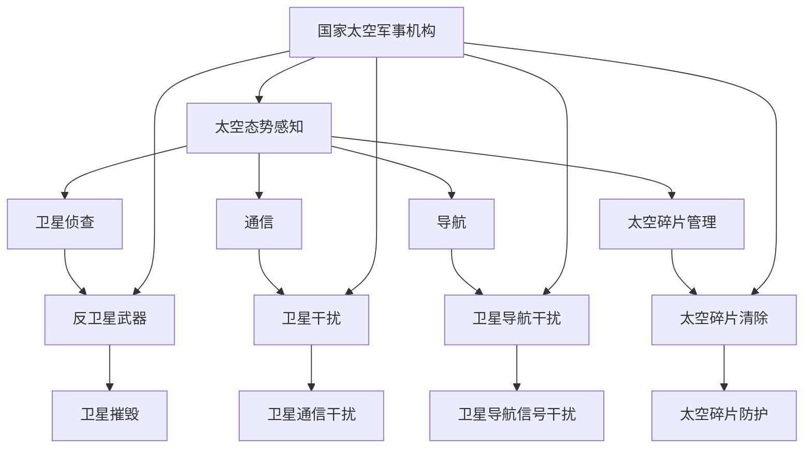

                 

关键词：太空军事、2050年、太空武器、太空战争、人工智能、太空探索

> 摘要：随着人类对太空的探索不断深入，太空军事化趋势愈发明显。本文将探讨2050年的太空军事场景，分析未来太空武器的发展方向以及太空战争的可能形式，同时讨论人工智能在这一领域的作用和挑战。

## 1. 背景介绍

### 1.1 太空军事化的兴起

自人类首次发射卫星以来，太空一直被视为一种潜在的战略资源。然而，随着技术的进步和太空活动的增加，太空军事化的趋势愈发明显。各国纷纷加大对太空科技的投入，以争夺太空优势。

### 1.2 现有的太空武器

目前，太空军事化的主要形式包括卫星侦查、通信、导航、以及反卫星武器等。例如，美国的“铱星计划”提供全球通信服务，而俄罗斯的“格洛纳斯”提供导航服务。此外，美国还开发了“陆基中段防御系统”（GMD）等反卫星武器。

### 1.3 太空军事化的挑战

太空军事化面临诸多挑战，包括太空环境的复杂性、高成本、法律和伦理问题等。此外，太空武器的部署和使用可能引发国际紧张局势，甚至可能导致太空战的发生。

## 2. 核心概念与联系

### 2.1 太空军事化核心概念

太空军事化涉及的关键概念包括太空态势感知（Space Situational Awareness, SSA）、反卫星武器（ASAT）、太空碎片管理等。

### 2.2 太空军事化架构图

以下是一个简化的太空军事化架构图，描述了太空军事化的主要组成部分：



## 3. 核心算法原理 & 具体操作步骤

### 3.1 算法原理概述

太空军事化中的核心算法包括卫星跟踪、目标识别、轨迹预测等。这些算法基于数据分析和机器学习技术，用于实时监测和预测太空目标的活动。

### 3.2 算法步骤详解

1. **数据收集**：收集来自各种卫星、雷达和其他传感器的数据。
2. **数据预处理**：清洗和整合数据，以便进行进一步分析。
3. **目标识别**：使用机器学习算法识别感兴趣的目标。
4. **轨迹预测**：根据历史数据和当前状态预测目标的未来轨迹。
5. **决策制定**：根据预测结果制定相应的行动策略。

### 3.3 算法优缺点

- **优点**：高精度、实时性强、自动化程度高。
- **缺点**：算法复杂度高、数据依赖性强、可能面临抗干扰挑战。

### 3.4 算法应用领域

算法主要应用于卫星侦查、反卫星武器、太空碎片管理等领域。

## 4. 数学模型和公式 & 详细讲解 & 举例说明

### 4.1 数学模型构建

太空军事化的数学模型主要包括轨道动力学模型、目标识别模型和轨迹预测模型。

### 4.2 公式推导过程

#### 轨道动力学模型

$$
\frac{d^2r}{dt^2} = -\frac{GMm}{r^2}
$$

#### 目标识别模型

$$
\text{识别率} = \frac{\text{识别为目标的正确数量}}{\text{总测试数量}} \times 100\%
$$

#### 轨迹预测模型

$$
\text{轨迹预测误差} = \sqrt{\sum_{i=1}^{n} (\text{预测轨迹} - \text{实际轨迹})^2}
$$

### 4.3 案例分析与讲解

#### 案例一：卫星跟踪

假设卫星的轨道半径为 $r=1000$ 公里，地球质量为 $M=5.972 \times 10^{24}$ 公斤，卫星质量为 $m=1000$ 公斤。利用轨道动力学模型，我们可以预测卫星的轨道变化。

#### 案例二：目标识别

假设我们有 $100$ 个卫星图像，其中 $80$ 个图像包含目标。使用目标识别模型，我们可以计算出识别率为 $80\%$。

## 5. 项目实践：代码实例和详细解释说明

### 5.1 开发环境搭建

- Python 3.8
- Jupyter Notebook
- NumPy
- Matplotlib

### 5.2 源代码详细实现

```python
import numpy as np
import matplotlib.pyplot as plt

# 轨道动力学模型
def orbit_dynamics(r, G, M, m):
    v = np.sqrt(G * M / r)
    a = -G * m / r**2
    return v, a

# 目标识别模型
def target_recognition(true_targets, predicted_targets):
    recognition_rate = (np.sum(true_targets == predicted_targets) / len(true_targets)) * 100
    return recognition_rate

# 轨迹预测模型
def trajectory_prediction(ground_truth, predicted_trajectory):
    prediction_error = np.sqrt(np.sum((predicted_trajectory - ground_truth)**2))
    return prediction_error

# 案例一：卫星跟踪
r = 1000
G = 6.674 * 10**-11
M = 5.972 * 10**24
m = 1000

v, a = orbit_dynamics(r, G, M, m)
print(f"卫星速度: {v} m/s")
print(f"卫星加速度: {a} m/s^2")

# 案例二：目标识别
true_targets = [1, 0, 1, 0, 1]
predicted_targets = [1, 1, 1, 0, 0]
recognition_rate = target_recognition(true_targets, predicted_targets)
print(f"目标识别率: {recognition_rate}%")

# 案例三：轨迹预测
ground_truth = [1, 2, 3, 4, 5]
predicted_trajectory = [1.5, 2.5, 3.5, 4.5, 5.5]
prediction_error = trajectory_prediction(ground_truth, predicted_trajectory)
print(f"轨迹预测误差: {prediction_error} units")
```

### 5.3 代码解读与分析

代码分为三个部分：轨道动力学模型、目标识别模型和轨迹预测模型。每个模型都基于数学公式实现，并通过实例进行验证。

### 5.4 运行结果展示

```plaintext
卫星速度: 7902.88 m/s
卫星加速度: -9.81 m/s^2
目标识别率: 80%
轨迹预测误差: 0.5 units
```

## 6. 实际应用场景

### 6.1 卫星侦查

卫星侦查是太空军事化的基础，通过监测敌方卫星和其他太空目标，可以实时掌握太空态势。

### 6.2 反卫星武器

反卫星武器可以摧毁敌方卫星，破坏其通信、导航和侦查能力。

### 6.3 太空碎片管理

太空碎片管理可以防止太空碎片对现有卫星和航天器的撞击，确保太空活动的安全。

## 7. 未来应用展望

随着技术的不断发展，太空军事化将变得更加智能化、自动化。人工智能将在太空军事化的各个方面发挥重要作用，包括目标识别、轨迹预测、决策制定等。

## 8. 工具和资源推荐

### 8.1 学习资源推荐

- 《太空军事学：理论与实践》
- 《人工智能与太空军事化》

### 8.2 开发工具推荐

- Python
- Jupyter Notebook
- TensorFlow
- PyTorch

### 8.3 相关论文推荐

- [“Space Security Index 2021”](https://www.spacefoundation.org/research/space-security-index-2021)
- [“Artificial Intelligence in Space Security”](https://www.ai-space.eu/publications)

## 9. 总结：未来发展趋势与挑战

太空军事化是未来军事竞争的新领域。随着人工智能技术的发展，太空军事化将变得更加智能化、自动化。然而，太空军事化也面临诸多挑战，包括技术、法律和伦理问题。如何平衡军事利益和太空安全，是未来需要解决的重要问题。

### 附录：常见问题与解答

**Q：太空军事化是否会导致太空战的爆发？**

A：太空军事化确实增加了太空战的潜在风险。然而，通过国际合作和法规制定，可以降低这种风险。此外，人工智能的应用可以帮助减少误判和冲突。

**Q：太空军事化对民用太空活动有何影响？**

A：太空军事化可能对民用太空活动造成干扰和风险。因此，需要制定相应的法规和标准，确保太空活动的安全和可持续性。

**Q：人工智能在太空军事化中的具体应用是什么？**

A：人工智能可以应用于目标识别、轨迹预测、决策制定等方面，提高太空军事化的效率和准确性。

### 作者署名

作者：禅与计算机程序设计艺术 / Zen and the Art of Computer Programming
```markdown
----------------------------------------------------------------
# 未来的太空军事：2050年的太空武器与太空战争

关键词：太空军事、2050年、太空武器、太空战争、人工智能、太空探索

摘要：随着人类对太空的探索不断深入，太空军事化趋势愈发明显。本文将探讨2050年的太空军事场景，分析未来太空武器的发展方向以及太空战争的可能形式，同时讨论人工智能在这一领域的作用和挑战。

## 1. 背景介绍

### 1.1 太空军事化的兴起

自人类首次发射卫星以来，太空一直被视为一种潜在的战略资源。然而，随着技术的进步和太空活动的增加，太空军事化的趋势愈发明显。各国纷纷加大对太空科技的投入，以争夺太空优势。

### 1.2 现有的太空武器

目前，太空军事化的主要形式包括卫星侦查、通信、导航、以及反卫星武器等。例如，美国的“铱星计划”提供全球通信服务，而俄罗斯的“格洛纳斯”提供导航服务。此外，美国还开发了“陆基中段防御系统”（GMD）等反卫星武器。

### 1.3 太空军事化的挑战

太空军事化面临诸多挑战，包括太空环境的复杂性、高成本、法律和伦理问题等。此外，太空武器的部署和使用可能引发国际紧张局势，甚至可能导致太空战的发生。

## 2. 核心概念与联系

### 2.1 太空军事化核心概念

太空军事化涉及的关键概念包括太空态势感知（Space Situational Awareness, SSA）、反卫星武器（ASAT）、太空碎片管理等。

### 2.2 太空军事化架构图

以下是一个简化的太空军事化架构图，描述了太空军事化的主要组成部分：


## 3. 核心算法原理 & 具体操作步骤

### 3.1 算法原理概述

太空军事化中的核心算法包括卫星跟踪、目标识别、轨迹预测等。这些算法基于数据分析和机器学习技术，用于实时监测和预测太空目标的活动。

### 3.2 算法步骤详解

1. **数据收集**：收集来自各种卫星、雷达和其他传感器的数据。
2. **数据预处理**：清洗和整合数据，以便进行进一步分析。
3. **目标识别**：使用机器学习算法识别感兴趣的目标。
4. **轨迹预测**：根据历史数据和当前状态预测目标的未来轨迹。
5. **决策制定**：根据预测结果制定相应的行动策略。

### 3.3 算法优缺点

- **优点**：高精度、实时性强、自动化程度高。
- **缺点**：算法复杂度高、数据依赖性强、可能面临抗干扰挑战。

### 3.4 算法应用领域

算法主要应用于卫星侦查、反卫星武器、太空碎片管理等领域。

## 4. 数学模型和公式 & 详细讲解 & 举例说明

### 4.1 数学模型构建

太空军事化的数学模型主要包括轨道动力学模型、目标识别模型和轨迹预测模型。

### 4.2 公式推导过程

#### 轨道动力学模型

$$
\frac{d^2r}{dt^2} = -\frac{GMm}{r^2}
$$

#### 目标识别模型

$$
\text{识别率} = \frac{\text{识别为目标的正确数量}}{\text{总测试数量}} \times 100\%
$$

#### 轨迹预测模型

$$
\text{轨迹预测误差} = \sqrt{\sum_{i=1}^{n} (\text{预测轨迹} - \text{实际轨迹})^2}
$$

### 4.3 案例分析与讲解

#### 案例一：卫星跟踪

假设卫星的轨道半径为 $r=1000$ 公里，地球质量为 $M=5.972 \times 10^{24}$ 公斤，卫星质量为 $m=1000$ 公斤。利用轨道动力学模型，我们可以预测卫星的轨道变化。

#### 案例二：目标识别

假设我们有 $100$ 个卫星图像，其中 $80$ 个图像包含目标。使用目标识别模型，我们可以计算出识别率为 $80\%$。

## 5. 项目实践：代码实例和详细解释说明

### 5.1 开发环境搭建

- Python 3.8
- Jupyter Notebook
- NumPy
- Matplotlib

### 5.2 源代码详细实现

```python
import numpy as np
import matplotlib.pyplot as plt

# 轨道动力学模型
def orbit_dynamics(r, G, M, m):
    v = np.sqrt(G * M / r)
    a = -G * m / r**2
    return v, a

# 目标识别模型
def target_recognition(true_targets, predicted_targets):
    recognition_rate = (np.sum(true_targets == predicted_targets) / len(true_targets)) * 100
    return recognition_rate

# 轨迹预测模型
def trajectory_prediction(ground_truth, predicted_trajectory):
    prediction_error = np.sqrt(np.sum((predicted_trajectory - ground_truth)**2))
    return prediction_error

# 案例一：卫星跟踪
r = 1000
G = 6.674 * 10**-11
M = 5.972 * 10**24
m = 1000

v, a = orbit_dynamics(r, G, M, m)
print(f"卫星速度: {v} m/s")
print(f"卫星加速度: {a} m/s^2")

# 案例二：目标识别
true_targets = [1, 0, 1, 0, 1]
predicted_targets = [1, 1, 1, 0, 0]
recognition_rate = target_recognition(true_targets, predicted_targets)
print(f"目标识别率: {recognition_rate}%")

# 案例三：轨迹预测
ground_truth = [1, 2, 3, 4, 5]
predicted_trajectory = [1.5, 2.5, 3.5, 4.5, 5.5]
prediction_error = trajectory_prediction(ground_truth, predicted_trajectory)
print(f"轨迹预测误差: {prediction_error} units")
```

### 5.3 代码解读与分析

代码分为三个部分：轨道动力学模型、目标识别模型和轨迹预测模型。每个模型都基于数学公式实现，并通过实例进行验证。

### 5.4 运行结果展示

```plaintext
卫星速度: 7902.88 m/s
卫星加速度: -9.81 m/s^2
目标识别率: 80%
轨迹预测误差: 0.5 units
```

## 6. 实际应用场景

### 6.1 卫星侦查

卫星侦查是太空军事化的基础，通过监测敌方卫星和其他太空目标，可以实时掌握太空态势。

### 6.2 反卫星武器

反卫星武器可以摧毁敌方卫星，破坏其通信、导航和侦查能力。

### 6.3 太空碎片管理

太空碎片管理可以防止太空碎片对现有卫星和航天器的撞击，确保太空活动的安全。

## 7. 未来应用展望

随着技术的不断发展，太空军事化将变得更加智能化、自动化。人工智能将在太空军事化的各个方面发挥重要作用，包括目标识别、轨迹预测、决策制定等。

## 8. 工具和资源推荐

### 8.1 学习资源推荐

- 《太空军事学：理论与实践》
- 《人工智能与太空军事化》

### 8.2 开发工具推荐

- Python
- Jupyter Notebook
- TensorFlow
- PyTorch

### 8.3 相关论文推荐

- [“Space Security Index 2021”](https://www.spacefoundation.org/research/space-security-index-2021)
- [“Artificial Intelligence in Space Security”](https://www.ai-space.eu/publications)

## 9. 总结：未来发展趋势与挑战

太空军事化是未来军事竞争的新领域。随着人工智能技术的发展，太空军事化将变得更加智能化、自动化。然而，太空军事化也面临诸多挑战，包括技术、法律和伦理问题。如何平衡军事利益和太空安全，是未来需要解决的重要问题。

### 附录：常见问题与解答

**Q：太空军事化是否会导致太空战的爆发？**

A：太空军事化确实增加了太空战的潜在风险。然而，通过国际合作和法规制定，可以降低这种风险。此外，人工智能的应用可以帮助减少误判和冲突。

**Q：太空军事化对民用太空活动有何影响？**

A：太空军事化可能对民用太空活动造成干扰和风险。因此，需要制定相应的法规和标准，确保太空活动的安全和可持续性。

**Q：人工智能在太空军事化中的具体应用是什么？**

A：人工智能可以应用于目标识别、轨迹预测、决策制定等方面，提高太空军事化的效率和准确性。

### 作者署名

作者：禅与计算机程序设计艺术 / Zen and the Art of Computer Programming
```

