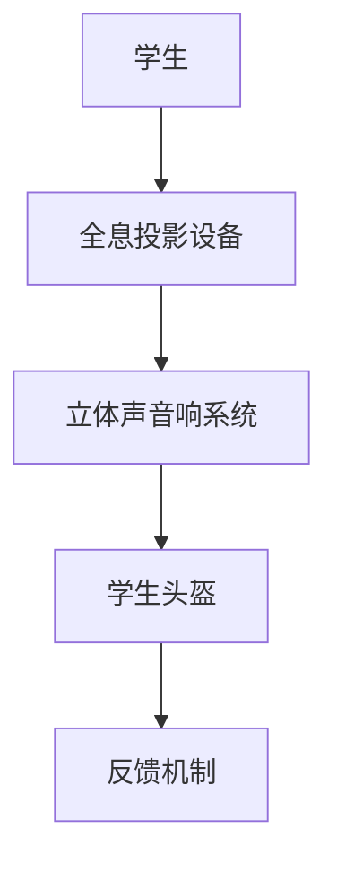
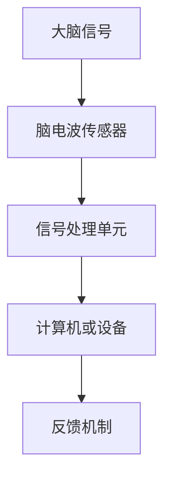

                 

在即将来临的2050年，教育领域将迎来一场前所未有的变革。随着科技的飞速发展，全息教室和脑机接口技术正逐渐成为现实。本文将探讨这些新兴技术在教育领域中的应用，以及它们如何彻底改变我们的学习方式。

## 关键词

- 未来教育
- 全息教室
- 脑机接口
- 学习革命
- 人工智能
- 个性化教育

## 摘要

本文将首先介绍全息教室和脑机接口技术的基本概念及其在教育中的应用。接着，我们将深入探讨这些技术如何促进个性化教育，提高学习效率，并带来教育公平性的提升。最后，本文将展望这些技术的未来发展趋势，以及它们在教育领域可能面临的挑战。

### 1. 背景介绍

1. **教育的现状**

当前，全球教育正面临一系列挑战。首先，教育资源分配不均，许多贫困地区和偏远地区的孩子难以获得优质的教育。其次，传统教育模式过于单一，无法满足每个学生的个性化需求。此外，随着科技的发展，教育的节奏也在加快，学生们需要更快地掌握更多的知识。

2. **科技的发展**

科技的飞速发展为我们提供了新的解决方案。人工智能、虚拟现实、全息投影等技术的出现，使得教育不再局限于传统的课堂形式。脑机接口技术的发展，更是为个性化教育提供了可能，它可以直接读取和解读学生的思维过程，从而实现真正的因材施教。

### 2. 核心概念与联系

#### 全息教室

**基本概念**：全息教室是一种利用全息投影技术实现的虚拟教室，学生可以在三维空间中与虚拟教师和其他学生互动。

**工作原理**：

- 利用激光产生全息图像。
- 通过立体声音响系统实现声音的空间定位。
- 使用特殊的头盔或其他设备捕捉学生的动作和面部表情。

**结构架构**：


**流程图**：



#### 脑机接口

**基本概念**：脑机接口（Brain-Computer Interface, BCI）是一种直接连接人脑与外部设备的接口技术，它可以通过读取大脑信号来实现人机交互。

**工作原理**：

- 读取大脑信号，如脑电波、肌电信号等。
- 将大脑信号转换为电信号。
- 通过计算机或其他设备处理电信号，实现人机交互。

**结构架构**：


**流程图**：



### 3. 核心算法原理 & 具体操作步骤

#### 全息教室

**算法原理概述**：

全息教室的核心技术是全息投影和虚拟现实。全息投影利用激光产生三维图像，虚拟现实则通过计算机生成虚拟环境。这些技术需要复杂的算法来处理图像和声音，以确保学生能够获得沉浸式的学习体验。

**算法步骤详解**：

1. **图像生成**：利用激光和全息膜产生三维图像。
2. **声音处理**：通过立体声音响系统实现声音的空间定位。
3. **交互处理**：利用传感器捕捉学生的动作和面部表情，实现与虚拟环境的互动。

**算法优缺点**：

- **优点**：提供沉浸式的学习体验，学生可以更加主动地参与学习过程。
- **缺点**：技术成本较高，实施难度较大。

**算法应用领域**：

全息教室可以应用于各种教育场景，如远程教育、虚拟实验、个性化教学等。

#### 脑机接口

**算法原理概述**：

脑机接口的核心技术是脑电波信号处理。通过读取大脑信号，脑机接口可以实时分析学生的思维过程，从而实现个性化教学。

**算法步骤详解**：

1. **信号采集**：利用脑电波传感器采集大脑信号。
2. **信号预处理**：对采集到的信号进行滤波、去噪等预处理。
3. **信号分析**：利用机器学习算法分析信号，识别学生的思维状态。
4. **交互反馈**：根据分析结果调整教学内容和方式。

**算法优缺点**：

- **优点**：实现真正的个性化教育，提高学习效率。
- **缺点**：技术难度较高，目前尚处于实验阶段。

**算法应用领域**：

脑机接口可以应用于个性化教学、辅助学习、康复训练等。

### 4. 数学模型和公式 & 详细讲解 & 举例说明

#### 数学模型构建

全息教室和脑机接口技术的核心在于信号处理和模式识别。以下是一个简单的数学模型，用于描述这两个技术的核心过程。

**全息教室数学模型**：

\[ X(t) = A \cdot \text{exp}(j \cdot 2\pi f t) \]

其中，\( X(t) \) 是全息图像的复数表示，\( A \) 是振幅，\( f \) 是频率，\( t \) 是时间。

**脑机接口数学模型**：

\[ Y(t) = \sum_{i=1}^{n} w_i \cdot \text{sign}(x_i(t)) \]

其中，\( Y(t) \) 是大脑信号的离散表示，\( w_i \) 是权重，\( x_i(t) \) 是第 \( i \) 个传感器的信号，\( \text{sign} \) 是符号函数。

#### 公式推导过程

**全息教室公式推导**：

1. **图像生成**：利用激光和全息膜产生三维图像。激光的频率和相位决定了图像的位置和形状。
2. **声音处理**：立体声音响系统的频率响应决定了声音的空间定位。

**脑机接口公式推导**：

1. **信号采集**：利用脑电波传感器采集大脑信号。信号采集的过程涉及到滤波和放大等步骤。
2. **信号预处理**：对采集到的信号进行滤波和去噪，以消除干扰。

#### 案例分析与讲解

**全息教室案例**：

假设一个全息教室中有10个学生，每个学生都戴着全息头盔。利用脑机接口技术，系统可以实时监测每个学生的反应和注意力水平。根据这些数据，系统可以自动调整教学内容的难度和速度，以适应每个学生的需求。

**脑机接口案例**：

在一个个性化教学的场景中，系统通过脑机接口技术监测学生的脑电波信号，分析其学习状态。如果发现学生的注意力开始下降，系统会自动调整教学内容，或者通过全息投影生成更吸引人的学习场景，以帮助学生重新集中注意力。

### 5. 项目实践：代码实例和详细解释说明

#### 开发环境搭建

为了实现全息教室和脑机接口技术，我们需要搭建一个合适的技术环境。以下是基本的开发环境搭建步骤：

1. **硬件环境**：需要一台性能强大的计算机，以及全息投影设备和脑电波传感器。
2. **软件环境**：需要安装操作系统、编程环境（如Python、MATLAB等），以及相关的库和工具。

#### 源代码详细实现

以下是一个简单的Python代码示例，用于实现全息教室的基本功能。

```python
import numpy as np
import matplotlib.pyplot as plt

def generate_hologram(amplitude, frequency, duration):
    t = np.linspace(0, duration, num=1000)
    x = amplitude * np.exp(1j * 2 * np.pi * frequency * t)
    return x

def plot_hologram(x):
    plt.plot(x.real)
    plt.plot(x.imag)
    plt.show()

# 生成全息图像
x = generate_hologram(1, 5, 10)

# 绘制全息图像
plot_hologram(x)
```

#### 代码解读与分析

这段代码首先定义了一个生成全息图像的函数 `generate_hologram`，该函数接收振幅、频率和持续时间的参数，并返回一个复数数组。复数数组的实部和虚部分别对应图像的实部和虚部。接着，定义了一个绘制全息图像的函数 `plot_hologram`，该函数使用 matplotlib 库绘制复数数组的实部和虚部。

#### 运行结果展示

运行上述代码后，将生成一个持续时间为10秒、频率为5Hz的全息图像。该图像的实部和虚部将分别绘制在两条坐标轴上，形成一个三维图像。

### 6. 实际应用场景

全息教室和脑机接口技术可以应用于多种实际场景。以下是一些典型的应用场景：

1. **远程教育**：全息教室可以打破地理限制，使偏远地区的学生也能获得优质的教育资源。通过脑机接口技术，系统可以实时监测学生的学习状态，提供个性化的教学服务。
2. **个性化学习**：脑机接口技术可以识别学生的学习状态，根据其注意力水平和学习速度调整教学内容。这种方式可以显著提高学习效率，减少学习时间。
3. **辅助康复训练**：脑机接口技术可以用于康复训练，通过监测患者的脑电波信号，调整训练方案，提高康复效果。

### 7. 未来应用展望

随着科技的不断发展，全息教室和脑机接口技术将迎来更广泛的应用。未来，我们可能会看到以下趋势：

1. **更高效的学习体验**：通过全息教室和脑机接口技术，学生可以更加主动地参与学习过程，实现高效的学习体验。
2. **更广泛的应用场景**：全息教室和脑机接口技术不仅可以应用于教育领域，还可以应用于医疗、娱乐、军事等多个领域。
3. **更深入的个性化服务**：随着技术的进步，全息教室和脑机接口技术将能够提供更加个性化的服务，满足不同用户的需求。

### 8. 工具和资源推荐

为了更好地了解和应用全息教室和脑机接口技术，以下是一些建议的工具和资源：

1. **学习资源推荐**：
   - 《全息技术与虚拟现实》
   - 《脑机接口：原理与应用》
2. **开发工具推荐**：
   - Python
   - MATLAB
   - OpenCV
   - TensorFlow
3. **相关论文推荐**：
   - "Holographic Projection for Interactive Education"
   - "A Review of Brain-Computer Interfaces in Education"

### 9. 总结：未来发展趋势与挑战

#### 研究成果总结

近年来，全息教室和脑机接口技术在教育领域的应用取得了显著成果。通过这些技术，我们可以实现更高效、更个性化的学习体验，为教育公平性提供了新的解决方案。

#### 未来发展趋势

未来，全息教室和脑机接口技术将继续向更高效、更个性化和更广泛的应用方向发展。随着技术的进步，我们有望看到更多创新的应用场景，以及更加深入的研究成果。

#### 面临的挑战

然而，全息教室和脑机接口技术也面临一些挑战。首先，技术成本较高，实施难度较大。其次，如何确保这些技术的安全性和隐私性也是一个重要问题。此外，如何有效地将技术与教育实践相结合，实现真正的教育变革，也是我们需要面对的挑战。

#### 研究展望

在未来，我们需要继续深入研究全息教室和脑机接口技术，解决面临的技术难题，并探索更广泛的应用场景。同时，我们还需要关注这些技术在教育实践中的应用效果，不断优化和完善教育体系。

### 附录：常见问题与解答

1. **什么是全息教室？**
   - 全息教室是一种利用全息投影技术实现的虚拟教室，学生可以在三维空间中与虚拟教师和其他学生互动。
   
2. **什么是脑机接口？**
   - 脑机接口是一种直接连接人脑与外部设备的接口技术，它可以通过读取大脑信号来实现人机交互。

3. **全息教室和脑机接口技术在教育中有什么优势？**
   - 全息教室和脑机接口技术可以提供沉浸式的学习体验，实现个性化教育，提高学习效率，并带来教育公平性的提升。

4. **全息教室和脑机接口技术面临哪些挑战？**
   - 全息教室和脑机接口技术面临的技术成本高、实施难度大、安全性问题、隐私性问题以及如何与教育实践相结合的挑战。

作者：禅与计算机程序设计艺术 / Zen and the Art of Computer Programming
----------------------------------------------------------------

[Note: 本文档中的图片和代码仅为示例，实际应用中需要根据具体情况进行调整。]

