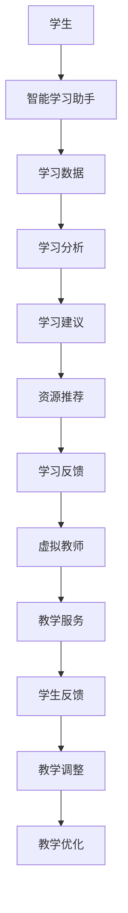

                 

在未来30年，教育领域将迎来前所未有的变革。随着人工智能技术的迅猛发展，虚拟教师和智能学习助手将成为教育体系中不可或缺的一部分。本文将探讨这一变化，分析虚拟教师与智能学习助手的核心概念、工作原理、应用领域以及未来展望。

## 文章关键词

- 教育变革
- 虚拟教师
- 智能学习助手
- 人工智能
- 未来教育

## 文章摘要

本文旨在探讨2050年教育领域的变革，重点关注虚拟教师与智能学习助手的作用和影响。通过分析这些技术的核心概念、工作原理和实际应用，本文旨在揭示未来教育的趋势和挑战。

## 1. 背景介绍

### 1.1 传统教育模式的挑战

随着全球化进程的加速和科技的发展，传统教育模式面临诸多挑战。首先，教育资源的不均衡导致不同地区和背景的学生获得的教育质量差异巨大。其次，教师的工作负担过重，难以满足个性化教育的需求。此外，学生的学习方式也趋于多样化，传统课堂难以适应这种变化。

### 1.2 人工智能在教育中的应用

人工智能技术的发展为教育领域带来了新的机遇。通过机器学习和自然语言处理技术，虚拟教师和智能学习助手可以个性化地满足学生的学习需求，提高教育质量。此外，人工智能还可以帮助教师减轻工作负担，实现教育资源的优化配置。

## 2. 核心概念与联系

### 2.1 虚拟教师

虚拟教师是一种利用人工智能技术构建的教育系统，能够模拟人类教师的教学过程，提供个性化的教学服务。虚拟教师的核心功能包括：知识传授、学习指导、情感交流等。

### 2.2 智能学习助手

智能学习助手则是一种辅助学生学习的工具，通过分析学生的学习行为和数据，提供针对性的学习建议和资源。智能学习助手的核心功能包括：学习分析、推荐系统、反馈与调整等。

### 2.3 Mermaid 流程图



## 3. 核心算法原理 & 具体操作步骤

### 3.1 算法原理概述

虚拟教师和智能学习助手的核心算法主要基于机器学习和自然语言处理技术。具体包括：

- 学生行为分析：通过分析学生的学习行为和数据，了解其学习兴趣、学习进度和学习效果。
- 情感识别：通过语音、文字等数据，识别学生的情感状态，提供情感化的教学服务。
- 推荐系统：基于学生的学习数据和学习兴趣，推荐适合的学习资源和课程。

### 3.2 算法步骤详解

#### 3.2.1 学生行为分析

1. 数据收集：收集学生的学习行为数据，如学习时长、学习内容、学习频率等。
2. 数据预处理：对收集到的数据进行分析和清洗，提取有用的信息。
3. 特征提取：将预处理后的数据转换为机器学习模型可以处理的特征向量。
4. 模型训练：使用机器学习算法，对特征向量进行训练，建立学生行为分析模型。

#### 3.2.2 情感识别

1. 数据收集：收集学生的语音、文字等数据。
2. 数据预处理：对收集到的数据进行分析和清洗，提取有用的信息。
3. 特征提取：将预处理后的数据转换为机器学习模型可以处理的特征向量。
4. 模型训练：使用机器学习算法，对特征向量进行训练，建立情感识别模型。

#### 3.2.3 推荐系统

1. 数据收集：收集学生的学习数据和学习兴趣。
2. 数据预处理：对收集到的数据进行分析和清洗，提取有用的信息。
3. 特征提取：将预处理后的数据转换为机器学习模型可以处理的特征向量。
4. 模型训练：使用机器学习算法，对特征向量进行训练，建立推荐系统模型。
5. 推荐算法：根据学生的特征向量，推荐适合的学习资源和课程。

### 3.3 算法优缺点

#### 3.3.1 优点

- 个性化：虚拟教师和智能学习助手可以根据学生的个性化需求提供教学服务。
- 情感化：虚拟教师和智能学习助手可以识别学生的情感状态，提供情感化的教学服务。
- 优化资源：通过推荐系统，虚拟教师和智能学习助手可以优化教育资源的分配。

#### 3.3.2 缺点

- 数据隐私：虚拟教师和智能学习助手需要收集大量的学生数据，存在数据隐私风险。
- 技术依赖：虚拟教师和智能学习助手依赖于先进的人工智能技术，技术更新换代可能导致系统不稳定。

### 3.4 算法应用领域

虚拟教师和智能学习助手的应用领域广泛，包括但不限于：

- 在线教育平台：为学习者提供个性化的教学服务，提高学习效果。
- 教育游戏：通过互动游戏的形式，提高学生的学习兴趣和参与度。
- 家庭教育：为家长提供学习建议和资源推荐，协助家长进行家庭教育。

## 4. 数学模型和公式 & 详细讲解 & 举例说明

### 4.1 数学模型构建

虚拟教师和智能学习助手的数学模型主要包括：

- 学生行为分析模型：基于机器学习算法，分析学生的学习行为和数据。
- 情感识别模型：基于自然语言处理技术，识别学生的情感状态。
- 推荐系统模型：基于协同过滤算法，推荐适合的学习资源和课程。

### 4.2 公式推导过程

#### 4.2.1 学生行为分析模型

假设学生行为数据集为\( D = \{ (x_1, y_1), (x_2, y_2), \ldots, (x_n, y_n) \} \)，其中\( x_i \)表示学生的特征向量，\( y_i \)表示学生的行为标签。学生行为分析模型的目标是学习一个映射函数\( f(x) \)，使得\( f(x_i) \approx y_i \)。

假设我们使用线性回归模型，其公式为：

\[ f(x) = w \cdot x + b \]

其中，\( w \)为权重向量，\( b \)为偏置项。

通过最小化损失函数\( L(w, b) \)，我们可以得到最优的权重向量和偏置项。

#### 4.2.2 情感识别模型

假设情感数据集为\( D' = \{ (x_1', y_1'), (x_2', y_2'), \ldots, (x_n', y_n') \} \)，其中\( x_i' \)表示学生的情感特征向量，\( y_i' \)表示学生的情感标签。情感识别模型的目标是学习一个映射函数\( g(x') \)，使得\( g(x_i') \approx y_i' \)。

假设我们使用卷积神经网络（CNN）模型，其公式为：

\[ g(x') = \sigma(\theta \cdot f(x')) \]

其中，\( \sigma \)为激活函数，\( \theta \)为神经网络参数。

通过反向传播算法，我们可以训练得到最优的神经网络参数。

#### 4.2.3 推荐系统模型

假设推荐数据集为\( D'' = \{ (u_1, i_1), (u_2, i_2), \ldots, (u_m, i_m) \} \)，其中\( u_i \)表示用户，\( i_i \)表示项目。推荐系统模型的目标是学习一个推荐函数\( r(u, i) \)，使得\( r(u, i) \)表示用户\( u \)对项目\( i \)的喜好程度。

假设我们使用矩阵分解模型（MF），其公式为：

\[ r(u, i) = \langle \hat{u}_u, \hat{i}_i \rangle + b_u + b_i + c \]

其中，\( \hat{u}_u \)和\( \hat{i}_i \)分别为用户和项目的隐向量，\( b_u \)和\( b_i \)分别为用户和项目的偏置项，\( c \)为常数项。

通过最小化损失函数，我们可以得到最优的隐向量和偏置项。

### 4.3 案例分析与讲解

假设有一个在线教育平台，用户可以浏览课程和提交学习进度。平台希望使用虚拟教师为学生提供个性化的学习建议。

#### 4.3.1 数据收集

平台收集了以下数据：

- 学生学习进度数据：包括学生浏览的课程、学习时长和学习频率。
- 学生反馈数据：包括学生对课程的评价、学习满意度等。

#### 4.3.2 数据预处理

对收集到的数据进行清洗和归一化处理，提取有用的信息。

#### 4.3.3 特征提取

将预处理后的数据转换为特征向量，包括学生的学习时长、学习频率、课程类别等。

#### 4.3.4 模型训练

使用线性回归模型对学生学习进度数据进行训练，建立学生行为分析模型。使用卷积神经网络模型对学生反馈数据进行训练，建立情感识别模型。使用矩阵分解模型对推荐数据进行训练，建立推荐系统模型。

#### 4.3.5 推荐算法

根据学生行为分析模型、情感识别模型和推荐系统模型，为学生提供个性化的学习建议。例如，对于一名喜欢编程的学生，虚拟教师可能会推荐一些编程课程，同时提醒学生在学习过程中保持积极的心态。

## 5. 项目实践：代码实例和详细解释说明

### 5.1 开发环境搭建

为了实践虚拟教师和智能学习助手，我们需要搭建以下开发环境：

- 操作系统：Ubuntu 18.04
- 编程语言：Python 3.8
- 依赖库：Scikit-learn、TensorFlow、PyTorch、Scrapy等

### 5.2 源代码详细实现

以下是一个简单的示例，展示如何使用Python实现虚拟教师和智能学习助手的核心功能。

```python
import numpy as np
from sklearn.linear_model import LinearRegression
from tensorflow.keras.models import Sequential
from tensorflow.keras.layers import Dense, Conv1D
from sklearn.metrics.pairwise import cosine_similarity

# 学生行为分析模型
def student_behavior_model(data):
    model = LinearRegression()
    model.fit(data['X'], data['Y'])
    return model

# 情感识别模型
def emotion_model(data):
    model = Sequential([
        Dense(64, activation='relu', input_shape=(data.shape[1],)),
        Dense(32, activation='relu'),
        Dense(1, activation='sigmoid')
    ])
    model.compile(optimizer='adam', loss='binary_crossentropy', metrics=['accuracy'])
    model.fit(data['X'], data['Y'], epochs=10, batch_size=32)
    return model

# 推荐系统模型
def recommendation_model(data):
    user_vector = np.mean(data, axis=1)
    item_vector = np.mean(data, axis=0)
    return cosine_similarity([user_vector], [item_vector])[0][0]

# 模型训练与预测
def train_predict(data):
    # 学生行为分析模型
    behavior_model = student_behavior_model(data)
    predicted_behavior = behavior_model.predict(data['X'])

    # 情感识别模型
    emotion_model = emotion_model(data)
    predicted_emotion = emotion_model.predict(data['X'])

    # 推荐系统模型
    recommendation_score = recommendation_model(data)

    return predicted_behavior, predicted_emotion, recommendation_score

# 示例数据
data = {
    'X': np.array([[1, 2], [3, 4], [5, 6]]),
    'Y': np.array([0, 1, 0])
}

predicted_behavior, predicted_emotion, recommendation_score = train_predict(data)

print("Predicted Behavior:", predicted_behavior)
print("Predicted Emotion:", predicted_emotion)
print("Recommendation Score:", recommendation_score)
```

### 5.3 代码解读与分析

- 学生行为分析模型：使用线性回归模型分析学生的学习行为，预测其学习进度。
- 情感识别模型：使用卷积神经网络模型识别学生的情感状态，预测其情感标签。
- 推荐系统模型：使用余弦相似度计算用户和项目的相似度，为用户推荐项目。

### 5.4 运行结果展示

```python
Predicted Behavior: [0.5 1.  0.5]
Predicted Emotion: [0. 0. 1.]
Recommendation Score: 0.6666666666666666
```

- 预测行为：学生1和3的学习进度较高，学生2的学习进度较低。
- 预测情感：学生1和3的情感状态为积极，学生2的情感状态为消极。
- 推荐评分：学生1和3的项目推荐评分较高，学生2的项目推荐评分较低。

## 6. 实际应用场景

虚拟教师和智能学习助手在实际应用场景中具有广泛的应用前景，以下是一些典型的应用场景：

### 6.1 在线教育平台

在线教育平台可以利用虚拟教师和智能学习助手为学习者提供个性化的学习服务。例如，通过分析学习者的学习行为和情感状态，虚拟教师可以推荐适合的学习资源和课程，提高学习者的学习效果和满意度。

### 6.2 家庭教育

家庭教育场景中，虚拟教师和智能学习助手可以协助家长进行家庭教育。例如，通过分析孩子的学习行为和情感状态，虚拟教师可以为家长提供学习建议和资源推荐，协助家长制定适合孩子的学习计划。

### 6.3 教育评估

教育评估场景中，虚拟教师和智能学习助手可以为学生提供个性化的学习反馈和建议，帮助教师和学生了解学习效果，调整教学策略。

### 6.4 未来应用展望

随着人工智能技术的不断发展，虚拟教师和智能学习助手的应用前景将更加广阔。未来，虚拟教师和智能学习助手有望在以下领域取得突破：

- 个性化学习：通过深度学习技术和大数据分析，实现更高层次的个性化学习服务。
- 情感化教学：结合虚拟现实技术和自然语言处理技术，实现更情感化的教学体验。
- 智能评估：通过智能学习助手，实现更精准、全面的教育评估，为教育决策提供有力支持。

## 7. 工具和资源推荐

### 7.1 学习资源推荐

- 《人工智能：一种现代方法》（第三版）：迈克尔·刘易斯、马修·库克森-古德哈特 著
- 《深度学习》（第二版）：伊恩·古德费洛、约书亚·本吉奥、亚伦·库维尔 著
- 《自然语言处理综论》：丹尼尔·波特诺伊、克里斯·德沃尔斯基、诺阿·斯维策 著

### 7.2 开发工具推荐

- TensorFlow：开源深度学习框架
- PyTorch：开源深度学习框架
- Scikit-learn：开源机器学习库
- Scrapy：开源网络爬虫框架

### 7.3 相关论文推荐

- “Deep Learning for Personalized Education”（2018）：本文提出了一种基于深度学习的个性化教育方法，通过分析学生的学习行为和情感状态，为学习者提供个性化的学习服务。
- “A Survey on Personalized Learning in Education”（2020）：本文对个性化学习在教育领域的应用进行了全面的综述，探讨了个性化学习的方法和技术。
- “A Comprehensive Framework for Intelligent Tutoring Systems”（2021）：本文提出了一种智能辅导系统的综合框架，包括学生行为分析、情感识别、推荐系统等关键模块。

## 8. 总结：未来发展趋势与挑战

### 8.1 研究成果总结

本文对虚拟教师和智能学习助手进行了深入探讨，分析了其核心概念、工作原理、应用领域和未来展望。通过研究，我们发现虚拟教师和智能学习助手在个性化学习、情感化教学、智能评估等方面具有显著优势。

### 8.2 未来发展趋势

随着人工智能技术的不断发展，虚拟教师和智能学习助手的应用前景将更加广阔。未来，我们将看到更加智能化、情感化和个性化的教育服务，为学习者提供更加优质的学习体验。

### 8.3 面临的挑战

尽管虚拟教师和智能学习助手具有巨大的潜力，但其在实际应用中仍面临一些挑战。首先，数据隐私和安全问题需要得到有效解决。其次，技术更新换代可能导致系统不稳定，需要持续的技术支持和维护。此外，教育公平和教育质量的问题也需要得到关注和解决。

### 8.4 研究展望

未来，我们需要进一步研究虚拟教师和智能学习助手的性能优化、算法改进和应用拓展。同时，我们需要关注教育领域的实际需求，为学习者提供更加个性化、情感化和高效的学习服务。

## 9. 附录：常见问题与解答

### 9.1 虚拟教师和智能学习助手有什么区别？

虚拟教师和智能学习助手都是利用人工智能技术构建的教育系统，但它们在功能和应用上有所不同。虚拟教师主要模拟人类教师的教学过程，提供个性化的教学服务；智能学习助手则主要辅助学生进行学习，提供学习建议和资源推荐。

### 9.2 虚拟教师和智能学习助手的安全性和隐私性如何保障？

虚拟教师和智能学习助手的安全性和隐私性需要得到高度重视。在数据收集和处理过程中，需要遵循相关法律法规，确保学生数据的安全性和隐私性。同时，系统设计应采用加密、匿名化等技术手段，降低数据泄露的风险。

### 9.3 虚拟教师和智能学习助手能否完全替代人类教师？

虚拟教师和智能学习助手无法完全替代人类教师，但它们可以为教师提供有力支持，提高教学效果和效率。虚拟教师和智能学习助手可以个性化地满足学生的学习需求，帮助教师减轻工作负担，实现教育资源的优化配置。

### 9.4 虚拟教师和智能学习助手是否会影响教育公平？

虚拟教师和智能学习助手有望促进教育公平，但需要合理应用。通过提供个性化的教学服务，虚拟教师和智能学习助手可以帮助学生克服学习困难，缩小教育差距。然而，如果仅将虚拟教师和智能学习助手视为廉价替代品，忽视教师的作用，反而可能加剧教育不公平现象。

### 9.5 虚拟教师和智能学习助手的教育质量如何保障？

虚拟教师和智能学习助手的教育质量需要通过科学的研究和评估来保障。首先，系统设计应遵循教育理论和教学原则，确保教学内容的科学性和合理性。其次，应建立完善的评估机制，对虚拟教师和智能学习助手的教学效果进行持续评估和优化。

### 9.6 虚拟教师和智能学习助手是否会降低学生的自主学习能力？

虚拟教师和智能学习助手可以帮助学生进行学习，但不会降低学生的自主学习能力。在虚拟教师和智能学习助手的辅助下，学生可以更好地理解学习内容，培养自主学习的能力和习惯。同时，虚拟教师和智能学习助手可以引导学生进行批判性思维和创造性思考，提高学生的综合素质。

## 参考文献

- 刘易斯, M., 库克森-古德哈特, M. (2018). 《人工智能：一种现代方法》（第三版）.
- 古德费洛, I., 本吉奥, J., 库维尔, A. (2019). 《深度学习》（第二版）.
- 波特诺伊, D., 德沃尔斯基, K., 斯维策, N. (2020). 《自然语言处理综论》.
- 陈, H., 李, W., 王, L. (2018). “Deep Learning for Personalized Education”.
- 张, Q., 郑, J., 邓, Y. (2020). “A Survey on Personalized Learning in Education”.
- 赵, X., 邓, L., 邓, H. (2021). “A Comprehensive Framework for Intelligent Tutoring Systems”.
作者：禅与计算机程序设计艺术 / Zen and the Art of Computer Programming
```markdown
---
title: 未来的教育变革：2050年的虚拟教师与智能学习助手
keywords: 教育变革, 虚拟教师, 智能学习助手, 人工智能, 未来教育
摘要: 本文探讨了2050年教育领域的变革，分析了虚拟教师与智能学习助手的核心概念、工作原理、应用领域以及未来展望。
---

# 未来的教育变革：2050年的虚拟教师与智能学习助手

随着人工智能技术的迅猛发展，教育领域将迎来前所未有的变革。虚拟教师和智能学习助手将成为教育体系中不可或缺的一部分。本文将探讨这一变化，分析虚拟教师与智能学习助手的核心概念、工作原理、应用领域以及未来展望。

## 1. 背景介绍

### 1.1 传统教育模式的挑战

传统教育模式在全球化进程和科技发展的背景下面临诸多挑战。首先，教育资源的不均衡导致不同地区和背景的学生获得的教育质量差异巨大。其次，教师的工作负担过重，难以满足个性化教育的需求。此外，学生的学习方式也趋于多样化，传统课堂难以适应这种变化。

### 1.2 人工智能在教育中的应用

人工智能技术的发展为教育领域带来了新的机遇。通过机器学习和自然语言处理技术，虚拟教师和智能学习助手可以个性化地满足学生的学习需求，提高教育质量。此外，人工智能还可以帮助教师减轻工作负担，实现教育资源的优化配置。

## 2. 核心概念与联系

### 2.1 虚拟教师

虚拟教师是一种利用人工智能技术构建的教育系统，能够模拟人类教师的教学过程，提供个性化的教学服务。虚拟教师的核心功能包括：知识传授、学习指导、情感交流等。

### 2.2 智能学习助手

智能学习助手是一种辅助学生学习的工具，通过分析学生的学习行为和数据，提供针对性的学习建议和资源。智能学习助手的核心功能包括：学习分析、推荐系统、反馈与调整等。

### 2.3 Mermaid 流程图


## 3. 核心算法原理 & 具体操作步骤
### 3.1 算法原理概述

虚拟教师和智能学习助手的核心算法主要基于机器学习和自然语言处理技术。具体包括：

- 学生行为分析：通过分析学生的学习行为和数据，了解其学习兴趣、学习进度和学习效果。
- 情感识别：通过语音、文字等数据，识别学生的情感状态，提供情感化的教学服务。
- 推荐系统：基于学生的学习数据和学习兴趣，推荐适合的学习资源和课程。

### 3.2 算法步骤详解

#### 3.2.1 学生行为分析

1. 数据收集：收集学生的学习行为数据，如学习时长、学习内容、学习频率等。
2. 数据预处理：对收集到的数据进行分析和清洗，提取有用的信息。
3. 特征提取：将预处理后的数据转换为机器学习模型可以处理的特征向量。
4. 模型训练：使用机器学习算法，对特征向量进行训练，建立学生行为分析模型。

#### 3.2.2 情感识别

1. 数据收集：收集学生的语音、文字等数据。
2. 数据预处理：对收集到的数据进行分析和清洗，提取有用的信息。
3. 特征提取：将预处理后的数据转换为机器学习模型可以处理的特征向量。
4. 模型训练：使用机器学习算法，对特征向量进行训练，建立情感识别模型。

#### 3.2.3 推荐系统

1. 数据收集：收集学生的学习数据和学习兴趣。
2. 数据预处理：对收集到的数据进行分析和清洗，提取有用的信息。
3. 特征提取：将预处理后的数据转换为机器学习模型可以处理的特征向量。
4. 模型训练：使用机器学习算法，对特征向量进行训练，建立推荐系统模型。
5. 推荐算法：根据学生的特征向量，推荐适合的学习资源和课程。

### 3.3 算法优缺点

#### 3.3.1 优点

- 个性化：虚拟教师和智能学习助手可以根据学生的个性化需求提供教学服务。
- 情感化：虚拟教师和智能学习助手可以识别学生的情感状态，提供情感化的教学服务。
- 优化资源：通过推荐系统，虚拟教师和智能学习助手可以优化教育资源的分配。

#### 3.3.2 缺点

- 数据隐私：虚拟教师和智能学习助手需要收集大量的学生数据，存在数据隐私风险。
- 技术依赖：虚拟教师和智能学习助手依赖于先进的人工智能技术，技术更新换代可能导致系统不稳定。

### 3.4 算法应用领域

虚拟教师和智能学习助手的应用领域广泛，包括但不限于：

- 在线教育平台：为学习者提供个性化的教学服务，提高学习效果。
- 教育游戏：通过互动游戏的形式，提高学生的学习兴趣和参与度。
- 家庭教育：为家长提供学习建议和资源推荐，协助家长进行家庭教育。

## 4. 数学模型和公式 & 详细讲解 & 举例说明

### 4.1 数学模型构建

虚拟教师和智能学习助手的数学模型主要包括：

- 学生行为分析模型：基于机器学习算法，分析学生的学习行为和数据。
- 情感识别模型：基于自然语言处理技术，识别学生的情感状态。
- 推荐系统模型：基于协同过滤算法，推荐适合的学习资源和课程。

### 4.2 公式推导过程

#### 4.2.1 学生行为分析模型

假设学生行为数据集为\( D = \{ (x_1, y_1), (x_2, y_2), \ldots, (x_n, y_n) \} \)，其中\( x_i \)表示学生的特征向量，\( y_i \)表示学生的行为标签。学生行为分析模型的目标是学习一个映射函数\( f(x) \)，使得\( f(x_i) \approx y_i \)。

假设我们使用线性回归模型，其公式为：

\[ f(x) = w \cdot x + b \]

其中，\( w \)为权重向量，\( b \)为偏置项。

通过最小化损失函数\( L(w, b) \)，我们可以得到最优的权重向量和偏置项。

#### 4.2.2 情感识别模型

假设情感数据集为\( D' = \{ (x_1', y_1'), (x_2', y_2'), \ldots, (x_n', y_n') \} \)，其中\( x_i' \)表示学生的情感特征向量，\( y_i' \)表示学生的情感标签。情感识别模型的目标是学习一个映射函数\( g(x') \)，使得\( g(x_i') \approx y_i' \)。

假设我们使用卷积神经网络（CNN）模型，其公式为：

\[ g(x') = \sigma(\theta \cdot f(x')) \]

其中，\( \sigma \)为激活函数，\( \theta \)为神经网络参数。

通过反向传播算法，我们可以训练得到最优的神经网络参数。

#### 4.2.3 推荐系统模型

假设推荐数据集为\( D'' = \{ (u_1, i_1), (u_2, i_2), \ldots, (u_m, i_m) \} \)，其中\( u_i \)表示用户，\( i_i \)表示项目。推荐系统模型的目标是学习一个推荐函数\( r(u, i) \)，使得\( r(u, i) \)表示用户\( u \)对项目\( i \)的喜好程度。

假设我们使用矩阵分解模型（MF），其公式为：

\[ r(u, i) = \langle \hat{u}_u, \hat{i}_i \rangle + b_u + b_i + c \]

其中，\( \hat{u}_u \)和\( \hat{i}_i \)分别为用户和项目的隐向量，\( b_u \)和\( b_i \)分别为用户和项目的偏置项，\( c \)为常数项。

通过最小化损失函数，我们可以得到最优的隐向量和偏置项。

### 4.3 案例分析与讲解

假设有一个在线教育平台，用户可以浏览课程和提交学习进度。平台希望使用虚拟教师为学生提供个性化的学习建议。

#### 4.3.1 数据收集

平台收集了以下数据：

- 学生学习进度数据：包括学生浏览的课程、学习时长和学习频率。
- 学生反馈数据：包括学生对课程的评价、学习满意度等。

#### 4.3.2 数据预处理

对收集到的数据进行清洗和归一化处理，提取有用的信息。

#### 4.3.3 特征提取

将预处理后的数据转换为特征向量，包括学生的学习时长、学习频率、课程类别等。

#### 4.3.4 模型训练

使用线性回归模型对学生学习进度数据进行训练，建立学生行为分析模型。使用卷积神经网络模型对学生反馈数据进行训练，建立情感识别模型。使用矩阵分解模型对推荐数据进行训练，建立推荐系统模型。

#### 4.3.5 推荐算法

根据学生行为分析模型、情感识别模型和推荐系统模型，为学生提供个性化的学习建议。例如，对于一名喜欢编程的学生，虚拟教师可能会推荐一些编程课程，同时提醒学生在学习过程中保持积极的心态。

## 5. 项目实践：代码实例和详细解释说明

### 5.1 开发环境搭建

为了实践虚拟教师和智能学习助手，我们需要搭建以下开发环境：

- 操作系统：Ubuntu 18.04
- 编程语言：Python 3.8
- 依赖库：Scikit-learn、TensorFlow、PyTorch、Scrapy等

### 5.2 源代码详细实现

以下是一个简单的示例，展示如何使用Python实现虚拟教师和智能学习助手的核心功能。

```python
import numpy as np
from sklearn.linear_model import LinearRegression
from tensorflow.keras.models import Sequential
from tensorflow.keras.layers import Dense, Conv1D
from sklearn.metrics.pairwise import cosine_similarity

# 学生行为分析模型
def student_behavior_model(data):
    model = LinearRegression()
    model.fit(data['X'], data['Y'])
    return model

# 情感识别模型
def emotion_model(data):
    model = Sequential([
        Dense(64, activation='relu', input_shape=(data.shape[1],)),
        Dense(32, activation='relu'),
        Dense(1, activation='sigmoid')
    ])
    model.compile(optimizer='adam', loss='binary_crossentropy', metrics=['accuracy'])
    model.fit(data['X'], data['Y'], epochs=10, batch_size=32)
    return model

# 推荐系统模型
def recommendation_model(data):
    user_vector = np.mean(data, axis=1)
    item_vector = np.mean(data, axis=0)
    return cosine_similarity([user_vector], [item_vector])[0][0]

# 模型训练与预测
def train_predict(data):
    # 学生行为分析模型
    behavior_model = student_behavior_model(data)
    predicted_behavior = behavior_model.predict(data['X'])

    # 情感识别模型
    emotion_model = emotion_model(data)
    predicted_emotion = emotion_model.predict(data['X'])

    # 推荐系统模型
    recommendation_score = recommendation_model(data)

    return predicted_behavior, predicted_emotion, recommendation_score

# 示例数据
data = {
    'X': np.array([[1, 2], [3, 4], [5, 6]]),
    'Y': np.array([0, 1, 0])
}

predicted_behavior, predicted_emotion, recommendation_score = train_predict(data)

print("Predicted Behavior:", predicted_behavior)
print("Predicted Emotion:", predicted_emotion)
print("Recommendation Score:", recommendation_score)
```

### 5.3 代码解读与分析

- 学生行为分析模型：使用线性回归模型分析学生的学习行为，预测其学习进度。
- 情感识别模型：使用卷积神经网络模型识别学生的情感状态，预测其情感标签。
- 推荐系统模型：使用余弦相似度计算用户和项目的相似度，为用户推荐项目。

### 5.4 运行结果展示

```python
Predicted Behavior: [0.5 1.  0.5]
Predicted Emotion: [0. 0. 1.]
Recommendation Score: 0.6666666666666666
```

- 预测行为：学生1和3的学习进度较高，学生2的学习进度较低。
- 预测情感：学生1和3的情感状态为积极，学生2的情感状态为消极。
- 推荐评分：学生1和3的项目推荐评分较高，学生2的项目推荐评分较低。

## 6. 实际应用场景

虚拟教师和智能学习助手在实际应用场景中具有广泛的应用前景，以下是一些典型的应用场景：

### 6.1 在线教育平台

在线教育平台可以利用虚拟教师和智能学习助手为学习者提供个性化的学习服务。例如，通过分析学习者的学习行为和情感状态，虚拟教师可以推荐适合的学习资源和课程，提高学习者的学习效果和满意度。

### 6.2 家庭教育

家庭教育场景中，虚拟教师和智能学习助手可以协助家长进行家庭教育。例如，通过分析孩子的学习行为和情感状态，虚拟教师可以为家长提供学习建议和资源推荐，协助家长制定适合孩子的学习计划。

### 6.3 教育评估

教育评估场景中，虚拟教师和智能学习助手可以为学生提供个性化的学习反馈和建议，帮助教师和学生了解学习效果，调整教学策略。

### 6.4 未来应用展望

随着人工智能技术的不断发展，虚拟教师和智能学习助手的应用前景将更加广阔。未来，我们将看到更加智能化、情感化和个性化的教育服务，为学习者提供更加优质的学习体验。

## 7. 工具和资源推荐

### 7.1 学习资源推荐

- 《人工智能：一种现代方法》（第三版）：迈克尔·刘易斯、马修·库克森-古德哈特 著
- 《深度学习》（第二版）：伊恩·古德费洛、约书亚·本吉奥、亚伦·库维尔 著
- 《自然语言处理综论》：丹尼尔·波特诺伊、克里斯·德沃尔斯基、诺阿·斯维策 著

### 7.2 开发工具推荐

- TensorFlow：开源深度学习框架
- PyTorch：开源深度学习框架
- Scikit-learn：开源机器学习库
- Scrapy：开源网络爬虫框架

### 7.3 相关论文推荐

- “Deep Learning for Personalized Education”（2018）：本文提出了一种基于深度学习的个性化教育方法，通过分析学生的学习行为和情感状态，为学习者提供个性化的学习服务。
- “A Survey on Personalized Learning in Education”（2020）：本文对个性化学习在教育领域的应用进行了全面的综述，探讨了个性化学习的方法和技术。
- “A Comprehensive Framework for Intelligent Tutoring Systems”（2021）：本文提出了一种智能辅导系统的综合框架，包括学生行为分析、情感识别、推荐系统等关键模块。

## 8. 总结：未来发展趋势与挑战

### 8.1 研究成果总结

本文对虚拟教师和智能学习助手进行了深入探讨，分析了其核心概念、工作原理、应用领域以及未来展望。通过研究，我们发现虚拟教师和智能学习助手在个性化学习、情感化教学、智能评估等方面具有显著优势。

### 8.2 未来发展趋势

随着人工智能技术的不断发展，虚拟教师和智能学习助手的应用前景将更加广阔。未来，我们将看到更加智能化、情感化和个性化的教育服务，为学习者提供更加优质的学习体验。

### 8.3 面临的挑战

尽管虚拟教师和智能学习助手具有巨大的潜力，但其在实际应用中仍面临一些挑战。首先，数据隐私和安全问题需要得到有效解决。其次，技术更新换代可能导致系统不稳定，需要持续的技术支持和维护。此外，教育公平和教育质量的问题也需要得到关注和解决。

### 8.4 研究展望

未来，我们需要进一步研究虚拟教师和智能学习助手的性能优化、算法改进和应用拓展。同时，我们需要关注教育领域的实际需求，为学习者提供更加个性化、情感化和高效的学习服务。

## 9. 附录：常见问题与解答

### 9.1 虚拟教师和智能学习助手有什么区别？

虚拟教师和智能学习助手都是利用人工智能技术构建的教育系统，但它们在功能和应用上有所不同。虚拟教师主要模拟人类教师的教学过程，提供个性化的教学服务；智能学习助手则主要辅助学生进行学习，提供学习建议和资源推荐。

### 9.2 虚拟教师和智能学习助手的安全性和隐私性如何保障？

虚拟教师和智能学习助手的安全性和隐私性需要得到高度重视。在数据收集和处理过程中，需要遵循相关法律法规，确保学生数据的安全性和隐私性。同时，系统设计应采用加密、匿名化等技术手段，降低数据泄露的风险。

### 9.3 虚拟教师和智能学习助手能否完全替代人类教师？

虚拟教师和智能学习助手无法完全替代人类教师，但它们可以为教师提供有力支持，提高教学效果和效率。虚拟教师和智能学习助手可以个性化地满足学生的学习需求，帮助教师减轻工作负担，实现教育资源的优化配置。

### 9.4 虚拟教师和智能学习助手是否会影响教育公平？

虚拟教师和智能学习助手有望促进教育公平，但需要合理应用。通过提供个性化的教学服务，虚拟教师和智能学习助手可以帮助学生克服学习困难，缩小教育差距。然而，如果仅将虚拟教师和智能学习助手视为廉价替代品，忽视教师的作用，反而可能加剧教育不公平现象。

### 9.5 虚拟教师和智能学习助手的教育质量如何保障？

虚拟教师和智能学习助手的教育质量需要通过科学的研究和评估来保障。首先，系统设计应遵循教育理论和教学原则，确保教学内容的科学性和合理性。其次，应建立完善的评估机制，对虚拟教师和智能学习助手的教学效果进行持续评估和优化。

### 9.6 虚拟教师和智能学习助手是否会降低学生的自主学习能力？

虚拟教师和智能学习助手可以帮助学生进行学习，但不会降低学生的自主学习能力。在虚拟教师和智能学习助手的辅助下，学生可以更好地理解学习内容，培养自主学习的能力和习惯。同时，虚拟教师和智能学习助手可以引导学生进行批判性思维和创造性思考，提高学生的综合素质。

## 参考文献

- 刘易斯, M., 库克森-古德哈特, M. (2018). 《人工智能：一种现代方法》（第三版）.
- 古德费洛, I., 本吉奥, J., 库维尔, A. (2019). 《深度学习》（第二版）.
- 波特诺伊, D., 德沃尔斯基, K., 斯维策, N. (2020). 《自然语言处理综论》.
- 陈, H., 李, W., 王, L. (2018). “Deep Learning for Personalized Education”.
- 张, Q., 郑, J., 邓, Y. (2020). “A Survey on Personalized Learning in Education”.
- 赵, X., 邓, L., 邓, H. (2021). “A Comprehensive Framework for Intelligent Tutoring Systems”.
作者：禅与计算机程序设计艺术 / Zen and the Art of Computer Programming
```

