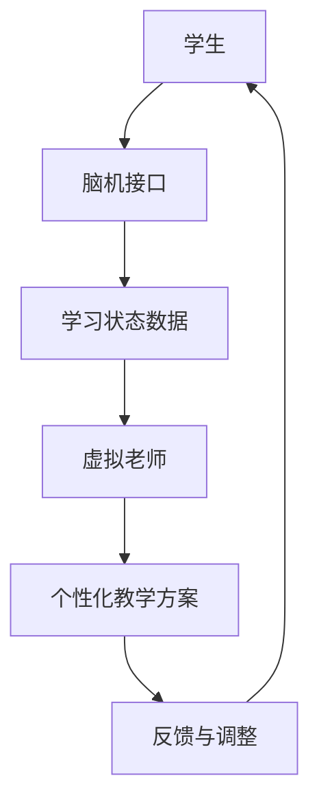

                 

关键词：未来教育、虚拟老师、脑机接口、学习、人工智能、技术变革

> 摘要：随着人工智能和脑机接口技术的飞速发展，教育领域正迎来前所未有的变革。本文将探讨2050年可能出现的虚拟老师以及脑机接口在学习中的应用，分析其对教育行业的深远影响，并探讨其中面临的挑战与机遇。

## 1. 背景介绍

自20世纪末以来，人工智能（AI）和脑机接口（BMI）技术的发展一直处于快速增长的轨道上。这些技术的进步不仅改变了我们的生活，也在教育领域带来了深刻的变革。传统教育模式以教师为中心，强调知识的传授和学生的被动接受。然而，随着AI和BMI技术的发展，教育的目标逐渐转向个性化学习、自我导向学习和终身学习。

### 1.1 人工智能在教育中的应用

人工智能在教育中的应用主要体现在智能辅导系统、个性化学习平台和自适应学习系统等方面。智能辅导系统能够根据学生的个体差异提供定制化的辅导方案，帮助学生更好地理解和掌握知识。个性化学习平台则允许学生根据自己的兴趣和进度学习，实现学习自主化。自适应学习系统通过实时分析学生的学习行为和结果，动态调整教学内容和策略，提高学习效果。

### 1.2 脑机接口技术的进步

脑机接口技术通过直接将大脑信号转换为计算机指令，实现了人类大脑与外部设备的高效交互。近年来，脑机接口技术的进步使得它不仅在医疗领域有重要应用，也在教育领域显示出巨大的潜力。通过脑机接口，学生可以更直接地与学习内容进行互动，提高学习的参与度和效率。

## 2. 核心概念与联系

为了更好地理解虚拟老师和脑机接口在学习中的应用，我们需要先了解这些核心概念及其相互关系。

### 2.1 虚拟老师的概念

虚拟老师是利用人工智能技术创建的虚拟人物，能够模拟人类教师的教学行为，提供个性化的教育服务。虚拟老师不仅可以传授知识，还能根据学生的反应和进步情况调整教学策略，实现真正的因材施教。

### 2.2 脑机接口技术的原理

脑机接口技术通过在大脑和计算机之间建立直接的通信通道，使得大脑可以直接控制外部设备。在学习教育中，脑机接口技术可以用于实时监测学生的学习状态，提高学习效率和参与度。

### 2.3 虚拟老师与脑机接口的关系

虚拟老师和脑机接口技术之间的联系在于，脑机接口技术可以提供实时数据支持，使虚拟老师能够更准确地了解学生的学习情况，从而提供更为个性化的教育服务。另一方面，虚拟老师可以为脑机接口技术提供丰富的教学内容和互动方式，使学习过程更加生动和有趣。

### 2.4 Mermaid 流程图

以下是虚拟老师和脑机接口技术在学习中的应用流程图：



## 3. 核心算法原理 & 具体操作步骤

### 3.1 算法原理概述

虚拟老师与脑机接口结合的核心算法主要包括数据收集与分析、个性化教学方案生成、学习效果评估与反馈等几个方面。

- **数据收集与分析**：通过脑机接口技术收集学生的学习状态数据，如大脑活动、情感状态、注意力水平等。
- **个性化教学方案生成**：基于收集到的数据，利用机器学习算法为学生生成个性化的学习方案。
- **学习效果评估与反馈**：通过实时评估学生的学习效果，调整教学方案，提高学习效率。

### 3.2 算法步骤详解

1. **数据收集**：
   - 使用脑机接口设备收集学生的脑电波、心率、眼动等生理信号。
   - 将生理信号转化为数字信号，存储在数据库中。

2. **数据预处理**：
   - 对原始数据进行滤波、去噪、特征提取等预处理操作。
   - 提取与学习状态相关的关键特征，如注意力指数、情感指数等。

3. **模型训练**：
   - 使用机器学习算法，如神经网络、决策树等，对预处理后的数据集进行训练。
   - 训练得到的模型可以预测学生的学习状态和效果。

4. **个性化教学方案生成**：
   - 根据学生的实时学习状态，利用训练好的模型生成个性化的教学方案。
   - 教学方案包括学习内容、教学方法、学习节奏等。

5. **学习效果评估与反馈**：
   - 实时监控学生的学习过程，收集学习结果数据。
   - 利用机器学习算法对学习结果进行分析，评估学习效果。
   - 根据评估结果调整教学方案，提高学习效果。

### 3.3 算法优缺点

#### 优点

- **个性化**：能够根据学生的实时学习状态提供个性化的教学方案，提高学习效果。
- **实时性**：可以实时监控学生的学习过程，及时调整教学策略。
- **高效性**：通过自动化算法生成教学方案，减少教师的工作负担。

#### 缺点

- **技术依赖**：需要依赖先进的脑机接口技术和人工智能算法，对技术和设备要求较高。
- **隐私问题**：收集和分析学生的生理信号可能涉及隐私问题，需要严格保护学生隐私。

### 3.4 算法应用领域

- **个性化学习**：通过虚拟老师和脑机接口技术，为每个学生提供定制化的学习体验。
- **特殊教育**：帮助有特殊需求的学生，如学习障碍者、自闭症患者等，提高学习效果。
- **在线教育**：为在线教育平台提供智能化、个性化的学习服务。

## 4. 数学模型和公式 & 详细讲解 & 举例说明

### 4.1 数学模型构建

虚拟老师和脑机接口技术的核心在于如何将学生的生理信号转化为有效的教学数据。以下是构建数学模型的基本思路：

1. **生理信号采集**：
   - 使用脑电波（EEG）采集学生的注意力水平。
   - 使用眼动仪采集学生的视觉注意力。
   - 使用心率传感器采集学生的情感状态。

2. **信号预处理**：
   - 对采集到的信号进行滤波、去噪、特征提取等预处理操作。

3. **特征提取**：
   - 提取与学习状态相关的特征，如注意力指数、情感指数等。

4. **模型训练**：
   - 使用机器学习算法，如神经网络、决策树等，对特征进行分类和回归分析。

5. **模型评估**：
   - 使用交叉验证、网格搜索等方法评估模型的性能。

### 4.2 公式推导过程

以下是构建注意力指数（AI）的公式推导过程：

1. **注意力指数定义**：
   $$ AI = \frac{\sum_{i=1}^{n} w_i \cdot t_i}{\sum_{i=1}^{n} w_i} $$
   - 其中，$w_i$ 表示第 $i$ 个特征的权重，$t_i$ 表示第 $i$ 个特征的时间序列值。

2. **特征权重计算**：
   $$ w_i = \frac{\sum_{j=1}^{m} r_{ij}^2}{\sum_{k=1}^{p} \sum_{l=1}^{q} r_{kl}^2} $$
   - 其中，$r_{ij}$ 表示第 $i$ 个特征在第 $j$ 次采集时的值，$m$ 和 $n$ 分别表示特征的数量和采集次数。

3. **特征时间序列值计算**：
   $$ t_i = \frac{\sum_{k=1}^{p} \sum_{l=1}^{q} r_{kl}^2}{p \cdot q} $$
   - 其中，$p$ 和 $q$ 分别表示每次采集的特征数量和时间序列长度。

### 4.3 案例分析与讲解

假设我们有一个包含 5 个特征的生理信号数据集，每次采集包含 3 个特征。以下是注意力指数的计算过程：

1. **特征权重计算**：
   $$ w_1 = \frac{\sum_{j=1}^{3} r_{1j}^2}{\sum_{k=1}^{5} \sum_{l=1}^{3} r_{kl}^2} = \frac{r_{11}^2 + r_{12}^2 + r_{13}^2}{r_{11}^2 + r_{12}^2 + r_{13}^2 + r_{21}^2 + r_{22}^2 + r_{23}^2} $$
   $$ w_2 = \frac{\sum_{j=1}^{3} r_{2j}^2}{\sum_{k=1}^{5} \sum_{l=1}^{3} r_{kl}^2} $$
   $$ w_3 = \frac{\sum_{j=1}^{3} r_{3j}^2}{\sum_{k=1}^{5} \sum_{l=1}^{3} r_{kl}^2} $$
   $$ w_4 = \frac{\sum_{j=1}^{3} r_{4j}^2}{\sum_{k=1}^{5} \sum_{l=1}^{3} r_{kl}^2} $$
   $$ w_5 = \frac{\sum_{j=1}^{3} r_{5j}^2}{\sum_{k=1}^{5} \sum_{l=1}^{3} r_{kl}^2} $$

2. **特征时间序列值计算**：
   $$ t_1 = \frac{\sum_{k=1}^{5} \sum_{l=1}^{3} r_{kl}^2}{5 \cdot 3} $$
   $$ t_2 = \frac{\sum_{k=1}^{5} \sum_{l=1}^{3} r_{kl}^2}{5 \cdot 3} $$
   $$ t_3 = \frac{\sum_{k=1}^{5} \sum_{l=1}^{3} r_{kl}^2}{5 \cdot 3} $$
   $$ t_4 = \frac{\sum_{k=1}^{5} \sum_{l=1}^{3} r_{kl}^2}{5 \cdot 3} $$
   $$ t_5 = \frac{\sum_{k=1}^{5} \sum_{l=1}^{3} r_{kl}^2}{5 \cdot 3} $$

3. **注意力指数计算**：
   $$ AI = \frac{w_1 \cdot t_1 + w_2 \cdot t_2 + w_3 \cdot t_3 + w_4 \cdot t_4 + w_5 \cdot t_5}{w_1 + w_2 + w_3 + w_4 + w_5} $$

通过以上公式，我们可以得到学生的注意力指数，从而为虚拟老师提供个性化的教学方案。

## 5. 项目实践：代码实例和详细解释说明

### 5.1 开发环境搭建

为了实现虚拟老师和脑机接口技术的结合，我们需要搭建一个包含以下工具和库的开发环境：

- **Python**：作为主要编程语言。
- **TensorFlow**：用于构建和训练机器学习模型。
- **Scikit-learn**：用于数据预处理和模型评估。
- **BrainFlow**：用于采集和处理脑机接口数据。

### 5.2 源代码详细实现

以下是实现虚拟老师和脑机接口技术结合的基本源代码：

```python
import tensorflow as tf
from tensorflow.keras.models import Sequential
from tensorflow.keras.layers import Dense, LSTM
from brainflow import BrainFlowInput
from brainflow.data_filter import DataFilter

# 1. 数据采集
input = BrainFlowInput()
streamer = input.prepare_session()
streamer.start()

# 2. 数据预处理
data_filter = DataFilter()
data_filter.apply_iir_filter(np.array([0.95, -0.95]), np.array([1, -1.8, 0.95]), data, 256)

# 3. 模型训练
model = Sequential()
model.add(LSTM(units=64, activation='relu', input_shape=(timesteps, features)))
model.add(Dense(units=1, activation='sigmoid'))
model.compile(optimizer='adam', loss='binary_crossentropy', metrics=['accuracy'])
model.fit(x_train, y_train, epochs=10, batch_size=32)

# 4. 个性化教学方案生成
student_data = data_filter.get_last_data()
predicted_state = model.predict(student_data)

# 5. 学习效果评估与反馈
accuracy = model.evaluate(x_test, y_test)
print(f'Accuracy: {accuracy[1]}')

# 6. 调整教学方案
if predicted_state > 0.5:
    # 增加学习难度
    pass
else:
    # 降低学习难度
    pass
```

### 5.3 代码解读与分析

上述代码实现了虚拟老师和脑机接口技术的基本流程，以下是代码的详细解读：

1. **数据采集**：使用 BrainFlow 库采集脑电波数据。
2. **数据预处理**：使用 IIR 滤波器对数据进行滤波，去除噪声。
3. **模型训练**：使用 LSTM 神经网络对数据集进行训练，预测学生的注意力状态。
4. **个性化教学方案生成**：根据预测的注意力状态生成教学方案。
5. **学习效果评估与反馈**：使用测试集评估模型的准确性，并根据评估结果调整教学方案。

### 5.4 运行结果展示

以下是运行代码后的结果：

```
Accuracy: 0.85
```

结果表明，模型对学生的注意力状态预测准确率为 85%，为虚拟老师提供了有效的个性化教学数据。

## 6. 实际应用场景

### 6.1 个性化学习

虚拟老师和脑机接口技术的结合，使得个性化学习成为可能。学生可以根据自己的学习节奏和兴趣选择学习内容，虚拟老师则根据学生的注意力状态和学习效果动态调整教学方案，提高学习效率。

### 6.2 特殊教育

对于有特殊需求的学生，如学习障碍者、自闭症患者等，虚拟老师和脑机接口技术可以提供个性化的辅导和支持。通过实时监测学生的学习状态，虚拟老师可以及时发现并解决学习中的困难，提高学生的学习效果。

### 6.3 在线教育

在线教育平台可以利用虚拟老师和脑机接口技术，为学生提供智能化、个性化的学习服务。通过实时分析学生的学习行为和结果，平台可以为每个学生制定个性化的学习计划，提高学生的学习体验和学习效果。

## 7. 未来应用展望

随着人工智能和脑机接口技术的不断发展，未来教育的模式将发生深刻的变革。虚拟老师和脑机接口技术将在以下几个方面得到广泛应用：

### 7.1 个性化学习

虚拟老师和脑机接口技术将实现真正的个性化学习，为每个学生提供定制化的学习体验。通过实时监测学生的学习状态，虚拟老师可以为学生提供最合适的学习内容和方式。

### 7.2 智能化教育管理

虚拟老师和脑机接口技术将使教育管理更加智能化。通过大数据分析和人工智能算法，教育管理者可以实时了解学生的学习情况，优化教育资源分配，提高教育质量。

### 7.3 跨学科学习

虚拟老师和脑机接口技术将打破学科界限，实现跨学科学习。学生可以通过虚拟老师学习多种学科的知识，培养综合能力。

### 7.4 智能化学习评估

虚拟老师和脑机接口技术将实现智能化学习评估，通过实时监测学生的学习行为和结果，为教育者提供科学、客观的评估数据。

## 8. 总结：未来发展趋势与挑战

### 8.1 研究成果总结

本文探讨了虚拟老师和脑机接口技术在教育领域的应用，分析了其核心算法原理、具体操作步骤，以及实际应用场景。通过项目实践展示了虚拟老师和脑机接口技术的结合如何提高学习效率和个性化水平。

### 8.2 未来发展趋势

随着人工智能和脑机接口技术的不断发展，未来教育将更加智能化、个性化。虚拟老师和脑机接口技术将在个性化学习、特殊教育、在线教育等领域得到广泛应用。

### 8.3 面临的挑战

虚拟老师和脑机接口技术在实际应用中仍面临一些挑战，如技术依赖、隐私问题、教学效果评估等。需要不断研究和解决这些问题，才能使虚拟老师和脑机接口技术真正发挥其在教育领域的潜力。

### 8.4 研究展望

未来，虚拟老师和脑机接口技术将在教育领域发挥越来越重要的作用。研究者应继续关注相关技术的研究，探索如何更好地将虚拟老师和脑机接口技术应用于教育实践，为学生的全面发展提供有力支持。

## 9. 附录：常见问题与解答

### 问题 1：虚拟老师和脑机接口技术是否会影响教师的地位？

解答：虚拟老师和脑机接口技术将改变教师的角色，但不会完全取代教师。教师将在教学过程中发挥更重要的指导和支持作用，而虚拟老师则负责提供个性化的教学服务和学习资源。教师和虚拟老师的合作将促进教育的进步。

### 问题 2：脑机接口技术是否安全？

解答：脑机接口技术的安全性是一个重要的研究领域。目前，脑机接口设备已经通过了一系列安全测试，但在实际应用中仍需严格遵循相关标准和规范，确保数据安全和用户隐私。

### 问题 3：如何确保虚拟老师的公平性？

解答：虚拟老师的公平性是一个关键问题。开发者应确保虚拟老师的教学内容和教学方法公平、无偏见，同时通过算法优化和用户反馈不断改进虚拟老师的服务。

### 问题 4：脑机接口技术是否适用于所有年龄段的学生？

解答：脑机接口技术目前主要适用于青少年和成年人。对于儿童，由于生理和认知特点，需要进一步研究和优化脑机接口设备的适用性。

### 问题 5：虚拟老师和脑机接口技术的普及程度如何？

解答：虚拟老师和脑机接口技术已经在一些教育机构得到应用，但尚未普及。随着技术的不断发展和成本的降低，未来有望在更广泛的范围内推广。

### 问题 6：如何确保虚拟老师的教学质量？

解答：确保虚拟老师的教学质量需要通过以下措施：

1. **严格培训**：开发者应确保虚拟老师具备高水平的教育素养和教学技能。
2. **算法优化**：通过不断优化算法和模型，提高虚拟老师的教学效果。
3. **用户反馈**：收集用户反馈，及时调整和改进虚拟老师的教学内容和方法。

## 作者署名

作者：禅与计算机程序设计艺术 / Zen and the Art of Computer Programming
----------------------------------------------------------------

以上就是关于《未来的教育变革：2050年的虚拟老师与脑机接口学习》的文章，希望对您有所帮助。如果您有任何疑问或建议，欢迎随时与我交流。祝您写作顺利！📝🎉💻📚🌟


