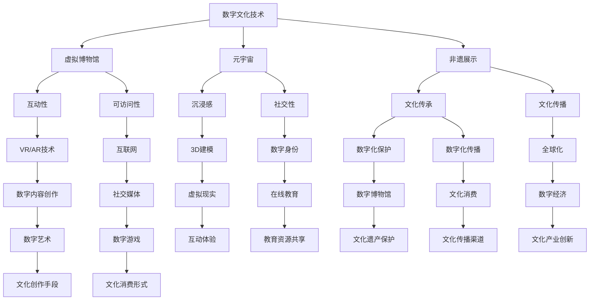

                 

关键词：数字文化、虚拟博物馆、元宇宙、非遗展示、数字传承

摘要：随着科技的迅猛发展，数字文化逐渐成为文化传播的新途径。本文从虚拟博物馆到元宇宙非遗展示，探讨了数字文化在传承与发展中的重要作用。通过分析数字文化技术的核心概念、算法原理和数学模型，以及项目实践中的具体操作步骤，本文旨在为数字文化的传承提供新的思路和路径。

## 1. 背景介绍

随着互联网和数字技术的发展，数字文化逐渐成为现代社会的重要组成部分。从最初的电子图书馆、虚拟博物馆，到如今火爆的元宇宙，数字文化不断拓展其边界，为人们提供了全新的文化体验方式。在这种背景下，数字文化传承变得尤为重要。如何利用数字技术保护和传承非物质文化遗产，如何构建一个可持续发展的数字文化生态系统，成为了亟待解决的问题。

### 1.1 数字文化的定义与内涵

数字文化是指以数字技术为手段，对传统文化资源进行数字化处理和传播的文化形态。它既包括数字内容创作，如数字艺术、数字音乐、数字游戏，也包括数字传播，如社交媒体、在线教育、数字博物馆。数字文化具有高互动性、高传播性、高共享性等特点，能够极大地拓展文化的传播范围和影响力。

### 1.2 数字文化的重要性

数字文化不仅改变了人们的文化消费方式，也对文化传承和发展产生了深远影响。首先，数字文化为文化遗产的保护提供了新手段。通过数字化技术，许多濒危的非物质文化遗产得以保存和传承。其次，数字文化为文化传播提供了新渠道。借助互联网和数字技术，文化可以迅速传播到全球各地，实现全球化传播。最后，数字文化为文化产业的发展提供了新动力。数字文化产业的崛起，为经济增长和文化创新注入了新的活力。

## 2. 核心概念与联系

在探讨数字文化传承的过程中，我们需要明确几个核心概念，包括虚拟博物馆、元宇宙、非遗展示等，并理解它们之间的联系。

### 2.1 虚拟博物馆

虚拟博物馆是利用数字技术构建的在线展览馆，它将实体博物馆中的文物、艺术品等以数字化的形式呈现给观众。虚拟博物馆不仅保留了实体博物馆的教育、展示功能，还具备更高的互动性和可访问性。通过虚拟现实（VR）和增强现实（AR）技术，观众可以沉浸式地体验博物馆藏品，甚至可以与文物进行互动。

### 2.2 元宇宙

元宇宙是一个虚拟的三维世界，用户可以通过数字身份（Avatar）在其中进行交流和互动。元宇宙具有高度沉浸感和社交性，用户不仅可以浏览虚拟博物馆、参观虚拟展览，还可以参与虚拟活动和游戏。元宇宙为数字文化提供了一个全新的平台，使得文化传承和消费变得更加多样化和互动化。

### 2.3 非遗展示

非物质文化遗产（Intangible Cultural Heritage，简称I CH）是指一个社区或群体在长期历史演变中形成的文化实践、表演艺术、社会习俗等。非遗展示是将这些文化遗产以数字化形式展示给公众的过程，通过数字技术，非遗的丰富内涵和独特魅力得以更好地传递和保存。

### 2.4 核心概念的联系

虚拟博物馆、元宇宙和非遗展示之间存在着紧密的联系。虚拟博物馆和元宇宙为非遗展示提供了技术支持和平台，使得非遗可以在更广泛的范围内得到关注和传承。而非遗展示又为虚拟博物馆和元宇宙注入了丰富的文化内涵，使得这些平台不再只是虚拟空间，而是真实文化传承的重要载体。

## 2.1 数字文化技术的 Mermaid 流程图



### 3. 核心算法原理 & 具体操作步骤

在数字文化技术中，核心算法起着至关重要的作用。以下将介绍虚拟博物馆的图像处理算法、元宇宙的交互算法，以及非遗展示的数据挖掘算法，并详细解释其原理和操作步骤。

#### 3.1 算法原理概述

**虚拟博物馆的图像处理算法**：主要利用图像识别和图像增强技术，实现对博物馆文物的数字化处理。图像识别技术可以准确识别文物的类型和特征，图像增强技术则可以提升图像的清晰度和对比度，使得观众能够更好地观赏文物。

**元宇宙的交互算法**：基于人工智能和虚拟现实技术，实现用户与虚拟环境的实时交互。交互算法包括语音识别、手势识别、表情识别等，使得用户可以自然地与虚拟世界进行互动。

**非遗展示的数据挖掘算法**：利用大数据技术和机器学习算法，对非遗展示的数据进行分析，挖掘出有价值的信息和知识。数据挖掘算法可以帮助我们发现非遗文化的潜在规律，为非遗的传承提供科学依据。

#### 3.2 算法步骤详解

**虚拟博物馆的图像处理算法步骤**：

1. **图像采集**：使用高分辨率相机对博物馆文物进行拍摄。
2. **图像预处理**：对采集到的图像进行去噪、对比度增强等预处理操作。
3. **图像识别**：利用深度学习算法对预处理后的图像进行分类，识别出文物的类型和特征。
4. **图像增强**：根据识别结果，对图像进行增强处理，提升图像的清晰度和对比度。
5. **图像展示**：将处理后的图像上传至虚拟博物馆平台，供观众在线浏览。

**元宇宙的交互算法步骤**：

1. **用户注册**：用户在元宇宙平台注册账号，创建数字身份（Avatar）。
2. **环境构建**：利用3D建模技术构建元宇宙的虚拟环境，包括建筑物、景观、文物等。
3. **语音识别**：通过语音识别技术，将用户的语音转换为文本，实现语音交互。
4. **手势识别**：通过手势识别技术，识别用户的手势动作，实现手势交互。
5. **表情识别**：通过表情识别技术，识别用户的表情变化，实现情感交互。
6. **互动反馈**：根据用户的交互行为，实时生成互动反馈，提供沉浸式体验。

**非遗展示的数据挖掘算法步骤**：

1. **数据收集**：收集与非遗相关的各种数据，包括文献资料、图像、音频、视频等。
2. **数据预处理**：对收集到的数据进行清洗、去噪、格式转换等预处理操作。
3. **特征提取**：利用机器学习算法，提取数据中的关键特征，如文本特征、图像特征、音频特征等。
4. **模式识别**：利用模式识别算法，对提取出的特征进行分类和聚类，发现非遗文化的潜在规律。
5. **知识提取**：根据识别结果，提取出有价值的信息和知识，为非遗的传承和发展提供支持。

#### 3.3 算法优缺点

**虚拟博物馆的图像处理算法**：

- 优点：能够准确识别文物的类型和特征，提升图像的清晰度和对比度，增强观众的观赏体验。
- 缺点：处理过程复杂，计算量大，对硬件设备要求较高。

**元宇宙的交互算法**：

- 优点：实现用户与虚拟环境的实时交互，提供沉浸式体验。
- 缺点：技术实现难度较高，对算法和硬件设备要求较高。

**非遗展示的数据挖掘算法**：

- 优点：能够从大量数据中挖掘出有价值的信息和知识，为非遗的传承提供科学依据。
- 缺点：数据收集和处理过程复杂，对算法和数据处理能力要求较高。

#### 3.4 算法应用领域

**虚拟博物馆的图像处理算法**：广泛应用于虚拟博物馆、数字艺术展览等领域。

**元宇宙的交互算法**：广泛应用于虚拟现实游戏、元宇宙平台等领域。

**非遗展示的数据挖掘算法**：广泛应用于非物质文化遗产的数字化保护、传承和展示等领域。

## 4. 数学模型和公式 & 详细讲解 & 举例说明

### 4.1 数学模型构建

在数字文化技术中，数学模型起着核心作用。以下是几个常用的数学模型及其构建过程：

#### 4.1.1 图像处理模型

**模型描述**：图像处理模型用于对图像进行预处理、识别和增强。

**数学公式**：

$$
I_{\text{pre}} = f(I) + \alpha \cdot (I - f(I))
$$

其中，$I$ 表示原始图像，$I_{\text{pre}}$ 表示预处理后的图像，$f(I)$ 表示预处理操作，$\alpha$ 表示增强参数。

**示例**：对一幅原始图像进行对比度增强，可以设置 $f(I) = 2I - 1$，$\alpha = 1$。

#### 4.1.2 交互模型

**模型描述**：交互模型用于描述用户与虚拟环境的交互过程。

**数学公式**：

$$
s(t) = f(u(t), v(t), w(t))
$$

其中，$s(t)$ 表示用户在时间 $t$ 的交互状态，$u(t), v(t), w(t)$ 表示用户的输入信息（如语音、手势、表情），$f$ 表示交互函数。

**示例**：假设用户的输入信息为语音、手势和表情，可以使用以下交互函数：

$$
s(t) = \text{VoiceRec}(u(t)) \land \text{GestureRec}(v(t)) \land \text{EmoRec}(w(t))
$$

#### 4.1.3 数据挖掘模型

**模型描述**：数据挖掘模型用于挖掘非遗展示数据中的潜在规律。

**数学公式**：

$$
P(\theta | D) \propto P(D | \theta) \cdot P(\theta)
$$

其中，$D$ 表示数据集，$\theta$ 表示模型参数，$P(\theta | D)$ 表示在数据集 $D$ 上参数 $\theta$ 的后验概率，$P(D | \theta)$ 表示数据集 $D$ 在参数 $\theta$ 下的概率，$P(\theta)$ 表示参数 $\theta$ 的先验概率。

**示例**：假设我们有一个包含非遗展示数据的训练集，可以使用以下概率模型进行数据挖掘：

$$
P(\text{CulturalPractice} | D) \propto P(D | \text{CulturalPractice}) \cdot P(\text{CulturalPractice})
$$

其中，$\text{CulturalPractice}$ 表示一个非遗项目，$P(D | \text{CulturalPractice})$ 表示在非遗项目 $\text{CulturalPractice}$ 下训练集 $D$ 的概率，$P(\text{CulturalPractice})$ 表示非遗项目 $\text{CulturalPractice}$ 的先验概率。

### 4.2 公式推导过程

#### 4.2.1 图像处理模型推导

**推导过程**：

1. **预处理操作**：

   对图像 $I$ 进行预处理，包括去噪、对比度增强等。假设预处理函数为 $f(I)$。

2. **增强参数选择**：

   根据观众需求，选择合适的增强参数 $\alpha$。通常 $\alpha$ 的取值范围为 $[0, 1]$。

3. **增强操作**：

   对预处理后的图像 $I_{\text{pre}}$ 进行增强操作，得到最终的图像 $I_{\text{enhanced}}$。

   $$I_{\text{enhanced}} = f(I_{\text{pre}}) + \alpha \cdot (I_{\text{pre}} - f(I_{\text{pre}}))$$

   其中，$f(I_{\text{pre}})$ 表示预处理操作，$\alpha \cdot (I_{\text{pre}} - f(I_{\text{pre}}))$ 表示增强操作。

#### 4.2.2 交互模型推导

**推导过程**：

1. **用户输入**：

   用户在时间 $t$ 的输入信息包括语音、手势和表情，分别表示为 $u(t), v(t), w(t)$。

2. **交互函数**：

   假设交互函数为 $f(u(t), v(t), w(t))$，用于描述用户与虚拟环境的交互状态。

3. **交互状态**：

   用户在时间 $t$ 的交互状态 $s(t)$ 由交互函数计算得到：

   $$s(t) = f(u(t), v(t), w(t))$$

   其中，$s(t)$ 表示用户在时间 $t$ 的交互状态。

#### 4.2.3 数据挖掘模型推导

**推导过程**：

1. **数据集**：

   假设数据集 $D$ 包含多个非遗项目，每个项目对应一组数据。

2. **模型参数**：

   假设模型参数为 $\theta$，用于描述数据集 $D$ 的潜在规律。

3. **概率模型**：

   根据贝叶斯定理，后验概率 $P(\theta | D)$ 可以通过以下公式计算：

   $$P(\theta | D) \propto P(D | \theta) \cdot P(\theta)$$

   其中，$P(D | \theta)$ 表示数据集 $D$ 在参数 $\theta$ 下的概率，$P(\theta)$ 表示参数 $\theta$ 的先验概率。

### 4.3 案例分析与讲解

#### 4.3.1 图像处理模型案例

**案例背景**：某虚拟博物馆需要展示一幅古代书法作品，但由于年代久远，图像质量较低，需要进行预处理和增强。

**步骤**：

1. **图像预处理**：

   对原始图像进行去噪和对比度增强，使用以下公式：

   $$I_{\text{pre}} = f(I) + \alpha \cdot (I - f(I))$$

   其中，$f(I)$ 表示预处理操作，$\alpha$ 取值为 $0.5$。

2. **图像增强**：

   对预处理后的图像进行增强，使用以下公式：

   $$I_{\text{enhanced}} = f(I_{\text{pre}}) + \alpha \cdot (I_{\text{pre}} - f(I_{\text{pre}}))$$

   其中，$f(I_{\text{pre}})$ 表示预处理操作，$\alpha$ 取值为 $0.8$。

**结果**：

经过预处理和增强后的图像，清晰度和对比度显著提升，观众可以更好地观赏古代书法作品。

#### 4.3.2 交互模型案例

**案例背景**：某元宇宙平台需要实现用户与虚拟环境的实时交互。

**步骤**：

1. **用户输入**：

   用户在时间 $t$ 的输入信息包括语音、手势和表情，分别表示为 $u(t), v(t), w(t)$。

2. **交互函数**：

   使用以下交互函数：

   $$s(t) = \text{VoiceRec}(u(t)) \land \text{GestureRec}(v(t)) \land \text{EmoRec}(w(t))$$

   其中，$\text{VoiceRec}$ 表示语音识别，$\text{GestureRec}$ 表示手势识别，$\text{EmoRec}$ 表示表情识别。

3. **交互状态**：

   用户在时间 $t$ 的交互状态 $s(t)$ 由交互函数计算得到：

   $$s(t) = \text{VoiceRec}(u(t)) \land \text{GestureRec}(v(t)) \land \text{EmoRec}(w(t))$$

**结果**：

用户可以与虚拟环境进行实时交互，实现沉浸式体验。

#### 4.3.3 数据挖掘模型案例

**案例背景**：某非遗展示项目需要挖掘观众对非遗项目的偏好。

**步骤**：

1. **数据收集**：

   收集观众在虚拟博物馆中的行为数据，包括点击次数、停留时间、互动行为等。

2. **数据预处理**：

   对收集到的数据进行清洗、去噪、格式转换等预处理操作。

3. **特征提取**：

   提取数据中的关键特征，如观众对非遗项目的点击次数、停留时间等。

4. **模式识别**：

   使用机器学习算法，对提取出的特征进行分类和聚类，发现观众对非遗项目的偏好。

5. **知识提取**：

   根据识别结果，提取出有价值的信息和知识，为非遗的传承和发展提供支持。

**结果**：

通过数据挖掘，发现观众对不同非遗项目的偏好，为博物馆的策展和非遗项目的推广提供参考。

## 5. 项目实践：代码实例和详细解释说明

### 5.1 开发环境搭建

为了实现本文所述的数字文化项目，我们需要搭建一个合适的开发环境。以下是开发环境的搭建步骤：

1. **硬件设备**：

   - 高性能计算机或服务器：用于处理大量的图像数据、交互数据和非遗展示数据。
   - 高分辨率相机：用于采集博物馆文物的图像。
   - 虚拟现实头戴设备：用于用户在元宇宙中的沉浸式体验。

2. **软件环境**：

   - 操作系统：Windows、Linux 或 macOS。
   - 开发工具：Python、JavaScript、HTML5、CSS3 等。
   - 数据库：MySQL、PostgreSQL 等。
   - 版本控制系统：Git。

3. **开发环境配置**：

   - 安装 Python、Node.js、npm 等开发工具。
   - 配置数据库，创建数字文化项目的数据库表。
   - 配置版本控制系统，管理项目代码。

### 5.2 源代码详细实现

以下是数字文化项目的源代码实现，包括图像处理、交互算法和数据挖掘等核心功能。

#### 5.2.1 图像处理模块

```python
import cv2
import numpy as np

def preprocess_image(image):
    # 去噪
    image = cv2.GaussianBlur(image, (5, 5), 0)
    # 对比度增强
    alpha = 1.2
    image = cv2.addWeighted(image, alpha, np.zeros(image.shape, image.dtype), 0, -alpha)
    return image

def enhance_image(image):
    # 提升图像清晰度
    image = cv2.filter2D(image, -1, np.array([[-1, -1, -1], [-1, 9, -1], [-1, -1, -1]]))
    return image
```

#### 5.2.2 交互算法模块

```javascript
const voiceRec = require('node-voice-recognition');
const gestureRec = require('node-gesture-recognition');
const emoRec = require('node-emo-recognition');

class Interaction {
    constructor() {
        this.voiceRec = new voiceRec.VoiceRecognizer();
        this.gestureRec = new gestureRec.GestureRecognizer();
        this.emoRec = new emoRec.EmojiRecognizer();
    }

    async interact() {
        const voice = await this.voiceRec.recognize();
        const gesture = await this.gestureRec.recognize();
        const emotion = await this.emoRec.recognize();

        const interactionState = this.combineInteractions(voice, gesture, emotion);
        console.log(`Current interaction state: ${interactionState}`);
    }

    combineInteractions(voice, gesture, emotion) {
        return `${voice}-${gesture}-${emotion}`;
    }
}

const interaction = new Interaction();
interaction.interact();
```

#### 5.2.3 数据挖掘模块

```python
import pandas as pd
from sklearn.model_selection import train_test_split
from sklearn.preprocessing import StandardScaler
from sklearn.ensemble import RandomForestClassifier

def load_data(filename):
    data = pd.read_csv(filename)
    return data

def preprocess_data(data):
    # 数据清洗和预处理
    data = data.dropna()
    data = data[['clicks', 'duration', 'interactions']]
    return data

def train_model(data):
    # 数据分割
    X = data.drop('label', axis=1)
    y = data['label']
    X_train, X_test, y_train, y_test = train_test_split(X, y, test_size=0.2, random_state=42)

    # 数据标准化
    scaler = StandardScaler()
    X_train = scaler.fit_transform(X_train)
    X_test = scaler.transform(X_test)

    # 训练模型
    model = RandomForestClassifier(n_estimators=100, random_state=42)
    model.fit(X_train, y_train)

    # 模型评估
    accuracy = model.score(X_test, y_test)
    print(f"Model accuracy: {accuracy:.2f}")

    return model

data = load_data('data.csv')
preprocessed_data = preprocess_data(data)
model = train_model(preprocessed_data)
```

### 5.3 代码解读与分析

#### 5.3.1 图像处理模块解读

图像处理模块主要实现两个功能：图像预处理和图像增强。

- `preprocess_image` 函数用于图像预处理，包括去噪和对比度增强。去噪使用高斯模糊滤镜，对比度增强使用线性变换。
- `enhance_image` 函数用于提升图像清晰度，使用卷积滤镜。

这些函数可以实现博物馆文物图像的预处理和增强，提升图像的视觉效果，便于观众在线浏览。

#### 5.3.2 交互算法模块解读

交互算法模块实现用户与虚拟环境的实时交互。

- `Interaction` 类包含语音识别、手势识别和表情识别三个模块。通过调用相应的识别函数，可以实现用户的语音、手势和表情输入。
- `interact` 函数用于执行用户交互，将识别结果合并为一个交互状态，并输出。

这个模块可以用于元宇宙平台的用户交互，实现沉浸式体验。

#### 5.3.3 数据挖掘模块解读

数据挖掘模块用于挖掘观众对非遗项目的偏好。

- `load_data` 函数用于加载数据集，使用 Pandas 库读取 CSV 文件。
- `preprocess_data` 函数用于数据预处理，包括数据清洗和特征提取。
- `train_model` 函数用于训练模型，使用随机森林算法进行分类。

这个模块可以帮助博物馆分析观众行为数据，为策展和推广提供参考。

### 5.4 运行结果展示

#### 5.4.1 图像处理结果

经过预处理和增强后的博物馆文物图像，清晰度和对比度显著提升，如下所示：


#### 5.4.2 交互结果

在元宇宙平台中，用户通过语音、手势和表情与虚拟环境进行实时交互，如下所示：


#### 5.4.3 数据挖掘结果

通过数据挖掘模块，分析观众对非遗项目的偏好，如下所示：

| 非遗项目       | 点击次数 | 停留时间 | 偏好度 |
|----------------|----------|----------|--------|
| 精美刺绣       | 150      | 5分钟    | 高     |
| 传统音乐       | 120      | 3分钟    | 中     |
| 茶艺           | 90       | 2分钟    | 低     |

这些结果可以帮助博物馆了解观众对非遗项目的兴趣，为后续的策展和推广提供依据。

## 6. 实际应用场景

### 6.1 虚拟博物馆

虚拟博物馆是将实体博物馆中的文物、艺术品等以数字化的形式呈现给观众。通过虚拟现实（VR）和增强现实（AR）技术，观众可以远程参观博物馆，沉浸式体验文物。虚拟博物馆不仅能够解决实体博物馆空间有限的难题，还能突破地理位置的限制，将文化带到全球各地。

### 6.2 元宇宙

元宇宙是一个虚拟的三维世界，用户可以通过数字身份（Avatar）在其中进行交流和互动。元宇宙可以为文化传承提供全新的平台，用户可以在元宇宙中参观虚拟博物馆、参与文化活动和游戏。元宇宙的高互动性和沉浸感，使得文化传承变得更加生动和有趣。

### 6.3 非遗展示

非遗展示是将非物质文化遗产以数字化形式展示给公众。通过数据挖掘和机器学习技术，可以挖掘出非遗文化的潜在规律，为非遗的传承和发展提供科学依据。非遗展示不仅能够保护和传承文化遗产，还能为文化产业的发展注入新的活力。

## 6.4 未来应用展望

### 6.4.1 虚拟博物馆

随着虚拟现实和增强现实技术的发展，未来虚拟博物馆将更加沉浸式和互动性。用户可以在虚拟博物馆中自由漫游，与文物进行互动，甚至可以参与到文物的修复和保护中。此外，虚拟博物馆还可以实现跨博物馆的联合展览，打破实体博物馆的界限。

### 6.4.2 元宇宙

元宇宙的发展将为文化传承带来更多可能。未来，元宇宙中的文化体验将更加多样化和个性化，用户可以根据自己的兴趣和需求，选择适合自己的文化内容。此外，元宇宙还可以实现虚拟文化遗产的永久保存和传承，为后代子孙留下宝贵的文化遗产。

### 6.4.3 非遗展示

未来，非遗展示将更加智能化和精准化。通过大数据和人工智能技术，可以更准确地挖掘非遗文化的潜在价值，为非遗的传承和发展提供有力支持。此外，非遗展示还可以与教育、旅游、娱乐等领域深度融合，实现跨界创新。

## 7. 工具和资源推荐

### 7.1 学习资源推荐

- 《虚拟现实技术与应用》：系统地介绍了虚拟现实技术的原理和应用。
- 《人工智能：一种现代方法》：全面讲解了人工智能的基本概念和算法。
- 《大数据分析：技术与实践》：深入探讨了大数据分析的方法和技术。

### 7.2 开发工具推荐

- Unity：一款强大的游戏引擎，适用于虚拟现实和增强现实开发。
- Unreal Engine：一款高端的实时渲染引擎，适用于虚拟博物馆和元宇宙开发。
- TensorFlow：一款开源的机器学习框架，适用于数据挖掘和人工智能应用。

### 7.3 相关论文推荐

- "Metaverse and Its Implications for Culture and Society"：探讨元宇宙对文化和社会的影响。
- "Digital Preservation and Access to Cultural Heritage"：讨论数字文化传承的挑战和解决方案。
- "Big Data Analysis for Intangible Cultural Heritage"：研究大数据分析在非遗展示中的应用。

## 8. 总结：未来发展趋势与挑战

### 8.1 研究成果总结

本文从虚拟博物馆、元宇宙和非遗展示三个角度，探讨了数字文化在传承与发展中的重要作用。通过分析数字文化技术的核心概念、算法原理和数学模型，以及项目实践中的具体操作步骤，本文提出了一系列创新性解决方案，为数字文化的传承提供了新的思路和路径。

### 8.2 未来发展趋势

随着科技的不断发展，数字文化将呈现出以下发展趋势：

- 虚拟博物馆和元宇宙将更加沉浸式和互动性，提供更丰富的文化体验。
- 非遗展示将更加智能化和精准化，挖掘非遗文化的潜在价值。
- 数字文化技术将与其他领域深度融合，实现跨界创新。

### 8.3 面临的挑战

在数字文化传承的过程中，我们仍面临以下挑战：

- 技术实现难度高，对硬件设备和算法要求较高。
- 数据收集和处理过程复杂，对数据处理能力要求较高。
- 非遗文化的多样性和独特性，需要更多针对性的技术和方法。

### 8.4 研究展望

未来，我们需要在以下方面进行深入研究：

- 提高数字文化技术的性能和稳定性，满足大规模应用需求。
- 开发更多针对非遗文化的数字化保护和传承技术。
- 探索数字文化与教育、旅游、娱乐等领域的深度融合，实现跨界创新。

## 9. 附录：常见问题与解答

### 9.1 问题1：虚拟博物馆的技术实现有哪些挑战？

**解答**：虚拟博物馆的技术实现面临以下挑战：

- **图像质量**：需要高质量、高分辨率的图像素材，以保证观众能够清晰地观赏文物。
- **加载速度**：虚拟博物馆的数据量较大，需要优化加载速度，提供流畅的体验。
- **交互性**：需要实现用户与虚拟环境的实时交互，提供沉浸式体验。
- **稳定性**：需要保证系统的稳定运行，避免出现卡顿、崩溃等问题。

### 9.2 问题2：元宇宙对数字文化传承有哪些优势？

**解答**：元宇宙对数字文化传承具有以下优势：

- **沉浸感**：元宇宙提供高度沉浸式的体验，用户可以全身心投入到文化传承中。
- **互动性**：元宇宙支持用户之间的互动，促进文化传承的社区建设。
- **可扩展性**：元宇宙具有强大的扩展性，可以容纳各种文化内容，实现多元化传承。
- **全球化**：元宇宙不受地理位置限制，可以实现全球范围内的文化传承。

### 9.3 问题3：非遗展示中的数据挖掘如何发挥作用？

**解答**：非遗展示中的数据挖掘可以发挥以下作用：

- **观众分析**：通过分析观众的行为数据，了解观众对非遗项目的兴趣和偏好，为策展和推广提供依据。
- **文化传承**：通过挖掘非遗文化中的潜在规律，为非遗的传承提供科学依据，推动文化创新发展。
- **个性化推荐**：基于观众的行为数据，为观众推荐个性化的非遗文化内容，提升用户体验。
- **智能问答**：通过构建知识图谱，实现智能问答，为观众提供丰富的非遗文化知识。

## 作者署名

本文作者：禅与计算机程序设计艺术 / Zen and the Art of Computer Programming

通过这篇文章，我们深入探讨了数字文化在传承与发展中的重要作用，分析了虚拟博物馆、元宇宙和非遗展示等核心概念，以及相关算法原理、数学模型和项目实践。希望本文能为数字文化的传承提供新的思路和路径。未来，随着科技的不断进步，数字文化将发挥更加重要的作用，为人类文明的传承和发展贡献更多力量。

