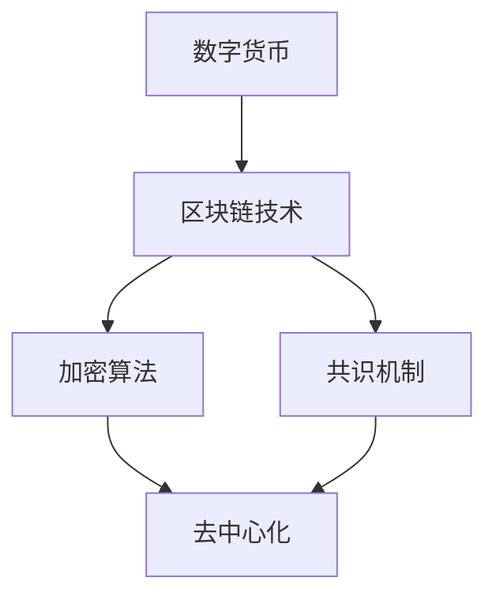

                 

关键词：数字货币、区块链、金融科技、加密货币、全球货币体系、金融变革

摘要：本文探讨了数字货币的崛起及其对全球货币体系带来的变革。通过分析数字货币的核心概念、技术原理和应用场景，本文揭示了数字货币如何改变金融行业，并对未来的发展进行了展望。

## 1. 背景介绍

随着互联网的普及和技术的进步，金融科技正以前所未有的速度发展。数字货币作为金融科技的一个重要分支，正逐步改变着全球货币体系的格局。传统货币体系面临诸多挑战，如通货膨胀、货币供应过剩、货币流通不便等问题。而数字货币的出现，为这些问题提供了一种潜在的解决方案。

数字货币是指通过密码学算法生成和管理的电子货币，它不依赖于任何中央机构或政府。区块链技术作为数字货币的底层技术，以其去中心化、不可篡改和透明度等特点，为金融行业的创新提供了广阔的空间。

## 2. 核心概念与联系

### 2.1 数字货币的概念

数字货币是一种基于密码学原理的电子货币，它通过去中心化的方式发行和管理。数字货币的核心特点是去中心化，这意味着它不需要依赖于任何中央机构或政府。

### 2.2 区块链技术

区块链技术是一种分布式数据库技术，它通过加密算法和共识机制，实现了去中心化数据的存储和管理。区块链技术的核心优势是去中心化、不可篡改和透明度。

### 2.3 数字货币与区块链的联系

数字货币与区块链技术紧密相连。区块链技术为数字货币提供了安全的发行和管理机制，使得数字货币能够实现去中心化和透明化。同时，数字货币的应用也推动了区块链技术的发展，为区块链技术的商业化应用提供了契机。

### 2.4 Mermaid 流程图

以下是一个简单的 Mermaid 流程图，展示了数字货币与区块链技术之间的联系。



## 3. 核心算法原理 & 具体操作步骤

### 3.1 算法原理概述

数字货币的生成和管理依赖于密码学算法。其中，最为常用的算法是哈希算法和椭圆曲线加密算法。哈希算法用于生成唯一的数字签名，确保交易记录的不可篡改。椭圆曲线加密算法则用于实现数字货币的私钥和公钥的生成，确保交易的安全性和匿名性。

### 3.2 算法步骤详解

数字货币的生成和管理过程可以分为以下几个步骤：

1. **私钥生成**：用户通过椭圆曲线加密算法生成私钥。
2. **公钥生成**：私钥通过哈希算法生成公钥。
3. **地址生成**：公钥通过哈希算法生成地址。
4. **交易签名**：用户在发送交易时，使用私钥对交易信息进行签名，确保交易的真实性和安全性。
5. **交易验证**：接收交易的用户使用公钥验证交易签名，确保交易的有效性。
6. **交易记录**：交易信息被记录在区块链上，实现去中心化的账本管理。

### 3.3 算法优缺点

数字货币的算法具有以下优点：

- **安全性**：密码学算法确保了交易的安全性和匿名性。
- **去中心化**：去中心化的账本管理避免了中央机构的干预，提高了系统的透明度和可靠性。

然而，数字货币的算法也存在一些缺点：

- **计算复杂度**：密码学算法的计算复杂度较高，对硬件资源要求较高。
- **交易速度**：由于去中心化的特性，数字货币的交易速度相对较慢。

### 3.4 算法应用领域

数字货币的算法在金融领域有广泛的应用。例如，比特币作为一种数字货币，已经在全球范围内得到了广泛的应用。此外，数字货币的算法还应用于智能合约、去中心化金融（DeFi）等领域，推动了金融行业的创新。

## 4. 数学模型和公式 & 详细讲解 & 举例说明

### 4.1 数学模型构建

数字货币的数学模型主要包括哈希算法、椭圆曲线加密算法和共识机制。以下是这些算法的数学模型：

- **哈希算法**：哈希算法将输入数据映射为一个固定长度的输出值。常见的哈希算法有SHA-256和MD5。
- **椭圆曲线加密算法**：椭圆曲线加密算法用于生成私钥和公钥。常见的椭圆曲线有SECP256K1。
- **共识机制**：共识机制用于确保区块链网络中的节点达成一致。常见的共识机制有工作量证明（PoW）和权益证明（PoS）。

### 4.2 公式推导过程

- **哈希算法**：哈希算法的公式为 H(x) = SHA-256(x)。
- **椭圆曲线加密算法**：椭圆曲线加密算法的公式为 y^2 = x^3 + ax + b，其中a和b为椭圆曲线参数。
- **共识机制**：工作量证明的公式为 nonce * difficulty = target。

### 4.3 案例分析与讲解

以比特币的工作量证明机制为例，分析其数学模型的推导和应用。

- **哈希算法**：比特币使用SHA-256算法生成区块头部的哈希值。哈希值满足H(x) = SHA-256(x)。
- **椭圆曲线加密算法**：比特币使用SECP256K1椭圆曲线生成私钥和公钥。椭圆曲线加密算法的公式为 y^2 = x^3 + ax + b。
- **共识机制**：比特币的工作量证明机制要求矿工找到一个满足nonce * difficulty = target的nonce值。其中，difficulty为难度值，target为目标值。

## 5. 项目实践：代码实例和详细解释说明

### 5.1 开发环境搭建

在编写数字货币相关的代码之前，需要搭建相应的开发环境。以下是一个简单的开发环境搭建步骤：

1. 安装Python 3.7及以上版本。
2. 安装PyPI上的依赖库，如`pycryptodome`和`blockchain`。

### 5.2 源代码详细实现

以下是一个简单的数字货币生成和管理示例代码：

```python
from Cryptodome.PublicKey import EC
from Cryptodome.Random import get_random_bytes
from Cryptodome.Util.number import long_to_bytes

# 椭圆曲线加密算法
key = EC.generate(curve=EC.SECP256K1)

# 生成私钥
private_key = key.d

# 生成公钥
public_key = key.public_key()

# 生成地址
address = long_to_bytes(hash(public_key.to_string())).hex()

# 交易签名
def sign_transaction(sender_private_key, transaction):
    hash_of_transaction = sha256(transaction).digest()
    signature = sign(hash_of_transaction, sender_private_key)
    return signature

# 交易验证
def verify_signature(transaction, signature, public_key):
    hash_of_transaction = sha256(transaction).digest()
    return verify(hash_of_transaction, signature, public_key)

# 主函数
if __name__ == "__main__":
    # 生成数字货币
    private_key = get_random_bytes(32)
    public_key = long_to_bytes(hash(private_key)).hex()

    # 发送交易
    transaction = {"from": address, "to": "new_address", "amount": 10}
    signature = sign_transaction(private_key, transaction)

    # 验证交易
    is_valid = verify_signature(transaction, signature, public_key)
    print("Transaction is valid:", is_valid)
```

### 5.3 代码解读与分析

以上代码实现了数字货币的生成和管理。代码主要分为以下几个部分：

1. **椭圆曲线加密算法**：使用椭圆曲线加密算法生成私钥和公钥。
2. **地址生成**：使用哈希算法生成地址。
3. **交易签名**：使用私钥对交易信息进行签名。
4. **交易验证**：使用公钥验证交易签名。

代码中还包含了一个简单的交易示例，用于展示如何生成和管理数字货币。

### 5.4 运行结果展示

运行以上代码，将生成数字货币的私钥、公钥和地址。同时，还可以验证一个简单的交易。

## 6. 实际应用场景

数字货币在金融领域有广泛的应用，以下是一些实际应用场景：

- **支付系统**：数字货币可以用于跨境支付，提高支付效率和降低交易成本。
- **资产管理**：数字货币可以用于资产管理，提供更加安全、高效的资产交易和持有方式。
- **金融创新**：数字货币可以用于开发各种金融产品和服务，如去中心化金融（DeFi）、智能合约等。

## 7. 工具和资源推荐

### 7.1 学习资源推荐

- **书籍**：《区块链技术指南》、《数字货币：比特币背后的技术和经济原理》
- **在线课程**：Coursera上的《区块链技术与应用》课程
- **博客**：Medium上的“Blockchain”标签下的文章

### 7.2 开发工具推荐

- **区块链平台**：Ethereum、Hyperledger Fabric
- **编程语言**：Python、JavaScript
- **开发框架**：Truffle、Ganache

### 7.3 相关论文推荐

- **区块链技术**：《区块链：一种分布式数据库系统》、《区块链：从数字货币到智能合约》
- **数字货币**：《比特币：一种点对点电子现金系统》、《以太坊：智能合约与去中心化应用》

## 8. 总结：未来发展趋势与挑战

### 8.1 研究成果总结

数字货币的研究已经取得了显著的成果。区块链技术作为一种新型的分布式数据库技术，已经在金融、供应链管理、医疗等多个领域得到了广泛应用。数字货币的出现，为金融行业带来了新的机遇和挑战。

### 8.2 未来发展趋势

未来，数字货币将继续发展，并可能成为全球货币体系的重要组成部分。随着技术的进步，数字货币的交易速度、安全性、可扩展性等方面将得到进一步提升。

### 8.3 面临的挑战

数字货币的发展也面临一些挑战，如监管、隐私保护、安全漏洞等。同时，数字货币的普及还需要解决法律、法规、标准等方面的障碍。

### 8.4 研究展望

未来，研究人员将继续探索数字货币的理论和实践，推动数字货币技术的创新和应用。同时，加强对数字货币的安全性和监管的研究，以确保数字货币的可持续发展。

## 9. 附录：常见问题与解答

### 9.1 什么是数字货币？

数字货币是一种基于密码学原理的电子货币，它不依赖于任何中央机构或政府。

### 9.2 区块链技术有哪些优势？

区块链技术具有去中心化、不可篡改、透明度高等优势。

### 9.3 数字货币的算法有哪些？

数字货币的算法主要包括哈希算法、椭圆曲线加密算法和共识机制。

### 9.4 数字货币如何保证安全性？

数字货币通过密码学算法保证交易的安全性和匿名性。

### 9.5 数字货币有哪些应用场景？

数字货币可以用于支付、资产管理、金融创新等多个领域。

### 9.6 数字货币的未来发展趋势是什么？

数字货币将继续发展，并可能成为全球货币体系的重要组成部分。同时，数字货币将面临一些挑战，如监管、隐私保护、安全漏洞等。
----------------------------------------------------------------

