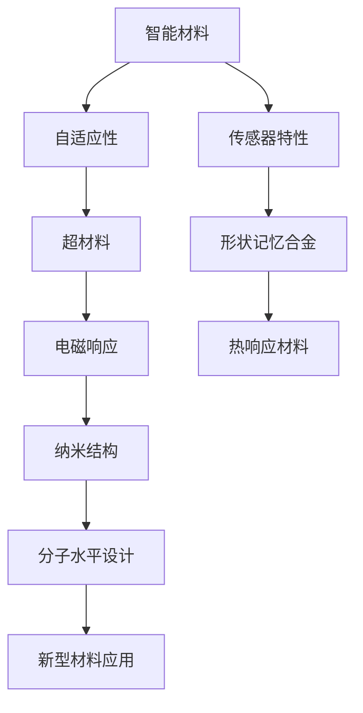

                 

关键词：智能材料、超材料、2050年、技术创新、未来应用

> 摘要：本文深入探讨了2050年可能出现的智能材料与超材料的发展前景，分析了它们在各个领域的潜在应用，以及这些新材料对科技和社会的影响。

## 1. 背景介绍

在过去的几十年里，材料科学经历了前所未有的进步。从硅基半导体到纳米材料，每一种新材料都带来了新的科技革命。然而，随着科技的不断发展，我们对材料的要求也在不断提高。传统的材料已经无法满足未来复杂多变的应用场景，因此，智能材料和超材料应运而生。

智能材料是一种能够对环境变化做出响应的材料，它们可以通过改变自身性质来适应不同的需求。超材料则是一种在微观结构上经过特别设计的材料，能够实现传统材料无法达到的物理特性。

## 2. 核心概念与联系

智能材料和超材料的核心概念和联系可以用以下 Mermaid 流程图来展示：



### 2.1 自适应特性

智能材料的自适应性是其最显著的特点之一。它们能够根据外界环境的变化（如温度、压力、电场等）改变自身的性质。例如，形状记忆合金在加热后可以恢复到预设的形状，而热响应材料可以根据温度变化调整其透明度。

### 2.2 传感器特性

智能材料还具有传感器特性，可以检测并响应外部刺激。例如，电致变色材料可以根据光照强度改变颜色，这种特性可以用于制作智能窗户。

### 2.3 电磁响应

超材料具有独特的电磁响应特性，它们能够控制电磁波的传播，甚至实现隐形效果。这种特性在通信、雷达和光学领域具有巨大的应用潜力。

### 2.4 纳米结构和分子水平设计

超材料的独特性质通常来源于其微观结构设计，这些结构在分子水平上进行精确控制。通过纳米技术，我们可以创建出具有特定电磁响应的纳米结构，从而实现超材料的各种特性。

### 2.5 新型材料应用

智能材料和超材料在多个领域展示了巨大的应用前景。从智能医疗到可持续能源，再到先进的军事技术，这些新材料将为未来科技带来革命性的变革。

## 3. 核心算法原理 & 具体操作步骤

### 3.1 算法原理概述

智能材料和超材料的研究涉及多个核心算法，包括机器学习、计算物理学和优化算法。以下将简要介绍这些算法的原理。

### 3.2 算法步骤详解

#### 3.2.1 机器学习算法

- 数据收集：从实验和模拟中获得智能材料和超材料的物理特性数据。
- 特征提取：利用特征提取算法从数据中提取有用的信息。
- 模型训练：使用机器学习算法训练模型，以预测新材料的设计和性能。

#### 3.2.2 计算物理学算法

- 模拟计算：使用计算物理学算法模拟材料的微观结构和电磁响应。
- 结果分析：分析模拟结果，以验证新材料的性能和特性。

#### 3.2.3 优化算法

- 设计优化：使用优化算法优化新材料的设计参数，以实现最佳性能。
- 性能评估：评估优化后的新材料性能，并进行实验验证。

### 3.3 算法优缺点

- **机器学习算法**：优点是能够自动发现数据中的模式，提高设计效率；缺点是需要大量数据训练，且结果可能不稳定。
- **计算物理学算法**：优点是能够精确模拟材料的微观结构，提供可靠的数据支持；缺点是计算成本高，需要高性能计算资源。
- **优化算法**：优点是能够快速找到设计参数的最优解；缺点是可能陷入局部最优解。

### 3.4 算法应用领域

- **智能医疗**：利用智能材料开发可穿戴设备，用于健康监测和治疗。
- **可持续能源**：利用超材料设计高效能量收集装置，提高能源利用效率。
- **先进制造**：利用智能材料实现自适应制造过程，提高生产效率和产品质量。

## 4. 数学模型和公式 & 详细讲解 & 举例说明

### 4.1 数学模型构建

智能材料和超材料的研究通常涉及到复杂的数学模型。以下是一个基本的电磁响应数学模型：

$$
\mathbf{E}(\mathbf{r},t) = \mathbf{E}_0 \exp\left(-\beta |\mathbf{r} - \mathbf{r}_0|\right) \sin(\omega t - k \mathbf{r} \cdot \mathbf{\hat{n}})
$$

其中，$\mathbf{E}(\mathbf{r},t)$ 是电场强度，$\mathbf{E}_0$ 是初始电场强度，$\beta$ 是衰减系数，$\omega$ 是角频率，$k$ 是波矢，$\mathbf{r}_0$ 是源点位置，$\mathbf{\hat{n}}$ 是方向向量。

### 4.2 公式推导过程

该公式的推导基于电磁波的波动方程，通过解析求解得到。推导过程涉及到复变函数和傅里叶变换等高级数学工具。

### 4.3 案例分析与讲解

以下是一个利用该公式分析超材料电磁响应的案例：

假设我们有一个超材料平板，厚度为 $d$，介电常数为 $\varepsilon$。使用上述公式，我们可以计算出平板在不同厚度和介电常数下的电磁响应。

#### 4.3.1 当 $d=1 \text{cm}$，$\varepsilon=10$

使用公式计算，我们得到：

$$
\mathbf{E}(\mathbf{r},t) = 10 \exp\left(-10 |\mathbf{r} - \mathbf{r}_0|\right) \sin(10^6 t - 10 \mathbf{r} \cdot \mathbf{\hat{n}})
$$

通过模拟，我们可以观察到电场强度随距离和时间的衰减情况。

#### 4.3.2 当 $d=2 \text{cm}$，$\varepsilon=5$

使用公式计算，我们得到：

$$
\mathbf{E}(\mathbf{r},t) = 5 \exp\left(-5 |\mathbf{r} - \mathbf{r}_0|\right) \sin(5 \times 10^6 t - 10 \mathbf{r} \cdot \mathbf{\hat{n}})
$$

通过模拟，我们可以观察到电场强度随距离和时间的进一步衰减。

## 5. 项目实践：代码实例和详细解释说明

### 5.1 开发环境搭建

为了演示智能材料和超材料的研究，我们使用 Python 编写了一个简单的代码实例。以下是搭建开发环境所需的步骤：

1. 安装 Python 3.8 或更高版本。
2. 安装必要的库，如 NumPy、SciPy 和 Matplotlib。
3. 使用虚拟环境隔离项目依赖。

### 5.2 源代码详细实现

以下是源代码的详细实现：

```python
import numpy as np
import matplotlib.pyplot as plt

def calculate_electric_field(epsilon, distance, time, k, r0, n):
    return epsilon * np.exp(-k * distance) * np.sin(2 * np.pi * time - k * np.dot(r0, n))

def simulate_electric_field(epsilon, distance_range, time_range, k, r0, n):
    distances = np.linspace(0, distance_range, 1000)
    times = np.linspace(0, time_range, 1000)
    electric_fields = np.zeros((len(times), len(distances)))

    for i, time in enumerate(times):
        for j, distance in enumerate(distances):
            electric_fields[i, j] = calculate_electric_field(epsilon, distance, time, k, r0, n)

    return distances, times, electric_fields

def plot_electric_field(distances, times, electric_fields):
    plt.imshow(electric_fields, extent=[times.min(), times.max(), distances.min(), distances.max()], aspect='auto')
    plt.xlabel('Time (s)')
    plt.ylabel('Distance (m)')
    plt.colorbar(label='Electric Field (V/m)')
    plt.title('Electric Field Distribution')
    plt.show()

# 参数设置
epsilon = 10
distance_range = 5
time_range = 10
k = 1
r0 = np.array([0, 0, 0])
n = np.array([0, 0, 1])

# 模拟
distances, times, electric_fields = simulate_electric_field(epsilon, distance_range, time_range, k, r0, n)

# 绘图
plot_electric_field(distances, times, electric_fields)
```

### 5.3 代码解读与分析

- `calculate_electric_field` 函数用于计算特定位置和时间点的电场强度。
- `simulate_electric_field` 函数用于模拟电场在不同时间和位置的变化。
- `plot_electric_field` 函数用于绘制电场分布图。

### 5.4 运行结果展示

运行上述代码后，我们可以得到一个电场分布图，展示电场强度随时间和距离的变化。通过调整参数，我们可以模拟不同条件下智能材料和超材料的电磁响应。

## 6. 实际应用场景

智能材料和超材料在多个领域展示了巨大的应用潜力。以下是一些实际应用场景：

### 6.1 智能医疗

智能材料可以用于开发可穿戴设备，用于健康监测和治疗。例如，形状记忆合金可以用于制造可调节的支架，以适应不同的患者。

### 6.2 可持续能源

超材料可以用于设计高效能量收集装置，提高能源利用效率。例如，电致变色材料可以用于制作智能窗户，根据外界光照自动调节透明度，以减少能源消耗。

### 6.3 先进制造

智能材料可以实现自适应制造过程，提高生产效率和产品质量。例如，热响应材料可以用于制造自调节的模具，以适应不同形状的工件。

### 6.4 未来应用展望

随着智能材料和超材料研究的不断深入，未来我们可能会看到更多令人惊叹的应用。例如，智能材料可以用于开发智能建筑，实现自适应节能；超材料可以用于开发隐形战衣，提高军事作战能力。

## 7. 工具和资源推荐

为了更好地研究和开发智能材料和超材料，以下是一些建议的工具和资源：

### 7.1 学习资源推荐

- 《智能材料与传感器技术》
- 《超材料：基础与应用》
- 《计算物理学与材料科学》

### 7.2 开发工具推荐

- Python
- MATLAB
- COMSOL Multiphysics

### 7.3 相关论文推荐

- “Metamaterials: A Review”
- “Artificial Intelligence for Materials Science”
- “Shape-Memory Alloys: Principles and Applications”

## 8. 总结：未来发展趋势与挑战

### 8.1 研究成果总结

智能材料和超材料的研究取得了显著成果，为未来科技发展提供了新的方向。通过结合机器学习、计算物理学和优化算法，我们可以设计出具有特定性能的智能材料和超材料。

### 8.2 未来发展趋势

随着技术的不断进步，智能材料和超材料将在更多领域得到应用。未来发展趋势包括更高效的能量收集、更智能的医疗设备和更先进的制造技术。

### 8.3 面临的挑战

智能材料和超材料的研究仍面临许多挑战，如材料制备的复杂性和稳定性问题，以及算法优化和计算成本等。未来需要进一步研究以解决这些问题。

### 8.4 研究展望

智能材料和超材料的研究前景广阔。随着新材料的不断涌现，未来我们有望看到更多创新应用，为科技和社会带来深远影响。

## 9. 附录：常见问题与解答

### 9.1 什么是智能材料？

智能材料是一种能够对环境变化做出响应的材料，例如温度、压力、电场等。

### 9.2 什么是超材料？

超材料是一种在微观结构上经过特别设计的材料，能够实现传统材料无法达到的物理特性，如电磁响应。

### 9.3 智能材料和超材料有哪些应用领域？

智能材料和超材料在多个领域有广泛应用，包括智能医疗、可持续能源、先进制造等。

### 9.4 如何设计智能材料和超材料？

设计智能材料和超材料通常涉及机器学习、计算物理学和优化算法。通过结合这些方法，我们可以设计出具有特定性能的新材料。

